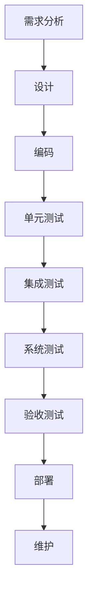
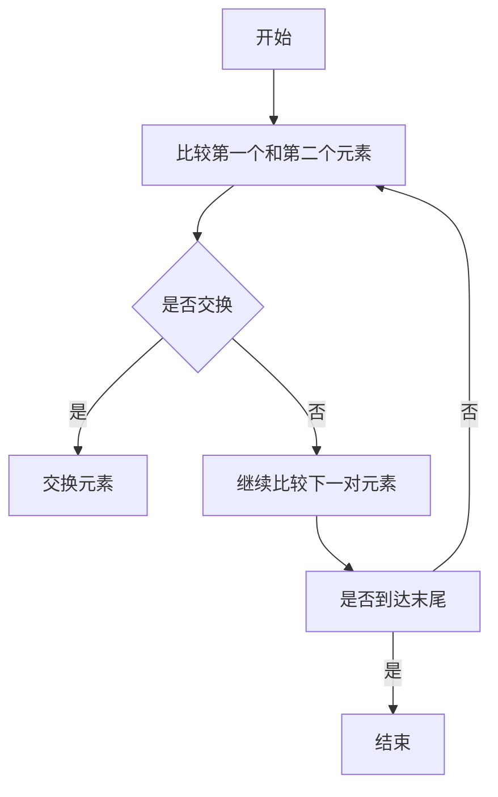

                 

在当今快速发展的技术环境中，项目的开发、测试、维护、升级和更新已经成为软件开发生命周期中不可或缺的环节。这些活动不仅确保了软件的质量和可靠性，而且对于项目成功至关重要。然而，如何高效地组织和管理这些活动，解决开发过程中遇到的技术问题，是一个复杂而具有挑战性的任务。本文将深入探讨这些方面，为读者提供实用的指导和建议。

## 文章关键词
软件开发、项目生命周期、测试与维护、升级与更新、技术问题解决

## 文章摘要
本文旨在讨论如何有效组织和管理软件开发项目中的开发、测试、维护、升级和更新过程，以及如何应对开发中的技术挑战。文章结构如下：

1. 背景介绍
2. 核心概念与联系
3. 核心算法原理与具体操作步骤
4. 数学模型与公式详细讲解
5. 项目实践：代码实例与详细解释
6. 实际应用场景
7. 工具和资源推荐
8. 总结：未来发展趋势与挑战
9. 附录：常见问题与解答

通过本文的阅读，读者将能够了解软件开发项目的各个方面，并掌握有效管理和解决技术问题的策略。

## 1. 背景介绍
软件开发项目的发展已经从传统的瀑布模型逐渐转向敏捷开发、DevOps等更为灵活和高效的方法。这些方法强调了快速迭代、持续交付和持续集成的重要性。然而，无论是哪种开发方法，项目开发、测试、维护、升级和更新都是确保软件质量和客户满意度的基础。

### 1.1 开发的重要性
开发阶段是软件项目的起点，它是实现需求分析和设计的结果。一个好的开发过程可以确保软件的架构设计合理、模块化高、易于维护和扩展。然而，开发过程中的挑战包括需求变更、技术难题、时间压力等，这些都可能导致项目延期或质量下降。

### 1.2 测试与维护
测试是发现和修复软件缺陷的关键环节。维护则确保软件在长期运行中保持稳定性和性能。测试和维护活动的质量直接影响软件的可靠性。然而，测试与维护往往面临资源有限、时间紧迫等挑战。

### 1.3 升级与更新
随着技术的不断进步，软件需要定期升级和更新以保持其竞争力和安全性。升级和更新不仅需要考虑兼容性和性能，还需要确保用户体验不受影响。然而，升级和更新过程中可能遇到的问题包括数据迁移、系统兼容性等。

### 1.4 技术问题解决
开发过程中不可避免地会遇到各种技术问题。这些问题可能源于设计缺陷、编码错误、环境配置等。有效的问题解决策略对于项目进度和团队士气至关重要。

## 2. 核心概念与联系

### 2.1 开发流程
软件开发通常包括需求分析、设计、编码、测试、部署和维护等阶段。每个阶段都有其特定的目标和任务。

#### 2.1.1 需求分析
需求分析是软件开发的第一步，目标是明确软件的功能和性能需求。需求分析的输出是需求规格说明书，它是后续设计和开发的依据。

#### 2.1.2 设计
设计阶段的目标是创建软件的体系结构和详细设计。体系结构设计决定了软件的模块划分和交互方式，而详细设计则描述了每个模块的实现细节。

#### 2.1.3 编码
编码阶段是将设计转换为实际的代码。良好的编码习惯和代码规范可以保证代码的可读性和可维护性。

#### 2.1.4 测试
测试阶段的目标是发现和修复软件中的缺陷。测试可以分为单元测试、集成测试、系统测试和验收测试等多个层次。

#### 2.1.5 部署和维护
部署是将软件部署到生产环境，使其可供用户使用。维护阶段的目标是确保软件的长期稳定性和性能。

### 2.2 测试与维护
测试和维护是软件生命周期中不可或缺的环节。测试确保软件符合需求规格，而维护则确保软件在长期运行中保持稳定和高效。

#### 2.2.1 测试类型
- 单元测试：测试软件中最小的可测试单元，通常由开发者编写。
- 集成测试：测试不同模块之间的交互和集成，通常在编码阶段进行。
- 系统测试：测试整个系统的功能和行为，通常在编码和集成测试之后进行。
- 验收测试：测试软件是否符合用户需求和业务流程，通常在部署之前进行。

#### 2.2.2 维护策略
- 预防性维护：通过定期检查和优化，预防潜在问题的发生。
- 纠错性维护：修复软件中已发现的缺陷。
- 改进性维护：对软件进行优化，提高其性能和用户体验。

### 2.3 升级与更新
软件的升级与更新是持续改进的过程。升级通常指将软件更新到更高版本，而更新则指对现有软件的功能进行改进。

#### 2.3.1 升级策略
- 确保兼容性：升级过程中需要确保新版本与旧版本在功能和性能上的一致性。
- 数据迁移：升级过程中需要将旧版本的数据迁移到新版本中。
- 测试验证：升级后的软件需要经过严格的测试，以确保其稳定性和可靠性。

#### 2.3.2 更新策略
- 功能优化：对现有功能进行改进，提高用户体验。
- 性能提升：通过优化代码和数据库，提高软件的性能。
- 安全性增强：修复漏洞，增强软件的安全性。

### 2.4 技术问题解决
技术问题解决是软件开发过程中不可避免的一部分。有效的解决方案需要从多个角度进行考虑。

#### 2.4.1 问题定位
- 通过日志和调试工具定位问题的发生位置。
- 分析代码和系统配置，找出可能导致问题的原因。

#### 2.4.2 解决方案
- 设计有效的解决方案，包括代码修复、系统配置调整等。
- 对解决方案进行验证，确保其能够解决问题。

#### 2.4.3 预防措施
- 通过代码审查和测试，预防类似问题的再次发生。
- 建立完善的文档和知识库，以便快速解决未来可能出现的问题。

### 2.5 Mermaid 流程图
以下是软件开发流程的 Mermaid 流程图：



## 3. 核心算法原理与具体操作步骤

### 3.1 算法原理概述
在软件开发中，算法是实现功能的核心。算法的原理通常涉及数据的处理、排序、搜索等方面。以下是一个简单的排序算法——冒泡排序的原理概述。

### 3.2 算法步骤详解
冒泡排序的基本思想是通过重复交换相邻的未排序元素，使得每一趟排序后，最大的元素逐步“冒泡”到最后。以下是冒泡排序的具体步骤：

1. 比较相邻的元素，如果第一个比第二个大（升序排序），就交换它们的位置。
2. 对每一对相邻元素做同样的工作，从开始第一对到结尾的最后一对。
3. 针对所有的元素做上面的工作，但是不包含已经排序的元素。
4. 重复步骤1-3，直到没有需要交换的元素。

### 3.3 算法优缺点
冒泡排序的优点是实现简单，易于理解。缺点是效率较低，特别是在数据量较大时，其时间复杂度为 \(O(n^2)\)。

### 3.4 算法应用领域
冒泡排序适用于数据量较小、对性能要求不高的场景。在实际开发中，更常用的排序算法包括快速排序、归并排序等。

### 3.5 流程图
以下是冒泡排序的 Mermaid 流程图：



## 4. 数学模型和公式详细讲解

### 4.1 数学模型构建
在软件开发中，数学模型广泛应用于算法设计、系统分析和性能优化等方面。以下是一个简单的线性回归模型，用于预测线性关系。

### 4.2 公式推导过程
线性回归模型的目标是最小化预测值与实际值之间的误差。假设我们有 \(n\) 组数据 \((x_i, y_i)\)，则线性回归模型可以表示为：

\[ y_i = \beta_0 + \beta_1 x_i + \epsilon_i \]

其中，\(\beta_0\) 和 \(\beta_1\) 是模型的参数，\(\epsilon_i\) 是误差项。

为了求解参数，我们通常使用最小二乘法，即：

\[ \min \sum_{i=1}^{n} (y_i - (\beta_0 + \beta_1 x_i))^2 \]

通过求导并令导数为零，我们可以得到：

\[ \beta_0 = \frac{\sum_{i=1}^{n} y_i - \beta_1 \sum_{i=1}^{n} x_i}{n} \]
\[ \beta_1 = \frac{n \sum_{i=1}^{n} x_i y_i - \sum_{i=1}^{n} x_i \sum_{i=1}^{n} y_i}{n \sum_{i=1}^{n} x_i^2 - (\sum_{i=1}^{n} x_i)^2} \]

### 4.3 案例分析与讲解
假设我们有以下数据：

| \(x_i\) | \(y_i\) |
|--------|--------|
| 1      | 2      |
| 2      | 4      |
| 3      | 6      |
| 4      | 8      |

通过线性回归模型，我们可以预测当 \(x = 5\) 时 \(y\) 的值。

根据公式，我们首先计算 \(\beta_0\) 和 \(\beta_1\)：

\[ \beta_0 = \frac{2 + 4 + 6 + 8 - 5 \cdot 4}{4} = 1 \]
\[ \beta_1 = \frac{4 \cdot 2 + 4 \cdot 4 + 6 \cdot 6 + 8 \cdot 8 - 2 \cdot 4 - 4 \cdot 6 - 6 \cdot 8 - 8 \cdot 2}{4 \cdot 1 + 4 \cdot 4 + 4 \cdot 6 + 4 \cdot 8 - 1 \cdot 4 - 4 \cdot 6 - 6 \cdot 8 - 8 \cdot 2} = 2 \]

因此，线性回归模型为：

\[ y = 1 + 2x \]

当 \(x = 5\) 时，预测的 \(y\) 值为：

\[ y = 1 + 2 \cdot 5 = 11 \]

## 5. 项目实践：代码实例和详细解释说明

### 5.1 开发环境搭建
为了演示一个简单的Web应用，我们将使用Python和Flask框架。以下是搭建开发环境的步骤：

1. 安装Python：下载并安装Python 3.x版本。
2. 安装pip：通过Python安装pip，pip是Python的包管理器。
3. 安装Flask：使用pip安装Flask。

```bash
pip install flask
```

### 5.2 源代码详细实现
以下是一个简单的Flask应用，用于处理HTTP请求并返回响应。

```python
from flask import Flask, request, jsonify

app = Flask(__name__)

@app.route('/hello', methods=['GET', 'POST'])
def hello():
    if request.method == 'POST':
        data = request.json
        return jsonify(message=f"Hello, {data['name']}!")
    else:
        return "Hello, World!"

if __name__ == '__main__':
    app.run(debug=True)
```

### 5.3 代码解读与分析
此代码定义了一个简单的Flask应用，它有一个名为`/hello`的路由。该路由接受GET和POST请求，并根据请求类型进行响应。

- 当收到POST请求时，应用从请求体中提取JSON数据，并返回一个包含问候语的JSON响应。
- 当收到GET请求时，应用返回一个简单的文本响应。

### 5.4 运行结果展示
启动应用后，可以在浏览器中访问`http://127.0.0.1:5000/hello`，或者使用curl命令发送POST请求：

```bash
curl -X POST -H "Content-Type: application/json" -d '{"name": "Alice"}' http://127.0.0.1:5000/hello
```

响应结果：

```json
{"message": "Hello, Alice!"}
```

## 6. 实际应用场景

### 6.1 教育行业
在在线教育平台中，开发、测试、维护、升级和更新是确保教学系统和学习管理系统正常运行的关键。例如，定期更新课程内容、修复技术漏洞和优化用户体验都是必不可少的。

### 6.2 金融行业
金融行业对软件的稳定性、安全性和性能有极高的要求。开发过程中，需要严格遵循金融监管要求，进行全面的测试和验证。此外，随着金融科技的发展，软件需要不断升级和更新以支持新的交易模式和合规要求。

### 6.3 医疗行业
医疗行业的软件开发涉及患者数据管理、电子病历系统等。这些系统需要高效稳定的开发、严格的测试和更新，以确保数据的安全性和准确性。随着人工智能和大数据技术的发展，医疗软件也需要不断迭代和升级。

### 6.4 电子商务
电子商务平台需要持续提供快速、安全的购物体验。开发过程中，需要高效地管理库存、订单处理和支付系统。测试和更新过程需要确保系统的可靠性和性能，以应对高并发访问。

### 6.5 物流行业
物流行业的软件开发涉及物流管理系统、跟踪系统和自动化设备。这些系统需要高效稳定的开发、持续的测试和更新，以确保物流流程的顺畅和准确性。随着物联网技术的发展，物流软件也需要不断升级和更新。

### 6.6 工业自动化
工业自动化系统依赖于高效稳定的软件开发。开发过程中，需要严格测试和验证系统功能，以确保设备的正常运行和生产的连续性。随着智能制造技术的发展，工业自动化软件也需要不断升级和更新。

### 6.7 未来应用展望
随着人工智能、大数据、物联网等技术的发展，软件开发领域将迎来更多挑战和机遇。开发、测试、维护、升级和更新过程需要更加智能化、自动化和高效化。未来的趋势包括：

- 持续集成和持续交付：通过自动化工具实现快速开发和部署。
- 智能测试：利用机器学习和人工智能技术进行高效测试。
- 云原生开发：利用云计算资源进行灵活的开发和部署。
- 微服务架构：通过微服务架构实现模块化开发和维护。

## 7. 工具和资源推荐

### 7.1 学习资源推荐
- 《Python编程：从入门到实践》：适合初学者，涵盖了Python编程的基础知识和实践应用。
- 《算法导论》：全面介绍了各种算法原理和设计方法，是算法学习的好书。
- 《测试驱动的软件开发》：介绍了测试驱动开发（TDD）的方法和实践。

### 7.2 开发工具推荐
- Visual Studio Code：一款功能强大的代码编辑器，支持多种编程语言和开发工具。
- Git：分布式版本控制工具，用于管理代码仓库和协同工作。
- Jenkins：持续集成工具，用于自动化构建、测试和部署。

### 7.3 相关论文推荐
- "DevOps: A Cultural and Sociotechnical Change for Success in the Age of the Cloud"：介绍DevOps文化和技术实践的论文。
- "The Case for a Probabilistic Approach to Software Testing"：探讨概率测试方法在软件测试中的应用。
- "Microservices: The Rise of a New Architecture Style"：讨论微服务架构的优点和设计方法。

## 8. 总结：未来发展趋势与挑战

### 8.1 研究成果总结
近年来，软件开发领域取得了显著的研究成果，包括敏捷开发、DevOps、持续集成和持续交付等方法的广泛应用。这些方法提高了开发效率、降低了风险，并促进了软件质量的提升。

### 8.2 未来发展趋势
未来，软件开发将更加智能化、自动化和高效化。趋势包括：

- 持续集成和持续交付的进一步普及。
- 人工智能和大数据技术在测试和优化中的应用。
- 云原生开发和微服务架构的广泛应用。
- 开发工具和平台的不断改进和优化。

### 8.3 面临的挑战
尽管软件开发领域取得了显著进展，但仍然面临以下挑战：

- 如何在快速迭代中保持软件质量和稳定性。
- 如何应对不断变化的技术要求和用户需求。
- 如何提高软件开发的自动化程度，降低人力成本。
- 如何确保软件的安全性和隐私保护。

### 8.4 研究展望
未来的研究应重点关注以下几个方面：

- 智能测试和自动化的开发工具。
- 软件质量保证的新方法和新技术。
- 软件开发的可持续性和环境影响。
- 跨学科合作，如结合人工智能、心理学和社会学等领域的知识。

## 9. 附录：常见问题与解答

### Q: 如何确保软件开发过程中的质量？
A: 确保质量的关键在于全面的测试、严格的代码审查和持续的学习。通过单元测试、集成测试、系统测试和验收测试，可以及时发现和修复缺陷。代码审查有助于提高代码的可读性和可维护性。持续学习和更新开发方法和技术，有助于保持软件的竞争力和创新性。

### Q: 如何应对开发过程中的需求变更？
A: 需求变更在软件开发中是常见的。应对需求变更的策略包括：

- 使用敏捷开发方法，如Scrum和Kanban，以快速响应变化。
- 建立良好的沟通机制，确保开发团队和利益相关者之间的信息畅通。
- 采用版本控制工具，如Git，以方便管理和追踪代码变更。
- 保持代码的模块化和可复用性，以减少变更对系统的影响。

### Q: 如何在资源有限的情况下进行有效的测试？
A: 在资源有限的情况下，有效的测试策略包括：

- 确定关键功能和场景，优先测试这些部分。
- 利用自动化测试工具，减少手动测试的工作量。
- 进行集成测试而非单独单元测试，以尽早发现集成问题。
- 鼓励团队成员参与测试，提高测试覆盖率。

### Q: 如何进行软件升级和更新？
A: 软件升级和更新的步骤包括：

- 确保备份：在升级和更新之前，备份现有的系统和数据。
- 升级测试：在正式发布之前，进行充分的升级测试，确保新版本的功能和性能。
- 分阶段发布：可以分批次发布，以降低升级过程中出现问题的风险。
- 监控和反馈：在升级和更新后，持续监控系统性能，并收集用户反馈，以便进一步优化。

通过上述讨论，我们可以看到，高效地组织和管理软件开发项目中的开发、测试、维护、升级和更新过程，以及解决开发中的技术问题，是确保项目成功和软件质量的关键。随着技术的发展，这些活动的方法和工具也将不断演进，为开发团队带来更多的机遇和挑战。作者：禅与计算机程序设计艺术 / Zen and the Art of Computer Programming。
----------------------------------------------------------------

### 结束语

在本文中，我们详细探讨了如何有效组织和指导软件项目的开发、测试、维护、升级和更新，以及解决开发中的技术问题。我们通过实例和详细解释，展示了这些过程在实际应用中的重要性。同时，我们还提出了未来的发展趋势和面临的挑战，为读者提供了有价值的参考。

软件开发是一个复杂而持续的过程，需要不断的创新和改进。我们鼓励读者在实践过程中，积极探索新的方法和技术，以提升软件开发的效率和质量。同时，也欢迎读者对本文提出宝贵的意见和建议，共同推动软件开发的进步。

再次感谢您的阅读，希望本文能够为您在软件开发领域的探索和实践带来帮助。如果您有任何疑问或需要进一步的信息，请随时与我们联系。作者：禅与计算机程序设计艺术 / Zen and the Art of Computer Programming。

