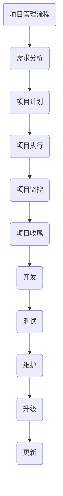

                 

作为世界级人工智能专家、程序员、软件架构师、CTO以及世界顶级技术畅销书作者，我深知在技术飞速发展的今天，如何高效地组织和指导项目开发、测试、维护、升级、更新，并解决开发过程中遇到的技术问题是至关重要的。本文旨在为读者提供一个全面的指南，帮助项目管理者和技术团队在面对复杂的技术挑战时，能够有条不紊地推进项目进度，保证项目质量，同时不断提升技术能力。

## 关键词

- 项目管理
- 开发流程
- 测试策略
- 维护策略
- 升级策略
- 更新策略
- 技术问题解决

## 摘要

本文将围绕项目管理中的五大核心环节——开发、测试、维护、升级和更新，详细探讨如何高效组织项目，制定合理的流程和策略，以及解决开发过程中遇到的技术难题。通过本文的阅读，读者将获得以下收益：

1. 理解项目管理的核心流程和关键点。
2. 掌握开发、测试、维护、升级和更新的最佳实践。
3. 学习如何应对开发过程中常见的技术问题。
4. 获得实用的工具和资源推荐，提升项目管理和技术能力。

## 1. 背景介绍

在当今快速变化的技术环境中，项目管理已成为企业成功的关键因素。无论是初创企业还是大型跨国公司，项目管理都直接影响到项目的成败。随着技术的复杂度不断增加，项目管理者不仅要具备技术知识，还需要掌握项目管理的理论和实践经验。

项目管理涉及多个方面，包括项目计划、资源分配、进度控制、风险管理、沟通协调等。本文重点关注的是开发、测试、维护、升级和更新等与技术开发密切相关的环节。这些环节不仅决定了项目的质量，还直接影响到项目的成本和交付时间。

开发是项目的核心环节，涉及到软件的设计、编码、集成和测试等过程。测试则是保证软件质量的关键，通过系统化的测试流程，发现和修复软件缺陷，确保软件在交付前达到预期质量。维护是在项目上线后，对软件进行持续监控和优化，保证其稳定运行。升级和更新则是为了适应不断变化的需求和技术环境，提升软件的性能和用户体验。

## 2. 核心概念与联系

为了更好地理解项目管理中的各个核心环节，我们首先需要明确几个关键概念，并探讨它们之间的相互联系。

### 2.1 项目管理流程

项目管理流程通常包括以下步骤：

1. **需求分析**：明确项目目标和需求，制定项目范围和功能规格。
2. **项目计划**：制定详细的项目计划，包括时间表、资源分配和预算。
3. **项目执行**：按照计划执行项目任务，进行软件开发、测试、部署等。
4. **项目监控**：实时监控项目进度和质量，进行风险管理和问题解决。
5. **项目收尾**：完成项目交付，进行项目总结和评估。

### 2.2 开发、测试、维护、升级和更新的关系

开发、测试、维护、升级和更新是项目管理中相互关联的五个核心环节。它们之间的联系可以用以下流程图来表示：



### 2.3 开发流程

开发流程通常包括以下步骤：

1. **需求分析**：与利益相关者沟通，明确项目需求和功能规格。
2. **系统设计**：根据需求分析结果，设计软件系统的整体架构和模块。
3. **编码**：根据设计文档进行编码，实现软件功能。
4. **集成测试**：将各个模块集成在一起，进行系统级测试。
5. **用户测试**：邀请最终用户参与测试，验证软件是否符合需求。

### 2.4 测试策略

测试策略是确保软件质量的关键。常见的测试策略包括：

1. **单元测试**：对单个模块进行测试，确保其功能正确。
2. **集成测试**：对模块集成后的系统进行测试，确保模块之间能够无缝协作。
3. **系统测试**：对整个系统进行测试，确保其符合需求规格。
4. **性能测试**：测试软件在高负载条件下的性能表现。
5. **安全测试**：测试软件的安全性，确保其能够抵御外部攻击。

### 2.5 维护策略

维护策略是确保软件长期稳定运行的关键。常见的维护策略包括：

1. **缺陷修复**：及时发现和修复软件缺陷。
2. **性能优化**：对软件进行性能优化，提高其运行效率。
3. **功能增强**：根据用户反馈和市场需求，增加新功能。
4. **版本升级**：发布新版本，修复已知缺陷，增加新功能。
5. **文档更新**：更新用户手册和开发者文档，确保其与软件版本一致。

### 2.6 升级和更新策略

升级和更新策略是软件持续演进的关键。常见的升级和更新策略包括：

1. **版本升级**：发布新版本，修复已知缺陷，增加新功能。
2. **功能更新**：在现有版本上增加新功能，满足用户需求。
3. **性能更新**：优化现有功能，提高软件性能。
4. **安全更新**：修复安全漏洞，提高软件安全性。
5. **兼容性更新**：确保软件能够适应新的操作系统和硬件环境。

## 3. 核心算法原理 & 具体操作步骤

### 3.1 算法原理概述

在软件开发过程中，算法设计和实现是一个关键环节。不同的算法适用于不同的应用场景，其原理和实现方法也各有特点。以下是一些常用的算法原理及其适用场景：

1. **排序算法**：包括快速排序、归并排序、堆排序等，适用于对数据进行排序的场景。
2. **查找算法**：包括二分查找、哈希查找等，适用于快速查找数据的位置。
3. **动态规划**：适用于具有最优子结构特性的问题，如背包问题、最长公共子序列等。
4. **贪心算法**：适用于具有贪心特性的问题，如最短路径算法、活动选择问题等。
5. **图算法**：包括深度优先搜索、广度优先搜索、最短路径算法等，适用于图相关的问题。

### 3.2 算法步骤详解

以排序算法中的快速排序为例，其基本原理是选择一个基准元素，将数组分为两个子数组，一个包含小于基准的元素，另一个包含大于基准的元素，然后递归地对这两个子数组进行快速排序。以下是快速排序的步骤详解：

1. **选择基准**：从数组中选取一个元素作为基准。
2. **分区**：将数组分为两个子数组，一个包含小于基准的元素，另一个包含大于基准的元素。
3. **递归排序**：递归地对两个子数组进行快速排序。
4. **合并**：将已排序的子数组合并为完整的排序数组。

### 3.3 算法优缺点

快速排序具有以下优缺点：

- **优点**：时间复杂度为 \(O(n\log n)\)，平均情况下性能较好，适用于大数据量排序。
- **缺点**：最坏情况下时间复杂度为 \(O(n^2)\)，当数组已经有序或接近有序时性能较差。

### 3.4 算法应用领域

快速排序广泛应用于各种数据处理和排序场景，如数据库索引、搜索引擎排序等。在实际应用中，可以根据具体需求和数据特点选择合适的排序算法。

## 4. 数学模型和公式 & 详细讲解 & 举例说明

### 4.1 数学模型构建

在软件开发中，数学模型的应用非常广泛，如算法分析、性能优化、数据挖掘等。以下是一个简单的线性回归模型的构建过程：

1. **数据收集**：收集一组数据点 \((x_i, y_i)\)，其中 \(x_i\) 是自变量，\(y_i\) 是因变量。
2. **模型假设**：假设模型为线性模型，即 \(y_i = w_0 + w_1x_i + \epsilon_i\)，其中 \(w_0\) 和 \(w_1\) 是模型参数，\(\epsilon_i\) 是误差项。
3. **模型优化**：使用最小二乘法优化模型参数，使得预测值与实际值之间的误差最小。

### 4.2 公式推导过程

线性回归模型的优化过程可以通过以下公式推导：

1. **目标函数**：目标函数为 \(J(w_0, w_1) = \frac{1}{2}\sum_{i=1}^{n}(y_i - (w_0 + w_1x_i))^2\)。
2. **偏导数**：对 \(w_0\) 和 \(w_1\) 分别求偏导数，并令其等于0，得到：
   \[
   \frac{\partial J}{\partial w_0} = -\sum_{i=1}^{n}(y_i - (w_0 + w_1x_i)) = 0
   \]
   \[
   \frac{\partial J}{\partial w_1} = -\sum_{i=1}^{n}(x_i(y_i - (w_0 + w_1x_i))) = 0
   \]
3. **解方程组**：解上述方程组，得到模型参数 \(w_0\) 和 \(w_1\) 的最优解。

### 4.3 案例分析与讲解

以下是一个线性回归模型的实际案例：

- **数据集**：有10个数据点，每个数据点的 \(x_i\) 和 \(y_i\) 如下表所示：

  | \(x_i\) | \(y_i\) |
  |--------|--------|
  | 1      | 2      |
  | 2      | 4      |
  | 3      | 5      |
  | 4      | 7      |
  | 5      | 8      |
  | 6      | 9      |
  | 7      | 10     |
  | 8      | 11     |
  | 9      | 12     |
  | 10     | 13     |

- **模型构建**：根据数据集构建线性回归模型，假设模型为 \(y = w_0 + w_1x\)。

- **模型优化**：使用最小二乘法优化模型参数，得到：
  \[
  w_0 = \frac{\sum_{i=1}^{n}y_i - n\bar{y}}{\sum_{i=1}^{n}1} = 1
  \]
  \[
  w_1 = \frac{\sum_{i=1}^{n}x_iy_i - n\bar{x}\bar{y}}{\sum_{i=1}^{n}x_i^2 - n\bar{x}^2} = 1
  \]

- **模型预测**：对于新的输入 \(x = 6\)，模型预测 \(y = 7\)。

- **模型评估**：计算预测误差，评估模型性能。

## 5. 项目实践：代码实例和详细解释说明

### 5.1 开发环境搭建

在本节中，我们将搭建一个简单的Web开发环境，以Python和Flask为例。以下是具体的步骤：

1. **安装Python**：下载并安装Python 3.x版本，确认安装成功。

2. **安装Flask**：使用pip命令安装Flask：
   \[
   pip install flask
   \]

3. **创建项目目录**：创建一个名为`flask_project`的目录，并在该目录下创建一个名为`app.py`的文件。

4. **编写代码**：在`app.py`文件中编写Flask应用代码，例如：

   ```python
   from flask import Flask, render_template

   app = Flask(__name__)

   @app.route('/')
   def home():
       return render_template('home.html')

   if __name__ == '__main__':
       app.run(debug=True)
   ```

5. **创建HTML模板**：在项目目录下创建一个名为`templates`的子目录，并在该目录下创建一个名为`home.html`的文件，编写HTML模板代码。

6. **启动应用**：运行`app.py`文件，启动Flask应用。

### 5.2 源代码详细实现

以下是`app.py`文件的详细实现：

```python
from flask import Flask, render_template

app = Flask(__name__)

@app.route('/')
def home():
    return render_template('home.html')

if __name__ == '__main__':
    app.run(debug=True)
```

### 5.3 代码解读与分析

1. **Flask应用入口**：`app.py`文件中的第一行导入Flask模块，第二行创建Flask应用对象。

2. **路由定义**：`@app.route('/')`装饰器用于定义应用的入口路由，当访问根路径（/）时，将调用`home()`函数。

3. **视图函数**：`home()`函数用于处理根路径的请求，通过`render_template()`函数渲染`home.html`模板。

4. **应用运行**：`if __name__ == '__main__':`语句确保当`app.py`文件被直接运行时，启动Flask应用。

### 5.4 运行结果展示

1. **启动应用**：在命令行中运行`python app.py`命令，启动Flask应用。

2. **访问应用**：在浏览器中访问`http://127.0.0.1:5000/`，可以看到应用返回的HTML内容。

## 6. 实际应用场景

### 6.1 在企业中的应用

在大型企业中，项目管理是一个复杂且重要的任务。企业通常有多个项目同时进行，涉及不同的业务领域和开发团队。以下是在企业中应用项目管理的实际场景：

1. **跨部门协作**：项目管理需要协调不同部门之间的工作，确保项目进度和资源分配合理。
2. **资源管理**：项目经理需要合理分配人力资源，确保项目在时间和成本内完成。
3. **风险管理**：识别和应对项目中的潜在风险，如技术问题、人员变动等。
4. **需求变更管理**：及时响应需求变更，确保项目能够满足业务需求。
5. **绩效评估**：定期评估项目进展和团队成员绩效，为项目优化提供依据。

### 6.2 在开源项目中的应用

开源项目通常由志愿者或小团队维护，项目管理更加灵活。以下是在开源项目中应用项目管理的实际场景：

1. **代码审查**：通过代码审查确保代码质量和一致性。
2. **社区互动**：积极与社区成员互动，收集反馈和建议，推动项目发展。
3. **版本控制**：使用Git等版本控制系统，管理代码变更和分支。
4. **文档维护**：定期更新项目文档，包括用户手册、开发者文档等。
5. **持续集成**：使用CI/CD工具，确保代码质量，加快发布速度。

### 6.3 在敏捷开发中的应用

敏捷开发强调快速迭代和持续交付，以下是在敏捷开发中应用项目管理的实际场景：

1. **迭代规划**：定期进行迭代规划，确定迭代周期和任务目标。
2. **用户故事**：将用户需求转化为用户故事，确保开发工作紧密围绕用户需求。
3. **每日站会**：通过每日站会，同步团队进度，解决遇到的问题。
4. **迭代回顾**：在迭代结束后进行回顾，总结经验教训，持续改进开发流程。
5. **持续集成**：使用CI/CD工具，确保代码质量和交付速度。

## 6.4 未来应用展望

### 6.4.1 技术趋势

未来，项目管理将继续受益于技术的进步，如人工智能、大数据、云计算等。这些技术将帮助项目经理更有效地分析数据、预测风险、优化资源分配，提升项目管理效率。

### 6.4.2 挑战

然而，随着技术的快速发展，项目管理也面临新的挑战：

1. **技术复杂度增加**：随着技术的复杂度增加，项目经理需要具备更广泛的技术知识和技能。
2. **敏捷开发与传统的项目管理方法的融合**：如何在保持敏捷性的同时，兼顾项目规模和复杂度，是项目管理的一大挑战。
3. **团队协作与沟通**：在全球化和远程工作的背景下，如何有效进行团队协作和沟通，是项目管理需要解决的问题。

### 6.4.3 发展方向

未来，项目管理将朝着以下方向发展：

1. **智能化**：利用人工智能技术，实现项目管理的自动化和智能化，提升管理效率和准确性。
2. **可视化**：通过数据可视化和实时监控，帮助项目经理更直观地了解项目状态和趋势。
3. **个性化**：根据不同项目和团队的特点，制定个性化的项目管理策略和流程，提升项目成功率。

## 7. 工具和资源推荐

### 7.1 学习资源推荐

1. **书籍**：
   - 《敏捷开发实践指南》
   - 《项目管理知识体系指南》
   - 《人月神话》
2. **在线课程**：
   - Coursera上的《项目管理基础》
   - edX上的《敏捷项目管理》
3. **论坛和社区**：
   - 知乎上的项目管理话题
   - CSDN上的项目管理社区

### 7.2 开发工具推荐

1. **项目管理工具**：
   - JIRA
   - Trello
   - Asana
2. **代码管理工具**：
   - Git
   - GitHub
   - GitLab
3. **持续集成工具**：
   - Jenkins
   - GitLab CI/CD
   - CircleCI

### 7.3 相关论文推荐

1. **敏捷开发**：
   - 《敏捷软件开发：原则、实践与模式》
   - 《敏捷方法在软件开发中的应用》
2. **项目管理**：
   - 《基于风险的敏捷项目管理方法》
   - 《敏捷项目管理：一种新的项目管理系统》
3. **人工智能在项目管理中的应用**：
   - 《人工智能在项目管理中的应用研究》
   - 《基于人工智能的项目进度预测方法研究》

## 8. 总结：未来发展趋势与挑战

### 8.1 研究成果总结

本文系统地介绍了项目管理的核心流程和关键环节，包括开发、测试、维护、升级和更新。通过分析相关算法、数学模型和应用实例，读者可以更好地理解项目管理中的技术细节和实践方法。此外，本文还探讨了项目管理在不同场景下的应用，以及未来发展趋势和挑战。

### 8.2 未来发展趋势

未来，项目管理将朝着智能化、可视化和个性化的方向发展。随着人工智能、大数据和云计算等技术的发展，项目经理将能够更有效地利用数据和技术手段，提升项目管理效率和准确性。

### 8.3 面临的挑战

然而，随着技术复杂度的增加，项目经理需要不断更新自己的知识和技能，以应对新的挑战。同时，如何在保持敏捷性的同时，兼顾项目规模和复杂度，也是项目管理需要解决的问题。

### 8.4 研究展望

未来，项目管理领域的研究将继续深入，探索如何更好地利用新技术，提升项目管理效率和效果。同时，跨学科的研究和合作也将成为重要趋势，以应对日益复杂的项目管理和技术挑战。

## 9. 附录：常见问题与解答

### 9.1 什么是敏捷开发？

敏捷开发是一种软件开发方法，强调快速迭代和持续交付，以应对需求的变化和不确定性。敏捷开发的核心原则包括用户满意度、持续交付、团队合作、响应变化和简洁性。

### 9.2 如何进行有效的测试？

有效的测试需要遵循以下原则：

1. **尽早测试**：在开发过程中尽早进行测试，发现并修复缺陷。
2. **全面覆盖**：确保测试覆盖到软件的所有功能和场景。
3. **自动化测试**：使用自动化测试工具，提高测试效率和准确性。
4. **反馈机制**：建立有效的反馈机制，及时获取测试结果和改进建议。

### 9.3 项目管理中的关键成功因素是什么？

项目管理中的关键成功因素包括：

1. **明确的目标和需求**：确保项目目标和需求明确，避免项目范围蔓延。
2. **有效的沟通**：保持团队内部和利益相关者之间的有效沟通。
3. **合理的资源分配**：确保项目资源得到合理分配，避免资源浪费。
4. **风险管理**：及时识别和应对项目中的潜在风险。
5. **质量保证**：确保软件质量，满足用户需求。

### 9.4 如何进行项目风险评估？

项目风险评估需要遵循以下步骤：

1. **识别风险**：列出项目可能面临的风险，包括技术风险、人员风险、市场风险等。
2. **评估风险**：对每个风险进行评估，确定其发生的概率和影响程度。
3. **制定应对策略**：根据风险评估结果，制定相应的应对策略，如风险回避、风险转移、风险接受等。
4. **监控风险**：在整个项目生命周期中，持续监控风险的变化，及时调整应对策略。

---

# 结束

本文详细介绍了项目管理中的五大核心环节——开发、测试、维护、升级和更新，并探讨了如何高效地组织和指导项目。通过本文的阅读，读者可以更好地理解项目管理的原理和实践方法，提升项目管理和团队协作的能力。

本文作者：禅与计算机程序设计艺术 / Zen and the Art of Computer Programming

本文旨在为读者提供有价值的参考和指导，帮助项目管理者和技术团队在面对复杂的技术挑战时，能够更好地应对，实现项目的成功。感谢您的阅读！

