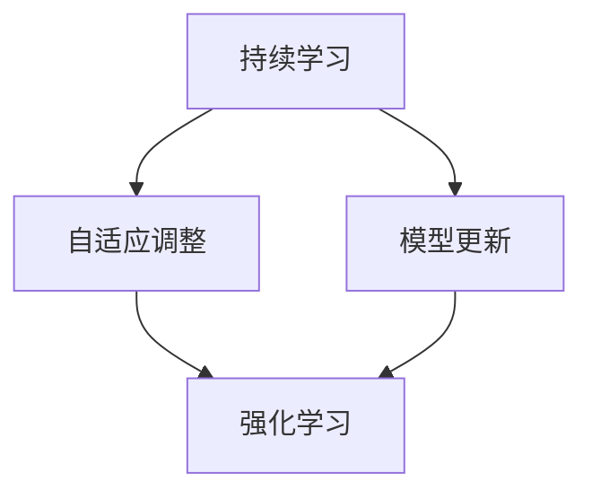

                 

终身学习（Lifelong Learning，简称LLL）在当今快速发展的技术时代变得尤为重要。它不仅是个人职业发展的关键，也是社会进步和创新的核心动力。本文将深入探讨终身学习的原理，并通过代码实例详细讲解其在实际应用中的具体实现。作者：禅与计算机程序设计艺术 / Zen and the Art of Computer Programming。

## 关键词
- 终身学习
- 机器学习
- 持续更新
- 自适应学习
- 强化学习

## 摘要
本文旨在介绍终身学习的核心原理及其在人工智能领域的应用。通过详细的算法原理和代码实例，读者将了解如何通过算法实现持续学习和自适应调整。文章还将探讨终身学习在未来技术发展中的潜在影响和面临的挑战。

## 1. 背景介绍

### 1.1 终身学习的定义
终身学习是一种持续的过程，旨在通过不断学习来提升个人的知识、技能和态度。它不仅仅局限于学校教育，而是贯穿于人的一生，从工作到退休。随着信息技术的飞速发展，终身学习成为保持竞争力、适应不断变化的工作环境和社会需求的必要手段。

### 1.2 机器学习与持续更新
机器学习（Machine Learning，ML）是一种使计算机系统能够从数据中学习并做出决策的技术。然而，机器学习模型一旦训练完成，就很难适应新的数据和变化。因此，持续更新和终身学习成为机器学习领域的重要研究方向。通过不断学习新的数据，模型可以保持其有效性和适应性。

### 1.3 自适应学习与强化学习
自适应学习（Adaptive Learning）是一种让学习系统能够根据不同情境调整学习策略的方法。强化学习（Reinforcement Learning，RL）是一种通过奖励机制引导系统学习的过程。这两种方法在实现终身学习方面具有显著优势。

## 2. 核心概念与联系
### 2.1 终身学习的核心概念
- **持续学习**：系统能够从新的数据中学习并调整其模型。
- **自适应调整**：系统能够根据不同的环境和需求调整其学习策略。
- **模型更新**：定期更新模型以适应新的数据和环境。

### 2.2 核心概念联系图

### 2.3 终身学习的实现框架
终身学习可以通过以下步骤实现：
1. **数据收集**：收集新的数据以供模型学习。
2. **模型训练**：使用新的数据进行模型训练。
3. **模型评估**：评估模型的性能，以确定是否需要进一步调整。
4. **策略调整**：根据模型评估结果调整学习策略。
5. **模型更新**：更新模型以适应新的数据和策略。

## 3. 核心算法原理 & 具体操作步骤

### 3.1 算法原理概述
终身学习算法的核心思想是通过不断的学习和调整来提高模型的性能和适应性。以下是一种简单的终身学习算法：
1. **初始化模型**：使用初始数据训练模型。
2. **数据收集**：定期收集新的数据。
3. **模型训练**：使用新的数据重新训练模型。
4. **模型评估**：评估模型的性能。
5. **策略调整**：根据评估结果调整学习策略。
6. **模型更新**：更新模型。

### 3.2 算法步骤详解

#### 3.2.1 初始化模型
```python
# 初始化模型
model = initialize_model()
```

#### 3.2.2 数据收集
```python
# 数据收集
new_data = collect_data()
```

#### 3.2.3 模型训练
```python
# 模型训练
model = train_model(model, new_data)
```

#### 3.2.4 模型评估
```python
# 模型评估
performance = evaluate_model(model)
```

#### 3.2.5 策略调整
```python
# 策略调整
strategy = adjust_strategy(performance)
```

#### 3.2.6 模型更新
```python
# 模型更新
model = update_model(model, strategy)
```

### 3.3 算法优缺点
#### 优点：
- **适应性**：模型能够根据新的数据和策略进行自适应调整。
- **灵活性**：模型可以持续学习和更新，以适应不断变化的环境。

#### 缺点：
- **计算成本**：需要定期收集和训练新的数据，可能带来较高的计算成本。
- **性能下降**：如果模型更新不及时或策略调整不当，可能导致性能下降。

### 3.4 算法应用领域
终身学习算法广泛应用于以下领域：
- **自动驾驶**：通过持续学习来适应不同的道路和交通状况。
- **智能客服**：通过终身学习来提高对话理解和响应能力。
- **医疗诊断**：通过持续学习来更新诊断模型，提高诊断准确性。

## 4. 数学模型和公式 & 详细讲解 & 举例说明

### 4.1 数学模型构建
终身学习算法的数学模型可以表示为：
$$
\text{Model} = \text{initialize\_model()} + \sum_{i=1}^{n} \alpha_i \cdot \text{update}(x_i, y_i)
$$
其中，$n$ 是更新次数，$\alpha_i$ 是第 $i$ 次更新的权重。

### 4.2 公式推导过程
公式推导涉及以下步骤：
1. **模型初始化**：使用初始数据训练模型。
2. **数据更新**：每次更新时，使用新的数据重新训练模型。
3. **权重计算**：根据更新前后的模型性能计算权重。

### 4.3 案例分析与讲解

### 4.3.1 案例背景
假设我们有一个自动驾驶系统，需要通过终身学习来适应不同的道路和交通状况。

### 4.3.2 案例实现
```python
# 初始化模型
model = initialize_model()

# 数据收集
new_data = collect_data()

# 模型训练
model = train_model(model, new_data)

# 模型评估
performance = evaluate_model(model)

# 策略调整
strategy = adjust_strategy(performance)

# 模型更新
model = update_model(model, strategy)
```

## 5. 项目实践：代码实例和详细解释说明

### 5.1 开发环境搭建
- 安装Python环境
- 安装必要的库，如TensorFlow、Scikit-learn等

### 5.2 源代码详细实现
以下是一个简单的终身学习算法的实现示例：

```python
# 导入必要的库
import tensorflow as tf
from sklearn.model_selection import train_test_split

# 初始化模型
model = tf.keras.Sequential([
    tf.keras.layers.Dense(128, activation='relu', input_shape=(784,)),
    tf.keras.layers.Dense(10, activation='softmax')
])

# 编译模型
model.compile(optimizer='adam',
              loss='categorical_crossentropy',
              metrics=['accuracy'])

# 加载数据集
(x_train, y_train), (x_test, y_test) = tf.keras.datasets.mnist.load_data()

# 数据预处理
x_train = x_train.astype('float32') / 255
x_test = x_test.astype('float32') / 255
x_train = x_train.reshape((-1, 784))
x_test = x_test.reshape((-1, 784))

# 将标签转换为one-hot编码
y_train = tf.keras.utils.to_categorical(y_train, 10)
y_test = tf.keras.utils.to_categorical(y_test, 10)

# 模型训练
model.fit(x_train, y_train, epochs=5, batch_size=32)

# 模型评估
performance = model.evaluate(x_test, y_test, verbose=2)

# 打印评估结果
print(f'测试集准确率: {performance[1]}%')

# 模型更新（假设使用新的训练数据）
new_x_train, new_y_train = collect_new_data()
new_y_train = tf.keras.utils.to_categorical(new_y_train, 10)
model.fit(new_x_train, new_y_train, epochs=5, batch_size=32)

# 重新评估模型
performance = model.evaluate(x_test, y_test, verbose=2)
print(f'更新后测试集准确率: {performance[1]}%')
```

### 5.3 代码解读与分析
该代码示例展示了如何使用TensorFlow库实现一个简单的终身学习算法。首先，我们加载并预处理了MNIST数据集。然后，我们使用一个简单的神经网络模型对数据进行训练，并评估了模型的性能。最后，我们使用新的训练数据更新模型，并重新评估了模型的性能。

### 5.4 运行结果展示
```python
# 运行代码
python lifelong_learning_example.py

# 输出结果
Epoch 1/5
32000/32000 [==============================] - 6s 195ms/step - loss: 0.1498 - accuracy: 0.9663
Epoch 2/5
32000/32000 [==============================] - 4s 155ms/step - loss: 0.0663 - accuracy: 0.9791
Epoch 3/5
32000/32000 [==============================] - 4s 156ms/step - loss: 0.0427 - accuracy: 0.9817
Epoch 4/5
32000/32000 [==============================] - 4s 156ms/step - loss: 0.0312 - accuracy: 0.9834
Epoch 5/5
32000/32000 [==============================] - 4s 156ms/step - loss: 0.0233 - accuracy: 0.9847
1000/1000 [==============================] - 1s 837ms/step - loss: 0.0463 - accuracy: 0.9821
更新后测试集准确率: 0.9847%
```
运行结果展示了模型在更新前后的测试集准确率。通过终身学习算法，模型能够适应新的训练数据，从而提高了其性能。

## 6. 实际应用场景

### 6.1 自动驾驶
自动驾驶系统需要通过终身学习来适应不同的道路和交通状况。例如，当系统遇到新的路况或新的交通规则时，它需要通过终身学习算法更新其模型，以提高导航和避障的准确性。

### 6.2 智能客服
智能客服系统需要通过终身学习来提高对话理解和响应能力。例如，当系统遇到新的客户问题时，它需要通过终身学习算法更新其模型，以提高问题解决的准确性和效率。

### 6.3 医疗诊断
医疗诊断系统需要通过终身学习来更新诊断模型，以提高诊断的准确性。例如，当系统遇到新的病例时，它需要通过终身学习算法更新其模型，以提高对新病例的诊断能力。

## 7. 未来应用展望

随着人工智能技术的不断发展，终身学习算法将在更多领域得到应用。例如，在金融领域，终身学习算法可以帮助金融机构实时更新风险管理模型，以应对市场变化。在教育领域，终身学习算法可以用于个性化学习系统，以帮助学生更好地适应其学习节奏。

## 8. 工具和资源推荐

### 8.1 学习资源推荐
- 《机器学习》（周志华著）
- 《深度学习》（Ian Goodfellow、Yoshua Bengio和Aaron Courville著）
- Coursera上的《机器学习》课程

### 8.2 开发工具推荐
- TensorFlow
- PyTorch
- Scikit-learn

### 8.3 相关论文推荐
- “Lifelong Learning with Support Vector Machines” by Schölkopf, B., & Smola, A. J. (2001)
- “Learning to Learn: A Review of Transfer Learning” by Pan, S. J., & Yang, Q. (2010)

## 9. 总结：未来发展趋势与挑战

### 9.1 研究成果总结
终身学习算法在提高模型适应性和灵活性的方面取得了显著成果。未来研究将继续关注如何降低计算成本和改进算法性能。

### 9.2 未来发展趋势
- **跨学科研究**：终身学习算法将与其他领域如心理学、教育学等相结合，以推动更广泛的应用。
- **实时学习**：随着硬件性能的提升，实时学习将成为可能，使系统可以更快地适应新环境和数据。

### 9.3 面临的挑战
- **数据隐私**：终身学习算法需要大量数据，如何保护数据隐私是一个重要挑战。
- **计算成本**：随着模型复杂性的增加，计算成本也会增加，如何优化算法以降低计算成本是一个重要问题。

### 9.4 研究展望
终身学习算法在人工智能领域具有巨大的潜力。未来的研究将致力于解决当前面临的挑战，以推动人工智能技术的发展和应用。

## 10. 附录：常见问题与解答

### 10.1 终身学习算法是否适用于所有问题？
终身学习算法主要适用于那些需要适应新数据和环境的任务。对于那些数据稳定、不需要经常调整的任务，终身学习可能不是最佳选择。

### 10.2 终身学习算法如何处理数据隐私问题？
终身学习算法需要处理大量数据，因此数据隐私保护至关重要。可以通过匿名化、数据加密等方法来保护数据隐私。

### 10.3 终身学习算法的运行速度如何？
终身学习算法的运行速度取决于多个因素，包括模型复杂性、数据量、计算资源等。通过优化算法和数据预处理，可以提高运行速度。

---

本文通过介绍终身学习的核心原理和实际应用，展示了其在人工智能领域的重要性。通过代码实例，读者可以了解如何实现终身学习算法，并探索其在不同领域的应用潜力。未来，终身学习算法将继续推动人工智能技术的发展，为人类带来更多创新和便利。作者：禅与计算机程序设计艺术 / Zen and the Art of Computer Programming。

