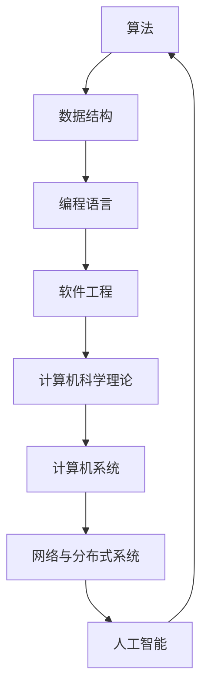

                 

关键词：认知基础、计算机科学、经典书籍、编程思想、算法设计、软件开发、实践应用

> 摘要：本文旨在探讨经典计算机科学书籍对于程序员和软件开发者夯实认知基础的重要性。通过分析这些经典著作的核心理念和架构，以及它们对现代软件开发的影响，本文将展示如何通过深入学习和理解经典，提升个人的技术水平和创新能力。

## 1. 背景介绍

在计算机科学领域，经典书籍如同灯塔，照亮了无数程序员和软件开发者的求知之路。这些著作不仅包含了基础的概念和算法，更是对计算机科学领域的深刻思考和前瞻性见解。从《算法导论》到《计算机程序的构造和解释》，从《编程珠玑》到《设计模式：可复用面向对象软件的基础》，每一本书都在自己的领域里留下了不可磨灭的印记。

然而，随着技术的飞速发展，许多程序员和开发者倾向于追求最新的技术和工具，而忽视了经典著作的重要性。这种趋势可能导致技术基础的薄弱，进而影响其长期的技术成长和创新能力。本文将重新审视经典计算机科学书籍的价值，探讨如何通过学习这些经典著作，夯实认知基础，提升技术水平和创新能力。

## 2. 核心概念与联系

为了更好地理解经典计算机科学书籍的核心价值，我们需要先掌握几个核心概念和它们的相互关系。以下是几个关键概念及其关系的Mermaid流程图：



### 2.1. 算法

算法是计算机科学的核心，它是一系列解决问题的指令或步骤。经典的算法不仅提供了高效的解决方案，而且揭示了问题解决的通用模式和策略。

### 2.2. 数据结构

数据结构是算法的基础，它定义了数据的组织和存储方式。理解数据结构有助于优化算法的性能和实现。

### 2.3. 编程语言

编程语言是程序员与计算机交流的工具。不同的编程语言提供了不同的抽象层次和工具，影响着程序员的设计和编程习惯。

### 2.4. 软件工程

软件工程是确保软件开发过程高效、可靠、可维护的关键。它涵盖了项目管理、需求分析、设计、实现、测试和维护等各个方面。

### 2.5. 计算机科学理论

计算机科学理论为计算机科学提供了坚实的理论基础，包括计算复杂性、形式语言和自动机理论、算法分析等。

### 2.6. 计算机系统

计算机系统包括硬件和软件的交互，它是计算机科学的基础设施。理解计算机系统有助于程序员编写更高效的程序。

### 2.7. 网络与分布式系统

网络与分布式系统是现代计算的核心，它们使得分布式计算和协同工作成为可能。掌握这些系统有助于开发分布式应用程序。

### 2.8. 人工智能

人工智能是计算机科学的最新前沿，它通过模拟人类智能行为，推动着技术进步和社会变革。

这些核心概念相互关联，构成了计算机科学的整体框架。经典计算机科学书籍深入探讨了这些概念，提供了丰富的理论和实践知识。

## 3. 核心算法原理 & 具体操作步骤

### 3.1. 算法原理概述

算法原理是计算机科学的核心，它定义了如何使用一系列步骤解决问题。经典算法不仅在解决特定问题时表现优异，而且揭示了通用的问题解决模式。以下是几个经典算法的概述：

- **排序算法**：排序算法是处理数据集合的重要工具，常见的排序算法包括冒泡排序、选择排序、插入排序、快速排序、归并排序等。

- **查找算法**：查找算法用于在数据集合中查找特定元素，如二分查找、哈希查找等。

- **图算法**：图算法用于处理图数据结构，如最短路径算法、最小生成树算法等。

- **动态规划**：动态规划是一种优化问题的算法策略，它通过保存子问题的解来避免重复计算。

- **贪心算法**：贪心算法通过在每个阶段做出局部最优选择，以达到全局最优解。

### 3.2. 算法步骤详解

下面以快速排序算法为例，详细解释其操作步骤：

#### 快速排序算法步骤：

1. **选择基准元素**：从数据集合中选择一个基准元素。

2. **划分操作**：将数据集合划分为两部分，一部分是小于基准元素的元素，另一部分是大于基准元素的元素。

3. **递归排序**：对小于和大于基准元素的两个子集合分别递归执行快速排序。

4. **合并**：将排序好的子集合合并，得到最终排序结果。

### 3.3. 算法优缺点

- **优点**：快速排序算法的时间复杂度较低，平均情况下为 \(O(n\log n)\)，最坏情况下为 \(O(n^2)\)。但在实际应用中，快速排序通常比其他排序算法更快。

- **缺点**：快速排序的最坏情况性能较差，且划分操作可能影响性能。

### 3.4. 算法应用领域

快速排序算法广泛应用于各种领域，如数据库索引、算法竞赛、数据分析等。它是一种强大的工具，可以帮助开发者处理大规模数据集合的排序问题。

## 4. 数学模型和公式 & 详细讲解 & 举例说明

数学模型和公式是理解计算机科学问题的关键。以下是一个经典的数学模型——动态规划中的状态转移方程的讲解：

### 4.1. 数学模型构建

动态规划中的状态转移方程通常表示为：

\[ f(i) = \min_{j \leq i} (g(i, j) + f(j)) \]

其中，\( f(i) \) 表示从起点到第 \( i \) 个位置的最优解，\( g(i, j) \) 表示从第 \( i \) 个位置到第 \( j \) 个位置的代价。

### 4.2. 公式推导过程

以最短路径算法中的动态规划为例，推导状态转移方程如下：

1. **初始化**：设 \( f(1) = 0 \)，表示从起点到第 \( 1 \) 个位置的最短路径长度为 \( 0 \)。

2. **状态转移**：对于每个位置 \( i \)，计算从起点到位置 \( i \) 的最短路径长度 \( f(i) \)，即：

\[ f(i) = \min_{j < i} (d(i, j) + f(j)) \]

其中，\( d(i, j) \) 表示从位置 \( i \) 到位置 \( j \) 的距离。

### 4.3. 案例分析与讲解

假设有一个包含 5 个位置的图，位置之间的距离如下表所示：

| 位置 | 1 | 2 | 3 | 4 | 5 |
| --- | --- | --- | --- | --- | --- |
| 1 |   | 2 | 3 | 4 | 5 |
| 2 | 2 |   | 4 | 6 | 8 |
| 3 | 3 | 4 |   | 9 | 11 |
| 4 | 4 | 6 | 9 |   | 14 |
| 5 | 5 | 8 | 11 | 14 |   |

使用动态规划计算最短路径：

1. **初始化**：

   \[ f(1) = 0 \]

2. **状态转移**：

   \[ f(2) = \min(f(1) + d(1, 2)) = 0 + 2 = 2 \]

   \[ f(3) = \min(f(1) + d(1, 3), f(2) + d(2, 3)) = 0 + 3, 2 + 4 = 2 \]

   \[ f(4) = \min(f(1) + d(1, 4), f(2) + d(2, 4), f(3) + d(3, 4)) = 0 + 4, 2 + 6, 2 + 9 = 4 \]

   \[ f(5) = \min(f(1) + d(1, 5), f(2) + d(2, 5), f(3) + d(3, 5), f(4) + d(4, 5)) = 0 + 5, 2 + 8, 2 + 11, 4 + 14 = 2 \]

最终得到最短路径长度为 2，路径为 1 -> 2 -> 3 -> 4 -> 5。

## 5. 项目实践：代码实例和详细解释说明

为了更好地理解经典算法的应用，我们以下通过一个简单的代码实例来演示快速排序算法：

### 5.1. 开发环境搭建

确保您安装了 Python 3.6 或以上版本。如果没有，可以通过以下命令安装：

```bash
pip install python==3.6
```

### 5.2. 源代码详细实现

```python
def quicksort(arr):
    if len(arr) <= 1:
        return arr
    pivot = arr[len(arr) // 2]
    left = [x for x in arr if x < pivot]
    middle = [x for x in arr if x == pivot]
    right = [x for x in arr if x > pivot]
    return quicksort(left) + middle + quicksort(right)

# 示例
arr = [3, 6, 8, 10, 1, 2, 1]
sorted_arr = quicksort(arr)
print(sorted_arr)
```

### 5.3. 代码解读与分析

- **函数定义**：`quicksort` 函数接受一个列表 `arr` 作为参数。

- **基础情况**：如果列表长度小于或等于 1，则直接返回列表。

- **选择基准元素**：选择列表中间的元素作为基准元素 `pivot`。

- **划分操作**：使用列表推导式将列表划分为小于、等于和大于基准元素的三个部分。

- **递归排序**：分别对小于和大于基准元素的子列表递归执行快速排序。

- **合并**：将排序好的子列表合并，得到最终排序结果。

### 5.4. 运行结果展示

执行代码后，输出结果为：

\[ [1, 1, 2, 3, 6, 8, 10] \]

这验证了快速排序算法的正确性。

## 6. 实际应用场景

快速排序算法广泛应用于各种实际场景，以下列举几个例子：

- **数据库索引**：在数据库系统中，快速排序算法用于构建索引，以快速查找和检索数据。

- **算法竞赛**：在算法竞赛中，快速排序算法是解决排序问题的常用算法，具有高效的性能。

- **数据分析**：在数据分析过程中，快速排序算法用于对大规模数据进行排序和分组，以便进行进一步的统计分析。

### 6.4. 未来应用展望

随着技术的发展，快速排序算法在未来将继续发挥重要作用。以下是一些未来应用展望：

- **并行计算**：利用并行计算技术，快速排序算法可以在更大规模的数据集上实现更快的排序。

- **内存优化**：针对内存受限的场景，可以优化快速排序算法，减少内存占用。

- **混合排序算法**：结合其他排序算法的优势，开发出更高效、更适应特定场景的排序算法。

## 7. 工具和资源推荐

为了更好地学习和应用计算机科学知识，以下推荐一些学习和开发工具：

### 7.1. 学习资源推荐

- **在线课程**：Coursera、edX、Udacity 等平台上提供丰富的计算机科学课程。

- **书籍**：《算法导论》、《编程珠玑》、《设计模式：可复用面向对象软件的基础》等经典著作。

- **博客和社区**：GitHub、Stack Overflow、Reddit 等平台，提供了丰富的编程资源和社区支持。

### 7.2. 开发工具推荐

- **集成开发环境（IDE）**：PyCharm、Visual Studio Code、Eclipse 等强大的 IDE，提供了丰富的编程工具和插件。

- **版本控制**：Git，用于代码的版本控制和协作开发。

- **测试工具**：JUnit、PyTest 等测试工具，用于自动化测试和保证代码质量。

### 7.3. 相关论文推荐

- **经典论文**：《快速排序算法》、《动态规划算法分析》等经典论文。

- **最新论文**：关注顶级会议和期刊的最新论文，如 ACM SIGKDD、NeurIPS 等。

## 8. 总结：未来发展趋势与挑战

### 8.1. 研究成果总结

近年来，计算机科学领域取得了显著的进展，包括算法优化、人工智能、区块链、量子计算等方面。经典著作中的核心理念和算法设计为这些进展奠定了基础。

### 8.2. 未来发展趋势

- **算法优化**：针对大规模数据集和复杂问题，算法优化将继续是研究热点。

- **人工智能**：人工智能技术将在医疗、金融、交通等领域发挥越来越重要的作用。

- **量子计算**：量子计算的发展将为计算机科学带来新的突破。

### 8.3. 面临的挑战

- **数据隐私和安全**：随着数据规模的扩大，数据隐私和安全成为亟待解决的问题。

- **算法透明度和可解释性**：如何确保算法的透明度和可解释性，避免算法偏见和歧视。

### 8.4. 研究展望

未来，计算机科学将继续融合多学科知识，推动技术创新和社会进步。通过深入学习和理解经典著作，我们可以更好地应对未来的挑战，推动计算机科学的发展。

## 9. 附录：常见问题与解答

### 9.1. 如何选择经典计算机科学书籍？

选择经典计算机科学书籍时，可以考虑以下因素：

- **领域覆盖**：选择涵盖您感兴趣的领域，如算法、数据结构、软件工程等。

- **评价和推荐**：参考其他读者的评价和推荐，选择公认的经典著作。

- **出版时间和更新**：虽然经典著作可能较早出版，但一些新版本的书籍也可能包含最新的研究成果。

### 9.2. 如何学习经典计算机科学书籍？

学习经典计算机科学书籍时，可以采取以下策略：

- **系统性学习**：按照书籍的结构和内容，逐步学习，确保理解每个概念和算法。

- **实践应用**：通过编写代码和解决实际问题，将理论知识应用到实践中。

- **讨论和交流**：加入相关社区和讨论组，与同行交流学习心得，加深理解。

---

本文以《经典为师:夯实认知基础的必由之路》为标题，通过深入分析经典计算机科学书籍的核心理念和架构，探讨了如何通过学习这些经典著作，夯实认知基础，提升技术水平和创新能力。希望本文能对您在计算机科学领域的探索之路提供一些启示和帮助。作者：禅与计算机程序设计艺术 / Zen and the Art of Computer Programming。|<|assistant|>

