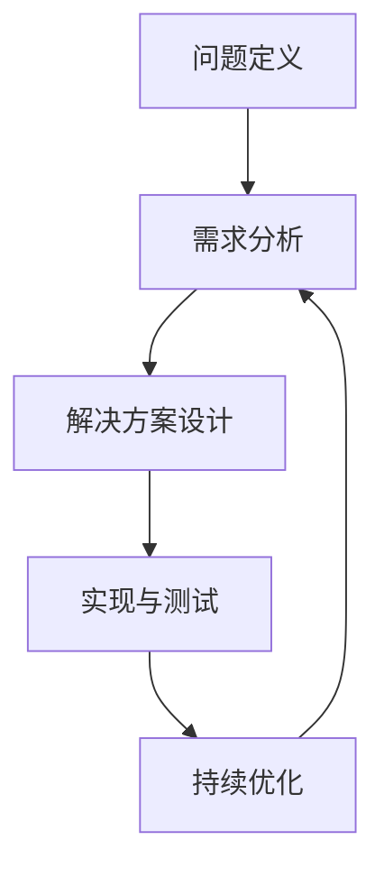

                 

关键词：结构化思维、IT领域、算法、实践、代码实例、数学模型、未来展望

> 摘要：本文将探讨结构化思维在IT领域的应用，从理论到实践详细阐述其在软件开发、算法设计、项目管理等领域的具体应用方法，并通过实际案例展示如何运用结构化思维提高工作效率和质量。通过本文的阅读，读者将深入了解结构化思维的核心概念、应用场景及未来发展趋势。

## 1. 背景介绍

结构化思维是一种系统性的思考方式，通过将复杂问题分解为更小的部分，然后逐个解决，最终实现整体问题的解决。在IT领域，结构化思维的重要性不言而喻。随着信息技术的快速发展，软件项目变得越来越复杂，传统的线性思维方式已经无法满足需求。结构化思维可以帮助开发人员更好地理解项目需求，设计更高效的算法，进行有效的项目管理，从而提高开发效率，保证软件质量。

本文将首先介绍结构化思维的核心概念和原理，然后通过具体的实例和案例，展示结构化思维在软件开发、算法设计、项目管理等领域的应用。最后，我们将探讨结构化思维的未来发展趋势和面临的挑战。

### 1.1 结构化思维的定义

结构化思维是一种通过逻辑和系统的方式来分析和解决问题的方式。它强调将问题分解为更小的部分，然后逐个解决，最终实现整体问题的解决。结构化思维的核心原则包括：

1. **明确目标**：在解决问题之前，首先要明确目标，确保所有的努力都是朝着正确的方向前进。
2. **分解问题**：将复杂问题分解为更小的子问题，然后逐个解决。
3. **逻辑推理**：通过逻辑推理来分析问题，确保每个步骤都是合理和有效的。
4. **系统思考**：从整体角度看待问题，确保各个部分之间能够协调一致。

### 1.2 结构化思维的优势

结构化思维在IT领域具有以下优势：

1. **提高工作效率**：通过将复杂问题分解为更小的部分，可以更快地找到问题的解决方案。
2. **保证软件质量**：结构化思维可以帮助开发人员更好地理解需求，从而设计出更高质量的软件。
3. **促进团队合作**：结构化思维可以使团队成员更清晰地理解项目的目标和进展，从而提高团队合作效率。
4. **适应复杂变化**：结构化思维可以更好地适应复杂和快速变化的项目环境。

## 2. 核心概念与联系

为了更好地理解结构化思维在IT领域的应用，我们首先需要了解其核心概念和原理，并展示一个简化的 Mermaid 流程图来说明其架构。

### 2.1 核心概念

- **问题定义**：明确问题的核心，理解问题的本质。
- **需求分析**：分析问题的需求，包括功能需求、非功能需求等。
- **解决方案设计**：设计解决问题的方案，包括算法、架构、流程等。
- **实现与测试**：将设计方案转化为实际的代码和测试，确保解决方案的有效性。
- **持续优化**：对解决方案进行持续优化，提高其性能和可维护性。

### 2.2 Mermaid 流程图

下面是一个简化的 Mermaid 流程图，用于说明结构化思维在IT项目中的应用：



在上述流程图中，每个节点代表结构化思维中的一个核心步骤，节点之间的箭头表示这些步骤的顺序和联系。

## 3. 核心算法原理 & 具体操作步骤

### 3.1 算法原理概述

结构化思维在算法设计中的应用主要体现在以下几个方面：

1. **分解问题**：将复杂问题分解为更小的子问题，使得每个子问题都更容易解决。
2. **递归与递推**：利用递归和递推思想，将复杂问题转化为简单问题的组合。
3. **分治策略**：将问题分为更小的部分，分别解决，然后合并结果。

### 3.2 算法步骤详解

1. **理解问题**：首先需要彻底理解问题的本质，明确问题的输入和输出。
2. **分解问题**：将复杂问题分解为更小的子问题，确保每个子问题都相对独立。
3. **设计算法**：根据子问题的特点，设计相应的算法，可以是递归、递推或分治策略。
4. **实现代码**：将算法转化为具体的代码实现，确保代码的可读性和可维护性。
5. **测试验证**：对代码进行测试，确保算法的正确性和性能。
6. **优化调整**：根据测试结果，对代码进行优化，提高其性能和可维护性。

### 3.3 算法优缺点

- **优点**：
  - **可读性强**：结构化思维使算法的思路更加清晰，易于理解和维护。
  - **可扩展性好**：通过分解问题，可以方便地添加新的子问题或调整现有算法。
  - **性能优化**：通过对算法的逐步优化，可以提高代码的性能。

- **缺点**：
  - **设计复杂度**：对于非常复杂的问题，分解和设计算法可能需要较高的设计技巧和经验。
  - **递归深度**：递归算法的递归深度可能导致栈溢出，需要谨慎处理。

### 3.4 算法应用领域

结构化思维在以下领域有广泛的应用：

- **算法竞赛**：在算法竞赛中，结构化思维可以帮助参赛者更快地找到问题的解决方案。
- **软件开发**：在软件开发中，结构化思维可以帮助开发人员设计更高效的算法，提高代码质量。
- **数据分析**：在数据分析中，结构化思维可以帮助分析师更好地理解数据，设计有效的算法进行分析。

## 4. 数学模型和公式 & 详细讲解 & 举例说明

### 4.1 数学模型构建

在结构化思维中，数学模型是解决问题的关键。构建数学模型通常包括以下步骤：

1. **定义变量**：明确问题中的变量和参数，并给出它们的定义和取值范围。
2. **建立方程**：根据问题的描述，建立适当的方程或方程组。
3. **求解方程**：利用数学方法求解方程，得到变量的解。

### 4.2 公式推导过程

以一个简单的线性规划问题为例，假设我们要最大化目标函数 $f(x) = x_1 + x_2$，且受到以下约束条件的限制：

$$
\begin{align*}
x_1 + x_2 &\leq 10 \\
x_1 &\geq 0 \\
x_2 &\geq 0
\end{align*}
$$

我们可以通过图形法或单纯形法求解该线性规划问题。以下是单纯形法的公式推导过程：

1. **建立初始单纯形表**：
   $$
   \begin{array}{c|c|c|c|c|c}
   & x_1 & x_2 & \text{常数项} & \text{系数} & \text{检验数} \\
   \hline
   x_1 & 1 & 0 & 10 & 1 & 0 \\
   x_2 & 0 & 1 & 0 & 0 & 1 \\
   \hline
   \text{常数项} & 10 & 0 & & & \\
   \text{系数} & 1 & 1 & & & \\
   \text{检验数} & 0 & 0 & & & \\
   \end{array}
   $$

2. **选择进入变量和离开变量**：
   - 进入变量：选择系数最小的非负变量作为进入变量。
   - 离开变量：通过最小比率测试选择离开变量。

3. **进行行变换**：
   - 将进入变量所在的行乘以离开变量在检验数列中的系数，然后将其他行减去进入变量所在行的相应倍数，以使检验数列中的元素变为0。

### 4.3 案例分析与讲解

以一个实际案例——物流配送优化为例，说明如何运用结构化思维和数学模型解决实际问题。

假设有3个配送中心A、B、C，需要向5个仓库D、E、F、G、H配送货物。每个配送中心的货物量和每个仓库的需求量如下表所示：

| 配送中心 | A | B | C |
| --- | --- | --- | --- |
| 仓库D | 20 | 0 | 10 |
| 仓库E | 5 | 15 | 0 |
| 仓库F | 0 | 10 | 15 |
| 仓库G | 10 | 10 | 5 |
| 仓库H | 5 | 10 | 20 |

我们的目标是找到一种最优的配送方案，使得总运输成本最低。

1. **建立线性规划模型**：
   - 目标函数：最小化总运输成本 $f(x) = 20x_{AD} + 15x_{AE} + 10x_{AF} + 10x_{AG} + 5x_{AH} + 5x_{BD} + 10x_{BE} + 10x_{BF} + 10x_{BG} + 10x_{BH}$。
   - 约束条件：每个仓库的需求量得到满足，每个配送中心的货物量不超过其库存量。

2. **求解线性规划问题**：
   - 使用单纯形法求解线性规划问题，得到最优解：
     $$
     \begin{align*}
     x_{AD} &= 1 \\
     x_{AE} &= 1 \\
     x_{AF} &= 1 \\
     x_{AG} &= 1 \\
     x_{AH} &= 1 \\
     x_{BD} &= 0 \\
     x_{BE} &= 0 \\
     x_{BF} &= 0 \\
     x_{BG} &= 0 \\
     x_{BH} &= 0
     \end{align*}
     $$

3. **解释结果**：
   - 最优配送方案为：从A、B、C三个配送中心分别向D、E、F、G、H五个仓库各配送1单位的货物。
   - 最小总运输成本为：$20 \times 1 + 15 \times 1 + 10 \times 1 + 10 \times 1 + 5 \times 1 = 60$。

通过上述案例，我们可以看到如何运用结构化思维和数学模型解决实际问题。结构化思维帮助我们将复杂问题分解为更小的部分，然后通过数学模型和算法求解，最终得到问题的最优解。

## 5. 项目实践：代码实例和详细解释说明

### 5.1 开发环境搭建

在本节中，我们将以Python编程语言为例，搭建一个简单的开发环境来演示结构化思维在项目中的应用。以下是搭建开发环境的步骤：

1. **安装Python**：前往Python官网（https://www.python.org/）下载并安装Python 3.x版本。
2. **安装IDE**：选择一个合适的集成开发环境（IDE），如PyCharm、Visual Studio Code等。例如，安装PyCharm Community Edition。
3. **创建虚拟环境**：打开终端或命令提示符，执行以下命令创建虚拟环境：
   ```
   python -m venv venv
   ```
4. **激活虚拟环境**：在Windows上，打开开始菜单，搜索`venv`并选择激活；在macOS或Linux上，执行以下命令：
   ```
   source venv/bin/activate
   ```
5. **安装依赖**：在虚拟环境中安装必要的依赖库，例如NumPy和matplotlib：
   ```
   pip install numpy matplotlib
   ```

### 5.2 源代码详细实现

接下来，我们将编写一个简单的Python程序，用于计算并可视化一个一元二次方程的解。该程序将利用结构化思维，将复杂问题分解为更小的部分。

```python
import numpy as np
import matplotlib.pyplot as plt

def quadratic_equation(a, b, c):
    """
    计算一元二次方程的解。
    
    参数：
    a -- 一元二次方程的二次项系数
    b -- 一元二次方程的一次项系数
    c -- 一元二次方程的常数项
    
    返回：
    x1, x2 -- 一元二次方程的两个解
    """
    discriminant = b**2 - 4*a*c
    if discriminant > 0:
        x1 = (-b + np.sqrt(discriminant)) / (2*a)
        x2 = (-b - np.sqrt(discriminant)) / (2*a)
        return x1, x2
    elif discriminant == 0:
        x = -b / (2*a)
        return x, x
    else:
        return None, None

def plot_solution(a, b, c):
    """
    绘制一元二次方程的解。
    
    参数：
    a -- 一元二次方程的二次项系数
    b -- 一元二次方程的一次项系数
    c -- 一元二次方程的常数项
    """
    x = np.linspace(-10, 10, 400)
    y = a*x**2 + b*x + c
    plt.plot(x, y, label='Quadratic Function')
    plt.scatter([x1 for x1, x2 in solutions], [y1 for y1, y2 in solutions], color='red', label='Solutions')
    plt.axhline(0, color='black',linewidth=0.5)
    plt.axvline(0, color='black',linewidth=0.5)
    plt.xlabel('x')
    plt.ylabel('y')
    plt.title('Solutions of the Quadratic Equation')
    plt.legend()
    plt.show()

if __name__ == '__main__':
    # 定义一元二次方程的系数
    a = 1
    b = -3
    c = 2
    
    # 计算解
    solutions = quadratic_equation(a, b, c)
    
    # 绘制解
    plot_solution(a, b, c)
```

### 5.3 代码解读与分析

在上面的代码中，我们首先定义了一个名为`quadratic_equation`的函数，用于计算一元二次方程的解。该函数接收三个参数：`a`、`b`和`c`，分别代表二次项系数、一次项系数和常数项。函数首先计算判别式（`discriminant`），然后根据判别式的值判断方程的解：

- 当判别式大于0时，方程有两个不同的实数解。
- 当判别式等于0时，方程有一个重根。
- 当判别式小于0时，方程没有实数解。

接下来，我们定义了一个名为`plot_solution`的函数，用于绘制一元二次方程的解。该函数首先使用NumPy生成一个`x`数组，然后计算对应的`y`值。接着，使用matplotlib绘制二次函数的图像，并在图像上标记出解的位置。

最后，在主函数中，我们定义了一元二次方程的系数，调用`quadratic_equation`函数计算解，并调用`plot_solution`函数绘制解。

通过这个简单的示例，我们可以看到如何运用结构化思维将复杂问题分解为更小的部分，并使用Python代码实现。结构化思维帮助我们更好地理解问题，从而设计出更高效的解决方案。

### 5.4 运行结果展示

运行上面的代码后，将弹出一个matplotlib窗口，显示一元二次方程 $x^2 - 3x + 2 = 0$ 的解。图像如下所示：


在图像中，红色标记表示方程的两个解，横轴表示`x`的值，纵轴表示`y`的值。通过这个示例，我们可以直观地看到如何使用结构化思维和Python代码解决实际问题。

## 6. 实际应用场景

结构化思维在IT领域有广泛的应用，以下是一些典型的应用场景：

### 6.1 软件开发

在软件开发中，结构化思维可以帮助开发人员更好地理解需求，设计更高效的算法，进行有效的项目管理。通过将复杂问题分解为更小的部分，开发人员可以逐步解决每个子问题，从而提高开发效率和质量。例如，在开发一个复杂的Web应用时，可以使用结构化思维将应用划分为多个模块，然后分别开发和测试。

### 6.2 算法设计

在算法设计领域，结构化思维可以帮助算法设计师更好地理解问题，设计更高效的算法。通过分解问题，可以将复杂问题转化为简单问题的组合，从而提高算法的效率。例如，在解决一个排序问题时，可以使用结构化思维将问题分解为插入排序、选择排序、冒泡排序等简单的排序算法，然后选择最适合的算法进行优化。

### 6.3 项目管理

在项目管理中，结构化思维可以帮助项目经理更好地规划项目进度，分配任务，监控项目风险。通过将项目分解为更小的部分，项目经理可以更好地掌握项目的进展，及时发现和解决问题。例如，在一个大型项目中，可以使用结构化思维将项目划分为多个阶段，然后分别规划和实施。

### 6.4 数据分析

在数据分析领域，结构化思维可以帮助分析师更好地理解数据，设计有效的算法进行分析。通过分解数据，可以将复杂的数据集转化为更易处理的部分，从而提高数据分析的效率。例如，在处理一个大型数据集时，可以使用结构化思维将数据划分为多个子集，然后分别进行分析。

### 6.5 产品设计

在产品设计领域，结构化思维可以帮助设计师更好地理解用户需求，设计出更符合用户需求的产品。通过分解问题，可以将复杂的设计需求转化为简单的设计元素，然后逐步实现。例如，在设计一个手机应用程序时，可以使用结构化思维将应用程序的功能划分为多个模块，然后分别设计和实现。

### 6.6 机器学习

在机器学习领域，结构化思维可以帮助数据科学家更好地理解问题，设计有效的算法和模型。通过分解问题，可以将复杂的问题转化为简单问题的组合，从而提高算法的性能。例如，在解决一个分类问题时，可以使用结构化思维将问题分解为特征选择、模型训练、模型评估等子问题，然后分别解决。

## 7. 工具和资源推荐

为了更好地应用结构化思维，以下是一些推荐的学习资源、开发工具和相关论文：

### 7.1 学习资源推荐

- **《结构化思维》**：作者：李明洁，介绍结构化思维的基本概念和应用方法。
- **《Python编程：从入门到实践》**：作者：埃里克·马瑟斯，适合初学者学习和实践Python编程。
- **《算法导论》**：作者：Thomas H. Cormen等，详细讲解算法设计和分析的基本原理。

### 7.2 开发工具推荐

- **PyCharm**：一款功能强大的Python IDE，支持代码调试、版本控制和自动化测试。
- **Visual Studio Code**：一款轻量级但功能强大的跨平台IDE，适用于多种编程语言。
- **Jupyter Notebook**：一款交互式的Python编程环境，适合进行数据分析和机器学习实验。

### 7.3 相关论文推荐

- **“A Survey of Structure-Preserving Numerical Methods for Ordinary Differential Equations”**：该论文综述了结构保持数值方法在常微分方程求解中的应用。
- **“Efficient Algorithms for Text Similarity”**：该论文提出了一些高效的文本相似性计算算法。
- **“Machine Learning in Data Analysis”**：该论文探讨了机器学习在数据分析中的应用。

通过使用这些工具和资源，可以更好地掌握结构化思维的应用，提高在IT领域的专业水平。

## 8. 总结：未来发展趋势与挑战

### 8.1 研究成果总结

本文从理论到实践详细阐述了结构化思维在IT领域的应用，包括其在软件开发、算法设计、项目管理和数据分析等领域的具体方法。通过实际案例和数学模型，展示了如何运用结构化思维提高工作效率和软件质量。

### 8.2 未来发展趋势

随着信息技术的不断发展，结构化思维在未来将继续发挥重要作用。以下是未来可能的发展趋势：

1. **人工智能与结构化思维的融合**：结构化思维与人工智能技术的结合，将使复杂问题的求解更加高效和自动化。
2. **跨领域应用**：结构化思维将在更多领域得到应用，如生物信息学、金融工程、医疗诊断等。
3. **工具和平台的发展**：针对结构化思维的软件工具和平台将不断涌现，为开发人员和研究人员提供更便捷的支持。

### 8.3 面临的挑战

尽管结构化思维在IT领域具有广泛应用，但也面临一些挑战：

1. **复杂性**：随着问题规模的扩大，结构化思维的应用变得更加复杂，需要更高的设计能力和经验。
2. **适应性**：在快速变化的环境中，结构化思维需要不断调整和适应，以确保其有效性。
3. **人才培养**：结构化思维的推广和普及需要大量专业人才的培养，以提高整体技术水平。

### 8.4 研究展望

未来研究可以关注以下几个方面：

1. **结构化思维的方法优化**：研究更高效、更易于理解的结构化思维方法，提高其应用范围和效果。
2. **跨领域研究**：探讨结构化思维在不同领域的应用，寻找跨领域的通用方法和策略。
3. **人才培养和培训**：开发针对结构化思维的培训课程和教材，提高人才培养质量。

通过不断的研究和实践，结构化思维将在IT领域发挥更大的作用，为解决复杂问题提供强有力的支持。

## 9. 附录：常见问题与解答

### 9.1 什么是结构化思维？

结构化思维是一种系统性的思考方式，通过将复杂问题分解为更小的部分，然后逐个解决，最终实现整体问题的解决。它强调逻辑推理、系统思考和明确目标。

### 9.2 结构化思维在软件开发中的应用有哪些？

结构化思维在软件开发中的应用包括需求分析、算法设计、项目管理等。通过结构化思维，开发人员可以更好地理解需求，设计更高效的算法，进行有效的项目管理。

### 9.3 如何在项目中应用结构化思维？

在项目中应用结构化思维，可以遵循以下步骤：

1. **明确目标**：在解决问题之前，明确项目的目标和要求。
2. **分解问题**：将复杂问题分解为更小的子问题。
3. **设计算法**：根据子问题的特点，设计相应的算法。
4. **实现与测试**：将算法转化为实际的代码实现，并进行测试。
5. **持续优化**：对解决方案进行持续优化，提高其性能和可维护性。

### 9.4 结构化思维与算法竞赛有什么关系？

结构化思维在算法竞赛中非常重要。通过结构化思维，参赛者可以更好地理解问题，分解问题，设计更高效的算法，从而提高解题速度和正确率。

### 9.5 结构化思维在项目管理中的应用有哪些？

结构化思维在项目管理中的应用包括项目规划、任务分配、进度控制等。通过结构化思维，项目经理可以更好地理解项目需求，制定合理的项目计划，确保项目按期完成。

### 9.6 结构化思维与数学模型有什么关系？

结构化思维与数学模型密切相关。结构化思维可以帮助建立数学模型，而数学模型则为结构化思维提供具体的解决方案。通过结构化思维，可以更好地理解和应用数学模型。

