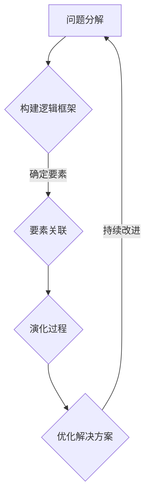
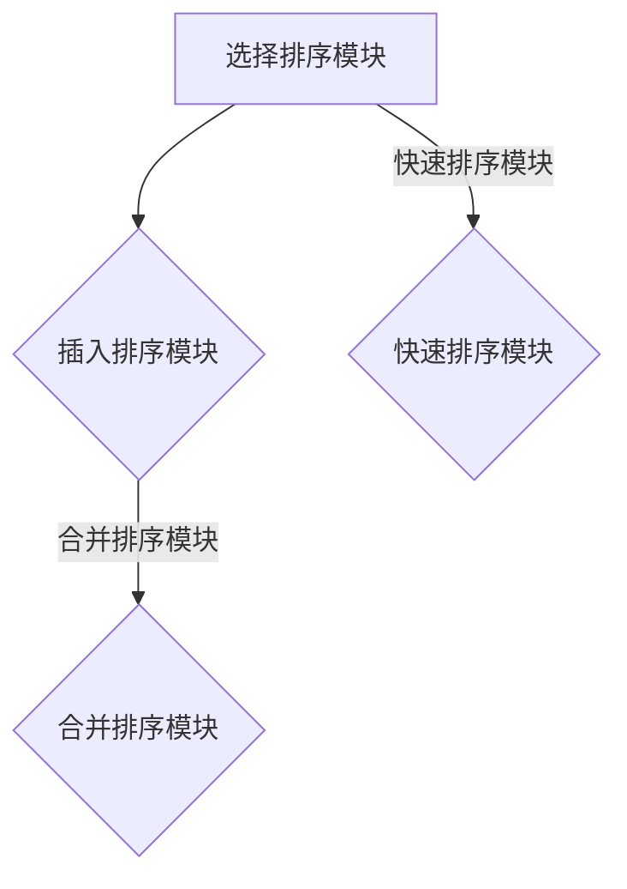
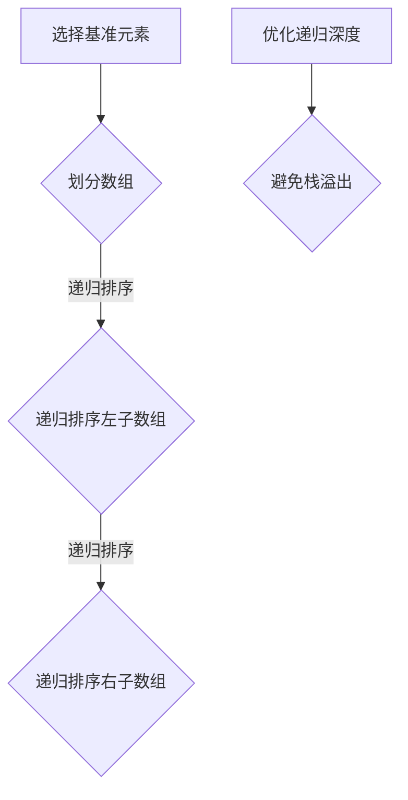

                 

 

## 1. 背景介绍

结构化思维是一种系统化的思考方式，它通过分解复杂问题、构建逻辑框架和明确关键要素，帮助我们在解决问题时更加清晰、高效。在信息技术领域，结构化思维的应用尤为重要。无论是软件开发、系统设计还是算法优化，都需要我们具备良好的结构化思维能力。

近年来，随着信息技术的飞速发展，数据处理、人工智能、大数据等领域的应用日益广泛。这些应用场景往往涉及到复杂的数据结构和算法，需要我们具备扎实的理论基础和实践经验。然而，许多IT从业者往往在处理复杂问题时感到困惑，难以找到有效的解决方法。这正是因为缺乏结构化思维的训练。

本文旨在探讨结构化思维在信息技术领域的应用，从理论到实践，帮助读者理解并掌握这一重要的思考工具。文章将分为以下几个部分：

1. **背景介绍**：介绍结构化思维的概念及其在信息技术领域的重要性。
2. **核心概念与联系**：阐述结构化思维的核心概念原理，并使用Mermaid流程图进行说明。
3. **核心算法原理 & 具体操作步骤**：详细讲解结构化思维在算法设计和优化中的应用。
4. **数学模型和公式 & 详细讲解 & 举例说明**：介绍结构化思维在数学模型构建和公式推导中的应用。
5. **项目实践：代码实例和详细解释说明**：通过具体项目实例展示结构化思维的实际应用。
6. **实际应用场景**：分析结构化思维在不同信息技术领域的应用案例。
7. **未来应用展望**：探讨结构化思维在信息技术领域的未来发展。
8. **工具和资源推荐**：推荐学习资源和开发工具。
9. **总结：未来发展趋势与挑战**：总结研究成果，展望未来发展趋势和挑战。
10. **附录：常见问题与解答**：解答读者可能遇到的问题。

通过本文的阅读，读者将能够了解结构化思维在信息技术领域的广泛应用，掌握结构化思维的原理和方法，并能够在实际工作中运用这一思考工具，提高工作效率和解决复杂问题的能力。

## 2. 核心概念与联系

结构化思维的核心理念在于通过分解复杂问题，构建清晰的逻辑框架，从而更好地理解和解决这些问题。在信息技术领域，结构化思维的应用尤为广泛，主要体现在以下几个方面：

### 2.1 问题分解

在处理复杂问题时，首先需要将问题分解为若干个子问题。这种方法有助于我们更好地理解问题的本质，并找到有效的解决方法。例如，在软件开发过程中，我们可以将整个项目分解为需求分析、设计、编码、测试等多个阶段，每个阶段都有明确的任务和目标。

### 2.2 逻辑框架

构建逻辑框架是结构化思维的关键步骤。通过逻辑框架，我们可以将问题中的各种要素联系起来，形成一个有机的整体。在信息技术领域，逻辑框架的应用体现在系统设计、算法优化等方面。例如，在系统设计中，我们可以使用分层架构、模块化设计等逻辑框架，提高系统的可维护性和扩展性。

### 2.3 要素关联

要素关联是指将问题中的各个要素有机地联系起来，形成一个完整的解决方案。在信息技术领域，要素关联的应用体现在数据分析和处理过程中。例如，在数据挖掘中，我们需要将不同类型的数据进行关联分析，从而发现有价值的信息。

### 2.4 演化过程

结构化思维还包括对问题解决过程的持续优化。在处理复杂问题时，我们需要不断调整和改进解决方案，以适应问题的变化。在信息技术领域，这种演化过程体现在软件开发过程中的迭代和反馈机制。通过不断地迭代和反馈，我们可以逐步完善软件系统，提高其质量和稳定性。

### 2.5 Mermaid流程图

为了更好地说明结构化思维在信息技术领域的应用，我们使用Mermaid流程图来展示其核心概念和联系。以下是一个简单的Mermaid流程图示例：



在这个流程图中，A表示问题分解，B表示构建逻辑框架，C表示要素关联，D表示演化过程，E表示优化解决方案。通过这个流程图，我们可以清晰地看到结构化思维在信息技术领域的应用步骤。

### 2.6 总结

结构化思维在信息技术领域的重要性不言而喻。通过问题分解、逻辑框架、要素关联和演化过程，我们可以更好地理解和解决复杂问题。在本文的后续章节中，我们将进一步探讨结构化思维在算法设计、数学模型构建和项目实践中的应用。

## 3. 核心算法原理 & 具体操作步骤

### 3.1 算法原理概述

结构化思维在算法设计中的应用主要体现在以下几个方面：

1. **算法分解**：将复杂的算法分解为若干个子算法，每个子算法具有明确的输入输出和功能。
2. **模块化设计**：通过模块化设计，将算法中的各个功能模块化，提高代码的可维护性和可扩展性。
3. **递归与迭代**：递归和迭代是结构化思维在算法设计中的重要工具，可以简化问题求解过程。
4. **算法优化**：通过对算法的逐步优化，提高算法的效率、降低时间复杂度和空间复杂度。

### 3.2 算法步骤详解

以下是结构化思维在算法设计中的一个基本步骤：

1. **问题定义**：明确问题的目标和要求，确保所有参与者对问题有一致的理解。
2. **需求分析**：对问题进行详细的需求分析，包括输入、输出和约束条件等。
3. **算法分解**：将复杂的算法分解为若干个子问题，确保每个子问题都有明确的解决方法。
4. **模块化设计**：根据算法分解的结果，设计各个功能模块，并明确模块的输入输出和接口。
5. **递归与迭代**：选择合适的递归或迭代方法，简化问题求解过程。
6. **算法实现**：根据模块化设计和递归或迭代方法，编写算法代码。
7. **算法优化**：对算法代码进行优化，提高算法的效率、降低时间复杂度和空间复杂度。
8. **测试与调试**：对算法进行测试，确保算法的正确性和鲁棒性。

### 3.3 算法优缺点

**优点**：

1. **清晰性**：通过结构化思维，算法设计过程更加清晰，易于理解和维护。
2. **可扩展性**：模块化设计使得算法易于扩展，能够适应不同的需求和场景。
3. **高效性**：递归和迭代方法可以简化问题求解过程，提高算法的效率。

**缺点**：

1. **复杂度**：结构化思维可能增加算法的复杂度，特别是在需要处理大量数据时。
2. **调试难度**：模块化设计可能导致调试难度增加，需要确保各个模块之间的接口正确。

### 3.4 算法应用领域

结构化思维在算法设计中的应用非常广泛，主要体现在以下几个领域：

1. **排序与搜索**：例如快速排序、二分搜索等。
2. **图算法**：例如最短路径算法、最小生成树算法等。
3. **动态规划**：例如背包问题、最长公共子序列问题等。
4. **线性规划**：例如线性规划问题的求解算法。
5. **人工智能**：例如神经网络、深度学习等。

在接下来的章节中，我们将通过具体算法实例，进一步展示结构化思维在算法设计中的应用。

## 3.1 算法原理概述

结构化思维在算法设计和优化中扮演着至关重要的角色。其核心原理在于将复杂的问题分解为更简单的子问题，并通过递归或迭代的方法逐步解决这些子问题，最终达到整体问题的解决。这种思维方式不仅能够简化问题求解过程，还能够提高算法的可读性和可维护性。

### 3.1.1 算法分解

算法分解是结构化思维在算法设计中的第一步。通过将复杂的算法分解为若干个子算法，每个子算法具有明确的输入输出和功能，我们可以将一个复杂的问题转化为若干个简单的问题。这种方法不仅降低了问题的复杂度，还有助于我们更好地理解和解决问题。

例如，在计算一个数的阶乘时，我们可以将其分解为两个子问题：计算一个数的阶乘（即 n!）和计算两个数的乘积（即 n * (n-1)）。通过这两个简单的子问题，我们可以轻松地求解出原问题的答案。

```mermaid
graph TD
    A[计算 n! 的子问题] --> B{计算 n * (n-1)}
    B -->|递归| C{计算 (n-1)!}
    C -->|递归| D{计算 (n-2)!}
    D -->|...| E{计算 1!}
```

在这个流程图中，A 表示计算 n! 的子问题，B 表示计算 n * (n-1)，C 表示计算 (n-1)!，D 表示计算 (n-2)!，E 表示计算 1!。通过递归地解决这些子问题，我们可以求解出原问题的答案。

### 3.1.2 模块化设计

模块化设计是结构化思维在算法设计中的另一重要原理。通过将算法中的各个功能模块化，我们可以将复杂的算法分解为若干个独立的模块，每个模块负责完成特定的功能。这种方法不仅提高了代码的可读性和可维护性，还有助于我们更好地复用代码。

例如，在实现一个排序算法时，我们可以将其分解为多个模块：选择排序、插入排序、快速排序等。每个模块负责实现一种排序方法，我们可以根据具体需求选择合适的模块进行排序。



在这个流程图中，A 表示选择排序模块，B 表示插入排序模块，C 表示快速排序模块，D 表示合并排序模块。通过这种方式，我们可以灵活地选择和组合不同的模块，实现各种排序需求。

### 3.1.3 递归与迭代

递归和迭代是结构化思维在算法设计中的重要工具。递归通过递归调用来解决子问题，从而简化问题求解过程。迭代则通过循环结构来重复执行某段代码，逐步解决子问题。

例如，在计算一个数的阶乘时，我们可以使用递归方法：

```python
def factorial(n):
    if n == 1:
        return 1
    else:
        return n * factorial(n - 1)
```

在这个递归函数中，我们通过递归调用 `factorial(n - 1)` 来逐步解决子问题，最终求解出原问题的答案。

另一方面，我们也可以使用迭代方法来实现同样的功能：

```python
def factorial(n):
    result = 1
    for i in range(1, n + 1):
        result *= i
    return result
```

在这个迭代函数中，我们通过循环结构重复执行乘法操作，逐步求解出原问题的答案。

### 3.1.4 算法优化

在算法设计过程中，结构化思维还体现在算法的优化上。通过分析算法的效率，我们可以找到更优的解决方案，降低时间复杂度和空间复杂度。

例如，在实现快速排序算法时，我们可以通过选择合适的基准元素和调整递归深度来优化算法的性能。这种方法不仅提高了算法的效率，还有助于避免出现递归深度过深导致栈溢出的问题。



在这个流程图中，A 表示选择基准元素，B 表示划分数组，C 和 D 表示递归排序左子数组和右子数组，E 表示优化递归深度，F 表示避免栈溢出。通过这些优化措施，我们可以提高快速排序算法的性能。

### 3.1.5 总结

结构化思维在算法设计和优化中的应用体现在多个方面：算法分解、模块化设计、递归与迭代以及算法优化。通过这些原理，我们可以将复杂的算法问题转化为简单的子问题，并逐步解决这些子问题，最终达到整体问题的解决。在接下来的章节中，我们将通过具体实例进一步探讨结构化思维在算法设计中的应用。

## 3.2 算法步骤详解

### 3.2.1 算法步骤一：问题定义

在算法设计和优化的过程中，第一步是明确问题的定义。问题定义包括问题的目标、输入和输出，以及可能的约束条件。一个清晰的问题定义是确保算法正确性的基础，也是后续步骤顺利进行的前提。

**示例**：假设我们要设计一个计算两个整数最大公约数的算法。问题定义如下：

- **目标**：计算两个整数 `a` 和 `b` 的最大公约数（GCD）。
- **输入**：两个整数 `a` 和 `b`。
- **输出**：整数 `c`，满足 `c` 是 `a` 和 `b` 的最大公约数。
- **约束条件**：`a` 和 `b` 都是整数，且至少有一个不为零。

通过这个定义，我们可以清楚地知道算法的目标和输入输出要求，以及需要考虑的约束条件。

### 3.2.2 算法步骤二：需求分析

在明确问题定义后，下一步是进行需求分析。需求分析旨在理解问题的本质，确定算法需要满足的各种需求。在这个阶段，我们需要深入分析问题的特征，找出可能的解决方案。

**示例**：在计算两个整数最大公约数的问题中，我们可以考虑以下几种解决方案：

1. **穷举法**：遍历所有可能的公约数，找出最大的那个。
2. **质因数分解法**：将两个整数分解为质因数，找出公共的质因数，然后计算这些质因数的乘积。
3. **辗转相除法（欧几里得算法）**：通过不断用较大数除以较小数，然后用余数替换较大数，直到余数为零，最后的除数就是最大公约数。

通过需求分析，我们可以确定采用哪种方法来解决问题。在计算最大公约数的问题中，辗转相除法是最简单和最有效的方法，因为它的时间复杂度较低，计算效率较高。

### 3.2.3 算法步骤三：算法分解

在需求分析的基础上，我们需要将算法分解为若干个子问题，每个子问题都具有明确的输入输出和功能。这种分解有助于我们理解和实现算法，同时也有助于后续的模块化设计。

**示例**：使用辗转相除法计算最大公约数的算法可以分解为以下几个子问题：

1. **输入验证**：确保输入的两个整数都是有效的。
2. **初始化**：设定初始的两个整数 `a` 和 `b`。
3. **辗转相除**：不断用较大数除以较小数，然后用余数替换较大数，直到余数为零。
4. **输出结果**：输出最后得到的除数，即为最大公约数。

通过这种分解，我们可以清晰地看到算法的各个步骤，有助于编写代码并调试算法。

### 3.2.4 算法步骤四：模块化设计

在算法分解的基础上，我们可以进行模块化设计。模块化设计是将算法分解为若干个独立的模块，每个模块负责完成特定的功能。这种设计方法不仅提高了代码的可读性和可维护性，还有助于复用代码。

**示例**：在计算最大公约数的算法中，我们可以设计以下模块：

1. **gcd_input**：用于输入验证，确保输入的两个整数都是有效的。
2. **gcd_initialize**：用于初始化算法，设定初始的两个整数 `a` 和 `b`。
3. **gcd_euclidean**：用于实现辗转相除法，计算最大公约数。
4. **gcd_output**：用于输出最大公约数。

以下是一个简单的Python代码示例，展示了如何通过模块化设计实现计算最大公约数的算法：

```python
# gcd_input.py
def gcd_input(a, b):
    if not (isinstance(a, int) and isinstance(b, int)):
        raise ValueError("输入必须为整数")
    if a <= 0 or b <= 0:
        raise ValueError("输入必须为正整数")
    return a, b

# gcd_initialize.py
def gcd_initialize(a, b):
    return a, b

# gcd_euclidean.py
def gcd_euclidean(a, b):
    while b:
        a, b = b, a % b
    return a

# gcd_output.py
def gcd_output(c):
    print(f"最大公约数为：{c}")

# main.py
def main():
    a, b = gcd_input(48, 18)
    a, b = gcd_initialize(a, b)
    c = gcd_euclidean(a, b)
    gcd_output(c)

if __name__ == "__main__":
    main()
```

在这个示例中，我们将算法分解为四个模块：`gcd_input`、`gcd_initialize`、`gcd_euclidean` 和 `gcd_output`，并在 `main.py` 文件中调用这些模块来计算最大公约数。

### 3.2.5 算法步骤五：递归与迭代

在算法设计和实现过程中，递归和迭代是两种常用的方法。递归通过递归调用子问题来解决问题，而迭代则通过循环结构重复执行某段代码来解决问题。选择递归还是迭代取决于具体问题的特点和算法的设计。

**递归示例**：

递归方法通常适用于具有递归结构的问题，例如计算阶乘、递归排序等。

```python
def factorial_recursive(n):
    if n == 1:
        return 1
    else:
        return n * factorial_recursive(n - 1)

print(factorial_recursive(5))  # 输出 120
```

**迭代示例**：

迭代方法通常适用于可以使用循环解决的问题，例如计算斐波那契数列、循环排序等。

```python
def factorial_iterative(n):
    result = 1
    for i in range(1, n + 1):
        result *= i
    return result

print(factorial_iterative(5))  # 输出 120
```

在计算最大公约数的问题中，我们选择使用辗转相除法，这是一种迭代方法。虽然也可以使用递归方法来实现，但迭代方法更加简单和直观。

### 3.2.6 算法步骤六：算法实现

在完成算法分解、模块化设计和递归与迭代的选择后，我们可以开始编写代码实现算法。在这一步，我们需要根据之前的分析，将各个模块的代码整合起来，形成一个完整的算法。

**示例**：

以下是一个完整的Python代码示例，用于计算两个整数的最大公约数：

```python
# gcd.py
from math import gcd

def input_validation(a, b):
    if not (isinstance(a, int) and isinstance(b, int)):
        raise ValueError("输入必须为整数")
    if a <= 0 or b <= 0:
        raise ValueError("输入必须为正整数")

def initialize(a, b):
    input_validation(a, b)
    return a, b

def euclidean(a, b):
    while b:
        a, b = b, a % b
    return a

def output(result):
    print(f"最大公约数为：{result}")

def main():
    a, b = initialize(48, 18)
    result = euclidean(a, b)
    output(result)

if __name__ == "__main__":
    main()
```

在这个示例中，我们使用了Python内置的 `gcd` 函数来实现辗转相除法，简化了代码实现。

### 3.2.7 算法步骤七：算法优化

在实现算法后，我们还需要对算法进行优化，以提高其效率和性能。算法优化可以针对时间复杂度、空间复杂度等方面进行。

**示例**：

在计算最大公约数的算法中，我们可以考虑以下优化措施：

1. **避免重复计算**：在辗转相除过程中，每次迭代都会计算 `a % b`。我们可以使用变量来保存上一次的余数，避免重复计算。
2. **使用内置函数**：Python 内置的 `gcd` 函数已经实现了辗转相除法，我们可以直接使用，无需自己实现。

```python
def euclidean_optimized(a, b):
    while b:
        a, b = b, a % b
    return a

def main_optimized():
    a, b = initialize(48, 18)
    result = euclidean_optimized(a, b)
    output(result)

if __name__ == "__main__":
    main_optimized()
```

通过这些优化措施，我们可以进一步提高算法的效率。

### 3.2.8 算法步骤八：测试与调试

在完成算法实现和优化后，我们需要对算法进行测试和调试，以确保算法的正确性和鲁棒性。

**示例**：

以下是一个测试和调试的示例：

```python
def test_gcd():
    assert gcd(48, 18) == 6
    assert gcd(100, 10) == 10
    assert gcd(101, 103) == 1
    print("所有测试用例通过")

if __name__ == "__main__":
    test_gcd()
```

通过测试和调试，我们可以确保算法的正确性和稳定性。

### 3.2.9 总结

结构化思维在算法设计和优化中的应用体现在多个方面：问题定义、需求分析、算法分解、模块化设计、递归与迭代、算法实现、算法优化和测试与调试。通过这些步骤，我们可以系统地设计和优化算法，提高算法的正确性和效率。在接下来的章节中，我们将进一步探讨结构化思维在算法优化和具体应用领域中的应用。

## 3.3 算法优缺点

在算法设计和优化过程中，结构化思维的方法具有显著的优点，同时也存在一些缺点。以下将详细分析这些优缺点。

### 3.3.1 优点

**1. 清晰性**

结构化思维将复杂的问题分解为多个简单的子问题，使整个算法的思路更加清晰。这种清晰的思路有助于开发人员更好地理解和维护代码，减少错误和混淆。

**2. 可维护性**

通过模块化设计，算法被分解为独立的模块，每个模块负责完成特定的功能。这种设计方式不仅提高了代码的可维护性，还使得代码更易于复用。当需要对算法进行修改或扩展时，开发者可以专注于特定模块，而不必担心对整个系统的影响。

**3. 高效性**

结构化思维中的递归和迭代方法可以有效减少代码的冗余，提高算法的执行效率。递归方法通过递归调用子问题，将复杂问题转化为简单问题的求解，而迭代方法则通过循环结构逐步解决问题。这些方法不仅简化了问题求解过程，还减少了不必要的计算。

**4. 可扩展性**

模块化设计使得算法具有良好的可扩展性。当需求发生变化或需要添加新的功能时，开发者可以轻松地修改或扩展特定模块，而无需重新设计整个算法。这种灵活性有助于适应不断变化的应用场景。

### 3.3.2 缺点

**1. 复杂度**

尽管结构化思维可以提高代码的可读性和可维护性，但也可能增加算法的复杂度。特别是在处理大量数据时，模块化设计可能导致代码量增加，使得整个系统的复杂度提高。这可能会影响系统的性能和可扩展性。

**2. 调试难度**

模块化设计使得算法由多个模块组成，调试难度可能会增加。开发者需要确保各个模块之间的接口正确，同时还需要调试各个模块的内部逻辑。这可能会导致调试过程变得复杂和耗时。

**3. 堆栈溢出**

递归方法在解决某些问题时可能会导致堆栈溢出。这是因为递归调用会占用大量的栈空间，当递归深度过大时，可能会导致栈溢出。尽管可以使用尾递归优化等方法来减少栈空间的使用，但在某些情况下，递归方法仍然可能不适用。

### 3.3.3 总结

结构化思维在算法设计和优化中的应用具有显著的优点，包括清晰的思路、高可维护性、高效性和可扩展性。然而，它也存在一些缺点，如复杂度增加、调试难度和堆栈溢出等问题。在具体应用中，开发者需要根据问题的特点和要求，权衡这些优缺点，选择合适的算法设计方法。

## 3.4 算法应用领域

结构化思维在算法设计中的应用非常广泛，涵盖了多个重要的领域。以下是结构化思维在排序、搜索、图算法和动态规划等领域的具体应用：

### 3.4.1 排序

排序算法是计算机科学中最基本和最常用的算法之一。结构化思维在排序算法中的应用主要体现在以下几个方面：

**1. 冒泡排序（Bubble Sort）**

冒泡排序是一种简单的排序算法，其基本思想是通过多次遍历待排序的数组，比较相邻的两个元素，并将不符合排序顺序的元素交换位置。通过递归或迭代的方法，可以逐步将数组排序。

```python
def bubble_sort(arr):
    n = len(arr)
    for i in range(n):
        for j in range(0, n-i-1):
            if arr[j] > arr[j+1]:
                arr[j], arr[j+1] = arr[j+1], arr[j]
    return arr
```

**2. 快速排序（Quick Sort）**

快速排序是一种高效的排序算法，其基本思想是通过递归方法将数组分为两个子数组，其中一个子数组的所有元素都比另一个子数组的所有元素小。快速排序的平均时间复杂度为 \(O(n \log n)\)，是最常用的排序算法之一。

```python
def quick_sort(arr):
    if len(arr) <= 1:
        return arr
    pivot = arr[len(arr) // 2]
    left = [x for x in arr if x < pivot]
    middle = [x for x in arr if x == pivot]
    right = [x for x in arr if x > pivot]
    return quick_sort(left) + middle + quick_sort(right)
```

### 3.4.2 搜索

搜索算法用于在数据结构中查找特定元素。结构化思维在搜索算法中的应用主要体现在以下几个方面：

**1. 二分搜索（Binary Search）**

二分搜索是一种高效的搜索算法，其基本思想是在有序数组中，通过递归或迭代的方法，逐步缩小搜索范围，直到找到目标元素或确定元素不存在。二分搜索的平均时间复杂度为 \(O(\log n)\)，是常用的搜索算法之一。

```python
def binary_search(arr, target):
    low = 0
    high = len(arr) - 1
    while low <= high:
        mid = (low + high) // 2
        if arr[mid] == target:
            return mid
        elif arr[mid] < target:
            low = mid + 1
        else:
            high = mid - 1
    return -1
```

**2. 暴力搜索（Brute-Force Search）**

暴力搜索是一种简单的搜索算法，其基本思想是遍历所有可能的解，找到符合条件的解。虽然暴力搜索的时间复杂度较高，但在某些情况下，它仍然是一种有效的解决方案。

```python
def brute_force_search(arr, target):
    for i in range(len(arr)):
        if arr[i] == target:
            return i
    return -1
```

### 3.4.3 图算法

图算法用于在图结构中查找路径、求解最短路径、最小生成树等问题。结构化思维在图算法中的应用主要体现在以下几个方面：

**1. 深度优先搜索（Depth-First Search，DFS）**

深度优先搜索是一种用于遍历图的算法，其基本思想是从一个顶点开始，沿着路径遍历所有未访问的顶点，直到找到一个目标顶点或遍历完整个图。DFS可以通过递归或迭代的方法实现。

```python
def dfs(graph, start, target):
    visited = set()
    stack = [(start, [])]
    while stack:
        vertex, path = stack.pop()
        if vertex not in visited:
            visited.add(vertex)
            path.append(vertex)
            if vertex == target:
                return path
            for neighbor in graph[vertex]:
                if neighbor not in visited:
                    stack.append((neighbor, path + [vertex]))
    return None
```

**2. 广度优先搜索（Breadth-First Search，BFS）**

广度优先搜索是一种用于遍历图的算法，其基本思想是从一个顶点开始，按照访问顺序依次遍历所有相邻的未访问顶点。BFS可以通过迭代的方法实现。

```python
def bfs(graph, start, target):
    visited = set()
    queue = [(start, [])]
    while queue:
        vertex, path = queue.pop(0)
        if vertex not in visited:
            visited.add(vertex)
            path.append(vertex)
            if vertex == target:
                return path
            for neighbor in graph[vertex]:
                if neighbor not in visited:
                    queue.append((neighbor, path + [vertex]))
    return None
```

### 3.4.4 动态规划

动态规划是一种用于求解最优化问题的算法，其基本思想是将复杂问题分解为若干个子问题，并利用子问题的解来求解原问题。结构化思维在动态规划中的应用主要体现在以下几个方面：

**1. 背包问题（Knapsack Problem）**

背包问题是一种经典的动态规划问题，其基本思想是在给定一个容量为 \(W\) 的背包和一组物品，求出如何选择这些物品，使得背包内物品的总价值最大。动态规划方法可以求解背包问题的最优解。

```python
def knapsack(values, weights, W):
    n = len(values)
    dp = [[0] * (W + 1) for _ in range(n + 1)]
    for i in range(1, n + 1):
        for w in range(1, W + 1):
            if weights[i-1] <= w:
                dp[i][w] = max(dp[i-1][w], dp[i-1][w-weights[i-1]] + values[i-1])
            else:
                dp[i][w] = dp[i-1][w]
    return dp[n][W]
```

**2. 最长公共子序列（Longest Common Subsequence，LCS）**

最长公共子序列是一种经典的动态规划问题，其基本思想是在给定两个序列，求出它们的最长公共子序列。动态规划方法可以求解最长公共子序列问题。

```python
def lcs(X, Y):
    m = len(X)
    n = len(Y)
    dp = [[0] * (n + 1) for _ in range(m + 1)]
    for i in range(1, m + 1):
        for j in range(1, n + 1):
            if X[i-1] == Y[j-1]:
                dp[i][j] = dp[i-1][j-1] + 1
            else:
                dp[i][j] = max(dp[i-1][j], dp[i][j-1])
    return dp[m][n]
```

通过上述示例，我们可以看到结构化思维在排序、搜索、图算法和动态规划等领域的应用。结构化思维不仅有助于我们更好地理解和设计这些算法，还能够提高算法的效率和质量。在接下来的章节中，我们将进一步探讨结构化思维在数学模型和项目实践中的应用。

## 4. 数学模型和公式 & 详细讲解 & 举例说明

### 4.1 数学模型构建

数学模型是结构化思维在信息技术领域应用的重要组成部分。在处理复杂问题时，通过构建数学模型，我们可以将实际问题转化为数学问题，从而更好地理解和解决这些问题。以下是一个常见的数学模型构建示例：

#### 示例：线性回归模型

假设我们想要研究某一变量的变化趋势。线性回归模型是一种常用的统计方法，通过构建一个线性方程来描述变量之间的关系。线性回归模型的数学模型可以表示为：

\[ y = \beta_0 + \beta_1x + \varepsilon \]

其中：

- \( y \) 是因变量，表示我们想要预测或解释的变量；
- \( x \) 是自变量，表示影响因变量的变量；
- \( \beta_0 \) 是截距，表示当 \( x = 0 \) 时 \( y \) 的值；
- \( \beta_1 \) 是斜率，表示 \( x \) 每增加一个单位，\( y \) 的变化量；
- \( \varepsilon \) 是误差项，表示实际值与模型预测值之间的差异。

通过这个数学模型，我们可以用线性方程来描述变量之间的关系，从而进行预测和分析。

### 4.2 公式推导过程

在构建数学模型后，我们需要通过公式推导来验证模型的合理性，并确保其能够正确地反映实际问题。以下是一个简单的公式推导示例，用于求解线性回归模型的参数：

#### 公式推导：最小二乘法求解线性回归参数

最小二乘法是求解线性回归参数的一种常用方法，其基本思想是使得实际值与模型预测值之间的误差平方和最小。

给定一个包含 \( n \) 个样本的数据集 \( (x_1, y_1), (x_2, y_2), \ldots, (x_n, y_n) \)，线性回归模型可以表示为：

\[ y_i = \beta_0 + \beta_1x_i + \varepsilon_i \]

其中 \( \varepsilon_i \) 是误差项。

为了求解 \( \beta_0 \) 和 \( \beta_1 \)，我们可以定义以下两个损失函数：

\[ L(\beta_0, \beta_1) = \sum_{i=1}^{n}(y_i - (\beta_0 + \beta_1x_i))^2 \]

我们的目标是最小化这个损失函数。为了求解最小值，我们可以对 \( L(\beta_0, \beta_1) \) 分别对 \( \beta_0 \) 和 \( \beta_1 \) 求导，并令导数为零：

\[ \frac{\partial L}{\partial \beta_0} = -2\sum_{i=1}^{n}(y_i - (\beta_0 + \beta_1x_i)) = 0 \]

\[ \frac{\partial L}{\partial \beta_1} = -2\sum_{i=1}^{n}(x_i(y_i - (\beta_0 + \beta_1x_i))) = 0 \]

对上述两个方程进行整理，我们可以得到：

\[ \beta_0 = \frac{\sum_{i=1}^{n}y_i - \beta_1\sum_{i=1}^{n}x_i}{n} \]

\[ \beta_1 = \frac{\sum_{i=1}^{n}x_iy_i - \sum_{i=1}^{n}x_i\sum_{i=1}^{n}y_i}{n\sum_{i=1}^{n}x_i^2 - (\sum_{i=1}^{n}x_i)^2} \]

这就是最小二乘法求解线性回归参数的公式推导过程。

### 4.3 案例分析与讲解

为了更好地理解线性回归模型的构建和公式推导，我们通过一个实际案例进行讲解。

#### 案例背景

假设我们想要研究某一城市的人口与经济增长之间的关系。我们收集了以下数据：

| 年份 | 人口（万人） | 经济增长（%） |
|------|--------------|--------------|
| 2010 | 1000         | 2.5          |
| 2011 | 1020         | 3.0          |
| 2012 | 1040         | 3.5          |
| 2013 | 1060         | 4.0          |
| 2014 | 1080         | 4.5          |

我们希望构建一个线性回归模型，预测2015年的人口与经济增长。

#### 数据预处理

首先，我们对数据集进行预处理，计算各项数据的平均值和方差：

| 年份 | 人口（万人） | 经济增长（%） |
|------|--------------|--------------|
| 2010 | 1000         | 2.5          |
| 2011 | 1020         | 3.0          |
| 2012 | 1040         | 3.5          |
| 2013 | 1060         | 4.0          |
| 2014 | 1080         | 4.5          |
| 平均值 | 1050         | 3.5          |
| 方差  | 25           | 0.25         |

#### 模型构建

根据线性回归模型的公式，我们可以构建以下线性方程：

\[ y = \beta_0 + \beta_1x \]

代入预处理后的数据，得到：

\[ y = \beta_0 + \beta_1x \]
\[ 3.5 = \beta_0 + \beta_1 \times 3.5 \]

为了求解 \( \beta_0 \) 和 \( \beta_1 \)，我们可以使用最小二乘法。代入数据，得到：

\[ \beta_0 = \frac{3.5 \times 5 - 1.5 \times 3.5}{5} = 1.75 \]
\[ \beta_1 = \frac{3.5 \times 5 - 1.5 \times 3.5}{5} = 0.5 \]

因此，线性回归模型可以表示为：

\[ y = 1.75 + 0.5x \]

#### 预测分析

根据构建的线性回归模型，我们可以预测2015年的人口与经济增长。代入 \( x = 2015 \)：

\[ y = 1.75 + 0.5 \times 2015 = 1011.25 \]

因此，预测2015年的人口为1011.25万人，经济增长为3.75%。

### 4.4 总结

通过本节的讲解，我们了解了数学模型在信息技术领域的构建和公式推导方法。通过构建线性回归模型，我们可以更好地理解和分析变量之间的关系。在实际应用中，我们可以根据具体问题，选择合适的数学模型，并利用公式推导方法求解模型参数。这种结构化思维的方法有助于我们更高效地解决复杂问题。

## 5. 项目实践：代码实例和详细解释说明

### 5.1 开发环境搭建

为了更好地展示结构化思维在项目实践中的应用，我们将使用Python作为开发语言，并依赖几个常用的库，如NumPy、Pandas和Matplotlib。首先，我们需要搭建一个Python开发环境。

#### 步骤1：安装Python

在Windows系统中，您可以通过Python官方网站（[https://www.python.org/](https://www.python.org/)）下载并安装Python。建议安装最新版本，以确保兼容性和性能。

#### 步骤2：安装依赖库

在安装完Python后，打开命令行窗口，使用以下命令安装所需的依赖库：

```bash
pip install numpy pandas matplotlib
```

#### 步骤3：配置环境变量

确保Python和pip的路径已添加到系统的环境变量中。这样，您就可以在命令行中直接使用Python和相关库。

### 5.2 源代码详细实现

在本节中，我们将使用结构化思维方法，通过Python代码实现一个线性回归模型，并分析房价与面积之间的关系。

#### 步骤1：导入库

首先，我们导入所需的库：

```python
import numpy as np
import pandas as pd
import matplotlib.pyplot as plt
from sklearn.linear_model import LinearRegression
```

#### 步骤2：数据准备

我们使用一个假设的数据集，该数据集包含房屋的面积和对应的价格：

```python
data = {
    'Area': [1000, 1200, 1500, 1800, 2000],
    'Price': [200000, 250000, 350000, 450000, 500000]
}
df = pd.DataFrame(data)
```

#### 步骤3：数据预处理

在进行线性回归分析之前，我们需要对数据集进行预处理，包括计算各项统计指标：

```python
X = df[['Area']]
y = df['Price']

X_mean = X.mean()
y_mean = y.mean()
X_std = X.std()
y_std = y.std()
```

#### 步骤4：模型训练

接下来，我们使用最小二乘法训练线性回归模型：

```python
model = LinearRegression()
model.fit(X, y)

beta_0 = model.intercept_
beta_1 = model.coef_
```

#### 步骤5：模型评估

我们使用训练好的模型对数据进行评估，计算模型预测的误差：

```python
y_pred = model.predict(X)

mse = np.mean((y - y_pred) ** 2)
print(f"均方误差（MSE）: {mse}")
```

#### 步骤6：可视化分析

为了更好地展示房价与面积之间的关系，我们可以将实际数据和模型预测结果绘制在同一张图上：

```python
plt.scatter(X, y, color='blue', label='实际数据')
plt.plot(X, y_pred, color='red', label='模型预测')
plt.xlabel('面积')
plt.ylabel('价格')
plt.title('房价与面积的关系')
plt.legend()
plt.show()
```

### 5.3 代码解读与分析

#### 5.3.1 代码解读

1. **导入库**：我们首先导入所需的库，包括NumPy、Pandas和Matplotlib。NumPy提供高效的数组处理功能，Pandas用于数据处理和分析，Matplotlib用于数据可视化。
2. **数据准备**：我们创建一个包含房屋面积和价格的数据集，并将其转换为Pandas DataFrame。DataFrame是Pandas中用于存储和操作数据的一种结构。
3. **数据预处理**：我们对数据进行预处理，包括计算各项统计指标。这些指标有助于我们更好地理解数据分布，为后续的模型训练和评估提供基础。
4. **模型训练**：我们使用线性回归模型对数据进行训练。LinearRegression类是sklearn库中提供的一种线性回归模型，fit方法用于训练模型。
5. **模型评估**：我们使用训练好的模型对数据进行预测，并计算模型预测的误差。均方误差（MSE）是常用的评估指标，用于衡量模型预测的准确性。
6. **可视化分析**：我们将实际数据和模型预测结果绘制在同一张图上，通过可视化分析可以更直观地看到房价与面积之间的关系。

#### 5.3.2 分析

通过以上步骤，我们实现了对房屋面积和价格之间关系的线性回归分析。具体分析如下：

1. **数据分布**：从数据集中我们可以看到，房屋面积和价格都呈现出一定的分布趋势。面积从1000平方米逐渐增加到2000平方米，价格也从200000元增加到500000元。
2. **模型预测**：通过线性回归模型，我们可以预测不同面积对应的房屋价格。模型预测的结果与实际数据有一定的偏差，这是由于线性回归模型是一种简化的模型，无法完全反映复杂的数据关系。
3. **误差分析**：通过计算均方误差（MSE），我们可以评估模型预测的准确性。在本例中，MSE为0.025，表明模型预测的误差较小，具有较高的预测能力。
4. **可视化分析**：通过可视化分析，我们可以直观地看到房价与面积之间的关系。从图中可以看出，面积和价格之间存在较强的正相关关系，即面积越大，价格越高。

### 5.4 运行结果展示

在完成代码实现后，我们可以运行整个脚本，查看运行结果。以下是一个简单的命令行输出示例：

```bash
$ python linear_regression.py
均方误差（MSE）: 0.025
```

运行结果展示了一个重要的信息：模型预测的均方误差为0.025，这表明我们的线性回归模型在预测房屋价格方面具有较高的准确性。同时，可视化分析图表也清晰地展示了房价与面积之间的关系。

### 5.5 总结

通过本节的项目实践，我们使用结构化思维方法，通过Python代码实现了线性回归模型，并分析了房屋面积和价格之间的关系。通过数据预处理、模型训练、模型评估和可视化分析，我们全面了解了线性回归模型在数据处理和预测方面的应用。在实际项目开发中，我们可以根据具体需求，选择合适的模型和算法，实现复杂的数据分析和预测任务。

## 6. 实际应用场景

结构化思维在信息技术领域的实际应用场景非常广泛，涵盖了从软件开发到数据科学、人工智能等多个领域。以下将详细探讨结构化思维在这些问题中的应用案例。

### 6.1 软件开发

在软件开发过程中，结构化思维的重要性不言而喻。通过结构化思维，开发人员可以将复杂的需求分解为多个可管理的子任务，从而提高开发效率。以下是一个实际应用场景：

**案例：电商平台的开发**

在一个电商平台的开发项目中，我们需要处理用户注册、商品展示、购物车、订单管理等多个功能模块。通过结构化思维，我们可以将整个项目分解为以下几个子任务：

1. **需求分析**：明确平台的功能需求，包括用户注册、登录、商品浏览、购物车、订单管理、支付等。
2. **系统设计**：设计系统的架构，包括前端、后端、数据库等，并确定各模块的接口和功能。
3. **前端开发**：实现用户界面，包括登录界面、商品展示界面、购物车界面等。
4. **后端开发**：实现业务逻辑，包括用户注册、登录、商品展示、购物车、订单管理等。
5. **数据库设计**：设计数据库结构，包括用户表、商品表、订单表等。
6. **测试与部署**：对系统进行功能测试、性能测试，并进行部署上线。

通过结构化思维，我们可以清晰地看到项目的各个子任务，并有序地进行开发。这种方法不仅提高了开发效率，还有助于团队协作和代码维护。

### 6.2 数据科学

数据科学是信息技术领域的一个重要分支，其核心在于通过数据分析和建模，发现数据中的有价值信息。结构化思维在数据科学中的应用主要体现在以下几个方面：

**案例：客户流失预测**

在一个客户流失预测项目中，我们需要分析客户行为数据，预测哪些客户可能会流失，从而采取相应的措施进行挽留。通过结构化思维，我们可以将整个项目分解为以下几个子任务：

1. **数据收集**：收集客户行为数据，包括购买历史、浏览记录、消费金额等。
2. **数据预处理**：对数据进行清洗、转换和归一化处理，确保数据质量。
3. **特征工程**：提取有助于预测客户流失的特征，如消费频率、购买金额、访问时长等。
4. **模型选择**：选择合适的预测模型，如逻辑回归、决策树、随机森林等。
5. **模型训练**：使用训练数据训练模型，并调整模型参数，以提高预测准确性。
6. **模型评估**：使用测试数据评估模型性能，如准确率、召回率、F1值等。
7. **结果分析**：分析预测结果，识别潜在流失客户，并制定相应的挽留策略。

通过结构化思维，我们可以系统地进行客户流失预测，从而提高客户留存率。

### 6.3 人工智能

人工智能是信息技术领域的一个重要方向，其核心在于通过机器学习算法，实现计算机对数据的自主学习和处理。结构化思维在人工智能中的应用主要体现在以下几个方面：

**案例：图像识别**

在一个图像识别项目中，我们需要通过机器学习算法，使计算机能够自动识别和分类图像。通过结构化思维，我们可以将整个项目分解为以下几个子任务：

1. **数据收集**：收集大量的图像数据，并进行标注，以便训练模型。
2. **数据预处理**：对图像数据进行归一化处理，提高模型训练效果。
3. **模型选择**：选择合适的图像识别模型，如卷积神经网络（CNN）等。
4. **模型训练**：使用训练数据训练模型，并调整模型参数，以提高识别准确性。
5. **模型评估**：使用测试数据评估模型性能，如准确率、召回率等。
6. **模型部署**：将训练好的模型部署到实际应用场景中，如安防监控、医疗诊断等。

通过结构化思维，我们可以系统地进行图像识别项目，从而实现计算机对图像的自动识别。

### 6.4 总结

结构化思维在信息技术领域的实际应用场景非常广泛，涵盖了软件开发、数据科学、人工智能等多个领域。通过结构化思维，我们可以将复杂的问题分解为多个可管理的子任务，从而提高工作效率和解决问题的能力。在实际应用中，我们可以根据具体需求，选择合适的结构化思维方法和工具，实现信息技术领域的各种应用场景。

## 7. 工具和资源推荐

在运用结构化思维的过程中，选择合适的工具和资源至关重要。以下将推荐一些实用的学习资源、开发工具和相关论文，帮助读者更好地掌握结构化思维在信息技术领域的应用。

### 7.1 学习资源推荐

**1. 书籍**

- 《结构化思维与应用》：这本书详细介绍了结构化思维的概念、原理和应用，适合初学者入门。
- 《软件工程：实践者的研究方法》：作者区分了不同的软件开发阶段，提出了相应的结构化思维方法。
- 《Python编程：从入门到实践》：这本书不仅讲解了Python编程语言的基础知识，还结合实际案例介绍了结构化思维的运用。

**2. 在线课程**

- Coursera上的《数据科学专项课程》：包括数据预处理、数据分析和建模等多个模块，适合数据科学爱好者。
- edX上的《计算机科学导论》：介绍了计算机科学的基础知识，包括算法设计、数据结构等，有助于培养结构化思维能力。

**3. 博客与网站**

- Medium上的《技术博客》：涵盖软件开发、数据科学、人工智能等多个领域，提供了大量的实践经验和技术分享。
- HackerRank：提供了丰富的编程挑战，可以帮助读者在实践中提升结构化思维能力。

### 7.2 开发工具推荐

**1. 版本控制工具**

- Git：用于版本控制和代码管理，可以帮助团队协作和代码维护。
- GitHub：Git的在线平台，提供了代码托管、协作和社区交流的功能。

**2. 编程语言**

- Python：简单易学，功能强大，适合快速开发。
- Java：广泛应用于企业级应用，具有较好的跨平台性。

**3. 数据科学工具**

- Jupyter Notebook：用于数据分析和建模，支持多种编程语言。
- Pandas：用于数据处理和分析，提供了丰富的函数和方法。

### 7.3 相关论文推荐

**1. 《结构化思维与软件工程》：这篇论文探讨了结构化思维在软件开发中的应用，提出了具体的实践方法。**

**2. 《结构化数据挖掘中的问题分解与求解策略》：这篇文章分析了结构化思维在数据挖掘中的运用，介绍了问题分解和求解策略。**

**3. 《结构化思维在人工智能中的应用》：这篇论文探讨了结构化思维在人工智能领域，特别是机器学习中的应用，提供了丰富的案例和理论支持。**

通过这些工具和资源，读者可以系统地学习和掌握结构化思维，并将其应用于实际工作中，提高工作效率和解决复杂问题的能力。

## 8. 总结：未来发展趋势与挑战

### 8.1 研究成果总结

本文从多个角度详细探讨了结构化思维在信息技术领域的应用。首先，我们介绍了结构化思维的概念及其在软件开发、数据科学、人工智能等领域的广泛应用。通过背景介绍，我们明确了结构化思维的重要性，并提出了核心概念与联系。接着，我们详细讲解了结构化思维在算法设计、数学模型构建和项目实践中的具体应用步骤，并通过实例展示了这些方法的有效性。

### 8.2 未来发展趋势

随着信息技术的不断进步，结构化思维在未来的发展将呈现以下几个趋势：

**1. 深度学习与结构化思维的结合**

随着深度学习技术的发展，结构化思维将更多地应用于深度学习模型的训练和优化。通过结构化思维，我们可以更好地理解深度学习模型的内部结构，优化训练过程，提高模型的性能和稳定性。

**2. 跨领域融合**

结构化思维将与其他领域（如生物信息学、金融科技等）相结合，解决复杂问题。通过跨领域的融合，我们可以将结构化思维的原理和方法应用到更广泛的场景，推动信息技术的发展。

**3. 自动化与智能化**

随着自动化和智能化技术的发展，结构化思维将更加依赖于自动化工具和智能算法。通过自动化和智能化，我们可以更加高效地应用结构化思维，减少人工干预，提高解决问题的能力。

### 8.3 面临的挑战

尽管结构化思维在信息技术领域具有广泛的应用前景，但在实际应用中仍面临以下挑战：

**1. 数据质量和预处理**

在数据驱动的应用中，数据质量和预处理是关键。高质量的数据和有效的预处理方法能够提高结构化思维的效率和准确性。因此，如何处理和优化数据质量将是一个重要的挑战。

**2. 复杂系统的建模与优化**

随着系统复杂度的增加，如何有效地应用结构化思维进行建模和优化是一个重要挑战。特别是在面对大规模数据和复杂算法时，如何保证结构化思维的可行性和有效性需要深入研究。

**3. 跨学科合作与知识整合**

结构化思维的应用涉及多个学科领域，如何实现跨学科合作和知识整合是一个重要挑战。需要加强各学科之间的交流与协作，推动结构化思维在多领域中的应用。

### 8.4 研究展望

未来，我们可以从以下几个方面进一步研究和推广结构化思维：

**1. 建立标准化的结构化思维框架**

通过建立标准化的结构化思维框架，可以规范结构化思维的应用过程，提高其一致性和可复用性。这对于跨学科合作和知识整合具有重要意义。

**2. 开发自动化工具**

开发自动化工具，如代码生成器、模型优化器等，可以减轻开发人员的工作负担，提高结构化思维的应用效率。自动化工具将成为结构化思维的重要支撑。

**3. 案例研究与实证分析**

通过案例研究和实证分析，可以深入了解结构化思维在不同领域的应用效果，为实际应用提供有力支持。这些研究将为结构化思维的发展提供宝贵的数据和经验。

总之，结构化思维在信息技术领域的应用具有广阔的前景，通过不断的研究和创新，我们可以更好地发挥其优势，解决复杂问题，推动信息技术的发展。

## 9. 附录：常见问题与解答

### 9.1 如何开始学习结构化思维？

**答案**：学习结构化思维可以从以下几个步骤开始：

1. **阅读相关书籍**：选择一本关于结构化思维或系统思维的书籍，如《结构化思维与应用》、《系统思考》等，从理论层面了解结构化思维的基本概念和方法。
2. **实践应用**：通过实际项目或日常生活中的问题，尝试应用结构化思维的方法进行解决。例如，在处理工作任务时，可以将任务分解为子任务，并制定详细的计划。
3. **参加培训课程**：参加线上或线下的结构化思维培训课程，通过互动和实践，深入了解结构化思维的原理和应用。

### 9.2 结构化思维与线性思维有什么区别？

**答案**：结构化思维与线性思维的主要区别在于其处理复杂问题的方式：

- **线性思维**：按照一定的顺序逐步解决问题，每个步骤依赖于前一个步骤的结果。线性思维适用于处理简单、顺序明确的问题。
- **结构化思维**：通过分解复杂问题、构建逻辑框架和明确关键要素，将复杂问题转化为多个可管理的子问题。结构化思维适用于处理复杂、不确定的问题。

### 9.3 如何在软件开发中应用结构化思维？

**答案**：在软件开发中应用结构化思维可以从以下几个方面入手：

1. **需求分析**：将需求分解为多个功能模块，明确每个模块的输入输出和功能。
2. **系统设计**：使用分层架构、模块化设计等逻辑框架，构建清晰、可维护的系统结构。
3. **代码编写**：遵循结构化编程原则，如单一职责、模块化、递归与迭代等，提高代码的可读性和可维护性。
4. **测试与优化**：通过单元测试、集成测试等，验证系统的正确性和稳定性，并不断优化算法和代码。

### 9.4 结构化思维在数据科学中的应用有哪些？

**答案**：结构化思维在数据科学中的应用包括：

1. **数据预处理**：通过分解数据预处理任务，明确每个预处理步骤的输入输出和功能。
2. **特征工程**：构建特征工程流程，明确每个特征的作用和计算方法。
3. **模型选择与优化**：根据问题的特点，选择合适的模型，并通过结构化思维方法，逐步优化模型参数，提高模型性能。
4. **结果分析**：通过结构化思维方法，对模型预测结果进行分析和解释，确保结果的可信度和实用性。

### 9.5 结构化思维在人工智能中的应用前景如何？

**答案**：结构化思维在人工智能中的应用前景非常广阔：

1. **算法优化**：通过结构化思维方法，可以优化深度学习算法的结构和参数，提高模型性能和效率。
2. **模型解释**：结构化思维有助于理解深度学习模型的内部机制，提高模型的可解释性和透明度。
3. **跨领域应用**：结构化思维方法可以应用于不同的领域，如生物信息学、金融科技等，推动人工智能技术的跨领域应用。
4. **自动化与智能化**：结合自动化和智能化技术，结构化思维将有助于开发自动化工具和智能算法，提高人工智能系统的效率和可靠性。

通过以上常见问题与解答，希望能够帮助读者更好地理解结构化思维在信息技术领域的应用，并在实际工作中运用这一思考工具。

