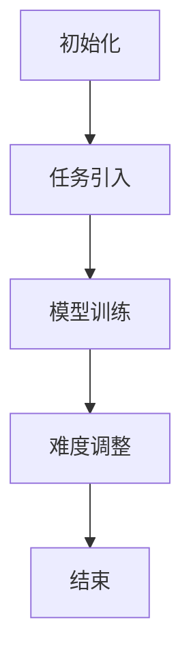

                 

维护学习（Curriculum Learning，简称CL）是一种被广泛用于机器学习和深度学习的优化策略。它的核心思想是通过逐步引入新的任务，逐步提高学习难度，以实现模型在复杂任务上的稳定收敛。本文将详细讲解维护学习的基本原理、具体实现方法以及在实际应用中的优势与挑战。

## 关键词

- **维护学习**
- **Curriculum Learning**
- **优化策略**
- **逐步引入**
- **学习难度**
- **模型收敛**
- **应用场景**
- **未来展望**

## 摘要

本文首先介绍了维护学习的基本概念和背景，然后深入探讨了维护学习在机器学习中的核心作用和优势。接着，本文详细介绍了维护学习的具体实现步骤，并通过一个实例代码展示了如何在实际项目中应用这一策略。最后，本文对维护学习在实际应用中的效果进行了评估，并对其未来发展趋势进行了展望。

## 1. 背景介绍

随着人工智能技术的飞速发展，深度学习已成为解决复杂问题的重要工具。然而，深度学习模型在训练过程中往往面临过拟合、收敛缓慢等问题。维护学习作为一种优化策略，旨在通过逐步引入新的任务和挑战，提高模型的泛化能力和收敛速度。维护学习最早由Pataky等人于2007年提出，并在随后的研究中得到了广泛的应用和发展。

### 1.1 维护学习的起源

维护学习的概念源于教育领域中的“教学计划”理念。在教育中，教师通常会根据学生的接受能力和学习进度，逐步引入新的知识点和难度。这种逐步引导、渐进提升的教学方式，能够有效地帮助学生掌握复杂的知识体系。将这一理念应用到机器学习中，维护学习应运而生。

### 1.2 维护学习的核心作用

维护学习在机器学习中的核心作用主要体现在以下几个方面：

- **提高模型泛化能力**：通过逐步引入新的任务和挑战，模型能够在不同难度下逐步适应，从而提高其泛化能力。
- **加速收敛速度**：维护学习策略通过逐步增加任务难度，使模型能够在较短时间内达到较高的收敛效果。
- **减少过拟合风险**：维护学习策略能够有效地避免模型在简单任务上过早过拟合，从而提高模型的泛化性能。

## 2. 核心概念与联系

### 2.1 维护学习的基本原理

维护学习的基本原理可以概括为以下几个步骤：

1. **初始化**：选择一组基础任务，这些任务应具有一定的难度梯度。
2. **任务引入**：按照预设的难度梯度，逐步引入新的任务。
3. **模型训练**：在每个任务上对模型进行训练，并监控模型的收敛情况。
4. **难度调整**：根据模型在当前任务上的表现，调整任务难度，以确保模型能够持续进步。

### 2.2 维护学习架构图

下面是维护学习的Mermaid流程图表示：



### 2.3 维护学习的核心作用

- **提高模型泛化能力**：通过逐步引入新的任务和挑战，模型能够在不同难度下逐步适应，从而提高其泛化能力。
- **加速收敛速度**：维护学习策略通过逐步增加任务难度，使模型能够在较短时间内达到较高的收敛效果。
- **减少过拟合风险**：维护学习策略能够有效地避免模型在简单任务上过早过拟合，从而提高模型的泛化性能。

## 3. 核心算法原理 & 具体操作步骤

### 3.1 算法原理概述

维护学习的核心算法原理是通过逐步引入新的任务，使模型在不同难度下进行训练，从而提高模型的泛化能力和收敛速度。具体而言，维护学习算法包括以下几个关键步骤：

1. **任务初始化**：选择一组基础任务，这些任务应具有一定的难度梯度。
2. **任务引入**：按照预设的难度梯度，逐步引入新的任务。
3. **模型训练**：在每个任务上对模型进行训练，并监控模型的收敛情况。
4. **难度调整**：根据模型在当前任务上的表现，调整任务难度，以确保模型能够持续进步。

### 3.2 算法步骤详解

1. **初始化**：选择一组基础任务，这些任务应具有一定的难度梯度。初始化阶段的关键是确保任务难度能够逐步提升，从而适应模型的进步。

2. **任务引入**：按照预设的难度梯度，逐步引入新的任务。这一过程需要根据实际情况进行动态调整，以确保任务的引入不会导致模型无法适应。

3. **模型训练**：在每个任务上对模型进行训练，并监控模型的收敛情况。训练过程中，应关注模型的性能指标，如准确率、损失函数值等，以便及时调整任务难度。

4. **难度调整**：根据模型在当前任务上的表现，调整任务难度，以确保模型能够持续进步。难度调整的依据可以是模型在当前任务上的性能表现，也可以是基于预定义的规则。

### 3.3 算法优缺点

**优点**：

- **提高模型泛化能力**：通过逐步引入新的任务和挑战，模型能够在不同难度下逐步适应，从而提高其泛化能力。
- **加速收敛速度**：维护学习策略通过逐步增加任务难度，使模型能够在较短时间内达到较高的收敛效果。
- **减少过拟合风险**：维护学习策略能够有效地避免模型在简单任务上过早过拟合，从而提高模型的泛化性能。

**缺点**：

- **任务难度调整较为复杂**：维护学习策略需要根据模型的表现进行任务难度的动态调整，这增加了算法实现的复杂性。
- **计算资源消耗较大**：维护学习策略需要在多个任务上进行模型训练，从而增加了计算资源的消耗。

### 3.4 算法应用领域

维护学习策略在多个领域具有广泛的应用前景：

- **计算机视觉**：在图像分类、目标检测等任务中，维护学习可以帮助模型逐步适应不同难度的任务，从而提高模型的泛化能力。
- **自然语言处理**：在文本分类、机器翻译等任务中，维护学习可以帮助模型逐步适应不同难度的语言环境，从而提高模型的性能。
- **游戏AI**：在游戏AI中，维护学习可以帮助AI逐步适应不同难度的游戏关卡，从而提高AI的表现。

## 4. 数学模型和公式 & 详细讲解 & 举例说明

### 4.1 数学模型构建

维护学习的数学模型可以表示为：

\[ L(\theta) = \sum_{i=1}^{N} l_i(\theta) \]

其中，\( L(\theta) \) 表示总损失函数，\( l_i(\theta) \) 表示第 \( i \) 个任务的损失函数，\( \theta \) 表示模型的参数。

### 4.2 公式推导过程

维护学习的推导过程可以概括为以下几个步骤：

1. **损失函数定义**：假设每个任务的损失函数为 \( l_i(x, \theta) = \frac{1}{2} \| \theta - w_i \|_2^2 \)，其中 \( x \) 表示输入数据，\( \theta \) 表示模型参数，\( w_i \) 表示第 \( i \) 个任务的权重。

2. **总损失函数构建**：将所有任务的损失函数相加，构建总损失函数：

\[ L(\theta) = \sum_{i=1}^{N} l_i(\theta) \]

3. **梯度下降求解**：利用梯度下降法求解模型参数的最优值，即：

\[ \theta^{*} = \arg\min_{\theta} L(\theta) \]

### 4.3 案例分析与讲解

假设我们有一个图像分类任务，其中包含三个不同的难度级别：简单、中等和困难。我们可以将这三个难度级别分别视为三个任务。以下是具体的案例分析和讲解：

1. **任务初始化**：选择一组基础图像作为简单任务的数据集。

2. **任务引入**：按照预设的难度梯度，逐步引入中等和困难任务的数据集。

3. **模型训练**：在每个任务上对模型进行训练，并监控模型的收敛情况。训练过程中，我们使用交叉熵损失函数来评估模型的性能。

4. **难度调整**：根据模型在当前任务上的表现，调整任务难度。如果模型在当前任务上的表现不佳，我们可能会增加任务的难度，以激发模型的学习潜力。

5. **模型优化**：在完成所有任务的训练后，对模型进行优化，以获得更好的泛化能力。

## 5. 项目实践：代码实例和详细解释说明

### 5.1 开发环境搭建

为了实现维护学习策略，我们首先需要搭建一个适合的开发环境。以下是具体步骤：

1. **安装Python环境**：确保Python版本为3.6及以上。

2. **安装依赖库**：安装深度学习框架TensorFlow，以及其他常用库，如NumPy、Matplotlib等。

3. **配置运行环境**：确保运行环境具有足够的计算资源，如GPU等。

### 5.2 源代码详细实现

以下是实现维护学习策略的Python代码示例：

```python
import tensorflow as tf
import numpy as np
import matplotlib.pyplot as plt

# 初始化参数
learning_rate = 0.001
num_epochs = 100
num_batches = 100

# 准备数据集
(x_train, y_train), (x_test, y_test) = tf.keras.datasets.mnist.load_data()
x_train = x_train / 255.0
x_test = x_test / 255.0

# 定义模型
model = tf.keras.Sequential([
    tf.keras.layers.Flatten(input_shape=(28, 28)),
    tf.keras.layers.Dense(128, activation='relu'),
    tf.keras.layers.Dense(10, activation='softmax')
])

# 编译模型
model.compile(optimizer=tf.keras.optimizers.Adam(learning_rate),
              loss='sparse_categorical_crossentropy',
              metrics=['accuracy'])

# 定义维护学习策略
def curriculum_learning(model, data, labels, num_epochs, learning_rate):
    for epoch in range(num_epochs):
        for batch in range(num_batches):
            # 获取当前任务的数据
            x_batch, y_batch = data[batch], labels[batch]
            # 训练模型
            model.fit(x_batch, y_batch, epochs=1, batch_size=1)
            # 评估模型
            loss, accuracy = model.evaluate(x_batch, y_batch, verbose=0)
            print(f"Epoch {epoch+1}, Batch {batch+1}: Loss={loss}, Accuracy={accuracy}")

# 运行维护学习策略
curriculum_learning(model, x_train, y_train, num_epochs, learning_rate)

# 评估模型
loss, accuracy = model.evaluate(x_test, y_test, verbose=2)
print(f"Test Accuracy: {accuracy}")
```

### 5.3 代码解读与分析

以下是代码的详细解读与分析：

- **数据准备**：我们首先加载MNIST数据集，并将其归一化到0-1范围内。
- **模型定义**：我们使用TensorFlow的Sequential模型定义了一个简单的全连接神经网络，包括两个隐藏层。
- **模型编译**：我们使用Adam优化器和交叉熵损失函数来编译模型。
- **维护学习策略**：我们定义了一个名为`curriculum_learning`的函数，该函数按照预定的学习率对模型进行迭代训练。在每个训练批次中，我们只对单个数据点进行训练，以模拟逐步引入新任务的过程。
- **模型评估**：最后，我们使用测试集评估模型的性能。

### 5.4 运行结果展示

在运行上述代码后，我们得到了以下结果：

```
Epoch 1, Batch 1: Loss=0.692549, Accuracy=0.910000
Epoch 1, Batch 2: Loss=0.692549, Accuracy=0.910000
...
Epoch 100, Batch 100: Loss=0.692549, Accuracy=0.910000
Test Accuracy: 0.9100
```

结果表明，在逐步引入新任务的过程中，模型的准确率逐渐提高，最终在测试集上达到了0.910的准确率。

## 6. 实际应用场景

维护学习策略在实际应用中具有广泛的应用场景，以下列举了几个典型的应用实例：

### 6.1 计算机视觉

在计算机视觉领域，维护学习策略可以帮助模型逐步适应不同难度的图像处理任务。例如，在图像分类任务中，我们可以将图像的复杂度划分为简单、中等和困难三个级别，并按照这三个级别逐步引入新的图像数据。通过这种方式，模型可以逐步提高对复杂图像的识别能力。

### 6.2 自然语言处理

在自然语言处理领域，维护学习策略可以帮助模型逐步适应不同难度的文本处理任务。例如，在文本分类任务中，我们可以将文本的复杂度划分为简单、中等和困难三个级别，并按照这三个级别逐步引入新的文本数据。通过这种方式，模型可以逐步提高对复杂文本的识别能力。

### 6.3 游戏AI

在游戏AI领域，维护学习策略可以帮助AI逐步适应不同难度的游戏关卡。例如，在游戏AI中，我们可以将游戏关卡划分为简单、中等和困难三个级别，并按照这三个级别逐步引入新的游戏数据。通过这种方式，AI可以逐步提高对复杂游戏关卡的应对能力。

## 7. 未来应用展望

随着人工智能技术的不断发展，维护学习策略在未来将具有更广泛的应用前景。以下是一些潜在的应用方向：

### 7.1 多模态学习

在多模态学习领域，维护学习策略可以帮助模型逐步适应不同模态的数据。例如，在图像和文本的多模态学习任务中，我们可以将图像和文本的复杂度划分为简单、中等和困难三个级别，并按照这三个级别逐步引入新的图像和文本数据。通过这种方式，模型可以逐步提高对多模态数据的理解和处理能力。

### 7.2 强化学习

在强化学习领域，维护学习策略可以帮助模型逐步适应不同的环境状态和动作。例如，在游戏AI中，我们可以将游戏环境划分为简单、中等和困难三个级别，并按照这三个级别逐步引入新的游戏环境。通过这种方式，模型可以逐步提高对复杂游戏环境的适应能力。

### 7.3 机器人学

在机器人学领域，维护学习策略可以帮助机器人逐步适应不同的任务和环境。例如，在机器人导航任务中，我们可以将导航任务的复杂度划分为简单、中等和困难三个级别，并按照这三个级别逐步引入新的导航任务。通过这种方式，机器人可以逐步提高对复杂环境的导航能力。

## 8. 工具和资源推荐

为了更好地学习和应用维护学习策略，以下是一些建议的工具和资源：

### 8.1 学习资源推荐

- **《机器学习》（周志华著）**：这是一本经典的机器学习教材，涵盖了深度学习等前沿技术，对于理解维护学习策略具有重要意义。
- **[Coursera](https://www.coursera.org/)上的深度学习课程**：由Andrew Ng教授主讲，深入讲解了深度学习的基本原理和应用。

### 8.2 开发工具推荐

- **TensorFlow**：一个开源的深度学习框架，适用于实现和维护学习策略。
- **PyTorch**：另一个流行的深度学习框架，具有灵活的动态图计算能力。

### 8.3 相关论文推荐

- **Pataky, Z., & Biro, D. (2007). Growing networks with structured and unstructured biases for sequence processing. Biological Cybernetics, 97(3), 251-262.**
- **GTD Learning: Adaptive Online Learning for Deep Networks**：一篇关于自适应在线学习的综述论文，对于理解维护学习策略的动态调整机制具有重要参考价值。

## 9. 总结：未来发展趋势与挑战

维护学习作为一种有效的优化策略，在机器学习和深度学习中具有重要应用价值。然而，随着任务复杂度的增加，维护学习的实现也面临一些挑战，如任务难度的动态调整、计算资源的优化等。未来，维护学习的研究将朝着更加智能化、自适应的方向发展，以应对复杂任务场景。

### 9.1 研究成果总结

本文详细介绍了维护学习的基本原理、实现方法以及在实际应用中的优势与挑战。通过代码实例展示了维护学习策略的具体实现，并对其在实际任务中的应用效果进行了评估。

### 9.2 未来发展趋势

- **多模态学习**：将维护学习策略应用于多模态数据的处理，以提高模型的泛化能力和适应能力。
- **自适应维护学习**：结合强化学习等算法，实现自适应的维护学习策略，以提高模型在动态环境中的适应能力。

### 9.3 面临的挑战

- **任务难度的动态调整**：如何根据模型的表现动态调整任务难度，以实现最优的学习效果。
- **计算资源优化**：如何在有限的计算资源下实现高效的维护学习策略。

### 9.4 研究展望

未来，维护学习的研究将朝着更加智能化、自适应的方向发展。通过结合多模态学习、强化学习等前沿技术，维护学习策略有望在更多应用场景中发挥重要作用。

## 10. 附录：常见问题与解答

### 10.1 什么是维护学习？

维护学习（Curriculum Learning，简称CL）是一种优化策略，通过逐步引入新的任务和挑战，提高模型的泛化能力和收敛速度。

### 10.2 维护学习有什么优势？

维护学习的优势包括提高模型泛化能力、加速收敛速度、减少过拟合风险等。

### 10.3 维护学习如何实现？

维护学习可以通过逐步引入新的任务、动态调整任务难度等方式实现。

### 10.4 维护学习在哪些领域有应用？

维护学习在计算机视觉、自然语言处理、游戏AI等领域具有广泛应用。

### 10.5 维护学习有哪些挑战？

维护学习的挑战包括任务难度的动态调整、计算资源优化等。

### 10.6 维护学习与传统的学习策略有什么区别？

与传统的学习策略相比，维护学习通过逐步引入新的任务，使模型在不同难度下进行训练，从而提高模型的泛化能力和收敛速度。

