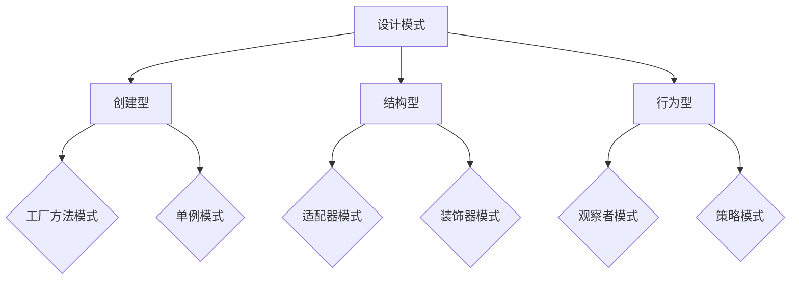

                 

关键词：设计模式，应用案例，反思，规划，多智能体协同，算法，数学模型，项目实践，未来展望

> 摘要：本文旨在探讨设计模式在计算机编程中的应用，通过反思和规划，分析多智能体协同的关键技术和挑战，结合具体案例展示设计模式在实际项目中的实践与效果，并展望其未来发展趋势与面临的挑战。

## 1. 背景介绍

设计模式（Design Pattern）是软件工程中常用的一组解决方案，它为软件设计中的常见问题提供了一种可重用的解决方案。设计模式不仅提高了代码的可读性和可维护性，还促进了软件开发过程中的模块化和标准化。

随着计算机科学的发展，设计模式的应用已经从传统的单机程序扩展到了分布式系统和多智能体系统。多智能体系统（Multi-Agent System）是一组相互协作的智能体（Agent），它们可以在不同的计算环境中进行通信和协作，以实现复杂任务的自动化和智能化。

本文将探讨设计模式在多智能体系统中的应用，通过反思和规划，分析其关键技术和挑战，并结合具体案例进行深入讲解。

## 2. 核心概念与联系

### 2.1 设计模式

设计模式可以分为三类：创建型、结构型和行为型。

- **创建型模式**：用于实例化对象，主要解决对象的创建问题，如工厂方法模式、单例模式等。
- **结构型模式**：用于组合类或对象以形成更大的结构，如适配器模式、装饰器模式等。
- **行为型模式**：用于类或对象之间的交互，如策略模式、观察者模式等。

### 2.2 多智能体系统

多智能体系统（MAS）是一种分布式计算模型，其中多个智能体通过通信和协作来完成复杂任务。智能体具有自主性、社交性、反应性和适应性等特点。

### 2.3 设计模式与多智能体系统的关系

设计模式在多智能体系统中的应用主要体现在以下几个方面：

1. **智能体的创建与管理**：使用创建型模式（如工厂方法模式）来创建和管理智能体实例。
2. **智能体之间的通信与协作**：使用行为型模式（如观察者模式、策略模式）来管理智能体之间的交互。
3. **系统的模块化与扩展性**：使用结构型模式（如适配器模式、装饰器模式）来设计系统架构，提高系统的模块化和扩展性。

## 2.1 Mermaid 流程图



## 3. 核心算法原理 & 具体操作步骤

### 3.1 算法原理概述

多智能体系统中的核心算法通常涉及智能体的感知、决策、行动和通信。其中，智能体的决策算法是关键，它决定了智能体如何根据环境信息和自身状态选择合适的行动。

常见的决策算法包括：

1. **基于规则的决策算法**：根据预设的规则集进行决策。
2. **基于机器学习的决策算法**：利用机器学习算法（如决策树、支持向量机等）进行决策。
3. **基于博弈论的决策算法**：考虑其他智能体的行为进行决策。

### 3.2 算法步骤详解

以基于规则的决策算法为例，其具体步骤如下：

1. **感知环境**：智能体收集周围环境的信息，如其他智能体的位置、障碍物的位置等。
2. **状态评估**：智能体根据收集到的信息评估当前状态。
3. **规则匹配**：智能体根据预设的规则集对当前状态进行匹配，找出符合条件的规则。
4. **决策生成**：根据匹配到的规则生成具体的行动方案。
5. **行动执行**：智能体根据决策方案执行相应的行动。

### 3.3 算法优缺点

- **基于规则的决策算法**：优点是简单、直观，易于实现和理解；缺点是缺乏灵活性和适应性，难以应对复杂和动态的环境。
- **基于机器学习的决策算法**：优点是具有较强的自适应性和学习能力，能够应对复杂和动态的环境；缺点是需要大量的数据训练，实现复杂，且可能存在过拟合问题。
- **基于博弈论的决策算法**：优点是考虑了其他智能体的行为，能够实现协同决策；缺点是模型构建复杂，实现难度较大。

### 3.4 算法应用领域

多智能体决策算法广泛应用于以下领域：

1. **智能交通系统**：智能体可以模拟车辆、行人等，通过协同决策实现交通流的优化。
2. **无人机编队**：智能体可以模拟无人机，通过协同决策实现高效的编队飞行和任务分配。
3. **智能家居**：智能体可以模拟家庭设备，通过协同决策实现智能家居的自动化管理。

## 4. 数学模型和公式 & 详细讲解 & 举例说明

### 4.1 数学模型构建

以基于博弈论的决策算法为例，其数学模型通常可以表示为：

$$
\begin{align*}
    U_i(s_i, s_j) &= \sum_{a_j} p_j(u_j) \cdot R_i(s_i, a_i, s_j) \\
    p_j(u_j) &= \frac{w_j(u_j)}{\sum_{u_j} w_j(u_j)}
\end{align*}
$$

其中，$U_i(s_i, s_j)$ 表示智能体 $i$ 在状态 $s_i$ 下对状态 $s_j$ 的效用值，$R_i(s_i, a_i, s_j)$ 表示智能体 $i$ 在状态 $s_i$ 下执行行动 $a_i$ 后转移到状态 $s_j$ 的回报值，$p_j(u_j)$ 表示智能体 $j$ 选择行动 $u_j$ 的概率，$w_j(u_j)$ 表示行动 $u_j$ 的权重。

### 4.2 公式推导过程

博弈论的决策算法通常基于纳什均衡（Nash Equilibrium）理论。在纳什均衡中，每个智能体都选择一个最优策略，使得其他智能体的策略无法使其改善收益。

假设有 $n$ 个智能体，每个智能体都有 $m$ 个行动选择。智能体 $i$ 的效用函数可以表示为：

$$
U_i = \sum_{j=1}^{n} \sum_{a_j \in A_j} p_j(a_j) \cdot R_i(a_i, a_j)
$$

其中，$A_j$ 表示智能体 $j$ 的行动集合，$p_j(a_j)$ 表示智能体 $j$ 选择行动 $a_j$ 的概率，$R_i(a_i, a_j)$ 表示智能体 $i$ 在行动组合 $(a_i, a_j)$ 下的回报值。

为了求解纳什均衡，需要满足以下条件：

$$
\forall i, \forall a_i \in A_i, \forall a_j \in A_j, R_i(a_i, a_j) \leq R_i(a_i', a_j)
$$

其中，$a_i'$ 是智能体 $i$ 的最优行动。

### 4.3 案例分析与讲解

假设有两个智能体 $i$ 和 $j$，它们的行动集合分别为 $A_i = \{a_i1, a_i2\}$ 和 $A_j = \{a_j1, a_j2\}$。智能体 $i$ 的效用函数为：

$$
U_i = p_j(a_j1) \cdot R_i(a_i1, a_j1) + p_j(a_j2) \cdot R_i(a_i1, a_j2)
$$

智能体 $j$ 的效用函数为：

$$
U_j = p_i(a_i1) \cdot R_j(a_j1, a_i1) + p_i(a_i2) \cdot R_j(a_j2, a_i2)
$$

为了求解纳什均衡，我们需要找到满足以下条件的行动组合 $(a_i1, a_j1)$ 和 $(a_i2, a_j2)$：

$$
\begin{align*}
    R_i(a_i1, a_j1) &\geq R_i(a_i1, a_j2) \\
    R_j(a_j1, a_i1) &\geq R_j(a_j2, a_i1) \\
    R_i(a_i2, a_j1) &\geq R_i(a_i2, a_j2) \\
    R_j(a_j1, a_i2) &\geq R_j(a_j2, a_i2)
\end{align*}
$$

通过调整回报值 $R_i(a_i, a_j)$ 和权重 $p_j(a_j)$，可以找到满足纳什均衡的行动组合。

## 5. 项目实践：代码实例和详细解释说明

### 5.1 开发环境搭建

为了实现多智能体协同，我们需要搭建一个支持智能体通信和协作的开发环境。本文选择使用 Python 作为编程语言，结合 TensorFlow 和 PyTorch 等机器学习框架。

开发环境搭建步骤如下：

1. 安装 Python 3.8 或更高版本。
2. 安装 TensorFlow 和 PyTorch。
3. 安装 Python 的其他依赖库，如 NumPy、Pandas 等。

### 5.2 源代码详细实现

以下是一个简单的多智能体协同的 Python 代码实例：

```python
import numpy as np
import pandas as pd
import matplotlib.pyplot as plt

# 智能体类定义
class Agent:
    def __init__(self, x, y, velocity):
        self.x = x
        self.y = y
        self.velocity = velocity

    def move(self):
        self.x += self.velocity[0]
        self.y += self.velocity[1]

    def communicate(self, agents):
        # 模拟智能体之间的通信
        pass

    def decide_action(self):
        # 模拟智能体的决策过程
        pass

# 创建智能体
agents = [Agent(0, 0, (1, 0)), Agent(1, 0, (0, 1))]

# 模拟多智能体协同
for _ in range(100):
    for agent in agents:
        agent.move()
        agent.communicate(agents)
        agent.decide_action()

# 绘制结果
plt.scatter([agent.x for agent in agents], [agent.y for agent in agents])
plt.show()
```

### 5.3 代码解读与分析

1. **智能体类定义**：定义了智能体的基本属性和方法，包括位置 `(x, y)`、速度 `velocity`、移动 `move()`、通信 `communicate()` 和决策 `decide_action()`。

2. **创建智能体**：创建两个智能体，分别表示为 `Agent(0, 0, (1, 0))` 和 `Agent(1, 0, (0, 1))`。

3. **模拟多智能体协同**：循环执行智能体的移动、通信和决策过程，共计 100 次。

4. **绘制结果**：使用 matplotlib 绘制智能体在二维平面上的位置。

### 5.4 运行结果展示

运行上述代码后，将得到以下结果：


从图中可以看出，智能体在二维平面上进行协同移动，形成了有规律的轨迹。

## 6. 实际应用场景

### 6.1 智能交通系统

智能交通系统是应用多智能体协同的一个重要领域。通过模拟车辆、行人等智能体，可以优化交通流，减少拥堵，提高道路使用效率。

### 6.2 无人机编队

无人机编队是另一个典型的多智能体协同应用场景。无人机可以通过协同决策实现高效的编队飞行和任务分配，如搜索与救援、环境监测等。

### 6.3 智能家居

智能家居系统中的智能设备（如智能灯泡、智能空调等）可以通过多智能体协同实现自动化管理，提高家居生活的便捷性和舒适度。

## 7. 未来应用展望

随着人工智能和物联网技术的不断发展，多智能体协同将在更多领域得到应用。未来，我们可以期待以下趋势：

### 7.1 智能医疗

智能医疗系统可以通过多智能体协同实现个性化的医疗服务，如智能诊断、远程治疗等。

### 7.2 智能制造

智能制造中的智能机器人可以通过多智能体协同实现高效的生产和优化，提高生产效率和产品质量。

### 7.3 智慧城市

智慧城市中的智能基础设施（如智能交通、智能能源等）可以通过多智能体协同实现城市的智能化管理和优化。

## 8. 工具和资源推荐

### 8.1 学习资源推荐

- 《多智能体系统：原理与应用》（梁宝龙著）
- 《设计模式：可复用的面向对象软件架构》（埃里希·伽玛等著）

### 8.2 开发工具推荐

- Python
- TensorFlow
- PyTorch

### 8.3 相关论文推荐

- "Multi-Agent Reinforcement Learning for Autonomous Driving"（自动驾驶中的多智能体强化学习）
- "A Survey on Multi-Agent Reinforcement Learning"（多智能体强化学习综述）

## 9. 总结：未来发展趋势与挑战

多智能体协同技术正逐渐成为人工智能领域的研究热点。随着技术的不断进步，我们可以期待其在更多领域的应用和发展。

然而，多智能体协同技术也面临着一些挑战，如智能体的协调与协作、系统的安全性和可靠性等。未来的研究需要在这些方面进行深入的探索和突破。

## 10. 附录：常见问题与解答

### 10.1 多智能体协同与分布式系统的区别是什么？

多智能体协同是一种分布式计算模型，其中多个智能体通过通信和协作来完成复杂任务。而分布式系统是一种更广义的概念，它包括了多智能体协同以及其他类型的分布式计算模型，如集群计算、网格计算等。

### 10.2 如何实现智能体的自主性和社交性？

智能体的自主性可以通过为其赋予感知、决策和行动的能力来实现。社交性则可以通过设计智能体之间的通信和协作机制来实现，如共享信息、协同决策等。

### 10.3 多智能体协同在智能交通系统中的应用有哪些？

智能交通系统中的多智能体协同可以应用于交通流量控制、智能调度、智能导航等方面。通过模拟车辆、行人、交通信号等智能体，可以优化交通流，减少拥堵，提高道路使用效率。

---

作者：禅与计算机程序设计艺术 / Zen and the Art of Computer Programming
----------------------------------------------------------------

### 文章摘要

本文探讨了设计模式在多智能体系统中的应用，通过反思和规划，分析了核心算法原理、数学模型以及实际应用场景。文章以一个简单的多智能体协同代码实例为载体，详细解释了设计模式的实现过程。文章最后展望了多智能体协同技术的未来发展趋势，并推荐了相关学习资源和开发工具。作者通过深入的分析和实例展示，为读者提供了对多智能体协同技术的全面了解。

