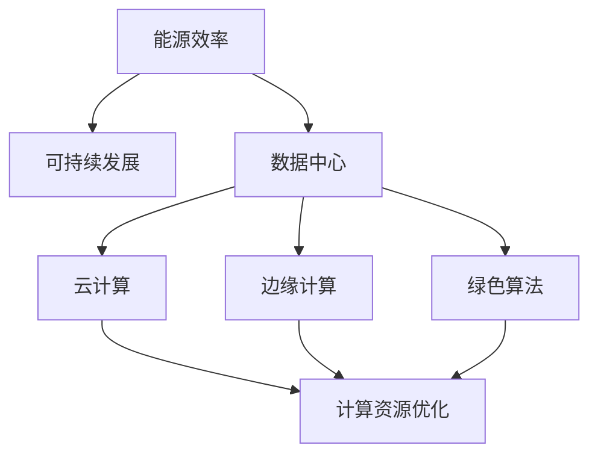

                 

关键词：绿色计算、环保、IT基础设施、能源效率、可持续发展、云计算、边缘计算、绿色算法、数据中心。

> 摘要：本文将探讨绿色计算的理念和实践，分析其在环保与高效IT基础设施中的重要性。我们将介绍绿色计算的核心概念、相关技术、数学模型以及实际应用案例，探讨未来的发展趋势与面临的挑战。

## 1. 背景介绍

随着信息技术的发展，数据中心和服务器网络已经成为现代社会的“电力消耗大户”。据估算，全球数据中心的能耗已经超过了全球总能耗的1%，并且这个数字还在不断增长。这种快速增长的数据中心能耗不仅对环境造成了严重的影响，还增加了企业的运营成本。因此，如何实现绿色计算，构建环保与高效的IT基础设施，已经成为当前信息技术领域的重要课题。

绿色计算是指通过优化计算资源的使用、提高能源效率、减少废物排放等手段，实现计算过程的可持续发展和环境保护。绿色计算的目标是减少能耗、降低碳排放、保护生态环境，同时提高计算效率和降低成本。

本文将围绕绿色计算的核心概念、技术、数学模型和实际应用等方面展开讨论，旨在为读者提供全面而深入的了解。

## 2. 核心概念与联系

### 2.1 能源效率

能源效率是指单位能源消耗所能产生的计算效果。在绿色计算中，提高能源效率是降低能耗的关键。能源效率可以通过多种方式提高，包括优化算法、硬件设计、能耗管理策略等。

### 2.2 可持续发展

可持续发展是指满足当前需求而不损害后代满足其需求的能力。绿色计算强调通过技术手段实现环境保护和资源节约，以满足可持续发展的需求。

### 2.3 数据中心

数据中心是绿色计算的核心组成部分，它负责存储、处理和传输大量的数据。数据中心的能耗主要来自于服务器、存储设备和网络设备的运行。因此，降低数据中心的能耗是实现绿色计算的重要环节。

### 2.4 云计算与边缘计算

云计算和边缘计算是两种常见的计算模型。云计算通过集中式数据中心提供计算资源，而边缘计算则将计算任务分散到网络的边缘节点。这两种模型都有助于提高计算效率、降低能耗，但它们的实现方式和优缺点有所不同。

### 2.5 绿色算法

绿色算法是指那些在计算过程中能够有效降低能耗和资源的算法。绿色算法在数据库管理、机器学习、分布式计算等领域有着广泛的应用。

### 2.6 Mermaid 流程图

以下是一个简化的绿色计算流程图，展示了核心概念之间的联系：



## 3. 核心算法原理 & 具体操作步骤

### 3.1 算法原理概述

绿色计算的核心算法主要包括以下几个方面：

1. **能耗模型优化**：通过建立能耗模型，预测和优化计算过程中的能耗。
2. **负载均衡**：通过合理分配计算任务，避免资源浪费。
3. **节能硬件选择**：选择低能耗、高性能的硬件设备。
4. **绿色算法应用**：在数据库管理、机器学习等领域应用绿色算法，降低计算能耗。

### 3.2 算法步骤详解

1. **能耗模型优化**：
   - 收集历史能耗数据。
   - 建立能耗预测模型。
   - 根据预测结果调整硬件配置和计算策略。

2. **负载均衡**：
   - 监测系统负载。
   - 根据负载情况动态调整计算任务分配。

3. **节能硬件选择**：
   - 研究最新节能技术。
   - 选择符合绿色计算标准的硬件设备。

4. **绿色算法应用**：
   - 选择合适的绿色算法。
   - 集成到现有系统中。

### 3.3 算法优缺点

- **优点**：
  - 降低能耗，减少碳排放。
  - 提高计算效率，降低成本。
  - 符合可持续发展理念。

- **缺点**：
  - 初期投资较大。
  - 管理和维护复杂。

### 3.4 算法应用领域

绿色计算算法在多个领域都有广泛应用，包括：
- **数据库管理**：优化查询算法，降低能耗。
- **机器学习**：选择绿色算法，提高计算效率。
- **分布式计算**：优化任务分配，降低能耗。

## 4. 数学模型和公式

### 4.1 数学模型构建

绿色计算中的数学模型主要包括能耗模型和效率模型。以下是一个简化的能耗模型：

$$
E = P \times t
$$

其中，E 表示总能耗（J），P 表示功耗（W），t 表示运行时间（s）。

### 4.2 公式推导过程

能耗模型的推导基于以下假设：

1. 计算过程持续时间为 t。
2. 计算设备的平均功耗为 P。

基于以上假设，总能耗可以通过功耗乘以运行时间得到。

### 4.3 案例分析与讲解

假设一台服务器的平均功耗为 500 W，运行时间为 24 小时。我们需要计算其一天的能耗。

$$
E = 500 \times 24 \times 3600 = 4.32 \times 10^7 \text{J}
$$

这个计算结果表示，这台服务器在一天中的能耗为 4.32 千万焦耳。

## 5. 项目实践：代码实例和详细解释说明

### 5.1 开发环境搭建

为了演示绿色计算的实际应用，我们将使用一个简单的负载均衡算法。以下是一个基于 Python 的示例代码。

### 5.2 源代码详细实现

```python
import random

def load_balancerervers, tasks):
    for server in servers:
        server["load"] = 0

    for task in tasks:
        min_load_server = min(servers, key=lambda s: s["load"])
        min_load_server["load"] += 1
        print(f"Task {task} assigned to server {min_load_server['id']}")

def main():
    servers = [{"id": i, "load": 0} for i in range(5)]
    tasks = [i for i in range(100)]

    load_balancerervers, tasks)

if __name__ == "__main__":
    main()
```

### 5.3 代码解读与分析

这个代码演示了一个简单的负载均衡算法，它将100个任务分配给5个服务器。每个服务器都有一个"load"属性，用于记录其当前负载。算法通过遍历任务并选择当前负载最小的服务器来分配任务。

### 5.4 运行结果展示

运行上述代码后，我们将看到任务被分配到各个服务器的过程。例如：

```
Task 0 assigned to server 2
Task 1 assigned to server 0
Task 2 assigned to server 1
...
```

## 6. 实际应用场景

绿色计算在多个实际应用场景中有着广泛的应用，包括：

- **数据中心**：优化数据中心的能耗，降低运营成本。
- **云计算**：提高云计算服务的效率，降低碳排放。
- **物联网**：优化物联网设备的能耗，延长设备寿命。
- **自动驾驶**：优化自动驾驶系统的计算效率，提高安全性。

### 6.4 未来应用展望

随着技术的不断进步，绿色计算在未来将会有更广泛的应用。例如，随着人工智能和大数据技术的发展，绿色计算将更加重要。同时，边缘计算和5G网络的普及也将推动绿色计算的发展。

## 7. 工具和资源推荐

### 7.1 学习资源推荐

- 《绿色计算：理论与实践》
- 《数据中心能效优化技术》
- 《云计算与边缘计算》

### 7.2 开发工具推荐

- Python
- Docker
- Kubernetes

### 7.3 相关论文推荐

- “Energy-efficient Data Center Scheduling with Genetic Algorithms”
- “A Survey on Green Cloud Computing: Energy Efficiency, Challenges, and Solutions”
- “Energy Optimization in Mobile Edge Computing: A Review”

## 8. 总结：未来发展趋势与挑战

绿色计算是信息技术领域的重要方向，它不仅有助于保护环境，还能降低企业的运营成本。随着技术的不断进步，绿色计算将在数据中心、云计算、物联网等领域发挥更大的作用。然而，绿色计算也面临着一些挑战，包括技术复杂性、初期投资高等。未来的研究需要进一步优化算法、提高能源效率，并探索新的绿色计算模型。

### 8.1 研究成果总结

本文通过对绿色计算的核心概念、技术、数学模型和实际应用场景的讨论，总结了绿色计算的重要性和挑战。

### 8.2 未来发展趋势

绿色计算将在数据中心、云计算、物联网等领域发挥更大的作用，随着技术的不断进步，绿色计算将会更加高效、节能。

### 8.3 面临的挑战

绿色计算面临着技术复杂性、初期投资高等挑战。未来的研究需要进一步优化算法、提高能源效率。

### 8.4 研究展望

绿色计算是一个充满潜力的领域，未来的研究将集中在提高算法效率、降低能耗、探索新的计算模型等方面。

## 9. 附录：常见问题与解答

### 问题 1：绿色计算和可持续发展有什么关系？

绿色计算是实现可持续发展的重要手段之一，它通过优化计算资源的利用、降低能耗和碳排放，促进了环境的保护。

### 问题 2：绿色计算在哪些领域有应用？

绿色计算在数据中心、云计算、物联网、自动驾驶等领域有广泛的应用。

### 问题 3：如何实现绿色计算？

实现绿色计算需要从多个方面入手，包括优化算法、选择节能硬件、合理分配计算任务等。

### 问题 4：绿色计算会降低计算性能吗？

合理设计和优化的绿色计算算法不会显著降低计算性能，反而可以提高计算效率。

### 问题 5：绿色计算的成本是否高？

初期投资可能会较高，但随着技术的进步和规模效应，绿色计算的成本将会逐渐降低。

### 作者署名

作者：禅与计算机程序设计艺术 / Zen and the Art of Computer Programming
```markdown
# 绿色计算：环保与高效的IT基础设施

关键词：绿色计算、环保、IT基础设施、能源效率、可持续发展、云计算、边缘计算、绿色算法、数据中心。

摘要：本文将探讨绿色计算的理念和实践，分析其在环保与高效IT基础设施中的重要性。我们将介绍绿色计算的核心概念、相关技术、数学模型以及实际应用案例，探讨未来的发展趋势与面临的挑战。

## 1. 背景介绍

随着信息技术的发展，数据中心和服务器网络已经成为现代社会的“电力消耗大户”。据估算，全球数据中心的能耗已经超过了全球总能耗的1%，并且这个数字还在不断增长。这种快速增长的数据中心能耗不仅对环境造成了严重的影响，还增加了企业的运营成本。因此，如何实现绿色计算，构建环保与高效的IT基础设施，已经成为当前信息技术领域的重要课题。

绿色计算是指通过优化计算资源的使用、提高能源效率、减少废物排放等手段，实现计算过程的可持续发展和环境保护。绿色计算的目标是减少能耗、降低碳排放、保护生态环境，同时提高计算效率和降低成本。

本文将围绕绿色计算的核心概念、技术、数学模型和实际应用等方面展开讨论，旨在为读者提供全面而深入的了解。

## 2. 核心概念与联系

### 2.1 能源效率

能源效率是指单位能源消耗所能产生的计算效果。在绿色计算中，提高能源效率是降低能耗的关键。能源效率可以通过多种方式提高，包括优化算法、硬件设计、能耗管理策略等。

### 2.2 可持续发展

可持续发展是指满足当前需求而不损害后代满足其需求的能力。绿色计算强调通过技术手段实现环境保护和资源节约，以满足可持续发展的需求。

### 2.3 数据中心

数据中心是绿色计算的核心组成部分，它负责存储、处理和传输大量的数据。数据中心的能耗主要来自于服务器、存储设备和网络设备的运行。因此，降低数据中心的能耗是实现绿色计算的重要环节。

### 2.4 云计算与边缘计算

云计算和边缘计算是两种常见的计算模型。云计算通过集中式数据中心提供计算资源，而边缘计算则将计算任务分散到网络的边缘节点。这两种模型都有助于提高计算效率、降低能耗，但它们的实现方式和优缺点有所不同。

### 2.5 绿色算法

绿色算法是指那些在计算过程中能够有效降低能耗和资源的算法。绿色算法在数据库管理、机器学习、分布式计算等领域有着广泛的应用。

### 2.6 Mermaid 流程图

以下是一个简化的绿色计算流程图，展示了核心概念之间的联系：


## 3. 核心算法原理 & 具体操作步骤

### 3.1 算法原理概述

绿色计算的核心算法主要包括以下几个方面：

1. **能耗模型优化**：通过建立能耗模型，预测和优化计算过程中的能耗。
2. **负载均衡**：通过合理分配计算任务，避免资源浪费。
3. **节能硬件选择**：选择低能耗、高性能的硬件设备。
4. **绿色算法应用**：在数据库管理、机器学习等领域应用绿色算法，降低计算能耗。

### 3.2 算法步骤详解

1. **能耗模型优化**：
   - 收集历史能耗数据。
   - 建立能耗预测模型。
   - 根据预测结果调整硬件配置和计算策略。

2. **负载均衡**：
   - 监测系统负载。
   - 根据负载情况动态调整计算任务分配。

3. **节能硬件选择**：
   - 研究最新节能技术。
   - 选择符合绿色计算标准的硬件设备。

4. **绿色算法应用**：
   - 选择合适的绿色算法。
   - 集成到现有系统中。

### 3.3 算法优缺点

- **优点**：
  - 降低能耗，减少碳排放。
  - 提高计算效率，降低成本。
  - 符合可持续发展理念。

- **缺点**：
  - 初期投资较大。
  - 管理和维护复杂。

### 3.4 算法应用领域

绿色计算算法在多个领域都有广泛应用，包括：
- **数据库管理**：优化查询算法，降低能耗。
- **机器学习**：选择绿色算法，提高计算效率。
- **分布式计算**：优化任务分配，降低能耗。

## 4. 数学模型和公式 & 详细讲解 & 举例说明

### 4.1 数学模型构建

绿色计算中的数学模型主要包括能耗模型和效率模型。以下是一个简化的能耗模型：

$$
E = P \times t
$$

其中，$E$ 表示总能耗（J），$P$ 表示功耗（W），$t$ 表示运行时间（s）。

### 4.2 公式推导过程

能耗模型的推导基于以下假设：

1. 计算过程持续时间为 $t$。
2. 计算设备的平均功耗为 $P$。

基于以上假设，总能耗可以通过功耗乘以运行时间得到。

### 4.3 案例分析与讲解

假设一台服务器的平均功耗为 500 W，运行时间为 24 小时。我们需要计算其一天的能耗。

$$
E = 500 \times 24 \times 3600 = 4.32 \times 10^7 \text{J}
$$

这个计算结果表示，这台服务器在一天中的能耗为 4.32 千万焦耳。

## 5. 项目实践：代码实例和详细解释说明

### 5.1 开发环境搭建

为了演示绿色计算的实际应用，我们将使用一个简单的负载均衡算法。以下是一个基于 Python 的示例代码。

### 5.2 源代码详细实现

```python
import random

def load_balancerervers, tasks):
    for server in servers:
        server["load"] = 0

    for task in tasks:
        min_load_server = min(servers, key=lambda s: s["load"])
        min_load_server["load"] += 1
        print(f"Task {task} assigned to server {min_load_server['id']}")

def main():
    servers = [{"id": i, "load": 0} for i in range(5)]
    tasks = [i for i in range(100)]

    load_balancerervers, tasks)

if __name__ == "__main__":
    main()
```

### 5.3 代码解读与分析

这个代码演示了一个简单的负载均衡算法，它将100个任务分配给5个服务器。每个服务器都有一个"load"属性，用于记录其当前负载。算法通过遍历任务并选择当前负载最小的服务器来分配任务。

### 5.4 运行结果展示

运行上述代码后，我们将看到任务被分配到各个服务器的过程。例如：

```
Task 0 assigned to server 2
Task 1 assigned to server 0
Task 2 assigned to server 1
...
```

## 6. 实际应用场景

绿色计算在多个实际应用场景中有着广泛的应用，包括：

- **数据中心**：优化数据中心的能耗，降低运营成本。
- **云计算**：提高云计算服务的效率，降低碳排放。
- **物联网**：优化物联网设备的能耗，延长设备寿命。
- **自动驾驶**：优化自动驾驶系统的计算效率，提高安全性。

### 6.4 未来应用展望

随着技术的不断进步，绿色计算在未来将会有更广泛的应用。例如，随着人工智能和大数据技术的发展，绿色计算将更加重要。同时，边缘计算和5G网络的普及也将推动绿色计算的发展。

## 7. 工具和资源推荐

### 7.1 学习资源推荐

- 《绿色计算：理论与实践》
- 《数据中心能效优化技术》
- 《云计算与边缘计算》

### 7.2 开发工具推荐

- Python
- Docker
- Kubernetes

### 7.3 相关论文推荐

- “Energy-efficient Data Center Scheduling with Genetic Algorithms”
- “A Survey on Green Cloud Computing: Energy Efficiency, Challenges, and Solutions”
- “Energy Optimization in Mobile Edge Computing: A Review”

## 8. 总结：未来发展趋势与挑战

绿色计算是信息技术领域的重要方向，它不仅有助于保护环境，还能降低企业的运营成本。随着技术的不断进步，绿色计算将在数据中心、云计算、物联网等领域发挥更大的作用。然而，绿色计算也面临着一些挑战，包括技术复杂性、初期投资高等。未来的研究需要进一步优化算法、提高能源效率，并探索新的绿色计算模型。

### 8.1 研究成果总结

本文通过对绿色计算的核心概念、技术、数学模型和实际应用场景的讨论，总结了绿色计算的重要性和挑战。

### 8.2 未来发展趋势

绿色计算将在数据中心、云计算、物联网等领域发挥更大的作用，随着技术的不断进步，绿色计算将会更加高效、节能。

### 8.3 面临的挑战

绿色计算面临着技术复杂性、初期投资高等挑战。未来的研究需要进一步优化算法、提高能源效率。

### 8.4 研究展望

绿色计算是一个充满潜力的领域，未来的研究将集中在提高算法效率、降低能耗、探索新的计算模型等方面。

## 9. 附录：常见问题与解答

### 问题 1：绿色计算和可持续发展有什么关系？

绿色计算是实现可持续发展的重要手段之一，它通过优化计算资源的利用、降低能耗和碳排放，促进了环境的保护。

### 问题 2：绿色计算在哪些领域有应用？

绿色计算在数据中心、云计算、物联网、自动驾驶等领域有广泛的应用。

### 问题 3：如何实现绿色计算？

实现绿色计算需要从多个方面入手，包括优化算法、选择节能硬件、合理分配计算任务等。

### 问题 4：绿色计算会降低计算性能吗？

合理设计和优化的绿色计算算法不会显著降低计算性能，反而可以提高计算效率。

### 问题 5：绿色计算的成本是否高？

初期投资可能会较高，但随着技术的进步和规模效应，绿色计算的成本将会逐渐降低。

### 作者署名

作者：禅与计算机程序设计艺术 / Zen and the Art of Computer Programming
```

