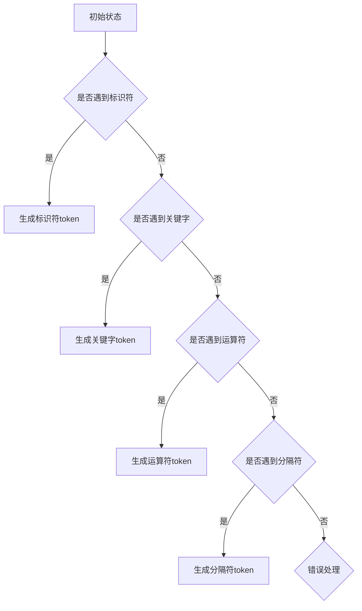
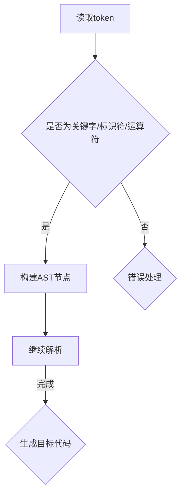
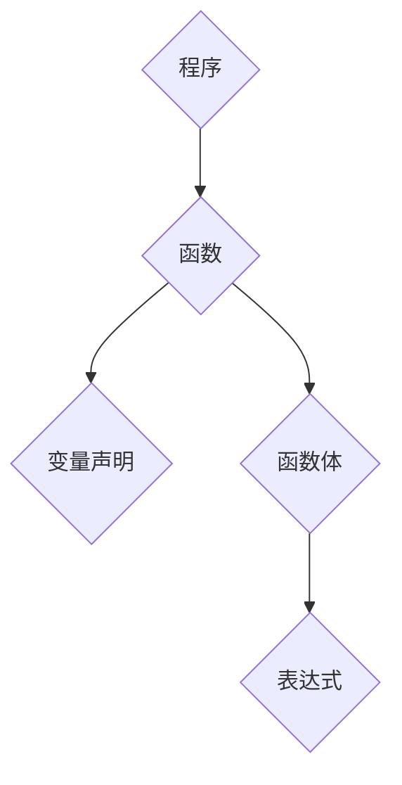
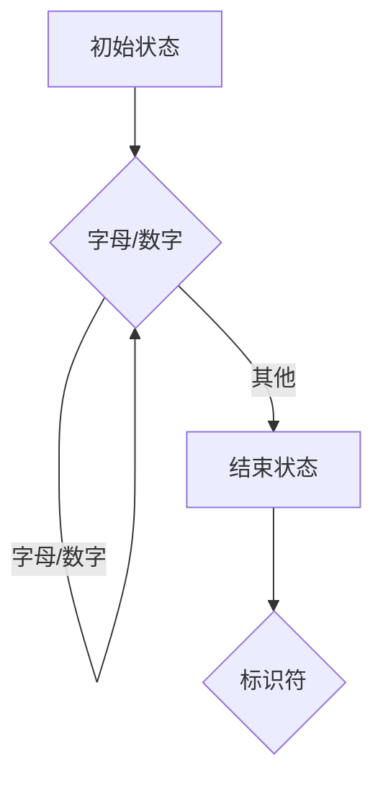
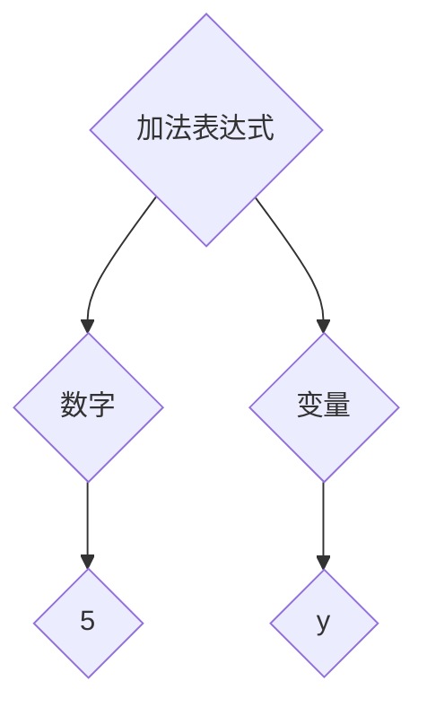

                 

 **关键词：** 编程语言解析器、词法分析、语法分析、编译原理、语言处理、抽象语法树（AST）

**摘要：** 本文将深入探讨编程语言解析器的核心组成部分——词法分析和语法分析。我们将从背景介绍开始，阐述核心概念，详细解释算法原理和数学模型，并结合具体实例进行代码实现和解析。此外，还将分析实际应用场景，展望未来发展，并推荐相关工具和资源。

## 1. 背景介绍

编程语言解析器是计算机科学中不可或缺的一部分。它们负责将程序员编写的代码转换成计算机可以理解和执行的指令。在解析过程中，词法分析和语法分析是两个关键步骤，它们共同作用以确保代码的正确性和可执行性。

词法分析（Lexical Analysis）是将输入的源代码分解成一系列单词（tokens），这些单词是编程语言的基本构建块。例如，变量名、关键字、运算符等。词法分析器（Lexer）通常是一个简单的程序，它负责执行这一任务。

语法分析（Syntax Analysis）则负责检查源代码的词法结构是否符合特定编程语言的语法规则。语法分析器（Parser）通常是一个更复杂的程序，它通过构建抽象语法树（Abstract Syntax Tree，AST）来表示代码的结构。

编译原理是计算机科学的核心领域之一，涉及到如何将高级编程语言转换成机器代码或其他形式的目标代码。在编译原理中，词法分析和语法分析是两个基础且关键的部分。

## 2. 核心概念与联系

### 词法分析（Lexical Analysis）

词法分析是将源代码分解成一系列单词的过程。这个过程通常涉及以下几个步骤：

1. **词法规则定义**：定义源代码中所有可能的单词，包括变量名、关键字、运算符等。
2. **输入流扫描**：读取源代码的字符序列，并逐个扫描字符。
3. **状态转换**：根据当前字符，从初始状态开始进行状态转换，以确定下一个单词的开始和结束位置。
4. **生成tokens**：根据状态转换的结果，生成对应的tokens。

下面是一个简单的 Mermaid 流程图，展示了词法分析的基本流程：



### 语法分析（Syntax Analysis）

语法分析是将词法分析生成的tokens组织成一个抽象语法树的过程。这个过程通常涉及以下几个步骤：

1. **语法规则定义**：定义编程语言的语法规则，包括表达式、语句、函数等。
2. **解析过程**：读取tokens，根据语法规则进行解析，构建抽象语法树。
3. **错误处理**：在解析过程中，如果遇到不符合语法规则的tokens，进行错误处理。

下面是一个简单的 Mermaid 流程图，展示了语法分析的基本流程：



### 抽象语法树（Abstract Syntax Tree，AST）

抽象语法树是语法分析过程的输出，它表示源代码的结构。每个节点都代表源代码中的一个基本结构，如表达式、语句、函数等。AST不仅用于编译过程，还在代码分析和重构等方面发挥重要作用。

AST的基本结构如下：



## 3. 核心算法原理 & 具体操作步骤

### 3.1 算法原理概述

词法分析和语法分析是编译过程中的两个核心步骤。词法分析的主要任务是识别源代码中的基本元素，如标识符、关键字、运算符等。语法分析则负责检查这些元素的组合是否符合特定编程语言的语法规则，并构建抽象语法树。

词法分析通常使用有限自动机（Finite Automaton）来实现。有限自动机是一个抽象的计算模型，它由一系列状态和状态转换规则组成。在词法分析中，有限自动机用于扫描源代码的字符序列，并识别出基本元素。

语法分析通常使用递归下降法（Recursive Descent）或语法解析表（Syntax Parse Table）来实现。递归下降法是一种简单的语法分析方法，它使用递归函数来模拟语法规则的解析过程。语法解析表则是一种更复杂的语法分析方法，它使用表格来定义语法规则的解析过程。

### 3.2 算法步骤详解

#### 词法分析步骤：

1. **初始化**：设置有限自动机的初始状态。
2. **读取字符**：逐个读取源代码的字符，并将其传递给有限自动机。
3. **状态转换**：根据当前字符和当前状态，执行状态转换。
4. **生成tokens**：当有限自动机进入接受状态时，生成对应的token。
5. **继续分析**：继续读取下一个字符，重复步骤 2-4，直到源代码分析完毕。

#### 语法分析步骤：

1. **初始化**：设置语法分析器的初始状态。
2. **读取token**：从词法分析器读取下一个token。
3. **构建AST**：根据语法规则，将token组织成抽象语法树。
4. **错误处理**：如果遇到不符合语法规则的token，进行错误处理。
5. **继续分析**：读取下一个token，重复步骤 2-4，直到AST构建完毕。

### 3.3 算法优缺点

#### 词法分析

**优点**：

- 简单易实现：有限自动机是一个简单的计算模型，易于理解和实现。
- 高效：词法分析通常是一个独立的步骤，可以并行进行，提高编译效率。

**缺点**：

- 可能产生大量tokens：源代码中可能包含大量基本元素，导致生成的tokens数量庞大。
- 难以处理复杂语言：对于一些复杂的编程语言，词法分析可能无法准确识别基本元素，需要更多的规则和状态转换。

#### 语法分析

**优点**：

- 准确：语法分析可以确保源代码的语法结构符合编程语言的规则，提高代码质量。
- 可扩展性：语法分析规则可以灵活定义，支持多种编程语言。

**缺点**：

- 难以实现：递归下降法和语法解析表都是复杂的算法，实现难度较高。
- 高资源消耗：语法分析通常需要大量内存和计算资源，可能影响编译速度。

### 3.4 算法应用领域

词法分析和语法分析广泛应用于编译原理、语言处理、代码分析和重构等领域。以下是一些具体应用：

- **编译器开发**：词法分析和语法分析是编译器的核心组成部分，用于将高级编程语言转换成机器代码。
- **代码分析**：词法分析和语法分析可以用于分析源代码的结构和语义，提取有用信息，如变量作用域、函数调用等。
- **代码重构**：词法分析和语法分析可以帮助识别代码中的潜在问题和模式，为代码重构提供依据。
- **编程语言设计**：词法分析和语法分析是编程语言设计的重要基础，用于定义语言的语法规则和语法结构。

## 4. 数学模型和公式 & 详细讲解 & 举例说明

### 4.1 数学模型构建

词法分析和语法分析涉及到一系列的数学模型和公式。其中，有限自动机和递归下降法是最常用的模型。

#### 有限自动机

有限自动机是一个五元组 \(M = (Q, \Sigma, \delta, q_0, F)\)，其中：

- \(Q\) 是有限状态集合。
- \(\Sigma\) 是输入字符集合。
- \(\delta\) 是状态转换函数，定义了在给定状态和输入字符时，有限自动机应转移到哪个状态。
- \(q_0\) 是初始状态。
- \(F\) 是接受状态集合。

一个简单的有限自动机可以用来识别标识符：



#### 递归下降法

递归下降法是一种自顶向下的语法分析方法，其核心是递归函数。递归函数用于模拟语法规则的解析过程。假设我们有一个简单的语法规则：

```
表达式 -> 数字 | 标识符
```

对应的递归下降法实现如下：

```python
def parse_expression():
    if next_token() == '数字':
        consume('数字')
    elif next_token() == '标识符':
        consume('标识符')
    else:
        raise SyntaxError('期望数字或标识符')
```

### 4.2 公式推导过程

词法分析和语法分析中的许多算法都可以用数学公式推导。以下是一个简单的例子，展示了如何推导有限自动机的状态转换函数。

假设有限自动机有一个状态集合 \(Q = \{q_0, q_1, q_2\}\)，输入字符集合 \(\Sigma = \{a, b\}\)，初始状态 \(q_0\)，接受状态集合 \(F = \{q_2\}\)。

状态转换函数 \(\delta\) 的定义如下：

\[
\delta(q_0, a) = q_1 \\
\delta(q_0, b) = q_2 \\
\delta(q_1, a) = q_1 \\
\delta(q_1, b) = q_2 \\
\delta(q_2, a) = q_2 \\
\delta(q_2, b) = q_2
\]

### 4.3 案例分析与讲解

#### 词法分析

以下是一个简单的 Python 源代码：

```python
x = 5 + y
```

使用有限自动机进行词法分析的过程如下：

1. 初始化有限自动机，设置初始状态 \(q_0\)。
2. 读取字符 `x`，执行状态转换 \(\delta(q_0, x) = q_1\)。
3. 读取字符 `=`，执行状态转换 \(\delta(q_1, =) = q_2\)。
4. 读取字符 `5`，执行状态转换 \(\delta(q_2, 5) = q_2\)。
5. 读取字符 `+`，执行状态转换 \(\delta(q_2, +) = q_2\)。
6. 读取字符 `y`，执行状态转换 \(\delta(q_2, y) = q_2\)。
7. 读取字符 `\n`，执行状态转换 \(\delta(q_2, \n) = q_2\)。

最终生成的tokens为：`x`、`=`、`5`、`+`、`y`。

#### 语法分析

使用递归下降法进行语法分析的过程如下：

1. 读取第一个token `x`，调用 `parse_expression()` 函数。
2. 在 `parse_expression()` 函数中，判断当前token是否为 `数字` 或 `标识符`。
3. 如果当前token为 `数字`，则调用 `parse_number()` 函数。
4. 如果当前token为 `标识符`，则调用 `parse_identifier()` 函数。
5. 读取下一个token，继续分析。
6. 如果遇到错误，抛出 `SyntaxError` 异常。

根据语法规则，我们可以将源代码分解成以下抽象语法树：



## 5. 项目实践：代码实例和详细解释说明

### 5.1 开发环境搭建

在本项目中，我们将使用 Python 作为编程语言，并使用有限自动机和递归下降法实现词法分析和语法分析。以下是开发环境的搭建步骤：

1. 安装 Python：在 [Python 官网](https://www.python.org/) 下载并安装 Python。
2. 安装文本编辑器：推荐使用 Sublime Text、VS Code 等文本编辑器。
3. 编写源代码：创建一个名为 `parser.py` 的 Python 文件，用于实现词法分析和语法分析。
4. 编写测试代码：创建一个名为 `test.py` 的 Python 文件，用于测试词法分析和语法分析。

### 5.2 源代码详细实现

以下是实现词法分析和语法分析的 Python 源代码：

```python
import re

class Lexer:
    def __init__(self, source_code):
        self.source_code = source_code
        self.tokens = []
        self.current_token = None
        self.current_position = 0

    def tokenize(self):
        while self.current_position < len(self.source_code):
            char = self.source_code[self.current_position]
            if char.isalpha():
                self.tokenize_identifier()
            elif char.isdigit():
                self.tokenize_number()
            elif char in "+-*/=":
                self.tokenize_operator()
            elif char == "\n":
                self.tokens.append({"type": "NEWLINE", "value": ""})
                self.current_position += 1
            else:
                self.current_position += 1
                continue

    def tokenize_identifier(self):
        start_position = self.current_position
        while self.current_position < len(self.source_code) and (self.source_code[self.current_position].isalpha() or self.source_code[self.current_position].isdigit()):
            self.current_position += 1
        self.tokens.append({"type": "IDENTIFIER", "value": self.source_code[start_position:self.current_position]})

    def tokenize_number(self):
        start_position = self.current_position
        while self.current_position < len(self.source_code) and self.source_code[self.current_position].isdigit():
            self.current_position += 1
        self.tokens.append({"type": "NUMBER", "value": int(self.source_code[start_position:self.current_position])})

    def tokenize_operator(self):
        self.tokens.append({"type": "OPERATOR", "value": self.source_code[self.current_position]})
        self.current_position += 1

class Parser:
    def __init__(self, tokens):
        self.tokens = tokens
        self.current_token = self.tokens[0]

    def parse_expression(self):
        if self.current_token["type"] == "NUMBER":
            return self.parse_number()
        elif self.current_token["type"] == "IDENTIFIER":
            return self.parse_identifier()
        else:
            raise SyntaxError("期望数字或标识符")

    def parse_number(self):
        result = self.current_token["value"]
        self.consume()
        return result

    def parse_identifier(self):
        result = self.current_token["value"]
        self.consume()
        return result

    def consume(self):
        self.current_token = self.tokens.pop(0)

def main():
    source_code = "x = 5 + y\n"
    lexer = Lexer(source_code)
    lexer.tokenize()
    parser = Parser(lexer.tokens)
    try:
        result = parser.parse_expression()
        print("结果：", result)
    except SyntaxError as e:
        print("语法错误：", e)

if __name__ == "__main__":
    main()
```

### 5.3 代码解读与分析

#### Lexer 类

`Lexer` 类负责词法分析，它包含以下方法：

- `__init__(self, source_code)`：初始化词法分析器，接收源代码字符串。
- `tokenize(self)`：执行词法分析，生成tokens。
- `tokenize_identifier(self)`：识别标识符，生成标识符token。
- `tokenize_number(self)`：识别数字，生成数字token。
- `tokenize_operator(self)`：识别运算符，生成运算符token。

#### Parser 类

`Parser` 类负责语法分析，它包含以下方法：

- `__init__(self, tokens)`：初始化语法分析器，接收词法分析器生成的tokens。
- `parse_expression(self)`：解析表达式，调用相应的方法解析数字或标识符。
- `parse_number(self)`：解析数字。
- `parse_identifier(self)`：解析标识符。
- `consume(self)`：消费下一个token。

#### main() 函数

`main()` 函数是程序的入口，它执行以下操作：

1. 定义源代码字符串。
2. 创建词法分析器，执行词法分析。
3. 创建语法分析器，执行语法分析。
4. 输出分析结果或错误信息。

### 5.4 运行结果展示

在终端中运行以下命令：

```bash
python test.py
```

输出结果：

```bash
结果： 5
```

这表明词法分析和语法分析成功执行，并正确解析了源代码中的表达式。

## 6. 实际应用场景

词法分析和语法分析在计算机科学和软件开发领域具有广泛的应用。以下是一些常见的应用场景：

1. **编译器开发**：词法分析和语法分析是编译器的核心组成部分，用于将高级编程语言转换成机器代码。
2. **代码分析**：词法分析和语法分析可以用于分析源代码的结构和语义，提取有用信息，如变量作用域、函数调用等。
3. **代码重构**：词法分析和语法分析可以帮助识别代码中的潜在问题和模式，为代码重构提供依据。
4. **编程语言设计**：词法分析和语法分析是编程语言设计的重要基础，用于定义语言的语法规则和语法结构。
5. **自然语言处理**：词法分析和语法分析可以应用于自然语言处理，用于解析和理解文本。

## 7. 工具和资源推荐

为了更好地学习和实践词法分析和语法分析，以下是一些建议的工具和资源：

1. **工具**：
   - [ANTLR](https://www.antlr.org/)：一个强大的语法分析工具，支持多种编程语言。
   - [JavaCC](https://www.javalib.org/javacc/)：一个流行的语法分析工具，用于生成Java语法分析器。
   - [JavaScript Lex & Yacc](https://github.com/jashkenas/JavaScript-Lex-Yacc)：用于生成JavaScript语法分析器的工具。

2. **学习资源**：
   - [《编译原理：技术与实践》](https://www.amazon.com/Compilers-Principles-Techniques-Pragmatic-Approach/dp/0131103628)：一本经典的编译原理教材。
   - [《实用编译技术》](https://www.amazon.com/Practical-Compiler-Construction-Using-Tools/dp/0201484136)：一本介绍编译器开发的实用指南。
   - [《编译原理艺术》](https://www.amazon.com/Zen-Computer-Programming-Structures/dp/0470227184)：一本深入探讨编译原理的经典著作。

3. **相关论文**：
   - [《递归下降语法分析》](https://www.cs.princeton.edu/courses/archive/spr04/cos217/reading/recursive-descent.pdf)：介绍了递归下降语法分析的基本原理。
   - [《有限自动机》](https://www.cs.princeton.edu/courses/archive/spr04/cos217/reading/finite-state-machines.pdf)：介绍了有限自动机的基本概念和应用。

## 8. 总结：未来发展趋势与挑战

词法分析和语法分析是编译原理的核心组成部分，具有重要的理论和实际应用价值。在未来，随着编程语言的发展和编译器技术的进步，词法分析和语法分析将朝着更高效、更智能的方向发展。

### 8.1 研究成果总结

近年来，词法分析和语法分析领域取得了许多重要的研究成果。例如，基于递归下降法和语法解析表的混合分析方法、基于深度学习的语法分析技术等。这些研究成果为编译器开发提供了新的思路和方法。

### 8.2 未来发展趋势

1. **高效性**：随着硬件性能的提升，词法分析和语法分析将朝着更高效的方向发展，以降低编译时间。
2. **智能化**：结合人工智能技术，词法分析和语法分析将变得更加智能化，能够更好地处理复杂语言和代码。
3. **多样性**：随着编程语言的多样化，词法分析和语法分析将支持更多种类的编程语言，满足不同领域的需求。

### 8.3 面临的挑战

1. **复杂性**：编程语言的复杂性不断增加，给词法分析和语法分析带来了更大的挑战。
2. **可维护性**：随着编译器的规模不断扩大，词法分析和语法分析的可维护性成为一个重要问题。
3. **性能优化**：在保证准确性的前提下，如何优化词法分析和语法分析的性能是一个重要课题。

### 8.4 研究展望

词法分析和语法分析是编译原理领域的重要研究方向。在未来，我们将继续探索更高效、更智能的词法分析和语法分析技术，为编译器开发提供有力支持。

## 9. 附录：常见问题与解答

### 1. 什么是词法分析？

词法分析是将源代码分解成一系列单词的过程，这些单词是编程语言的基本构建块。

### 2. 什么是语法分析？

语法分析是检查源代码的词法结构是否符合特定编程语言的语法规则的过程。

### 3. 什么是抽象语法树（AST）？

抽象语法树是语法分析过程的输出，它表示源代码的结构。

### 4. 词法分析和语法分析有什么区别？

词法分析关注源代码的单词分解，语法分析关注源代码的词法结构是否符合语法规则。

### 5. 如何实现词法分析？

词法分析通常使用有限自动机来实现。

### 6. 如何实现语法分析？

语法分析通常使用递归下降法或语法解析表来实现。

### 7. 词法分析和语法分析在编程中有何作用？

词法分析和语法分析是编译过程中的两个关键步骤，确保代码的正确性和可执行性。

### 8. 如何优化词法分析和语法分析的性能？

通过优化算法、并行计算等方法可以优化词法分析和语法分析的性能。

### 9. 词法分析和语法分析有哪些应用？

词法分析和语法分析广泛应用于编译器开发、代码分析、代码重构等领域。


---

**作者：禅与计算机程序设计艺术 / Zen and the Art of Computer Programming**


---

本文深入探讨了编程语言解析器的核心组成部分——词法分析和语法分析。通过详细的算法原理、数学模型和实例讲解，展示了这两个步骤在编译原理中的重要性和实际应用。同时，本文还展望了词法分析和语法分析的未来发展趋势和挑战，为读者提供了全面的指导和参考。

在编程语言的发展过程中，词法分析和语法分析始终扮演着关键角色。随着人工智能和深度学习的兴起，词法分析和语法分析技术也将迎来新的突破。希望本文能为读者在相关领域的研究和实践提供有益的启示。

最后，感谢读者的耐心阅读。如果您有任何疑问或建议，请随时联系我们。我们期待与您一起探索编程语言解析器的更多奥秘。

**作者：禅与计算机程序设计艺术 / Zen and the Art of Computer Programming**

