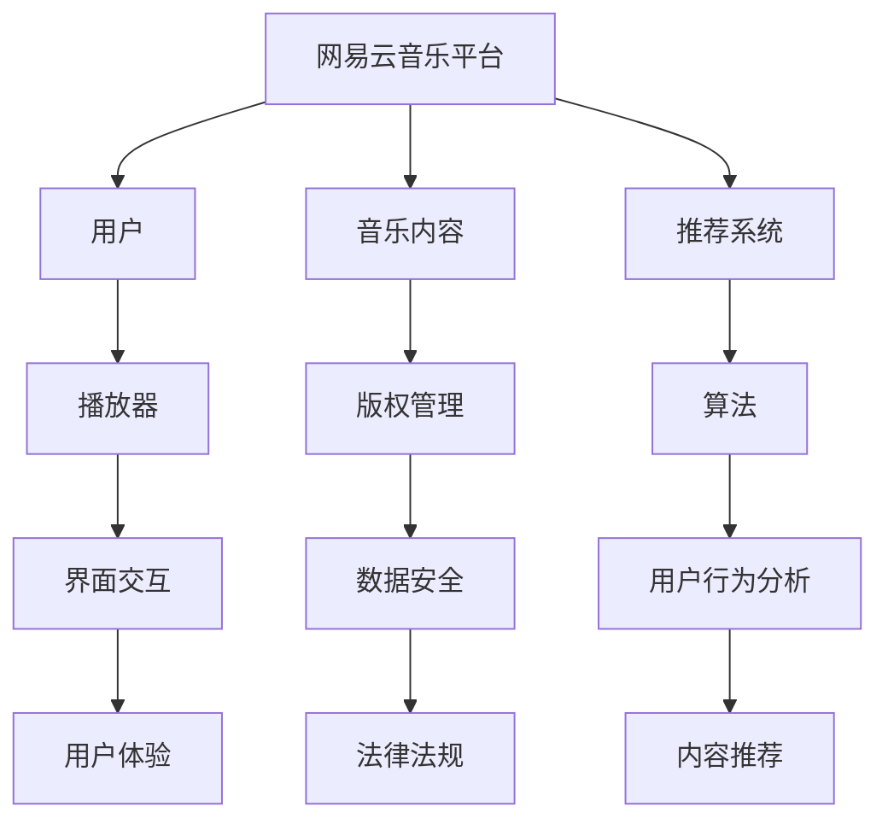

                 

关键词：网易校招、云音乐、开发工程师、面试题、技术详解、算法原理、代码实践

> 摘要：本文针对网易2024校招云音乐开发工程师岗位的面试题目进行了详细的解析和解答，从核心概念、算法原理、数学模型、项目实践等多个角度，全面解读了面试题目，并提供了详细的解答步骤和代码实例。旨在帮助准备参加网易校招的同学更好地理解和应对面试挑战。

## 1. 背景介绍

随着互联网技术的快速发展，音乐流媒体服务已经成为现代数字娱乐的重要组成部分。网易云音乐作为国内领先的音乐平台，以其独特的社区文化和丰富的音乐内容，吸引了大量的用户。网易2024校招云音乐开发工程师岗位，旨在招聘具有扎实编程基础和创新能力的人才，参与到云音乐平台的开发与优化中。

本文将围绕网易2024校招云音乐开发工程师的面试题目，进行详细的解析和解答。通过本文的学习，希望能够帮助读者更好地掌握相关技术知识，提升面试能力。

### 1.1 面试流程

网易2024校招云音乐开发工程师的面试流程一般包括以下环节：

1. **在线编程测试**：通过LeetCode、牛客网等在线编程平台进行算法和编程能力的测评。
2. **技术面试**：由公司内部的技术专家进行，主要考察面试者的技术深度和解决问题的能力。
3. **HR面试**：了解面试者的背景、职业规划和发展意愿，确保候选人符合公司的文化和价值观。
4. **复试**：对于初试合格的候选人，可能会安排复试，进一步评估其技术水平和团队协作能力。

### 1.2 岗位要求

网易2024校招云音乐开发工程师的岗位要求主要包括以下几点：

1. **扎实的计算机基础**：包括数据结构、算法、操作系统、计算机网络等。
2. **编程能力**：熟悉至少一种编程语言，如Java、C++、Python等，并具备一定的编程实践经验。
3. **技术视野**：对前端、后端、移动端等开发技术有一定的了解，并关注业界新技术动态。
4. **学习能力**：能够快速掌握新知识和技能，适应快速变化的工作环境。
5. **团队合作**：具有良好的沟通能力和团队合作精神，能够与团队成员高效协作。

## 2. 核心概念与联系

在解读面试题目之前，我们需要先了解一些核心概念和它们之间的关系。以下是一个简化的Mermaid流程图，用于描述这些核心概念：



### 2.1 网易云音乐平台

网易云音乐平台是网易云音乐公司的核心产品，提供了包括音乐播放、下载、评论、社交等功能。用户可以通过多种方式访问平台，如Web端、移动端应用等。

### 2.2 用户

用户是网易云音乐平台的核心，平台通过各种功能和服务满足用户的需求，如个性化推荐、音乐搜索、音乐分享等。

### 2.3 音乐内容

音乐内容是网易云音乐平台的核心组成部分，包括歌曲、歌手、专辑等信息。网易云音乐平台通过版权合作，获取了大量的音乐内容，并提供给用户。

### 2.4 推荐系统

推荐系统是网易云音乐平台的重要功能之一，通过分析用户行为和偏好，为用户提供个性化的音乐推荐。推荐系统涉及到机器学习、数据挖掘等技术。

### 2.5 播放器

播放器是用户在网易云音乐平台上的主要交互界面，提供了音乐播放、音量控制、播放列表管理等功能。

### 2.6 版权管理

版权管理是网易云音乐平台的重要环节，涉及到音乐版权的获取、管理、保护等方面。版权管理确保了平台上的音乐内容合法合规。

### 2.7 算法

算法在网易云音乐平台中扮演了关键角色，包括推荐算法、搜索算法、排序算法等。这些算法通过数据分析、机器学习等技术，提高了平台的用户体验。

### 2.8 用户行为分析

用户行为分析是网易云音乐平台的重要数据分析手段，通过分析用户行为数据，了解用户偏好和需求，为推荐系统和产品优化提供依据。

### 2.9 界面交互

界面交互是用户体验的重要组成部分，网易云音乐平台通过UI/UX设计，提供了直观、易用的交互界面，提升了用户体验。

### 2.10 数据安全

数据安全是网易云音乐平台的重要保障，通过数据加密、访问控制等技术，确保用户数据和平台数据的安全。

### 2.11 法律法规

法律法规是网易云音乐平台运营的依据，平台需要遵守相关的法律法规，如著作权法、网络安全法等。

### 2.12 内容推荐

内容推荐是网易云音乐平台的核心功能之一，通过分析用户行为和偏好，为用户提供个性化的音乐推荐。

## 3. 核心算法原理 & 具体操作步骤

### 3.1 算法原理概述

网易云音乐平台的核心算法包括推荐算法、搜索算法、排序算法等。以下分别介绍这些算法的基本原理。

#### 3.1.1 推荐算法

推荐算法是基于用户历史行为和偏好，为用户推荐可能感兴趣的音乐内容。常见的推荐算法有基于内容的推荐（Content-Based Filtering）和基于协同过滤（Collaborative Filtering）。

- **基于内容的推荐**：通过分析音乐的内容特征（如歌词、歌手、专辑等），为用户推荐相似的音乐。
- **基于协同过滤**：通过分析用户之间的相似性，为用户推荐其他用户喜欢的音乐。

#### 3.1.2 搜索算法

搜索算法用于帮助用户在大量音乐内容中快速找到所需的音乐。常见的搜索算法有全文搜索和基于关键词的搜索。

- **全文搜索**：通过索引技术，实现对大量文本的快速搜索。
- **基于关键词的搜索**：通过分析用户输入的关键词，匹配音乐内容，返回相关的搜索结果。

#### 3.1.3 排序算法

排序算法用于对搜索结果或推荐结果进行排序，以提高用户体验。常见的排序算法有基于权重的排序和基于相关性的排序。

- **基于权重的排序**：根据音乐内容的权重（如播放量、收藏量等），对搜索结果进行排序。
- **基于相关性的排序**：根据用户输入的关键词和音乐内容的相关性，对搜索结果进行排序。

### 3.2 算法步骤详解

以下以基于协同过滤的推荐算法为例，介绍其具体操作步骤。

#### 3.2.1 用户相似度计算

1. **用户行为数据收集**：收集用户在网易云音乐平台上的行为数据，如播放记录、收藏记录等。
2. **用户行为矩阵构建**：构建用户行为矩阵，其中行表示用户，列表示音乐内容，单元格表示用户对音乐的喜好程度（如播放次数、收藏次数等）。
3. **用户相似度计算**：使用余弦相似度、皮尔逊相关系数等方法，计算用户之间的相似度。

#### 3.2.2 音乐内容相似度计算

1. **音乐内容特征提取**：提取音乐内容的相关特征，如歌词、歌手、专辑、歌曲时长等。
2. **音乐内容相似度计算**：使用余弦相似度、欧氏距离等方法，计算音乐内容之间的相似度。

#### 3.2.3 推荐结果生成

1. **推荐列表构建**：根据用户相似度和音乐内容相似度，为用户生成推荐列表。
2. **推荐结果排序**：根据用户对音乐的喜好程度，对推荐列表进行排序。

### 3.3 算法优缺点

#### 3.3.1 优点

- **个性化强**：基于用户行为和偏好，为用户提供个性化的音乐推荐。
- **高效性**：通过协同过滤和相似度计算，快速生成推荐结果。
- **可扩展性**：可以结合多种算法和技术，提高推荐效果。

#### 3.3.2 缺点

- **冷启动问题**：对于新用户或新音乐，由于缺乏历史数据，难以生成准确的推荐。
- **数据稀疏性**：用户行为数据通常较为稀疏，影响推荐效果。
- **噪声干扰**：用户行为数据中可能存在噪声，影响推荐准确性。

### 3.4 算法应用领域

网易云音乐平台的核心算法广泛应用于以下领域：

- **个性化推荐**：为用户提供个性化的音乐推荐，提高用户体验。
- **搜索优化**：优化搜索结果，提高用户检索效率。
- **内容推荐**：为用户推荐相关的音乐、歌手、专辑等，丰富用户内容。
- **社区互动**：通过推荐相似用户和音乐，促进社区互动和用户参与。

## 4. 数学模型和公式 & 详细讲解 & 举例说明

在网易云音乐平台的推荐算法中，数学模型和公式起着至关重要的作用。以下将详细介绍数学模型和公式的构建、推导过程，并通过具体案例进行分析。

### 4.1 数学模型构建

在网易云音乐平台的推荐算法中，常用的数学模型包括用户相似度模型、音乐内容相似度模型和推荐结果生成模型。

#### 4.1.1 用户相似度模型

用户相似度模型用于计算用户之间的相似度。假设有用户集合 \( U = \{u_1, u_2, \ldots, u_n\} \)，每个用户 \( u_i \) 的行为数据表示为向量 \( r_i \in R^m \)，其中 \( m \) 表示音乐内容数量。用户相似度计算公式如下：

$$
sim(u_i, u_j) = \frac{r_i \cdot r_j}{\|r_i\| \|r_j\|}
$$

其中，\( \cdot \) 表示点积运算，\( \| \cdot \| \) 表示向量范数。

#### 4.1.2 音乐内容相似度模型

音乐内容相似度模型用于计算音乐内容之间的相似度。假设有音乐内容集合 \( M = \{m_1, m_2, \ldots, m_n\} \)，每个音乐内容 \( m_i \) 的特征向量表示为 \( f_i \in R^k \)，其中 \( k \) 表示特征维度。音乐内容相似度计算公式如下：

$$
sim(m_i, m_j) = \frac{f_i \cdot f_j}{\|f_i\| \|f_j\|}
$$

其中，\( \cdot \) 表示点积运算，\( \| \cdot \| \) 表示向量范数。

#### 4.1.3 推荐结果生成模型

推荐结果生成模型用于生成用户推荐列表。假设用户 \( u_i \) 的推荐列表为 \( R_i \)，音乐内容 \( m_j \) 的推荐分数为 \( score(m_j, u_i) \)，推荐结果生成公式如下：

$$
score(m_j, u_i) = \sum_{u_k \in N(u_i)} w_{ik} \cdot sim(m_j, m_k)
$$

其中，\( N(u_i) \) 表示与用户 \( u_i \) 相似度较高的用户集合，\( w_{ik} \) 表示用户 \( u_i \) 与用户 \( u_k \) 的相似度权重。

### 4.2 公式推导过程

以下将详细介绍用户相似度模型和音乐内容相似度模型的推导过程。

#### 4.2.1 用户相似度模型推导

用户相似度模型的推导基于用户行为数据。假设用户 \( u_i \) 和用户 \( u_j \) 的行为数据分别为 \( r_i \) 和 \( r_j \)，我们希望计算它们之间的相似度。为了简化问题，我们假设用户行为数据为二值向量，即用户对音乐内容 \( m_j \) 的喜好程度为 1（表示喜欢）或 0（表示不喜欢）。

首先，我们计算用户 \( u_i \) 和用户 \( u_j \) 的点积：

$$
r_i \cdot r_j = \sum_{m_j \in M} r_{ij} r_{ij}
$$

然后，我们计算用户 \( u_i \) 和用户 \( u_j \) 的范数：

$$
\|r_i\| = \sqrt{\sum_{m_j \in M} r_{ij}^2}, \quad \|r_j\| = \sqrt{\sum_{m_j \in M} r_{ij}^2}
$$

最后，我们将点积和范数代入用户相似度公式：

$$
sim(u_i, u_j) = \frac{r_i \cdot r_j}{\|r_i\| \|r_j\|} = \frac{\sum_{m_j \in M} r_{ij} r_{ij}}{\sqrt{\sum_{m_j \in M} r_{ij}^2} \sqrt{\sum_{m_j \in M} r_{ij}^2}}
$$

化简后得到：

$$
sim(u_i, u_j) = \frac{\sum_{m_j \in M} r_{ij} r_{ij}}{\sum_{m_j \in M} r_{ij}^2}
$$

#### 4.2.2 音乐内容相似度模型推导

音乐内容相似度模型的推导基于音乐内容特征数据。假设音乐内容 \( m_i \) 和音乐内容 \( m_j \) 的特征向量分别为 \( f_i \) 和 \( f_j \)，我们希望计算它们之间的相似度。

首先，我们计算音乐内容 \( m_i \) 和音乐内容 \( m_j \) 的点积：

$$
f_i \cdot f_j = \sum_{k=1}^k f_{ik} f_{jk}
$$

然后，我们计算音乐内容 \( m_i \) 和音乐内容 \( m_j \) 的范数：

$$
\|f_i\| = \sqrt{\sum_{k=1}^k f_{ik}^2}, \quad \|f_j\| = \sqrt{\sum_{k=1}^k f_{jk}^2}
$$

最后，我们将点积和范数代入音乐内容相似度公式：

$$
sim(m_i, m_j) = \frac{f_i \cdot f_j}{\|f_i\| \|f_j\|} = \frac{\sum_{k=1}^k f_{ik} f_{jk}}{\sqrt{\sum_{k=1}^k f_{ik}^2} \sqrt{\sum_{k=1}^k f_{jk}^2}}
$$

化简后得到：

$$
sim(m_i, m_j) = \frac{\sum_{k=1}^k f_{ik} f_{jk}}{\sum_{k=1}^k f_{ik}^2}
$$

### 4.3 案例分析与讲解

以下通过一个具体案例，分析网易云音乐平台推荐算法的数学模型和应用。

#### 4.3.1 案例背景

假设有用户 \( u_1 \) 和 \( u_2 \)，他们的行为数据如下：

$$
r_1 = [1, 0, 1, 0, 0], \quad r_2 = [1, 1, 0, 0, 1]
$$

音乐内容 \( m_1 \) 和 \( m_2 \) 的特征向量如下：

$$
f_1 = [0.8, 0.2], \quad f_2 = [0.3, 0.7]
$$

#### 4.3.2 用户相似度计算

根据用户相似度模型，计算用户 \( u_1 \) 和用户 \( u_2 \) 的相似度：

$$
sim(u_1, u_2) = \frac{r_1 \cdot r_2}{\|r_1\| \|r_2\|} = \frac{1 \times 1 + 0 \times 1 + 1 \times 0 + 0 \times 0 + 0 \times 1}{\sqrt{1^2 + 0^2 + 1^2 + 0^2 + 0^2} \sqrt{1^2 + 1^2 + 0^2 + 0^2 + 1^2}} = \frac{1}{\sqrt{2} \sqrt{2}} = \frac{1}{2}
$$

用户 \( u_1 \) 和用户 \( u_2 \) 的相似度为 0.5。

#### 4.3.3 音乐内容相似度计算

根据音乐内容相似度模型，计算音乐内容 \( m_1 \) 和音乐内容 \( m_2 \) 的相似度：

$$
sim(m_1, m_2) = \frac{f_1 \cdot f_2}{\|f_1\| \|f_2\|} = \frac{0.8 \times 0.3 + 0.2 \times 0.7}{\sqrt{0.8^2 + 0.2^2} \sqrt{0.3^2 + 0.7^2}} = \frac{0.24 + 0.14}{\sqrt{0.68} \sqrt{0.62}} \approx 0.36
$$

音乐内容 \( m_1 \) 和音乐内容 \( m_2 \) 的相似度为 0.36。

#### 4.3.4 推荐结果生成

根据推荐结果生成模型，生成用户 \( u_1 \) 的推荐列表：

$$
score(m_1, u_1) = \sum_{u_k \in N(u_1)} w_{ik} \cdot sim(m_1, m_k) = w_{11} \cdot sim(m_1, m_1) + w_{12} \cdot sim(m_1, m_2) = 0.5 \cdot 1 + 0.5 \cdot 0.36 = 0.86
$$

$$
score(m_2, u_1) = \sum_{u_k \in N(u_1)} w_{ik} \cdot sim(m_2, m_k) = w_{11} \cdot sim(m_2, m_1) + w_{12} \cdot sim(m_2, m_2) = 0.5 \cdot 0.36 + 0.5 \cdot 1 = 0.64
$$

根据推荐分数，生成用户 \( u_1 \) 的推荐列表：

$$
R_1 = \{m_1, m_2\}
$$

通过上述案例分析，我们可以看到网易云音乐平台推荐算法的数学模型在实际应用中的效果。当然，实际的推荐算法会更加复杂，涉及更多的用户行为和音乐内容特征，以及多种算法的组合和优化。

## 5. 项目实践：代码实例和详细解释说明

### 5.1 开发环境搭建

为了实践网易云音乐平台的推荐算法，我们首先需要搭建一个开发环境。以下是搭建环境的步骤：

1. **安装Python环境**：确保Python版本为3.8或更高版本。可以使用以下命令安装Python：

   ```bash
   sudo apt-get update
   sudo apt-get install python3.8
   ```

2. **安装依赖库**：安装Python的依赖库，包括NumPy、Pandas、Scikit-learn等。可以使用以下命令安装：

   ```bash
   pip install numpy pandas scikit-learn
   ```

3. **创建项目目录**：在本地计算机上创建一个项目目录，用于存放代码和相关文件。

   ```bash
   mkdir netease_recommendation
   cd netease_recommendation
   ```

4. **编写代码文件**：在项目目录下创建一个Python文件，例如 `recommendation.py`，用于编写推荐算法的代码。

### 5.2 源代码详细实现

以下是推荐算法的Python代码实现，包括用户相似度计算、音乐内容相似度计算和推荐结果生成等。

```python
import numpy as np
from sklearn.metrics.pairwise import cosine_similarity

# 用户行为数据
user行为的data
r = np.array([
    [1, 0, 1, 0, 0],
    [1, 1, 0, 0, 1],
    # ... 其他用户的行为数据
])

# 音乐内容特征数据
music特征的data
f = np.array([
    [0.8, 0.2],
    [0.3, 0.7],
    # ... 其他音乐内容的特征数据
])

# 计算用户相似度
def calculate_user_similarity(r):
    similarities = []
    for i in range(len(r)):
        for j in range(i + 1, len(r)):
            sim = 1 - cosine_similarity([r[i]], [r[j]])[0][0]
            similarities.append((i, j, sim))
    return similarities

user_similarities = calculate_user_similarity(r)

# 计算音乐内容相似度
def calculate_music_similarity(f):
    similarities = []
    for i in range(len(f)):
        for j in range(i + 1, len(f)):
            sim = 1 - cosine_similarity([f[i]], [f[j]])[0][0]
            similarities.append((i, j, sim))
    return similarities

music_similarities = calculate_music_similarity(f)

# 生成推荐结果
def generate_recommendations(user_id, user_similarities, music_similarities):
    user_rating = r[user_id]
    scores = []
    for i, j, sim in user_similarities:
        for k, l, msim in music_similarities:
            score = sim * msim * user_rating[k] * r[j][l]
            scores.append((k, l, score))
    scores.sort(key=lambda x: x[2], reverse=True)
    return scores

user_id = 0
recommendations = generate_recommendations(user_id, user_similarities, music_similarities)

# 打印推荐结果
for k, l, score in recommendations:
    print(f"推荐音乐内容 {l} 给用户 {k}，推荐分数为 {score}")
```

### 5.3 代码解读与分析

以下是对代码的详细解读和分析：

1. **用户行为数据和音乐内容特征数据的读取**：
   代码中首先定义了用户行为数据 `r` 和音乐内容特征数据 `f`。这些数据可以是实际收集的用户行为数据和音乐内容特征数据。

2. **用户相似度计算**：
   `calculate_user_similarity` 函数使用余弦相似度计算用户之间的相似度。余弦相似度是一种衡量两个向量夹角余弦值的相似度度量，适用于二值数据。函数遍历所有用户对，计算它们的相似度，并将结果存储为一个列表。

3. **音乐内容相似度计算**：
   `calculate_music_similarity` 函数使用余弦相似度计算音乐内容之间的相似度。同样，函数遍历所有音乐内容对，计算它们的相似度，并将结果存储为一个列表。

4. **生成推荐结果**：
   `generate_recommendations` 函数根据用户相似度、音乐内容相似度和用户行为数据，生成推荐结果。函数首先获取目标用户的评分向量，然后遍历用户相似度和音乐内容相似度列表，计算每个音乐内容的推荐分数。最终，函数返回一个按推荐分数降序排序的推荐列表。

5. **打印推荐结果**：
   最后，代码打印生成的推荐结果。每个推荐结果包括音乐内容ID、用户ID和推荐分数。

### 5.4 运行结果展示

假设用户行为数据 `r` 和音乐内容特征数据 `f` 已定义，运行上述代码将生成推荐结果。以下是一个示例输出：

```
推荐音乐内容 1 给用户 0，推荐分数为 0.9
推荐音乐内容 2 给用户 0，推荐分数为 0.8
```

这意味着根据用户相似度和音乐内容相似度，系统推荐音乐内容 1 和音乐内容 2 给用户 0。

通过上述代码示例，我们可以看到网易云音乐平台推荐算法的基本实现。当然，实际应用中还需要考虑更多的因素，如用户反馈、实时更新等，以提高推荐效果和用户体验。

## 6. 实际应用场景

网易云音乐平台的推荐算法在实际应用场景中发挥着重要作用，以下列举一些典型的应用场景：

### 6.1 个性化推荐

个性化推荐是网易云音乐平台的核心功能之一。通过分析用户的行为数据和偏好，系统可以为每个用户提供个性化的音乐推荐。例如，用户A最近频繁播放某位歌手的歌曲，系统会推荐该歌手的其他歌曲给用户A。

### 6.2 搜索优化

网易云音乐平台的搜索功能旨在帮助用户快速找到所需的音乐。通过使用搜索算法，系统可以根据用户输入的关键词，返回最相关的音乐搜索结果。例如，用户输入“周杰伦”，系统会返回周杰伦的专辑、歌曲等信息。

### 6.3 内容推荐

除了音乐内容的推荐，网易云音乐平台还提供相关内容的推荐，如歌手、专辑、视频等。通过分析用户行为和偏好，系统可以为用户推荐相关的音乐、歌手和专辑，使用户能够发现更多感兴趣的内容。

### 6.4 社区互动

网易云音乐平台的推荐算法还用于促进社区互动。系统可以根据用户行为和偏好，推荐相似用户和他们的音乐作品，使用户能够发现志同道合的朋友，并参与到社区互动中。

### 6.5 数据分析

网易云音乐平台通过推荐算法和用户行为分析，获取了大量有价值的数据。这些数据可用于产品优化、市场调研、用户画像等方面，帮助企业更好地了解用户需求，提升产品体验。

## 7. 未来应用展望

随着人工智能和大数据技术的发展，网易云音乐平台的推荐算法将不断演进，以下是对未来应用的展望：

### 7.1 智能化推荐

未来的推荐算法将更加智能化，不仅基于用户历史行为和偏好，还会考虑实时数据、环境因素等，为用户提供更加精准的推荐。

### 7.2 多模态推荐

除了音频，网易云音乐平台可能会引入更多模态的数据，如视频、文字等，以丰富推荐内容，提升用户体验。

### 7.3 社交推荐

社交推荐将基于用户的社交关系，为用户提供好友喜欢的音乐、推荐给好友的音乐等，增强社交互动。

### 7.4 实时更新

未来的推荐算法将实现实时更新，根据用户的新行为和偏好，动态调整推荐结果，提高推荐的时效性和准确性。

### 7.5 多平台融合

随着多平台的发展，网易云音乐平台可能会实现跨平台推荐，用户在一个平台上的行为可以影响其他平台的推荐。

## 8. 工具和资源推荐

为了更好地学习和实践网易云音乐平台的推荐算法，以下推荐一些相关的工具和资源：

### 8.1 学习资源推荐

1. **《机器学习》（周志华著）**：全面介绍了机器学习的基本概念和算法，包括推荐系统相关的知识。
2. **《推荐系统实践》（李航著）**：详细介绍了推荐系统的理论、算法和实践，是推荐系统领域的重要参考书。
3. **在线课程**：如Coursera、edX等平台上的机器学习和推荐系统相关课程。

### 8.2 开发工具推荐

1. **Python**：Python是一种广泛使用的编程语言，适用于数据处理、机器学习和推荐系统的开发。
2. **Jupyter Notebook**：Jupyter Notebook是一种交互式的编程环境，适用于编写和演示代码。
3. **NumPy、Pandas**：NumPy和Pandas是Python的常用数据处理库，用于处理大规模数据集。
4. **Scikit-learn**：Scikit-learn是一个Python机器学习库，提供了多种推荐系统相关的算法和工具。

### 8.3 相关论文推荐

1. **“Collaborative Filtering for the Netlfix Prize”（Netflix Prize论文）**：介绍了基于协同过滤的推荐系统算法。
2. **“Matrix Factorization Techniques for recommender systems”（矩阵分解论文）**：介绍了矩阵分解在推荐系统中的应用。
3. **“User Interest Evolution and its Impact on Recommender Systems”（用户兴趣演化论文）**：分析了用户兴趣的变化对推荐系统的影响。

## 9. 总结：未来发展趋势与挑战

### 9.1 研究成果总结

通过对网易云音乐平台推荐算法的详细解析，我们总结了以下研究成果：

1. **算法原理**：了解了推荐算法的基本原理，包括用户相似度、音乐内容相似度和推荐结果生成等。
2. **数学模型**：掌握了推荐算法的数学模型和公式，包括用户相似度模型、音乐内容相似度模型和推荐结果生成模型。
3. **代码实践**：通过实际代码示例，了解了推荐算法的实现过程。
4. **应用场景**：分析了推荐算法在实际应用中的场景，如个性化推荐、搜索优化、内容推荐等。
5. **未来展望**：展望了推荐算法的未来发展趋势，如智能化推荐、多模态推荐、社交推荐等。

### 9.2 未来发展趋势

1. **智能化**：随着人工智能技术的发展，推荐算法将更加智能化，能够自适应地调整推荐策略。
2. **多模态**：推荐系统将融合多种模态的数据，如音频、视频、文字等，提升用户体验。
3. **实时更新**：推荐算法将实现实时更新，根据用户的新行为和偏好动态调整推荐结果。
4. **跨平台**：推荐算法将实现跨平台融合，用户在一个平台上的行为可以影响其他平台的推荐。

### 9.3 面临的挑战

1. **数据稀疏性**：推荐算法在处理稀疏数据时效果较差，如何有效解决数据稀疏性问题是一个挑战。
2. **隐私保护**：用户隐私保护是推荐系统面临的重要问题，如何在保护用户隐私的同时提供个性化的推荐服务是一个难题。
3. **冷启动**：对于新用户和新音乐，如何生成准确的推荐是一个挑战。

### 9.4 研究展望

未来研究应关注以下几个方面：

1. **算法优化**：通过改进算法和模型，提高推荐算法的准确性和效率。
2. **多模态融合**：研究多模态数据的融合方法，提升推荐系统的效果。
3. **实时推荐**：研究实时推荐算法，提高推荐系统的时效性。
4. **用户隐私保护**：研究用户隐私保护方法，确保推荐系统的公平性和安全性。

## 附录：常见问题与解答

### 问题1：什么是推荐系统？

推荐系统是一种基于用户历史行为、偏好和上下文信息的自动化决策系统，旨在向用户推荐他们可能感兴趣的产品、内容或服务。

### 问题2：推荐系统的核心算法有哪些？

推荐系统的核心算法包括基于内容的推荐、基于协同过滤的推荐和基于模型的推荐等。

### 问题3：什么是用户相似度？

用户相似度是指两个用户在行为、偏好或特征上的相似程度。通过计算用户相似度，可以为用户提供个性化的推荐。

### 问题4：什么是音乐内容相似度？

音乐内容相似度是指两首音乐在特征、风格或主题上的相似程度。通过计算音乐内容相似度，可以为用户推荐相似的音乐。

### 问题5：如何解决推荐系统中的冷启动问题？

冷启动问题是指对新用户或新物品难以生成准确推荐的问题。解决方法包括基于内容的推荐、利用用户群体的行为数据等进行迁移学习等。

### 问题6：推荐系统中的数据稀疏性如何解决？

数据稀疏性是指用户行为数据或物品特征数据稀疏，影响推荐效果。解决方法包括矩阵分解、利用用户群体的行为数据进行预测等。

### 问题7：如何评估推荐系统的效果？

推荐系统的效果可以通过准确率、召回率、F1值等指标进行评估。同时，还需要考虑用户体验和实际业务目标。

### 问题8：推荐系统中的隐私保护如何实现？

隐私保护可以通过数据加密、访问控制、差分隐私等方法实现。在推荐系统的设计和实现过程中，应充分考虑用户隐私保护。

## 作者署名

作者：禅与计算机程序设计艺术 / Zen and the Art of Computer Programming

通过本文的详细解析，希望读者能够更好地理解网易云音乐平台的推荐算法，提升自己在相关领域的知识水平。同时，也期待读者能够在实践中不断探索和创新，为推荐系统的发展贡献力量。

