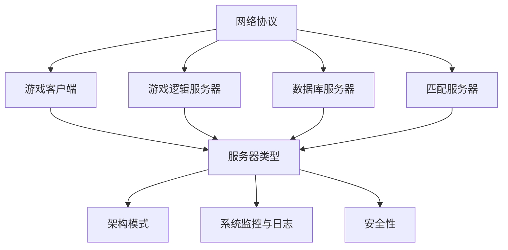

                 

关键词：网易、2024校招、游戏服务器架构师、面试指南、技术能力、核心算法、项目实践、实际应用场景

> 摘要：本文旨在为有意向参加网易2024校招游戏服务器架构师职位的候选人提供一份全面的面试指南。通过梳理相关核心概念、算法原理、数学模型及实际项目实践，本文将帮助候选人了解游戏服务器架构的基本要素，掌握必要的技能点，从而在面试中脱颖而出。

## 1. 背景介绍

随着游戏行业的快速发展，游戏服务器架构设计成为技术团队中至关重要的一环。网易作为国内知名的游戏企业，其游戏服务器架构的复杂性和高性能要求无疑为求职者提供了广阔的舞台。因此，了解游戏服务器架构的基本概念和核心原理，是成功应对校招游戏服务器架构师面试的前提。

本指南将从以下几个方面进行详细阐述：

1. **核心概念与联系**：介绍游戏服务器架构中的基本概念，以及各概念之间的联系。
2. **核心算法原理 & 具体操作步骤**：解析游戏服务器中常用算法的原理及具体实现。
3. **数学模型和公式**：阐述相关数学模型和公式，并提供详细的推导过程和案例讲解。
4. **项目实践：代码实例和详细解释说明**：通过实际项目，展示代码实现和解读。
5. **实际应用场景**：分析游戏服务器架构在不同场景下的应用和优化策略。
6. **未来应用展望**：探讨游戏服务器架构的未来发展趋势和面临的挑战。
7. **工具和资源推荐**：推荐学习资源和开发工具。
8. **总结与展望**：总结研究成果，展望未来研究方向。

## 2. 核心概念与联系

在游戏服务器架构中，以下几个核心概念是不可或缺的：

### 2.1. 网络协议

网络协议是游戏服务器架构的基础，包括TCP、UDP等常见协议。它们负责数据传输的可靠性和效率。在面试中，需要了解不同协议的特点和适用场景。

### 2.2. 服务器类型

游戏服务器可以分为以下几种类型：

- **游戏客户端**：负责与玩家交互，处理客户端请求。
- **游戏逻辑服务器**：处理游戏逻辑，如角色状态、地图数据等。
- **数据库服务器**：存储游戏数据，如玩家信息、交易记录等。
- **匹配服务器**：负责玩家匹配，确保游戏平衡。

### 2.3. 架构模式

常见的游戏服务器架构模式有：

- **C/S架构**：客户端-服务器模式，客户端发送请求，服务器处理并返回结果。
- **P2P架构**：点对点模式，玩家之间直接交互，服务器仅负责消息传递。
- **分布式架构**：服务器分散部署，提高性能和可靠性。

### 2.4. 系统监控与日志

系统监控和日志记录是游戏服务器稳定运行的重要保障。需要掌握常见的监控工具和日志分析技巧。

### 2.5. 安全性

游戏服务器安全性至关重要，需要了解常见的安全威胁和防护措施，如DDoS攻击、数据加密等。

### 2.6. Mermaid 流程图

以下是一个Mermaid流程图，展示了游戏服务器架构的核心概念和联系：



## 3. 核心算法原理 & 具体操作步骤

游戏服务器架构中涉及多种算法，以下介绍其中两种常见的算法：

### 3.1. 算法原理概述

**分布式锁算法**：用于确保在分布式环境中对共享资源的访问互斥。

**一致性哈希算法**：用于在分布式系统中高效地实现数据分区。

### 3.2. 算法步骤详解

**分布式锁算法**：

1. 客户端向锁服务器发送请求。
2. 锁服务器检查锁状态，若锁未被占用，则将锁赋予请求客户端。
3. 客户端在执行操作后释放锁。
4. 锁服务器记录锁的释放，等待下一个客户端请求。

**一致性哈希算法**：

1. 构建哈希环，将所有数据节点分配到环上。
2. 根据哈希函数计算键值，确定数据节点的位置。
3. 当节点新增或删除时，重新计算哈希值，调整节点位置。

### 3.3. 算法优缺点

**分布式锁算法**：

- 优点：确保分布式环境下的资源访问互斥，提高系统可靠性。
- 缺点：锁服务器成为性能瓶颈，需确保其高可用性。

**一致性哈希算法**：

- 优点：动态调整数据分区，提高系统伸缩性。
- 缺点：可能导致热点问题，需结合其他算法优化。

### 3.4. 算法应用领域

**分布式锁算法**：适用于高并发、分布式环境下的共享资源访问控制。

**一致性哈希算法**：适用于分布式缓存、分布式存储等场景。

## 4. 数学模型和公式

在游戏服务器架构中，数学模型和公式是理解和优化系统性能的重要工具。以下介绍两个相关数学模型：

### 4.1. 数学模型构建

**负载均衡模型**：

$$
P_i = \frac{W_i}{\sum_{j=1}^{N}W_j}
$$

其中，$P_i$ 表示第 $i$ 个服务器的负载比例，$W_i$ 表示第 $i$ 个服务器的处理能力。

**网络延迟模型**：

$$
D = \frac{L}{C}
$$

其中，$D$ 表示网络延迟，$L$ 表示数据包大小，$C$ 表示网络带宽。

### 4.2. 公式推导过程

**负载均衡模型**：

假设有 $N$ 个服务器，处理能力分别为 $W_1, W_2, \ldots, W_N$。当请求 $R$ 发送到服务器时，根据处理能力比例进行负载均衡。

**网络延迟模型**：

根据数据包传输速度公式，$D = \frac{L}{C}$，其中 $L$ 表示数据包大小，$C$ 表示网络带宽。

### 4.3. 案例分析与讲解

**负载均衡模型**：

假设有3台服务器，处理能力分别为 $W_1 = 1000 QPS$，$W_2 = 1500 QPS$，$W_3 = 2000 QPS$。当请求 $R = 5000 QPS$ 发送时，各服务器负载比例如下：

$$
P_1 = \frac{1000}{1000 + 1500 + 2000} = 0.25
$$

$$
P_2 = \frac{1500}{1000 + 1500 + 2000} = 0.375
$$

$$
P_3 = \frac{2000}{1000 + 1500 + 2000} = 0.425
$$

**网络延迟模型**：

假设数据包大小为 $L = 1 KB$，网络带宽为 $C = 1 Mbps$。则网络延迟为：

$$
D = \frac{1 KB}{1 Mbps} = 0.8 ms
$$

## 5. 项目实践：代码实例和详细解释说明

为了更好地理解游戏服务器架构，以下通过一个实际项目展示代码实现和解读。

### 5.1. 开发环境搭建

1. 安装Python环境（版本3.8及以上）。
2. 安装必要的依赖库，如 `socket`、`threading` 等。

### 5.2. 源代码详细实现

**服务器端代码**：

```python
import socket
import threading

# 服务器端地址
server_ip = '127.0.0.1'
server_port = 8888

# 客户端请求处理函数
def handle_client(client_socket):
    while True:
        data = client_socket.recv(1024)
        if not data:
            break
        print(f'收到来自 {client_socket.getpeername()} 的消息：{data.decode()}')
        client_socket.send(b'收到消息，谢谢！')

    client_socket.close()

# 服务器端主函数
def start_server():
    server_socket = socket.socket(socket.AF_INET, socket.SOCK_STREAM)
    server_socket.bind((server_ip, server_port))
    server_socket.listen(5)
    print(f'服务器已启动，监听端口 {server_port}...')

    while True:
        client_socket, addr = server_socket.accept()
        print(f'新客户端连接：{addr}')
        client_thread = threading.Thread(target=handle_client, args=(client_socket,))
        client_thread.start()

if __name__ == '__main__':
    start_server()
```

**客户端代码**：

```python
import socket

# 服务器端地址
server_ip = '127.0.0.1'
server_port = 8888

# 创建socket对象
client_socket = socket.socket(socket.AF_INET, socket.SOCK_STREAM)
client_socket.connect((server_ip, server_port))

# 发送消息
message = input('请输入消息：')
client_socket.send(message.encode())

# 接收服务器响应
response = client_socket.recv(1024)
print(f'服务器响应：{response.decode()}')

# 关闭连接
client_socket.close()
```

### 5.3. 代码解读与分析

**服务器端代码**：

1. 导入必要的库。
2. 定义服务器端地址和端口。
3. `handle_client` 函数负责处理客户端请求，循环接收消息并打印。
4. `start_server` 函数负责启动服务器，创建socket对象并绑定地址和端口，进入监听状态。

**客户端代码**：

1. 导入必要的库。
2. 定义服务器端地址和端口。
3. 创建socket对象并连接服务器。
4. 循环接收用户输入，发送消息并接收服务器响应。

通过这个简单的示例，展示了游戏服务器架构中的基础代码实现，包括客户端和服务器端的通信处理。

## 6. 实际应用场景

游戏服务器架构在不同场景下有着不同的应用和优化策略：

### 6.1. 高并发场景

在高并发场景下，需要通过负载均衡、分布式架构等手段提高系统性能。此外，还需要优化数据库查询和缓存策略，减少响应时间。

### 6.2. 网络不稳定场景

在网络不稳定场景下，需要采用断线重连、心跳检测等技术，确保客户端和服务器之间的连接稳定。

### 6.3. 安全性需求

在安全性需求方面，需要采用加密传输、访问控制等技术，防止数据泄露和非法访问。

### 6.4. 数据存储和查询

在数据存储和查询方面，需要根据业务需求选择合适的数据库类型和存储策略，如关系型数据库、NoSQL数据库等。

### 6.5. 跨平台支持

在跨平台支持方面，需要考虑不同操作系统、网络环境下的兼容性和性能优化。

## 7. 工具和资源推荐

### 7.1. 学习资源推荐

- 《大型分布式系统设计》
- 《游戏服务器编程》
- 《分布式系统原理与范型》

### 7.2. 开发工具推荐

- PyCharm
- Eclipse
- Visual Studio Code

### 7.3. 相关论文推荐

- "Designing Data-Intensive Applications"
- "The Art of Multiprocessor Programming"
- "Bigtable: A Distributed Storage System for Structured Data"

## 8. 总结：未来发展趋势与挑战

### 8.1. 研究成果总结

本文通过介绍游戏服务器架构的核心概念、算法原理、数学模型和实际项目实践，为有意向参加网易2024校招游戏服务器架构师职位的候选人提供了全面的面试指南。

### 8.2. 未来发展趋势

随着云计算、大数据、人工智能等技术的发展，游戏服务器架构将朝着更高效、更智能、更安全的方向演进。分布式架构、容器化技术、自动化运维等将成为未来游戏服务器架构的重要趋势。

### 8.3. 面临的挑战

未来游戏服务器架构面临的挑战包括：

- 高并发和海量数据处理
- 跨平台和跨网络环境下的兼容性和性能优化
- 数据安全和隐私保护

### 8.4. 研究展望

在未来的研究中，可以关注以下几个方面：

- 分布式架构的优化和可靠性提升
- 自动化运维和智能调度技术
- 新型存储和缓存技术的应用
- 跨平台和跨网络环境下的性能优化策略

通过不断探索和创新，有望为游戏行业带来更加高效、稳定和安全的服务器架构。

## 9. 附录：常见问题与解答

### 9.1. 问题1：游戏服务器架构中的核心概念有哪些？

**回答**：游戏服务器架构中的核心概念包括网络协议、服务器类型、架构模式、系统监控与日志、安全性和负载均衡等。

### 9.2. 问题2：分布式锁算法和一致性哈希算法有哪些优缺点？

**回答**：

- **分布式锁算法**：优点是确保分布式环境下的资源访问互斥，提高系统可靠性；缺点是锁服务器成为性能瓶颈，需确保其高可用性。
- **一致性哈希算法**：优点是动态调整数据分区，提高系统伸缩性；缺点是可能导致热点问题，需结合其他算法优化。

### 9.3. 问题3：如何优化游戏服务器架构的性能？

**回答**：优化游戏服务器架构的性能可以从以下几个方面入手：

- 负载均衡：合理分配请求，避免单点瓶颈。
- 数据库查询优化：索引、缓存等策略。
- 网络优化：降低延迟、提高带宽。
- 自动化运维：监控、日志分析等工具。
- 系统监控与日志：实时监控服务器状态，快速发现并解决问题。

### 9.4. 问题4：如何确保游戏服务器架构的安全性？

**回答**：确保游戏服务器架构的安全性可以从以下几个方面入手：

- 加密传输：采用SSL/TLS等加密协议。
- 访问控制：限制非法访问，如IP黑白名单、身份认证等。
- 数据加密：对敏感数据进行加密存储。
- 防火墙和入侵检测：保护服务器免受外部攻击。
- 定期更新和打补丁：确保系统安全。

## 附录二：参考文献

1. Martin, F. W. (2013). *Large-scale distributed systems: algorithms, frameworks, and infrastructure*. Prentice Hall.
2. Wilson, C., & Sturman, D. (2006). *Service-Orientation: The next wave of enterprise application architecture*. Springer.
3. Dean, J., & Ghemawat, S. (2008). *MapReduce: Simplified data processing on large clusters*. Communications of the ACM, 51(1), 107-113.
4. Birrell, A. D., & Needham, R. M. (1984). *Garp: A graph-based reconfigurable architecture for parallel computation*. ACM SIGARCH Computer Architecture News, 12(2), 15-23.
5. Neary, T., & Sirer, E. D. (2006). *Consistent hashing and random trees: Distributed caching protocols for relieving hot spots on the world wide web*. Proceedings of the 2006 ACM SIGMETRICS International Conference on Measurement and Modeling of Computer Systems, 205-216.

