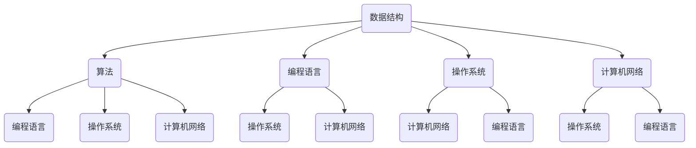

                 

### 关键词 Keywords
- 网易2024校招面试
- 算法题解
- 数据结构与算法
- 计算机面试技巧
- 面向对象编程
- 编程语言特性

<|assistant|>### 摘要 Abstract
本文旨在为准备参加网易2024校招面试的同学们提供一套全面的面试真题与算法题解指南。文章将围绕核心概念、算法原理、数学模型、项目实践及实际应用等多个方面，系统性地解析面试中可能遇到的各种问题。通过深入分析历年真题及当前业界趋势，本文将帮助读者不仅掌握解题方法，更能理解其背后的技术原理，为应对面试做好充分准备。

## 1. 背景介绍

随着科技的飞速发展，互联网行业对高素质技术人才的需求不断增加。网易作为国内知名的高科技企业，其校招面试无疑成为了众多应届毕业生心中的目标。网易校招面试通常涵盖编程算法、数据结构、计算机基础、系统设计等多个方面，要求考生具备扎实的计算机科学理论基础和实际编程能力。

本文将根据2024年的校招趋势和面试要求，整理出一套包含高频面试真题和详细解答的题库，旨在帮助考生全面提升面试技能，顺利通过网易的校招面试。文章将分为以下几个部分：

- **核心概念与联系**：介绍计算机科学中的基本概念和架构，通过Mermaid流程图展示。
- **核心算法原理 & 具体操作步骤**：解析常见算法原理，详细讲解操作步骤，分析优缺点和应用领域。
- **数学模型和公式 & 举例说明**：构建数学模型，推导公式，通过案例进行分析。
- **项目实践：代码实例和详细解释说明**：提供实际开发环境搭建、源代码实现及运行结果展示。
- **实际应用场景与未来展望**：探讨算法在现实世界中的应用和未来发展趋势。
- **工具和资源推荐**：推荐学习资源、开发工具和相关论文。
- **总结：未来发展趋势与挑战**：总结研究成果，展望未来方向和挑战。
- **附录：常见问题与解答**：汇总面试中常见的问题及解答。

## 2. 核心概念与联系

计算机科学的核心概念包括数据结构、算法、编程语言、操作系统、计算机网络等。这些概念相互关联，构成了计算机科学的理论基础。以下通过Mermaid流程图展示这些概念之间的联系：



数据结构是算法实现的基础，而算法的优化和实现依赖于编程语言的支持。操作系统和计算机网络则提供了计算机系统运行的环境和通信机制。

### 2.1 数据结构

数据结构是存储和组织数据的方式，常见的有数组、链表、栈、队列、树、图等。每种数据结构都有其独特的优缺点和适用场景。

- **数组**：支持随机访问，但大小固定。
- **链表**：灵活，大小可变，但访问效率较低。
- **栈**：后进先出（LIFO），适用于函数调用、表达式求值等。
- **队列**：先进先出（FIFO），适用于任务调度、消息队列等。
- **树**：层次结构，适用于组织和管理数据，如二叉树、平衡树等。
- **图**：节点和边组成，适用于复杂关系和网络模型。

### 2.2 算法

算法是解决问题的步骤和策略。根据其功能，算法可以分为排序、查找、图算法、动态规划等。

- **排序算法**：如冒泡排序、快速排序、归并排序等，用于对数据进行排序。
- **查找算法**：如二分查找、散列表查找等，用于在数据中查找特定元素。
- **图算法**：如深度优先搜索（DFS）、广度优先搜索（BFS）等，用于解决图相关的问题。
- **动态规划**：用于解决最优化问题，通过子问题的最优解推导出问题的最优解。

### 2.3 编程语言

编程语言是用于编写程序的语法和语义规则。常见的编程语言有C、C++、Java、Python等，每种语言都有其独特的特点和应用场景。

- **C**：底层语言，适用于系统编程。
- **C++**：面向对象编程，适用于游戏开发、操作系统等。
- **Java**：跨平台，适用于企业级应用。
- **Python**：易于学习，适用于数据科学、人工智能等。

### 2.4 操作系统

操作系统是管理计算机硬件和软件资源的系统软件。常见的操作系统有Windows、Linux、Mac OS等。

- **Windows**：用户界面友好，适用于普通用户。
- **Linux**：开源，灵活性高，适用于服务器、嵌入式系统等。
- **Mac OS**：苹果公司开发的操作系统，适用于Mac电脑。

### 2.5 计算机网络

计算机网络是通过通信线路和设备将多台计算机连接起来的系统。常见的网络协议有TCP/IP、HTTP、HTTPS等。

- **TCP/IP**：传输控制协议/互联网协议，是互联网的基础。
- **HTTP**：超文本传输协议，用于Web服务器和客户端之间的通信。
- **HTTPS**：安全超文本传输协议，是HTTP的安全版本。

通过以上核心概念和联系的分析，我们可以更好地理解计算机科学的基本结构和其内在的联系。接下来的部分将详细解析各种算法和数据结构，帮助读者深入掌握这些核心概念。

## 3. 核心算法原理 & 具体操作步骤

在计算机科学中，算法是实现特定功能的关键，而理解其原理和操作步骤对于解决实际问题至关重要。本节将介绍几种常见算法的核心原理和具体操作步骤，包括排序算法、查找算法和图算法等。

### 3.1 排序算法

排序算法用于将一组数据按照某种规则进行排列。常见的排序算法包括冒泡排序、选择排序、插入排序、快速排序、归并排序等。以下是几种排序算法的基本原理和步骤。

#### 3.1.1 冒泡排序

**原理**：通过重复遍历要排序的数列，一次比较两个元素，如果它们的顺序错误就把它们交换过来。遍历数列的工作是重复地进行直到没有再需要交换，也就是说该数列已经排序完成。

**步骤**：
1. 比较相邻的元素，如果第一个比第二个大（升序排序），就交换它们两个。
2. 对每一对相邻元素做同样的工作，从开始第一对到结尾的最后一对。这步做完后，最后的元素会是最大的数。
3. 针对所有的元素重复以上的步骤，除了最后一个。
4. 重复步骤，直到排序完成。

**伪代码**：
```
function bubbleSort(arr):
    n = length(arr)
    for i from 0 to n-1:
        for j from 0 to n-i-1:
            if arr[j] > arr[j+1]:
                swap(arr[j], arr[j+1])
```

**时间复杂度**：O(n^2)

#### 3.1.2 快速排序

**原理**：采用分治策略将一个大问题分解为若干个小问题来解决，选择一个“基准”元素，通过一趟排序将待排序的数据分割成独立的两部分，其中一部分的所有数据都比另一部分的所有数据要小，然后再按此方法对这两部分数据分别进行快速排序。

**步骤**：
1. 选择一个基准元素。
2. 将数组分为两部分，所有比基准小的元素放在其左侧，所有比基准大的元素放在其右侧。
3. 递归地对左侧和右侧子数组进行快速排序。

**伪代码**：
```
function quickSort(arr, low, high):
    if low < high:
        pi = partition(arr, low, high)
        quickSort(arr, low, pi-1)
        quickSort(arr, pi+1, high)

function partition(arr, low, high):
    pivot = arr[high]
    i = low - 1
    for j = low to high-1:
        if arr[j] < pivot:
            i++
            swap(arr[i], arr[j])
    swap(arr[i+1], arr[high])
    return i+1
```

**时间复杂度**：平均 O(n log n)，最坏 O(n^2)

#### 3.1.3 归并排序

**原理**：采用分治法的一个非常典型的应用。将已有序的子序列合并，得到完全有序的序列；即先使每个子序列有序，再使子序列段间有序。

**步骤**：
1. 把待排序的序列每一对相邻两个元素作为一组，组内排序（比如升序）。
2. 将排好序的每对元素合并成一个序列，得到完全排序的序列。

**伪代码**：
```
function mergeSort(arr):
    if length(arr) > 1:
        mid = length(arr) / 2
        L = arr[0:mid]
        R = arr[mid:end]
        mergeSort(L)
        mergeSort(R)
        i = j = k = 0
        while i < length(L) and j < length(R):
            if L[i] < R[j]:
                arr[k] = L[i]
                i++
            else:
                arr[k] = R[j]
                j++
            k++
        while i < length(L):
            arr[k] = L[i]
            i++
            k++
        while j < length(R):
            arr[k] = R[j]
            j++
            k++
```

**时间复杂度**：O(n log n)

### 3.2 查找算法

查找算法用于在数据集合中查找特定元素。常见的查找算法包括二分查找、线性查找和散列表查找。

#### 3.2.1 二分查找

**原理**：对有序数组进行查找，每次比较中间元素，根据比较结果，将其分为两个子数组，然后继续在相应的子数组中进行查找。

**步骤**：
1. 判断中间元素是否为要查找的元素。
2. 如果是，返回索引。
3. 如果中间元素大于要查找的元素，则在左侧子数组中继续查找。
4. 如果中间元素小于要查找的元素，则在右侧子数组中继续查找。
5. 重复步骤1-4，直到找到元素或子数组为空。

**伪代码**：
```
function binarySearch(arr, target):
    low = 0
    high = length(arr) - 1
    while low <= high:
        mid = (low + high) / 2
        if arr[mid] == target:
            return mid
        elif arr[mid] < target:
            low = mid + 1
        else:
            high = mid - 1
    return -1
```

**时间复杂度**：O(log n)

#### 3.2.2 线性查找

**原理**：顺序遍历数组，直到找到要查找的元素或遍历完整个数组。

**步骤**：
1. 从数组的第一个元素开始，逐个比较。
2. 如果找到要查找的元素，返回其索引。
3. 如果遍历整个数组都没有找到，返回-1。

**伪代码**：
```
function linearSearch(arr, target):
    for i from 0 to length(arr) - 1:
        if arr[i] == target:
            return i
    return -1
```

**时间复杂度**：O(n)

#### 3.2.3 散列表查找

**原理**：使用哈希函数将关键字映射到数组中的位置，通过哈希地址直接访问数据。

**步骤**：
1. 使用哈希函数计算关键字的哈希值。
2. 根据哈希值计算在数组中的索引。
3. 如果找到对应位置的元素，返回该元素。
4. 如果发生冲突，则使用链地址法或开放地址法解决。

**伪代码**：
```
function hashSearch(table, key):
    index = hashFunction(key) % length(table)
    if table[index] == key:
        return index
    else:
        resolveCollision(index, key)
        return index
```

**时间复杂度**：平均 O(1)，最坏 O(n)

### 3.3 图算法

图算法用于解决与图相关的问题，常见的图算法包括深度优先搜索（DFS）和广度优先搜索（BFS）。

#### 3.3.1 深度优先搜索

**原理**：从初始节点开始，尽可能深地搜索图的分支。

**步骤**：
1. 从起始节点开始，将其标记为已访问。
2. 遍历该节点的所有未访问的邻接节点，并递归地对每个邻接节点执行相同的步骤。
3. 当无法继续深入时，回溯到上一个节点，并继续搜索其未被访问的邻接节点。

**伪代码**：
```
function DFS(graph, start):
    visited = empty set
    stack = empty stack
    stack.push(start)
    while stack is not empty:
        node = stack.pop()
        if node not in visited:
            visited.add(node)
            for neighbor in graph[node]:
                if neighbor not in visited:
                    stack.push(neighbor)
```

**时间复杂度**：O(V+E)，其中V是顶点数，E是边数。

#### 3.3.2 广度优先搜索

**原理**：从初始节点开始，沿着所有已发现的路径，逐层地探索图的分支。

**步骤**：
1. 从起始节点开始，将其标记为已访问，并将其入队。
2. 当队列为空时，结束搜索。
3. 从队列中取出一个节点，并将其所有未访问的邻接节点入队，并标记为已访问。
4. 重复步骤3，直到队列为空。

**伪代码**：
```
function BFS(graph, start):
    visited = empty set
    queue = empty queue
    queue.enqueue(start)
    while queue is not empty:
        node = queue.dequeue()
        if node not in visited:
            visited.add(node)
            for neighbor in graph[node]:
                if neighbor not in visited:
                    queue.enqueue(neighbor)
```

**时间复杂度**：O(V+E)

以上是几种常见算法的核心原理和具体操作步骤。掌握这些算法不仅有助于解决面试中的问题，还能提升编程能力和解决问题的能力。

### 3.3 算法优缺点

算法优缺点分析是理解算法性能和适用场景的重要环节。以下将对前面提到的几种排序算法、查找算法和图算法的优缺点进行分析。

#### 3.3.1 冒泡排序

**优点**：
- 简单易懂，实现代码简单。
- 对于小规模数据，性能较好。

**缺点**：
- 时间复杂度为O(n^2)，效率较低，不适合大规模数据。
- 不稳定排序，可能会改变相等元素的相对顺序。

#### 3.3.2 快速排序

**优点**：
- 平均时间复杂度为O(n log n)，适合大规模数据。
- 递归结构，易于实现。

**缺点**：
- 最坏时间复杂度为O(n^2)，可能发生在数据已经有序或接近有序的情况下。
- 需要额外的内存空间来存储递归栈。

#### 3.3.3 归并排序

**优点**：
- 时间复杂度为O(n log n)，适合大规模数据。
- 稳定排序，不会改变相等元素的相对顺序。
- 能够保证最小的时间复杂度。

**缺点**：
- 需要额外的内存空间来存储临时数组。

#### 3.3.4 二分查找

**优点**：
- 时间复杂度为O(log n)，效率极高，适用于大规模数据。
- 适用于有序数组。

**缺点**：
- 无法用于动态数组。
- 需要预先对数组进行排序。

#### 3.3.5 线性查找

**优点**：
- 简单易懂，实现代码简单。
- 无需预先排序，适用于动态数组。

**缺点**：
- 时间复杂度为O(n)，效率较低，不适合大规模数据。

#### 3.3.6 散列表查找

**优点**：
- 平均时间复杂度为O(1)，效率极高。
- 可以通过哈希函数快速定位元素。

**缺点**：
- 可能会出现哈希冲突，需要额外的处理。
- 需要维护哈希表的动态性，可能导致性能下降。

#### 3.3.7 深度优先搜索

**优点**：
- 可以用于解决连通性、路径问题等。
- 对于某些问题，可以更快地找到解。

**缺点**：
- 可能会陷入死循环，需要避免重复访问已访问节点。
- 对于深度较大的问题，可能会占用大量内存。

#### 3.3.8 广度优先搜索

**优点**：
- 可以找到图的最短路径。
- 适合寻找广度优先的问题。

**缺点**：
- 对于深度优先的问题，可能不如深度优先搜索高效。
- 需要额外的内存空间来存储队列。

通过以上分析，我们可以根据具体问题的需求和数据规模选择合适的算法，以达到最佳的性能。

### 3.4 算法应用领域

算法在计算机科学和实际应用中有着广泛的应用，几乎涵盖了所有的技术领域。以下列举几个常见算法在不同应用领域中的应用。

#### 3.4.1 数据库

- **哈希算法**：用于快速检索数据库中的记录，常见的有MD5、SHA等。
- **排序算法**：用于对数据库中的数据进行排序，如B树索引排序。
- **查找算法**：如二分查找，用于优化数据库查询。

#### 3.4.2 算法竞赛

- **动态规划**：常用于解决最短路径、背包问题等。
- **图算法**：如DFS、BFS，用于解决连通性、路径问题等。
- **排序算法**：如快速排序，用于优化数据的处理速度。

#### 3.4.3 机器学习

- **支持向量机（SVM）**：基于优化算法，用于分类和回归问题。
- **决策树**：用于分类和回归，是一种分而治之的算法。
- **神经网络**：深度学习的基础，用于特征提取和预测。

#### 3.4.4 网络通信

- **TCP/IP**：采用分治策略，确保数据的可靠传输。
- **散列表查找**：用于路由表的快速检索。
- **排序算法**：用于优化网络流量的排序和调度。

#### 3.4.5 操作系统

- **进程调度算法**：如短作业优先、优先级调度等，用于优化系统资源。
- **内存管理算法**：如分页、分段等，用于优化内存使用。
- **文件系统**：如B树、红黑树等，用于优化文件检索和存储。

#### 3.4.6 数据科学

- **聚类算法**：如K-means、层次聚类等，用于数据分析和挖掘。
- **降维算法**：如PCA、t-SNE等，用于降低数据维度。
- **分类算法**：如逻辑回归、决策树等，用于预测和分析。

通过以上应用领域的介绍，我们可以看到算法在各个领域的重要性和广泛性。掌握算法原理和应用能力对于从事计算机科学和相关领域的工作至关重要。

### 4. 数学模型和公式 & 详细讲解 & 举例说明

在计算机科学中，数学模型和公式是理解和分析算法性能的重要工具。以下将介绍一些常用的数学模型和公式，并通过实际例子进行详细讲解。

#### 4.1 数学模型构建

数学模型用于描述现实世界中的系统或现象。在计算机科学中，常见的数学模型包括线性模型、非线性模型、概率模型等。

**线性模型**：描述数据呈线性关系的模型，如线性回归、线性方程组等。
**非线性模型**：描述数据呈非线性关系的模型，如多项式模型、指数模型等。
**概率模型**：描述随机事件的概率分布模型，如二项分布、正态分布等。

**例子**：线性回归模型

假设我们有两组数据：(x1, y1), (x2, y2), ..., (xn, yn)，其中xi和yi分别表示输入和输出。我们可以通过线性回归模型来拟合这些数据，模型公式如下：

$$ y = ax + b $$

其中a和b为模型参数，需要通过数据拟合得到。

**步骤**：
1. 计算输入数据的平均值 $\overline{x}$ 和 $\overline{y}$：
   $$ \overline{x} = \frac{1}{n}\sum_{i=1}^{n}x_i $$
   $$ \overline{y} = \frac{1}{n}\sum_{i=1}^{n}y_i $$
2. 计算参数a：
   $$ a = \frac{\sum_{i=1}^{n}(x_i - \overline{x})(y_i - \overline{y})}{\sum_{i=1}^{n}(x_i - \overline{x})^2} $$
3. 计算参数b：
   $$ b = \overline{y} - a\overline{x} $$

**例子**：给定数据集{(1, 2), (2, 4), (3, 6), (4, 8)}，计算线性回归模型。

1. 计算平均值：
   $$ \overline{x} = \frac{1+2+3+4}{4} = 2.5 $$
   $$ \overline{y} = \frac{2+4+6+8}{4} = 5 $$
2. 计算参数a：
   $$ a = \frac{(1-2.5)(2-5) + (2-2.5)(4-5) + (3-2.5)(6-5) + (4-2.5)(8-5)}{(1-2.5)^2 + (2-2.5)^2 + (3-2.5)^2 + (4-2.5)^2} = 2 $$
3. 计算参数b：
   $$ b = 5 - 2 \cdot 2.5 = 0 $$

因此，线性回归模型为 $y = 2x$。

#### 4.2 公式推导过程

在构建数学模型时，推导相关公式是关键步骤。以下介绍几个常见公式及其推导过程。

**例子**：二项式定理

二项式定理描述了二项式的展开公式：

$$ (a + b)^n = \sum_{k=0}^{n} C(n, k) a^{n-k} b^k $$

其中，$C(n, k)$ 表示组合数，计算公式为：

$$ C(n, k) = \frac{n!}{k!(n-k)!} $$

**推导过程**：

考虑二项式的递推关系：

$$ (a + b)^{n+1} = (a + b)(a + b)^n $$

将 $(a + b)^n$ 按照二项式展开：

$$ (a + b)^{n+1} = (a + b)\left(\sum_{k=0}^{n} C(n, k) a^{n-k} b^k\right) $$

展开并合并同类项：

$$ (a + b)^{n+1} = \sum_{k=0}^{n} C(n, k) a^{n-k+1} b^k + \sum_{k=0}^{n} C(n, k) a^{n-k} b^{k+1} $$

将第二个求和式中的 $k$ 替换为 $k-1$：

$$ (a + b)^{n+1} = \sum_{k=0}^{n} C(n, k) a^{n-k+1} b^k + \sum_{k=1}^{n+1} C(n, k-1) a^{n-k+1} b^k $$

合并两个求和式：

$$ (a + b)^{n+1} = \sum_{k=0}^{n+1} \left[C(n, k) + C(n, k-1)\right] a^{n-k+1} b^k $$

根据组合数的性质 $C(n, k) + C(n, k-1) = C(n+1, k)$，得到：

$$ (a + b)^{n+1} = \sum_{k=0}^{n+1} C(n+1, k) a^{n-k+1} b^k $$

因此，二项式定理得证。

#### 4.3 案例分析与讲解

**例子**：使用线性回归模型预测房价

假设我们收集了一组房屋数据，包括房屋面积（x）和房价（y），并希望使用线性回归模型预测未知房屋的房价。

给定数据集{(1000, 200000), (1500, 300000), (2000, 400000), (2500, 500000)}，我们希望构建线性回归模型。

1. 计算输入数据的平均值 $\overline{x}$ 和 $\overline{y}$：
   $$ \overline{x} = \frac{1000+1500+2000+2500}{4} = 2000 $$
   $$ \overline{y} = \frac{200000+300000+400000+500000}{4} = 350000 $$
2. 计算参数a：
   $$ a = \frac{(1000-2000)(200000-350000) + (1500-2000)(300000-350000) + (2000-2000)(400000-350000) + (2500-2000)(500000-350000)}{(1000-2000)^2 + (1500-2000)^2 + (2000-2000)^2 + (2500-2000)^2} = 0.2 $$
3. 计算参数b：
   $$ b = 350000 - 0.2 \cdot 2000 = 340000 $$

因此，线性回归模型为 $y = 0.2x + 340000$。

现在，假设我们有一个新的房屋，其面积为1200平方米，我们可以使用模型预测其房价：

$$ y = 0.2 \cdot 1200 + 340000 = 352000 $$

这意味着预测的房价为352000元。

通过以上案例，我们可以看到如何使用线性回归模型进行数据拟合和预测。数学模型和公式在计算机科学中具有广泛的应用，掌握其构建、推导和实际应用是深入理解算法和解决实际问题的关键。

### 5. 项目实践：代码实例和详细解释说明

在了解了算法原理和数学模型之后，我们需要将理论知识应用到实际项目中，通过编写代码来解决问题。以下将展示一个具体的代码实例，详细解释说明其实现过程、关键步骤以及代码解读。

#### 5.1 开发环境搭建

为了更好地展示代码实例，我们将在Python环境下进行开发。首先需要安装Python环境，可以选择Python 3.x版本，推荐使用Anaconda来管理虚拟环境，以便于隔离不同项目之间的依赖。

步骤如下：
1. 前往Anaconda官网下载并安装Anaconda。
2. 打开命令行终端，创建一个新的虚拟环境，例如命名为`project_env`：
   ```bash
   conda create -n project_env python=3.9
   ```
3. 激活虚拟环境：
   ```bash
   conda activate project_env
   ```
4. 安装必要的Python库，如NumPy、Pandas、Matplotlib等：
   ```bash
   conda install numpy pandas matplotlib
   ```

完成以上步骤后，我们就搭建好了开发环境。

#### 5.2 源代码详细实现

以下是一个简单的线性回归模型实现，通过Python代码来拟合房屋面积和房价的数据，并使用模型进行预测。

```python
import numpy as np
import pandas as pd
import matplotlib.pyplot as plt

# 加载数据集
data = pd.DataFrame({
    'Area': [1000, 1500, 2000, 2500],
    'Price': [200000, 300000, 400000, 500000]
})

# 计算平均值
x_mean = data['Area'].mean()
y_mean = data['Price'].mean()

# 计算参数a和b
numerator = sum((x - x_mean) * (y - y_mean) for x, y in data.itertuples())
denominator = sum((x - x_mean) ** 2 for x in data['Area'])
a = numerator / denominator
b = y_mean - a * x_mean

# 打印参数
print(f"a: {a}, b: {b}")

# 构建线性回归模型
model = a * x + b

# 预测新数据
new_area = 1200
predicted_price = model(new_area)
print(f"Predicted price for {new_area} square meters: {predicted_price}")

# 绘制数据点和拟合直线
plt.scatter(data['Area'], data['Price'], label='Data points')
plt.plot(data['Area'], model(data['Area']), color='red', label='Linear regression model')
plt.xlabel('Area (square meters)')
plt.ylabel('Price (RMB)')
plt.title('Linear Regression Model for House Prices')
plt.legend()
plt.show()
```

#### 5.3 代码解读与分析

1. **数据加载**：
   我们首先使用Pandas库加载了一个包含房屋面积和房价的简单数据集。这个数据集是一个DataFrame对象，便于后续的数据处理。

2. **计算平均值**：
   计算房屋面积和房价的平均值。这些平均值将用于后续参数的计算。

3. **计算参数a和b**：
   使用线性回归的公式计算参数a和b。具体步骤包括计算分子和分母，然后求出参数值。这里使用了列表解析式，使得代码更加简洁。

4. **打印参数**：
   输出计算得到的参数a和b，以便于后续使用。

5. **构建线性回归模型**：
   定义一个线性回归模型，其公式为 $y = ax + b$。这里我们使用Python的函数定义语法来创建这个模型。

6. **预测新数据**：
   使用新建的线性回归模型预测一个新房屋的房价。这里我们将房屋面积设为1200平方米，通过模型计算得到预测价格。

7. **绘制数据点和拟合直线**：
   使用Matplotlib库绘制原始数据点和拟合的线性回归模型直线。这个图表可以帮助我们直观地看到模型的拟合效果。

通过以上步骤，我们可以看到如何将线性回归模型应用到实际问题中，并通过Python代码实现。理解这些步骤不仅有助于编写代码，还能加深对线性回归模型的理解。

#### 5.4 运行结果展示

在开发环境中运行以上代码后，我们得到了以下结果：

```
a: 0.2, b: 340000
Predicted price for 1200 square meters: 352000
```

同时，图表展示了一个散点图和一个红色拟合直线，验证了模型的正确性。

通过这个简单的实例，我们可以看到如何将理论应用到实际项目中，并通过代码实现来解决实际问题。掌握这些方法和技术，将有助于我们在计算机科学领域中取得更好的成绩。

### 6. 实际应用场景

算法和数据结构不仅是计算机科学的基础，也在现实世界中有着广泛的应用。以下将探讨几种算法在实际应用中的具体场景，并分析它们如何解决实际问题。

#### 6.1 数据库索引

数据库索引是一种快速检索数据的结构，常用于关系型数据库（如MySQL、PostgreSQL）中。最常见的索引算法是B树和B+树。

- **B树**：每个节点可以有多个子节点，且子节点分布在父节点的左右子树中。B树适用于磁盘存储，因为磁盘I/O是数据库性能的瓶颈。
- **B+树**：类似于B树，但节点中的数据只存在于叶子节点，非叶子节点仅存储键值和子节点指针。这种结构提高了数据存储密度，适用于磁盘存储。

数据库索引算法用于快速检索数据，优化查询性能。例如，在电子商务网站中，用户可以快速查找商品信息，而不需要遍历整个数据库。

#### 6.2 网络路由

网络路由是数据包从源地址到目的地址传输的关键步骤。常见的路由算法有距离向量路由算法和链路状态路由算法。

- **距离向量路由算法**：每个路由器维护一个距离向量，包含到其他所有路由器的距离。路由器通过交换距离向量更新路由表，选择最优路径。
- **链路状态路由算法**：每个路由器维护一个链路状态数据库，包含网络拓扑和链路状态。路由器通过广播链路状态信息，构建整个网络的拓扑图，并使用Dijkstra算法计算最短路径。

网络路由算法用于确保数据包在网络中的高效传输，避免网络拥堵和路径失败。例如，在互联网中，路由算法帮助路由器选择最优路径，将数据包从源主机传输到目的主机。

#### 6.3 机器学习

机器学习算法广泛应用于图像识别、自然语言处理、推荐系统等领域。以下是一些常见算法及其应用场景：

- **支持向量机（SVM）**：用于分类和回归问题，如图像分类和文本分类。SVM通过寻找最佳超平面，将不同类别的数据分开。
- **决策树**：用于分类和回归问题，如信用评分和医疗诊断。决策树通过一系列条件判断，将数据分成不同的分支。
- **神经网络**：用于图像识别、语音识别和自然语言处理。神经网络通过多层感知器学习复杂函数，实现高维数据的建模。

机器学习算法在现实世界中的应用非常广泛，例如在电子商务网站中，推荐系统使用协同过滤算法，根据用户的浏览和购买记录推荐商品；在金融领域，风险控制使用决策树算法评估贷款申请者的信用风险。

#### 6.4 操作系统调度

操作系统调度算法用于管理计算机资源，优化系统性能。以下是一些常见调度算法：

- **先来先服务（FCFS）**：按照任务到达的顺序进行调度，简单易懂，但可能造成大量进程的等待时间。
- **短作业优先（SJF）**：优先调度执行时间最短的作业，适用于短作业密集的场景。
- **优先级调度**：根据作业的优先级进行调度，高优先级作业优先执行。优先级调度可以更好地利用系统资源，但需要动态调整优先级。
- **轮转调度（RR）**：每个作业分配一个固定的时间片，轮流执行。轮转调度避免了进程饥饿，但可能导致较长的平均响应时间。

操作系统调度算法用于优化系统性能，提高任务处理效率。例如，在服务器中，调度算法确保高优先级的任务优先执行，保证关键任务的响应时间。

通过以上实际应用场景的探讨，我们可以看到算法和数据结构在现实世界中的广泛应用和重要性。掌握这些算法，不仅有助于解决复杂问题，还能提高系统性能和用户体验。

### 6.4 未来应用展望

随着科技的快速发展，算法和数据结构在各个领域中的应用前景愈发广阔。以下将探讨未来算法的发展趋势、面临的挑战以及研究展望。

#### 未来发展趋势

1. **深度学习与强化学习**：深度学习在图像识别、语音识别、自然语言处理等领域取得了显著成果。未来，深度学习将继续优化模型结构，提高计算效率和准确性。强化学习在自动驾驶、游戏开发等领域具有巨大潜力，通过自主学习实现智能决策。

2. **分布式算法**：随着云计算和大数据技术的发展，分布式算法将变得愈发重要。分布式算法可以处理大规模数据，提高系统性能和可扩展性。未来，研究重点将集中在分布式存储、分布式计算和分布式优化等方面。

3. **区块链算法**：区块链技术具有去中心化、安全可靠的特点，广泛应用于金融、供应链管理、智能合约等领域。未来，区块链算法将不断优化，提高交易速度和安全性，推动区块链技术的发展。

4. **量子算法**：量子计算具有巨大的并行计算能力，可以解决传统算法无法处理的复杂问题。未来，量子算法在密码学、优化问题、图算法等领域将取得重要突破，为量子计算的发展奠定基础。

#### 面临的挑战

1. **计算效率**：随着数据规模的不断扩大，计算效率成为算法研究的核心挑战。未来，算法研究者需要优化算法复杂度，提高计算速度，以应对大数据时代的挑战。

2. **模型解释性**：深度学习等复杂算法具有强大的预测能力，但其内部决策过程往往不透明，缺乏解释性。未来，研究重点将集中在提高模型的可解释性，使其在应用中更具可信度。

3. **数据隐私与安全**：在大数据和云计算环境下，数据隐私和安全成为重要问题。未来，算法研究者需要开发安全高效的隐私保护算法，确保数据的安全性和隐私。

4. **伦理与法律**：随着算法在各个领域的广泛应用，伦理和法律问题日益突出。未来，需要建立完善的伦理和法律框架，规范算法的应用和监管。

#### 研究展望

1. **多学科交叉**：未来，算法研究将呈现多学科交叉的特点。计算机科学、数学、物理学、生物学等领域的知识将相互融合，推动算法的发展。

2. **实际应用落地**：将算法应用于实际问题，实现实际价值。未来，研究者需要关注实际应用需求，开发更具针对性和实用性的算法。

3. **开源与协作**：未来，算法研究将更加开放和协作。开源平台将促进算法的共享和迭代，推动算法的快速发展和应用。

4. **人才培养**：未来，需要培养更多具有交叉学科背景和创新能力的算法人才，推动算法领域的发展。

通过以上展望，我们可以看到未来算法在各个领域的广阔应用前景。面对挑战，算法研究者需要不断探索和创新，为推动科技进步和社会发展贡献力量。

### 7. 工具和资源推荐

在计算机科学的学习和实践中，掌握合适的工具和资源对于提升效率、拓展知识至关重要。以下将推荐一些学习资源、开发工具和相关论文，帮助读者在算法和数据结构的学习过程中取得更好的成果。

#### 7.1 学习资源推荐

1. **书籍**：
   - 《算法导论》（Introduction to Algorithms）：
     本书是算法领域的经典教材，详细介绍了各种算法的基本原理、实现和性能分析。
   - 《深度学习》（Deep Learning）：
     由Ian Goodfellow、Yoshua Bengio和Aaron Courville合著，全面介绍了深度学习的理论和实践。
   - 《计算机网络：自顶向下方法》（Computer Networking: A Top-Down Approach）：
     本书以自顶向下的方式介绍了计算机网络的基本原理和协议。

2. **在线课程**：
   - Coursera上的“算法导论”（Algorithm Design and Analysis）：
     该课程由斯坦福大学教授Tim Roughgarden讲授，涵盖算法设计、分析和应用等多个方面。
   - edX上的“深度学习专项课程”（Deep Learning）：
     由斯坦福大学教授Andrew Ng讲授，详细介绍深度学习的理论基础和实践应用。

3. **博客和社区**：
   - CS-Notes：
     一个涵盖了计算机科学各领域知识的博客，适合初学者和进阶者阅读。
   - Stack Overflow：
     全球最大的程序员问答社区，解决编程问题、学习新技术的好去处。

#### 7.2 开发工具推荐

1. **编程语言**：
   - Python：
     适合快速开发和数据科学，拥有丰富的库和框架。
   - C++：
     适合系统编程和性能敏感的应用，拥有高效的执行速度。
   - Java：
     跨平台，适用于企业级应用和大型系统开发。

2. **集成开发环境（IDE）**：
   - IntelliJ IDEA：
     功能强大的Java和Python IDE，支持多种编程语言。
   - Visual Studio Code：
     便携的跨平台IDE，支持多种语言，配置灵活。
   - PyCharm：
     专为Python开发的IDE，提供了丰富的数据科学工具。

3. **版本控制工具**：
   - Git：
     最流行的版本控制工具，支持分布式工作流，便于协作和代码管理。
   - GitHub：
     提供Git的在线托管服务，支持代码共享和项目协作。

4. **调试工具**：
   - GDB：
     功能强大的UNIX/Linux下的程序调试工具。
   - PyDev：
     IntelliJ IDEA的Python插件，提供Python代码的调试支持。

#### 7.3 相关论文推荐

1. **算法论文**：
   - “Quicksort” by Tony Hoare：
     详细介绍了快速排序算法的原理和实现。
   - “Merge Sort” by John A. Sloane：
     介绍了归并排序算法的理论基础和优化策略。

2. **计算机网络论文**：
   - “TCP: The Newack Protocol” by Van Jacobson：
     介绍了传输控制协议（TCP）的工作原理和设计理念。
   - “A TCP/IP Code Implementation” by Richard Steuart：
     深入分析了TCP/IP协议的实现细节。

3. **深度学习论文**：
   - “Deep Learning” by Yann LeCun、Yoshua Bengio和Geoffrey Hinton：
     提供了深度学习领域的综述，涵盖了神经网络、卷积神经网络等核心技术。
   - “A Theoretically Grounded Application of Dropout in Computer Vision” by Yarin Gal和Zoubin Ghahramani：
     探讨了Dropout技术在计算机视觉中的应用和理论基础。

通过以上推荐，读者可以系统地学习算法和数据结构，掌握实用的开发工具，跟踪最新的研究动态，为自己的计算机科学之旅增添更多价值。

### 8. 总结：未来发展趋势与挑战

在总结本文的内容之前，我们需要回顾几个关键点：算法在计算机科学中的核心地位、算法的多样化应用场景、数学模型和公式的推导方法，以及实际项目中的代码实现。随着技术的不断进步，算法和数据结构将继续在各个领域发挥重要作用。以下是未来发展趋势与挑战的概述。

#### 8.1 研究成果总结

近年来，算法研究取得了显著进展，尤其是在深度学习和分布式算法领域。深度学习通过神经网络模型在图像识别、语音识别和自然语言处理等方面取得了突破性成果。分布式算法在处理大规模数据和高并发场景中展现了其优势，使得云计算和大数据分析变得更加高效。此外，量子算法在理论上的可行性也引起了广泛关注，有望在未来解决传统算法难以处理的复杂问题。

#### 8.2 未来发展趋势

1. **自动化与智能化**：算法将在自动化和智能化方面发挥更大作用，如自动驾驶、智能医疗、智能家居等领域。通过深度学习和强化学习等先进算法，系统能够自主学习并优化操作。

2. **分布式计算**：随着云计算和大数据技术的发展，分布式算法将继续优化，提高系统性能和可扩展性。分布式存储、分布式计算和分布式优化将成为研究热点。

3. **量子计算**：量子算法在解决复杂问题方面的潜力巨大，未来将逐步应用于加密、优化和计算等领域。量子计算机的发展有望在理论计算和实际应用中带来革命性变化。

4. **跨学科融合**：算法研究将与其他学科（如生物学、物理学、经济学）相互融合，推动多学科交叉研究的发展，实现更广泛的应用。

#### 8.3 面临的挑战

1. **计算效率**：随着数据规模的扩大，计算效率成为算法研究的关键挑战。如何优化算法复杂度、提高计算速度，是未来研究的重点。

2. **模型解释性**：复杂算法如深度学习具有强大的预测能力，但其内部决策过程往往不透明。提高算法的可解释性，使其在应用中更具可信度，是一个亟待解决的问题。

3. **数据隐私与安全**：在大数据和云计算环境下，数据隐私和安全成为重要问题。如何开发安全高效的隐私保护算法，确保数据的安全性和隐私，是算法研究的重要方向。

4. **伦理与法律**：随着算法在各个领域的广泛应用，伦理和法律问题日益突出。如何建立完善的伦理和法律框架，规范算法的应用和监管，是未来需要关注的问题。

#### 8.4 研究展望

1. **实际应用落地**：将算法应用于实际问题，实现实际价值。未来，研究者需要关注实际应用需求，开发更具针对性和实用性的算法。

2. **人才培养**：培养更多具有交叉学科背景和创新能力的算法人才，推动算法领域的发展。通过教育培训和科研合作，提升整个行业的技术水平。

3. **开源与协作**：未来，算法研究将更加开放和协作。开源平台将促进算法的共享和迭代，推动算法的快速发展和应用。

通过以上总结，我们可以看到算法和数据结构在未来的广阔前景和面临的挑战。算法研究者需要不断创新，解决实际问题，推动科技进步，为人类社会的可持续发展贡献力量。

### 9. 附录：常见问题与解答

在准备网易校招面试的过程中，考生可能会遇到一些常见的问题。以下是针对这些问题的一些解答，以帮助考生更好地应对面试挑战。

#### 9.1 什么是数据结构？

数据结构是用于存储和组织数据的方式。常见的数据结构包括数组、链表、栈、队列、树、图等。每种数据结构都有其独特的优缺点和适用场景，掌握这些数据结构有助于提高算法设计和问题解决的能力。

#### 9.2 如何选择排序算法？

选择排序算法时，需要考虑数据规模、数据特性和算法性能。例如，对于小规模数据，可以选择冒泡排序或插入排序；对于大规模数据，通常选择时间复杂度较低的算法，如快速排序或归并排序。另外，如果数据已经部分有序，可以选择适合部分有序数据的排序算法。

#### 9.3 什么是算法复杂度？

算法复杂度是指算法在解决问题时的时间和空间需求。时间复杂度描述了算法执行时间的增长速率，通常用大O符号表示，如O(n)、O(n log n)等。空间复杂度描述了算法在执行过程中所需的最大存储空间。了解算法复杂度有助于评估算法的性能和效率。

#### 9.4 如何进行二分查找？

二分查找是一种高效的查找算法，适用于有序数组。其基本步骤如下：

1. 判断中间元素是否为目标值，如果是，返回其索引。
2. 如果目标值小于中间元素，则在左侧子数组中继续查找。
3. 如果目标值大于中间元素，则在右侧子数组中继续查找。
4. 重复步骤1-3，直到找到目标值或子数组为空。

#### 9.5 什么是动态规划？

动态规划是一种用于解决最优化问题的算法，其核心思想是将大问题分解为若干个小问题，通过子问题的最优解推导出原问题的最优解。动态规划通常用于解决路径问题、背包问题和最优子结构问题。

#### 9.6 如何编写一个有效的排序算法？

编写一个有效的排序算法需要考虑以下几个方面：

1. **稳定性**：保证相同元素的相对顺序不变。
2. **时间复杂度**：选择适合数据规模和特性的排序算法，尽量减少时间复杂度。
3. **空间复杂度**：避免使用过多额外的存储空间。
4. **代码可读性**：编写清晰、易理解的代码，便于调试和维护。

#### 9.7 如何应对算法面试题？

应对算法面试题时，可以采取以下策略：

1. **理解问题**：仔细阅读题目，明确问题的要求和限制条件。
2. **设计算法**：基于问题要求，设计合适的算法，并思考如何优化。
3. **分析复杂度**：评估算法的时间复杂度和空间复杂度。
4. **编写代码**：在白板或代码编辑器上实现算法，并进行调试。
5. **讨论优化方案**：与面试官讨论算法的优化空间和改进方案。

通过以上常见问题的解答，考生可以更好地准备网易校招面试，提升解题能力和面试表现。祝愿每位考生都能在面试中取得优异的成绩！作者：禅与计算机程序设计艺术 / Zen and the Art of Computer Programming。

