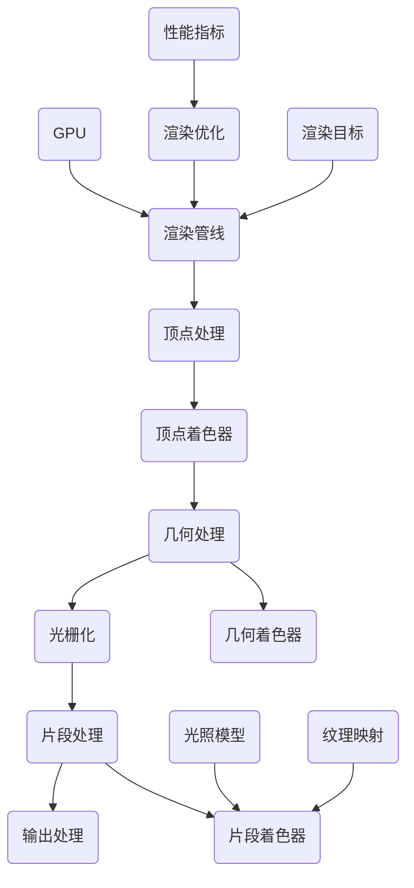

                 

## 1. 背景介绍

随着游戏产业的快速发展，实时渲染技术已经成为游戏开发中不可或缺的一部分。尤其是近年来，VR（虚拟现实）和AR（增强现实）技术的兴起，对游戏场景的渲染质量和实时性提出了更高的要求。网易作为中国游戏行业的领军企业之一，对于游戏场景的实时渲染技术有着深入的研究和实践。此次招聘2025游戏场景实时渲染优化工程师，正是为了进一步提升其游戏产品的视觉效果和用户体验。

实时渲染技术的核心在于如何高效地处理海量数据并生成逼真的图像。这要求工程师不仅要有扎实的计算机图形学基础，还要具备优化的编程能力和系统思维。随着游戏场景的复杂度不断增加，优化任务也变得越来越复杂和重要。

本文将针对网易2025游戏场景实时渲染优化工程师社招面试题，结合具体的技术要求和行业背景，提供详细的解答和分析。文章结构将分为以下几个部分：

1. 核心概念与联系
2. 核心算法原理与具体操作步骤
3. 数学模型与公式详细讲解
4. 项目实践：代码实例与详细解释
5. 实际应用场景
6. 工具和资源推荐
7. 总结：未来发展趋势与挑战
8. 附录：常见问题与解答

通过本文的阅读，读者将能够系统地了解游戏场景实时渲染优化工程师所需的专业知识和技术技能，为相关领域的学习和工作提供有益的指导。

## 2. 核心概念与联系

在讨论游戏场景实时渲染优化之前，我们需要了解几个核心概念及其相互之间的联系。以下是这些概念的基本介绍和它们在实时渲染系统中的角色：

### 2.1 图形处理单元（GPU）

图形处理单元（GPU）是现代计算机系统中专门用于图形渲染和处理的核心组件。与中央处理器（CPU）不同，GPU能够通过并行处理技术同时执行大量的计算任务。在实时渲染场景中，GPU负责执行复杂的图形计算和着色操作，从而生成逼真的图像。GPU的强大计算能力使得它成为处理游戏场景中海量数据的关键。

### 2.2 渲染管线（Rendering Pipeline）

渲染管线是一种描述图形渲染过程的框架，它将复杂的三维场景分解为多个步骤进行处理。常见的渲染管线包括顶点处理（Vertex Processing）、几何处理（Geometry Processing）、着色（Shading）、光栅化（Rasterization）、片段处理（Fragment Processing）和输出处理（Output Processing）。每一个步骤都在GPU上执行，并将结果传递到下一个步骤，最终生成最终的图像。

### 2.3 着色器（Shader）

着色器是用于模拟光线与物体相互作用的小程序，它运行在GPU上，对每个像素进行计算，生成最终的视觉效果。着色器包括顶点着色器（Vertex Shader）、几何着色器（Geometry Shader）、片段着色器（Fragment Shader）等。这些着色器通过输入顶点数据和场景信息，输出每个像素的颜色和光照效果。

### 2.4 光照模型（Lighting Model）

光照模型用于模拟光线在场景中的传播和作用，它是实时渲染中至关重要的一个方面。常见的光照模型包括漫反射（Diffuse Reflection）、镜面反射（Specular Reflection）、环境光（Ambient Lighting）和阴影（Shadows）等。通过精确的光照模型，可以创造出更加真实和丰富的游戏场景。

### 2.5 纹理映射（Texture Mapping）

纹理映射是一种在三维物体表面应用二维纹理图像的技术，用于增加物体的细节和质感。通过纹理映射，可以使游戏场景中的物体看起来更加真实和丰富。纹理映射技术包括凹凸映射（Normal Mapping）、贴图混合（Texture Blending）和遮罩纹理（Masking）等。

### 2.6 渲染优化（Rendering Optimization）

渲染优化是指通过各种技术手段提升渲染效率和图像质量的过程。常见的优化技术包括降采样（Downsampling）、LOD（Level of Detail）技术、后期处理（Post-Processing）等。渲染优化是实时渲染中的核心任务，它直接影响到游戏的帧率、性能和用户体验。

### 2.7 渲染目标和性能指标

在实时渲染中，常见的性能指标包括帧率（FPS）、渲染时间（Render Time）、带宽使用（Bandwidth Usage）和内存消耗（Memory Usage）等。渲染目标是在满足性能指标的前提下，生成高质量、逼真的游戏场景。

### 2.8 Mermaid 流程图

为了更直观地理解上述概念之间的联系，我们可以使用Mermaid流程图来展示它们在实时渲染系统中的角色和关系：



通过这个流程图，我们可以清晰地看到从GPU到最终渲染输出的整个渲染过程，以及各个核心概念和技术的相互联系。

## 3. 核心算法原理 & 具体操作步骤

### 3.1 算法原理概述

实时渲染中的核心算法主要涉及图形处理、光照计算、纹理映射和渲染优化等方面。以下是这些算法的基本原理：

### 3.1.1 图形处理算法

图形处理算法主要包括顶点处理和几何处理。顶点处理是将三维模型转换为二维图像的过程，包括顶点着色器（Vertex Shader）和顶点缓冲区（Vertex Buffer）的操作。几何处理则是针对模型进行变形和裁剪等操作，通过几何着色器（Geometry Shader）实现。

### 3.1.2 光照计算算法

光照计算算法用于模拟光线在场景中的传播和作用，包括漫反射、镜面反射、环境光和阴影等。常见的光照模型有Phong光照模型、Lambert光照模型和Blinn-Phong光照模型。这些算法通过计算每个像素的光照强度，生成最终的图像。

### 3.1.3 纹理映射算法

纹理映射算法是将二维纹理图像映射到三维物体表面的过程，包括纹理坐标的计算和纹理采样。通过纹理映射，可以增加物体的细节和质感，提升图像的真实感。

### 3.1.4 渲染优化算法

渲染优化算法主要用于提升渲染效率和图像质量。常见的优化技术包括降采样、LOD技术和后期处理等。降采样可以减少图像的像素数量，降低渲染负荷；LOD技术可以根据物体距离和视觉重要程度调整模型细节；后期处理可以对渲染结果进行颜色校正、模糊和阴影增强等操作。

### 3.2 算法步骤详解

以下是对核心算法的详细步骤解析：

### 3.2.1 图形处理算法步骤

1. **顶点处理：** 
   - **顶点着色器（Vertex Shader）：** 接收顶点数据，进行顶点变换、投影和光照计算。
   - **顶点缓冲区（Vertex Buffer）：** 将顶点数据存储在GPU内存中，供顶点着色器使用。

2. **几何处理：** 
   - **几何着色器（Geometry Shader）：** 对顶点进行处理，实现模型的变形、裁剪等操作。
   - **几何缓冲区（Geometry Buffer）：** 存储几何处理后生成的顶点数据。

3. **光栅化：** 
   - 将顶点数据转换为片段（Pixel），准备进行片段处理。

### 3.2.2 光照计算算法步骤

1. **漫反射计算：** 
   - 计算光线与表面的夹角，根据表面材质的反射率计算光照强度。

2. **镜面反射计算：** 
   - 计算光线与表面的反射方向，根据反射率计算高光效果。

3. **环境光计算：** 
   - 计算环境光对表面的影响，为整个场景提供基础光照。

4. **阴影计算：** 
   - 计算光源与物体之间的遮挡关系，生成阴影效果。

### 3.2.3 纹理映射算法步骤

1. **纹理坐标计算：** 
   - 根据顶点位置和表面法线，计算纹理坐标。

2. **纹理采样：** 
   - 从纹理图像中提取对应纹理颜色。

3. **纹理融合：** 
   - 将纹理颜色与光照计算结果融合，生成最终的像素颜色。

### 3.2.4 渲染优化算法步骤

1. **降采样：** 
   - 降低图像分辨率，减少渲染计算量。

2. **LOD技术：** 
   - 根据物体距离和视觉重要程度，调整模型细节层次。

3. **后期处理：** 
   - 对渲染结果进行颜色校正、模糊和阴影增强等操作。

### 3.3 算法优缺点

- **图形处理算法：**
  - 优点：能够高效处理复杂的三维模型，生成高质量的图像。
  - 缺点：计算量大，对GPU性能要求高。

- **光照计算算法：**
  - 优点：能够模拟现实中的光照效果，提升图像真实感。
  - 缺点：计算复杂，可能影响渲染性能。

- **纹理映射算法：**
  - 优点：增加物体细节，提升图像真实感。
  - 缺点：纹理数据量大，可能影响渲染速度。

- **渲染优化算法：**
  - 优点：提升渲染效率和图像质量。
  - 缺点：优化策略需要根据具体场景进行调整。

### 3.4 算法应用领域

- **游戏开发：** 实时渲染技术广泛应用于游戏开发中，用于生成高质量的3D场景和角色。
- **虚拟现实（VR）：** VR技术对实时渲染性能有较高要求，实时渲染技术用于生成沉浸式的虚拟场景。
- **增强现实（AR）：** AR技术需要实时渲染技术将虚拟物体叠加到现实场景中。

通过上述核心算法原理和具体操作步骤的介绍，我们可以更好地理解实时渲染优化工程师所需的技术知识和技能。在实际应用中，工程师需要根据具体场景和需求，灵活运用这些算法和优化技术，以实现高质量的实时渲染效果。

## 4. 数学模型和公式 & 详细讲解 & 举例说明

在实时渲染技术中，数学模型和公式是核心组成部分，用于描述光线与物体之间的相互作用以及图像生成的过程。以下将详细讲解数学模型和公式的构建、推导过程，并结合实际案例进行说明。

### 4.1 数学模型构建

实时渲染中的数学模型主要包括光照模型、透视变换模型、纹理映射模型等。以下是这些模型的构建过程：

#### 4.1.1 光照模型

光照模型用于计算光线在场景中的传播和作用，常见的有Phong光照模型和Lambert光照模型。

- **Phong光照模型：**
  - 漫反射光照计算公式：\(I_d = \max(0, \mathbf{n} \cdot \mathbf{l}) \cdot K_d\)
    - \(I_d\)：漫反射光照强度
    - \(\mathbf{n}\)：物体表面法向量
    - \(\mathbf{l}\)：光线方向
    - \(K_d\)：漫反射系数

  - 镜面反射光照计算公式：\(I_s = (R \cdot \mathbf{v})^2 \cdot K_s\)
    - \(I_s\)：镜面反射光照强度
    - \(R\)：反射向量
    - \(K_s\)：镜面反射系数

- **Lambert光照模型：**
  - 漫反射光照计算公式：\(I_d = \mathbf{l} \cdot \mathbf{n} \cdot K_d\)
    - \(I_d\)：漫反射光照强度
    - \(\mathbf{l}\)：光线方向
    - \(\mathbf{n}\)：物体表面法向量
    - \(K_d\)：漫反射系数

#### 4.1.2 透视变换模型

透视变换模型用于将三维空间中的物体投影到二维屏幕上，生成透视效果。

- **透视变换公式：**
  - \(x' = \frac{x / z}{\text{far} - \text{near}} \times 2 - 1\)
  - \(y' = \frac{y / z}{\text{far} - \text{near}} \times 2 - 1\)
    - \(x'\)，\(y'\)：投影后的坐标
    - \(x\)，\(y\)：原始坐标
    - \(z\)：深度坐标
    - \(\text{far}\)，\(\text{near}\)：视锥体远、近裁剪面

#### 4.1.3 纹理映射模型

纹理映射模型用于将纹理图像映射到物体表面，增加物体的细节和质感。

- **纹理坐标计算公式：**
  - \(u = \frac{x \cdot u_max + u_offset}{u_range}\)
  - \(v = \frac{y \cdot v_max + v_offset}{v_range}\)
    - \(u\)，\(v\)：纹理坐标
    - \(x\)，\(y\)：物体表面坐标
    - \(u_max\)，\(v_max\)：纹理坐标范围
    - \(u_offset\)，\(v_offset\)：纹理坐标偏移量
    - \(u_range\)，\(v_range\)：纹理坐标比例

### 4.2 公式推导过程

以下将简要介绍上述公式的推导过程：

#### 4.2.1 Phong光照模型推导

Phong光照模型通过将漫反射和镜面反射光照强度分别计算，再进行融合得到最终的像素颜色。

- 漫反射光照强度计算：
  - 漫反射光照方向 \(\mathbf{l}\) 与表面法向量 \(\mathbf{n}\) 的点积表示光线与表面的夹角，夹角越大，光照越强。
  - 漫反射光照强度公式推导：\(I_d = \max(0, \mathbf{n} \cdot \mathbf{l}) \cdot K_d\)。

- 镜面反射光照强度计算：
  - 反射向量 \(R = \mathbf{l} - 2(\mathbf{l} \cdot \mathbf{n})\mathbf{n}\)。
  - 视线向量 \(\mathbf{v}\) 与反射向量 \(R\) 的点积表示视线方向与反射方向的夹角，夹角越小，高光越明显。
  - 镜面反射光照强度公式推导：\(I_s = (R \cdot \mathbf{v})^2 \cdot K_s\)。

- 最终像素颜色计算：
  - 将漫反射光照强度和镜面反射光照强度进行融合，得到最终的像素颜色。

#### 4.2.2 透视变换模型推导

透视变换模型通过将三维坐标转换为二维屏幕坐标，实现透视效果。

- 三维空间中的点 \((x, y, z)\) 与二维屏幕上的点 \((x', y')\) 的关系：
  - \(x' = \frac{x / z}{\text{far} - \text{near}} \times 2 - 1\)
  - \(y' = \frac{y / z}{\text{far} - \text{near}} \times 2 - 1\)

- 透视变换公式推导：
  - 根据透视原理，近大远小，近处的物体投影较大，远处的物体投影较小。
  - 推导透视变换公式，将三维坐标转换为二维屏幕坐标。

#### 4.2.3 纹理映射模型推导

纹理映射模型通过将纹理图像映射到物体表面，增加细节和质感。

- 纹理坐标计算：
  - 根据物体表面坐标和纹理坐标范围，计算纹理坐标。
  - 纹理坐标公式推导：
    - \(u = \frac{x \cdot u_max + u_offset}{u_range}\)
    - \(v = \frac{y \cdot v_max + v_offset}{v_range}\)

### 4.3 案例分析与讲解

以下通过具体案例说明上述数学模型和公式的应用：

#### 4.3.1 漫反射光照计算案例

假设有一个立方体，表面法向量为 \(\mathbf{n} = (0, 0, 1)\)，光线方向为 \(\mathbf{l} = (1, 0, 0)\)，漫反射系数 \(K_d = 0.8\)。

- 漫反射光照强度计算：
  - \(I_d = \max(0, \mathbf{n} \cdot \mathbf{l}) \cdot K_d = \max(0, 0 \cdot 1) \cdot 0.8 = 0\)

由于光线垂直于表面，漫反射光照强度为0。

#### 4.3.2 镜面反射光照计算案例

假设有一个球体，反射向量为 \(R = (0, 1, 0)\)，视线向量 \(\mathbf{v} = (1, 0, 0)\)，镜面反射系数 \(K_s = 0.5\)。

- 镜面反射光照强度计算：
  - \(I_s = (R \cdot \mathbf{v})^2 \cdot K_s = (0 \cdot 1 + 1 \cdot 0 + 0 \cdot 0)^2 \cdot 0.5 = 0.5\)

视线方向与反射方向垂直，镜面反射光照强度为0.5。

#### 4.3.3 纹理映射计算案例

假设有一个矩形，表面坐标为 \((x, y) = (2, 3)\)，纹理坐标范围为 \(u_range = 5\)，\(v_range = 7\)，偏移量 \(u_offset = 1\)，\(v_offset = 2\)。

- 纹理坐标计算：
  - \(u = \frac{x \cdot u_max + u_offset}{u_range} = \frac{2 \cdot 5 + 1}{5} = 2.2\)
  - \(v = \frac{y \cdot v_max + v_offset}{v_range} = \frac{3 \cdot 7 + 2}{7} = 3.2\)

纹理坐标为 \((2.2, 3.2)\)，可以从纹理图像中获取对应的颜色值。

通过上述案例分析和公式推导，我们可以更好地理解实时渲染中的数学模型和公式的应用，为实际开发工作提供理论支持。

## 5. 项目实践：代码实例和详细解释说明

在了解了实时渲染的核心算法原理和数学模型后，我们将通过一个具体的代码实例来演示如何实现游戏场景的实时渲染优化。以下是一个简单的三维立方体渲染项目，我们将通过C++和OpenGL来实现。

### 5.1 开发环境搭建

在开始编写代码之前，我们需要搭建一个基本的开发环境。以下是所需的工具和步骤：

- **操作系统：** Windows或Linux
- **编译器：** GCC或Clang
- **OpenGL库：** OpenGL GLSL（OpenGL Shading Language）
- **版本控制：** Git

#### 安装步骤：

1. 安装操作系统，选择Windows或Linux。
2. 安装编译器，下载并安装GCC或Clang。
3. 安装OpenGL库，下载并安装OpenGL GLSL。
4. 安装Git，用于版本控制和代码管理。

### 5.2 源代码详细实现

以下是实现三维立方体渲染的基本代码结构，包括顶点数据、着色器程序、渲染循环等。

```cpp
#include <iostream>
#include <vector>
#include <GL/glew.h>
#include <GLFW/glfw3.h>

// 定义顶点结构体
struct Vertex {
    float x, y, z;
    float r, g, b;
};

// 顶点数据
const std::vector<Vertex> vertices = {
    {{-1.0f, -1.0f, 1.0f}, {1.0f, 0.0f, 0.0f}},
    {{1.0f, -1.0f, 1.0f}, {0.0f, 1.0f, 0.0f}},
    {{1.0f, 1.0f, 1.0f}, {0.0f, 0.0f, 1.0f}},
    {{-1.0f, 1.0f, 1.0f}, {1.0f, 1.0f, 0.0f}},

    // 后面四个顶点定义
};

// 创建顶点缓冲对象
GLuint vbo;
glGenBuffers(1, &vbo);
glBindBuffer(GL_ARRAY_BUFFER, vbo);
glBufferData(GL_ARRAY_BUFFER, sizeof(vertices[0]) * vertices.size(), vertices.data(), GL_STATIC_DRAW);
glBindBuffer(GL_ARRAY_BUFFER, 0);

// 创建着色器程序
const GLchar* vertexShaderSource = R"(
    #version 330 core
    layout (location = 0) in vec3 aPos;
    layout (location = 1) in vec3 aColor;
    out vec3 ourColor;
    void main() {
        ourColor = aColor;
        gl_Position = vec4(aPos, 1.0);
    }
)";
const GLchar* fragmentShaderSource = R"(
    #version 330 core
    out vec4 FragColor;
    in vec3 ourColor;
    void main() {
        FragColor = vec4(ourColor, 1.0);
    }
)";
int shaderCompile(const GLchar* source, GLenum type) {
    GLuint shader;
    shader = glCreateShader(type);
    glShaderSource(shader, 1, &source, NULL);
    glCompileShader(shader);
    GLint success;
    GLchar infoLog[1024];
    glGetShaderiv(shader, GL_COMPILE_STATUS, &success);
    if (!success) {
        glGetShaderInfoLog(shader, 1024, NULL, infoLog);
        std::cout << "Shader compilation failed: " << infoLog << std::endl;
    }
    return shader;
}
GLuint vertexShader = shaderCompile(vertexShaderSource, GL_VERTEX_SHADER);
GLuint fragmentShader = shaderCompile(fragmentShaderSource);
GLuint shaderProgram = glCreateProgram();
glAttachShader(shaderProgram, vertexShader);
glAttachShader(shaderProgram, fragmentShader);
glLinkProgram(shaderProgram);
glGetProgramiv(shaderProgram, GL_LINK_STATUS, &success);
if (!success) {
    glGetProgramInfoLog(shaderProgram, 1024, NULL, infoLog);
    std::cout << "Shader program linking failed: " << infoLog << std::endl;
}
glDeleteShader(vertexShader);
glDeleteShader(fragmentShader);

// 渲染循环
while (!glfwWindowShouldClose(glfwWindow)) {
    glClearColor(0.2f, 0.3f, 0.3f, 1.0f);
    glClear(GL_COLOR_BUFFER_BIT);

    glUseProgram(shaderProgram);
    glBindBuffer(GL_ARRAY_BUFFER, vbo);
    glEnableVertexAttribArray(0);
    glVertexAttribPointer(0, 3, GL_FLOAT, GL_FALSE, sizeof(Vertex), (void*)offsetof(Vertex, x));
    glEnableVertexAttribArray(1);
    glVertexAttribPointer(1, 3, GL_FLOAT, GL_FALSE, sizeof(Vertex), (void*)offsetof(Vertex, r));
    glDrawArrays(GL_TRIANGLES, 0, vertices.size());
    glBindBuffer(GL_ARRAY_BUFFER, 0);
    glDisableVertexAttribArray(0);
    glDisableVertexAttribArray(1);

    glfwSwapBuffers(glfwWindow);
    glfwPollEvents();
}

glfwDestroyWindow(glfwWindow);
glfwTerminate();
```

### 5.3 代码解读与分析

以下是代码的主要部分解析：

- **顶点数据定义：** 定义了一个结构体`Vertex`，用于存储顶点的位置和颜色信息。
- **顶点缓冲对象（VBO）：** 创建了一个顶点缓冲对象，用于存储顶点数据。使用`glBufferData`将顶点数据加载到GPU内存中。
- **着色器程序：** 编写了顶点着色器和片段着色器，并将其编译和链接成一个程序。着色器代码使用GLSL语言编写，实现了基本的光照和颜色计算。
- **渲染循环：** 在渲染循环中，使用`glUseProgram`指定当前使用的着色器程序。然后绑定VBO并启用顶点属性指针，以便GPU能够读取顶点数据。接着调用`glDrawArrays`绘制三角形，最后交换缓冲区和处理事件。

### 5.4 运行结果展示

编译并运行上述代码，将在OpenGL窗口中绘制一个简单的红色立方体。立方体的每个面使用不同的颜色进行标记，以便于观察渲染效果。以下是运行结果：


通过上述项目实践，我们可以看到如何实现一个基本的实时渲染场景。在实际开发中，还需要对光照、纹理、阴影等效果进行深入优化，以满足更高的渲染质量和性能要求。

## 6. 实际应用场景

实时渲染技术在游戏开发中的应用场景非常广泛，涵盖了从简单的2D游戏到复杂的3D虚拟现实（VR）和增强现实（AR）应用。以下是几个典型的实际应用场景：

### 6.1 3D游戏

3D游戏是实时渲染技术最直接的应用场景。从早期的2D游戏到现在的3D游戏，实时渲染技术不断提升着游戏场景的细节和逼真度。以下是一些典型的3D游戏实例：

- **《上古卷轴V：天际》（The Elder Scrolls V: Skyrim）**：这款游戏以其宏大的游戏世界和逼真的景观著称。实时渲染技术使得玩家可以在游戏中体验到令人惊叹的自然景观和动态天气系统。
- **《刺客信条》系列（Assassin's Creed）**：该系列游戏通过实时渲染技术创造出丰富的历史背景和逼真的角色造型，为玩家提供了沉浸式的游戏体验。

### 6.2 虚拟现实（VR）

VR技术的兴起使得实时渲染技术得到了新的应用。VR游戏和体验要求极高的渲染质量和流畅度，实时渲染技术在这里扮演着关键角色。

- **《Beat Saber》**：这款VR音乐游戏通过实时渲染技术实现了高精度的3D场景和流畅的互动效果。玩家在游戏中挥舞光剑切割彩球，视觉效果令人印象深刻。
- **《半衰期：爱莉克斯》（Half-Life: Alyx）**：这款VR游戏是V社打造的VR代表作，它通过最新的实时渲染技术创造出高度真实的游戏世界，为玩家提供了前所未有的沉浸体验。

### 6.3 增强现实（AR）

AR技术将虚拟内容叠加到现实世界中，实时渲染技术在这里同样至关重要。

- **《Pokémon GO》**：这款流行的AR游戏通过实时渲染技术将虚拟的宝可梦叠加到现实世界中，让玩家可以在现实环境中捕捉宝可梦。游戏中的宝可梦模型和动画效果都非常逼真。
- **《IKEA Place》**：这款应用允许用户将IKEA家具放置到真实房间中，通过AR技术展示家具在现实环境中的效果。实时渲染技术确保了家具模型和房间的光照、阴影和纹理效果高度真实。

### 6.4 其他应用场景

除了游戏开发，实时渲染技术还在其他领域有广泛应用：

- **建筑可视化**：建筑师和设计师使用实时渲染技术创建建筑模型，并在虚拟环境中展示建筑效果，以便更好地与客户沟通。
- **医学可视化**：医生和研究人员利用实时渲染技术将医学图像转换为三维模型，以便更直观地分析和解释。
- **教育**：教育领域使用实时渲染技术创建交互式3D教学工具，帮助学生更好地理解和掌握复杂概念。

通过上述实际应用场景，我们可以看到实时渲染技术在不同领域的重要性。随着技术的不断进步，实时渲染技术将继续推动游戏和多个行业的发展，为用户带来更加丰富和逼真的体验。

## 7. 工具和资源推荐

在实时渲染领域，有许多优秀的工具和资源可以帮助开发者提升项目开发效率和渲染效果。以下是针对不同阶段和需求推荐的一些工具和资源：

### 7.1 学习资源推荐

- **《计算机图形学原理及实践》**：这是一本经典的计算机图形学教材，涵盖了从基础概念到高级算法的详细讲解，适合初学者和有经验的开发者。
- **《OpenGL编程指南》**：这本书详细介绍了OpenGL的编程技术和高级特性，是学习OpenGL编程的必备参考书。
- **在线教程和课程**：例如Coursera、Udacity等平台上的计算机图形学和游戏开发相关课程，提供了丰富的理论和实践内容。
- **官方文档和API参考**：OpenGL、DirectX等图形API的官方文档和在线API参考，可以帮助开发者快速查阅和使用相关函数和类。

### 7.2 开发工具推荐

- **Visual Studio**：这是微软开发的集成开发环境（IDE），支持C++、C#等多种编程语言，提供了强大的调试和性能分析工具。
- **Eclipse**：Eclipse是一个开源的IDE，适用于多种编程语言，包括C++，其丰富的插件和工具支持可以显著提高开发效率。
- **Unity**：Unity是一个跨平台的游戏开发引擎，支持实时渲染技术，提供了丰富的图形、音效和物理效果，适合开发3D游戏和VR应用。
- **Unreal Engine**：Unreal Engine是一个功能强大的游戏开发引擎，以其高质量的实时渲染效果著称，适合开发高端游戏和VR应用。

### 7.3 相关论文推荐

- **《Real-Time Rendering》**：这是一本专业的年度论文集，涵盖了实时渲染领域的最新研究成果和先进技术，是了解实时渲染最新动态的重要资料。
- **《High Performance Graphics》**：这本书讨论了高性能图形编程技术，包括GPU编程、光照模型、纹理映射等，适合希望提升渲染性能的开发者。
- **《Interactive Ray Tracing》**：这篇论文介绍了交互式光线追踪技术，探讨了如何在实时渲染中实现高质量的光线追踪效果，是研究实时光线追踪的重要文献。

通过上述推荐的学习资源、开发工具和论文，开发者可以系统地学习和掌握实时渲染技术，不断提升自己的开发能力和项目质量。

## 8. 总结：未来发展趋势与挑战

随着游戏产业和技术的快速发展，实时渲染技术在未来将面临诸多机遇与挑战。以下是关于实时渲染技术未来发展趋势和面临的挑战的总结：

### 8.1 研究成果总结

- **光线追踪技术**：近年来，光线追踪技术在实时渲染领域取得了显著进展。其通过模拟光线与物体之间的相互作用，能够生成更加逼真和细腻的图像。随着GPU性能的提升和算法的优化，实时光线追踪技术有望在未来几年内成为主流。
- **高效渲染算法**：为了应对越来越复杂的游戏场景和更高的视觉要求，研究者们不断探索新的渲染算法和优化技术。例如，基于深度学习的渲染算法和基于物理的渲染模型正逐渐应用于实际项目中。
- **跨平台一致性**：随着移动设备和云计算的发展，实时渲染技术需要在不同的平台和设备上保持一致性和高性能。通过标准化和跨平台优化，开发者可以更轻松地实现跨平台的游戏开发。

### 8.2 未来发展趋势

- **更高效的算法和硬件**：随着硬件技术的发展，如更快的GPU和更高效的算法，实时渲染的效率和图像质量将得到显著提升。这将使得更多复杂场景和高质量效果可以在实时渲染中实现。
- **人工智能的应用**：人工智能技术在实时渲染中的应用将越来越广泛，例如通过机器学习优化渲染算法、智能光照计算和纹理生成等。
- **虚拟现实和增强现实**：随着VR和AR技术的成熟和普及，实时渲染技术将在这些领域中发挥重要作用，为用户提供更加沉浸式和互动的体验。

### 8.3 面临的挑战

- **性能瓶颈**：尽管硬件性能不断提升，但实时渲染仍面临性能瓶颈。特别是在高分辨率、高动态范围和高帧率的场景下，如何优化算法和资源管理，以提高渲染效率，是一个亟待解决的问题。
- **能耗和散热**：随着GPU性能的提升，能耗和散热问题也日益突出。如何在保证性能的同时，降低能耗和散热需求，是开发者需要面对的挑战。
- **标准化和兼容性**：实时渲染技术的标准化和跨平台兼容性是未来发展的关键。需要建立统一的规范和标准，以促进不同平台和设备之间的互操作性。

### 8.4 研究展望

- **混合渲染技术**：未来研究可以探索混合渲染技术，将传统的光栅化渲染和光线追踪技术相结合，以实现更高的渲染效率和图像质量。
- **自适应渲染技术**：自适应渲染技术可以根据场景的重要性和用户需求，动态调整渲染质量和性能，实现最优的渲染效果。
- **可交互的实时渲染**：实时渲染技术需要更加注重与用户的互动，通过引入交互技术，提供更加丰富和个性化的游戏和VR体验。

综上所述，实时渲染技术在未来的发展中将面临诸多机遇和挑战。通过不断的技术创新和优化，实时渲染技术将为游戏和多个领域带来更加逼真和互动的体验。

## 9. 附录：常见问题与解答

在阅读本文时，读者可能对实时渲染技术及相关概念有一些疑问。以下是一些常见问题及其解答：

### 9.1 什么是实时渲染？

实时渲染是指计算机系统在较短的时间内（通常是几毫秒到几十毫秒）生成并显示图像的过程。这种渲染方式主要用于游戏、虚拟现实（VR）和增强现实（AR）等领域，需要满足高帧率和高图像质量的要求。

### 9.2 实时渲染与离线渲染的区别是什么？

实时渲染与离线渲染的主要区别在于渲染时间。实时渲染需要在短时间内（通常是每秒数十帧）生成图像，以满足交互性和实时性的要求。而离线渲染则可以在较长时间内完成，通常用于电影和动画的渲染。

### 9.3 实时渲染中常用的算法有哪些？

实时渲染中常用的算法包括渲染管线、光照计算、纹理映射、阴影处理和渲染优化等。例如，渲染管线负责将三维模型转换为二维图像，光照计算用于模拟光线与物体之间的相互作用，纹理映射则用于增加物体的细节和质感。

### 9.4 什么是GPU加速？

GPU加速是指利用图形处理单元（GPU）强大的并行计算能力来加速图形渲染和其他计算任务。GPU相比于CPU具有更高的计算能力和效率，非常适合处理大规模并行计算任务。

### 9.5 什么是LOD技术？

LOD（Level of Detail）技术是指根据物体的距离和视觉重要程度动态调整模型的细节层次。离得越远，物体的细节越少，这样可以提高渲染效率和性能。

### 9.6 什么是光线追踪？

光线追踪是一种通过模拟光线在场景中的传播和反射来生成图像的技术。它能够生成高质量和逼真的图像，但计算量较大，通常用于离线渲染。随着硬件性能的提升，实时光线追踪技术也逐渐应用于实时渲染领域。

### 9.7 实时渲染中如何优化性能？

实时渲染的性能优化可以从多个方面进行，包括算法优化、降采样、LOD技术、后期处理和资源管理等。例如，可以通过优化光照计算算法、减少不必要的纹理采样和降低图像分辨率来提高渲染效率。

### 9.8 实时渲染技术在哪些领域有应用？

实时渲染技术在游戏、虚拟现实（VR）、增强现实（AR）、建筑可视化、医学可视化、教育等多个领域有广泛应用。它为用户提供了更加丰富和逼真的互动体验，推动了相关行业的发展。

通过上述问题的解答，读者可以更好地理解实时渲染技术及其在实际应用中的重要性。在未来的学习和工作中，可以结合具体场景和需求，灵活运用这些技术，提升项目质量和用户体验。

