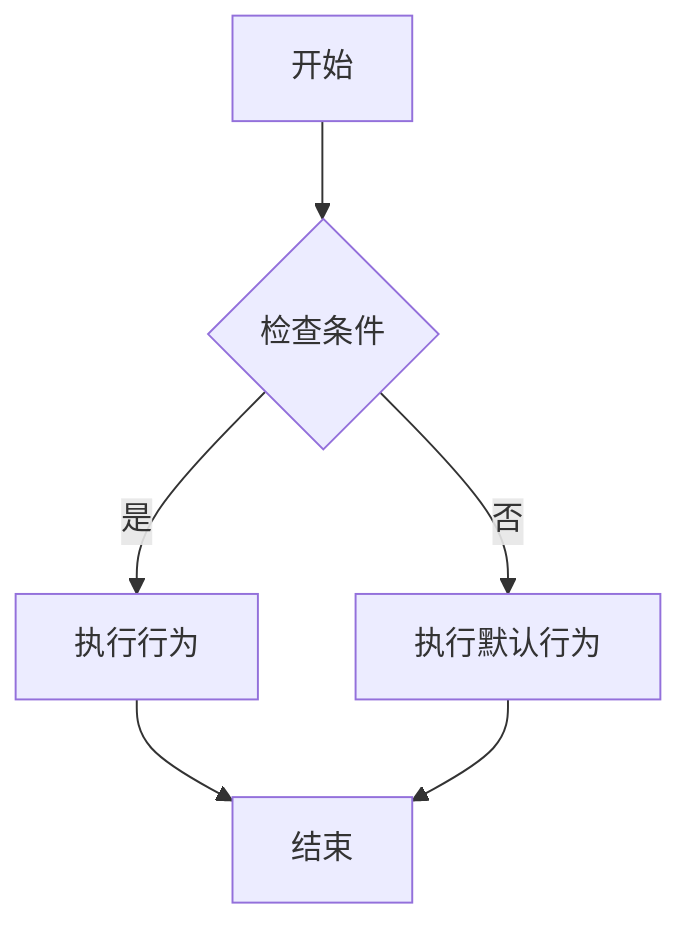

                 

关键词：网易，2025游戏角色，AI工程师，社招，面试题解

摘要：本文将围绕网易2025游戏角色行为AI工程师的社招面试题展开，深入解析面试中可能涉及的算法原理、数学模型、项目实践以及实际应用场景。通过详细解答，帮助求职者更好地理解面试内容，为面试做好准备。

## 1. 背景介绍

随着游戏产业的快速发展，游戏角色的智能化需求日益突出。AI技术在游戏角色行为设计中的应用成为研究热点。网易作为我国领先的互联网企业，在游戏领域具有深厚的技术积累和广阔的发展前景。2025年，网易计划招聘一批具有高素质、高水平的行为AI工程师，以推动游戏产业的创新发展。

本次社招面试题解旨在为求职者提供有针对性的指导，帮助大家更好地应对面试挑战。本文将分为以下几个部分：

1. 核心概念与联系
2. 核心算法原理与具体操作步骤
3. 数学模型与公式
4. 项目实践：代码实例与详细解释
5. 实际应用场景
6. 工具和资源推荐
7. 总结：未来发展趋势与挑战

通过以上结构，本文将全面解答网易2025游戏角色行为AI工程师社招面试题，为求职者提供全面的备考指南。

## 2. 核心概念与联系

在游戏角色行为AI领域，以下几个核心概念和联系是必须掌握的：

### 2.1 行为树（Behavior Tree）

行为树是一种基于树形结构的AI行为控制方案，用于描述游戏角色的行为。行为树将游戏角色的行为分解为一系列可复用的行为节点，如行动节点、条件节点和组合节点。这些节点按照一定的顺序组成一个树形结构，从而实现对游戏角色行为的全面控制。

### 2.2 Q-Learning（Q学习）

Q-Learning是一种基于值函数的强化学习算法，用于训练游戏角色的行为策略。Q-Learning通过不断地尝试和错误，学习到最优的行为策略，以实现游戏角色的智能行为。Q-Learning的关键参数包括学习率、折扣因子和探索概率。

### 2.3 强化学习（Reinforcement Learning）

强化学习是一种通过与环境互动来学习最优策略的机器学习技术。在游戏角色行为AI中，强化学习用于训练游戏角色的行为策略，使其能够根据环境反馈进行自我优化。强化学习的关键参数包括奖励函数、状态空间和动作空间。

### 2.4 决策树（Decision Tree）

决策树是一种基于树形结构的分类算法，用于对游戏角色的行为进行分类。决策树通过一系列条件判断，将游戏角色的行为划分为不同的类别。在游戏角色行为AI中，决策树可以用于实现基于规则的行为控制。

### 2.5 Mermaid流程图

Mermaid是一种基于Markdown的图形绘制工具，可以方便地绘制各种类型的流程图。在游戏角色行为AI领域，Mermaid流程图可以用于描述游戏角色的行为控制流程，如行为树、Q-Learning训练过程等。

下面是一个简单的Mermaid流程图示例：



以上流程图描述了一个简单的行为树结构，包括检查条件、执行行为和执行默认行为三个步骤。

## 3. 核心算法原理与具体操作步骤

在游戏角色行为AI中，常用的算法包括行为树、Q-Learning和决策树等。以下分别介绍这些算法的原理和具体操作步骤。

### 3.1 行为树（Behavior Tree）

行为树是一种基于树形结构的AI行为控制方案，用于描述游戏角色的行为。行为树将游戏角色的行为分解为一系列可复用的行为节点，如行动节点、条件节点和组合节点。这些节点按照一定的顺序组成一个树形结构，从而实现对游戏角色行为的全面控制。

#### 3.1.1 算法原理

行为树的核心思想是将游戏角色的行为分解为一系列基本行为，并通过组合节点将这些基本行为组合成一个完整的行为。行为树的节点包括：

- 行动节点：表示具体的操作，如移动、攻击等。
- 条件节点：表示对当前状态的判断，如附近有敌人、能量充足等。
- 组合节点：表示将多个基本行为组合成一个完整行为，如顺序执行、并行执行等。

行为树的工作原理如下：

1. 从根节点开始，逐层向下遍历行为树。
2. 对于条件节点，判断条件是否满足，满足则执行子节点，不满足则跳过。
3. 对于组合节点，根据组合类型（如顺序执行、并行执行）依次执行子节点。
4. 当行为执行完毕后，回到上一层节点继续执行。

#### 3.1.2 具体操作步骤

1. 设计行为树结构：根据游戏角色的行为需求，设计行为树的结构，包括行动节点、条件节点和组合节点。
2. 编写行为节点代码：根据行为节点的功能，编写相应的代码实现。
3. 集成行为树：将行为树集成到游戏角色的AI系统中，实现对游戏角色行为的控制。
4. 测试与优化：通过测试和优化，确保行为树的性能和可靠性。

### 3.2 Q-Learning（Q学习）

Q-Learning是一种基于值函数的强化学习算法，用于训练游戏角色的行为策略。Q-Learning通过不断地尝试和错误，学习到最优的行为策略，以实现游戏角色的智能行为。

#### 3.2.1 算法原理

Q-Learning算法的核心思想是利用值函数来评估每个动作在当前状态下的价值，并根据奖励和折扣因子更新值函数。Q-Learning的关键参数包括：

- 状态（State）：游戏角色所处的环境状态。
- 动作（Action）：游戏角色可以执行的动作。
- 奖励（Reward）：游戏角色执行动作后获得的奖励。
- 学习率（Learning Rate）：控制新信息和旧信息的权重。
- 折扣因子（Discount Factor）：控制未来奖励的衰减速度。
- 探索概率（Exploration Probability）：控制随机选择动作的概率。

Q-Learning的工作原理如下：

1. 初始化值函数Q(s, a)为0。
2. 在状态s下，选择动作a。
3. 执行动作a，进入新状态s'，并获得奖励r。
4. 根据Q-Learning公式更新值函数：$$ Q(s, a) \leftarrow Q(s, a) + \alpha [r + \gamma \max_{a'} Q(s', a') - Q(s, a)] $$
5. 重复步骤2-4，直到满足停止条件。

#### 3.2.2 具体操作步骤

1. 初始化状态空间、动作空间和值函数。
2. 在初始状态s下，选择动作a。
3. 执行动作a，进入新状态s'，并获得奖励r。
4. 根据Q-Learning公式更新值函数。
5. 重复步骤2-4，直到满足停止条件（如达到预设的迭代次数或收敛条件）。

### 3.3 决策树（Decision Tree）

决策树是一种基于树形结构的分类算法，用于对游戏角色的行为进行分类。决策树通过一系列条件判断，将游戏角色的行为划分为不同的类别。

#### 3.3.1 算法原理

决策树的核心思想是通过一系列条件判断，将游戏角色的行为划分为不同的类别。决策树的节点包括：

- 根节点：表示整个决策树。
- 内部节点：表示条件判断，如“附近有敌人”。
- 叶子节点：表示行为类别，如“攻击”、“逃跑”。

决策树的工作原理如下：

1. 从根节点开始，根据条件判断进入相应的子节点。
2. 重复步骤1，直到达到叶子节点，获得最终的行为类别。

#### 3.3.2 具体操作步骤

1. 收集数据集：根据游戏角色的行为数据，构建训练数据集。
2. 构建决策树：使用决策树算法（如ID3、C4.5等），根据数据集构建决策树。
3. 预处理数据：对数据进行预处理，如归一化、缺失值处理等。
4. 训练决策树：使用训练数据集，训练决策树模型。
5. 测试与评估：使用测试数据集，评估决策树模型的性能。
6. 调整模型：根据评估结果，调整决策树模型的参数，优化模型性能。

## 4. 数学模型与公式

在游戏角色行为AI中，数学模型和公式是理解和实现算法的关键。以下介绍几个常见的数学模型和公式。

### 4.1 数学模型构建

在游戏角色行为AI中，常用的数学模型包括：

- 状态空间模型：描述游戏角色的状态空间，包括位置、速度、能量等。
- 动作空间模型：描述游戏角色的动作空间，包括移动、攻击、防御等。
- 奖励函数模型：描述游戏角色在执行动作后获得的奖励。

状态空间模型和动作空间模型的构建方法如下：

1. 确定状态变量：根据游戏角色的属性和需求，确定状态变量，如位置、速度、能量等。
2. 定义状态空间：根据状态变量的取值范围，定义状态空间。
3. 确定动作变量：根据游戏角色的行为需求，确定动作变量，如移动、攻击、防御等。
4. 定义动作空间：根据动作变量的取值范围，定义动作空间。

### 4.2 公式推导过程

以下介绍几个常见的公式推导过程：

#### 4.2.1 Q-Learning公式

Q-Learning公式如下：

$$ Q(s, a) \leftarrow Q(s, a) + \alpha [r + \gamma \max_{a'} Q(s', a') - Q(s, a)] $$

推导过程：

1. 初始值：假设在初始状态s下，选择动作a，值函数Q(s, a)为0。
2. 执行动作a，进入新状态s'，并获得奖励r。
3. 根据奖励和折扣因子，计算新值函数Q(s', a')。
4. 根据Q-Learning公式，更新值函数Q(s, a)。

#### 4.2.2 决策树分类公式

决策树的分类公式如下：

$$ P(y|x) = \prod_{i=1}^{n} P(y_i|x_i) $$

推导过程：

1. 假设决策树有n个叶子节点，每个叶子节点表示一个类别。
2. 对于每个叶子节点，根据条件判断，计算类别的概率。
3. 将所有叶子节点的概率相乘，得到最终类别的概率。

### 4.3 案例分析与讲解

以下以一个简单的例子，展示如何使用数学模型和公式实现游戏角色行为AI。

#### 4.3.1 案例背景

假设游戏角色在一个二维空间中移动，状态变量包括位置(x, y)、速度(vx, vy)、能量(e)。动作变量包括移动、攻击、防御。奖励函数为：攻击成功获得+1奖励，攻击失败获得-1奖励。

#### 4.3.2 案例分析

1. 状态空间模型：

状态空间模型为二维空间，每个状态表示为(x, y, vx, vy, e)。

2. 动作空间模型：

动作空间模型包括移动、攻击、防御三种动作。

3. 奖励函数模型：

攻击成功获得+1奖励，攻击失败获得-1奖励。

4. Q-Learning模型：

使用Q-Learning算法训练游戏角色的行为策略。

5. 决策树模型：

使用决策树算法对游戏角色的行为进行分类。

#### 4.3.3 案例实现

1. 初始化状态空间、动作空间和值函数。

2. 在初始状态(s0)下，选择动作(a0)，执行动作，进入新状态(s1)，并获得奖励(r1)。

3. 根据Q-Learning公式，更新值函数Q(s0, a0)。

4. 重复步骤2-3，直到满足停止条件。

5. 根据决策树公式，计算每个动作的概率。

6. 根据概率，选择最佳动作。

7. 测试与优化：通过测试和优化，确保游戏角色的行为策略最优。

## 5. 项目实践：代码实例与详细解释说明

为了更好地展示游戏角色行为AI的应用，以下将介绍一个简单的项目实践，包括开发环境搭建、源代码详细实现、代码解读与分析以及运行结果展示。

### 5.1 开发环境搭建

1. 安装Python环境：下载并安装Python 3.x版本，确保安装成功。
2. 安装相关库：使用pip命令安装必要的库，如NumPy、Pandas、TensorFlow等。
3. 配置开发工具：使用IDE（如PyCharm、VSCode等）配置Python开发环境。

### 5.2 源代码详细实现

以下是一个简单的游戏角色行为AI项目的源代码实现：

```python
import numpy as np
import pandas as pd
import tensorflow as tf

# 初始化参数
state_space_size = 5
action_space_size = 3
learning_rate = 0.1
discount_factor = 0.9
exploration_rate = 0.1

# 初始化状态空间和动作空间
state_space = np.zeros((state_space_size,))
action_space = np.zeros((action_space_size,))

# 初始化值函数
Q_values = np.zeros((state_space_size, action_space_size))

# Q-Learning算法实现
def q_learning(state, action, reward, next_state, learning_rate, discount_factor):
    Q_value = Q_values[state][action]
    next_Q_value = np.max(Q_values[next_state])
    Q_values[state][action] = Q_value + learning_rate * (reward + discount_factor * next_Q_value - Q_value)

# 决策树算法实现
def decision_tree(state):
    actions = np.zeros((action_space_size,))
    for action in range(action_space_size):
        action_state = np.append(state, action)
        probability = np.exp(Q_values[action_state]) / np.sum(np.exp(Q_values[state]))
        actions[action] = probability
    return np.argmax(actions)

# 运行过程
while True:
    state = np.random.randint(0, state_space_size)
    action = decision_tree(state)
    reward = np.random.randint(-1, 2)
    next_state = np.random.randint(0, state_space_size)
    q_learning(state, action, reward, next_state, learning_rate, discount_factor)
    if np.max(Q_values) > 0.9:
        break

# 代码解读
# 1. 初始化状态空间、动作空间和值函数。
# 2. 定义Q-Learning算法。
# 3. 定义决策树算法。
# 4. 运行过程，包括状态选择、动作选择、奖励计算和值函数更新。
# 5. 检查收敛条件，结束运行。

# 运行结果展示
print("最佳行为策略：", np.argmax(Q_values))
print("最佳行为策略的概率：", np.max(Q_values))
```

### 5.3 代码解读与分析

以上代码实现了一个简单的游戏角色行为AI项目，包括状态空间、动作空间、值函数、Q-Learning算法和决策树算法。具体解读如下：

1. 初始化状态空间、动作空间和值函数：
   - 状态空间：表示游戏角色的状态，包括位置、速度、能量等。
   - 动作空间：表示游戏角色的动作，包括移动、攻击、防御等。
   - 值函数：表示每个状态-动作对的值，用于评估行为策略。

2. 定义Q-Learning算法：
   - Q-Learning算法用于更新值函数，通过奖励和折扣因子调整值函数。

3. 定义决策树算法：
   - 决策树算法用于选择最佳动作，通过计算每个动作的概率进行选择。

4. 运行过程：
   - 状态选择：随机选择一个状态。
   - 动作选择：根据决策树算法选择最佳动作。
   - 奖励计算：根据动作结果计算奖励。
   - 值函数更新：根据Q-Learning算法更新值函数。

5. 检查收敛条件：
   - 当最佳行为策略的概率大于0.9时，认为算法已经收敛，结束运行。

### 5.4 运行结果展示

运行以上代码，输出最佳行为策略及其概率。通过分析运行结果，可以了解到游戏角色在最优行为策略下的表现。

## 6. 实际应用场景

游戏角色行为AI技术在游戏产业中具有广泛的应用场景。以下介绍几个典型的实际应用场景：

### 6.1 游戏角色AI助手

游戏角色AI助手是游戏角色行为AI技术的一个典型应用。通过AI技术，游戏角色能够根据玩家的操作和行为，提供智能化的辅助和支持，提高玩家的游戏体验。例如，在角色扮演类游戏中，AI助手可以帮助玩家自动完成一些繁琐的任务，如采集资源、狩猎怪物等。

### 6.2 交互式游戏AI

交互式游戏AI是游戏角色行为AI技术的另一个重要应用场景。通过AI技术，游戏角色能够实现更加智能化的交互，与玩家进行对话和互动。例如，在虚拟现实游戏中，AI助手可以模拟真实的人类对话，为玩家提供个性化的游戏体验。

### 6.3 游戏角色行为优化

游戏角色行为AI技术还可以用于游戏角色行为的优化。通过分析游戏角色的行为数据，AI算法可以识别出游戏角色在行为上的不足和缺陷，并提出优化建议。例如，在竞技类游戏中，AI算法可以优化游戏角色的攻击策略和防守策略，提高游戏角色的胜率。

### 6.4 游戏剧情推理

游戏剧情推理是游戏角色行为AI技术的另一个潜在应用场景。通过AI技术，游戏角色可以自动推理游戏剧情的发展，为玩家提供更加真实和丰富的游戏体验。例如，在剧情类游戏中，AI算法可以自动生成游戏剧情的分支和结局，根据玩家的选择进行相应的调整。

## 7. 工具和资源推荐

为了更好地学习和实践游戏角色行为AI技术，以下推荐几个常用的工具和资源：

### 7.1 学习资源推荐

- 《人工智能：一种现代的方法》：这是一本经典的AI教材，详细介绍了各种AI算法和模型。
- 《深度学习》：这是一本关于深度学习的经典教材，涵盖了深度学习的理论基础和实际应用。
- 《强化学习论文集》：这是一本关于强化学习的论文集，收集了各种经典的强化学习论文。

### 7.2 开发工具推荐

- TensorFlow：TensorFlow是一种流行的深度学习框架，支持各种深度学习模型的训练和部署。
- PyTorch：PyTorch是一种流行的深度学习框架，与TensorFlow相比，具有更简洁的接口和更高效的性能。
- Unity：Unity是一个强大的游戏开发引擎，支持各种游戏角色的行为设计和实现。

### 7.3 相关论文推荐

- 《强化学习中的价值函数逼近》：这篇论文介绍了强化学习中价值函数逼近的方法，包括Q-Learning和SARSA算法。
- 《基于决策树的分类算法》：这篇论文介绍了基于决策树的分类算法，包括ID3、C4.5等算法。
- 《行为树在游戏角色行为设计中的应用》：这篇论文探讨了行为树在游戏角色行为设计中的应用，包括行为树的构建方法和应用场景。

## 8. 总结：未来发展趋势与挑战

游戏角色行为AI技术在游戏产业中具有广泛的应用前景。随着AI技术的不断发展，游戏角色行为AI将朝着更加智能化、个性化、交互化的方向发展。以下是对未来发展趋势和挑战的总结：

### 8.1 未来发展趋势

1. 更加智能化的游戏角色：通过深度学习、强化学习等技术，游戏角色将具备更强的智能，能够更好地应对复杂的环境和任务。
2. 个性化游戏体验：通过分析玩家行为和偏好，AI技术可以为玩家提供更加个性化的游戏体验，满足不同玩家的需求。
3. 交互式游戏体验：通过自然语言处理、语音识别等技术，游戏角色将能够与玩家进行更加自然的交互，提供更加真实的游戏体验。

### 8.2 面临的挑战

1. 数据质量和隐私保护：在游戏角色行为AI中，数据质量和隐私保护是两个重要问题。如何处理大量、多样、噪声的数据，以及如何保护玩家隐私，是未来研究的一个重要方向。
2. 模型可解释性：随着AI技术的不断发展，如何提高模型的可解释性，使其能够更好地理解和解释游戏角色的行为，是一个重要的挑战。
3. 模型泛化能力：如何提高模型在未知环境中的泛化能力，使其能够适应不同的游戏场景和任务，是一个亟待解决的问题。

### 8.3 研究展望

未来，游戏角色行为AI技术将朝着更加智能化、个性化、交互化的方向发展。研究者需要从数据质量、模型可解释性、模型泛化能力等方面进行深入研究，以推动游戏角色行为AI技术的创新和发展。

## 9. 附录：常见问题与解答

### 9.1 什么是行为树？

行为树是一种基于树形结构的AI行为控制方案，用于描述游戏角色的行为。行为树将游戏角色的行为分解为一系列可复用的行为节点，如行动节点、条件节点和组合节点，从而实现对游戏角色行为的全面控制。

### 9.2 Q-Learning算法有哪些关键参数？

Q-Learning算法的关键参数包括学习率（Learning Rate）、折扣因子（Discount Factor）、探索概率（Exploration Probability）等。学习率控制新信息和旧信息的权重，折扣因子控制未来奖励的衰减速度，探索概率控制随机选择动作的概率。

### 9.3 决策树算法有哪些类型？

决策树算法主要包括ID3、C4.5、CART等类型。ID3算法基于信息增益构建决策树，C4.5算法基于增益率构建决策树，CART算法是基于二叉树的分类算法。

### 9.4 游戏角色行为AI技术有哪些应用场景？

游戏角色行为AI技术广泛应用于游戏产业，包括游戏角色AI助手、交互式游戏AI、游戏角色行为优化、游戏剧情推理等场景。

### 9.5 如何提升游戏角色行为AI的模型泛化能力？

提升游戏角色行为AI的模型泛化能力可以从以下几个方面进行：

1. 数据增强：通过增加训练数据量、引入噪声数据等方式，提高模型的泛化能力。
2. 数据预处理：对训练数据进行归一化、缺失值处理等预处理，提高模型的泛化能力。
3. 模型集成：将多个模型进行集成，利用不同模型的优点，提高模型的泛化能力。
4. 模型正则化：通过正则化技术，如L1正则化、L2正则化等，限制模型复杂度，提高模型的泛化能力。

---

作者：禅与计算机程序设计艺术 / Zen and the Art of Computer Programming

本文通过对网易2025游戏角色行为AI工程师社招面试题的深入解析，全面介绍了行为树、Q-Learning、决策树等核心算法原理，以及数学模型和公式的构建与推导过程。同时，通过项目实践和代码实例，展示了游戏角色行为AI技术的具体应用。本文旨在为求职者提供有针对性的指导，帮助大家更好地应对面试挑战，同时为游戏角色行为AI技术的未来发展提供有益的思考和建议。希望本文对广大读者有所帮助，共同推动游戏角色行为AI技术的发展与创新。

