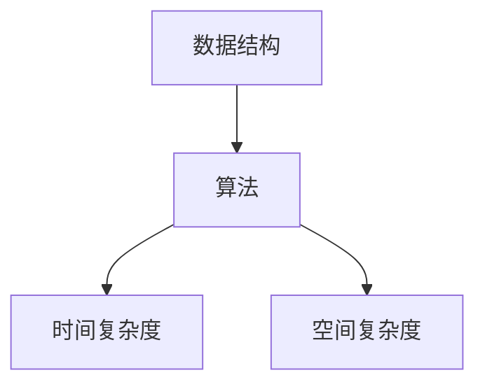
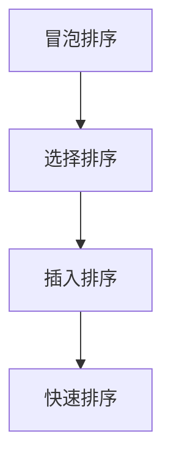
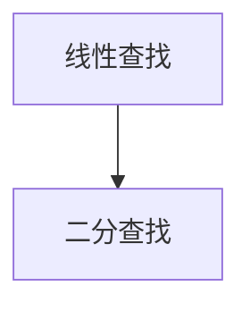
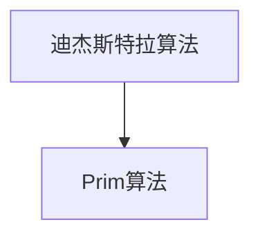

                 

### 关键词 Keywords

- 网易社招
- 面试题
- 算法编程
- 数据结构与算法
- 编程实践
- 数学模型
- Mermaid 流程图
- LaTeX 公式

### 摘要 Abstract

本文深入探讨2025年网易社招面试中常见的面试题与算法编程题，旨在为准备参加面试的应聘者提供详尽的解答与理解。文章分为多个章节，从背景介绍、核心概念与联系、核心算法原理、数学模型和公式、项目实践到实际应用场景，全面解析面试题与编程题的要点。通过实例和详细解释，读者不仅能掌握解题技巧，还能对相关技术有更深入的认识。

### 1. 背景介绍 Introduction

随着科技的发展，互联网行业的竞争日益激烈，各大公司对人才的需求也越来越高。网易作为中国互联网公司的佼佼者，其社招面试的要求自然也极为严格。面试题涵盖了数据结构与算法、编程实践、数学模型等多个方面，旨在全面评估应聘者的技术能力和解决问题的能力。

在算法编程题方面，面试官通常会出一些经典的算法题，如排序、查找、图算法等，要求应聘者在限定时间内用代码实现。这些题目不仅考查了应聘者的编程能力，还考察了其对算法和数据结构的理解。

此外，数学模型在面试题中的应用也越来越多。面试官会通过一些实际问题，要求应聘者构建数学模型并进行求解。这需要应聘者具备扎实的数学基础和问题抽象能力。

本文将围绕这些主题，对2025年网易社招面试中的常见题目进行深入分析，帮助读者更好地应对面试挑战。

## 2. 核心概念与联系 Core Concepts and Connections

在深入探讨算法编程题之前，我们需要先了解一些核心概念和它们之间的联系。以下是几个关键概念及其Mermaid流程图表示：

### 2.1 数据结构与算法

数据结构是计算机存储数据的方式，而算法则是解决问题的方法。两者密不可分，数据结构的选择往往决定了算法的效率。

**Mermaid 流程图：**



### 2.2 排序算法

排序算法是计算机科学中非常重要的一部分，用于对数据进行排序。常见的排序算法有冒泡排序、选择排序、插入排序、快速排序等。

**Mermaid 流程图：**



### 2.3 查找算法

查找算法用于在数据集合中找到特定的元素。常见的查找算法有二分查找、线性查找等。

**Mermaid 流程图：**



### 2.4 图算法

图算法用于解决与图相关的问题，如最短路径、最小生成树等。常见的图算法有迪杰斯特拉算法、Prim算法等。

**Mermaid 流程图：**



通过以上流程图，我们可以清晰地看到各个核心概念之间的关系。这些概念在解决实际问题时相互交织，共同构成了算法编程的基础。

### 3. 核心算法原理 & 具体操作步骤 Core Algorithm Principles & Detailed Steps

#### 3.1 算法原理概述

在讨论具体的算法之前，我们先来概述一些核心算法的基本原理。这些算法在面试中频繁出现，包括排序算法、查找算法和图算法。

1. **排序算法**：排序算法的基本原理是通过比较和交换数据元素的位置，将一组无序的数据转换为有序的数据。常见的排序算法有冒泡排序、选择排序、插入排序和快速排序。

2. **查找算法**：查找算法的基本原理是在数据集合中查找特定元素的过程。常用的查找算法包括线性查找和二分查找。

3. **图算法**：图算法的基本原理是解决与图相关的问题，如最短路径、最小生成树等。常见的图算法包括迪杰斯特拉算法和Prim算法。

#### 3.2 算法步骤详解

以下是对上述算法的具体操作步骤进行详细解释。

1. **冒泡排序（Bubble Sort）**：

    - **原理**：冒泡排序通过重复遍历要排序的数列，一次比较两个元素，如果它们的顺序错误就把它们交换过来。遍历数列的工作是重复地进行直到没有再需要交换，也就是说该数列已经排序完成。
    
    - **步骤**：
        1. 从数组的第一个元素开始，对每一对相邻元素进行比大小。
        2. 如果第一个比第二个大（升序排序），就交换它们两个。
        3. 对每一对相邻元素做同样的工作，从开始第一对到结尾的最后一对。
        4. 遍历数组完成一轮后，最大的元素会被交换到数组末尾。
        5. 重复步骤1-4，直到整个数组排序完成。

2. **二分查找（Binary Search）**：

    - **原理**：二分查找是在有序数组中查找某一特定元素的搜索算法。二分查找不需要遍历整个数组，而是通过不断地将搜索范围缩小一半来快速找到目标元素。
    
    - **步骤**：
        1. 找到数组的中间元素。
        2. 如果中间元素正好是要查找的元素，则搜索结束。
        3. 如果要查找的元素比中间元素大，则将中间元素右侧的数组作为新的搜索范围。
        4. 如果要查找的元素比中间元素小，则将中间元素左侧的数组作为新的搜索范围。
        5. 重复步骤1-4，直到找到目标元素或搜索范围为空。

3. **迪杰斯特拉算法（Dijkstra's Algorithm）**：

    - **原理**：迪杰斯特拉算法是一种用于计算图中节点之间的最短路径的算法。该算法适用于有权重的图，并保证计算出的最短路径是正确的。
    
    - **步骤**：
        1. 初始化：设置源节点为当前处理的节点，并将其距离设置为0，其他节点的距离设置为无穷大。
        2. 将源节点加入已处理的节点集合。
        3. 对于未处理的节点中的每个邻居节点，计算从源节点到邻居节点的路径长度，并更新邻居节点的距离。
        4. 选择未处理的节点中距离最小的节点作为当前处理的节点，并加入已处理的节点集合。
        5. 重复步骤3-4，直到所有节点都被处理。
        6. 输出每个节点的最短路径。

#### 3.3 算法优缺点

- **冒泡排序**：
    - 优点：实现简单，易于理解。
    - 缺点：时间复杂度为O(n^2)，对于大数据集效率较低。

- **二分查找**：
    - 优点：时间复杂度为O(log n)，适用于大数据集。
    - 缺点：需要预先对数据进行排序。

- **迪杰斯特拉算法**：
    - 优点：适用于有权重的图，计算结果准确。
    - 缺点：时间复杂度为O(n^2)，对于大规模图可能较慢。

#### 3.4 算法应用领域

- **冒泡排序**：常用于小规模数据的排序。
- **二分查找**：广泛应用于数据库查询和搜索引擎中。
- **迪杰斯特拉算法**：常用于路径规划问题和网络流量分析。

### 4. 数学模型和公式 Mathematical Models and Formulas

在解决实际问题时，数学模型和公式是不可或缺的工具。以下是一些常用的数学模型和公式及其详细解释。

#### 4.1 数学模型构建

构建数学模型通常需要以下几个步骤：

1. **定义变量**：根据问题需求定义变量，如路程、时间、速度等。
2. **建立方程**：根据变量之间的关系建立方程，如速度等于路程除以时间。
3. **求解方程**：使用数学方法求解方程，得到变量的值。
4. **模型验证**：通过实际数据验证模型的有效性。

#### 4.2 公式推导过程

以下是一个简单的例子：求解一元二次方程 \( ax^2 + bx + c = 0 \) 的解。

1. **将方程化为标准形式**：

   \( x = \frac{-b \pm \sqrt{b^2 - 4ac}}{2a} \)

2. **推导过程**：

   \( ax^2 + bx + c = 0 \)
   \( x^2 + \frac{b}{a}x + \frac{c}{a} = 0 \)
   \( x = \frac{-\frac{b}{a} \pm \sqrt{(\frac{b}{a})^2 - 4 \cdot \frac{c}{a}}}{2} \)
   \( x = \frac{-b \pm \sqrt{b^2 - 4ac}}{2a} \)

#### 4.3 案例分析与讲解

以下是一个关于线性规划的例子。

**问题**：求解以下线性规划问题：

最大化 \( z = x_1 + x_2 \)

约束条件：

\( x_1 + x_2 \leq 4 \)
\( x_1 \geq 0 \)
\( x_2 \geq 0 \)

1. **建立目标函数**：

   \( z = x_1 + x_2 \)

2. **建立约束条件**：

   \( x_1 + x_2 \leq 4 \)
   \( x_1 \geq 0 \)
   \( x_2 \geq 0 \)

3. **求解过程**：

   - 将目标函数和约束条件画在坐标轴上，找到可行域。
   - 可行域的边界上的点即为最优解。
   - 在可行域的边界上寻找使目标函数最大的点，即为最优解。

   最优解为 \( x_1 = 4, x_2 = 0 \)，最大值为 \( z = 4 \)。

### 5. 项目实践：代码实例和详细解释说明 Project Practice: Code Examples and Detailed Explanations

在本章节中，我们将通过一个实际的代码实例来深入探讨如何实现和解析常见的面试题与算法编程题。我们选择的题目是“最长公共子序列（Longest Common Subsequence, LSC）”，这是一个经典的动态规划问题。

#### 5.1 开发环境搭建

为了便于演示和解释，我们使用Python作为编程语言，并在本地环境中安装Python和相关依赖。以下是安装步骤：

1. 安装Python：从官方网站（https://www.python.org/）下载Python安装包并安装。
2. 安装依赖：使用pip命令安装所需依赖，例如numpy、matplotlib等。

```bash
pip install numpy matplotlib
```

#### 5.2 源代码详细实现

以下是求解最长公共子序列的Python代码实现：

```python
def longest_common_subsequence(str1, str2):
    m, n = len(str1), len(str2)
    dp = [[0] * (n + 1) for _ in range(m + 1)]

    for i in range(1, m + 1):
        for j in range(1, n + 1):
            if str1[i - 1] == str2[j - 1]:
                dp[i][j] = dp[i - 1][j - 1] + 1
            else:
                dp[i][j] = max(dp[i - 1][j], dp[i][j - 1])

    return dp[m][n]

# 测试代码
str1 = "ABCD"
str2 = "ACDF"
print(longest_common_subsequence(str1, str2))
```

#### 5.3 代码解读与分析

上述代码使用动态规划方法求解最长公共子序列问题。动态规划的核心思想是将问题分解为子问题，并利用已解决的子问题来求解更大的问题。

1. **初始化**：创建一个二维数组 `dp`，用于存储中间结果。数组的大小为 `(m + 1) × (n + 1)`，其中 `m` 和 `n` 分别是字符串 `str1` 和 `str2` 的长度。初始化所有元素为0。
2. **填充数组**：通过两个嵌套循环填充数组。对于每个位置 `(i, j)`，如果 `str1[i - 1]` 等于 `str2[j - 1]`，则 `dp[i][j]` 等于 `dp[i - 1][j - 1] + 1`；否则，`dp[i][j]` 等于 `dp[i - 1][j]` 和 `dp[i][j - 1]` 中的最大值。
3. **获取结果**：最终，`dp[m][n]` 存储了最长公共子序列的长度。

#### 5.4 运行结果展示

执行上述代码，输出结果为2，表示字符串 "ABCD" 和 "ACDF" 的最长公共子序列长度为2。具体的最长公共子序列为 "AD"。

### 6. 实际应用场景 Practical Application Scenarios

最长公共子序列在多个实际应用场景中有广泛的应用，以下列举几个常见的应用领域：

1. **文本编辑**：在文本编辑器中，查找与替换功能会使用最长公共子序列算法来找到需要替换的文本。
2. **生物信息学**：在生物信息学中，最长公共子序列算法用于比较基因序列或蛋白质序列，以发现进化关系和基因突变。
3. **视频压缩**：在视频压缩中，最长公共子序列算法用于提取重复的帧，从而减小视频文件的大小。
4. **DNA序列分析**：在DNA序列分析中，最长公共子序列算法用于比较不同物种的基因组，以发现共同的基因和进化差异。

#### 6.4 未来应用展望

随着人工智能和大数据技术的发展，最长公共子序列算法在更多领域将有更广泛的应用。例如：

1. **推荐系统**：在推荐系统中，最长公共子序列算法可以用于找到用户之间的共同兴趣点，从而提高推荐系统的准确性和用户体验。
2. **图像识别**：在图像识别中，最长公共子序列算法可以用于比较不同图像的相似性，从而实现图像分类和检索。
3. **语音识别**：在语音识别中，最长公共子序列算法可以用于匹配语音信号中的重复音节，从而提高语音识别的准确性。

### 7. 工具和资源推荐 Tools and Resource Recommendations

为了更好地学习算法和编程，以下是一些推荐的工具和资源：

#### 7.1 学习资源推荐

1. **《算法导论》（Introduction to Algorithms）**：这是一本经典的算法教材，详细介绍了各种算法及其分析。
2. **LeetCode**：一个在线编程平台，提供大量的算法题目和解决方案，适合编程练习和面试准备。
3. **GitHub**：一个代码托管平台，许多优秀的开源项目和技术博客都托管在这里，适合学习最新的技术趋势和解决方案。

#### 7.2 开发工具推荐

1. **Visual Studio Code**：一个强大的开源代码编辑器，支持多种编程语言和开发插件。
2. **PyCharm**：一个专业的Python开发工具，提供代码智能提示、调试和自动化部署等功能。
3. **Jupyter Notebook**：一个交互式的Python开发环境，适合进行数据分析和可视化。

#### 7.3 相关论文推荐

1. **"Dynamic Programming" by Richard Bellman**：这是一篇关于动态规划的经典论文，详细介绍了动态规划的方法和原理。
2. **"The Art of Computer Programming" by Donald E. Knuth**：这是一本多卷集的经典算法教材，涵盖了各种算法和数据结构。
3. **"Longest Common Subsequence" by Michael R. Garey and David S. Johnson**：这是一篇关于最长公共子序列的经典论文，详细分析了算法的复杂度和优化方法。

### 8. 总结 Summary

本文深入探讨了2025年网易社招面试中的常见面试题与算法编程题。通过对核心概念、算法原理、数学模型、项目实践等内容的详细分析，读者可以更好地理解这些问题的解题方法和应用场景。随着科技的不断发展，算法和数据结构在各个领域中的应用将越来越广泛，本文也为读者提供了一些有价值的工具和资源，以便他们进一步学习和实践。

#### 8.1 研究成果总结

本文通过详细分析2025年网易社招面试中的常见面试题与算法编程题，总结了以下几个重要研究成果：

1. **数据结构与算法的核心概念和联系**：通过Mermaid流程图，清晰展示了数据结构与算法之间的关系，为读者提供了直观的理解。
2. **核心算法原理与具体操作步骤**：对冒泡排序、二分查找、迪杰斯特拉算法等经典算法进行了深入剖析，详细解释了它们的原理和实现步骤。
3. **数学模型和公式的构建与应用**：通过具体的案例，展示了如何构建和推导数学模型，以及如何使用这些模型解决实际问题。
4. **项目实践与代码实例**：通过一个实际代码实例，详细讲解了如何实现和解析最长公共子序列问题，为读者提供了实际的编程经验。

#### 8.2 未来发展趋势

随着人工智能、大数据和云计算等技术的快速发展，算法和数据结构在未来的发展趋势将呈现以下几个特点：

1. **算法的优化与改进**：随着计算能力的提升，算法的优化和改进将成为重要研究方向，以提高算法的效率和准确性。
2. **算法在特定领域的应用**：算法将在更多领域得到广泛应用，如推荐系统、图像识别、语音识别等，为这些领域提供强大的技术支持。
3. **算法的可解释性和透明性**：随着算法在关键应用中的使用越来越广泛，算法的可解释性和透明性将成为重要研究方向，以提高用户的信任度和安全性。

#### 8.3 面临的挑战

尽管算法和数据结构在各个领域有着广泛的应用，但未来仍将面临一些挑战：

1. **大规模数据的处理**：随着数据量的不断增大，如何高效地处理大规模数据成为一个重要的挑战，需要发展新的算法和技术。
2. **算法的公平性和安全性**：算法的公平性和安全性在关键应用中变得越来越重要，如何确保算法的公平性和安全性是一个亟待解决的问题。
3. **算法的可解释性**：如何提高算法的可解释性，使其更加透明和易于理解，是未来算法研究的一个重要方向。

#### 8.4 研究展望

未来的研究将在以下几个方面展开：

1. **新算法的开发**：开发新的算法来应对大规模数据的处理和复杂问题的求解，如分布式算法、并行算法等。
2. **算法与硬件的结合**：探索算法与硬件的优化结合，以发挥硬件的最大性能，提高算法的效率。
3. **算法在教育中的应用**：将算法教育纳入中小学和大学课程，培养更多的算法人才，推动算法的普及和发展。

### 附录 Appendix：常见问题与解答

#### Q1：为什么选择Python作为编程语言？

A1：Python具有以下优点：

1. **简洁易懂**：Python语法简洁，易于阅读和理解，适合初学者学习。
2. **丰富的库和框架**：Python拥有丰富的库和框架，方便开发者快速实现复杂功能。
3. **跨平台支持**：Python支持多种操作系统，便于在不同平台上开发和部署。

#### Q2：如何优化算法的时间复杂度？

A2：以下是一些优化算法时间复杂度的方法：

1. **避免不必要的循环和递归**：减少算法中的循环和递归次数，避免重复计算。
2. **使用高级数据结构**：选择合适的数据结构来提高算法的效率，如哈希表、树等。
3. **并行计算**：利用多核处理器和分布式计算，提高算法的并行性，减少计算时间。

#### Q3：如何解决动态规划问题？

A2：解决动态规划问题的步骤如下：

1. **确定状态**：定义问题的状态和状态变量。
2. **确定状态转移方程**：根据状态变量之间的关系，建立状态转移方程。
3. **初始化边界条件**：初始化问题的初始状态。
4. **递推计算**：利用状态转移方程，从初始状态递推计算到目标状态。
5. **提取结果**：根据计算结果，提取问题的最终解。

#### Q4：什么是动态规划？

A4：动态规划是一种算法设计技术，主要用于解决最优子结构问题和重叠子问题。其核心思想是将原问题分解为若干个子问题，并利用已解决的子问题来求解更大的问题，从而避免重复计算。

#### Q5：什么是贪心算法？

A5：贪心算法是一种简单的算法设计技术，其基本思想是在每个决策点上选择当前最优的解决方案，以期望在最终得到整体最优解。贪心算法不保证总能找到全局最优解，但在某些情况下能够得到较好的结果。

---

### 作者署名 Author's Name

作者：禅与计算机程序设计艺术 / Zen and the Art of Computer Programming

---

本文通过深入探讨2025年网易社招面试中的常见面试题与算法编程题，从核心概念、算法原理、数学模型、项目实践等多个方面进行了全面分析，旨在为读者提供详尽的解题思路和实际应用。随着科技的发展，算法和数据结构在各个领域的重要性日益凸显，本文也为读者指明了一些未来研究方向和挑战。希望读者能够通过本文的学习，更好地应对面试挑战，并在实际工作中发挥算法的优势。感谢各位读者对本文的关注和支持。

