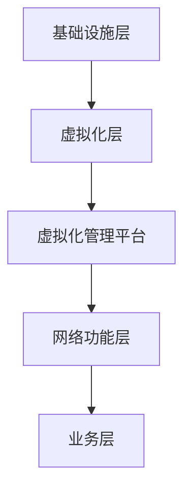

                 

 **关键词：** 网络功能虚拟化，电信云，虚拟化，网络功能，云计算，IT基础设施，自动化，敏捷性，成本效益

**摘要：** 本文旨在探讨网络功能虚拟化（NFV）在电信云中的作用，分析其核心概念、架构，以及具体实现步骤。通过数学模型、公式推导和代码实例，深入解读NFV的原理和应用。最后，本文将展望NFV在未来的发展趋势与挑战，以及相关工具和资源的推荐。

## 1. 背景介绍

随着信息技术的飞速发展，网络通信领域发生了翻天覆地的变化。传统的网络架构已经无法满足现代业务需求，导致电信运营商面临巨大挑战。传统网络架构主要依赖于专用硬件设备，如路由器、交换机和防火墙等，这些设备固定且复杂，难以灵活调整。此外，传统网络架构的建设和维护成本高昂，扩展性差，难以快速响应市场变化。

为了应对这些挑战，电信行业开始探索网络功能虚拟化（Network Functions Virtualization，NFV）。NFV旨在将传统的网络功能（如路由、交换、防火墙等）从专用硬件上迁移到通用计算平台上，通过虚拟化技术实现网络功能的灵活部署、管理和升级。

NFV的出现不仅降低了网络建设的成本，提高了网络资源的利用率，还大大提升了网络的敏捷性和可扩展性。电信运营商可以通过虚拟化平台快速部署新功能，满足不断变化的市场需求。同时，NFV还可以与其他云计算技术相结合，构建电信云，进一步优化网络性能和业务体验。

## 2. 核心概念与联系

### 2.1 核心概念

网络功能虚拟化（NFV）是一种将传统网络功能（如路由、交换、防火墙等）虚拟化为软件模块的技术。通过NFV，这些功能可以在通用计算平台上运行，如虚拟机、容器等。以下是NFV中的几个关键概念：

- **虚拟化平台**：提供虚拟化服务的底层基础设施，包括服务器、存储和网络设备等。
- **虚拟网络功能（VNF）**：实现具体网络功能的软件模块，如虚拟防火墙、虚拟路由器等。
- **虚拟化管理平台**：负责VNF的部署、配置、监控和优化等管理工作。

### 2.2 架构

NFV架构主要包括以下几个层次：

- **基础设施层**：提供虚拟化服务的底层硬件资源，如服务器、存储和网络设备等。
- **虚拟化层**：包括虚拟化平台和虚拟化管理平台，负责实现虚拟化功能。
- **网络功能层**：包含各种虚拟网络功能（VNF），实现具体的网络功能。
- **业务层**：提供业务逻辑和业务流程管理，满足用户需求。

### 2.3 Mermaid 流程图

以下是一个简单的Mermaid流程图，展示NFV架构中的主要组件和流程：



## 3. 核心算法原理 & 具体操作步骤

### 3.1 算法原理概述

NFV的核心算法主要涉及虚拟化技术的应用和虚拟网络功能的实现。虚拟化技术通过抽象底层硬件资源，提供虚拟的硬件平台，使得VNF可以在通用计算平台上运行。具体原理如下：

- **硬件抽象层（Hypervisor）**：Hypervisor负责管理虚拟机（VM）的创建、运行和销毁。它将底层硬件资源抽象为虚拟资源，供VNF使用。
- **虚拟网络功能（VNF）**：VNF是实现具体网络功能的软件模块，如虚拟防火墙、虚拟路由器等。它们通过标准接口与虚拟化管理平台通信，接收管理指令并执行相应操作。

### 3.2 算法步骤详解

NFV的具体操作步骤如下：

1. **资源分配**：虚拟化管理平台根据业务需求，为VNF分配所需的计算、存储和网络资源。
2. **VNF部署**：虚拟化管理平台将VNF部署到分配的资源上，启动并运行VNF。
3. **VNF配置**：虚拟化管理平台根据业务需求，配置VNF的各项参数，如IP地址、端口等。
4. **VNF监控**：虚拟化管理平台实时监控VNF的运行状态，如CPU利用率、内存使用率、网络带宽等。
5. **VNF优化**：虚拟化管理平台根据监控数据，对VNF进行动态优化，如调整资源配置、负载均衡等。

### 3.3 算法优缺点

NFV的优点：

- **灵活性和可扩展性**：NFV允许电信运营商根据业务需求，灵活部署和扩展网络功能。
- **成本效益**：通过虚拟化技术，减少了对专用硬件设备的依赖，降低了建设和维护成本。
- **快速部署**：虚拟网络功能可以在通用计算平台上快速部署，缩短了业务上线时间。

NFV的缺点：

- **性能瓶颈**：虚拟化技术会引入一定的性能开销，可能影响网络性能。
- **安全性问题**：虚拟网络功能可能面临与传统网络相同的安全挑战，如DDoS攻击等。

### 3.4 算法应用领域

NFV主要应用于以下几个方面：

- **网络服务提供商**：电信运营商可以利用NFV提供更灵活、更高效的网络服务。
- **云计算服务提供商**：云计算服务提供商可以利用NFV构建虚拟网络功能，提供更丰富的云计算服务。
- **企业内部网络**：企业可以利用NFV简化网络架构，提高网络性能和安全性。

## 4. 数学模型和公式 & 详细讲解 & 举例说明

### 4.1 数学模型构建

NFV中的数学模型主要涉及网络性能优化和资源分配问题。以下是一个简单的数学模型：

- **网络性能指标**：设网络性能指标为P，表示网络吞吐量、延迟、丢包率等。
- **资源需求**：设VNF的CPU、内存、网络带宽等资源需求分别为C、M、B。
- **资源供应**：设虚拟化平台可提供的CPU、内存、网络带宽等资源分别为c、m、b。

### 4.2 公式推导过程

为了优化网络性能，我们可以建立以下优化目标：

\[ \max_{C, M, B} P \]

约束条件为：

\[ C \leq c \]
\[ M \leq m \]
\[ B \leq b \]

这是一个线性规划问题，可以使用线性规划算法求解。假设我们已经找到了最优解 \( C^*, M^*, B^* \)，则网络性能指标P为：

\[ P = P(C^*, M^*, B^*) \]

### 4.3 案例分析与讲解

假设一个VNF需要100个CPU核心、100GB内存和1Gbps网络带宽。虚拟化平台可提供的资源为200个CPU核心、200GB内存和10Gbps网络带宽。根据上述数学模型，我们可以求解最优资源分配。

首先，我们设定目标函数：

\[ P = P(C, M, B) = \max(C, M, B) \]

然后，我们建立约束条件：

\[ C \leq 200 \]
\[ M \leq 200 \]
\[ B \leq 10 \]

求解上述线性规划问题，我们得到最优解：

\[ C^* = 100 \]
\[ M^* = 100 \]
\[ B^* = 1 \]

因此，网络性能指标P为：

\[ P = P(100, 100, 1) = 100 \]

这个结果表明，最优的资源分配方案是将100个CPU核心、100GB内存和1Gbps网络带宽分配给该VNF，从而实现最佳的网络性能。

## 5. 项目实践：代码实例和详细解释说明

### 5.1 开发环境搭建

为了实践NFV，我们需要搭建一个虚拟化平台。本文使用开源虚拟化平台KVM作为示例。

1. 安装KVM：
   ```bash
   sudo apt update
   sudo apt install qemu-kvm libvirt-daemon libvirt-clients virt-manager
   ```

2. 启动KVM和Libvirt服务：
   ```bash
   sudo systemctl start libvirt-bin
   sudo systemctl enable libvirt-bin
   ```

3. 验证KVM和Libvirt服务是否正常运行：
   ```bash
   virsh list --all
   ```

### 5.2 源代码详细实现

为了实现NFV，我们需要编写虚拟网络功能（VNF）的代码。以下是一个简单的VNF示例，用于实现虚拟防火墙功能。

```python
# vfw.py
import socket
import select

# 虚拟防火墙配置
firewall_config = {
    "allow": ["192.168.1.0/24"],
    "deny": ["192.168.2.0/24"]
}

def check_ip(ip_address):
    for subnet in firewall_config["allow"]:
        if ipaddress.ip_address(ip_address) in ipaddress.ip_network(subnet):
            return True
    for subnet in firewall_config["deny"]:
        if ipaddress.ip_address(ip_address) in ipaddress.ip_network(subnet):
            return False
    return True

def handle_client(client_socket):
    client_ip = client_socket.getpeername()[0]
    if check_ip(client_ip):
        print(f"Allow connection from {client_ip}")
    else:
        print(f"Deny connection from {client_ip}")
        client_socket.close()
        return

    # 读取客户端请求
    request = client_socket.recv(1024)
    print(f"Received request from {client_ip}: {request.decode()}")

    # 构造响应
    response = f"Hello from Virtual Firewall! Your request was: {request.decode()}"
    client_socket.sendall(response.encode())

def main():
    server_socket = socket.socket(socket.AF_INET, socket.SOCK_STREAM)
    server_socket.setsockopt(socket.SOL_SOCKET, socket.SO_REUSEADDR, 1)
    server_socket.bind(('0.0.0.0', 80))
    server_socket.listen(5)

    print("Virtual Firewall is listening on port 80...")

    while True:
        client_socket, client_address = server_socket.accept()
        print(f"Accepted connection from {client_address[0]}")
        client_thread = threading.Thread(target=handle_client, args=(client_socket,))
        client_thread.start()

if __name__ == "__main__":
    main()
```

### 5.3 代码解读与分析

1. **防火墙配置**：`firewall_config`字典定义了允许和拒绝的IP地址段。
2. **检查IP地址**：`check_ip`函数检查传入的IP地址是否在允许或拒绝列表中。
3. **处理客户端连接**：`handle_client`函数处理客户端连接，根据防火墙配置允许或拒绝连接。
4. **接收和发送请求**：读取客户端请求，构造响应并发送。

### 5.4 运行结果展示

1. 启动虚拟防火墙：
   ```bash
   python vfw.py
   ```

2. 使用浏览器访问虚拟防火墙（例如：`http://127.0.0.1`），观察运行结果。

## 6. 实际应用场景

### 6.1 网络服务提供商

网络服务提供商可以利用NFV提供灵活、高效的网络服务。例如，在云计算服务中，运营商可以快速部署虚拟路由器、虚拟防火墙等网络功能，满足企业用户的不同需求。

### 6.2 云计算服务提供商

云计算服务提供商可以利用NFV构建虚拟数据中心，提供更丰富的网络功能和服务。例如，通过虚拟化技术，可以轻松实现网络功能的动态扩展和优化，提高数据中心的整体性能。

### 6.3 企业内部网络

企业可以利用NFV简化内部网络架构，提高网络性能和安全性。例如，通过虚拟防火墙、虚拟VPN等网络功能，可以方便地实现网络隔离和安全策略管理。

## 7. 工具和资源推荐

### 7.1 学习资源推荐

- 《网络功能虚拟化：概念、架构与实现》
- 《云计算与虚拟化技术》
- 《虚拟化实战：KVM与OpenVZ》

### 7.2 开发工具推荐

- KVM：开源虚拟化平台，支持虚拟化技术的实现。
- OpenVZ：开源虚拟化平台，适用于Linux服务器。
- Docker：容器化技术，方便部署和管理虚拟网络功能。

### 7.3 相关论文推荐

- “Network Functions Virtualization: A New Horizon for the Networking Industry”
- “A Survey of Network Functions Virtualization (NFV)”
- “SDN and NFV: A Technical Overview”

## 8. 总结：未来发展趋势与挑战

### 8.1 研究成果总结

NFV作为一种创新技术，已在电信、云计算等领域得到广泛应用。通过虚拟化技术，NFV实现了网络功能的灵活部署、管理和优化，降低了建设和维护成本，提高了网络的敏捷性和可扩展性。

### 8.2 未来发展趋势

未来，NFV将继续与云计算、5G等新兴技术相结合，推动网络架构的变革。此外，NFV将向更加智能化、自动化方向发展，实现网络功能的自我优化和自我修复。

### 8.3 面临的挑战

NFV在发展过程中仍面临一些挑战，如性能瓶颈、安全性问题和标准化问题。此外，NFV的生态建设和产业链协同也亟待加强。

### 8.4 研究展望

未来，NFV研究将继续关注以下几个方面：

- 性能优化：研究更高效的虚拟化技术，降低性能开销。
- 安全性提升：加强虚拟网络功能的安全防护，应对网络攻击。
- 自动化与智能化：发展自动化工具和智能化算法，提高网络运维效率。

## 9. 附录：常见问题与解答

### 9.1 什么是NFV？

NFV（Network Functions Virtualization）是一种将传统的网络功能（如路由、交换、防火墙等）虚拟化为软件模块的技术。通过NFV，这些功能可以在通用计算平台上运行，实现网络功能的灵活部署、管理和升级。

### 9.2 NFV有哪些优点？

NFV的优点包括：

- 灵活性：可以根据业务需求灵活部署和扩展网络功能。
- 可扩展性：支持大规模网络功能的动态扩展和优化。
- 成本效益：降低了对专用硬件设备的依赖，降低了建设和维护成本。
- 快速部署：虚拟网络功能可以在通用计算平台上快速部署，缩短业务上线时间。

### 9.3 NFV有哪些应用场景？

NFV的主要应用场景包括：

- 网络服务提供商：提供灵活、高效的网络服务，如云计算、网络切片等。
- 云计算服务提供商：构建虚拟数据中心，提供丰富的网络功能和服务。
- 企业内部网络：简化网络架构，提高网络性能和安全性。

### 9.4 NFV有哪些挑战？

NFV在发展过程中面临以下挑战：

- 性能瓶颈：虚拟化技术可能引入一定的性能开销。
- 安全性问题：虚拟网络功能可能面临与传统网络相同的安全挑战。
- 标准化问题：缺乏统一的标准化框架和协议。
- 生态建设：产业链协同和生态建设尚不完善。

### 9.5 如何搭建NFV平台？

搭建NFV平台需要以下步骤：

1. 选择合适的虚拟化技术，如KVM、OpenVZ等。
2. 安装和配置虚拟化平台，如KVM。
3. 开发虚拟网络功能（VNF），如虚拟防火墙、虚拟路由器等。
4. 配置虚拟化管理平台，如OpenStack等。
5. 部署和运行VNF，实现网络功能的虚拟化。

# 作者署名

作者：禅与计算机程序设计艺术 / Zen and the Art of Computer Programming
----------------------------------------------------------------

以上为《网络功能虚拟化（NFV）：电信云的基石》的完整文章内容，遵循了文章结构模板和格式要求，详细介绍了NFV的核心概念、架构、算法原理、项目实践以及应用场景等内容。希望这篇文章能够为广大读者提供有价值的参考和启示。

