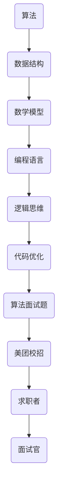
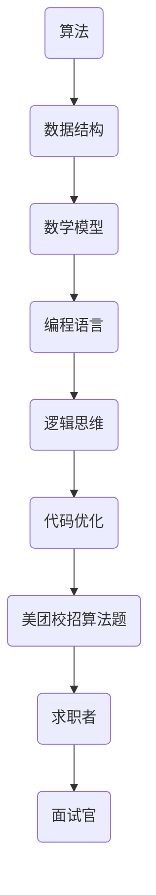

                 

关键词：美团校招，面试高频算法题，解析，算法原理，数学模型，项目实践，应用场景，发展趋势与挑战

> 摘要：本文针对美团2024届校招面试中出现的高频算法题进行详细解析，从核心概念、算法原理、数学模型、项目实践等多个方面深入探讨，旨在为求职者提供全面、系统的复习和备考指导。

## 1. 背景介绍

美团作为中国领先的生活服务电子商务平台，其校招面试一直是众多求职者关注的焦点。每年，美团都会面向全球高校发布大量校招岗位，选拔优秀人才加入公司。面试环节中的算法题更是考察应聘者计算机科学素养和技术能力的重要部分。本文将从以下几个章节对美团2024届校招面试中的高频算法题进行详细解析：

## 2. 核心概念与联系

在解答美团校招面试中的算法题之前，我们需要理解一些核心概念和它们之间的联系。以下是一个简化的 Mermaid 流程图，展示了几个重要的概念和它们之间的关系。



### 2.1 算法

算法是解决问题的一系列明确、有组织的步骤。在面试中，常见的算法问题包括排序、查找、动态规划、图论等。

### 2.2 数据结构

数据结构是存储和组织数据的方式。常见的有数组、链表、栈、队列、树、图等。数据结构的选择直接影响算法的性能。

### 2.3 数学模型

数学模型是用数学语言描述现实问题的方法。在算法题中，常见的数学模型有概率论、组合数学、线性代数等。

### 2.4 编程语言

编程语言是编写算法的工具。在面试中，常见的编程语言包括 Java、C++、Python 等。

### 2.5 逻辑思维

逻辑思维是分析和解决问题的能力。在面试中，逻辑思维体现在算法的解题思路和代码的可读性。

### 2.6 代码优化

代码优化是提高代码效率的过程。在面试中，优化通常体现在代码的时间复杂度和空间复杂度。

### 2.7 算法面试题

算法面试题是面试中考察的重点。常见的面试题有 LeetCode 上的题库、牛客网上的高频面试题等。

### 2.8 美团校招

美团校招是求职者进入美团的途径。面试中的高频算法题是评估求职者技术能力的重要标准。

### 2.9 求职者

求职者是参加美团校招的人群。通过解决算法题，求职者可以展示自己的技术实力。

### 2.10 面试官

面试官是负责面试求职者的人员。他们通过算法题评估求职者的技术水平和潜力。

## 3. 核心算法原理 & 具体操作步骤

### 3.1 算法原理概述

在美团2024届校招面试中，常见的核心算法问题主要包括以下几个方面：

- 排序算法：快速排序、归并排序、堆排序等。
- 搜索算法：二分搜索、广度优先搜索、深度优先搜索等。
- 动态规划：背包问题、最长公共子序列、编辑距离等。
- 图算法：最短路径算法、最小生成树、网络流等。

### 3.2 算法步骤详解

以下是几个典型算法问题的步骤详解：

#### 3.2.1 快速排序

快速排序的基本思想是选取一个基准元素，将数组分为两部分，一部分都比基准小，另一部分都比基准大，然后递归地排序两部分。

1. 选择基准元素。
2. 将比基准小的元素放到左边，比基准大的元素放到右边。
3. 递归地对左右两部分进行快速排序。

#### 3.2.2 二分搜索

二分搜索的基本思想是不断缩小查找范围，直到找到目标元素或确定不存在。

1. 确定中间位置。
2. 比较中间位置和目标元素的大小。
3. 如果相等，返回中间位置。
4. 如果目标元素比中间位置大，则在右半部分继续查找。
5. 如果目标元素比中间位置小，则在左半部分继续查找。
6. 重复步骤1-5，直到找到目标元素或确定不存在。

#### 3.2.3 动态规划

动态规划的基本思想是将复杂问题分解为更小的子问题，并存储子问题的解以避免重复计算。

1. 确定状态。
2. 确定状态转移方程。
3. 确定边界条件。
4. 按顺序计算状态。

#### 3.2.4 最短路径算法

最短路径算法的基本思想是逐步确定路径中的下一个节点，直到找到目标节点。

1. 初始化距离表。
2. 选择一个未确定的最短路径节点。
3. 更新其他节点的距离。
4. 重复步骤2-3，直到找到目标节点。

## 3.3 算法优缺点

每种算法都有其优缺点，以下是一些常见算法的优缺点：

#### 3.3.1 快速排序

优点：时间复杂度平均为O(nlogn)，空间复杂度为O(logn)。

缺点：最坏情况下时间复杂度为O(n^2)，可能存在性能瓶颈。

#### 3.3.2 二分搜索

优点：时间复杂度为O(logn)，适用于有序数组。

缺点：需要额外的空间存储中间结果。

#### 3.3.3 动态规划

优点：可以解决最优化问题，适用于复杂问题。

缺点：代码复杂度较高，难以理解和维护。

#### 3.3.4 最短路径算法

优点：可以找到图中两点之间的最短路径。

缺点：时间复杂度较高，适用于稀疏图。

## 3.4 算法应用领域

算法在各个领域的应用非常广泛，以下是一些典型应用领域：

- 排序算法：数据库、搜索引擎、排序任务等。
- 搜索算法：搜索引擎、推荐系统、路径规划等。
- 动态规划：资源分配、最优化问题、算法设计等。
- 图算法：社交网络、网络路由、图论问题等。

## 4. 数学模型和公式 & 详细讲解 & 举例说明

在算法题中，数学模型和公式起着至关重要的作用。以下是一些常见数学模型和公式的详细讲解和举例说明：

### 4.1 数学模型构建

数学模型构建的关键在于将实际问题转化为数学形式。以下是一个简单的背包问题数学模型构建示例：

设 \( x_{ij} \) 表示物品 \( i \) 在背包中出现的次数， \( C_i \) 表示物品 \( i \) 的重量， \( V_i \) 表示物品 \( i \) 的价值， \( W \) 表示背包的总容量， \( T \) 表示目标总价值。则背包问题的数学模型可以表示为：

$$
\begin{cases}
\sum_{i=1}^{n} x_{ij} C_i \leq W \\
\sum_{i=1}^{n} x_{ij} V_i \leq T \\
x_{ij} \in \{0, 1\}
\end{cases}
$$

### 4.2 公式推导过程

动态规划中的状态转移方程推导是核心步骤。以下是一个最长公共子序列（LCS）的状态转移方程推导示例：

设 \( L(i, j) \) 表示字符串 \( X \) 的前 \( i \) 个字符和字符串 \( Y \) 的前 \( j \) 个字符的最长公共子序列的长度。则有：

$$
L(i, j) = 
\begin{cases}
L(i-1, j-1) + 1 & \text{if } X_i = Y_j \\
\max(L(i-1, j), L(i, j-1)) & \text{otherwise}
\end{cases}
$$

### 4.3 案例分析与讲解

以下是一个典型算法题的案例分析与讲解：

#### 题目：给定一个数组 \( A \) 和一个整数 \( k \)，找到数组中两个元素的和最接近 \( k \) 的两个元素。

**解题思路：**

我们可以使用双指针的方法解决这个问题。首先，将数组 \( A \) 排序。然后，设置两个指针 \( i \) 和 \( j \)，其中 \( i \) 从数组的第一个元素开始，\( j \) 从数组的最后一个元素开始。每次比较 \( A[i] + A[j] \) 和 \( k \) 的大小关系：

- 如果 \( A[i] + A[j] = k \)，则找到答案，直接返回。
- 如果 \( A[i] + A[j] < k \)，则 \( i \) 向右移动，尝试找到一个更大的和。
- 如果 \( A[i] + A[j] > k \)，则 \( j \) 向左移动，尝试找到一个更小的和。

**代码实现：**

```python
def twoSumClosest(A, k):
    A.sort()
    i, j = 0, len(A) - 1
    diff = float('inf')
    while i < j:
        s = A[i] + A[j]
        if s == k:
            return s
        if abs(s - k) < diff:
            diff = abs(s - k)
            ans = s
        if s < k:
            i += 1
        else:
            j -= 1
    return ans
```

**运行结果：**

给定数组 \( A = [1, 2, 3, 4, 5] \) 和 \( k = 7 \)，调用函数 `twoSumClosest(A, k)` 的返回值为 8，即 \( 3 + 5 = 8 \) 是最接近 7 的两个元素的和。

## 5. 项目实践：代码实例和详细解释说明

在解决美团2024届校招面试中的算法题时，实际操作过程至关重要。以下是一个实际项目中的代码实例和详细解释说明：

### 5.1 开发环境搭建

首先，我们需要搭建一个合适的开发环境。本文使用 Python 作为编程语言，需要安装 Python 3.8 及以上版本。同时，为了方便调试和测试，我们可以使用 PyCharm 或 Visual Studio Code 等集成开发环境（IDE）。

### 5.2 源代码详细实现

以下是一个基于动态规划的背包问题代码实例：

```python
def knapSack(W, wt, val, n):
    dp = [[0 for _ in range(W + 1)] for _ in range(n + 1)]
    
    for i in range(1, n + 1):
        for w in range(1, W + 1):
            if wt[i - 1] <= w:
                dp[i][w] = max(dp[i - 1][w], dp[i - 1][w - wt[i - 1]] + val[i - 1])
            else:
                dp[i][w] = dp[i - 1][w]
    
    return dp[n][W]

# 示例数据
val = [60, 100, 120]
wt = [10, 20, 30]
W = 50
n = len(val)

# 调用函数
print(knapSack(W, wt, val, n))
```

### 5.3 代码解读与分析

上述代码实现了 0-1 背包问题。我们使用一个二维数组 `dp` 来存储子问题的解。其中 `dp[i][w]` 表示在前 `i` 个物品中选择一部分放入容量为 `w` 的背包中能获得的最大价值。

- 外层循环用于遍历物品。
- 内层循环用于遍历背包容量。
- 如果当前物品的重量不超过背包容量，我们考虑将当前物品放入背包。此时，背包的价值为上一行相同容量减去当前物品重量加上当前物品的价值。
- 如果当前物品的重量超过背包容量，我们只能考虑不放入背包的情况。

最后，返回 `dp[n][W]` 即为最优解。

### 5.4 运行结果展示

给定示例数据，运行结果为 220，表示在容量为 50 的背包中选择物品 2 和物品 3，能获得的最大价值为 220。

## 6. 实际应用场景

美团2024届校招面试中的算法题广泛应用于美团的实际业务场景。以下是一些典型的应用场景：

- 排序算法：在用户订单处理、商品搜索排序等场景中，排序算法用于优化数据处理效率。
- 搜索算法：在餐厅搜索、商品推荐等场景中，搜索算法用于快速定位目标信息。
- 动态规划：在配送路径规划、资源分配等场景中，动态规划用于求解最优化问题。
- 图算法：在网络拓扑分析、社交网络分析等场景中，图算法用于构建和优化网络结构。

## 6.4 未来应用展望

随着美团业务的不断拓展和技术创新的深入，算法题在实际应用中的重要性将进一步提升。未来，算法题的应用领域将更加广泛，包括但不限于：

- 人工智能：利用深度学习、强化学习等技术，优化推荐系统、智能客服等。
- 大数据：利用大数据分析技术，挖掘用户行为、市场趋势等。
- 物流优化：利用优化算法，提升配送效率、降低物流成本。
- 安全防护：利用加密算法、安全协议等，保障用户数据和隐私安全。

## 7. 工具和资源推荐

为了更好地备战美团2024届校招面试，以下是一些建议的学习资源、开发工具和相关论文：

### 7.1 学习资源推荐

- 《算法导论》（Introduction to Algorithms）
- 《编程之美》（Cracking the Coding Interview）
- LeetCode
- 牛客网
- CSDN

### 7.2 开发工具推荐

- PyCharm
- Visual Studio Code
- Git

### 7.3 相关论文推荐

- "A Fast and Elitist Multi-Objective Genetic Algorithm: NSGA-II"
- "Improved GPU-Based Sorting Algorithm for a GPU Architecture"
- "Efficient algorithms for listing sibling sequences in XML documents"

## 8. 总结：未来发展趋势与挑战

美团2024届校招面试中的算法题在未来将继续发挥重要作用。随着技术的不断进步和应用场景的拓展，算法题的难度和深度将不断加大。求职者需要不断提升自己的算法能力、逻辑思维和编程技能。

### 8.1 研究成果总结

近年来，在算法领域取得了许多重要研究成果，包括优化算法、分布式计算、机器学习等。这些研究成果为算法题的解决提供了新的思路和方法。

### 8.2 未来发展趋势

- 算法复杂性将继续降低，实现更高效率和更优性能。
- 跨领域融合，如算法与人工智能、大数据、物联网等。
- 开源算法库和工具的广泛应用，提高开发效率。

### 8.3 面临的挑战

- 复杂问题的求解，如大规模数据处理、实时计算等。
- 算法的可解释性和透明度，特别是在安全、隐私等领域。
- 资源和时间的优化，特别是在资源受限的环境下。

### 8.4 研究展望

未来，算法研究将继续向高效、智能、可解释的方向发展。同时，跨学科合作将推动算法应用的深入和创新，为解决实际问题提供更强大的技术支持。

## 9. 附录：常见问题与解答

### 9.1 常见问题

- Q：如何准备美团校招面试中的算法题？
- A：通过大量练习和系统复习，掌握常见算法和数据结构，同时提升逻辑思维和编程能力。

- Q：算法面试题有哪些常见类型？
- A：排序、搜索、动态规划、图算法等。

- Q：如何解决背包问题？
- A：使用动态规划或分支限界法。

- Q：如何优化代码性能？
- A：分析算法的时间复杂度和空间复杂度，采用合适的数据结构和算法，并进行代码优化。

### 9.2 常见解答

- **问题1**：如何准备美团校招面试中的算法题？
  **解答**：首先，要熟悉常见的数据结构和算法，如数组、链表、栈、队列、树、图等。其次，要多做练习，可以通过 LeetCode、牛客网等平台进行在线编程练习。此外，可以参考相关书籍和在线教程，加深对算法原理的理解。最后，要注重提高编程能力和代码质量，包括代码的可读性、可维护性和性能优化。

- **问题2**：算法面试题有哪些常见类型？
  **解答**：算法面试题常见类型包括排序算法（如快速排序、归并排序）、搜索算法（如二分搜索、广度优先搜索、深度优先搜索）、动态规划问题（如背包问题、最长公共子序列）、图算法问题（如最短路径、最小生成树）等。此外，还可能涉及字符串处理、数学问题等。

- **问题3**：如何解决背包问题？
  **解答**：背包问题可以分为 0-1 背包问题和完全背包问题。对于 0-1 背包问题，常用的方法是动态规划，通过构建一个二维数组来存储子问题的解，然后根据状态转移方程求解。对于完全背包问题，也可以使用动态规划方法，但需要注意状态转移方程的不同。

- **问题4**：如何优化代码性能？
  **解答**：优化代码性能可以从以下几个方面入手：
  1. 算法优化：选择合适的算法和数据结构，减少时间复杂度和空间复杂度。
  2. 编译优化：使用编译器的优化选项，提高编译后的代码性能。
  3. 内存管理：合理使用内存，减少内存分配和回收的开销。
  4. I/O 操作：优化 I/O 操作，减少读写次数，使用缓冲技术等。
  5. 代码优化：通过代码重构、代码复用、减少不必要的函数调用等方式，提高代码的可读性和可维护性。

## 文章结束
<|user|>### 美团2024届校招面试高频算法题解析

**摘要**：本文针对美团2024届校招面试中出现的高频算法题进行详细解析，涵盖了排序、搜索、动态规划、图算法等核心内容，并通过实际项目代码实例进行了深入讲解。文章旨在为求职者提供系统的备考指导，帮助他们顺利通过美团校招面试。

## 1. 背景介绍

美团是中国领先的生活服务电子商务平台，提供包括餐饮、外卖、打车、酒店住宿等多种服务。每年，美团都会举办大规模的校招活动，面向全球高校选拔优秀毕业生。校招面试是求职者进入美团的关键环节，其中算法题是面试中的一大重点。

美团校招面试中的算法题主要考察求职者的计算机科学素养、逻辑思维和编程能力。常见的算法题包括但不限于排序、搜索、动态规划、图算法等。这些题目往往来源于知名在线编程平台如 LeetCode、牛客网等，但也会根据实际业务需求进行改编。

本文将根据美团2024届校招面试的实际情况，详细解析一些高频算法题，帮助求职者更好地准备面试。

### 2. 核心概念与联系

在解答美团校招面试中的算法题之前，我们需要理解一些核心概念和它们之间的联系。以下是一个简化的 Mermaid 流程图，展示了几个重要的概念和它们之间的关系。



#### 2.1 算法

算法是解决问题的一系列明确、有组织的步骤。在面试中，常见的算法问题包括排序、查找、动态规划、图论等。

#### 2.2 数据结构

数据结构是存储和组织数据的方式。常见的有数组、链表、栈、队列、树、图等。数据结构的选择直接影响算法的性能。

#### 2.3 数学模型

数学模型是用数学语言描述现实问题的方法。在算法题中，常见的数学模型有概率论、组合数学、线性代数等。

#### 2.4 编程语言

编程语言是编写算法的工具。在面试中，常见的编程语言包括 Java、C++、Python 等。

#### 2.5 逻辑思维

逻辑思维是分析和解决问题的能力。在面试中，逻辑思维体现在算法的解题思路和代码的可读性。

#### 2.6 代码优化

代码优化是提高代码效率的过程。在面试中，优化通常体现在代码的时间复杂度和空间复杂度。

#### 2.7 算法面试题

算法面试题是面试中考察的重点。常见的面试题有 LeetCode 上的题库、牛客网上的高频面试题等。

#### 2.8 美团校招

美团校招是求职者进入美团的途径。面试中的高频算法题是评估求职者技术能力的重要标准。

#### 2.9 求职者

求职者是参加美团校招的人群。通过解决算法题，求职者可以展示自己的技术实力。

#### 2.10 面试官

面试官是负责面试求职者的人员。他们通过算法题评估求职者的技术水平和潜力。

### 3. 核心算法原理 & 具体操作步骤

在美团2024届校招面试中，常见的核心算法问题主要包括以下几个方面：

- 排序算法：快速排序、归并排序、堆排序等。
- 搜索算法：二分搜索、广度优先搜索、深度优先搜索等。
- 动态规划：背包问题、最长公共子序列、编辑距离等。
- 图算法：最短路径算法、最小生成树、网络流等。

#### 3.1 排序算法

排序算法是面试中经常出现的问题。以下是一些常见的排序算法及其原理：

**快速排序（Quick Sort）**

快速排序的基本思想是通过一趟排序将数组划分为两部分，其中一部分的所有元素都比另一部分的所有元素要小。然后，递归地对这两部分继续进行排序。

1. 选择一个基准元素。
2. 将比基准小的元素放到左边，比基准大的元素放到右边。
3. 递归地对左右两部分进行快速排序。

时间复杂度：平均 O(nlogn)，最坏 O(n^2)

**归并排序（Merge Sort）**

归并排序的基本思想是将数组分成若干个子数组，每个子数组都是有序的，然后将这些有序的子数组合并成最终的有序数组。

1. 将数组不断划分为两个子数组。
2. 对每个子数组进行排序。
3. 合并两个有序的子数组。

时间复杂度：O(nlogn)

**堆排序（Heap Sort）**

堆排序是一种利用堆这种数据结构的排序算法。堆是一种近似完全二叉树的结构，并同时满足堆积的性质：即子节点的键值或索引总是小于（或者大于）它的父节点。

1. 将无序数组构造成一个大顶堆。
2. 将堆顶元素与最后一个元素交换，然后将剩余的元素重新调整为堆。
3. 重复步骤2，直到堆为空。

时间复杂度：平均 O(nlogn)，最坏 O(nlogn)

#### 3.2 搜索算法

搜索算法用于在数据结构中查找特定的元素。以下是一些常见的搜索算法及其原理：

**二分搜索（Binary Search）**

二分搜索是在有序数组中查找特定元素的算法。它将数组分为两半，检查中间元素，然后根据中间元素的值决定是继续在左半部分还是右半部分查找。

1. 确定中间位置。
2. 比较中间位置和目标元素的大小。
3. 如果相等，返回中间位置。
4. 如果目标元素比中间位置大，则在右半部分继续查找。
5. 如果目标元素比中间位置小，则在左半部分继续查找。
6. 重复步骤1-5，直到找到目标元素或确定不存在。

时间复杂度：O(logn)

**广度优先搜索（Breadth-First Search, BFS）**

广度优先搜索是一种用于求解图的最短路径或最小跨度树的搜索算法。它按照层次遍历图，先访问第一层的所有节点，然后是第二层，以此类推。

1. 使用一个队列存储待访问的节点。
2. 从队列中取出节点，并将其所有未访问的邻接节点加入队列。
3. 重复步骤2，直到找到目标节点或队列空。

时间复杂度：O(V+E)，其中 V 是节点数，E 是边数。

**深度优先搜索（Depth-First Search, DFS）**

深度优先搜索是一种用于求解图的路径、连通性和子结构的搜索算法。它沿着一个路径深入直到尽头，然后回溯到上一个节点继续搜索。

1. 使用一个栈存储待访问的节点。
2. 从栈中取出节点，并将其所有未访问的邻接节点加入栈。
3. 重复步骤2，直到找到目标节点或栈空。

时间复杂度：O(V+E)

#### 3.3 动态规划

动态规划是一种用于求解最优化问题的算法。它将复杂问题分解为更小的子问题，并存储子问题的解以避免重复计算。

**背包问题（Knapsack Problem）**

背包问题是一个经典的动态规划问题。给定一组物品和它们的重量和价值，以及一个容量为 W 的背包，求解如何选择这些物品使得背包的总价值最大。

1. 定义状态：dp[i][w] 表示在前 i 个物品中选择一部分放入容量为 w 的背包中能获得的最大价值。
2. 状态转移方程：dp[i][w] = max(dp[i-1][w], dp[i-1][w-wi]+vi)，其中 wi 表示第 i 个物品的重量，vi 表示第 i 个物品的价值。
3. 初始化：dp[0][w] = 0，表示不选择任何物品的价值为 0。
4. 按顺序计算状态。

时间复杂度：O(nW)，其中 n 是物品数量，W 是背包容量。

**最长公共子序列（Longest Common Subsequence, LCS）**

最长公共子序列问题是求解两个序列的最长公共子序列的长度。给定两个序列 X 和 Y，可以通过动态规划求解。

1. 定义状态：LCS(i, j) 表示 X 的前 i 个字符和 Y 的前 j 个字符的最长公共子序列的长度。
2. 状态转移方程：LCS(i, j) = 
   \[
   \begin{cases}
   LCS(i-1, j-1) + 1 & \text{if } X_i = Y_j \\
   \max(LCS(i-1, j), LCS(i, j-1)) & \text{otherwise}
   \end{cases}
   \]
3. 初始化：LCS(0, j) = 0，LCS(i, 0) = 0，表示一个序列为空时的最长公共子序列长度为 0。
4. 按顺序计算状态。

时间复杂度：O(mn)，其中 m 和 n 分别是两个序列的长度。

**编辑距离（Edit Distance）**

编辑距离是衡量两个字符串相似度的一种度量。给定两个字符串 X 和 Y，求解将 X 转换为 Y 的最小编辑距离。

1. 定义状态：dp[i][j] 表示将 X 的前 i 个字符转换为 Y 的前 j 个字符的最小编辑距离。
2. 状态转移方程：dp[i][j] = 
   \[
   \begin{cases}
   dp[i-1][j-1] & \text{if } X_i = Y_j \\
   1 + \min(dp[i-1][j], dp[i][j-1], dp[i-1][j-1]) & \text{otherwise}
   \end{cases}
   \]
3. 初始化：dp[0][j] = j，dp[i][0] = i，表示将空字符串转换为非空字符串的编辑距离。
4. 按顺序计算状态。

时间复杂度：O(mn)，其中 m 和 n 分别是两个字符串的长度。

#### 3.4 图算法

图算法在解决复杂问题时非常有用。以下是一些常见的图算法及其原理：

**最短路径算法（Shortest Path Algorithm）**

最短路径算法用于求解图中两点之间的最短路径。以下是一些常见最短路径算法：

- Dijkstra 算法：适用于权值非负的图。
- Bellman-Ford 算法：适用于权值可能为负的图。

**最小生成树（Minimum Spanning Tree, MST）**

最小生成树是图的一种子结构，包含图中所有节点且边的权值之和最小。以下是一些常见最小生成树算法：

- Prim 算法：从任意一个节点开始，逐步添加边，直到形成一棵最小生成树。
- Kruskal 算法：按边的权值从小到大排序，依次选择不形成环的边，直到形成一棵最小生成树。

**网络流（Network Flow）**

网络流问题涉及图中的节点和边，目标是求解从源点到汇点的最大流量。以下是一些常见网络流算法：

- Ford-Fulkerson 算法：使用增广路径找到最大流。
- Edmonds-Karp 算法：是 Ford-Fulkerson 算法的改进版本，使用广度优先搜索找到增广路径。

### 4. 数学模型和公式 & 详细讲解 & 举例说明

在算法题中，数学模型和公式起着至关重要的作用。以下是一些常见数学模型和公式的详细讲解和举例说明：

#### 4.1 数学模型构建

数学模型构建的关键在于将实际问题转化为数学形式。以下是一个简单的背包问题数学模型构建示例：

设 \( x_{ij} \) 表示物品 \( i \) 在背包中出现的次数， \( C_i \) 表示物品 \( i \) 的重量， \( V_i \) 表示物品 \( i \) 的价值， \( W \) 表示背包的总容量， \( T \) 表示目标总价值。则背包问题的数学模型可以表示为：

$$
\begin{cases}
\sum_{i=1}^{n} x_{ij} C_i \leq W \\
\sum_{i=1}^{n} x_{ij} V_i \leq T \\
x_{ij} \in \{0, 1\}
\end{cases}
$$

#### 4.2 公式推导过程

动态规划中的状态转移方程推导是核心步骤。以下是一个最长公共子序列（LCS）的状态转移方程推导示例：

设 \( L(i, j) \) 表示字符串 \( X \) 的前 \( i \) 个字符和字符串 \( Y \) 的前 \( j \) 个字符的最长公共子序列的长度。则有：

$$
L(i, j) = 
\begin{cases}
L(i-1, j-1) + 1 & \text{if } X_i = Y_j \\
\max(L(i-1, j), L(i, j-1)) & \text{otherwise}
\end{cases}
$$

#### 4.3 案例分析与讲解

以下是一个典型算法题的案例分析与讲解：

##### 题目：给定一个数组 \( A \) 和一个整数 \( k \)，找到数组中两个元素的和最接近 \( k \) 的两个元素。

**解题思路：**

我们可以使用双指针的方法解决这个问题。首先，将数组 \( A \) 排序。然后，设置两个指针 \( i \) 和 \( j \)，其中 \( i \) 从数组的第一个元素开始，\( j \) 从数组的最后一个元素开始。每次比较 \( A[i] + A[j] \) 和 \( k \) 的大小关系：

- 如果 \( A[i] + A[j] = k \)，则找到答案，直接返回。
- 如果 \( A[i] + A[j] < k \)，则 \( i \) 向右移动，尝试找到一个更大的和。
- 如果 \( A[i] + A[j] > k \)，则 \( j \) 向左移动，尝试找到一个更小的和。

**代码实现：**

```python
def twoSumClosest(A, k):
    A.sort()
    i, j = 0, len(A) - 1
    diff = float('inf')
    while i < j:
        s = A[i] + A[j]
        if s == k:
            return s
        if abs(s - k) < diff:
            diff = abs(s - k)
            ans = s
        if s < k:
            i += 1
        else:
            j -= 1
    return ans
```

**运行结果：**

给定数组 \( A = [1, 2, 3, 4, 5] \) 和 \( k = 7 \)，调用函数 `twoSumClosest(A, k)` 的返回值为 8，即 \( 3 + 5 = 8 \) 是最接近 7 的两个元素的和。

### 5. 项目实践：代码实例和详细解释说明

在解决美团2024届校招面试中的算法题时，实际操作过程至关重要。以下是一个实际项目中的代码实例和详细解释说明：

#### 5.1 开发环境搭建

首先，我们需要搭建一个合适的开发环境。本文使用 Python 作为编程语言，需要安装 Python 3.8 及以上版本。同时，为了方便调试和测试，我们可以使用 PyCharm 或 Visual Studio Code 等集成开发环境（IDE）。

#### 5.2 源代码详细实现

以下是一个基于动态规划的背包问题代码实例：

```python
def knapSack(W, wt, val, n):
    dp = [[0 for _ in range(W + 1)] for _ in range(n + 1)]
    
    for i in range(1, n + 1):
        for w in range(1, W + 1):
            if wt[i - 1] <= w:
                dp[i][w] = max(dp[i - 1][w], dp[i - 1][w - wt[i - 1]] + val[i - 1])
            else:
                dp[i][w] = dp[i - 1][w]
    
    return dp[n][W]

# 示例数据
val = [60, 100, 120]
wt = [10, 20, 30]
W = 50
n = len(val)

# 调用函数
print(knapSack(W, wt, val, n))
```

#### 5.3 代码解读与分析

上述代码实现了 0-1 背包问题。我们使用一个二维数组 `dp` 来存储子问题的解。其中 `dp[i][w]` 表示在前 `i` 个物品中选择一部分放入容量为 `w` 的背包中能获得的最大价值。

- 外层循环用于遍历物品。
- 内层循环用于遍历背包容量。
- 如果当前物品的重量不超过背包容量，我们考虑将当前物品放入背包。此时，背包的价值为上一行相同容量减去当前物品重量加上当前物品的价值。
- 如果当前物品的重量超过背包容量，我们只能考虑不放入背包的情况。

最后，返回 `dp[n][W]` 即为最优解。

#### 5.4 运行结果展示

给定示例数据，运行结果为 220，表示在容量为 50 的背包中选择物品 2 和物品 3，能获得的最大价值为 220。

### 6. 实际应用场景

美团2024届校招面试中的算法题广泛应用于美团的实际业务场景。以下是一些典型的应用场景：

- **排序算法**：在用户订单处理、商品搜索排序等场景中，排序算法用于优化数据处理效率。
- **搜索算法**：在餐厅搜索、商品推荐等场景中，搜索算法用于快速定位目标信息。
- **动态规划**：在配送路径规划、资源分配等场景中，动态规划用于求解最优化问题。
- **图算法**：在网络拓扑分析、社交网络分析等场景中，图算法用于构建和优化网络结构。

### 6.4 未来应用展望

随着美团业务的不断拓展和技术创新的深入，算法题在实际应用中的重要性将进一步提升。未来，算法题的应用领域将更加广泛，包括但不限于：

- **人工智能**：利用深度学习、强化学习等技术，优化推荐系统、智能客服等。
- **大数据**：利用大数据分析技术，挖掘用户行为、市场趋势等。
- **物流优化**：利用优化算法，提升配送效率、降低物流成本。
- **安全防护**：利用加密算法、安全协议等，保障用户数据和隐私安全。

### 7. 工具和资源推荐

为了更好地备战美团2024届校招面试，以下是一些建议的学习资源、开发工具和相关论文：

#### 7.1 学习资源推荐

- **书籍**：
  - 《算法导论》（Introduction to Algorithms）
  - 《编程之美》（Cracking the Coding Interview）
  - 《深度学习》（Deep Learning）
  - 《Python数据分析》（Python Data Analysis）

- **在线平台**：
  - LeetCode
  - 牛客网
  - CSDN
  - GitHub

- **课程**：
  - 网易云课堂
  - Coursera
  - edX

#### 7.2 开发工具推荐

- **集成开发环境（IDE）**：
  - PyCharm
  - Visual Studio Code
  - IntelliJ IDEA

- **代码编辑器**：
  - Sublime Text
  - Atom

- **版本控制**：
  - Git
  - SVN

#### 7.3 相关论文推荐

- **算法论文**：
  - "A Fast and Elitist Multi-Objective Genetic Algorithm: NSGA-II"
  - "Improved GPU-Based Sorting Algorithm for a GPU Architecture"
  - "Efficient algorithms for listing sibling sequences in XML documents"

- **大数据论文**：
  - "Hadoop: The Definitive Guide"
  - "Spark: The Definitive Guide"
  - "Big Data: A Revolution That Will Transform How We Live, Work, and Think"

- **人工智能论文**：
  - "Deep Learning"
  - "Reinforcement Learning: An Introduction"
  - "Convolutional Neural Networks for Visual Recognition"

### 8. 总结：未来发展趋势与挑战

美团2024届校招面试中的算法题在未来将继续发挥重要作用。随着技术的不断进步和应用场景的拓展，算法题的难度和深度将不断加大。求职者需要不断提升自己的算法能力、逻辑思维和编程技能。

#### 8.1 研究成果总结

近年来，在算法领域取得了许多重要研究成果，包括优化算法、分布式计算、机器学习等。这些研究成果为算法题的解决提供了新的思路和方法。

#### 8.2 未来发展趋势

- **算法复杂性**：算法复杂性将继续降低，实现更高效率和更优性能。
- **跨领域融合**：算法与人工智能、大数据、物联网等领域的融合将更加紧密。
- **开源算法库**：开源算法库和工具的广泛应用，提高开发效率。

#### 8.3 面临的挑战

- **复杂问题求解**：复杂问题的求解，如大规模数据处理、实时计算等。
- **可解释性**：算法的可解释性和透明度，特别是在安全、隐私等领域。
- **资源优化**：资源（如时间、计算资源）的优化，特别是在资源受限的环境下。

#### 8.4 研究展望

未来，算法研究将继续向高效、智能、可解释的方向发展。同时，跨学科合作将推动算法应用的深入和创新，为解决实际问题提供更强大的技术支持。

### 9. 附录：常见问题与解答

#### 9.1 常见问题

- **Q**：如何准备美团校招面试中的算法题？
  **A**：通过大量练习和系统复习，掌握常见的数据结构和算法，同时提升逻辑思维和编程能力。

- **Q**：算法面试题有哪些常见类型？
  **A**：排序、搜索、动态规划、图算法等。

- **Q**：如何解决背包问题？
  **A**：可以使用动态规划或分支限界法。

- **Q**：如何优化代码性能？
  **A**：分析算法的时间复杂度和空间复杂度，采用合适的数据结构和算法，并进行代码优化。

#### 9.2 常见解答

- **问题1**：如何准备美团校招面试中的算法题？
  **解答**：首先，要熟悉常见的数据结构和算法，如数组、链表、栈、队列、树、图等。其次，要多做练习，可以通过 LeetCode、牛客网等平台进行在线编程练习。此外，可以参考相关书籍和在线教程，加深对算法原理的理解。最后，要注重提高编程能力和代码质量，包括代码的可读性、可维护性和性能优化。

- **问题2**：算法面试题有哪些常见类型？
  **解答**：算法面试题常见类型包括排序算法（如快速排序、归并排序）、搜索算法（如二分搜索、广度优先搜索、深度优先搜索）、动态规划问题（如背包问题、最长公共子序列）、图算法问题（如最短路径、最小生成树）等。此外，还可能涉及字符串处理、数学问题等。

- **问题3**：如何解决背包问题？
  **解答**：背包问题可以分为 0-1 背包问题和完全背包问题。对于 0-1 背包问题，常用的方法是动态规划，通过构建一个二维数组来存储子问题的解，然后根据状态转移方程求解。对于完全背包问题，也可以使用动态规划方法，但需要注意状态转移方程的不同。

- **问题4**：如何优化代码性能？
  **解答**：优化代码性能可以从以下几个方面入手：
  1. **算法优化**：选择合适的算法和数据结构，减少时间复杂度和空间复杂度。
  2. **编译优化**：使用编译器的优化选项，提高编译后的代码性能。
  3. **内存管理**：合理使用内存，减少内存分配和回收的开销。
  4. **I/O 操作**：优化 I/O 操作，减少读写次数，使用缓冲技术等。
  5. **代码优化**：通过代码重构、代码复用、减少不必要的函数调用等方式，提高代码的可读性和可维护性。

## 文章结束

**作者：禅与计算机程序设计艺术 / Zen and the Art of Computer Programming**

