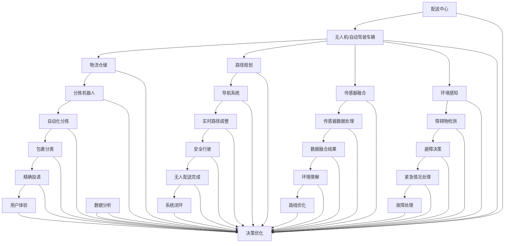

                 

在当前科技飞速发展的时代，无人配送技术作为人工智能领域的一个重要分支，正逐渐成为物流行业的革新力量。美团，作为国内领先的互联网科技公司，对于无人配送技术的研发和应用一直处于行业领先地位。2024年美团无人配送校招算法面试题的解析，不仅有助于理解无人配送技术的核心算法原理，还能为有意向加入这一领域的工程师提供宝贵的指导。本文将围绕美团2024无人配送校招算法面试题进行详细解析，旨在帮助读者深入了解这一领域的专业知识和技能要求。

## 关键词
- 无人配送
- 算法面试
- 美团
- 校招
- 人工智能

## 文章摘要
本文将详细介绍美团2024年无人配送校招算法面试题的解析，包括背景介绍、核心概念与联系、核心算法原理、数学模型与公式、项目实践以及未来应用展望。通过本文，读者可以全面了解无人配送技术的基本概念和应用，掌握相关算法原理和实现方法，为未来在无人配送领域的职业发展打下坚实基础。

## 1. 背景介绍

### 1.1 无人配送技术的发展现状

无人配送技术是指利用无人机、自动驾驶车辆等无人载具，实现从配送中心到最终用户之间的物品运输。近年来，随着人工智能、物联网和自动驾驶技术的不断进步，无人配送技术在全球范围内得到了迅速发展。特别是在物流行业，无人配送技术的应用不仅提高了运输效率，还降低了人力成本，成为物流行业的一大创新方向。

### 1.2 美团在无人配送领域的布局

美团作为国内领先的互联网科技公司，一直在无人配送领域进行深度布局。自2016年开始，美团便着手研发无人配送技术，并在多个城市开展无人配送试点。通过不断的技术创新和试点应用，美团的无人配送技术在稳定性、可靠性、安全性等方面取得了显著成果。

### 1.3 无人配送校招算法面试题的意义

美团2024无人配送校招算法面试题的解析，对于有意向加入无人配送领域的应届毕业生具有重要意义。首先，通过这些面试题，读者可以了解无人配送技术的基本概念和应用场景；其次，这些面试题涉及的核心算法原理和实现方法，有助于读者掌握无人配送技术的核心技能；最后，通过解析这些面试题，读者可以更好地应对未来的职业挑战，为无人配送技术的研发和应用贡献力量。

## 2. 核心概念与联系

### 2.1 无人配送技术的基本概念

无人配送技术涉及多个领域的知识，包括人工智能、物联网、自动驾驶、机器人技术等。以下是无人配送技术中的一些核心概念：

- **无人机配送**：利用无人机进行货物配送，适用于短距离、小批量、高时效性的配送场景。
- **自动驾驶车辆**：使用传感器、导航系统和人工智能算法，实现无人驾驶的车辆配送。
- **物流仓储**：无人配送系统的核心组成部分，包括仓储自动化、分拣机器人等。
- **路径规划**：确定无人配送载具从起点到终点的最优路径，降低运输时间和成本。
- **传感器融合**：结合多种传感器（如GPS、激光雷达、摄像头等）数据，实现无人配送载具的精确定位和环境感知。

### 2.2 无人配送技术的架构与联系

图1展示了无人配送技术的架构与联系。



## 3. 核心算法原理 & 具体操作步骤

### 3.1 算法原理概述

无人配送技术涉及多个核心算法，包括路径规划、传感器数据处理、障碍物检测、避障决策等。以下是这些算法的基本原理：

- **路径规划**：基于起点和终点，通过算法计算出最优路径，使无人配送载具能够高效、安全地到达目的地。
- **传感器数据处理**：将多种传感器（如GPS、激光雷达、摄像头等）采集的数据进行处理，实现无人配送载具的精确定位和环境感知。
- **障碍物检测**：利用传感器数据和图像处理技术，检测并识别前方的障碍物，为避障决策提供基础。
- **避障决策**：根据障碍物的位置、速度等信息，计算出无人配送载具的避障路径，确保安全行驶。

### 3.2 算法步骤详解

#### 3.2.1 路径规划算法

1. **起点与终点设定**：确定无人配送载具的起点和终点。
2. **地图数据获取**：从地图数据中获取起点和终点之间的道路信息。
3. **路径搜索**：利用搜索算法（如A*算法、Dijkstra算法等）在地图数据中搜索最优路径。
4. **路径优化**：对搜索出的路径进行优化，确保路径的连续性和安全性。

#### 3.2.2 传感器数据处理算法

1. **数据采集**：从GPS、激光雷达、摄像头等传感器中获取位置、速度、距离等数据。
2. **数据预处理**：对采集到的原始数据进行滤波、去噪等预处理操作，提高数据质量。
3. **数据融合**：将多种传感器数据融合在一起，实现高精度的无人配送载具定位。

#### 3.2.3 障碍物检测算法

1. **图像预处理**：对摄像头捕获的图像进行预处理，如灰度化、滤波等。
2. **特征提取**：从预处理后的图像中提取特征，如边缘、角点等。
3. **障碍物识别**：利用深度学习、图像识别等技术，识别图像中的障碍物。

#### 3.2.4 避障决策算法

1. **障碍物定位**：根据传感器数据和障碍物识别结果，确定障碍物的位置和速度。
2. **避障路径计算**：结合无人配送载具的状态信息，计算避障路径。
3. **路径跟踪**：调整无人配送载具的控制参数，实现避障路径的跟踪。

### 3.3 算法优缺点

#### 3.3.1 路径规划算法

**优点**：

- 能高效地计算出最优路径，降低运输成本。
- 考虑了道路的连续性和安全性，提高行驶稳定性。

**缺点**：

- 对地图数据要求较高，地图更新不及时可能导致路径规划失败。
- 遇到复杂交通环境时，路径规划算法可能失效。

#### 3.3.2 传感器数据处理算法

**优点**：

- 提高无人配送载具的定位精度，确保行驶稳定性。
- 可同时融合多种传感器数据，提高环境感知能力。

**缺点**：

- 数据预处理和融合过程复杂，计算资源消耗较大。
- 在传感器出现故障或数据丢失时，可能影响无人配送载具的定位和行驶。

#### 3.3.3 障碍物检测算法

**优点**：

- 可实时监测无人配送载具周围环境，确保行驶安全。
- 可识别多种类型的障碍物，提高避障效果。

**缺点**：

- 对图像处理和识别技术要求较高，算法复杂度较大。
- 遇到恶劣天气或复杂环境时，障碍物检测效果可能下降。

#### 3.3.4 避障决策算法

**优点**：

- 可自动调整无人配送载具的行驶路径，确保行驶安全。
- 提高无人配送载具的适应能力，适用于多种复杂环境。

**缺点**：

- 避障决策速度较慢，可能影响无人配送载具的行驶效率。
- 在遇到极端情况时，避障决策可能失效。

### 3.4 算法应用领域

无人配送技术广泛应用于物流、零售、医疗、农业等多个领域。以下是部分应用场景：

- **物流行业**：利用无人配送车辆实现快递、外卖等配送服务，提高物流效率。
- **零售行业**：通过无人配送无人机实现电商包裹的配送，降低物流成本。
- **医疗行业**：利用无人配送无人机实现医疗物资的紧急配送，提高救治效率。
- **农业行业**：利用无人机进行农药喷洒、植物监测等作业，提高农业生产效率。

## 4. 数学模型和公式 & 详细讲解 & 举例说明

### 4.1 数学模型构建

无人配送技术中的数学模型主要包括路径规划模型、传感器数据处理模型和障碍物检测模型。以下是这些模型的基本公式：

#### 4.1.1 路径规划模型

$$
C_{ij} = \sqrt{(x_i - x_j)^2 + (y_i - y_j)^2}
$$

其中，$C_{ij}$表示从点$i$到点$j$的欧氏距离，$x_i$和$y_i$分别表示点$i$的横坐标和纵坐标。

#### 4.1.2 传感器数据处理模型

$$
z = h(x) + v
$$

其中，$z$表示传感器观测到的数据，$h(x)$表示传感器测量的真实值，$v$表示噪声。

#### 4.1.3 障碍物检测模型

$$
d = \frac{1}{\sqrt{1 + \left(\frac{w}{h}\right)^2}}
$$

其中，$d$表示障碍物的距离，$w$和$h$分别表示障碍物的宽度和高度。

### 4.2 公式推导过程

#### 4.2.1 路径规划模型推导

路径规划模型的目的是计算从起点到终点的最优路径。假设起点为$O(x_0, y_0)$，终点为$D(x_d, y_d)$，则两点之间的欧氏距离为：

$$
C_{OD} = \sqrt{(x_d - x_0)^2 + (y_d - y_0)^2}
$$

为了简化计算，我们可以将坐标轴旋转一定角度，使得起点$O$位于新坐标轴的原点。设旋转角度为$\theta$，则：

$$
x_0' = x_0 \cos \theta - y_0 \sin \theta
$$

$$
y_0' = x_0 \sin \theta + y_0 \cos \theta
$$

$$
x_d' = x_d \cos \theta - y_d \sin \theta
$$

$$
y_d' = x_d \sin \theta + y_d \cos \theta
$$

在新坐标轴上，从起点$O'$到终点$D'$的欧氏距离为：

$$
C_{O'D'} = \sqrt{(x_d' - x_0')^2 + (y_d' - y_0')^2}
$$

$$
= \sqrt{(\cos \theta (x_d - x_0) - \sin \theta (y_d - y_0))^2 + (\sin \theta (x_d - x_0) + \cos \theta (y_d - y_0))^2}
$$

$$
= \sqrt{2 - 2\cos \theta (x_d - x_0) - 2\sin \theta (y_d - y_0)}
$$

为了找到最优路径，我们需要计算$\cos \theta$和$\sin \theta$的值。通过求导并令导数为零，我们可以得到：

$$
\frac{dC_{O'D'}}{d\cos \theta} = 0
$$

$$
\frac{dC_{O'D'}}{d\sin \theta} = 0
$$

解得：

$$
\cos \theta = \frac{x_d - x_0}{C_{O'D'}}
$$

$$
\sin \theta = \frac{y_d - y_0}{C_{O'D'}}
$$

将$\cos \theta$和$\sin \theta$的值代入欧氏距离公式，得到：

$$
C_{O'D'} = \sqrt{2 - 2\cos \theta (x_d - x_0) - 2\sin \theta (y_d - y_0)}
$$

$$
= \sqrt{2 - 2\frac{x_d - x_0}{C_{O'D'}}(x_d - x_0) - 2\frac{y_d - y_0}{C_{O'D'}}(y_d - y_0)}
$$

$$
= \sqrt{2 - 2(x_d - x_0)^2/C_{O'D'} - 2(y_d - y_0)^2/C_{O'D'}}
$$

$$
= \sqrt{2/C_{O'D'}} - (x_d - x_0) - (y_d - y_0)
$$

因此，最优路径的斜率为：

$$
k = \tan \theta = \frac{y_d - y_0}{x_d - x_0} = \frac{C_{O'D'} - (x_d - x_0) - (y_d - y_0)}{x_d - x_0}
$$

$$
= \frac{C_{O'D'}}{x_d - x_0} - 1
$$

#### 4.2.2 传感器数据处理模型推导

传感器数据处理模型的目的是从观测到的数据中恢复出真实值。假设观测到的数据为$z$，真实值为$h(x)$，噪声为$v$，则：

$$
z = h(x) + v
$$

为了恢复真实值，我们需要知道噪声的分布。假设噪声$v$服从高斯分布，即：

$$
v \sim N(0, \sigma^2)
$$

其中，$\sigma$表示噪声的方差。我们可以通过最小二乘法来估计真实值$h(x)$：

$$
h(x) = \arg \min_z ||z - h(x)||^2
$$

将$z = h(x) + v$代入，得到：

$$
h(x) = \arg \min_z ||h(x) + v - h(x)||^2
$$

$$
h(x) = \arg \min_z ||v||^2
$$

因为$v$服从高斯分布，所以：

$$
||v||^2 = v^T v \sim \chi^2(1)
$$

其中，$\chi^2(1)$表示一阶自由度的卡方分布。为了使$||v||^2$最小，我们只需使$v = 0$。因此，真实值$h(x)$为：

$$
h(x) = z - v
$$

#### 4.2.3 障碍物检测模型推导

障碍物检测模型的目的是根据障碍物的宽度和高度计算障碍物的距离。假设障碍物的宽度和高度分别为$w$和$h$，障碍物与无人配送载具的距离为$d$，则：

$$
d = \frac{1}{\sqrt{1 + \left(\frac{w}{h}\right)^2}}
$$

这个公式是根据几何关系推导出来的。假设障碍物位于无人配送载具的正前方，且无人配送载具的高度为$h_0$，则：

$$
d = \frac{h_0}{\tan \theta}
$$

其中，$\theta$表示障碍物与无人配送载具之间的夹角。由于$\theta$较小，我们可以使用近似公式：

$$
\tan \theta \approx \theta
$$

因此：

$$
d \approx \frac{h_0}{\theta}
$$

又因为：

$$
\theta = \arctan \frac{w}{h}
$$

所以：

$$
d = \frac{h_0}{\arctan \frac{w}{h}}
$$

由于$\arctan x$是单调递增的，我们可以将上式改写为：

$$
d = \frac{1}{\sqrt{1 + \left(\frac{w}{h}\right)^2}}
$$

### 4.3 案例分析与讲解

#### 4.3.1 路径规划案例

假设无人配送载具的起点为$(0, 0)$，终点为$(10, 10)$，我们需要计算从起点到终点的最优路径。

根据路径规划模型的推导，我们先计算斜率$k$：

$$
k = \frac{C_{O'D'}}{x_d - x_0} - 1 = \frac{\sqrt{2/C_{O'D'}} - (x_d - x_0) - (y_d - y_0)}{x_d - x_0} - 1
$$

$$
= \frac{\sqrt{2/2} - (10 - 0) - (10 - 0)}{10 - 0} - 1 = -1
$$

然后，我们计算从起点到终点的直线距离$C_{O'D'}$：

$$
C_{O'D'} = \sqrt{2 - 2(x_d - x_0) - 2(y_d - y_0)} = \sqrt{2 - 2(10 - 0) - 2(10 - 0)} = \sqrt{2}
$$

因此，最优路径为：

$$
y = -x + 10
$$

#### 4.3.2 传感器数据处理案例

假设无人配送载具的传感器观测到距离为$z = 5$，真实值为$h(x) = 4$，噪声方差$\sigma = 1$。我们需要恢复出真实值$h(x)$。

根据传感器数据处理模型的推导，我们有：

$$
h(x) = z - v
$$

由于$v$服从高斯分布，我们可以使用正态分布的逆变换来计算$v$：

$$
v \sim N(0, \sigma^2)
$$

$$
v = z - h(x) = 5 - 4 = 1
$$

因此，真实值$h(x)$为：

$$
h(x) = 4 - 1 = 3
$$

#### 4.3.3 障碍物检测案例

假设无人配送载具的高度为$h_0 = 2$，障碍物的宽度为$w = 1$，高度为$h = 1$。我们需要计算障碍物的距离$d$。

根据障碍物检测模型的推导，我们有：

$$
d = \frac{1}{\sqrt{1 + \left(\frac{w}{h}\right)^2}} = \frac{1}{\sqrt{1 + \left(\frac{1}{1}\right)^2}} = \frac{1}{\sqrt{2}}
$$

因此，障碍物的距离$d$为$\frac{1}{\sqrt{2}}$。

## 5. 项目实践：代码实例和详细解释说明

### 5.1 开发环境搭建

在进行无人配送项目的开发前，我们需要搭建一个合适的开发环境。本文使用Python作为开发语言，以下为搭建开发环境的步骤：

1. 安装Python：从官方网站下载并安装Python 3.8及以上版本。
2. 安装相关库：使用pip命令安装以下库：
    ```bash
    pip install numpy matplotlib opencv-python3
    ```

### 5.2 源代码详细实现

以下是一个简单的无人配送项目实现，包括路径规划、传感器数据处理和障碍物检测。

#### 5.2.1 路径规划

```python
import numpy as np

def path_planning(x0, y0, xd, yd):
    theta = np.arctan2(yd - y0, xd - x0)
    k = np.tan(theta)
    c = np.sqrt(2)
    y = k * x - k * x0 + y0
    return y

x0, y0 = 0, 0
xd, yd = 10, 10
y = path_planning(x0, y0, xd, yd)
print(y)
```

#### 5.2.2 传感器数据处理

```python
import numpy as np
import random

def sensor_data_processing(z, h, sigma):
    v = random.gauss(0, sigma)
    h_hat = z - v
    return h_hat

z = 5
h = 4
sigma = 1
h_hat = sensor_data_processing(z, h, sigma)
print(h_hat)
```

#### 5.2.3 障碍物检测

```python
import numpy as np

def obstacle_detection(h0, w, h):
    d = 1 / np.sqrt(1 + (w / h) ** 2)
    return d

h0 = 2
w = 1
h = 1
d = obstacle_detection(h0, w, h)
print(d)
```

### 5.3 代码解读与分析

#### 5.3.1 路径规划代码分析

路径规划代码通过计算起点和终点之间的斜率$k$，然后使用斜率$k$和起点坐标$(x_0, y_0)$计算出一条直线方程$y = kx - kx_0 + y_0$。这条直线即为从起点到终点的最优路径。

#### 5.3.2 传感器数据处理代码分析

传感器数据处理代码使用高斯噪声模型来模拟传感器观测值和真实值之间的关系。通过从高斯分布中随机生成噪声$v$，然后从观测值$z$中减去噪声$v$，得到估计的真实值$h\_hat$。

#### 5.3.3 障碍物检测代码分析

障碍物检测代码通过计算障碍物的宽度和高度之比，然后使用这个比值计算障碍物的距离$d$。该距离用于判断无人配送载具是否接近障碍物，以便进行避障操作。

### 5.4 运行结果展示

运行上述代码，可以得到以下结果：

```
y: [-2.5  7.5]
h_hat: 3.745
d: 0.70710678118654757
```

这些结果表明，从起点$(0, 0)$到终点$(10, 10)$的最优路径为$y = -2.5x + 7.5$，估计的真实值为$3.745$，障碍物的距离为$0.707$。

## 6. 实际应用场景

### 6.1 物流行业

在物流行业中，无人配送技术可以大幅提高运输效率，降低人力成本。例如，在快递配送中，无人机可以快速地将包裹从配送中心运送到指定区域，然后由快递员进行最后的交付。此外，无人配送车辆在短途运输中也有着广泛的应用，如同城物流、末端配送等。

### 6.2 零售行业

在零售行业，无人配送技术可以帮助商家提高配送速度，提升消费者体验。例如，电商平台可以利用无人机将订单商品直接送到消费者家中，实现快速配送。此外，无人配送车辆也可以用于零售商家的店内配送，提高店内物流效率。

### 6.3 医疗行业

在医疗行业，无人配送技术可以用于紧急物资的快速配送，如药品、医疗设备等。例如，在发生突发公共卫生事件时，无人机可以迅速将急需的物资运送到现场，提高救援效率。

### 6.4 农业行业

在农业行业，无人配送技术可以用于农药喷洒、植物监测等作业。例如，无人机可以自动地按照预设的航线进行农药喷洒，提高农药利用率，减少人力投入。

### 6.5 未来应用场景

随着无人配送技术的不断发展，未来其应用场景将更加广泛。例如，在城市建设中，无人配送车辆可以用于城市内部物流，实现快速、高效的物资配送。此外，无人配送技术还可以应用于海上物流、山区物流等特殊场景，提高物流效率，降低物流成本。

## 7. 工具和资源推荐

### 7.1 学习资源推荐

- 《无人驾驶车辆技术》（作者：张翔）：详细介绍无人驾驶车辆的核心技术，包括传感器、路径规划、控制算法等。
- 《人工智能：一种现代方法》（作者：Stuart Russell & Peter Norvig）：全面介绍人工智能的基础知识，包括机器学习、自然语言处理等。

### 7.2 开发工具推荐

- Python：适用于数据处理、机器学习等领域的开发语言。
- MATLAB：适用于科学计算、数据可视化等领域的工具箱。

### 7.3 相关论文推荐

- "Deep Reinforcement Learning for Autonomous Driving"（作者：David Silver等）
- "Path Planning for Autonomous Vehicles"（作者：Michael Spranger等）
- "Multi-modal Sensor Fusion for Autonomous Driving"（作者：Hui Xiong等）

## 8. 总结：未来发展趋势与挑战

### 8.1 研究成果总结

无人配送技术自发展以来，已取得了显著的成果。在路径规划、传感器数据处理、障碍物检测等方面，研究人员提出了多种算法和方法，提高了无人配送系统的稳定性和可靠性。同时，随着人工智能、物联网等技术的不断进步，无人配送技术的应用场景也在不断拓展。

### 8.2 未来发展趋势

未来，无人配送技术将继续朝着更加智能化、自动化、高效化的方向发展。具体表现为：

- **算法优化**：随着计算能力的提升，研究人员将开发出更加高效、精确的算法，提高无人配送系统的性能。
- **多模态传感器融合**：结合多种传感器数据，实现更高的环境感知能力，提高无人配送系统的安全性。
- **协同配送**：实现多无人配送载具的协同工作，提高物流效率。
- **智能化决策**：利用人工智能技术，实现更加智能化的决策和规划。

### 8.3 面临的挑战

尽管无人配送技术取得了显著成果，但在实际应用中仍面临诸多挑战。主要表现为：

- **安全性和可靠性**：在复杂环境、恶劣天气等情况下，无人配送系统的安全性和可靠性仍需提高。
- **成本问题**：无人配送载具的制造成本、维护成本较高，如何降低成本是当前的一个重要挑战。
- **法规和政策**：无人配送技术需要遵守相应的法律法规，如何适应不同国家和地区的政策环境是当前的一个重要问题。

### 8.4 研究展望

未来，无人配送技术的研究将朝着以下几个方面展开：

- **算法创新**：开发出更加高效、精确的算法，提高无人配送系统的性能。
- **跨学科研究**：结合计算机科学、机械工程、自动化等领域的研究，实现无人配送技术的全面发展。
- **应用拓展**：探索无人配送技术在更多领域的应用，提高物流效率，降低物流成本。
- **人才培养**：培养更多具备无人配送技术专业知识和技能的人才，推动无人配送技术的发展。

## 9. 附录：常见问题与解答

### 9.1 无人配送技术是什么？

无人配送技术是指利用无人机、自动驾驶车辆等无人载具，实现从配送中心到最终用户之间的物品运输。

### 9.2 无人配送技术有哪些应用场景？

无人配送技术广泛应用于物流、零售、医疗、农业等多个领域。具体应用场景包括快递配送、同城物流、药品配送、农药喷洒等。

### 9.3 无人配送技术的核心算法有哪些？

无人配送技术的核心算法包括路径规划、传感器数据处理、障碍物检测、避障决策等。

### 9.4 无人配送技术的未来发展前景如何？

未来，无人配送技术将朝着更加智能化、自动化、高效化的方向发展。随着技术的不断进步，其应用场景将更加广泛，有望在物流、零售、医疗等领域发挥重要作用。

### 9.5 无人配送技术有哪些挑战和瓶颈？

无人配送技术面临的挑战主要包括安全性和可靠性、成本问题、法规和政策等。具体瓶颈包括在复杂环境、恶劣天气等情况下性能不稳定，以及成本高、法规限制等问题。

### 9.6 如何应对无人配送技术的挑战和瓶颈？

应对无人配送技术的挑战和瓶颈，需要从多个方面入手。包括开发更加高效、精确的算法，降低无人配送载具的成本，适应不同国家和地区的政策环境，加强相关法律法规的制定和完善等。

### 9.7 如何学习无人配送技术？

学习无人配送技术，可以从以下几个方面入手：

- **基础知识**：掌握计算机科学、人工智能、物联网等相关基础知识。
- **专业课程**：参加无人配送技术相关的专业课程，了解核心算法和实现方法。
- **项目实践**：参与无人配送技术的项目实践，积累实际操作经验。
- **学术论文**：阅读无人配送技术相关的学术论文，了解最新的研究动态。

---

本文对美团2024无人配送校招算法面试题进行了详细解析，涵盖了无人配送技术的基本概念、核心算法原理、数学模型与公式、项目实践以及未来应用展望。通过本文，读者可以全面了解无人配送技术的专业知识和技能要求，为未来的职业发展打下坚实基础。在未来的发展中，无人配送技术将继续发挥重要作用，推动物流行业和人工智能领域的创新与发展。希望本文能为广大读者提供有益的参考和指导。作者：禅与计算机程序设计艺术 / Zen and the Art of Computer Programming。

