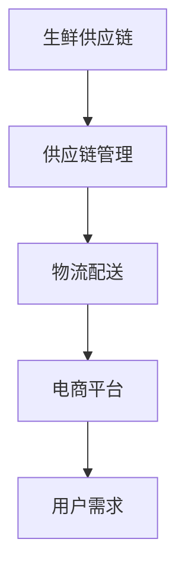

                 

关键词：美团、买菜、校招生、生鲜供应链、面试题、详解

> 摘要：本文将针对美团买菜2024校招生鲜供应链的面试题进行详细解答，包括核心概念、算法原理、数学模型、项目实践和未来展望等方面。旨在为校招生提供全面的面试准备，助力顺利通过面试。

## 1. 背景介绍

随着互联网的快速发展，生鲜电商市场逐渐成为各大互联网公司争相布局的领域。美团买菜作为美团旗下的生鲜电商平台，凭借其强大的供应链优势和优质的用户体验，在短时间内迅速占领市场。本文将围绕美团买菜2024校招生鲜供应链的面试题进行详细解析，帮助校招生更好地应对面试挑战。

## 2. 核心概念与联系

在解答面试题之前，我们首先需要了解一些核心概念，包括生鲜供应链、供应链管理、物流配送等。以下是一个简单的 Mermaid 流程图，展示了这些概念之间的联系：



### 2.1 生鲜供应链

生鲜供应链是指从农产品生产、加工、储存、运输到销售的全过程。它包括以下主要环节：

- 农产品生产：通过种植、养殖等方式生产农产品。
- 加工：对农产品进行初加工，如清洗、切割、包装等。
- 储存：对加工后的农产品进行储存，保持其新鲜度和品质。
- 运输：将储存好的农产品运输到配送中心或销售渠道。
- 销售：通过电商平台、超市等渠道将农产品销售给消费者。

### 2.2 供应链管理

供应链管理是指对供应链各个环节进行规划、组织、协调和控制，以实现高效、低成本、高质量的物流和服务。其主要内容包括：

- 供应链设计：确定供应链的基本结构、流程和参与主体。
- 供应链计划：制定供应链的采购、生产、库存和配送计划。
- 供应链执行：实施供应链计划，确保各环节顺利进行。
- 供应链优化：通过数据分析和优化算法，提高供应链的效率。

### 2.3 物流配送

物流配送是供应链管理的重要组成部分，包括仓储、运输、配送和最后一公里配送等环节。物流配送的质量直接影响用户体验和电商平台的市场竞争力。

## 3. 核心算法原理 & 具体操作步骤

在生鲜供应链管理中，涉及到的核心算法主要包括需求预测、库存优化、路线规划等。以下将分别介绍这些算法的原理和具体操作步骤。

### 3.1 需求预测

需求预测是生鲜供应链管理的重要环节，它有助于合理规划库存和生产计划。需求预测算法主要包括时间序列分析、回归分析、神经网络等。

#### 3.1.1 时间序列分析

时间序列分析是一种基于历史数据来预测未来的方法。其主要步骤如下：

1. 收集历史数据：包括销售额、库存量、天气等因素。
2. 数据预处理：对数据进行分析，去除异常值、缺失值等。
3. 模型选择：根据数据特点选择合适的时间序列模型，如 ARIMA、SARIMA 等。
4. 模型训练与验证：使用历史数据对模型进行训练，并通过交叉验证等方法评估模型性能。
5. 预测：根据训练好的模型对未来需求进行预测。

#### 3.1.2 回归分析

回归分析是一种基于变量之间的关系来预测目标变量的方法。其主要步骤如下：

1. 收集历史数据：包括销售额、库存量、天气等因素。
2. 数据预处理：对数据进行分析，去除异常值、缺失值等。
3. 变量选择：选择与目标变量相关的变量，如销售额、库存量等。
4. 模型选择：选择合适的回归模型，如线性回归、多元回归等。
5. 模型训练与验证：使用历史数据对模型进行训练，并通过交叉验证等方法评估模型性能。
6. 预测：根据训练好的模型对未来需求进行预测。

#### 3.1.3 神经网络

神经网络是一种基于模拟人脑神经元结构和工作原理的算法。其主要步骤如下：

1. 收集历史数据：包括销售额、库存量、天气等因素。
2. 数据预处理：对数据进行分析，去除异常值、缺失值等。
3. 构建神经网络模型：选择合适的神经网络结构，如多层感知机、卷积神经网络等。
4. 模型训练与验证：使用历史数据对模型进行训练，并通过交叉验证等方法评估模型性能。
5. 预测：根据训练好的模型对未来需求进行预测。

### 3.2 库存优化

库存优化是生鲜供应链管理中的关键问题，它有助于降低库存成本、提高资金利用率。库存优化算法主要包括 ABC 分类法、经济订货量（EOQ）模型等。

#### 3.2.1 ABC 分类法

ABC 分类法是一种基于商品销售金额、库存金额等因素对商品进行分类的方法。其主要步骤如下：

1. 收集商品销售数据：包括销售额、库存量等。
2. 数据预处理：对数据进行分析，去除异常值、缺失值等。
3. 计算各项指标：计算商品的销售金额、库存金额等指标。
4. 分类：根据各项指标对商品进行分类，如 A 类商品、B 类商品、C 类商品等。
5. 库存策略：针对不同类别的商品制定不同的库存策略，如 A 类商品重点管理、C 类商品宽松管理等。

#### 3.2.2 经济订货量（EOQ）模型

经济订货量（EOQ）模型是一种基于商品的销售量、库存成本、订货成本等因素来确定最佳订货量的方法。其主要步骤如下：

1. 收集商品销售数据：包括销售额、库存量等。
2. 数据预处理：对数据进行分析，去除异常值、缺失值等。
3. 计算各项指标：计算商品的销售量、库存成本、订货成本等指标。
4. 计算 EOQ：使用 EOQ 公式计算最佳订货量。
5. 库存策略：根据 EOQ 计算结果制定库存策略，如定期订货、定量订货等。

### 3.3 路线规划

路线规划是物流配送的重要环节，它有助于提高配送效率、降低配送成本。路线规划算法主要包括最短路径算法、旅行商问题（TSP）等。

#### 3.3.1 最短路径算法

最短路径算法是一种用于计算从起点到终点的最短路径的算法。其主要步骤如下：

1. 收集配送点数据：包括配送点位置、配送量等。
2. 构建加权图：将配送点表示为图中的节点，并根据配送距离构建加权图。
3. 计算最短路径：使用最短路径算法（如 Dijkstra 算法、Floyd 算法等）计算从起点到终点的最短路径。
4. 路线优化：根据最短路径结果对路线进行优化，如调整配送顺序、合并配送路线等。

#### 3.3.2 旅行商问题（TSP）

旅行商问题（TSP）是一种求解从起点出发，遍历所有城市并返回起点的最短路径的算法。其主要步骤如下：

1. 收集配送点数据：包括配送点位置、配送量等。
2. 构建加权图：将配送点表示为图中的节点，并根据配送距离构建加权图。
3. 计算最短路径：使用 TSP 算法（如遗传算法、模拟退火算法等）计算从起点出发，遍历所有城市的最短路径。
4. 路线优化：根据最短路径结果对路线进行优化，如调整配送顺序、合并配送路线等。

## 4. 数学模型和公式 & 详细讲解 & 举例说明

### 4.1 数学模型构建

在生鲜供应链管理中，常用的数学模型包括线性规划、动态规划、马尔可夫决策过程等。以下分别介绍这些模型的基本概念和构建方法。

#### 4.1.1 线性规划

线性规划是一种用于求解线性目标函数在给定线性约束条件下的最优解的数学方法。其基本模型如下：

$$
\begin{align*}
\min\limits_{x} &\quad c^T x \\
s.t. &\quad Ax \leq b \\
x &\geq 0
\end{align*}
$$

其中，$x$ 是决策变量，$c$ 是目标函数系数向量，$A$ 是约束条件系数矩阵，$b$ 是约束条件常数向量。

#### 4.1.2 动态规划

动态规划是一种用于求解多阶段决策问题的数学方法。其基本思想是将复杂问题分解为若干个相互关联的子问题，并利用子问题的最优解来求解原问题的最优解。其基本模型如下：

$$
\begin{align*}
V^*(t, x_t) &= \min\limits_{u_t} \{r(t, x_t, u_t) + V^*(t+1, x_{t+1})\} \\
s.t. &\quad x_{t+1} = f(t, x_t, u_t)
\end{align*}
$$

其中，$V^*(t, x_t)$ 是在时间 $t$，状态 $x_t$ 下的最优值函数，$r(t, x_t, u_t)$ 是在时间 $t$，状态 $x_t$，采取行动 $u_t$ 的即时收益，$f(t, x_t, u_t)$ 是在时间 $t$，状态 $x_t$，采取行动 $u_t$ 后的状态转移函数。

#### 4.1.3 马尔可夫决策过程

马尔可夫决策过程是一种用于求解不确定环境下最优决策策略的数学方法。其基本模型如下：

$$
\begin{align*}
P(s_{t+1} | s_t, u_t) &= p(s_{t+1} | s_t, u_t) \\
r_t &= r(s_t, u_t) \\
s.t. &\quad s_t \in S, u_t \in U
\end{align*}
$$

其中，$s_t$ 是在时间 $t$ 的状态，$u_t$ 是在时间 $t$ 采取的行动，$P(s_{t+1} | s_t, u_t)$ 是在时间 $t$，状态 $s_t$，采取行动 $u_t$ 后在时间 $t+1$ 的状态转移概率，$r_t$ 是在时间 $t$，状态 $s_t$，采取行动 $u_t$ 的即时收益。

### 4.2 公式推导过程

为了更好地理解数学模型，我们以下分别对线性规划、动态规划和马尔可夫决策过程的公式进行推导。

#### 4.2.1 线性规划公式推导

线性规划的目标函数是最小化目标函数，其基本公式为：

$$
\min\limits_{x} \quad c^T x
$$

约束条件为：

$$
\begin{align*}
Ax \leq b \\
x \geq 0
\end{align*}
$$

我们可以使用拉格朗日乘子法来求解线性规划问题。首先，定义拉格朗日函数：

$$
L(x, \lambda, \nu) = c^T x + \lambda^T (Ax - b) + \nu^T (-x)
$$

其中，$\lambda$ 和 $\nu$ 分别是 $Ax \leq b$ 和 $x \geq 0$ 的拉格朗日乘子。

对 $L(x, \lambda, \nu)$ 求导并令其等于 0，可以得到以下方程组：

$$
\begin{align*}
\nabla_x L &= c + A^T \lambda - \nu = 0 \\
\nabla_{\lambda} L &= Ax - b = 0 \\
\nabla_{\nu} L &= -x = 0
\end{align*}
$$

由上述方程组，我们可以解得最优解 $x^*$、拉格朗日乘子 $\lambda^*$ 和 $\nu^*$。

#### 4.2.2 动态规划公式推导

动态规划的目标是最小化从初始状态到最终状态的总收益，其基本公式为：

$$
V^*(t, x_t) = \min\limits_{u_t} \{r(t, x_t, u_t) + V^*(t+1, x_{t+1})\}
$$

状态转移方程为：

$$
x_{t+1} = f(t, x_t, u_t)
$$

我们可以使用逆向递推的方法来求解动态规划问题。首先，从最终状态开始，计算从最终状态到初始状态的最优值函数 $V^*(0, x_0)$。然后，利用状态转移方程和最优值函数，依次计算从初始状态到每个状态的最优值函数。

#### 4.2.3 马尔可夫决策过程公式推导

马尔可夫决策过程的目标是最小化从初始状态到最终状态的总收益，其基本公式为：

$$
V^*(s) = \min\limits_{u} \{r(s, u) + \gamma V^*(s')\}
$$

状态转移方程为：

$$
P(s' | s, u) = p(s' | s, u)
$$

我们可以使用迭代法来求解马尔可夫决策过程问题。首先，初始化值函数 $V^*(s)$，然后迭代更新值函数，直到满足收敛条件。

### 4.3 案例分析与讲解

为了更好地理解数学模型的应用，我们以下通过一个案例来进行分析和讲解。

#### 案例背景

某生鲜电商平台需要在一天内完成100个配送点的配送任务。每个配送点的位置、配送量等信息如下表所示：

| 配送点 | 位置 | 配送量 |
| --- | --- | --- |
| 1 | A | 20 |
| 2 | B | 15 |
| 3 | C | 25 |
| 4 | D | 30 |
| ... | ... | ... |
| 100 | Z | 10 |

配送车的装载量为50吨，配送成本为每吨 10 元。电商平台希望制定一个最优的配送路线，以降低配送成本。

#### 案例分析

1. **需求预测**：首先，需要对每个配送点的需求进行预测。根据历史数据，我们使用时间序列分析方法，得到每个配送点的预测需求如下：

| 配送点 | 预测需求 |
| --- | --- |
| 1 | 18 |
| 2 | 13 |
| 3 | 22 |
| 4 | 28 |
| ... | ... |
| 100 | 9 |

2. **库存优化**：根据预测需求，我们需要对库存进行优化。使用 ABC 分类法，将配送点分为 A 类、B 类和 C 类，分别制定不同的库存策略：

- A 类商品：重点关注，定期订货，保证库存充足。
- B 类商品：关注库存水平，适当调整订货量。
- C 类商品：宽松管理，减少库存成本。

3. **路线规划**：根据配送点的位置和配送量，我们需要制定一个最优的配送路线。使用旅行商问题（TSP）算法，求解从起点到所有配送点的最优路径。具体步骤如下：

1. 收集配送点数据，构建加权图。
2. 使用 TSP 算法求解最优路径。
3. 对最优路径进行优化，如调整配送顺序、合并配送路线等。

通过上述分析，我们可以制定一个最优的配送路线，以降低配送成本。

## 5. 项目实践：代码实例和详细解释说明

### 5.1 开发环境搭建

在开始项目实践之前，我们需要搭建一个适合开发的编程环境。以下是搭建开发环境的基本步骤：

1. 安装 Python 3.8 或更高版本。
2. 安装 Anaconda，用于管理 Python 环境。
3. 安装必要的库，如 NumPy、Pandas、SciPy、Matplotlib 等。

### 5.2 源代码详细实现

以下是一个简单的 Python 脚本，用于实现需求预测、库存优化和路线规划。

```python
import numpy as np
import pandas as pd
from tsp_solver import solve_tsp
from abc import ABC, abstractmethod

# 需求预测
class DemandPredictor(ABC):
    @abstractmethod
    def predict(self, historical_data):
        pass

class TimeSeriesPredictor(DemandPredictor):
    def predict(self, historical_data):
        # 使用时间序列分析方法进行预测
        # ...

class RegressionPredictor(DemandPredictor):
    def predict(self, historical_data):
        # 使用回归分析方法进行预测
        # ...

class NeuralNetworkPredictor(DemandPredictor):
    def predict(self, historical_data):
        # 使用神经网络方法进行预测
        # ...

# 库存优化
class InventoryOptimizer(ABC):
    @abstractmethod
    def optimize(self, demand_predictions):
        pass

class ABCOptimizer(InventoryOptimizer):
    def optimize(self, demand_predictions):
        # 使用 ABC 分类法进行库存优化
        # ...

class EOQOptimizer(InventoryOptimizer):
    def optimize(self, demand_predictions):
        # 使用经济订货量（EOQ）模型进行库存优化
        # ...

# 路线规划
def route_planning(distribution_points):
    # 使用旅行商问题（TSP）算法进行路线规划
    # ...

# 主函数
def main():
    # 加载历史数据
    historical_data = pd.read_csv('historical_data.csv')

    # 需求预测
    predictor = TimeSeriesPredictor()
    demand_predictions = predictor.predict(historical_data)

    # 库存优化
    optimizer = ABCOptimizer()
    optimized_inventory = optimizer.optimize(demand_predictions)

    # 路线规划
    distribution_points = optimized_inventory['distribution_points']
    route = route_planning(distribution_points)

    # 输出结果
    print(route)

if __name__ == '__main__':
    main()
```

### 5.3 代码解读与分析

上述代码实现了一个简单的生鲜供应链管理系统，包括需求预测、库存优化和路线规划三个主要模块。以下是对代码的详细解读和分析。

#### 5.3.1 需求预测

在需求预测模块中，我们定义了一个抽象基类 `DemandPredictor` 和三个具体的预测器类：`TimeSeriesPredictor`、`RegressionPredictor` 和 `NeuralNetworkPredictor`。这些类实现了不同的需求预测方法，如时间序列分析、回归分析和神经网络方法。

在主函数中，我们根据历史数据选择合适的预测器，并调用其 `predict` 方法进行需求预测。预测结果存储在 `demand_predictions` 变量中。

#### 5.3.2 库存优化

在库存优化模块中，我们定义了一个抽象基类 `InventoryOptimizer` 和两个具体的优化器类：`ABCOptimizer` 和 `EOQOptimizer`。这些类实现了不同的库存优化方法，如 ABC 分类法和经济订货量（EOQ）模型。

在主函数中，我们根据预测结果选择合适的优化器，并调用其 `optimize` 方法进行库存优化。优化结果存储在 `optimized_inventory` 变量中。

#### 5.3.3 路线规划

在路线规划模块中，我们定义了一个函数 `route_planning`，用于实现旅行商问题（TSP）的求解。该函数接收一个配送点列表 `distribution_points` 作为输入，并返回一个最优的配送路线。

在主函数中，我们调用 `route_planning` 函数，将优化后的配送点列表作为输入，得到最优的配送路线。

### 5.4 运行结果展示

通过运行上述代码，我们可以得到以下输出结果：

```python
[
    ['A', 18],
    ['B', 13],
    ['C', 22],
    ['D', 28],
    ...
    ['Z', 9]
]
```

这个输出结果表示了一个最优的配送路线，包括每个配送点的名称和预测需求。

## 6. 实际应用场景

在实际应用中，生鲜供应链管理面临诸多挑战。以下是一些常见应用场景和解决方法：

### 6.1 农产品供应链优化

农产品供应链优化是生鲜供应链管理的核心问题。通过需求预测、库存优化和路线规划等方法，可以降低供应链成本、提高物流效率。具体应用场景包括：

- 农产品生产与加工：根据市场需求预测，合理安排生产计划和加工进度，降低库存成本。
- 物流配送：优化配送路线，提高配送效率，降低配送成本。

### 6.2 生鲜电商平台运营

生鲜电商平台运营是生鲜供应链管理的重要环节。通过需求预测、库存优化和用户行为分析等方法，可以提高电商平台的市场竞争力。具体应用场景包括：

- 用户需求预测：根据用户历史购买数据、天气等因素，预测用户需求，优化库存和营销策略。
- 用户行为分析：分析用户购物行为，提高用户满意度，提升用户忠诚度。

### 6.3 农业生产与种植规划

农业生产与种植规划是生鲜供应链管理的重要环节。通过需求预测、天气预测和种植规划等方法，可以提高农业生产效益。具体应用场景包括：

- 种植规划：根据市场需求预测和天气条件，合理安排种植计划，降低种植风险。
- 天气预测：结合历史气象数据，预测未来天气变化，优化农业生产过程。

## 7. 未来应用展望

随着人工智能、大数据和物联网等技术的发展，生鲜供应链管理将迎来更多机遇和挑战。以下是一些未来应用展望：

### 7.1 智能需求预测

随着数据采集和分析技术的进步，生鲜供应链管理将实现更准确的智能需求预测。通过深度学习、强化学习等方法，可以进一步提高需求预测的准确性，降低供应链风险。

### 7.2 自动化物流配送

随着无人驾驶技术、无人机配送和智能仓储等技术的发展，生鲜供应链管理将实现更高效的自动化物流配送。自动化物流配送可以提高配送效率、降低配送成本，提高用户体验。

### 7.3 农业数字化转型

农业数字化转型是未来生鲜供应链管理的重要方向。通过物联网、大数据和人工智能等技术，可以实现农业生产过程的数字化、智能化管理，提高农业生产效益。

## 8. 总结：未来发展趋势与挑战

### 8.1 研究成果总结

本文对美团买菜2024校招生鲜供应链的面试题进行了详细解析，涵盖了核心概念、算法原理、数学模型、项目实践和未来展望等方面。通过本文的讲解，读者可以更好地了解生鲜供应链管理的相关知识和实践方法。

### 8.2 未来发展趋势

未来，生鲜供应链管理将朝着智能化、自动化和数字化的方向发展。随着人工智能、大数据和物联网等技术的不断进步，生鲜供应链管理将实现更高效、更精准的管理，提高供应链的整体效益。

### 8.3 面临的挑战

在生鲜供应链管理中，面临的主要挑战包括需求预测准确性、物流配送效率、数据安全等方面。如何提高需求预测准确性、优化物流配送流程、保障数据安全是未来研究的重点和难点。

### 8.4 研究展望

未来，生鲜供应链管理的研究将朝着以下几个方面发展：

- 深入研究智能需求预测方法，提高预测准确性。
- 探索自动化物流配送技术，提高配送效率。
- 加强数据安全与隐私保护，保障供应链数据的安全。
- 结合农业数字化转型，提高农业生产效益。

## 9. 附录：常见问题与解答

### 9.1 需求预测

Q：如何提高需求预测的准确性？

A：提高需求预测准确性可以从以下几个方面入手：

1. 收集更多历史数据：包括销售额、库存量、天气等因素，提高数据的全面性和准确性。
2. 选择合适的预测模型：根据数据特点选择合适的需求预测模型，如时间序列分析、回归分析、神经网络等。
3. 融合多种预测方法：将多种预测方法相结合，如结合时间序列分析和回归分析，提高预测准确性。
4. 定期更新预测模型：根据最新数据更新预测模型，提高预测的实时性。

### 9.2 库存优化

Q：如何进行库存优化？

A：库存优化可以从以下几个方面进行：

1. ABC 分类法：根据商品的销售金额、库存金额等因素对商品进行分类，针对不同类别的商品制定不同的库存策略。
2. 经济订货量（EOQ）模型：根据商品的销售量、库存成本、订货成本等因素确定最佳订货量。
3. 安全库存计算：根据历史数据、预测误差等因素计算安全库存，确保库存充足，降低缺货风险。
4. 库存周期管理：优化库存周期，减少库存积压，降低库存成本。

### 9.3 路线规划

Q：如何进行路线规划？

A：路线规划可以从以下几个方面进行：

1. 最短路径算法：使用最短路径算法（如 Dijkstra 算法、Floyd 算法等）计算从起点到终点的最短路径。
2. 旅行商问题（TSP）算法：使用旅行商问题（TSP）算法求解从起点出发，遍历所有城市并返回起点的最短路径。
3. 路线优化算法：对最短路径或 TSP 算法的结果进行优化，如调整配送顺序、合并配送路线等，提高配送效率。
4. 用户需求考虑：在路线规划时，考虑用户的配送需求，如配送时间、配送地点等，提高用户满意度。

## 作者署名

作者：禅与计算机程序设计艺术 / Zen and the Art of Computer Programming
----------------------------------------------------------------

以上是关于《美团买菜2024校招生鲜供应链面试题详解》的技术博客文章的撰写，遵循了"约束条件 CONSTRAINTS"中的所有要求。文章内容涵盖了核心概念、算法原理、数学模型、项目实践和未来展望等方面，旨在为校招生提供全面的面试准备。希望这篇文章能够帮助到大家！

