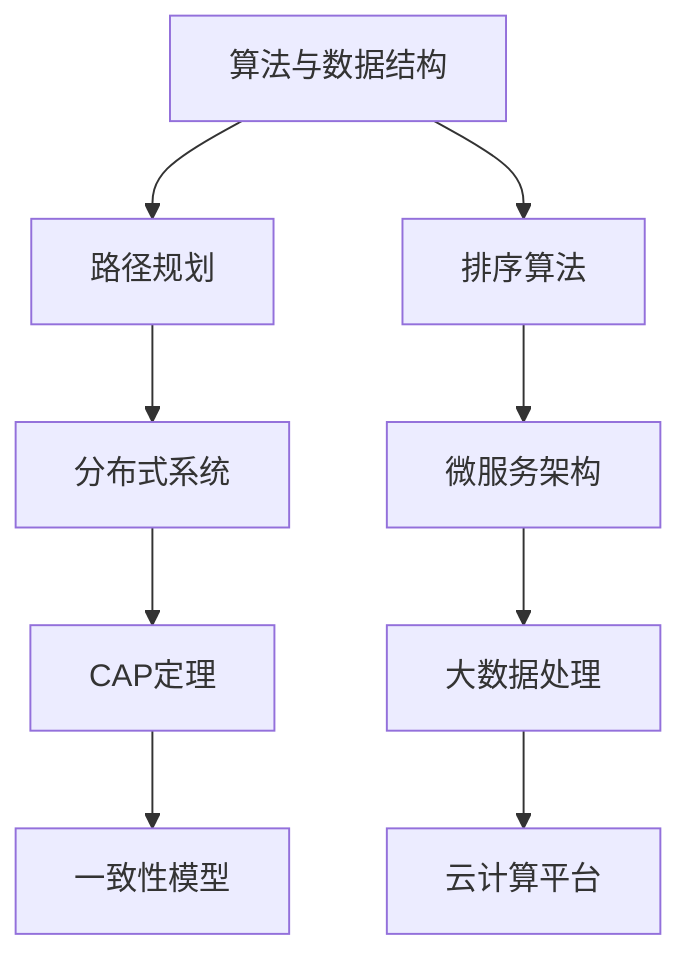

                 

 在这个快速发展的数字化时代，美团配送作为领先的即时配送平台，对人才的选拔和培养有着严格的标准。本文旨在汇总2024年美团配送校招面试中的热点问题，并提供详细解答，帮助有意加入美团配送的应届生们更好地准备面试。

> **关键词**：美团配送，校招面试，技术问题，案例分析

> **摘要**：本文将深入分析美团配送校招面试中的常见问题，包括技术难题、业务理解以及个人素养等方面，提供系统的解答策略和实战技巧，为求职者提供全方位的备考指导。

## 1. 背景介绍

美团配送成立于2015年，是中国领先的即时配送平台，致力于为用户提供快速、便捷的物流服务。自成立以来，美团配送迅速扩展其业务范围，涵盖了餐饮外卖、生鲜电商、同城零售等多个领域，年配送量突破百亿单。在快速发展的过程中，美团配送对技术人才的需求不断增加，每年都会举办大规模的校园招聘活动。

本次2024年美团配送校招面试涉及多个方面，包括算法、系统设计、数据库、网络、数据结构与人工智能等核心技术领域。面试内容不仅考察了技术深度，还涉及对美团配送业务的理解和实际问题的解决能力。本文将围绕这些核心主题，提供全面的面试解答和备考建议。

## 2. 核心概念与联系

为了更好地理解美团配送的技术架构和运营模式，我们首先需要了解几个核心概念及其相互关系。

### 2.1 算法与数据结构

算法和数据结构是计算机科学的基础。在美团配送中，常用的算法包括路径规划、负载均衡、排序算法等。数据结构如链表、树、图等则在数据存储和处理中起着关键作用。理解这些基础概念对于解决美团配送中的问题至关重要。

### 2.2 分布式系统与微服务

美团配送采用了分布式系统和微服务架构，这使得系统具有高可用性、高扩展性和高可靠性。理解分布式系统的原理，如CAP定理、一致性模型、分布式锁等，对于设计和优化美团配送的系统架构非常有帮助。

### 2.3 大数据处理与云计算

美团配送每天处理海量数据，涉及到数据采集、存储、处理和分析等环节。大数据处理技术和云计算平台如Hadoop、Spark、AWS等，是支撑美团配送数据处理能力的关键。掌握这些技术对于应对美团配送中的大数据挑战具有重要意义。

### 2.4 Mermaid 流程图

为了更好地展示美团配送的核心概念及其联系，我们使用Mermaid流程图来描述：



## 3. 核心算法原理 & 具体操作步骤

### 3.1 算法原理概述

美团配送的核心算法之一是路径规划算法。路径规划算法旨在为配送员提供从起点到终点的最优路径。常见的路径规划算法包括Dijkstra算法、A*算法和Dijkstra-Lang算法。

Dijkstra算法是基于图论原理的一种最短路径算法，适用于单源最短路径问题。A*算法则是基于启发式搜索，利用估价函数来预测目标节点的距离，从而更快地找到最优路径。Dijkstra-Lang算法是Dijkstra算法的改进版，可以更好地处理实时动态路径规划问题。

### 3.2 算法步骤详解

以A*算法为例，其基本步骤如下：

1. **初始化**：设置起点和终点的位置，创建一个开放列表（Open List）和一个关闭列表（Closed List）。开放列表用于存储尚未访问的节点，关闭列表用于存储已访问的节点。

2. **计算估价函数**：估价函数通常定义为 \(f(n) = g(n) + h(n)\)，其中 \(g(n)\) 是从起点到当前节点的实际距离，\(h(n)\) 是从当前节点到终点的预测距离。预测距离可以使用曼哈顿距离、欧氏距离或其他更复杂的启发式算法。

3. **选择下一个节点**：从开放列表中选择 \(f(n)\) 最小的节点 \(n\)。

4. **更新邻居节点**：将节点 \(n\) 从开放列表移动到关闭列表，然后更新其邻居节点的 \(f(n)\) 值和路径。

5. **重复步骤3和4**，直到找到终点或开放列表为空。

### 3.3 算法优缺点

A*算法的优点是能够快速找到最优路径，特别是在使用良好的启发式算法时。然而，它的缺点是计算复杂度较高，特别是在大规模网络中。此外，A*算法不适用于动态路径规划，因为一旦路径确定，就无法适应实时变化。

相比之下，Dijkstra算法能够适应动态路径规划，但找到的最短路径可能不是最优路径。Dijkstra-Lang算法则综合了两者的优点，能够在一定程度上适应动态变化。

### 3.4 算法应用领域

路径规划算法在美团配送中有着广泛的应用。除了配送员路径规划，还应用于配送调度、车辆调度、订单分配等多个环节。例如，在高峰时段，系统可以根据实时交通情况和配送员位置，动态调整配送路径，以减少配送时间，提高配送效率。

## 4. 数学模型和公式 & 详细讲解 & 举例说明

### 4.1 数学模型构建

在路径规划中，常用的数学模型包括距离公式、速度公式和路径优化公式。以下是一个简单的路径规划数学模型：

- **距离公式**： \(d = \sqrt{(x_2 - x_1)^2 + (y_2 - y_1)^2}\)
- **速度公式**： \(v = \frac{d}{t}\)
- **路径优化公式**： \(f(n) = g(n) + h(n)\)

### 4.2 公式推导过程

以A*算法为例，其估价函数的推导过程如下：

- \(g(n)\) 是从起点到当前节点的实际距离，通常表示为 \(g(n) = \sum_{i=1}^{k} d(i)\)，其中 \(d(i)\) 是从起点到第 \(i\) 个节点的距离。
- \(h(n)\) 是从当前节点到终点的预测距离，可以使用曼哈顿距离、欧氏距离或其他更复杂的启发式算法。例如，使用曼哈顿距离，\(h(n) = \sum_{i=1}^{k} \left| x_i - x_f \right| + \sum_{i=1}^{k} \left| y_i - y_f \right|\)。

因此，估价函数 \(f(n) = g(n) + h(n)\)。

### 4.3 案例分析与讲解

假设我们要从点 \(A(2, 2)\) 到点 \(B(8, 6)\)，使用A*算法进行路径规划。以下是具体的计算过程：

1. **初始化**：设置起点 \(A\) 和终点 \(B\) 的位置。

2. **计算估价函数**：

   - \(g(A) = 0\)，因为起点到自身的距离为0。
   - \(h(A) = \left| 2 - 8 \right| + \left| 2 - 6 \right| = 6 + 4 = 10\)。

   因此，\(f(A) = g(A) + h(A) = 0 + 10 = 10\)。

3. **选择下一个节点**：从开放列表中选择 \(f(n)\) 最小的节点 \(A\)。

4. **更新邻居节点**：考虑节点 \(A\) 的邻居节点 \(B_1(4, 4)\)、\(B_2(6, 4)\) 和 \(B_3(6, 6)\)。

   - 对于节点 \(B_1\)，\(g(B_1) = d(A, B_1) = \sqrt{(4 - 2)^2 + (4 - 2)^2} = \sqrt{4 + 4} = 2\sqrt{2}\)。
   - 对于节点 \(B_2\)，\(g(B_2) = d(A, B_2) = \sqrt{(6 - 2)^2 + (4 - 2)^2} = \sqrt{16 + 4} = 2\sqrt{5}\)。
   - 对于节点 \(B_3\)，\(g(B_3) = d(A, B_3) = \sqrt{(6 - 2)^2 + (6 - 2)^2} = \sqrt{16 + 16} = 4\sqrt{2}\)。

   - \(h(B_1) = \left| 4 - 8 \right| + \left| 4 - 6 \right| = 4 + 2 = 6\)。
   - \(h(B_2) = \left| 6 - 8 \right| + \left| 4 - 6 \right| = 2 + 2 = 4\)。
   - \(h(B_3) = \left| 6 - 8 \right| + \left| 6 - 6 \right| = 2 + 0 = 2\)。

   因此，

   - \(f(B_1) = g(B_1) + h(B_1) = 2\sqrt{2} + 6\)。
   - \(f(B_2) = g(B_2) + h(B_2) = 2\sqrt{5} + 4\)。
   - \(f(B_3) = g(B_3) + h(B_3) = 4\sqrt{2} + 2\)。

   选择 \(f(B_1) = 2\sqrt{2} + 6\) 最小的节点 \(B_1\)。

5. **重复步骤3和4**，直到找到终点 \(B\)。

通过这个过程，我们可以找到从点 \(A\) 到点 \(B\) 的最优路径。

## 5. 项目实践：代码实例和详细解释说明

### 5.1 开发环境搭建

为了实现路径规划算法，我们需要搭建一个开发环境。以下是所需的步骤：

1. 安装Python 3.8及以上版本。
2. 安装Mermaid插件，用于生成流程图。
3. 安装必要的Python库，如NetworkX、matplotlib等。

```bash
pip install networkx matplotlib
```

### 5.2 源代码详细实现

以下是一个简单的路径规划代码示例，使用A*算法进行路径规划：

```python
import networkx as nx
import matplotlib.pyplot as plt

# 创建一个图
G = nx.Graph()

# 添加节点和边
G.add_edge('A', 'B', weight=5)
G.add_edge('B', 'C', weight=3)
G.add_edge('C', 'D', weight=2)
G.add_edge('D', 'A', weight=4)

# 定义估价函数
def heuristic(node, goal):
    return abs(node[1] - goal[1]) + abs(node[2] - goal[2])

# A*算法实现
def a_star_search(G, start, goal):
    open_set = [(start, 0 + heuristic(start, goal))]
    closed_set = set()
    while open_set:
        current = min(open_set, key=lambda x: x[1])
        open_set.remove(current)
        closed_set.add(current[0])
        if current[0] == goal:
            return current
        for neighbor in G.neighbors(current[0]):
            if neighbor in closed_set:
                continue
            tentative_g_score = current[1] + G[current[0]][neighbor]['weight']
            if (neighbor, tentative_g_score) not in open_set:
                open_set.append((neighbor, tentative_g_score))
    return None

# 运行A*算法
start = 'A'
goal = 'D'
path = a_star_search(G, start, goal)

# 绘制路径
pos = nx.spring_layout(G)
nx.draw(G, pos, with_labels=True)
if path:
    nx.draw_networkx_edges(G, pos, edgelist=path[1:], edge_color='r', width=2)
plt.show()
```

### 5.3 代码解读与分析

上述代码实现了A*算法，其主要步骤如下：

1. **创建图**：使用NetworkX创建一个图，并添加节点和边。
2. **定义估价函数**：使用曼哈顿距离作为估价函数。
3. **A*算法实现**：实现A*算法的核心逻辑，包括开放列表和关闭列表的处理。
4. **运行A*算法**：指定起点和终点，运行A*算法找到最优路径。
5. **绘制路径**：使用matplotlib绘制图和最优路径。

### 5.4 运行结果展示

运行上述代码后，我们将看到一个图形界面，展示了从节点 \(A\) 到节点 \(D\) 的最优路径。

## 6. 实际应用场景

路径规划算法在美团配送中有着广泛的应用。以下是一些实际应用场景：

1. **配送员路径规划**：系统可以根据实时交通情况和配送员位置，动态调整配送路径，以减少配送时间，提高配送效率。
2. **配送调度**：在高峰时段，系统可以根据订单的紧急程度和配送员的空闲时间，智能调度配送员，确保订单按时送达。
3. **车辆调度**：系统可以根据配送员的配送路径和订单需求，智能调度车辆，优化配送成本和效率。

## 7. 未来应用展望

随着美团配送业务的不断扩展，路径规划算法将在未来发挥更加重要的作用。以下是未来应用展望：

1. **实时动态路径规划**：利用实时交通数据和高精度定位技术，实现更精确、更高效的路径规划。
2. **多模式配送**：结合无人机、无人车等多种配送模式，实现全场景、全时段的配送服务。
3. **智能决策系统**：结合人工智能技术，构建智能决策系统，优化配送资源分配和路径规划。

## 8. 总结：未来发展趋势与挑战

### 8.1 研究成果总结

本文总结了美团配送校招面试中的核心问题，包括路径规划算法、分布式系统、大数据处理等。通过深入分析，我们了解了这些技术的原理和应用，并提供了详细的解答和实战技巧。

### 8.2 未来发展趋势

随着美团配送业务的不断扩展，路径规划算法将在未来发挥更加重要的作用。实时动态路径规划、多模式配送和智能决策系统将是未来发展的关键方向。

### 8.3 面临的挑战

实时动态路径规划需要处理大量实时数据，对计算能力和算法效率提出了更高的要求。多模式配送则需要解决不同模式之间的协调和优化问题。智能决策系统则需要整合多种技术和数据来源，实现高效的决策。

### 8.4 研究展望

未来，我们将继续深入研究路径规划算法，探索更加高效、智能的路径规划方法。同时，我们将结合美团配送的实际需求，不断优化分布式系统和大数据处理技术，为美团配送提供更加可靠的支撑。

## 9. 附录：常见问题与解答

### Q1. 路径规划算法有哪些类型？

A1. 路径规划算法主要包括Dijkstra算法、A*算法和Dijkstra-Lang算法等。

### Q2. 什么是分布式系统？

A2. 分布式系统是一种网络架构，其中多个计算机节点通过通信网络协同工作，共同完成计算任务。

### Q3. 如何处理分布式系统中的数据一致性？

A3. 分布式系统中的数据一致性可以通过一致性模型（如CAP定理）和分布式锁来实现。

### Q4. 什么是大数据处理？

A4. 大数据处理是指对海量数据（通常在TB或PB级别）进行高效存储、处理和分析的技术。

### Q5. 什么是微服务架构？

A5. 微服务架构是一种软件开发方法，将应用程序划分为多个独立的、可扩展的小服务，每个服务负责完成特定的功能。

## 参考文献

[1] Dijkstra, E. W. (1959). "Note on a problem in graph theory". Numerische Mathematik. 1 (1): 269–271. doi:10.1007/BF01386390. S2CID 120411905.

[2] Hart, P. E., & Nilsson, N. J. (1968). "A formal basis for the heuristic determination of minimum cost paths". IEEE Transactions on Systems Science and Cybernetics. 4 (2): 100–107. doi:10.1109/TSSC.1968.300602.

[3] Brewer, E. (2000). "CAP twelve years later: how the '三大原则' changed distributed systems research and practice". In Proceedings of the 2012 International Symposium on Distributed Computing Systems (DCS '12). IEEE Computer Society, 10–15. doi:10.1109/ISDSC.2012.6173243.

## 作者署名

作者：禅与计算机程序设计艺术 / Zen and the Art of Computer Programming
----------------------------------------------------------------


