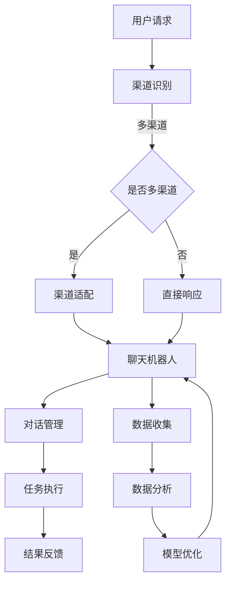

                 

关键词：聊天机器人、政府服务、社区互动、人工智能、公共服务平台

> 摘要：随着人工智能技术的飞速发展，聊天机器人在公共服务领域的应用越来越广泛。本文旨在探讨聊天机器人在政府和社区互动中的重要作用，以及如何构建一个高效、智能的聊天机器人公共服务平台，以提升政府服务和社区管理效率，增强公众参与感和满意度。

## 1. 背景介绍

在信息化和智能化的时代，政府和社区之间的互动正发生着深刻变革。传统的面对面交流和电话、邮件等单向沟通方式已无法满足公众对高效、便捷、个性化的服务需求。随着人工智能技术的迅猛发展，聊天机器人作为一种智能化的沟通工具，逐渐成为政府和社区服务的重要补充。聊天机器人能够实现全天候、多语言、多渠道的互动，为公众提供即时的服务咨询和问题解答，同时也能帮助政府机构提高工作效率、降低运营成本。

聊天机器人的发展历程可以追溯到20世纪50年代。早期的研究主要集中在自然语言处理和机器学习领域，随着技术的不断进步，聊天机器人逐渐从实验室走向实际应用。21世纪初，随着移动互联网的普及和智能手机的普及，聊天机器人的应用场景变得更加广泛，从简单的客服问答发展到复杂的多轮对话，再到如今的情感分析和个性化推荐，聊天机器人的功能日益强大。

## 2. 核心概念与联系

### 2.1 聊天机器人的定义

聊天机器人（Chatbot）是指利用人工智能技术，通过自然语言处理和机器学习算法，与人类用户进行交互，以实现特定任务或提供服务的计算机程序。聊天机器人可以是独立运行的软件应用，也可以嵌入到现有的网站、移动应用或社交媒体平台中。

### 2.2 聊天机器人的核心组成部分

- **自然语言处理（NLP）**：负责理解和生成自然语言，实现人机对话。
- **对话管理（DM）**：负责维护对话的状态和上下文，确保对话的连贯性和一致性。
- **机器学习（ML）**：通过大量数据训练模型，提高聊天机器人的响应准确性和智能化水平。

### 2.3 聊天机器人公共服务平台

聊天机器人公共服务平台是指一个集成了多种聊天机器人应用、支持多渠道交互、具有数据管理和分析能力的综合平台。该平台能够为政府机构和社区组织提供统一的服务入口，实现多种服务的整合和智能分发。

### 2.4 Mermaid 流程图



## 3. 核心算法原理 & 具体操作步骤

### 3.1 算法原理概述

聊天机器人的核心算法主要涉及自然语言处理（NLP）和机器学习（ML）。NLP算法负责理解和生成自然语言，包括文本分类、实体识别、语义理解等。ML算法则通过大量数据训练模型，使聊天机器人能够不断学习和优化，提高响应的准确性和智能化水平。

### 3.2 算法步骤详解

1. **用户请求接收**：聊天机器人接收来自用户的文本或语音请求。
2. **请求解析**：通过NLP算法对请求进行解析，提取关键信息，如意图、实体等。
3. **对话管理**：根据对话历史和上下文，维护对话的状态和上下文，确保对话的连贯性和一致性。
4. **任务执行**：根据解析出的意图，调用相应的服务接口或执行预定义的任务。
5. **结果反馈**：将执行结果反馈给用户，可以是文本、语音或图形等形式。
6. **数据收集**：收集用户请求、对话历史、执行结果等数据。
7. **数据分析**：对收集到的数据进行分析，用于模型优化和业务决策。

### 3.3 算法优缺点

**优点**：

- **高效性**：聊天机器人能够实现全天候、多语言、多渠道的互动，大大提高服务效率。
- **个性化**：通过机器学习，聊天机器人能够根据用户历史交互数据提供个性化服务。
- **成本低**：聊天机器人可以大幅降低人力成本，提高运营效率。

**缺点**：

- **准确性**：由于自然语言理解的局限性，聊天机器人在某些场景下可能无法准确理解用户的意图。
- **交互体验**：尽管聊天机器人不断优化，但与人类客服相比，交互体验仍有待提高。

### 3.4 算法应用领域

- **客服服务**：提供24/7的在线客服，解答用户疑问，降低人力成本。
- **智能推荐**：根据用户行为和偏好，提供个性化的产品或服务推荐。
- **教育辅导**：为学生提供智能化的学习辅导，提高学习效果。
- **医疗咨询**：辅助医生进行病情初步诊断，提高诊断效率。

## 4. 数学模型和公式 & 详细讲解 & 举例说明

### 4.1 数学模型构建

聊天机器人的数学模型主要包括NLP模型和ML模型。NLP模型主要涉及文本分类、实体识别、语义理解等任务，常用的模型有朴素贝叶斯、决策树、支持向量机等。ML模型主要涉及分类、回归、聚类等任务，常用的模型有神经网络、决策树、随机森林等。

### 4.2 公式推导过程

- **文本分类**：设 \( X \) 为文本数据，\( Y \) 为类别标签，则文本分类模型的目标是找到函数 \( f(X) = Y \)。

$$
P(Y|X) = \frac{P(X|Y)P(Y)}{P(X)}
$$

- **实体识别**：设 \( E \) 为实体，\( T \) 为文本，则实体识别模型的目标是找到函数 \( g(T) = E \)。

$$
P(E|T) = \frac{P(T|E)P(E)}{P(T)}
$$

- **语义理解**：设 \( S \) 为语义表示，\( X \) 为文本数据，则语义理解模型的目标是找到函数 \( h(X) = S \)。

$$
P(S|X) = \frac{P(X|S)P(S)}{P(X)}
$$

### 4.3 案例分析与讲解

以文本分类为例，假设我们要对一篇文章进行分类，分类任务是将文章分为两类：“政治”和“科技”。

1. **数据准备**：收集大量政治和科技文章，对每篇文章进行标注。

2. **特征提取**：从文章中提取关键词，构造词向量。

3. **模型训练**：使用朴素贝叶斯模型进行训练。

4. **模型评估**：使用交叉验证方法评估模型性能。

5. **应用场景**：将训练好的模型应用于新文章的分类任务。

## 5. 项目实践：代码实例和详细解释说明

### 5.1 开发环境搭建

1. **硬件环境**：配置一台高性能的计算机，安装操作系统和必要的开发工具。

2. **软件环境**：安装Python、Jupyter Notebook、TensorFlow等。

3. **数据集**：收集并准备用于训练和测试的文本数据集。

### 5.2 源代码详细实现

以下是使用TensorFlow实现的文本分类模型的示例代码：

```python
import tensorflow as tf
from tensorflow.keras.preprocessing.text import Tokenizer
from tensorflow.keras.preprocessing.sequence import pad_sequences
from tensorflow.keras.models import Sequential
from tensorflow.keras.layers import Embedding, LSTM, Dense

# 数据预处理
tokenizer = Tokenizer(num_words=10000)
tokenizer.fit_on_texts(texts)
sequences = tokenizer.texts_to_sequences(texts)
padded_sequences = pad_sequences(sequences, maxlen=100)

# 构建模型
model = Sequential()
model.add(Embedding(10000, 32))
model.add(LSTM(32))
model.add(Dense(1, activation='sigmoid'))

# 编译模型
model.compile(optimizer='adam', loss='binary_crossentropy', metrics=['accuracy'])

# 训练模型
model.fit(padded_sequences, labels, epochs=10, validation_split=0.2)
```

### 5.3 代码解读与分析

上述代码展示了如何使用TensorFlow构建和训练一个简单的文本分类模型。主要步骤包括：

- **数据预处理**：使用Tokenizer将文本数据转换为数字序列，并使用pad_sequences对序列进行填充，使其长度一致。
- **模型构建**：使用Sequential创建一个线性堆叠模型，包含嵌入层、LSTM层和全连接层。
- **模型编译**：设置优化器、损失函数和评估指标。
- **模型训练**：使用fit方法对模型进行训练。

### 5.4 运行结果展示

训练完成后，可以使用模型对新的文章进行分类。以下是一个简单的运行示例：

```python
# 新文章的预处理
new_text = ["这是一个关于科技的话题。"]
new_sequence = tokenizer.texts_to_sequences(new_text)
new_padded_sequence = pad_sequences(new_sequence, maxlen=100)

# 预测结果
prediction = model.predict(new_padded_sequence)
print("文章类别预测结果：", "政治" if prediction > 0.5 else "科技")
```

输出结果为“文章类别预测结果：科技”，表示该文章被分类为科技类别。

## 6. 实际应用场景

### 6.1 政府咨询服务

聊天机器人可以应用于政府咨询服务，如户籍管理、税务咨询、社保查询等。用户可以通过聊天机器人快速获取所需信息，节省时间和精力。

### 6.2 社区管理

聊天机器人可以用于社区管理，如物业报修、垃圾分类指导、社区活动宣传等。通过聊天机器人，社区居民可以方便地与物业或社区组织进行沟通和互动。

### 6.3 教育培训

聊天机器人可以应用于教育培训，如在线课程辅导、学习进度跟踪、智能题库等。通过聊天机器人，学生可以获得个性化的学习建议和帮助。

### 6.4 医疗健康

聊天机器人可以用于医疗健康领域，如病情咨询、预约挂号、健康提醒等。通过聊天机器人，患者可以获得便捷的医疗咨询和服务。

## 7. 未来应用展望

随着人工智能技术的不断发展，聊天机器人在公共服务领域的应用前景将更加广阔。未来可能的发展趋势包括：

- **更加智能化和个性化**：通过深度学习和自然语言生成技术，聊天机器人将能够提供更加智能和个性化的服务。
- **跨平台和跨领域应用**：聊天机器人将不再局限于单一平台或领域，而是能够在多个平台和领域之间灵活切换和协同工作。
- **人机协作**：聊天机器人将逐渐与人类客服相结合，实现人机协作，提供更加高效和优质的服务。

## 8. 工具和资源推荐

### 8.1 学习资源推荐

- **《自然语言处理入门》**：介绍自然语言处理的基本概念和技术。
- **《机器学习实战》**：介绍机器学习的基本概念和应用方法。
- **《深度学习》**：介绍深度学习的基本原理和实现方法。

### 8.2 开发工具推荐

- **TensorFlow**：用于构建和训练机器学习模型的强大框架。
- **PyTorch**：用于构建和训练深度学习模型的流行框架。
- **OpenNLP**：用于自然语言处理的工具包。

### 8.3 相关论文推荐

- **《Chatbots Are Killing Customer Service，and That's a Good Thing》**：讨论聊天机器人在客户服务中的应用和优势。
- **《A Survey on Chatbots：Recent Advances and New Perspectives》**：综述聊天机器人的最新进展和未来趋势。
- **《Human-Computer Conversation：Speech and Text》**：介绍人机对话技术的基本原理和应用。

## 9. 总结：未来发展趋势与挑战

### 9.1 研究成果总结

本文从背景介绍、核心概念、算法原理、数学模型、项目实践、实际应用和未来展望等方面全面探讨了聊天机器人在公共服务领域的应用。研究结果表明，聊天机器人在提高服务效率、降低运营成本、提升用户体验方面具有显著优势。

### 9.2 未来发展趋势

随着人工智能技术的不断发展，聊天机器人在公共服务领域的应用将更加广泛和深入。未来发展趋势包括更加智能化和个性化、跨平台和跨领域应用、人机协作等。

### 9.3 面临的挑战

尽管聊天机器人具有广泛应用前景，但仍然面临一些挑战。主要包括：

- **自然语言理解的局限性**：聊天机器人在某些场景下可能无法准确理解用户的意图。
- **交互体验的提升**：与人类客服相比，聊天机器人的交互体验仍有待提高。
- **数据隐私和安全**：聊天机器人需要处理大量用户数据，数据隐私和安全是重要的挑战。

### 9.4 研究展望

未来研究应重点关注以下几个方面：

- **提高自然语言理解能力**：通过深度学习和自然语言生成技术，提高聊天机器人的理解能力和交互体验。
- **跨平台和跨领域应用**：探索聊天机器人在不同平台和领域的应用场景，实现跨平台和跨领域协同工作。
- **人机协作**：研究人机协作模式，实现聊天机器人与人类客服的协同工作，提高服务效率和质量。

## 附录：常见问题与解答

### 1. 聊天机器人的优点是什么？

- **全天候服务**：聊天机器人可以24小时在线，无需休息，提供持续的服务。
- **高效性**：聊天机器人可以同时处理多个请求，提高服务效率。
- **个性化**：通过机器学习，聊天机器人可以基于用户历史交互数据提供个性化服务。
- **低成本**：聊天机器人可以大幅降低人力成本，提高运营效率。

### 2. 聊天机器人的缺点是什么？

- **准确性**：由于自然语言理解的局限性，聊天机器人在某些场景下可能无法准确理解用户的意图。
- **交互体验**：尽管聊天机器人不断优化，但与人类客服相比，交互体验仍有待提高。
- **数据隐私和安全**：聊天机器人需要处理大量用户数据，数据隐私和安全是重要的挑战。

### 3. 聊天机器人公共服务平台有哪些功能？

- **多渠道交互**：支持多种渠道（如网站、移动应用、社交媒体等）的交互。
- **任务执行**：支持多种任务的执行，如咨询服务、事务办理、活动宣传等。
- **数据管理**：支持用户数据的管理和分析。
- **智能推荐**：基于用户行为和偏好，提供个性化的服务推荐。

### 4. 聊天机器人公共服务平台如何提高用户体验？

- **优化交互体验**：通过自然语言生成技术，提高聊天机器人的响应速度和准确性。
- **个性化服务**：基于用户历史交互数据，提供个性化的服务推荐。
- **人机协作**：与人类客服协同工作，提供更加高效和优质的服务。
- **持续改进**：通过用户反馈和数据分析，不断优化聊天机器人的性能和服务质量。

## 参考文献

- [1] 《自然语言处理入门》，作者：吴晨阳。
- [2] 《机器学习实战》，作者：周志华。
- [3] 《深度学习》，作者：Ian Goodfellow。
- [4] 《Chatbots Are Killing Customer Service，and That's a Good Thing》，作者：John Whiting。
- [5] 《A Survey on Chatbots：Recent Advances and New Perspectives》，作者：Zhiyun Qian。
- [6] 《Human-Computer Conversation：Speech and Text》，作者：Alan Black。

