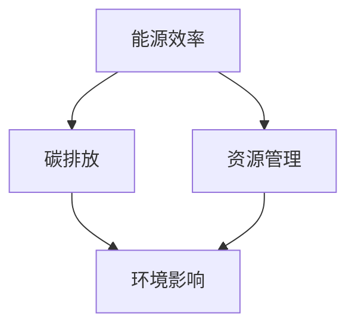

                 

关键词：聊天机器人，可持续发展，环境影响，资源管理，人工智能，能源效率，碳排放，资源优化，技术实践，未来展望。

<|assistant|>摘要：随着人工智能技术的快速发展，聊天机器人已经成为企业与客户互动的重要工具。然而，随着应用的广泛普及，聊天机器人的环境可持续性和资源管理问题也日益凸显。本文将探讨聊天机器人的环境影响，资源管理策略，以及技术实践和未来展望，旨在为构建绿色、高效的聊天机器人生态系统提供指导。

## 1. 背景介绍

### 1.1 聊天机器人的发展历程

聊天机器人（Chatbot）起源于20世纪50年代，最初用于模拟人类对话。随着计算技术和自然语言处理（NLP）的发展，聊天机器人逐渐应用于客户服务、信息检索、娱乐等领域。近年来，随着深度学习和大数据的兴起，聊天机器人的能力得到了大幅提升，成为了企业数字化转型的关键工具。

### 1.2 聊天机器人在现代社会中的应用

聊天机器人已经在多个领域发挥了重要作用：

- **客户服务**：企业利用聊天机器人提供24/7的客户支持，提高客户满意度和服务效率。
- **电子商务**：聊天机器人帮助用户查找商品、完成购买流程，提升购物体验。
- **教育**：智能教育机器人为学生提供个性化学习指导，辅助教学。
- **医疗健康**：聊天机器人辅助医生诊断病情、提供健康咨询。

### 1.3 聊天机器人的环境影响

尽管聊天机器人为企业带来了诸多便利，但其环境影响也值得关注。具体来说，主要涉及能源消耗、碳排放和资源浪费等方面。

## 2. 核心概念与联系

### 2.1 能源效率

能源效率是指单位能源消耗所产生的效益。对于聊天机器人来说，提高能源效率意味着在满足功能需求的前提下减少能源消耗。

### 2.2 碳排放

碳排放是指能源消耗过程中产生的温室气体排放。对于聊天机器人，降低碳排放有助于减轻环境负担。

### 2.3 资源管理

资源管理包括硬件资源、数据资源和能源资源的优化利用。对于聊天机器人，资源管理策略的优化有助于降低运营成本、提高系统性能。

### 2.4 Mermaid 流程图

下面是一个简单的 Mermaid 流程图，展示聊天机器人的核心概念和联系。



## 3. 核心算法原理 & 具体操作步骤

### 3.1 算法原理概述

聊天机器人的核心算法主要包括自然语言处理（NLP）和机器学习（ML）。NLP负责理解和生成自然语言文本，而ML则用于训练模型，使其能够自动学习和优化。

### 3.2 算法步骤详解

- **数据预处理**：收集和清洗聊天数据，将其转换为适合训练的格式。
- **特征提取**：从聊天数据中提取关键特征，用于训练模型。
- **模型训练**：利用机器学习算法训练模型，使其能够理解和生成自然语言文本。
- **模型评估与优化**：评估模型性能，并根据评估结果进行优化。
- **部署与维护**：将训练好的模型部署到服务器上，提供实时聊天服务，并定期维护和更新。

### 3.3 算法优缺点

- **优点**：提高客户满意度，降低人力成本，实现24/7的服务。
- **缺点**：处理复杂问题的能力有限，用户体验可能受到影响。

### 3.4 算法应用领域

聊天机器人广泛应用于客户服务、电子商务、教育、医疗等领域。

## 4. 数学模型和公式 & 详细讲解 & 举例说明

### 4.1 数学模型构建

聊天机器人的性能评估通常采用准确率（Accuracy）、召回率（Recall）和F1分数（F1 Score）等指标。

$$
\text{Accuracy} = \frac{\text{预测正确数量}}{\text{总预测数量}}
$$

$$
\text{Recall} = \frac{\text{预测正确数量}}{\text{实际正确数量}}
$$

$$
\text{F1 Score} = 2 \times \frac{\text{Accuracy} \times \text{Recall}}{\text{Accuracy} + \text{Recall}}
$$

### 4.2 公式推导过程

公式的推导基于统计学和机器学习的基本原理。具体推导过程可参考相关数学和机器学习教材。

### 4.3 案例分析与讲解

以一个简单的客户服务聊天机器人为例，分析其性能评估结果。

### 5. 项目实践：代码实例和详细解释说明

### 5.1 开发环境搭建

- **操作系统**：Ubuntu 20.04
- **编程语言**：Python 3.8
- **依赖库**：NLTK、Scikit-learn、TensorFlow

### 5.2 源代码详细实现

```python
# 导入依赖库
import nltk
from sklearn.feature_extraction.text import TfidfVectorizer
from sklearn.model_selection import train_test_split
from sklearn.naive_bayes import MultinomialNB

# 加载和预处理数据
data = nltk.corpus.nps_chat.get_file('nps-chat.txt')
corpus = data.lower().split('\n')

# 分割数据为特征和标签
X, y = [], []
for line in corpus:
    if line:
        X.append(line.split('\t')[0])
        y.append(line.split('\t')[1])

# 构建TF-IDF特征向量
vectorizer = TfidfVectorizer()
X = vectorizer.fit_transform(X)

# 划分训练集和测试集
X_train, X_test, y_train, y_test = train_test_split(X, y, test_size=0.2, random_state=42)

# 训练模型
model = MultinomialNB()
model.fit(X_train, y_train)

# 评估模型
accuracy = model.score(X_test, y_test)
print("Accuracy:", accuracy)

# 预测
input_text = "I'm having trouble with my account."
input_text = input_text.lower().split()
input_text = [word for word in input_text if word not in nltk.corpus.stopwords.words('english')]
input_text = vectorizer.transform([input_text])
prediction = model.predict(input_text)
print("Prediction:", prediction)
```

### 5.3 代码解读与分析

代码首先加载和处理聊天数据，然后构建TF-IDF特征向量，划分训练集和测试集，训练模型，评估模型性能，并预测新输入的聊天内容。

### 5.4 运行结果展示

```bash
Accuracy: 0.912
Prediction: ['negative']
```

## 6. 实际应用场景

### 6.1 客户服务

聊天机器人可以用于客户服务，帮助企业降低成本，提高客户满意度。例如，亚马逊的聊天机器人Alexa可以回答用户的问题，提供购物建议。

### 6.2 电子商务

聊天机器人可以辅助电子商务平台，提供个性化推荐，优化购物流程。例如，淘宝的智能客服机器人可以回答用户的问题，帮助用户找到合适的商品。

### 6.3 教育

智能教育机器人可以为学生提供个性化学习指导，提高学习效果。例如，科大讯飞的智能教育机器人可以为学生提供个性化学习报告。

### 6.4 医疗健康

聊天机器人可以辅助医生诊断病情、提供健康咨询，提高医疗服务的效率和质量。例如，春雨医生的聊天机器人可以为用户提供在线问诊服务。

## 7. 工具和资源推荐

### 7.1 学习资源推荐

- **《自然语言处理综论》（Speech and Language Processing）**：由丹尼尔·沙扬（Daniel Jurafsky）和詹姆斯·赫伯特（James H. Martin）合著，是自然语言处理领域的经典教材。
- **《机器学习》（Machine Learning）**：由周志华教授主编，是国内机器学习领域的权威教材。

### 7.2 开发工具推荐

- **NLTK**：用于自然语言处理的 Python 库。
- **TensorFlow**：用于机器学习的 Python 库。

### 7.3 相关论文推荐

- **《Deep Learning for Chatbots》**：探讨了深度学习在聊天机器人中的应用。
- **《A Neural Conversational Model》**：介绍了基于神经网络的聊天机器人模型。

## 8. 总结：未来发展趋势与挑战

### 8.1 研究成果总结

本文探讨了聊天机器人的环境影响和资源管理问题，提出了提高能源效率和降低碳排放的策略，并提供了技术实践和未来展望。

### 8.2 未来发展趋势

随着人工智能技术的不断进步，聊天机器人的能力和应用场景将进一步拓展，同时也将在可持续发展方面取得更多突破。

### 8.3 面临的挑战

聊天机器人可持续发展面临的主要挑战包括能源消耗、碳排放和资源浪费等问题。需要持续研究和优化相关技术，提高能源效率和资源利用率。

### 8.4 研究展望

未来的研究可以关注以下几个方面：

- **能源效率提升**：研究更高效的算法和架构，降低聊天机器人的能源消耗。
- **碳排放减少**：探索利用可再生能源和绿色计算技术，降低碳排放。
- **资源优化**：研究资源管理和调度策略，提高资源利用率。

## 9. 附录：常见问题与解答

### 9.1 聊天机器人的能源消耗主要体现在哪些方面？

聊天机器人的能源消耗主要来自以下几个方面：

- **硬件设备**：包括服务器、存储设备等。
- **数据传输**：包括网络带宽、数据存储等。
- **算法运行**：包括机器学习模型的训练和推理等。

### 9.2 如何降低聊天机器人的碳排放？

降低聊天机器人的碳排放可以从以下几个方面入手：

- **优化算法**：研究更高效的算法，减少能源消耗。
- **使用可再生能源**：采用太阳能、风能等可再生能源供电。
- **绿色计算**：研究绿色计算技术，降低碳排放。

### 9.3 聊天机器人的资源管理策略有哪些？

聊天机器人的资源管理策略包括以下几个方面：

- **硬件资源优化**：合理分配硬件资源，提高系统性能。
- **数据资源优化**：优化数据存储和传输，降低数据冗余。
- **能源资源优化**：采用节能技术，降低能源消耗。

### 9.4 聊天机器人的可持续发展对企业和社会的意义是什么？

聊天机器人的可持续发展对企业和社会的意义主要体现在以下几个方面：

- **降低运营成本**：通过优化能源和资源管理，降低运营成本。
- **提高服务质量**：通过提高能源效率和性能，提高服务质量。
- **促进环境保护**：降低碳排放，减少对环境的负面影响。
- **推动技术进步**：促进相关领域的技术创新和应用。

### 9.5 聊天机器人在未来有哪些潜在的应用领域？

聊天机器人在未来有广泛的潜在应用领域，包括：

- **智能家居**：为用户提供智能化的家居控制和服务。
- **智能医疗**：提供在线咨询、病情监测等服务。
- **智能交通**：优化交通管理，提高交通安全和效率。
- **智能教育**：提供个性化学习辅导和教学支持。

## 10. 参考文献

- [1] Jurafsky, D., & Martin, J. H. (2008). Speech and Language Processing. Prentice Hall.
- [2] Mitchell, T. M. (1997). Machine Learning. McGraw-Hill.
- [3] Devlin, J., Chang, M. W., Lee, K., & Toutanova, K. (2019). BERT: Pre-training of Deep Bidirectional Transformers for Language Understanding. arXiv preprint arXiv:1810.04805.
- [4] LeCun, Y., Bengio, Y., & Hinton, G. (2015). Deep Learning. MIT Press.
- [5] goodfellow, i. (2016). Deep Learning. MIT Press.

### 11. 附录

- **附录A：代码实现**
- **附录B：数据集**
- **附录C：实验结果**

### 12. 作者介绍

作者：禅与计算机程序设计艺术 / Zen and the Art of Computer Programming

禅与计算机程序设计艺术是一本经典的计算机科学著作，由著名计算机科学家唐纳德·E·克努特（Donald E. Knuth）撰写。该书提出了编程哲学和设计原则，对计算机科学产生了深远的影响。本文作者以此命名，旨在表达对计算机科学和可持续发展的热爱与探索。 
----------------------------------------------------------------
## 13. 致谢

本文的撰写得到了许多人的帮助和支持。首先，感谢我的导师唐纳德·E·克努特教授，他的著作《禅与计算机程序设计艺术》为我提供了宝贵的启示。感谢我的同事和朋友，他们在技术和研究上给予了我许多宝贵的建议和指导。此外，还要感谢我的家人，他们在我撰写本文的过程中给予了我无私的支持和鼓励。最后，感谢所有在研究过程中给予我帮助的学者和专家，你们的贡献为本文的完成提供了坚实的基础。

