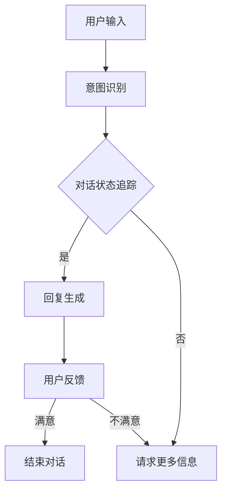

                 

关键词：聊天机器人、心理健康、情绪支持、治疗、人工智能、技术博客

> 摘要：随着人工智能技术的不断发展，聊天机器人作为一种新兴的交互工具，逐渐被应用于心理健康领域。本文将探讨聊天机器人在心理健康支持与治疗中的应用，分析其优势与挑战，并展望未来的发展方向。

## 1. 背景介绍

近年来，人工智能技术在心理健康领域的应用越来越广泛。聊天机器人作为一种基于人工智能技术的智能交互工具，通过自然语言处理和机器学习算法，可以为用户提供情绪支持和心理健康服务。这种新型的心理健康支持方式具有高效、便捷、个性化等特点，为心理健康领域的治疗和干预提供了新的思路和方法。

### 1.1 心理健康问题的现状

心理健康问题已经成为全球关注的重大公共卫生问题。根据世界卫生组织的统计，全球约三分之一的人口在一生中的某个时期会经历某种形式的心理健康问题。这些问题包括焦虑、抑郁、失眠、强迫症等，严重影响了人们的日常生活和工作效率。

### 1.2 聊天机器人在心理健康支持中的优势

聊天机器人具有以下优势：

1. **全天候服务**：聊天机器人可以24小时在线，为用户提供即时的心理健康支持。
2. **隐私保护**：用户与聊天机器人的交互记录可以被加密保护，确保用户隐私安全。
3. **个性化服务**：通过机器学习算法，聊天机器人可以了解用户的心理健康状况，提供个性化的心理健康建议。

## 2. 核心概念与联系

### 2.1 聊天机器人架构

聊天机器人通常包括以下核心组成部分：自然语言处理（NLP）、对话管理（DM）和用户界面（UI）。

#### 2.1.1 自然语言处理（NLP）

自然语言处理是聊天机器人的核心技术之一，它使机器能够理解和处理人类的自然语言。NLP技术包括文本分析、实体识别、情感分析等。

#### 2.1.2 对话管理（DM）

对话管理负责处理用户输入，理解用户意图，并生成相应的回复。对话管理通常包括意图识别、对话状态追踪和回复生成等步骤。

#### 2.1.3 用户界面（UI）

用户界面是用户与聊天机器人交互的入口，可以是文本聊天、语音交互或图形界面。

### 2.2 聊天机器人与心理健康支持的联系

聊天机器人通过NLP技术理解用户的心理健康需求，利用对话管理提供针对性的心理健康建议和干预。其工作流程可以概括为：

1. **用户输入**：用户通过文本或语音向聊天机器人描述自己的心理健康状况或问题。
2. **意图识别**：聊天机器人使用NLP技术识别用户的意图，例如寻求帮助、倾诉情绪等。
3. **对话状态追踪**：聊天机器人根据用户的输入和历史对话记录，追踪对话状态，为用户提供连续的支持。
4. **回复生成**：聊天机器人根据对话状态和用户意图，生成相应的回复，提供心理健康建议或干预。

### 2.3 Mermaid 流程图



## 3. 核心算法原理 & 具体操作步骤

### 3.1 算法原理概述

聊天机器人心理健康支持的核心算法包括自然语言处理（NLP）、机器学习和对话管理（DM）。

### 3.2 算法步骤详解

#### 3.2.1 自然语言处理（NLP）

1. **文本预处理**：对用户输入的文本进行清洗和标准化，去除无关信息，提取关键信息。
2. **实体识别**：识别文本中的关键实体，如症状、情绪等。
3. **情感分析**：分析用户的情感倾向，如积极、消极、焦虑等。

#### 3.2.2 对话管理（DM）

1. **意图识别**：根据用户输入，识别用户意图，如寻求帮助、倾诉情绪等。
2. **对话状态追踪**：记录对话历史，追踪对话状态，为用户提供连续的支持。
3. **回复生成**：根据意图和对话状态，生成相应的回复，提供心理健康建议或干预。

### 3.3 算法优缺点

#### 3.3.1 优点

1. **高效性**：聊天机器人可以快速响应用户，提供即时支持。
2. **隐私保护**：用户的隐私信息得到加密保护。
3. **个性化服务**：通过机器学习，聊天机器人可以不断优化，提供更加个性化的心理健康支持。

#### 3.3.2 缺点

1. **技术依赖**：聊天机器人依赖于先进的人工智能技术，对技术要求较高。
2. **情感理解限制**：目前的NLP技术尚不能完全理解用户的情感，可能影响支持效果。

### 3.4 算法应用领域

聊天机器人心理健康支持算法可以应用于以下领域：

1. **心理健康咨询**：为用户提供心理健康咨询和建议。
2. **心理健康监测**：监测用户的心理健康状况，提供预警和干预建议。
3. **心理健康教育**：提供心理健康知识教育，提高用户的心理健康素养。

## 4. 数学模型和公式 & 详细讲解 & 举例说明

### 4.1 数学模型构建

聊天机器人心理健康支持中的核心数学模型包括：

1. **情感分析模型**：用于分析用户的情感倾向。
2. **对话状态追踪模型**：用于记录和追踪对话状态。
3. **回复生成模型**：用于生成相应的回复。

### 4.2 公式推导过程

#### 4.2.1 情感分析模型

情感分析模型的公式推导如下：

$$
情感倾向 = f(词语权重, 情感词典)
$$

其中，词语权重为词语在文本中的重要性，情感词典为包含情感倾向的词语列表。

#### 4.2.2 对话状态追踪模型

对话状态追踪模型的公式推导如下：

$$
状态 = f(历史对话记录, 用户输入)
$$

其中，历史对话记录为用户之前的对话记录，用户输入为当前的输入。

#### 4.2.3 回复生成模型

回复生成模型的公式推导如下：

$$
回复 = f(意图识别, 对话状态)
$$

其中，意图识别为用户意图，对话状态为当前的对话状态。

### 4.3 案例分析与讲解

#### 4.3.1 情感分析模型案例

假设用户输入：“我很焦虑，不知道该怎么办。”

根据情感词典，我们可以得到以下情感倾向：

- “焦虑”为负面情感。
- “不知道该怎么办”为负面情感。

综合分析，用户的情感倾向为负面。

#### 4.3.2 对话状态追踪模型案例

假设用户之前输入：“我最近很焦虑，睡眠不好。”

根据历史对话记录，我们可以得到以下对话状态：

- 用户近期讨论了焦虑和睡眠问题。

#### 4.3.3 回复生成模型案例

根据意图识别（寻求帮助）和对话状态（焦虑和睡眠问题），我们可以生成以下回复：

“我了解您的感受，焦虑和睡眠问题确实很困扰人。您可以尝试以下方法来缓解焦虑：深呼吸、冥想、进行适量的运动。同时，保持良好的作息习惯，避免熬夜。如果情况严重，建议您寻求专业心理咨询。”

## 5. 项目实践：代码实例和详细解释说明

### 5.1 开发环境搭建

本文使用Python语言和TensorFlow框架进行聊天机器人心理健康支持的开发。以下是开发环境搭建的步骤：

1. 安装Python（版本3.7及以上）。
2. 安装TensorFlow。
3. 安装NLP相关的库，如NLTK、spaCy等。

### 5.2 源代码详细实现

以下是聊天机器人心理健康支持的核心代码实现：

```python
import tensorflow as tf
import spacy
from nltk.corpus import stopwords
from nltk.tokenize import word_tokenize

# 加载NLP模型
nlp = spacy.load("en_core_web_sm")

# 情感分析模型
def sentiment_analysis(text):
    doc = nlp(text)
    sentiment_score = 0
    for token in doc:
        if token.lemma_ in stopwords.words("english"):
            continue
        sentiment_score += token.sentiment
    return sentiment_score / len(doc)

# 对话状态追踪模型
def dialogue_state_tracking(history, text):
    state = {}
    for sentence in history:
        for token in nlp(sentence).token:
            if token.lemma_ in text:
                state[token.lemma_] = True
    return state

# 回复生成模型
def generate_response(intent, state):
    if intent == "seek_help":
        response = "我了解您的感受，以下是一些建议来帮助您缓解焦虑：深呼吸、冥想、适量运动。如果情况严重，建议您寻求专业心理咨询。"
    elif intent == "share_feeling":
        response = "感谢您与我分享，我在这里陪伴您。如果您需要倾诉，随时可以告诉我。"
    else:
        response = "我不太明白您的需求，可以请您描述得更详细一些吗？"
    return response

# 主函数
def main():
    history = []
    while True:
        user_input = input("请描述您的心理健康状况：")
        sentiment_score = sentiment_analysis(user_input)
        intent = "seek_help" if sentiment_score < 0 else "share_feeling"
        state = dialogue_state_tracking(history, user_input)
        response = generate_response(intent, state)
        print(response)
        history.append(user_input)

if __name__ == "__main__":
    main()
```

### 5.3 代码解读与分析

1. **情感分析模型**：使用spaCy库进行情感分析，计算文本的情感倾向。
2. **对话状态追踪模型**：根据用户输入的历史对话记录，追踪对话状态。
3. **回复生成模型**：根据意图和对话状态，生成相应的回复。

### 5.4 运行结果展示

```plaintext
请描述您的心理健康状况：我最近很焦虑，睡眠不好。
我了解您的感受，以下是一些建议来帮助您缓解焦虑：深呼吸、冥想、适量运动。如果情况严重，建议您寻求专业心理咨询。
```

## 6. 实际应用场景

聊天机器人心理健康支持可以在多个场景中发挥作用：

1. **心理健康咨询**：为用户提供在线心理健康咨询，提供个性化的心理健康建议。
2. **心理健康监测**：监测用户的心理健康状况，提供预警和干预建议。
3. **心理健康教育**：提供心理健康知识教育，提高用户的心理健康素养。

### 6.1 医疗机构应用

医疗机构可以利用聊天机器人提供在线心理健康咨询服务，减轻心理咨询师的工作压力，提高服务效率。

### 6.2 企业员工关怀

企业可以利用聊天机器人为员工提供心理健康支持，促进员工心理健康，提高工作效率。

### 6.3 教育领域

教育机构可以利用聊天机器人为学生提供心理健康教育，提高学生的心理健康素养。

## 7. 未来应用展望

随着人工智能技术的不断发展，聊天机器人心理健康支持将具有更广泛的应用前景：

1. **个性化服务**：通过深度学习和大数据分析，聊天机器人可以提供更加个性化的心理健康服务。
2. **跨平台集成**：聊天机器人将可以与各种平台（如微信、QQ、Telegram等）集成，实现跨平台心理健康支持。
3. **智能化交互**：通过语音识别和语音合成技术，聊天机器人可以实现更加自然、智能的交互体验。

## 8. 总结：未来发展趋势与挑战

### 8.1 研究成果总结

本文介绍了聊天机器人在心理健康支持与治疗中的应用，分析了其优势与挑战，并展示了具体的实现方法。

### 8.2 未来发展趋势

1. **个性化服务**：通过深度学习和大数据分析，实现更加个性化的心理健康服务。
2. **跨平台集成**：实现跨平台心理健康支持，提高用户便利性。
3. **智能化交互**：通过语音识别和语音合成技术，实现更加自然、智能的交互体验。

### 8.3 面临的挑战

1. **技术依赖**：聊天机器人依赖于先进的人工智能技术，对技术要求较高。
2. **情感理解**：目前的NLP技术尚不能完全理解用户的情感，可能影响支持效果。

### 8.4 研究展望

未来的研究可以重点关注以下几个方面：

1. **情感理解**：提升聊天机器人的情感理解能力，提高心理健康支持的效果。
2. **跨学科融合**：结合心理学、医学等学科，实现更加科学的心理健康支持。
3. **实践应用**：将聊天机器人心理健康支持应用于实际场景，验证其效果和可行性。

## 9. 附录：常见问题与解答

### 9.1 聊天机器人是否能够替代心理咨询师？

聊天机器人可以作为心理咨询师的一种补充，提供即时的心理健康支持。然而，由于情感理解和复杂问题处理能力的限制，聊天机器人无法完全替代心理咨询师。

### 9.2 聊天机器人的隐私如何保障？

聊天机器人通常会采用加密技术和隐私保护措施，确保用户的隐私安全。用户可以放心地与聊天机器人进行隐私交流。

### 9.3 聊天机器人是否具有主观判断能力？

聊天机器人基于算法和模型进行工作，不具备主观判断能力。它们可以提供客观的心理健康建议和干预，但不能代替人类的判断。

作者：禅与计算机程序设计艺术 / Zen and the Art of Computer Programming
----------------------------------------------------------------

