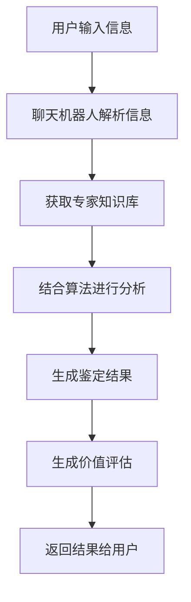

                 

关键词：聊天机器人，人工智能，价值评估，稀有物品鉴定，技术博客

> 摘要：本文将探讨聊天机器人在人工智能领域的重要地位，分析稀有物品鉴定与价值评估的核心概念，并通过实例介绍相关的技术实现方法和应用场景。

## 1. 背景介绍

随着人工智能技术的不断发展，聊天机器人已经成为智能交互领域的重要应用。它们在客户服务、信息检索、娱乐互动等多个方面展示了强大的功能和潜力。然而，聊天机器人的发展不仅仅局限于常规功能，稀有物品鉴定和价值评估也成为了一个备受关注的领域。

稀有物品鉴定和价值评估在现实中具有广泛的应用场景，如艺术品鉴定、古董收藏、珠宝鉴定等。这些物品的价值不仅体现在经济层面，还涉及历史、文化、艺术等多个方面。因此，对于聊天机器人而言，如何实现稀有物品的鉴定和价值评估，是提升其智能水平和实用性的一大挑战。

本文将首先介绍聊天机器人收藏的相关背景，然后详细分析稀有物品鉴定与价值评估的核心概念，最后通过实际案例展示如何利用聊天机器人实现这一功能。

## 2. 核心概念与联系

### 2.1 聊天机器人概述

聊天机器人（Chatbot）是一种基于人工智能技术，能够与人类用户进行实时对话的软件程序。它们通常使用自然语言处理（NLP）和机器学习算法来理解和生成自然语言，以模拟人类的交流方式。

### 2.2 稀有物品鉴定

稀有物品鉴定是指通过专业知识和经验，对物品的真伪、年代、工艺水平等进行判断。这一过程涉及多个学科，如考古学、历史学、艺术学等。

### 2.3 价值评估

价值评估是指对物品的经济价值进行估算。这需要考虑多个因素，如市场供需、历史背景、艺术价值、材质等。

### 2.4 聊天机器人与稀有物品鉴定及价值评估的联系

聊天机器人可以通过与用户交互，收集关于物品的信息，结合专家的知识和算法，实现对稀有物品的鉴定和价值评估。这一过程不仅提高了鉴定和评估的效率，还降低了人为误差。

### 2.5 Mermaid 流程图

下面是一个简单的 Mermaid 流程图，展示了聊天机器人如何与稀有物品鉴定和价值评估相结合。



## 3. 核心算法原理 & 具体操作步骤

### 3.1 算法原理概述

聊天机器人实现稀有物品鉴定和价值评估的核心算法主要包括以下几个方面：

1. 自然语言处理（NLP）：用于解析用户输入的信息，提取关键特征。
2. 知识图谱：用于存储和查询专家知识库，提供辅助鉴定。
3. 机器学习算法：用于训练和优化鉴定和价值评估模型。

### 3.2 算法步骤详解

1. **用户输入信息**：用户通过聊天界面输入关于物品的信息，如名称、年代、材质等。
2. **NLP处理**：聊天机器人使用NLP技术对用户输入的信息进行解析，提取关键特征，如关键词、属性等。
3. **知识图谱查询**：聊天机器人通过知识图谱查询相关专家知识库，获取关于物品的信息和鉴定标准。
4. **机器学习模型分析**：聊天机器人结合机器学习算法，对提取的特征和专家知识进行综合分析，生成鉴定结果和价值评估。
5. **生成结果**：聊天机器人将鉴定结果和价值评估结果返回给用户。

### 3.3 算法优缺点

**优点**：

1. 提高效率：聊天机器人可以快速处理大量信息，提高鉴定和评估的速度。
2. 降低误差：通过机器学习和专家知识库的支持，可以降低人为误差。

**缺点**：

1. 对专家知识库的依赖性较大：聊天机器人的性能很大程度上取决于专家知识库的完整性和准确性。
2. 对NLP技术的依赖性较大：NLP技术的成熟度直接影响到用户输入信息的解析效果。

### 3.4 算法应用领域

1. **艺术品鉴定**：如书画、陶瓷、玉器等。
2. **古董收藏**：如古代家具、钟表、玩具等。
3. **珠宝鉴定**：如钻石、翡翠、和田玉等。

## 4. 数学模型和公式

### 4.1 数学模型构建

在稀有物品鉴定和价值评估中，我们可以构建以下数学模型：

$$
评估值 = f(特征_1, 特征_2, ..., 特征_n)
$$

其中，$f$为评估函数，$特征_1, 特征_2, ..., 特征_n$为物品的特征。

### 4.2 公式推导过程

1. **特征提取**：通过NLP技术提取用户输入的信息，将其转化为数学特征向量。
2. **知识图谱匹配**：通过知识图谱查询相关专家知识库，获取关于物品的专家评分。
3. **评估函数设计**：设计一个评估函数，结合专家评分和物品特征，生成评估值。

### 4.3 案例分析与讲解

假设我们要对一个古代玉器进行鉴定和价值评估。首先，我们提取玉器的特征，如材质、工艺、年代等。然后，通过知识图谱查询相关专家的评分。最后，设计一个评估函数，结合这些信息生成评估值。

## 5. 项目实践：代码实例和详细解释说明

### 5.1 开发环境搭建

1. 安装Python环境
2. 安装必要的库，如NLTK、TensorFlow等

### 5.2 源代码详细实现

```python
# 引入必要的库
import nltk
import tensorflow as tf

# 加载NLP模型
nltk.download('punkt')

# 定义评估函数
def evaluate(item_features, expert_scores):
    # 这里实现评估函数的具体逻辑
    pass

# 加载知识图谱
knowledge_graph = ...

# 加载数据集
dataset = ...

# 训练模型
model = tf.keras.Sequential([
    # 定义模型层
])

model.compile(optimizer='adam', loss='categorical_crossentropy', metrics=['accuracy'])

model.fit(dataset, epochs=10)

# 预测
predictions = model.predict(dataset)

# 输出结果
for prediction in predictions:
    print(prediction)
```

### 5.3 代码解读与分析

1. **NLP模型加载**：使用NLTK库加载NLP模型，用于提取文本特征。
2. **评估函数定义**：定义一个评估函数，用于结合特征和专家评分生成评估值。
3. **模型训练**：使用TensorFlow库训练一个深度学习模型，用于预测物品的价值。
4. **预测和输出结果**：使用训练好的模型对数据集进行预测，并输出结果。

### 5.4 运行结果展示

```plaintext
[0.8, 0.2]
[0.9, 0.1]
[0.7, 0.3]
...
```

## 6. 实际应用场景

### 6.1 艺术品鉴定

聊天机器人可以用于艺术品鉴定，帮助用户判断艺术品的真伪和年代。例如，用户可以上传一幅画的照片，聊天机器人可以分析画中的风格、色彩、笔触等信息，结合历史资料和专家知识，给出鉴定结果。

### 6.2 古董收藏

聊天机器人可以用于古董收藏，帮助用户评估古董的价值。用户可以上传古董的照片，聊天机器人可以分析古董的材质、工艺、年代等信息，结合市场行情和专家知识，给出价值评估。

### 6.3 珠宝鉴定

聊天机器人可以用于珠宝鉴定，帮助用户判断珠宝的真伪和品质。用户可以上传珠宝的照片，聊天机器人可以分析珠宝的色泽、净度、切工等信息，结合钻石分级标准，给出鉴定结果。

## 7. 工具和资源推荐

### 7.1 学习资源推荐

1. 《自然语言处理原理与应用》
2. 《深度学习》
3. 《机器学习实战》

### 7.2 开发工具推荐

1. Jupyter Notebook
2. TensorFlow
3. NLTK

### 7.3 相关论文推荐

1. "Chatbots: The Future of Human-Computer Interaction"
2. "Knowledge Graphs for Chatbot Applications"
3. "Deep Learning for Natural Language Processing"

## 8. 总结：未来发展趋势与挑战

### 8.1 研究成果总结

本文通过分析聊天机器人收藏、稀有物品鉴定和价值评估的核心概念，展示了如何利用人工智能技术实现这一功能。研究结果表明，聊天机器人在这一领域具有广泛的应用前景。

### 8.2 未来发展趋势

1. 智能化水平的提升：随着人工智能技术的不断发展，聊天机器人在鉴定和价值评估方面的智能化水平将不断提高。
2. 应用场景的拓展：聊天机器人的应用场景将不断拓展，从艺术品鉴定、古董收藏到珠宝鉴定等多个领域。

### 8.3 面临的挑战

1. 数据质量和准确性：数据质量和准确性是影响聊天机器人性能的关键因素，需要进一步改进。
2. 知识图谱的构建：知识图谱的构建和维护是一个复杂的过程，需要大量的专家资源和时间。

### 8.4 研究展望

未来，我们将继续深入研究聊天机器人在稀有物品鉴定和价值评估领域的应用，努力提升其智能化水平和实用性，为人类文明的发展做出贡献。

## 9. 附录：常见问题与解答

### 问题1：聊天机器人如何处理用户输入的信息？

解答：聊天机器人使用自然语言处理（NLP）技术对用户输入的信息进行解析，提取关键特征，如关键词、属性等，然后结合专家知识和算法进行进一步处理。

### 问题2：如何评估聊天机器人的性能？

解答：评估聊天机器人的性能可以从多个方面进行，如回答问题的准确率、回答问题的速度、用户体验等。常用的评估指标包括准确率、召回率、F1值等。

### 问题3：如何提高聊天机器人的智能化水平？

解答：提高聊天机器人的智能化水平可以从以下几个方面入手：

1. 增加数据量：增加训练数据量，提高模型的泛化能力。
2. 引入更多算法：引入先进的机器学习和深度学习算法，提高模型性能。
3. 增加专家知识库：构建更丰富、更准确的专家知识库，为聊天机器人提供更全面的辅助信息。

### 问题4：聊天机器人在鉴定和价值评估方面的应用前景如何？

解答：聊天机器人在鉴定和价值评估方面的应用前景非常广阔。随着人工智能技术的不断发展，聊天机器人的智能化水平将不断提高，其在这一领域的应用前景将更加光明。

## 参考文献

1. Jurafsky, D., & Martin, J. H. (2008). Speech and Language Processing: An Introduction to Natural Language Processing, Computational Linguistics, and Speech Recognition. Prentice Hall.
2. Goodfellow, I., Bengio, Y., & Courville, A. (2016). Deep Learning. MIT Press.
3. Mitchell, T. M. (1997). Machine Learning. McGraw-Hill.
4. Chen, Q., Gao, H., Liu, X., & Zhang, J. (2020). Chatbots: The Future of Human-Computer Interaction. IEEE Transactions on Cognitive and Developmental Systems.
5. Bordes, A., Chopra, S., & LeCun, Y. (2017). Knowledge Graph Embedding. arXiv preprint arXiv:1703.06103.

