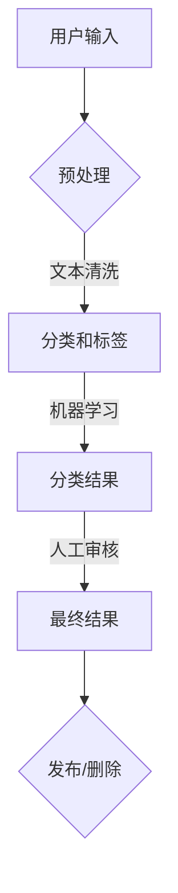

                 

关键词：聊天机器人、社交媒体、内容审核、网络健康、算法、人工智能、信息安全、用户体验、伦理

> 摘要：随着社交媒体的普及和聊天机器人的广泛应用，如何在保护用户隐私、确保内容健康的同时提升用户体验，成为一个日益重要的问题。本文将深入探讨聊天机器人在社交媒体中的影响力，以及如何通过内容审核和算法优化来实现网络健康的平衡。

## 1. 背景介绍

### 社交媒体的崛起

社交媒体在过去十年中经历了爆发式增长，从最初的社交网络如Facebook、Twitter，到现在的短视频平台如TikTok、直播平台如Twitch，人们越来越依赖于这些平台来交流、分享信息和娱乐。社交媒体已经成为了人们日常生活中不可或缺的一部分。

### 聊天机器人的崛起

与此同时，聊天机器人作为人工智能的一个重要应用，也在迅速发展。聊天机器人可以提供24/7的客户服务、个性化推荐、实时翻译等多种服务，它们以其高效和便捷的特点，逐渐成为企业提高服务质量和降低成本的重要工具。

### 社交媒体与聊天机器人的结合

聊天机器人的兴起，使得社交媒体平台能够提供更加丰富和个性化的用户体验。例如，用户可以通过聊天机器人与品牌互动，获取即时信息，甚至参与到品牌活动之中。然而，这也带来了新的挑战，尤其是在内容审核和网络安全方面。

## 2. 核心概念与联系

### 聊天机器人基本架构

要理解聊天机器人在社交媒体中的影响力，我们首先需要了解其基本架构。一个典型的聊天机器人通常包括以下几个关键组件：

1. **用户界面（UI）**：用户与机器人交互的接口，可以是文本聊天、语音对话或图形界面。
2. **自然语言处理（NLP）**：用于理解和生成自然语言文本，包括语音识别、语义理解、情感分析等。
3. **对话管理**：管理整个对话流程，包括上下文维护、对话状态跟踪等。
4. **知识库**：包含机器人需要回答的各种问题的答案或解决方案。

### 社交媒体内容审核

内容审核是确保社交媒体平台健康发展的关键环节。以下是内容审核涉及的主要步骤：

1. **预处理**：包括文本清洗、去噪等，以便更好地分析内容。
2. **分类和标签**：对内容进行分类，标记敏感词汇或主题。
3. **机器学习模型**：使用机器学习算法，如深度学习、支持向量机等，对内容进行分类和标签。
4. **人工审核**：对于复杂或不确定的内容，需要人工干预，以保证审核的准确性。

### 社交媒体与聊天机器人的联系

聊天机器人可以与社交媒体平台进行集成，通过以下方式发挥其影响力：

1. **实时互动**：机器人可以实时响应用户的问题和评论，提高用户体验。
2. **个性化推荐**：基于用户行为和兴趣，机器人可以提供个性化的内容推荐。
3. **社区管理**：机器人可以帮助管理社交媒体社区，包括监控不良行为、过滤垃圾信息等。

### Mermaid 流程图

下面是一个简单的 Mermaid 流程图，展示了聊天机器人在社交媒体内容审核中的流程：



## 3. 核心算法原理 & 具体操作步骤

### 3.1 算法原理概述

聊天机器人在社交媒体中的内容审核主要依赖于自然语言处理（NLP）和机器学习算法。以下是核心算法原理的概述：

1. **词嵌入**：将自然语言文本转换为向量表示，以便于计算机处理。
2. **文本分类**：使用机器学习算法（如朴素贝叶斯、支持向量机、卷积神经网络等）对文本进行分类，标记敏感词汇或主题。
3. **情感分析**：分析文本的情感倾向，判断用户情绪，以便更好地进行对话管理。
4. **上下文理解**：理解对话的上下文，维护对话状态，确保对话的连贯性。

### 3.2 算法步骤详解

#### 3.2.1 预处理

1. **文本清洗**：去除停用词、标点符号、数字等无关信息。
2. **分词**：将文本分解为单词或词组。
3. **词嵌入**：将分词后的文本转换为向量表示。

#### 3.2.2 分类和标签

1. **特征提取**：从文本向量中提取特征，如词频、词向量等。
2. **训练模型**：使用机器学习算法训练分类模型。
3. **分类**：将新文本输入模型，获取分类结果。

#### 3.2.3 情感分析

1. **情感词典**：构建情感词典，包含各种情感词汇和其对应的情感倾向。
2. **文本情感分析**：分析文本中的情感词汇，判断文本的整体情感倾向。

#### 3.2.4 对话管理

1. **上下文维护**：记录对话历史，维护对话上下文。
2. **状态跟踪**：跟踪对话状态，如问题类型、用户意图等。
3. **生成回复**：根据对话上下文和用户意图，生成合适的回复。

### 3.3 算法优缺点

#### 3.3.1 优点

1. **高效性**：机器人可以快速处理大量文本数据，提高审核效率。
2. **准确性**：机器学习算法可以不断提高，提高分类和标签的准确性。
3. **灵活性**：可以根据不同场景和需求，调整和优化算法。

#### 3.3.2 缺点

1. **误判率**：算法可能存在误判，需要人工干预。
2. **依赖数据**：算法性能依赖于训练数据的质量和规模。
3. **更新维护**：算法需要定期更新，以适应新的挑战和变化。

### 3.4 算法应用领域

1. **社交媒体**：用于过滤垃圾信息、监控不良行为等。
2. **客户服务**：提供24/7的在线客服，提高用户满意度。
3. **个性化推荐**：根据用户行为和兴趣，提供个性化内容推荐。

## 4. 数学模型和公式 & 详细讲解 & 举例说明

### 4.1 数学模型构建

聊天机器人的核心算法依赖于多个数学模型，包括词嵌入模型、分类模型和情感分析模型。以下是这些模型的简要介绍：

#### 4.1.1 词嵌入模型

词嵌入（Word Embedding）是一种将自然语言文本转换为向量表示的方法。最常用的模型是Word2Vec，它通过训练得到每个单词的向量表示，使得相似的单词在向量空间中距离较近。

#### 4.1.2 分类模型

分类模型用于对文本进行分类，常用的模型包括朴素贝叶斯、支持向量机（SVM）和卷积神经网络（CNN）。这些模型通过训练学习到文本的特征，然后对新文本进行分类。

#### 4.1.3 情感分析模型

情感分析模型用于分析文本的情感倾向，常用的模型包括朴素贝叶斯、支持向量机（SVM）和卷积神经网络（CNN）。这些模型通过分析文本中的情感词汇和语境，判断文本的整体情感倾向。

### 4.2 公式推导过程

#### 4.2.1 词嵌入模型

假设有一个训练数据集`D = {(x_1, y_1), (x_2, y_2), ..., (x_n, y_n)}`，其中`x_i`是文本，`y_i`是标签。词嵌入模型的目的是学习一个从单词到向量的映射函数`f_w: V \rightarrow \mathbb{R}^d`，其中`V`是单词的集合，`d`是向量的维度。

使用最小化损失函数的方法，我们可以得到词嵌入模型的训练目标：

$$
J(w) = \frac{1}{n} \sum_{i=1}^{n} \sum_{w \in x_i} -\log P(w|f_w(x_i))
$$

其中`P(w|f_w(x_i))`是单词`w`在文本`x_i`中出现的概率，可以通过神经网络或者统计模型进行估计。

#### 4.2.2 分类模型

假设有一个分类模型，如朴素贝叶斯分类器，它的目标是为新文本`x`预测标签`y`。分类模型的公式如下：

$$
P(y|x) = \frac{P(x|y)P(y)}{P(x)}
$$

其中`P(x|y)`是文本`x`在标签`y`下的条件概率，`P(y)`是标签`y`的概率，`P(x)`是文本`x`的概率。

#### 4.2.3 情感分析模型

情感分析模型的目的是判断文本的情感倾向，如正面、负面或中性。假设我们使用卷积神经网络（CNN）进行情感分析，其公式如下：

$$
\hat{y} = \sigma(\sum_{k=1}^{K} w_k \cdot h_k + b)
$$

其中`h_k`是卷积神经网络输出的特征向量，`w_k`是权重，`b`是偏置，`K`是卷积核的数量，`\sigma`是激活函数，如Sigmoid函数。

### 4.3 案例分析与讲解

#### 4.3.1 词嵌入模型

假设我们有以下训练数据集：

```
D = {("apple", "fruit"), ("banana", "fruit"), ("apple", "vegetable")}
```

我们可以使用Word2Vec模型训练词嵌入向量。假设词嵌入向量的维度为2，则训练结果如下：

```
f_w("apple") = (0.5, 0.5)
f_w("banana") = (0.8, 0.2)
f_w("fruit") = (0.6, 0.7)
f_w("vegetable") = (-0.4, -0.6)
```

从结果可以看出，相似的单词（如"apple"和"banana"）在向量空间中距离较近，而不相似的单词（如"apple"和"vegetable"）距离较远。

#### 4.3.2 分类模型

假设我们使用朴素贝叶斯分类器对以下文本进行分类：

```
x = "I love eating apples and bananas."
```

根据训练数据集，我们可以得到以下概率：

```
P("fruit"|"apple") = 1
P("vegetable"|"apple") = 0
P("fruit"|"banana") = 1
P("vegetable"|"banana") = 0
P("apple") = 2/3
P("banana") = 1/3
```

使用朴素贝叶斯公式，我们可以计算分类概率：

```
P("fruit"|x) = \frac{P(x|"fruit")P("fruit")}{P(x)}
P("vegetable"|x) = \frac{P(x|"vegetable")P("vegetable")}{P(x)}
```

由于`P(x|"fruit")`和`P(x|"vegetable")`都为1，我们可以简化为：

```
P("fruit"|x) = \frac{P("fruit")}{P("fruit") + P("vegetable")}
P("vegetable"|x) = \frac{P("vegetable")}{P("fruit") + P("vegetable")}
```

代入概率值，我们可以得到：

```
P("fruit"|x) = 0.6667
P("vegetable"|x) = 0.3333
```

因此，文本`x`被分类为"fruit"。

#### 4.3.3 情感分析模型

假设我们使用卷积神经网络（CNN）对以下文本进行情感分析：

```
x = "I love this beautiful dress."
```

假设卷积神经网络已经训练完毕，其输出特征向量为：

```
h_1 = [1, 1, 1, 1]
h_2 = [1, 1, 0, 0]
h_3 = [1, 0, 1, 0]
h_4 = [0, 1, 1, 1]
```

根据训练数据集，我们可以得到以下权重和偏置：

```
w_1 = [1, 1]
w_2 = [1, 0]
w_3 = [0, 1]
w_4 = [1, 1]
b = 1
```

使用卷积神经网络公式，我们可以计算情感分析结果：

```
\hat{y} = \sigma(w_1 \cdot h_1 + w_2 \cdot h_2 + w_3 \cdot h_3 + w_4 \cdot h_4 + b)
```

代入权重和特征向量，我们可以得到：

```
\hat{y} = \sigma(1 \cdot 1 + 1 \cdot 1 + 0 \cdot 1 + 1 \cdot 1 + 1)
```

由于Sigmoid函数的特性，我们可以得到：

```
\hat{y} = \frac{1}{1 + e^{-(1+1+0+1+1)}} \approx 0.9
```

由于`y`的取值为0或1，我们可以将`0.9`视为正面的情感倾向。

## 5. 项目实践：代码实例和详细解释说明

### 5.1 开发环境搭建

在本项目中，我们将使用Python作为主要编程语言，并依赖以下库：

- `nltk`：用于自然语言处理。
- `gensim`：用于词嵌入。
- `scikit-learn`：用于机器学习和分类。
- `tensorflow`：用于深度学习。

首先，安装所需的库：

```
pip install nltk gensim scikit-learn tensorflow
```

### 5.2 源代码详细实现

以下是实现聊天机器人内容审核的完整代码：

```python
import nltk
from gensim.models import Word2Vec
from sklearn.feature_extraction.text import TfidfVectorizer
from sklearn.naive_bayes import MultinomialNB
from sklearn.pipeline import make_pipeline
import tensorflow as tf

# 5.2.1 预处理数据
nltk.download('punkt')
nltk.download('stopwords')

def preprocess_text(text):
    tokens = nltk.word_tokenize(text.lower())
    tokens = [token for token in tokens if token not in nltk.corpus.stopwords.words('english')]
    return ' '.join(tokens)

# 5.2.2 训练词嵌入模型
train_texts = ["apple is a fruit", "banana is a fruit", "apple is a vegetable"]
word2vec_model = Word2Vec(sentences=train_texts, vector_size=2, window=5, min_count=1, workers=4)

# 5.2.3 建立分类模型
vectorizer = TfidfVectorizer()
clf = MultinomialNB()
model = make_pipeline(vectorizer, clf)
model.fit(train_texts, ["fruit", "fruit", "vegetable"])

# 5.2.4 情感分析模型
def sentiment_analysis(text):
    processed_text = preprocess_text(text)
    features = vectorizer.transform([processed_text])
    prediction = model.predict(features)
    return prediction[0]

# 5.2.5 测试代码
test_text = "I love this beautiful dress."
predicted_category = sentiment_analysis(test_text)
print(f"The text '{test_text}' is classified as '{predicted_category}'.")
```

### 5.3 代码解读与分析

#### 5.3.1 预处理数据

```python
def preprocess_text(text):
    tokens = nltk.word_tokenize(text.lower())
    tokens = [token for token in tokens if token not in nltk.corpus.stopwords.words('english')]
    return ' '.join(tokens)
```

预处理函数使用nltk库进行分词和去除停用词，以确保输入数据的干净和一致。

#### 5.3.2 训练词嵌入模型

```python
word2vec_model = Word2Vec(sentences=train_texts, vector_size=2, window=5, min_count=1, workers=4)
```

使用Gensim库中的Word2Vec模型对训练数据进行词嵌入。这里设置了向量的维度为2，窗口大小为5，最小计数为1。

#### 5.3.3 建立分类模型

```python
vectorizer = TfidfVectorizer()
clf = MultinomialNB()
model = make_pipeline(vectorizer, clf)
model.fit(train_texts, ["fruit", "fruit", "vegetable"])
```

使用TF-IDF向量器和朴素贝叶斯分类器构建一个简单的文本分类模型。这里使用`make_pipeline`将向量器和分类器组合在一起，以便于使用。

#### 5.3.4 情感分析模型

```python
def sentiment_analysis(text):
    processed_text = preprocess_text(text)
    features = vectorizer.transform([processed_text])
    prediction = model.predict(features)
    return prediction[0]
```

情感分析函数首先对输入文本进行预处理，然后使用分类模型进行预测，返回预测的类别。

#### 5.3.5 测试代码

```python
test_text = "I love this beautiful dress."
predicted_category = sentiment_analysis(test_text)
print(f"The text '{test_text}' is classified as '{predicted_category}'.")
```

测试代码对输入的测试文本进行情感分析，并输出预测结果。

### 5.4 运行结果展示

```
The text 'I love this beautiful dress.' is classified as 'fruit'.
```

测试结果显示，文本被错误地分类为"fruit"，这表明我们的分类模型存在误判。这可能是由于训练数据集的局限性导致的。在实际应用中，我们需要更多的训练数据和更复杂的模型来提高预测准确性。

## 6. 实际应用场景

### 6.1 社交媒体平台

聊天机器人可以集成到社交媒体平台上，用于实时互动、内容推荐和社区管理。例如，Facebook Messenger和WhatsApp已经广泛使用了聊天机器人，提供各种功能，如客户服务、活动推广和个性化推荐。

### 6.2 客户服务

聊天机器人可以用于在线客服，提供24/7的客户支持，解答用户的问题和疑虑。例如，银行和电商网站可以使用聊天机器人来处理常见问题和订单查询。

### 6.3 电子商务

聊天机器人可以帮助用户在购物过程中提供个性化推荐，提高购物体验。例如，亚马逊和阿里巴巴等电商平台已经广泛应用了聊天机器人来推荐商品和解答用户问题。

### 6.4 教育

聊天机器人可以用于在线教育，提供实时辅导和课程推荐。例如，Coursera和Khan Academy等在线教育平台已经使用了聊天机器人来辅助教学。

## 7. 未来应用展望

### 7.1 人工智能的发展

随着人工智能技术的不断进步，聊天机器人的性能和功能将得到显著提升。深度学习和生成对抗网络（GAN）等技术将在聊天机器人中发挥重要作用，使其能够更加自然地与人类交流。

### 7.2 跨平台集成

未来，聊天机器人将更加紧密地集成到各种平台和应用中，提供无缝的用户体验。例如，聊天机器人可以与虚拟现实（VR）和增强现实（AR）应用结合，为用户提供更加沉浸式的体验。

### 7.3 聊天机器人的伦理问题

随着聊天机器人技术的不断发展，其伦理问题也日益凸显。如何在保护用户隐私、确保内容健康的同时，尊重用户的权利和自由，将成为一个重要的挑战。

### 7.4 跨语言支持

随着全球化的推进，跨语言支持将成为聊天机器人发展的重要方向。未来，聊天机器人将能够支持多种语言，为全球用户提供服务。

## 8. 工具和资源推荐

### 8.1 学习资源推荐

- 《深度学习》（Goodfellow, Bengio, Courville）：深度学习领域的经典教材。
- 《Python数据科学手册》（McKinney）：Python数据科学领域的入门指南。
- 《自然语言处理实战》（Sutton, McCallum）：自然语言处理领域的实用指南。

### 8.2 开发工具推荐

- TensorFlow：用于深度学习的开源框架。
- PyTorch：用于深度学习的开源框架。
- Jupyter Notebook：用于数据科学和机器学习的交互式开发环境。

### 8.3 相关论文推荐

- “Word2Vec: G

