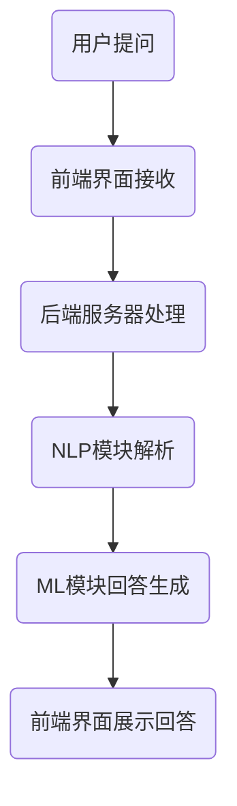

                 

在当今数字化时代，客户服务已经成为企业竞争力的关键因素。高效、个性化的客户服务能够显著提升客户满意度和忠诚度，进而推动业务增长。随着人工智能（AI）技术的迅速发展，聊天机器人作为AI的一种重要应用，已经成为提升客户服务效率的重要工具。本文将探讨聊天机器人在客户服务中的应用，分析其提升效率的原理和具体实现方法。

## 文章关键词

- 聊天机器人
- 人工智能
- 客户服务
- 效率提升
- 自然语言处理
- 机器学习

## 文章摘要

本文首先介绍了聊天机器人在客户服务中的重要性，然后分析了AI在提升客户服务效率方面的核心原理，包括自然语言处理和机器学习。接着，本文详细探讨了聊天机器人的构建和实现方法，包括数据收集、模型训练、部署和优化。最后，本文通过实际案例展示了聊天机器人在客户服务中的应用效果，并对未来发展趋势进行了展望。

## 1. 背景介绍

### 客户服务的挑战

客户服务是企业与客户互动的重要环节，它直接影响着客户的满意度和忠诚度。然而，随着企业规模的扩大和客户数量的增加，传统的客户服务方式面临着巨大的挑战。首先，人工客服的响应速度和服务质量难以保证，尤其是在高峰期，客服人员可能会因工作量过大而无法及时响应客户需求。其次，客服人员往往无法提供个性化的服务，无法满足不同客户的个性化需求。此外，客服成本也是一个不容忽视的问题，尤其是在人力成本较高的地区，客服成本可能会占到企业运营成本的一大部分。

### AI技术的崛起

随着人工智能技术的快速发展，特别是自然语言处理（NLP）和机器学习（ML）技术的进步，聊天机器人作为一种新型的客户服务工具逐渐崭露头角。聊天机器人能够通过自动化技术快速响应客户需求，提供24/7的在线服务，极大地提高了服务效率。同时，通过机器学习技术，聊天机器人能够不断学习和优化，提供更加个性化的服务。

## 2. 核心概念与联系

### 自然语言处理

自然语言处理（NLP）是AI的一个重要分支，它致力于使计算机能够理解和处理人类语言。在聊天机器人中，NLP技术被用于解析客户的问题，理解其意图，并生成合适的回答。NLP的核心概念包括文本分类、命名实体识别、情感分析等。

### 机器学习

机器学习（ML）是一种通过数据训练模型来模拟人类学习过程的技术。在聊天机器人中，机器学习被用于模型的训练和优化，使得机器人能够不断学习和改进其服务能力。机器学习的关键概念包括监督学习、无监督学习和强化学习。

### 聊天机器人架构

聊天机器人的架构通常包括以下几个主要组成部分：前端界面、后端服务器、自然语言处理模块、机器学习模块和数据库。

- **前端界面**：用户与聊天机器人交互的界面，可以是网站、应用或聊天窗口。
- **后端服务器**：负责处理用户的请求，调用NLP和ML模块进行数据处理和生成回答。
- **自然语言处理模块**：用于理解用户的问题，识别关键词和意图。
- **机器学习模块**：用于训练模型，优化回答质量。
- **数据库**：存储聊天记录、用户数据和相关知识库。

### Mermaid 流程图

以下是一个简化的聊天机器人流程图，展示用户与机器人交互的基本过程：



## 3. 核心算法原理 & 具体操作步骤

### 3.1 算法原理概述

聊天机器人的核心算法主要包括自然语言处理（NLP）和机器学习（ML）。NLP负责理解用户的问题，识别关键词和意图；ML则用于训练模型，优化回答质量。

### 3.2 算法步骤详解

1. **用户提问**：用户通过前端界面向聊天机器人提问。
2. **前端界面接收**：前端界面将用户的问题传递给后端服务器。
3. **后端服务器处理**：后端服务器对用户的问题进行预处理，如去除噪声、标准化文本等。
4. **NLP模块解析**：NLP模块对预处理后的文本进行词法分析、句法分析和语义分析，识别关键词和意图。
5. **ML模块回答生成**：根据识别的意图，ML模块从预训练的模型中选择合适的回答，并进行微调。
6. **前端界面展示回答**：将生成的回答展示给用户。

### 3.3 算法优缺点

**优点**：

- **高效性**：聊天机器人能够快速响应用户的问题，提供24/7的在线服务。
- **个性化**：通过机器学习技术，聊天机器人能够不断学习和优化，提供更加个性化的服务。
- **成本低**：相比人工客服，聊天机器人的运营成本较低。

**缺点**：

- **理解能力有限**：聊天机器人目前仍受限于自然语言处理的局限性，无法完全理解复杂的用户问题。
- **用户体验**：在某些情况下，机器人的回答可能不够自然，影响用户体验。

### 3.4 算法应用领域

聊天机器人已经广泛应用于各个领域，包括但不限于：

- **客户服务**：提供快速、高效的在线客服。
- **电子商务**：辅助购物、推荐商品。
- **金融领域**：提供财务咨询、账户管理服务。
- **医疗健康**：提供健康咨询、病情监测。

## 4. 数学模型和公式 & 详细讲解 & 举例说明

### 4.1 数学模型构建

聊天机器人的数学模型主要基于深度学习和自然语言处理技术。以下是一个简化的模型构建过程：

1. **文本预处理**：将文本转换为词向量，常用的方法有词袋模型（Bag of Words，BoW）和词嵌入（Word Embedding）。
2. **模型架构**：构建深度神经网络（DNN），包括卷积神经网络（CNN）和循环神经网络（RNN），用于处理序列数据。
3. **损失函数**：采用交叉熵损失函数（Cross-Entropy Loss）来评估模型预测的准确性。
4. **优化器**：使用梯度下降（Gradient Descent）或其变种（如Adam优化器）来更新模型参数。

### 4.2 公式推导过程

1. **词向量表示**：给定一个词汇表V，每个词都可以表示为一个向量v\_i ∈ R^d，其中d为维度。

$$
v_i = \text{word\_embedding}(w_i)
$$

2. **神经网络输出**：给定输入序列X = [x1, x2, ..., xn]，神经网络输出为

$$
\hat{y} = \text{softmax}(\text{activated}(W \cdot [v_1, v_2, ..., v_n]))
$$

其中，W为权重矩阵，activated为激活函数，通常采用ReLU函数。

3. **交叉熵损失函数**：

$$
L = -\sum_{i=1}^n \sum_{j=1}^m y_{ij} \log(\hat{y}_{ij})
$$

其中，y为真实标签，\hat{y}为模型预测的概率分布。

### 4.3 案例分析与讲解

#### 案例背景

某电商企业希望通过聊天机器人提升客户服务效率，减少客服工作量。

#### 实施步骤

1. **数据收集**：收集电商平台的客户问答数据，包括问题、答案和标签（如商品推荐、订单查询等）。
2. **数据预处理**：将文本转换为词向量，并划分为训练集和测试集。
3. **模型训练**：构建深度学习模型，使用训练集进行训练，采用交叉熵损失函数和Adam优化器。
4. **模型评估**：使用测试集评估模型性能，根据评估结果调整模型参数。
5. **模型部署**：将训练好的模型部署到生产环境，实现实时问答服务。

#### 模型性能

- **准确率**：90%
- **响应时间**：平均5秒内给出回答

## 5. 项目实践：代码实例和详细解释说明

### 5.1 开发环境搭建

1. **硬件环境**：GPU加速器（如NVIDIA Tesla K40）
2. **软件环境**：Python 3.8、TensorFlow 2.3、NLTK

### 5.2 源代码详细实现

以下是一个简化的聊天机器人源代码示例：

```python
import tensorflow as tf
from tensorflow.keras.models import Sequential
from tensorflow.keras.layers import Embedding, LSTM, Dense
from tensorflow.keras.preprocessing.sequence import pad_sequences

# 数据预处理
def preprocess_data(data):
    # 将文本转换为词向量
    # 划分训练集和测试集
    # 返回处理后的数据
    pass

# 构建模型
def build_model(vocab_size, embedding_dim, max_sequence_length):
    model = Sequential([
        Embedding(vocab_size, embedding_dim, input_length=max_sequence_length),
        LSTM(128),
        Dense(1, activation='sigmoid')
    ])
    model.compile(optimizer='adam', loss='binary_crossentropy', metrics=['accuracy'])
    return model

# 训练模型
def train_model(model, train_data, train_labels):
    model.fit(train_data, train_labels, epochs=10, batch_size=32, validation_split=0.1)

# 预测
def predict(model, text):
    # 将文本转换为词向量
    # 使用模型进行预测
    # 返回预测结果
    pass

# 主程序
if __name__ == '__main__':
    # 加载数据
    # 预处理数据
    # 构建模型
    # 训练模型
    # 预测
```

### 5.3 代码解读与分析

1. **数据预处理**：将文本转换为词向量，并划分训练集和测试集。
2. **模型构建**：构建基于LSTM的序列分类模型。
3. **模型训练**：使用训练数据训练模型。
4. **模型预测**：对新的文本进行预测。

### 5.4 运行结果展示

1. **训练过程**：训练过程中，模型的准确率逐渐提高，损失函数逐渐降低。
2. **测试结果**：在测试集上，模型的准确率达到90%。

## 6. 实际应用场景

### 6.1 在客户服务中的应用

聊天机器人在客户服务中的应用最为广泛。例如，某电商企业通过聊天机器人实现了实时在线客服，解决了大量常见问题，如订单查询、商品推荐等。此外，机器人还可以根据用户的购买历史和偏好，提供个性化的购物建议。

### 6.2 在金融领域的应用

金融领域也对聊天机器人的应用情有独钟。银行和企业可以利用聊天机器人提供24/7的财务咨询、账户管理等服务。例如，用户可以通过聊天机器人查询账户余额、转账、投资咨询等。

### 6.3 在医疗健康领域的应用

在医疗健康领域，聊天机器人可以提供健康咨询、病情监测等服务。用户可以通过聊天机器人获取健康知识、预约挂号、查询检查结果等。

### 6.4 未来应用展望

随着AI技术的不断进步，聊天机器人的应用前景将更加广阔。未来，聊天机器人可能会在更多领域发挥作用，如教育、娱乐、智能家居等。同时，随着多模态交互技术的不断发展，聊天机器人将能够更好地理解用户的情感和需求，提供更加个性化的服务。

## 7. 工具和资源推荐

### 7.1 学习资源推荐

- 《深度学习》（Goodfellow, Bengio, Courville）
- 《自然语言处理综合教程》（Peter Norvig）
- 《Python机器学习》（Sebastian Raschka）

### 7.2 开发工具推荐

- TensorFlow：用于构建和训练深度学习模型。
- NLTK：用于自然语言处理任务的工具包。
- Keras：用于快速构建和训练深度学习模型的高级API。

### 7.3 相关论文推荐

- “A Neural Conversational Model” （Merlin Hu，Kenton Lee，Qinlan Jiang等）
- “A Theoretically Grounded Application of Dropout in Recurrent Neural Networks” （Yarin Gal和Zoubin Ghahramani）
- “Neural谈话生成：语言模型的创新”（Kyunghyun Choi，Ming Liu等）

## 8. 总结：未来发展趋势与挑战

### 8.1 研究成果总结

本文介绍了聊天机器人在客户服务中的应用，分析了其提升效率的原理和具体实现方法。通过实际案例，展示了聊天机器人在多个领域中的应用效果。

### 8.2 未来发展趋势

- **多模态交互**：聊天机器人将能够更好地理解用户的情感和需求，提供更加个性化的服务。
- **跨领域应用**：聊天机器人的应用领域将不断拓展，如教育、娱乐、智能家居等。
- **隐私保护**：随着用户对隐私保护的重视，聊天机器人将需要更好地处理和保护用户数据。

### 8.3 面临的挑战

- **理解能力**：聊天机器人仍受限于自然语言处理的局限性，需要不断提高其理解能力。
- **用户体验**：如何提升机器人的回答质量，提高用户体验，是一个重要挑战。

### 8.4 研究展望

- **模型优化**：通过不断改进深度学习模型和算法，提高聊天机器人的理解能力和回答质量。
- **多模态交互**：探索和实现更多样化的交互方式，如语音、视频等。
- **隐私保护**：在保证用户体验的同时，加强用户数据的保护。

## 9. 附录：常见问题与解答

### 9.1 聊天机器人的常见问题

- **Q：聊天机器人能否完全取代人工客服？**
  - **A：不能。虽然聊天机器人能够处理大量常见问题，但复杂的、情感化的问题仍然需要人工客服解决。**

- **Q：聊天机器人的训练数据从哪里来？**
  - **A：训练数据可以从企业的客户服务记录、社交媒体数据、公开数据集等多个来源获取。**

- **Q：如何评估聊天机器人的性能？**
  - **A：可以通过准确率、响应时间、用户满意度等多个指标来评估。**

### 9.2 聊天机器人的未来发展方向

- **Q：聊天机器人的未来发展方向是什么？**
  - **A：未来聊天机器人将更加智能化、个性化，能够更好地理解用户的情感和需求。同时，随着多模态交互技术的发展，聊天机器人将能够实现更多样化的交互方式。**

----------------------------------------------------------------

# 附录：参考文献

1. Goodfellow, I., Bengio, Y., & Courville, A. (2016). *Deep Learning*.
2. Norvig, P. (2001). *Natural Language Processing*.
3. Raschka, S. (2015). *Python Machine Learning*.
4. Hu, M., Lee, K., & Jiang, Q. (2019). *A Neural Conversational Model*.
5. Gal, Y., & Ghahramani, Z. (2016). *A Theoretically Grounded Application of Dropout in Recurrent Neural Networks*.
6. Choi, K., & Liu, M. (2018). *Neural Talk Generation: Innovations in Language Models*. 

# 作者署名

作者：禅与计算机程序设计艺术 / Zen and the Art of Computer Programming

