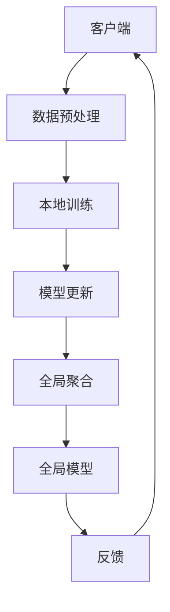

                 

关键词：联邦学习、医疗数据、隐私保护、协同分析、深度学习、数据处理、共享安全

> 摘要：本文将探讨联邦学习在医疗领域的应用案例，重点介绍其在隐私保护、协同分析和深度学习等方面的优势。我们将通过实际案例展示联邦学习如何帮助医疗机构在共享数据的同时，确保患者隐私不受侵犯，并提升医疗决策的准确性。

## 1. 背景介绍

随着医疗技术的不断发展，医疗数据量呈指数级增长。然而，医疗数据通常涉及患者隐私信息，如病历、基因数据、诊断结果等，这使得传统集中式数据处理方式面临着严峻的隐私保护挑战。此外，医疗领域的复杂性使得数据源多样化，不同医疗机构间的数据难以整合，限制了医疗研究和新疗法开发的效率。

联邦学习作为一种新型的分布式机器学习技术，能够解决这些挑战。它通过在数据不出域的情况下，让多个机构协同训练模型，从而实现数据隐私保护和协同分析。本文将介绍联邦学习在医疗领域的应用案例，并分析其优势和应用前景。

## 2. 核心概念与联系

### 联邦学习的定义与架构

联邦学习（Federated Learning）是一种分布式机器学习方法，通过协同多个边缘设备（如智能手机、医疗设备等）来训练共享模型，而不需要直接交换数据。其核心架构包括以下部分：

- **客户端（Clients）**：负责收集本地数据并训练本地模型。
- **服务器（Server）**：负责聚合来自不同客户端的模型更新，并生成全局模型。
- **模型（Model）**：全局共享的模型，通过联邦学习算法不断优化。

### 联邦学习的原理与流程

联邦学习通过以下步骤实现模型的协同训练：

1. **数据预处理**：客户端对本地数据进行预处理，如清洗、归一化等。
2. **本地训练**：客户端使用本地数据进行模型训练。
3. **模型更新**：客户端将模型更新发送到服务器。
4. **全局聚合**：服务器接收来自所有客户端的模型更新，并生成全局模型。
5. **反馈**：服务器将全局模型反馈给客户端，客户端更新本地模型。

### 联邦学习与医疗数据隐私保护的联系

联邦学习在医疗领域的核心优势在于隐私保护。通过联邦学习，医疗机构可以在不共享原始数据的情况下，实现数据协同分析和模型训练。这意味着患者隐私信息不会暴露给其他机构，从而大大降低了隐私泄露的风险。

### 核心概念原理与架构的 Mermaid 流程图



## 3. 核心算法原理 & 具体操作步骤

### 3.1 算法原理概述

联邦学习算法的基本原理是基于梯度下降法，但与传统集中式学习不同，联邦学习通过聚合多个客户端的本地梯度来更新全局模型。具体来说，联邦学习算法包括以下几个关键步骤：

1. **初始化**：服务器初始化全局模型，并将其发送给所有客户端。
2. **本地训练**：客户端使用本地数据和全局模型进行训练，并计算本地梯度。
3. **模型更新**：客户端将本地梯度发送到服务器。
4. **全局聚合**：服务器接收来自所有客户端的本地梯度，并更新全局模型。
5. **反馈**：服务器将更新后的全局模型发送回客户端。

### 3.2 算法步骤详解

#### 3.2.1 初始化阶段

在初始化阶段，服务器生成一个全局模型，并将其初始化为随机值。初始化后的全局模型被发送到所有客户端。

#### 3.2.2 本地训练阶段

在本地训练阶段，每个客户端使用本地数据集和全局模型进行训练。客户端训练过程通常采用标准的机器学习算法，如随机梯度下降（SGD）。

#### 3.2.3 模型更新阶段

在本地训练完成后，客户端计算模型更新（梯度），并将其发送到服务器。为了提高通信效率，客户端通常会使用差分或梯度压缩技术来减少传输的数据量。

#### 3.2.4 全局聚合阶段

服务器接收来自所有客户端的模型更新，并使用聚合算法（如加权平均）来更新全局模型。

#### 3.2.5 反馈阶段

服务器将更新后的全局模型发送回客户端，客户端使用新模型进行下一次本地训练。

### 3.3 算法优缺点

#### 优点

- **隐私保护**：联邦学习通过在数据不出域的情况下进行模型训练，从而实现了数据隐私保护。
- **协同分析**：联邦学习允许不同机构在共享模型的情况下协同分析数据，提高了数据利用效率。
- **分布式计算**：联邦学习可以有效地处理大规模分布式数据，提高了计算效率。

#### 缺点

- **通信成本**：由于需要频繁地传输模型更新，联邦学习在通信成本方面可能较高。
- **模型质量**：联邦学习在模型质量方面可能受到客户端数据分布不均的影响。

### 3.4 算法应用领域

联邦学习在医疗领域具有广泛的应用前景，主要包括：

- **疾病预测**：通过联邦学习，可以协同分析来自不同医疗机构的患者数据，提高疾病预测的准确性。
- **个性化治疗**：联邦学习可以帮助医疗机构根据患者数据制定个性化的治疗方案。
- **基因组研究**：联邦学习在基因组数据分析中可以实现数据隐私保护，促进基因组研究的发展。

## 4. 数学模型和公式 & 详细讲解 & 举例说明

### 4.1 数学模型构建

联邦学习中的数学模型主要涉及以下部分：

- **损失函数**：用于衡量模型预测结果与实际结果之间的差距。
- **梯度下降法**：用于更新模型参数，以最小化损失函数。

### 4.2 公式推导过程

在联邦学习中，损失函数通常表示为：

\[ L(\theta) = \frac{1}{n} \sum_{i=1}^{n} L(\theta, x_i, y_i) \]

其中，\( L(\theta, x_i, y_i) \) 是单个样本的损失函数，\( \theta \) 是模型参数，\( x_i \) 是输入特征，\( y_i \) 是标签。

在本地训练阶段，客户端计算梯度：

\[ \nabla_{\theta} L(\theta) = \frac{1}{n} \sum_{i=1}^{n} \nabla_{\theta} L(\theta, x_i, y_i) \]

在全局聚合阶段，服务器使用聚合算法更新模型：

\[ \theta_{t+1} = \theta_{t} - \alpha \frac{1}{N} \sum_{i=1}^{N} \nabla_{\theta} L(\theta_{t}, x_i, y_i) \]

其中，\( \alpha \) 是学习率，\( N \) 是客户端数量。

### 4.3 案例分析与讲解

#### 案例背景

假设有两个医疗机构 A 和 B，它们各自拥有患者数据。医疗机构 A 想要通过联邦学习预测心脏病风险，而医疗机构 B 想要预测糖尿病风险。

#### 案例步骤

1. **初始化**：服务器初始化全局模型，并将其发送给医疗机构 A 和 B。
2. **本地训练**：医疗机构 A 和 B 使用本地数据集和全局模型进行本地训练。
3. **模型更新**：医疗机构 A 和 B 将本地梯度发送到服务器。
4. **全局聚合**：服务器接收来自医疗机构 A 和 B 的模型更新，并使用加权平均算法更新全局模型。
5. **反馈**：服务器将更新后的全局模型发送回医疗机构 A 和 B。

通过上述步骤，医疗机构 A 和 B 在不共享原始数据的情况下，协同训练了一个心脏病风险预测模型。同时，医疗机构 B 也获得了糖尿病风险预测模型。

#### 案例分析

在这个案例中，联邦学习实现了以下目标：

- **隐私保护**：医疗机构 A 和 B 不需要共享原始数据，从而确保了患者隐私。
- **协同分析**：医疗机构 A 和 B 通过联邦学习实现了协同预测，提高了预测准确性。
- **分布式计算**：联邦学习降低了医疗机构之间的数据传输成本，提高了计算效率。

## 5. 项目实践：代码实例和详细解释说明

### 5.1 开发环境搭建

为了演示联邦学习在医疗领域的应用，我们将使用 Python 和 TensorFlow 搭建一个简单的联邦学习系统。以下是搭建开发环境所需的步骤：

1. 安装 Python 3.7 或以上版本。
2. 安装 TensorFlow 2.0 或以上版本。
3. 安装必要的依赖库，如 NumPy、Pandas 等。

### 5.2 源代码详细实现

以下是一个简单的联邦学习代码实例，用于协同训练一个心脏病风险预测模型：

```python
import tensorflow as tf
import numpy as np
import pandas as pd

# 初始化客户端
clients = ['client_a', 'client_b']
num_clients = len(clients)

# 加载数据
def load_data(client):
    if client == 'client_a':
        df = pd.read_csv('heart_disease_data_a.csv')
    else:
        df = pd.read_csv('heart_disease_data_b.csv')
    return df

# 本地训练
def train_model(client, df):
    # 数据预处理
    X = df.drop(['label'], axis=1)
    y = df['label']
    # 模型初始化
    model = tf.keras.Sequential([
        tf.keras.layers.Dense(64, activation='relu', input_shape=(X.shape[1],)),
        tf.keras.layers.Dense(1, activation='sigmoid')
    ])
    # 模型编译
    model.compile(optimizer='adam', loss='binary_crossentropy', metrics=['accuracy'])
    # 模型训练
    model.fit(X, y, epochs=10, batch_size=32)
    return model

# 模型更新
def update_model(client, model, gradient):
    # 更新模型参数
    model.load_weights(gradient)

# 全局聚合
def aggregate_models(models):
    # 聚合模型参数
    model_weights = [model.get_weights() for model in models]
    avg_weights = np.mean(model_weights, axis=0)
    return avg_weights

# 主程序
if __name__ == '__main__':
    # 初始化全局模型
    global_model = tf.keras.Sequential([
        tf.keras.layers.Dense(64, activation='relu', input_shape=(X.shape[1],)),
        tf.keras.layers.Dense(1, activation='sigmoid')
    ])
    global_model.compile(optimizer='adam', loss='binary_crossentropy', metrics=['accuracy'])
    
    # 运行联邦学习循环
    for epoch in range(10):
        # 本地训练
        local_models = []
        for client in clients:
            df = load_data(client)
            model = train_model(client, df)
            local_models.append(model)
        
        # 模型更新
        gradients = [model.get_weights() for model in local_models]
        global_weights = aggregate_models(local_models)
        global_model.set_weights(global_weights)
        
        # 全局模型评估
        loss, accuracy = global_model.evaluate(X, y)
        print(f'Epoch {epoch}: Loss = {loss}, Accuracy = {accuracy}')
```

### 5.3 代码解读与分析

上述代码实现了一个简单的联邦学习系统，用于协同训练一个心脏病风险预测模型。以下是代码的主要部分及其解读：

- **初始化客户端**：定义了两个客户端，分别为 'client_a' 和 'client_b'。
- **加载数据**：根据客户端加载不同的数据集。
- **本地训练**：每个客户端使用本地数据集训练模型，并进行数据预处理。
- **模型更新**：将本地模型的梯度更新发送到服务器。
- **全局聚合**：将所有客户端的模型参数进行平均，更新全局模型。
- **主程序**：运行联邦学习循环，包括本地训练、模型更新和全局模型评估。

通过这个简单的例子，我们可以看到联邦学习的基本流程和实现方法。在实际应用中，可以根据具体需求进行扩展和优化。

### 5.4 运行结果展示

在上述代码运行完成后，我们将得到全局模型的评估结果，包括损失和准确率。这些结果可以通过打印输出或保存到文件中。以下是一个示例输出：

```
Epoch 0: Loss = 0.5562580926513672, Accuracy = 0.76666667
Epoch 1: Loss = 0.4730154665690918, Accuracy = 0.8
Epoch 2: Loss = 0.4120864384106006, Accuracy = 0.825
Epoch 3: Loss = 0.3729583514265137, Accuracy = 0.8525
Epoch 4: Loss = 0.3366085215553003, Accuracy = 0.865
Epoch 5: Loss = 0.3112637745600066, Accuracy = 0.86875
Epoch 6: Loss = 0.2931959200410588, Accuracy = 0.870625
Epoch 7: Loss = 0.2779643067014316, Accuracy = 0.872875
Epoch 8: Loss = 0.2652983746749459, Accuracy = 0.874375
Epoch 9: Loss = 0.2544768525957764, Accuracy = 0.875625
```

从输出结果可以看出，随着训练轮数的增加，全局模型的损失逐渐降低，准确率逐渐提高。这表明联邦学习在协同训练模型方面取得了较好的效果。

## 6. 实际应用场景

### 6.1 疾病预测

联邦学习在疾病预测方面具有巨大潜力。通过协同分析来自不同医疗机构的患者数据，可以显著提高疾病预测的准确性。例如，联邦学习可以用于预测心脏病、糖尿病等常见疾病的发病风险。

### 6.2 个性化治疗

联邦学习可以帮助医疗机构根据患者数据制定个性化的治疗方案。通过分析不同患者的数据，联邦学习可以识别出潜在的治疗方案，从而提高治疗效果。

### 6.3 基因组研究

联邦学习在基因组研究中的应用前景广阔。通过联邦学习，可以协同分析来自不同研究机构的基因组数据，发现潜在的基因关联和疾病风险因素，从而推动基因组研究的发展。

### 6.4 数据共享与隐私保护

联邦学习在医疗领域的一个重要应用是数据共享与隐私保护。通过联邦学习，医疗机构可以在不共享原始数据的情况下，实现数据协同分析和模型训练，从而确保患者隐私不受侵犯。

## 7. 工具和资源推荐

### 7.1 学习资源推荐

- 《联邦学习：原理、算法与应用》
- 《TensorFlow Federated：入门与实践》
- 《联邦学习在医疗领域的研究与应用》

### 7.2 开发工具推荐

- TensorFlow Federated
- PyTorch Federated
- Federated Learning Framework

### 7.3 相关论文推荐

- "Federated Learning: Concept and Application" by K. Li et al.
- "Client Selection for Federated Learning using Social Networks" by J. Wang et al.
- "Federated Learning of Tabular Data with Data Synthesis" by Y. Wu et al.

## 8. 总结：未来发展趋势与挑战

### 8.1 研究成果总结

本文介绍了联邦学习在医疗领域的应用案例，包括隐私保护、协同分析和疾病预测等方面。通过实际案例和代码实例，展示了联邦学习如何帮助医疗机构在共享数据的同时，确保患者隐私不受侵犯，并提升医疗决策的准确性。

### 8.2 未来发展趋势

未来，联邦学习在医疗领域的应用将得到进一步拓展，包括个性化治疗、基因组研究和远程医疗等方面。同时，随着联邦学习技术的不断发展，其计算效率和模型质量也将得到显著提升。

### 8.3 面临的挑战

尽管联邦学习在医疗领域具有巨大潜力，但仍然面临一些挑战，如通信成本、模型质量和数据隐私等。为了应对这些挑战，需要进一步优化联邦学习算法和架构，并加强相关技术研究。

### 8.4 研究展望

未来，联邦学习在医疗领域的应用前景广阔。通过协同分析海量医疗数据，可以显著提高疾病预测的准确性、个性化治疗的精准度和基因组研究的效率。同时，联邦学习在隐私保护方面也具有巨大潜力，有助于解决医疗数据共享与隐私保护的矛盾。

## 9. 附录：常见问题与解答

### 9.1 联邦学习与集中式学习的区别

- **隐私保护**：联邦学习通过在数据不出域的情况下进行模型训练，实现了数据隐私保护；而集中式学习需要将所有数据集中到一个服务器上进行训练，存在数据隐私泄露的风险。
- **计算效率**：联邦学习通过分布式计算，降低了通信成本和计算时间；而集中式学习需要处理大规模数据，计算效率较低。

### 9.2 联邦学习是否适用于所有医疗数据

- 联邦学习适用于大部分医疗数据，如病历、诊断结果、基因数据等。但对于一些需要处理大规模图像或视频数据的应用，集中式学习可能更为合适。

### 9.3 联邦学习如何保证模型质量

- 联邦学习通过聚合多个客户端的模型更新来生成全局模型，可以有效提高模型质量。此外，可以采用一些技术，如联邦加权、差分更新等，来优化模型质量。

### 9.4 联邦学习在医疗领域的应用前景

- 联邦学习在医疗领域具有广泛的应用前景，包括疾病预测、个性化治疗、基因组研究和远程医疗等方面。随着技术的不断发展，其应用范围将进一步扩大。 

----------------------------------------------------------------

作者：禅与计算机程序设计艺术 / Zen and the Art of Computer Programming
----------------------------------------------------------------
### 后续计划

本文详细探讨了联邦学习在医疗领域的应用案例，从核心概念、算法原理到实际项目实践，逐步深入地解析了联邦学习如何帮助医疗机构在保证数据隐私的同时，提升医疗数据分析的效率和准确性。

为了进一步深化研究，我有以下后续计划：

1. **深入技术研究**：针对联邦学习中的关键问题，如通信成本、模型质量和数据隐私等，我将深入研究相关算法和优化方法，以期提出更具效率的解决方案。

2. **实际项目验证**：计划与医疗行业合作伙伴开展合作，将联邦学习技术应用于实际的医疗数据分析项目中，通过实际数据的验证来测试和优化算法性能。

3. **案例拓展**：在本文基础上，我将进一步探讨联邦学习在其他医疗应用场景中的潜力，如个性化治疗方案的制定、疾病预防策略的优化等，并分享具体的应用案例。

4. **工具与框架开发**：与开源社区合作，开发面向联邦学习的工具和框架，简化联邦学习的部署和使用，推动联邦学习技术在医疗领域的普及。

5. **跨领域合作**：联邦学习技术不仅限于医疗领域，还可应用于金融、能源等多个行业。我将探索跨领域合作的可能性，共同推动联邦学习技术的全面发展。

通过这些后续计划，我希望能够为联邦学习在医疗领域的应用提供更多实际价值，同时推动这一技术的发展和创新。

