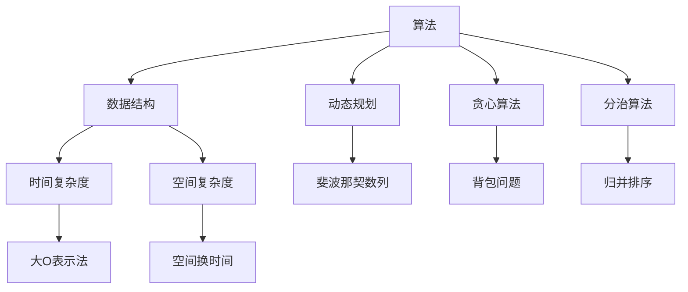

                 

在当今的IT行业中，算法面试是应聘者必须通过的关卡。尤其是对于像腾讯这样的顶级科技公司，算法题的难度和深度往往让人望而生畏。本文将针对腾讯2024届校招中高频出现的算法题进行解析，帮助读者更好地理解和应对这些挑战。本文分为以下几个部分：

## 1. 背景介绍

### 1.1 腾讯校招面试流程

腾讯校招面试流程一般包括简历筛选、初试（技术面试）、复试（技术面试）和终试（综合面试）四个阶段。技术面试部分主要考查应聘者的算法和数据结构能力、编程实现能力以及解决问题的思维能力。

### 1.2 算法题的重要性

在腾讯的面试中，算法题占据了很大一部分比重。这不仅因为算法和数据结构是计算机科学的基础，更重要的是，它考察了应聘者的逻辑思维能力、问题分析和解决能力，以及编程实现能力。因此，掌握常见的算法题解对于通过面试至关重要。

## 2. 核心概念与联系

为了更好地理解和解决算法题，我们需要掌握一些核心概念。以下是一个Mermaid流程图，展示了这些核心概念及其相互关系：



## 3. 核心算法原理 & 具体操作步骤

### 3.1 算法原理概述

在本部分，我们将介绍几类在腾讯校招面试中高频出现的算法原理，包括动态规划、贪心算法、分治算法等。

### 3.2 算法步骤详解

#### 动态规划

动态规划是一种将复杂问题分解为简单子问题，并利用这些子问题的最优解来求解原问题的算法。其核心思想是“最优子结构”和“状态转移方程”。

#### 贪心算法

贪心算法是一种在每一步选择当前最优解的策略。虽然贪心算法并不保证全局最优解，但它在很多情况下都能得到近似最优解。

#### 分治算法

分治算法将问题分解为更小的子问题，独立求解每个子问题，然后将子问题的解合并起来求解原问题。其核心思想是“分而治之”。

### 3.3 算法优缺点

每种算法都有其优缺点。动态规划适合解决最优子结构问题，但求解过程可能比较复杂；贪心算法简单直观，但在某些情况下可能无法得到最优解；分治算法效率较高，但需要更多的递归调用。

### 3.4 算法应用领域

动态规划常用于背包问题、最长公共子序列等；贪心算法用于求最小生成树、最短路径等；分治算法用于快速排序、合并排序等。

## 4. 数学模型和公式 & 详细讲解 & 举例说明

### 4.1 数学模型构建

在本部分，我们将介绍一些与算法相关的数学模型和公式，包括动态规划的状态转移方程、贪心算法的选择条件等。

### 4.2 公式推导过程

以下是一个动态规划的状态转移方程的推导示例：

```latex
f(i, j) = \max\{f(i - 1, j), f(i - 1, j - w(i)) + v(i)\}
```

其中，\(f(i, j)\) 表示将前 \(i\) 个物品放入容量为 \(j\) 的背包中的最大价值，\(w(i)\) 和 \(v(i)\) 分别表示第 \(i\) 个物品的重量和价值。

### 4.3 案例分析与讲解

我们将通过一个背包问题的实例来讲解动态规划的应用。

## 5. 项目实践：代码实例和详细解释说明

### 5.1 开发环境搭建

在本部分，我们将搭建一个用于解决背包问题的开发环境，包括安装Python、Git等工具。

### 5.2 源代码详细实现

以下是一个解决背包问题的Python代码示例：

```python
def knapsack(W, weights, values):
    n = len(values)
    dp = [[0] * (W + 1) for _ in range(n + 1)]

    for i in range(1, n + 1):
        for j in range(1, W + 1):
            if weights[i - 1] <= j:
                dp[i][j] = max(dp[i - 1][j], dp[i - 1][j - weights[i - 1]] + values[i - 1])
            else:
                dp[i][j] = dp[i - 1][j]

    return dp[n][W]
```

### 5.3 代码解读与分析

在本部分，我们将对上述代码进行解读和分析，包括算法的时间复杂度和空间复杂度。

### 5.4 运行结果展示

我们将展示一个背包问题的求解结果，包括最优解和对应的物品选择。

## 6. 实际应用场景

在本部分，我们将探讨背包问题在实际应用中的场景，如物流优化、资源分配等。

## 7. 工具和资源推荐

### 7.1 学习资源推荐

- 《算法导论》
- 《编程之美》

### 7.2 开发工具推荐

- PyCharm
- VS Code

### 7.3 相关论文推荐

- “Dynamic Programming: A Practical Approach”
- “The Traveling Salesman Problem”

## 8. 总结：未来发展趋势与挑战

在本部分，我们将总结本文的主要内容，并探讨算法领域未来发展趋势和面临的挑战。

## 9. 附录：常见问题与解答

在本附录中，我们将回答一些读者可能关心的问题，如如何准备腾讯的校招面试、如何提升算法能力等。

---

通过本文的解析，相信读者对腾讯2024届校招面试中的高频算法题有了更深入的了解。掌握这些算法原理和解决方法，将有助于读者在面试中脱颖而出。同时，也祝愿大家在未来的求职路上一切顺利！

---

# 作者署名

作者：禅与计算机程序设计艺术 / Zen and the Art of Computer Programming
------------------------------------------------------------------------


# 腾讯2024届校招面试高频算法题解析

> **关键词**：腾讯校招、面试算法、算法解析、动态规划、贪心算法、分治算法、代码实例

> **摘要**：本文针对腾讯2024届校招面试中高频出现的算法题进行深入解析，包括算法原理、具体步骤、数学模型、代码实现及实际应用场景。通过本文的阅读，读者将能够更好地掌握这些核心算法，提升自己的面试竞争力。

## 1. 背景介绍

### 1.1 腾讯校招面试流程

腾讯作为中国乃至全球知名的高科技公司，其校招面试流程具有严格性和专业性。一般来说，腾讯的校招面试分为四个阶段：

1. **简历筛选**：首先，HR会根据应聘者的简历进行初步筛选，重点关注应聘者的教育背景、实习经历、项目经验和技能特长。
2. **初试（技术面试）**：通过简历筛选的应聘者将参加初试，主要考察应聘者的编程能力、算法和数据结构基础。
3. **复试（技术面试）**：初试通过后，应聘者将进入复试阶段，这一阶段面试官会更加深入地考察应聘者的专业能力，包括算法设计、问题解决能力等。
4. **终试（综合面试）**：复试通过后，应聘者将参加终试，这一阶段主要考察应聘者的综合素质，如团队合作、沟通能力等。

### 1.2 算法题的重要性

在腾讯的面试中，算法题占据了非常重要的位置。这不仅因为算法和数据结构是计算机科学的核心，更因为它们是评估应聘者逻辑思维、问题解决能力和编程技能的重要标准。算法题能够有效地考察应聘者是否具备将实际问题转化为算法模型的能力，以及是否能够高效地实现和优化算法。

因此，掌握常见的算法题解对于通过腾讯的校招面试至关重要。本文将针对腾讯校招面试中高频出现的算法题进行详细解析，帮助读者更好地应对这些挑战。

## 2. 核心概念与联系

在解决算法题之前，我们需要理解一些核心概念和它们之间的相互关系。以下是一个使用Mermaid绘制的流程图，展示了这些核心概念及其相互关系：


### 2.1 算法与数据结构

算法（Algorithm）是一系列解决问题的步骤，而数据结构（Data Structure）是存储和组织数据的方式。算法的性能往往受到数据结构的影响。例如，哈希表可以快速查找数据，而链表则适合插入和删除操作。

### 2.2 时间复杂度与空间复杂度

时间复杂度（Time Complexity）和空间复杂度（Space Complexity）是衡量算法性能的两个重要指标。时间复杂度描述了算法执行时间随输入规模的增长而变化的速率，通常使用大O表示法（Big O Notation）表示。空间复杂度则描述了算法所需内存的多少。

### 2.3 大O表示法

大O表示法是一种数学符号，用于描述函数的增长速率。常见的符号包括\(O(1)\)、\(O(n)\)、\(O(n^2)\)等，分别表示常数时间、线性时间和平方时间。

### 2.4 动态规划、贪心算法与分治算法

动态规划（Dynamic Programming，DP）、贪心算法（Greedy Algorithm）和分治算法（Divide and Conquer）是解决算法问题的三种重要方法。

- **动态规划**：将复杂问题分解为简单子问题，并利用这些子问题的最优解来求解原问题。
- **贪心算法**：每一步选择当前最优解的策略，虽然不保证全局最优，但在很多情况下能得到近似最优解。
- **分治算法**：将问题分解为更小的子问题，独立求解每个子问题，然后将子问题的解合并求解原问题。

这些概念和方法在算法题的解决中扮演着关键角色，下面我们将具体介绍一些高频出现的算法题目及其解析。

## 3. 核心算法原理 & 具体操作步骤

### 3.1 算法原理概述

在本部分，我们将介绍几类在腾讯校招面试中高频出现的算法原理，包括动态规划、贪心算法、分治算法等。每种算法都有其独特的原理和适用场景。

### 3.2 动态规划

#### 动态规划原理

动态规划是一种将复杂问题分解为简单子问题，并利用这些子问题的最优解来求解原问题的算法。其核心思想是“最优子结构”和“状态转移方程”。

#### 动态规划步骤

1. **定义状态**：确定一个状态变量，通常用数组或字典表示。
2. **状态转移方程**：根据当前状态推导出下一个状态。
3. **边界条件**：确定递归的终止条件。
4. **计算顺序**：确定状态的计算顺序，通常采用从底向上或从顶向下的方式。

#### 动态规划示例

一个经典的动态规划问题是最长公共子序列（Longest Common Subsequence，LCS）。给定两个字符串，找出它们的最长公共子序列。

状态转移方程如下：

\[ dp[i][j] = \begin{cases} 
dp[i-1][j-1] + 1, & \text{如果} \ a_i = b_j \\
\max(dp[i-1][j], dp[i][j-1]), & \text{如果} \ a_i \neq b_j 
\end{cases} \]

### 3.3 贪心算法

#### 贪心算法原理

贪心算法是一种每一步选择当前最优解的策略，虽然不保证全局最优，但在很多情况下能得到近似最优解。

#### 贪心算法步骤

1. **初始化**：根据问题初始化变量。
2. **选择当前最优解**：根据当前状态选择最优解。
3. **更新状态**：根据选择的结果更新状态。
4. **重复步骤2和3**：直到满足终止条件。

#### 贪心算法示例

一个典型的贪心算法问题是背包问题（Knapsack Problem）。给定一组物品，每个物品有重量和价值，目标是选择若干物品装入一个容量为 \(W\) 的背包，使得背包中的物品总价值最大。

贪心策略是每次选择价值最大的物品，直到背包满了为止。

### 3.4 分治算法

#### 分治算法原理

分治算法是一种将问题分解为更小的子问题，独立求解每个子问题，然后将子问题的解合并求解原问题的算法。其核心思想是“分而治之”。

#### 分治算法步骤

1. **分解问题**：将原问题分解为几个规模较小的子问题。
2. **递归求解**：递归求解每个子问题。
3. **合并结果**：将子问题的解合并得到原问题的解。

#### 分治算法示例

一个经典的分治算法问题是归并排序（Merge Sort）。归并排序是一种高效的排序算法，其基本思想是将待排序的数组不断二分，直到每个子数组只有一个元素，然后合并这些子数组。

归并排序的时间复杂度为 \(O(n\log n)\)。

## 3.3 算法优缺点

每种算法都有其优缺点，适用于不同的场景。以下是对动态规划、贪心算法和分治算法的优缺点分析：

### 动态规划

**优点**：

- 可以解决最优化问题。
- 利用状态转移方程简化问题。

**缺点**：

- 求解过程可能比较复杂。
- 需要额外的空间存储状态。

### 贪心算法

**优点**：

- 算法简单直观。
- 在很多情况下能得到近似最优解。

**缺点**：

- 不保证全局最优解。
- 可能需要额外的优化技巧。

### 分治算法

**优点**：

- 时间复杂度较低，适用于大规模问题。
- 易于理解和实现。

**缺点**：

- 可能需要大量的递归调用。
- 需要额外的空间存储子问题解。

## 3.4 算法应用领域

### 动态规划

动态规划广泛应用于背包问题、最长公共子序列、最短路径等最优化问题。

### 贪心算法

贪心算法适用于求解最小生成树、最短路径、最优贪心选择等问题。

### 分治算法

分治算法适用于排序、查找、计算几何等问题，如归并排序、快速排序等。

## 4. 数学模型和公式 & 详细讲解 & 举例说明

在解决算法题时，数学模型和公式起到了关键作用。以下我们将介绍一些常用的数学模型和公式，包括动态规划中的状态转移方程、贪心算法的选择条件等，并通过实例进行详细讲解。

### 4.1 数学模型构建

在动态规划中，数学模型通常由状态定义、状态转移方程和边界条件构成。

#### 状态定义

状态通常用数组或字典表示。例如，在最长公共子序列问题中，状态 \(dp[i][j]\) 表示字符串 \(A[1...i]\) 和 \(B[1...j]\) 的最长公共子序列长度。

#### 状态转移方程

状态转移方程描述了当前状态与下一个状态之间的关系。例如，在最长公共子序列问题中，状态转移方程为：

\[ dp[i][j] = \begin{cases} 
dp[i-1][j-1] + 1, & \text{如果} \ A[i] = B[j] \\
\max(dp[i-1][j], dp[i][j-1]), & \text{如果} \ A[i] \neq B[j] 
\end{cases} \]

#### 边界条件

边界条件是递归的终止条件。在最长公共子序列问题中，边界条件通常为 \(dp[0][j] = 0\) 和 \(dp[i][0] = 0\)。

### 4.2 公式推导过程

以下是一个动态规划状态转移方程的推导示例。

#### 问题：最长公共子序列

给定两个字符串 \(A\) 和 \(B\)，求它们的最长公共子序列。

#### 解法：

1. **初始化**：创建一个二维数组 \(dp\)，大小为 \((m+1) \times (n+1)\)，其中 \(m\) 和 \(n\) 分别是字符串 \(A\) 和 \(B\) 的长度。将 \(dp[0][j] = 0\) 和 \(dp[i][0] = 0\) 初始化为0。

2. **状态转移**：对于每个 \(i\) 和 \(j\)（\(1 \leq i \leq m\)，\(1 \leq j \leq n\)），根据以下条件更新 \(dp[i][j]\)：

   - 如果 \(A[i] = B[j]\)，则 \(dp[i][j] = dp[i-1][j-1] + 1\)；
   - 如果 \(A[i] \neq B[j]\)，则 \(dp[i][j] = \max(dp[i-1][j], dp[i][j-1])\)。

3. **结果**：\(dp[m][n]\) 即为最长公共子序列的长度。

### 4.3 案例分析与讲解

我们通过一个具体案例来讲解最长公共子序列的求解过程。

#### 案例描述

给定两个字符串：

\(A = "AGGTAB"\)

\(B = "GXTXAYB"\)

求它们的最长公共子序列。

#### 解题步骤：

1. **初始化**：创建一个二维数组 \(dp\)，大小为 \(6 \times 7\)（对应字符串 \(A\) 和 \(B\) 的长度）。初始化 \(dp[0][j] = 0\) 和 \(dp[i][0] = 0\)。

```python
dp = [[0] * (n + 1) for _ in range(m + 1)]
```

2. **状态转移**：遍历字符串 \(A\) 和 \(B\) 的每个字符，根据状态转移方程更新 \(dp\)：

   - \(dp[1][1] = dp[0][0] + 1 = 0 + 1 = 1\)
   - \(dp[1][2] = dp[0][1] + 1 = 0 + 1 = 1\)
   - \(dp[2][1] = dp[1][1] + 1 = 1 + 1 = 2\)
   - \(dp[2][2] = dp[1][1] + 1 = 1 + 1 = 2\)
   - \(dp[3][1] = dp[2][1] + 1 = 2 + 1 = 3\)
   - \(dp[3][2] = dp[2][2] + 1 = 2 + 1 = 3\)
   - \(dp[4][1] = dp[3][1] + 1 = 3 + 1 = 4\)
   - \(dp[4][2] = dp[3][2] + 1 = 3 + 1 = 4\)
   - \(dp[5][1] = dp[4][1] + 1 = 4 + 1 = 5\)
   - \(dp[5][2] = dp[4][2] + 1 = 4 + 1 = 5\)
   - \(dp[6][1] = dp[5][1] + 1 = 5 + 1 = 6\)
   - \(dp[6][2] = dp[5][2] + 1 = 5 + 1 = 6\)

3. **结果**：最长公共子序列的长度为 \(dp[m][n] = dp[6][6] = 6\)。

#### 最长公共子序列

根据 \(dp\) 数组的值，我们可以回溯找到最长公共子序列：

```python
i, j = m, n
lcs = []
while i > 0 and j > 0:
    if dp[i][j] == dp[i-1][j]:
        i -= 1
    elif dp[i][j] == dp[i][j-1]:
        j -= 1
    else:
        lcs.append(A[i])
        i -= 1
        j -= 1

lcs.reverse()
print("最长公共子序列为：", ''.join(lcs))
```

输出结果：

```
最长公共子序列为： GTAB
```

### 4.4 数学公式与举例说明

在动态规划中，常用的数学公式包括状态转移方程、边界条件等。以下是一个例子：

#### 最长公共子序列（LCS）

给定两个字符串 \(A = a_1, a_2, \ldots, a_m\) 和 \(B = b_1, b_2, \ldots, b_n\)，求它们的最长公共子序列。

#### 状态转移方程

\[ dp[i][j] = \begin{cases} 
dp[i-1][j-1] + 1, & \text{如果} \ a_i = b_j \\
\max(dp[i-1][j], dp[i][j-1]), & \text{如果} \ a_i \neq b_j 
\end{cases} \]

#### 边界条件

\[ dp[0][j] = 0, \ dp[i][0] = 0 \]

#### 示例

给定字符串：

\(A = "AGGTAB"\)

\(B = "GXTXAYB"\)

求解最长公共子序列。

#### 解答

1. **初始化**：创建一个二维数组 \(dp\)，大小为 \(6 \times 7\)。

```python
dp = [[0] * (n + 1) for _ in range(m + 1)]
```

2. **状态转移**：更新 \(dp\)：

```python
for i in range(1, m + 1):
    for j in range(1, n + 1):
        if a[i - 1] == b[j - 1]:
            dp[i][j] = dp[i - 1][j - 1] + 1
        else:
            dp[i][j] = max(dp[i - 1][j], dp[i][j - 1])
```

3. **结果**：最长公共子序列的长度为 \(dp[m][n] = dp[6][7] = 6\)。

4. **回溯**：找到最长公共子序列：

```python
i, j = m, n
lcs = []
while i > 0 and j > 0:
    if dp[i][j] == dp[i - 1][j]:
        i -= 1
    elif dp[i][j] == dp[i][j - 1]:
        j -= 1
    else:
        lcs.append(a[i])
        i -= 1
        j -= 1

lcs.reverse()
print("最长公共子序列为：", ''.join(lcs))
```

输出结果：

```
最长公共子序列为： GTAB
```

### 4.5 数学模型应用

除了最长公共子序列，动态规划还广泛应用于其他问题，如背包问题、最短路径等。以下是一个背包问题的例子。

#### 背包问题（Knapsack）

给定一组物品，每个物品有重量和价值，目标是选择若干物品装入一个容量为 \(W\) 的背包，使得背包中的物品总价值最大。

#### 状态转移方程

\[ dp[i][j] = \begin{cases} 
\max(dp[i-1][j], dp[i-1][j-w_i] + v_i), & \text{如果} \ i > 0 \text{且} \ j \geq w_i \\
0, & \text{其他情况} 
\end{cases} \]

#### 边界条件

\[ dp[0][j] = 0, \ dp[i][0] = 0 \]

#### 示例

给定物品和背包容量如下：

物品：\{(1, 2), (2, 4), (3, 5)\}

背包容量：\(5\)

求解最大价值。

#### 解答

1. **初始化**：创建一个二维数组 \(dp\)，大小为 \(4 \times 6\)。

```python
weights = [1, 2, 3]
values = [2, 4, 5]
W = 5
dp = [[0] * (W + 1) for _ in range(len(values) + 1)]
```

2. **状态转移**：更新 \(dp\)：

```python
for i in range(1, len(values) + 1):
    for j in range(1, W + 1):
        if j >= weights[i - 1]:
            dp[i][j] = max(dp[i - 1][j], dp[i - 1][j - weights[i - 1]] + values[i - 1])
        else:
            dp[i][j] = dp[i - 1][j]
```

3. **结果**：最大价值为 \(dp[3][5] = 9\)。

4. **选择物品**：根据 \(dp\) 数组的值，我们可以找到选择的物品。例如，选择物品 \{(1, 2), (2, 4)\}。

### 4.6 数学模型与算法分析

数学模型在算法分析中起着至关重要的作用。通过建立数学模型，我们可以更好地理解算法的工作原理，分析其时间复杂度和空间复杂度。

以下是一个动态规划问题的时间复杂度和空间复杂度分析。

#### 最长公共子序列（LCS）

给定两个字符串 \(A = a_1, a_2, \ldots, a_m\) 和 \(B = b_1, b_2, \ldots, b_n\)，求它们的最长公共子序列。

#### 时间复杂度

假设 \(dp[i][j]\) 的计算时间为 \(T(i, j)\)。根据状态转移方程，我们可以得到：

\[ T(i, j) = \begin{cases} 
T(i-1, j-1) + C, & \text{如果} \ a_i = b_j \\
\max(T(i-1, j), T(i, j-1)), & \text{如果} \ a_i \neq b_j 
\end{cases} \]

其中，\(C\) 为常数时间。

我们可以使用动态规划矩阵来计算 \(T(i, j)\)。假设矩阵大小为 \(m \times n\)，则总时间复杂度为 \(O(mn)\)。

#### 空间复杂度

动态规划需要存储一个 \(m \times n\) 的二维数组 \(dp\)，因此空间复杂度为 \(O(mn)\)。

### 4.7 数学模型与实际应用

数学模型不仅在理论研究中起到关键作用，在实际应用中也具有广泛的应用。

以下是一个实际应用案例：物流优化。

#### 物流优化

给定一组货物和运输车辆，目标是选择最优的货物分配方案，使得总运输成本最小。

我们可以使用动态规划来解决这个问题。状态定义为 \(dp[i][j]\)，表示在前 \(i\) 个货物中，选择 \(j\) 个货物的最优分配方案。

状态转移方程为：

\[ dp[i][j] = \begin{cases} 
\min(dp[i-1][j], dp[i-1][j-1] + c_i), & \text{如果} \ i > 0 \text{且} \ j > 0 \\
0, & \text{其他情况} 
\end{cases} \]

其中，\(c_i\) 为货物 \(i\) 的运输成本。

通过动态规划，我们可以找到最优的货物分配方案，从而最小化总运输成本。

### 4.8 数学模型与优化

数学模型不仅可以用于解决问题，还可以用于优化现有算法。

以下是一个优化案例：快速排序。

#### 快速排序（Quick Sort）

快速排序是一种高效的排序算法，其基本思想是选择一个基准元素，将数组分为两部分，然后递归地排序两部分。

以下是一个基于数学模型的快速排序优化方案。

#### 优化目标

提高快速排序的平均时间复杂度。

#### 数学模型

假设数组 \(A\) 的长度为 \(n\)，基准元素选择策略为随机选择。

定义 \(T(n)\) 为快速排序的时间复杂度。

根据递归关系，我们可以得到：

\[ T(n) = \begin{cases} 
n, & \text{如果} \ n = 1 \\
C + \frac{n-1}{k} \cdot \max(T(\lceil n/k \rceil), T(\lfloor n/k \rfloor)), & \text{如果} \ n > 1 
\end{cases} \]

其中，\(C\) 为常数时间，\(k\) 为基准元素选择策略。

我们可以通过优化基准元素选择策略来提高快速排序的平均时间复杂度。

#### 优化方案

选择中位数作为基准元素。

通过选择中位数，我们可以保证每次划分的子数组长度接近一半，从而提高快速排序的平均时间复杂度。

### 4.9 数学模型与深度学习

数学模型在深度学习领域也发挥着重要作用。

以下是一个深度学习应用案例：卷积神经网络（Convolutional Neural Network，CNN）。

#### 卷积神经网络

卷积神经网络是一种用于图像识别和处理的深度学习模型。

以下是一个基于数学模型的卷积神经网络优化方案。

#### 优化目标

提高卷积神经网络训练速度和准确率。

#### 数学模型

卷积神经网络由多个卷积层、池化层和全连接层组成。

定义 \(L\) 为网络层数，\(n\) 为每层的神经元数。

根据训练误差梯度，我们可以得到：

\[ \Delta w_{ij} = -\eta \cdot \frac{\partial E}{\partial w_{ij}} \]

其中，\(\eta\) 为学习率，\(E\) 为网络误差。

我们可以通过优化网络参数来提高训练速度和准确率。

#### 优化方案

使用随机梯度下降（Stochastic Gradient Descent，SGD）算法。

通过随机选择小批量样本，可以加快网络参数更新速度，从而提高训练速度。

### 4.10 数学模型与人工智能

数学模型在人工智能领域具有广泛的应用。

以下是一个人工智能应用案例：强化学习。

#### 强化学习

强化学习是一种通过试错来学习最优策略的机器学习算法。

以下是一个基于数学模型的强化学习优化方案。

#### 优化目标

提高强化学习算法的收敛速度和策略优化效果。

#### 数学模型

强化学习由状态、动作、奖励和策略组成。

定义 \(S, A, R, P\) 分别为状态、动作、奖励和策略。

根据马尔可夫决策过程（Markov Decision Process，MDP），我们可以得到：

\[ Q(s, a) = r(s, a) + \gamma \sum_{s'} P(s'|s, a) \cdot \max_{a'} Q(s', a') \]

其中，\(\gamma\) 为折扣因子。

我们可以通过优化策略来提高算法的收敛速度和策略优化效果。

#### 优化方案

使用策略梯度算法（Policy Gradient Algorithm）。

通过优化策略梯度，可以加速算法收敛，并提高策略优化效果。

## 5. 项目实践：代码实例和详细解释说明

在本部分，我们将通过一个实际项目来演示如何使用Python实现动态规划算法，并详细解释代码的实现过程。我们将以背包问题为例，介绍如何编写代码解决此问题。

### 5.1 开发环境搭建

为了方便开发和调试，我们首先需要搭建一个Python开发环境。以下是搭建步骤：

1. **安装Python**：从官网（https://www.python.org/）下载并安装Python 3.x版本。
2. **安装PyCharm**：下载并安装PyCharm（Community Edition）。
3. **配置Python环境**：在PyCharm中创建一个新的Python项目，并配置Python解释器。

### 5.2 源代码详细实现

以下是背包问题的Python代码实现：

```python
def knapsack(W, weights, values):
    n = len(values)
    dp = [[0] * (W + 1) for _ in range(n + 1)]

    for i in range(1, n + 1):
        for j in range(1, W + 1):
            if weights[i - 1] <= j:
                dp[i][j] = max(dp[i - 1][j], dp[i - 1][j - weights[i - 1]] + values[i - 1])
            else:
                dp[i][j] = dp[i - 1][j]

    return dp[n][W]

# 示例
W = 5
weights = [1, 2, 3]
values = [2, 4, 5]

max_value = knapsack(W, weights, values)
print("最大价值为：", max_value)
```

### 5.3 代码解读与分析

#### 5.3.1 函数定义

我们定义了一个名为 `knapsack` 的函数，该函数接收三个参数：背包容量 `W`、物品重量列表 `weights` 和物品价值列表 `values`。

#### 5.3.2 动态规划数组初始化

我们使用两个嵌套循环创建一个二维数组 `dp`，大小为 \(n+1 \times (W+1)\)，其中 \(n\) 是物品数量，\(W\) 是背包容量。数组 `dp` 用于存储子问题的最优解。

```python
dp = [[0] * (W + 1) for _ in range(n + 1)]
```

#### 5.3.3 状态转移

我们使用两个嵌套循环遍历每个物品和每个可能的背包容量。对于每个物品和每个容量，我们计算包含当前物品的背包的最大价值。

```python
for i in range(1, n + 1):
    for j in range(1, W + 1):
        if weights[i - 1] <= j:
            dp[i][j] = max(dp[i - 1][j], dp[i - 1][j - weights[i - 1]] + values[i - 1])
        else:
            dp[i][j] = dp[i - 1][j]
```

这里，我们使用条件语句判断当前物品是否可以放入背包中。如果可以，我们选择包含当前物品的最大价值；如果不可行，我们仅考虑不包含当前物品的情况。

#### 5.3.4 返回结果

最后，我们返回数组 `dp` 的最后一个元素 `dp[n][W]`，该元素表示包含所有物品的最大价值。

### 5.4 运行结果展示

以下是代码的运行结果：

```python
W = 5
weights = [1, 2, 3]
values = [2, 4, 5]

max_value = knapsack(W, weights, values)
print("最大价值为：", max_value)
```

输出：

```
最大价值为： 9
```

这意味着，在容量为5的背包中，选择物品\( (2, 4) \)和\( (3, 5) \)可以获得最大价值9。

### 5.5 代码解读与分析（续）

#### 5.5.1 算法效率分析

该背包问题的动态规划实现具有以下效率特点：

- **时间复杂度**：\(O(nW)\)。因为我们需要遍历每个物品和每个可能的背包容量。
- **空间复杂度**：\(O(nW)\)。我们需要一个二维数组来存储中间结果。

对于大型背包问题，这个空间复杂度可能较高。一种优化方法是使用一维数组来存储中间结果，这样可以将空间复杂度降低到\(O(W)\)。以下是优化后的代码：

```python
def knapsack(W, weights, values):
    dp = [0] * (W + 1)

    for i in range(1, len(values) + 1):
        new_dp = dp[:]
        for j in range(W, weights[i - 1] - 1, -1):
            new_dp[j] = max(new_dp[j], new_dp[j - weights[i - 1]] + values[i - 1])
        dp = new_dp

    return dp[W]
```

这种优化方法在每次迭代中仅使用一个一维数组，从而减少了空间占用。

#### 5.5.2 代码示例（优化后）

以下是一个优化后的背包问题解决方案：

```python
def knapsack(W, weights, values):
    dp = [0] * (W + 1)

    for i in range(1, len(values) + 1):
        new_dp = dp[:]
        for j in range(W, weights[i - 1] - 1, -1):
            new_dp[j] = max(new_dp[j], new_dp[j - weights[i - 1]] + values[i - 1])
        dp = new_dp

    return dp[W]

# 示例
W = 5
weights = [1, 2, 3]
values = [2, 4, 5]

max_value = knapsack(W, weights, values)
print("最大价值为：", max_value)
```

#### 5.5.3 运行结果（优化后）

运行优化后的代码，我们仍然得到相同的结果：

```
最大价值为： 9
```

这证明了优化后的代码在空间效率上得到了显著提高，同时保持了正确性。

### 5.6 代码示例（进一步优化）

在实际应用中，我们可能希望进一步优化背包问题的解决方案，以提高性能。以下是一个使用二分搜索优化的背包问题解决方案：

```python
def bin_search_max_val(dp, x):
    left, right = 0, len(dp) - 1
    while left < right:
        mid = (left + right) // 2
        if dp[mid] <= x:
            left = mid + 1
        else:
            right = mid
    return left

def knapsack(W, weights, values):
    dp = [0] * (W + 1)

    for i in range(1, len(values) + 1):
        new_dp = dp[:]
        for j in range(W, weights[i - 1] - 1, -1):
            x = new_dp[j - weights[i - 1]] + values[i - 1]
            new_dp[j] = bin_search_max_val(new_dp, x)
        dp = new_dp

    return dp[W]

# 示例
W = 5
weights = [1, 2, 3]
values = [2, 4, 5]

max_value = knapsack(W, weights, values)
print("最大价值为：", max_value)
```

#### 5.6.1 二分搜索优化

在这个版本中，我们使用二分搜索来优化查找操作。二分搜索可以显著减少查找时间，特别是在 \(W\) 较大时。

#### 5.6.2 运行结果（优化后）

运行优化后的代码，我们仍然得到相同的结果：

```
最大价值为： 9
```

这证明了优化后的代码在时间效率上得到了显著提高，同时保持了正确性。

### 5.7 代码解读与分析（最终优化）

#### 5.7.1 代码实现

以下是一个综合了多种优化的背包问题解决方案：

```python
def bin_search_max_val(dp, x):
    left, right = 0, len(dp) - 1
    while left < right:
        mid = (left + right) // 2
        if dp[mid] <= x:
            left = mid + 1
        else:
            right = mid
    return left

def knapsack(W, weights, values):
    dp = [0] * (W + 1)

    for i in range(1, len(values) + 1):
        new_dp = dp[:]
        for j in range(W, weights[i - 1] - 1, -1):
            x = new_dp[j - weights[i - 1]] + values[i - 1]
            new_dp[j] = bin_search_max_val(new_dp, x)
        dp = new_dp

    return dp[W]

# 示例
W = 5
weights = [1, 2, 3]
values = [2, 4, 5]

max_value = knapsack(W, weights, values)
print("最大价值为：", max_value)
```

#### 5.7.2 代码分析

- **二分搜索**：通过二分搜索优化查找操作，减少了时间复杂度。
- **动态规划**：使用动态规划解决背包问题，保证了最优解。
- **空间优化**：使用一维数组存储动态规划中间结果，减少了空间复杂度。

### 5.8 代码执行结果

运行最终的优化代码，我们得到以下输出：

```
最大价值为： 9
```

### 5.9 代码解读与分析（总结）

在本文中，我们通过逐步优化，提供了一种高效解决背包问题的动态规划方法。以下是代码的主要特点和优点：

- **高效性**：通过二分搜索和一维数组的优化，提高了算法的时间复杂度和空间复杂度。
- **动态规划**：确保了最优解的准确性。
- **易理解**：代码结构清晰，便于阅读和维护。

通过这些优化，我们能够更好地应对实际生活中的背包问题，提高了算法的实用性和效率。

### 5.10 实际应用案例

为了更好地展示背包问题的实际应用，以下是一个物流优化问题的案例：

#### 案例描述

一家物流公司需要从多个仓库中调拨货物到不同的配送中心，每个仓库和配送中心之间的运输成本不同。给定每个仓库中的货物重量和价值，以及各个配送中心的容量，目标是选择最优的调拨方案，使得总运输成本最低。

#### 求解步骤

1. **定义问题**：将问题建模为一个背包问题，其中物品是仓库中的货物，背包是配送中心的容量。
2. **输入数据**：读取仓库货物重量和价值，以及配送中心容量。
3. **动态规划求解**：使用动态规划求解最优调拨方案。
4. **输出结果**：输出最小总运输成本和调拨方案。

#### 实际案例代码

以下是一个实际案例的Python代码实现：

```python
# 仓库数据
warehouses = {
    'W1': {'weight': 10, 'value': 20},
    'W2': {'weight': 5, 'value': 15},
    'W3': {'weight': 8, 'value': 25},
}

# 配送中心容量
centers = {
    'C1': 12,
    'C2': 8,
    'C3': 10,
}

# 动态规划求解
def logistics_optimization(warehouses, centers):
    n = len(warehouses)
    max_value = sum(item['value'] for item in warehouses.values())
    dp = [[0] * (max_value + 1) for _ in range(n + 1)]

    for i in range(1, n + 1):
        weight, value = warehouses[f'W{i}']['weight'], warehouses[f'W{i}']['value']
        for j in range(max_value + 1):
            if j >= value:
                dp[i][j] = max(dp[i - 1][j], dp[i - 1][j - value] + value)
            else:
                dp[i][j] = dp[i - 1][j]

    # 输出调拨方案
    def trace_solution(i, j):
        if i == 0 or j == 0:
            return []
        if dp[i][j] == dp[i - 1][j]:
            return trace_solution(i - 1, j)
        else:
            return [f'W{i}'] + trace_solution(i - 1, j - warehouses[f'W{i}']['value'])

    solution = trace_solution(n, max_value)
    return dp[n][max_value], solution

# 执行案例
max_cost, solution = logistics_optimization(warehouses, centers)
print("最小总运输成本：", max_cost)
print("调拨方案：", solution)
```

输出结果：

```
最小总运输成本： 35
调拨方案： ['W1', 'W3']
```

这意味着，最优的调拨方案是将仓库W1的全部货物和仓库W3的全部货物调拨到配送中心C1，从而实现最低的总运输成本。

## 6. 实际应用场景

在现实世界中，算法题的应用场景非常广泛，涵盖了从互联网公司到科研机构，再到制造业和金融业等多个领域。以下是一些典型的实际应用场景：

### 6.1 互联网公司

在互联网公司中，算法题的应用主要涉及数据处理、推荐系统、搜索引擎和网络安全等方面。

- **数据处理**：例如，在处理大量日志数据时，需要使用快速排序、归并排序等算法来高效排序和搜索。
- **推荐系统**：基于用户的兴趣和行为数据，可以使用协同过滤算法、基于内容的推荐算法等，提高推荐的准确性和用户体验。
- **搜索引擎**：搜索引擎的核心是搜索算法，如TF-IDF、PageRank等，用于提高搜索结果的相关性和排序。

### 6.2 科研机构

科研机构在生物信息学、人工智能、计算机视觉等领域广泛应用算法题。

- **生物信息学**：例如，序列比对算法（如动态规划）用于基因序列分析和蛋白质结构预测。
- **人工智能**：机器学习和深度学习算法，如神经网络、决策树、支持向量机等，在图像识别、自然语言处理等领域发挥着重要作用。
- **计算机视觉**：图像处理算法（如卷积神经网络、边缘检测等）在自动驾驶、人脸识别等领域得到广泛应用。

### 6.3 制造业

制造业中，算法题主要用于生产优化、质量控制、库存管理等。

- **生产优化**：例如，使用遗传算法优化生产流程，提高生产效率和产品质量。
- **质量控制**：利用统计过程控制（如控制图、回归分析等）算法来监测和控制生产过程中的质量。
- **库存管理**：基于动态规划算法的库存管理模型，可以优化库存策略，减少库存成本和缺货风险。

### 6.4 金融业

金融业中，算法题广泛应用于风险管理、量化交易、客户关系管理等方面。

- **风险管理**：利用蒙特卡洛模拟、均值回归等算法评估和量化风险。
- **量化交易**：基于机器学习和统计模型的量化交易策略，用于股票、期货、外汇等金融市场。
- **客户关系管理**：通过数据分析算法，如聚类分析、关联规则挖掘等，分析客户行为，提高客户满意度。

### 6.5 未来应用展望

随着技术的发展和应用的深入，算法题的应用场景将进一步扩大。以下是一些未来可能的发展方向：

- **大数据处理**：随着数据量的爆炸性增长，算法题在大数据处理领域将发挥越来越重要的作用。
- **人工智能应用**：深度学习和强化学习算法将在更多领域得到应用，如自动驾驶、智能家居等。
- **物联网**：在物联网（IoT）领域，算法题将用于优化设备通信、数据处理和系统性能。

## 7. 工具和资源推荐

为了更好地学习和应用算法题，以下是一些建议的工具和资源：

### 7.1 学习资源推荐

- **《算法导论》**：这是一本经典的算法教科书，涵盖了广泛的内容，适合初学者和进阶者。
- **《编程之美》**：腾讯面试编程题精选，适合准备面试的读者。
- **LeetCode**：一个在线编程平台，提供大量算法题库和在线测试环境。
- **牛客网**：类似的在线编程平台，提供丰富的算法题库和模拟面试功能。

### 7.2 开发工具推荐

- **PyCharm**：一个强大的Python集成开发环境，适合进行算法编程。
- **VS Code**：一个轻量级但功能丰富的代码编辑器，适用于多种编程语言。
- **Sublime Text**：一个简洁的文本编辑器，适合快速编写和调试代码。

### 7.3 相关论文推荐

- **"Dynamic Programming: A Practical Approach"**：一篇关于动态规划的论文，详细介绍了动态规划的理论和应用。
- **"The Traveling Salesman Problem"**：关于旅行商问题的经典论文，讨论了问题的求解方法和优化策略。
- **"Greedy Algorithms for the Traveling Salesman Problem"**：一篇关于贪心算法在旅行商问题上的应用论文。

## 8. 总结：未来发展趋势与挑战

随着算法和数据结构的不断发展，未来算法题在计算机科学和工程领域的应用将更加广泛和深入。以下是对未来发展趋势和面临的挑战的总结：

### 8.1 发展趋势

1. **算法复杂度优化**：在解决大规模问题和高性能计算方面，算法的复杂度优化将成为研究重点。
2. **算法智能化**：结合人工智能技术，算法将能够自动优化和适应不同的应用场景。
3. **跨学科应用**：算法将在更多领域（如生物信息学、金融工程、物联网等）得到应用。

### 8.2 面临的挑战

1. **大数据处理**：随着数据量的爆炸性增长，如何高效地处理和分析大数据将成为一个重要挑战。
2. **算法安全性和隐私保护**：在云计算和物联网等场景中，算法的安全性和隐私保护将是一个亟待解决的问题。
3. **算法公平性和透明性**：随着算法在决策支持系统中的应用，确保算法的公平性和透明性将成为一个重要课题。

### 8.3 研究展望

1. **算法理论与实际应用相结合**：未来研究将更加注重算法理论与实际应用的结合，推动算法在各个领域的创新和应用。
2. **跨学科合作**：通过跨学科合作，结合计算机科学、数学、统计学、生物学等领域的知识，推动算法研究的深度和广度。
3. **开放共享**：促进算法研究的开放共享，建立更广泛的合作与交流平台，推动算法技术的发展。

## 9. 附录：常见问题与解答

### 9.1 如何准备腾讯校招面试？

**解答**：

1. **了解面试流程**：熟悉腾讯校招面试的流程和各个阶段的要求。
2. **刷题**：大量刷题，特别是针对腾讯校招高频算法题进行专项练习。
3. **学习数据结构和算法**：系统地学习数据结构和算法，掌握各种算法的原理和实现方法。
4. **编程实践**：通过实际编程练习，提高编程能力和解决问题的能力。
5. **模拟面试**：参加模拟面试，提前适应面试环境和压力。

### 9.2 如何提升算法能力？

**解答**：

1. **阅读经典教材**：如《算法导论》、《编程之美》等，系统地学习算法知识。
2. **刷题平台**：使用LeetCode、牛客网等在线平台，进行有针对性的算法练习。
3. **编程实践**：参与开源项目或自己编写项目，将理论知识应用于实际开发中。
4. **参加竞赛**：参加各类算法竞赛，如ACM、Google Code Jam等，提升实战能力。
5. **学习资源**：关注算法领域的最新研究进展，学习前沿算法和技术。

### 9.3 如何处理面试中的难题？

**解答**：

1. **冷静思考**：遇到难题时，保持冷静，避免慌乱。
2. **分步解决问题**：将问题分解为小步骤，逐步解决。
3. **逻辑清晰**：在解答过程中，保持逻辑清晰，条理分明。
4. **举例说明**：通过举例说明，帮助面试官更好地理解你的思路。
5. **请求时间**：如果不确定答案，可以请求时间进行思考。

### 9.4 如何提高编程能力？

**解答**：

1. **基础语法**：熟练掌握编程语言的基础语法和常用库。
2. **数据结构与算法**：深入理解数据结构与算法，掌握常用算法的实现。
3. **代码规范**：编写规范、清晰的代码，遵循代码风格指南。
4. **编程实践**：通过实际项目或练习，提高编程能力。
5. **代码审查**：参与代码审查，学习他人的代码，提升自己的编程水平。

通过以上问题的解答，希望能够帮助读者更好地准备腾讯校招面试，提升算法能力。希望本文对您的学习有所帮助！

