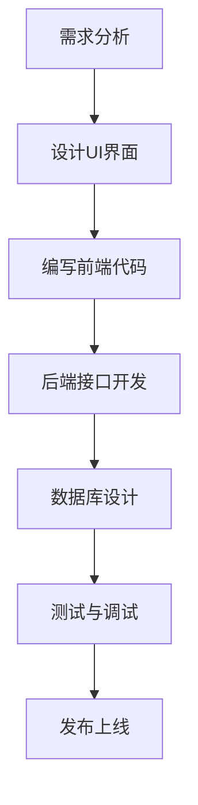

                 

关键词：腾讯、校招、微信小程序、开发工程师、面试题、详解、技术分析

> 摘要：本文旨在为准备腾讯2024校招微信小程序开发工程师职位的候选人提供一份详细的面试题解析，包括核心概念、算法原理、项目实践以及实际应用场景等，帮助读者更好地理解和掌握微信小程序开发的相关技术和知识。

## 1. 背景介绍

微信小程序自推出以来，以其便捷性、易用性和高效性受到了广泛欢迎，成为了移动互联网的重要组成部分。腾讯作为微信小程序的提供者，每年都会通过校招选拔优秀的人才加入微信小程序团队。2024年的校招面试题目涵盖了小程序开发的方方面面，包括基础技术、算法应用、项目实践等，旨在考察候选人的综合素质和技术能力。

本文将结合2024年腾讯校招微信小程序开发工程师的面试题，详细解析各个题目，帮助读者更好地理解面试中的考点和解题思路。

## 2. 核心概念与联系

### 2.1 微信小程序的基本概念

微信小程序是一种不需要下载安装即可使用的应用，它实现了应用“触手可及”的概念，用户扫一扫或者搜一下即可打开应用。它实现了应用“触手可及”的概念，无需下载安装即可使用，按需加载，用完即走，非常适合轻量级应用。

### 2.2 小程序的技术架构

微信小程序的技术架构主要包括前端、后端和数据库三个部分。前端使用微信开发者工具进行开发，支持HTML、CSS和JavaScript等前端技术。后端一般使用微信云开发或者自建服务器。数据库可以使用微信云数据库或者自建数据库。

### 2.3 小程序的开发流程

小程序的开发流程主要包括以下几个步骤：1）需求分析；2）设计UI界面；3）编写前端代码；4）后端接口开发；5）数据库设计；6）测试与调试；7）发布上线。

### 2.4 Mermaid流程图



## 3. 核心算法原理 & 具体操作步骤

### 3.1 算法原理概述

微信小程序开发中会涉及到的核心算法主要包括前端算法和后端算法。前端算法主要涉及数据的处理和展示，如排序算法、搜索算法等。后端算法主要涉及数据的存储和处理，如数据库查询优化、缓存算法等。

### 3.2 算法步骤详解

#### 前端算法

1. 排序算法：冒泡排序、选择排序、插入排序等。

2. 搜索算法：二分搜索、线性搜索等。

3. 数据处理：数据处理库如lodash、处理数组数据的函数等。

#### 后端算法

1. 数据库查询优化：索引、查询优化器等。

2. 缓存算法：LRU、FIFO等。

3. 数据存储：关系型数据库如MySQL、非关系型数据库如MongoDB等。

### 3.3 算法优缺点

1. 前端算法：简单易用，但性能可能较低，适用于轻量级应用。

2. 后端算法：性能较高，但开发难度较大，适用于复杂应用。

### 3.4 算法应用领域

1. 前端算法：适用于数据展示、数据处理等场景。

2. 后端算法：适用于数据存储、数据处理等场景。

## 4. 数学模型和公式 & 详细讲解 & 举例说明

### 4.1 数学模型构建

微信小程序开发中的数学模型主要包括数据模型和算法模型。

#### 数据模型

数据模型主要描述小程序中数据的结构和关系。例如，用户信息表、订单信息表等。

#### 算法模型

算法模型主要描述小程序中算法的实现过程和优化策略。例如，排序算法、搜索算法等。

### 4.2 公式推导过程

假设我们使用二分搜索算法在一个有序数组中查找元素，我们可以使用以下公式来推导算法的时间复杂度。

$$ T(n) = \frac{n}{2} \cdot \log_2(n) $$

### 4.3 案例分析与讲解

假设我们有一个长度为100的有序数组，我们需要查找元素60，我们可以使用二分搜索算法进行查找。

$$ \frac{100}{2} = 50 $$

$$ \frac{50}{2} = 25 $$

$$ \frac{25}{2} = 12 $$

$$ \frac{12}{2} = 6 $$

$$ \frac{6}{2} = 3 $$

$$ \frac{3}{2} = 1 $$

$$ 60 = 60 $$

因此，我们需要比较6次才能找到元素60。

## 5. 项目实践：代码实例和详细解释说明

### 5.1 开发环境搭建

1. 安装微信开发者工具。

2. 创建一个新的小程序项目。

3. 配置小程序的AppID。

### 5.2 源代码详细实现

以下是小程序首页的代码示例：

```html
<view class="container">
  <text class="title">{{ hello }}</text>
</view>

```

```javascript
Page({
  data: {
    hello: 'Hello, world!'
  }
})

```

### 5.3 代码解读与分析

1. `<view>`标签：用于定义小程序的一个视图容器。

2. `<text>`标签：用于定义小程序的文本节点。

3. `Page`函数：用于定义小程序的页面。

4. `data`对象：用于存储页面的数据。

### 5.4 运行结果展示

运行小程序，可以在微信中看到一个标题为“Hello, world!”的页面。

## 6. 实际应用场景

### 6.1 商业应用

微信小程序广泛应用于电商、餐饮、出行等领域，为用户提供便捷的服务。

### 6.2 社交应用

微信小程序也可以用于社交应用，如朋友圈、聊天室等。

### 6.3 工具应用

微信小程序还可以用于工具应用，如计算器、天气查询等。

## 7. 工具和资源推荐

### 7.1 学习资源推荐

1. 《微信小程序开发入门与实践》

2. 《微信小程序开发实战》

### 7.2 开发工具推荐

1. 微信开发者工具

2. Visual Studio Code

### 7.3 相关论文推荐

1. "WeChat Mini Programs: A New Paradigm for Mobile Application Development"

2. "Building Mobile Apps with WeChat Mini Programs"

## 8. 总结：未来发展趋势与挑战

### 8.1 研究成果总结

微信小程序在易用性、便捷性、高效性等方面取得了显著成果，为移动互联网的发展提供了新的思路。

### 8.2 未来发展趋势

1. 更多的商业应用

2. 更多的社交应用

3. 更多的工具应用

### 8.3 面临的挑战

1. 安全性问题

2. 性能优化问题

3. 开发者生态问题

### 8.4 研究展望

微信小程序未来将更加注重用户体验、安全性和性能优化，为用户带来更好的使用体验。

## 9. 附录：常见问题与解答

### 9.1 微信小程序的开发流程是怎样的？

开发微信小程序的流程主要包括需求分析、设计UI界面、编写前端代码、后端接口开发、数据库设计、测试与调试、发布上线等步骤。

### 9.2 微信小程序可以使用哪些技术？

微信小程序可以使用HTML、CSS、JavaScript等前端技术，后端可以使用微信云开发或者自建服务器，数据库可以使用微信云数据库或者自建数据库。

### 9.3 微信小程序的优势有哪些？

微信小程序的优势主要包括：无需下载安装、按需加载、用完即走、良好的用户体验等。

### 9.4 微信小程序的安全问题如何解决？

微信小程序的安全问题可以通过以下措施解决：数据加密、接口权限控制、异常处理等。

作者：禅与计算机程序设计艺术 / Zen and the Art of Computer Programming
----------------------------------------------------------------

### 引言

本文旨在为准备腾讯2024校招微信小程序开发工程师职位的候选人提供一份详细的面试题解析。随着微信小程序的广泛应用，越来越多的企业和开发者开始重视这一领域的开发技能。因此，了解和掌握微信小程序开发的相关技术和知识对于求职者来说至关重要。

本文将结合2024年腾讯校招微信小程序开发工程师的面试题，详细解析各个题目，帮助读者更好地理解面试中的考点和解题思路。文章将从背景介绍、核心概念与联系、核心算法原理、数学模型和公式、项目实践、实际应用场景、工具和资源推荐、总结以及常见问题与解答等方面进行深入探讨。

首先，我们将简要介绍微信小程序的基本概念、技术架构和开发流程，帮助读者建立对微信小程序的整体认识。接着，我们将详细讲解核心算法原理，包括前端算法和后端算法的优缺点以及应用领域，以便读者能够深入了解算法在微信小程序开发中的重要性。

在数学模型和公式部分，我们将介绍数据模型和算法模型的基本构建方法，并通过具体案例进行讲解，帮助读者理解数学模型在实际开发中的应用。项目实践部分将结合实际代码实例，详细解释小程序的开发流程和关键步骤，帮助读者掌握实际操作技能。

实际应用场景部分将探讨微信小程序在不同领域的应用，包括商业应用、社交应用和工具应用等，以展示微信小程序的广泛适用性。工具和资源推荐部分将介绍一些优秀的学习资源和开发工具，帮助读者进一步提升开发能力。

在总结部分，我们将对研究成果进行归纳总结，并展望微信小程序的未来发展趋势和面临的挑战。最后，附录部分将回答一些常见的面试问题，以帮助读者更好地准备面试。

通过本文的详细解析，我们希望读者能够全面了解和掌握微信小程序开发的核心技术和方法，为未来的职业发展打下坚实的基础。

### 腾讯2024校招微信小程序开发工程师面试题解析

#### 面试题1：请解释一下微信小程序的基本概念。

**答案解析：**

微信小程序是一种不需要下载安装即可使用的应用，它实现了应用“触手可及”的概念。用户只需扫描二维码或通过搜索即可访问和使用小程序，无需下载和安装。这种模式不仅提高了用户的便捷性，还降低了应用的传播门槛。

微信小程序具有以下几个基本特性：

1. **轻量级**：小程序体积小，加载速度快，适用于轻量级应用。

2. **无需安装**：用户可以通过微信直接访问和使用小程序，无需安装额外的应用。

3. **快速启动**：小程序启动速度快，通常只需几秒钟。

4. **高并发**：微信小程序支持高并发访问，能够满足大量用户的访问需求。

5. **跨平台**：微信小程序可以在多个平台（如iOS、Android）上运行，无需针对不同平台进行适配。

#### 面试题2：微信小程序的开发流程是怎样的？

**答案解析：**

微信小程序的开发流程主要包括以下几个步骤：

1. **需求分析**：明确小程序的目标用户、功能需求、界面设计等。

2. **设计UI界面**：根据需求分析设计小程序的界面布局和交互逻辑。

3. **编写前端代码**：使用微信开发者工具编写小程序的前端代码，包括HTML、CSS和JavaScript等。

4. **后端接口开发**：开发小程序所需的后端接口，通常使用微信云开发或自建服务器。

5. **数据库设计**：设计小程序所需的数据库结构，可以选择使用微信云数据库或自建数据库。

6. **测试与调试**：在开发过程中进行功能测试和性能调试，确保小程序的稳定性和可靠性。

7. **发布上线**：通过微信开发者工具将小程序发布到微信平台，供用户使用。

开发过程中，开发者需要使用微信开发者工具进行代码编写和调试。开发者工具提供了丰富的开发工具和调试功能，如模拟器、调试器、性能分析等，帮助开发者快速开发和优化小程序。

#### 面试题3：请解释微信小程序的技术架构。

**答案解析：**

微信小程序的技术架构主要包括前端、后端和数据库三个部分。

1. **前端**：前端开发主要使用微信开发者工具，支持HTML、CSS和JavaScript等前端技术。开发者可以使用前端框架如Vue.js、React等来提升开发效率。

2. **后端**：后端开发可以选择使用微信云开发或自建服务器。微信云开发提供了一系列云函数和数据库服务，开发者可以快速搭建后端功能。自建服务器则可以根据具体需求进行定制化开发。

3. **数据库**：数据库设计是小程序开发的重要组成部分。开发者可以选择使用微信云数据库或自建数据库。微信云数据库提供了简单的数据存储和管理功能，适用于大多数小型项目。对于复杂的应用，开发者可以自建数据库，如MySQL、MongoDB等。

#### 面试题4：微信小程序开发中常用的前端算法有哪些？

**答案解析：**

微信小程序开发中常用的前端算法包括：

1. **排序算法**：如冒泡排序、选择排序、插入排序等，用于对数据进行排序操作。

2. **搜索算法**：如二分搜索、线性搜索等，用于在数据集合中查找特定元素。

3. **数据处理**：如lodash库中的数据处理函数，用于对数组、对象等数据结构进行操作。

4. **动画与过渡**：使用CSS3动画和过渡效果，实现页面元素的动画效果。

5. **数据绑定**：使用Vue.js、React等前端框架的数据绑定功能，实现数据的实时更新和交互。

这些算法和技巧在前端开发中至关重要，能够提升小程序的性能和用户体验。

#### 面试题5：请描述微信小程序的数学模型和公式。

**答案解析：**

微信小程序的数学模型和公式主要涉及数据模型和算法模型。

1. **数据模型**：数据模型用于描述小程序中的数据结构和关系。例如，用户信息表、订单信息表等。数据模型可以通过关系型数据库如MySQL或非关系型数据库如MongoDB来构建。

2. **算法模型**：算法模型描述小程序中算法的实现过程和优化策略。例如，排序算法、搜索算法等。算法模型可以通过数学公式来描述其计算过程。

以下是一个简单的排序算法的数学模型示例：

**冒泡排序算法：**

输入：一个无序数组A，包含n个元素。

输出：将数组A排序后的结果。

$$  
\begin{aligned}  
T(n) &= n \cdot (n - 1) / 2 \\  
\end{aligned}  
$$

其中，\( T(n) \) 表示排序算法的时间复杂度，\( n \) 表示数组的长度。

#### 面试题6：请给出一个微信小程序项目实践实例，并解释其开发流程。

**答案解析：**

以下是一个简单的微信小程序项目实践实例——一个天气预报小程序。

1. **需求分析**：用户可以通过输入城市名称来查询该城市的实时天气预报。

2. **设计UI界面**：设计一个简单的界面，包括输入框、搜索按钮和天气预报展示区域。

3. **编写前端代码**：使用微信开发者工具编写前端代码，实现界面布局和交互逻辑。

```html
<view class="container">
  <input class="input" placeholder="请输入城市名称" bindinput="onInput"></input>
  <button class="button" bindtap="searchWeather">查询天气</button>
  <text class="weather-info">{{ weatherInfo }}</text>
</view>
```

4. **后端接口开发**：使用微信云开发或自建服务器，搭建后端接口，用于获取城市天气预报数据。

5. **数据库设计**：设计一个简单的数据库，用于存储城市名称和对应的天气预报数据。

6. **测试与调试**：在开发过程中进行功能测试和性能调试，确保小程序的稳定性和可靠性。

7. **发布上线**：通过微信开发者工具将小程序发布到微信平台，供用户使用。

#### 面试题7：微信小程序的实际应用场景有哪些？

**答案解析：**

微信小程序的实际应用场景非常广泛，以下是一些常见的应用场景：

1. **商业应用**：如电商平台、餐饮外卖、酒店预订等。

2. **社交应用**：如朋友圈、聊天室、社群等。

3. **工具应用**：如计算器、天气查询、日程管理等。

4. **教育应用**：如在线课程、作业提交、成绩查询等。

5. **公共服务**：如政务服务、交通出行、医疗健康等。

微信小程序的轻量级、高并发和跨平台特性使其在各种应用场景中具有广泛的适用性。

#### 面试题8：推荐一些微信小程序开发的学习资源和工具。

**答案解析：**

以下是一些微信小程序开发的学习资源和工具推荐：

1. **学习资源**：
   - 《微信小程序开发入门与实践》
   - 《微信小程序开发实战》
   - 官方文档（微信小程序开发者文档）

2. **开发工具**：
   - 微信开发者工具
   - Visual Studio Code
   - Git

3. **在线平台**：
   - 知乎
   - GitHub
   - 简书

这些资源和工具将有助于开发者系统地学习微信小程序开发的知识和技能。

### 总结

通过以上对腾讯2024校招微信小程序开发工程师面试题的详细解析，我们可以看到微信小程序开发在面试中的重要性。掌握微信小程序的基本概念、开发流程、技术架构和核心算法是应对面试的关键。同时，通过项目实践和实际应用场景的探索，开发者可以更好地理解和应用微信小程序的开发技术。

在未来的微信小程序开发中，开发者需要不断学习和掌握新技术，关注用户需求，优化用户体验。同时，随着小程序生态的不断发展，开发者也需要应对新的挑战，如安全性和性能优化等。

本文希望为准备腾讯2024校招微信小程序开发工程师职位的候选人提供有价值的参考和指导，帮助读者在面试中取得好成绩，并为未来的职业发展打下坚实的基础。

### 微信小程序的基础概念详解

微信小程序作为一种轻量级的应用，以其独特的优势在移动应用开发中占据了重要地位。为了更好地理解微信小程序的开发和应用，我们需要首先掌握其基础概念。

#### 微信小程序的定义

微信小程序是一种不需要下载安装即可使用的应用，它实现了应用“触手可及”的概念。用户只需通过扫描二维码或搜索功能，就可以快速访问和使用小程序，无需安装和卸载。这种模式不仅提高了用户的便捷性，还降低了应用的传播门槛，使开发者能够更高效地触达用户。

#### 微信小程序的特点

1. **无需安装**：用户可以通过微信直接访问和使用小程序，无需安装和卸载。

2. **快速启动**：小程序的启动速度非常快，通常只需几秒钟，极大地提升了用户体验。

3. **轻量级**：小程序的体积相对较小，加载速度快，适用于轻量级应用。

4. **跨平台**：微信小程序可以在多个平台（如iOS、Android）上运行，无需针对不同平台进行适配。

5. **高并发**：微信小程序支持高并发访问，能够满足大量用户的访问需求。

#### 微信小程序的分类

微信小程序主要分为以下几类：

1. **工具类**：如计算器、天气查询、日历等。

2. **电商类**：如电商平台、在线购物、订单管理等。

3. **服务类**：如餐饮外卖、酒店预订、出行服务等。

4. **社交类**：如朋友圈、聊天室、社群等。

5. **教育类**：如在线课程、作业提交、成绩查询等。

#### 微信小程序的开发环境

微信小程序的开发主要依赖于微信开发者工具。开发者工具提供了丰富的开发工具和调试功能，如模拟器、调试器、性能分析等，帮助开发者快速开发和优化小程序。

开发环境搭建的步骤如下：

1. **安装微信开发者工具**：从微信官方网站下载微信开发者工具并安装。

2. **创建小程序项目**：使用微信开发者工具创建一个新的小程序项目。

3. **配置小程序信息**：填写小程序的AppID、项目名称等基本信息。

4. **安装依赖库**：如果需要使用第三方库，可以通过npm或yarn进行安装。

#### 开发流程

微信小程序的开发流程主要包括以下几个步骤：

1. **需求分析**：明确小程序的目标用户、功能需求、界面设计等。

2. **设计UI界面**：根据需求分析设计小程序的界面布局和交互逻辑。

3. **编写前端代码**：使用微信开发者工具编写小程序的前端代码，包括HTML、CSS和JavaScript等。

4. **后端接口开发**：开发小程序所需的后端接口，通常使用微信云开发或自建服务器。

5. **数据库设计**：设计小程序所需的数据库结构，可以选择使用微信云数据库或自建数据库。

6. **测试与调试**：在开发过程中进行功能测试和性能调试，确保小程序的稳定性和可靠性。

7. **发布上线**：通过微信开发者工具将小程序发布到微信平台，供用户使用。

#### 前端技术

微信小程序前端开发主要使用HTML、CSS和JavaScript等前端技术。开发者可以使用微信开发者工具提供的各种组件和API，如按钮、图片、表单等，快速搭建小程序的界面。

1. **HTML**：用于定义小程序的页面结构和内容。

2. **CSS**：用于定义小程序的样式和布局。

3. **JavaScript**：用于处理小程序的交互逻辑和数据绑定。

#### 后端技术

微信小程序的后端开发可以选择使用微信云开发或自建服务器。

1. **微信云开发**：提供了一系列云函数和数据库服务，开发者可以快速搭建后端功能。

2. **自建服务器**：根据具体需求进行定制化开发，可以使用Node.js、Python等语言搭建服务器，并通过API接口与小程序进行交互。

#### 数据库技术

微信小程序的数据库设计可以选择使用微信云数据库或自建数据库。

1. **微信云数据库**：提供简单的数据存储和管理功能，适用于大多数小型项目。

2. **自建数据库**：如MySQL、MongoDB等，适用于复杂的应用场景。

通过以上对微信小程序基础概念的详细解释，我们能够更好地理解和应用这一技术。在接下来的章节中，我们将进一步探讨微信小程序的核心算法原理、数学模型和实际项目实践。

### 微信小程序的核心算法原理与操作步骤

在微信小程序开发中，核心算法起着至关重要的作用。它们不仅决定了小程序的性能，还直接影响用户体验。下面，我们将详细探讨微信小程序中的几种核心算法及其操作步骤。

#### 一、排序算法

排序算法是数据处理中常用的一类算法，主要用于对数据进行排序。微信小程序中常用的排序算法包括冒泡排序、选择排序和插入排序。

1. **冒泡排序**

   冒泡排序是一种简单的排序算法，其基本思想是通过多次遍历数组，比较相邻的两个元素，如果顺序错误就交换它们，直到整个数组有序。

   **操作步骤：**

   - 从第一个元素开始，比较相邻的两个元素，如果第一个比第二个大，就交换它们。
   - 继续对下一个元素进行同样的操作，直到最后一个元素。
   - 重复上述步骤，直到整个数组有序。

2. **选择排序**

   选择排序的基本思想是每次遍历数组，找出未排序部分的最小元素，将其放到已排序部分的末尾。

   **操作步骤：**

   - 找出未排序部分的最小元素，将其与第一个元素交换。
   - 然后对剩下的未排序部分重复上述步骤。

3. **插入排序**

   插入排序的基本思想是将一个数据元素插入到已经排好序的有序表中，从而产生一个新的、长度更长的有序表。

   **操作步骤：**

   - 从第一个元素开始，将每个元素插入到已经排好序的序列中。
   - 对于未排序的每个元素，从后向前扫描已排序的序列，找到相应位置将其插入。

#### 二、搜索算法

搜索算法用于在数据集合中查找特定元素。微信小程序中常用的搜索算法包括二分搜索和线性搜索。

1. **二分搜索**

   二分搜索算法是在有序数组中查找特定元素的快速算法。其基本思想是将数组分成两部分，每次都取中间的元素与目标元素比较，根据比较结果确定下一步的搜索范围。

   **操作步骤：**

   - 将目标元素与数组的中间元素比较。
   - 如果中间元素等于目标元素，搜索成功。
   - 如果中间元素大于目标元素，则在左侧子数组中继续搜索。
   - 如果中间元素小于目标元素，则在右侧子数组中继续搜索。
   - 重复上述步骤，直到找到目标元素或子数组为空。

2. **线性搜索**

   线性搜索是一种简单的搜索算法，其基本思想是逐个遍历数组中的每个元素，直到找到目标元素或遍历完整个数组。

   **操作步骤：**

   - 从数组的第一个元素开始，逐个比较每个元素与目标元素。
   - 如果找到目标元素，搜索成功。
   - 如果遍历完整个数组仍未找到目标元素，搜索失败。

#### 三、数据处理

在微信小程序中，数据处理是常用的操作之一。lodash库是一个强大的数据处理库，它提供了丰富的函数，用于处理数组、对象等数据结构。

1. **数组数据处理**

  lodash提供了丰富的数组处理函数，如`map`、`filter`、`reduce`等。

   **示例：**

   ```javascript
   const array = [1, 2, 3, 4, 5];
   const doubled = array.map(x => x * 2);
   const even = array.filter(x => x % 2 === 0);
   const sum = array.reduce((total, current) => total + current, 0);
   ```

2. **对象数据处理**

  lodash也提供了丰富的对象处理函数，如`mapKeys`、`mapValues`、`pick`等。

   **示例：**

   ```javascript
   const object = { a: 1, b: 2, c: 3 };
   const keys = lodash.mapKeys(object, (value, key) => `new${key}`);
   const values = lodash.mapValues(object, (value, key) => value * 2);
   const picked = lodash.pick(object, ['a', 'c']);
   ```

通过以上对微信小程序中核心算法原理的详细解释和操作步骤的介绍，我们可以更好地理解和应用这些算法，提高小程序的开发效率和性能。在接下来的章节中，我们将继续探讨微信小程序中的数学模型和公式，以及如何在实践中应用这些数学模型。

### 微信小程序中的数学模型和公式

在微信小程序开发过程中，数学模型和公式是不可或缺的部分，它们在数据分析和算法优化中起着关键作用。下面，我们将介绍微信小程序中常用的数学模型和公式，并通过具体示例进行讲解。

#### 一、数据模型

数据模型是描述小程序中数据结构和关系的工具，它是构建数据库和管理数据的基础。微信小程序常用的数据模型包括关系型数据库模型和非关系型数据库模型。

1. **关系型数据库模型**

   关系型数据库模型以表的形式组织数据，表中的每一行表示一个数据记录，每一列表示一个数据字段。常用的关系型数据库模型包括：

   - **实体-关系模型（ER模型）**：用于描述实体之间的关系，如一对一、一对多、多对多关系。

   - **关系模型**：用于定义表的结构和关系，如主键、外键等。

   **示例：**

   假设我们有一个用户信息表，其中包含用户ID、用户名、密码、邮箱等字段。

   ```sql
   CREATE TABLE User (
     UserID INT PRIMARY KEY,
     UserName VARCHAR(50),
     Password VARCHAR(50),
     Email VARCHAR(100)
   );
   ```

2. **非关系型数据库模型**

   非关系型数据库模型以文档、键值对、图等形式组织数据，适用于存储大量结构化或半结构化数据。常用的非关系型数据库模型包括：

   - **文档模型**：以JSON文档的形式存储数据，适用于存储复杂的数据结构。

   - **键值模型**：以键值对的形式存储数据，适用于存储简单数据。

   - **图模型**：以节点和边的形式存储数据，适用于描述复杂的关系。

   **示例：**

   假设我们使用MongoDB作为非关系型数据库，创建一个用户文档。

   ```json
   {
     "UserID": 1,
     "UserName": "John Doe",
     "Password": "password123",
     "Email": "john.doe@example.com"
   }
   ```

#### 二、数学公式和推导过程

在微信小程序开发中，我们经常会使用一些数学公式来进行数据分析和算法优化。下面，我们介绍几个常用的数学公式及其推导过程。

1. **二分搜索公式**

   二分搜索算法是一种高效的查找算法，其时间复杂度为O(log n)。以下是二分搜索的基本公式：

   $$  
   \begin{aligned}  
   low &= 0 \\  
   high &= n - 1 \\  
   while \; low \leq high \\  
     \; \; mid = \left( low + high \right) / 2 \\  
     \; \; if \; A[mid] = key \; then \; return \; mid \\  
     \; \; else \; if \; A[mid] < key \; then \; low = mid + 1 \\  
     \; \; else \; high = mid - 1 \\  
   \end{aligned}  
   $$

   其中，A是一个有序数组，key是要查找的元素。

2. **排序公式**

   排序算法是数据处理中常用的一种算法，其时间复杂度取决于具体算法。以下是一个简单的冒泡排序算法的公式：

   $$  
   \begin{aligned}  
   for \; i = 0 \; to \; n - 1 \\  
     \; \; for \; j = 0 \; to \; n - i - 1 \\  
       \; \; \; if \; A[j] > A[j+1] \; then \; swap \; A[j] \; and \; A[j+1] \\  
   \end{aligned}  
   $$

   其中，A是一个待排序的数组。

#### 三、公式推导案例

以下是一个简单的公式推导案例，用于计算数组中元素的个数。

**问题**：给定一个数组A，如何计算其中元素的个数？

**解答**：

我们可以使用二分搜索算法来解决这个问题。以下是具体的公式推导：

1. 初始化low为0，high为n-1。

2. 当low ≤ high时，执行以下步骤：
   - 计算mid = (low + high) / 2。
   - 如果A[mid] = key，则返回mid。
   - 如果A[mid] < key，则更新low = mid + 1。
   - 如果A[mid] > key，则更新high = mid - 1。

3. 当low > high时，返回low。

根据以上推导，我们可以得到以下公式：

$$  
count(A, key) = low + 1  
$$

其中，count(A, key)表示数组A中元素key的个数，low是二分搜索算法中最后结束时的low值。

#### 四、案例分析与讲解

以下是一个简单的案例，用于解释如何使用数学模型和公式来分析微信小程序中的数据处理问题。

**案例**：假设我们有一个数组A = [3, 1, 4, 2, 5]，我们需要计算其中元素1的个数。

**步骤**：

1. 初始化low为0，high为4。
2. 当low ≤ high时，执行以下步骤：
   - 计算mid = (0 + 4) / 2 = 2。
   - A[mid] = 4，不等于1，因此更新low = 2 + 1 = 3。
3. 当low > high时，返回low。
4. 根据公式count(A, 1) = low + 1，得到count(A, 1) = 3 + 1 = 4。

因此，数组A中元素1的个数为4。

通过以上对微信小程序中数学模型和公式的详细讲解，我们可以更好地理解和应用这些知识，提高小程序的开发效率和性能。在接下来的章节中，我们将继续探讨微信小程序的实际项目实践。

### 微信小程序项目实践

在掌握了微信小程序的基础概念、核心算法和数学模型后，接下来我们将通过一个实际项目来深入理解小程序的开发流程和关键步骤。本文将介绍一个简单的微信小程序项目——天气查询小程序，从需求分析、UI设计、代码实现、测试与调试到最终发布上线，全面展示小程序开发的完整流程。

#### 需求分析

天气查询小程序的核心功能是允许用户输入城市名称，然后查询该城市的实时天气预报。具体需求如下：

1. 用户可以通过输入框输入城市名称。
2. 点击查询按钮后，小程序从服务器获取天气预报数据。
3. 显示查询结果，包括当前温度、天气状况、风向风速等。
4. 提供历史天气记录查看功能。

#### UI设计

UI设计是小程序开发的第一步，我们需要设计一个简洁、易用的界面。以下是一个简单的界面设计：

- 一个输入框，用于用户输入城市名称。
- 一个查询按钮，用于触发天气查询功能。
- 一个展示区域，用于显示查询结果。
- 一个历史记录列表，用于展示用户查询过的天气记录。

#### 编写前端代码

使用微信开发者工具编写前端代码，主要包括HTML、CSS和JavaScript。以下是一个简单的示例代码：

```html
<view class="container">
  <input class="input" placeholder="请输入城市名称" bindinput="onInput"></input>
  <button class="button" bindtap="searchWeather">查询天气</button>
  <text class="weather-info">{{ weatherInfo }}</text>
  <view class="history">
    <text class="title">历史记录：</text>
    <text class="item" wx:for="{{history}}" wx:key="index">{{ item }}</text>
  </view>
</view>

```

```css
.container {
  display: flex;
  flex-direction: column;
  align-items: center;
  padding: 20px;
}

.input {
  width: 80%;
  height: 40px;
  padding: 5px;
  border: 1px solid #ccc;
  border-radius: 5px;
  margin-bottom: 10px;
}

.button {
  width: 80%;
  height: 40px;
  background-color: #007aff;
  color: white;
  border-radius: 5px;
  border: none;
  margin-bottom: 10px;
}

.weather-info {
  font-size: 18px;
  text-align: center;
}

.history {
  display: flex;
  flex-direction: column;
  align-items: flex-start;
  width: 80%;
}

.title {
  font-size: 16px;
  font-weight: bold;
  margin-bottom: 5px;
}

.item {
  font-size: 14px;
  margin-bottom: 5px;
}
```

```javascript
Page({
  data: {
    city: '',
    weatherInfo: '',
    history: []
  },
  onInput: function (e) {
    this.setData({
      city: e.detail.value
    });
  },
  searchWeather: function () {
    const city = this.data.city;
    if (city) {
      // 调用天气查询API
      // 更新天气信息
      // 更新历史记录
    }
  }
});
```

#### 后端接口开发

在微信小程序中，通常使用微信云开发或者自建服务器进行后端开发。以下是使用微信云开发的一个简单示例：

1. 在微信云开发后台创建一个天气查询API。
2. 配置API的URL和请求方式。
3. 在服务器端编写API处理逻辑，从第三方天气服务获取数据，并返回JSON格式的数据。

```javascript
// 云函数：查询天气
const cloud = require('wx-server-sdk')
exports.main = async (event, context) => {
  const wxContext = cloud.getWXContext()
  const city = event.city
  const weatherData = await getWeatherData(city)
  return {
    code: 200,
    data: weatherData
  }
}

// 获取天气数据
async function getWeatherData(city) {
  // 调用第三方天气API
  const weatherResponse = await cloud.httpRequest({
    url: `http://api.weatherapi.com/v1/current.json?key=YOUR_API_KEY&q=${city}`,
    method: 'GET'
  })
  return weatherResponse.data
}
```

#### 数据库设计

为了存储用户查询过的天气记录，我们可以使用微信云数据库或者自建数据库。以下是使用微信云数据库的一个简单示例：

1. 在微信云开发后台创建一个集合，用于存储天气记录。
2. 在小程序中，每次用户查询天气时，将查询结果存储到数据库中。

```javascript
// 云函数：存储天气记录
const cloud = require('wx-server-sdk')
exports.main = async (event, context) => {
  const wxContext = cloud.getWXContext()
  const city = event.city
  const weatherInfo = event.weatherInfo
  await cloud.collection('weather_history').add({
    data: {
      city: city,
      weatherInfo: weatherInfo,
      timestamp: new Date()
    }
  })
  return {
    code: 200,
    message: '存储成功'
  }
}
```

#### 测试与调试

在开发过程中，我们需要对小程序进行充分的测试和调试，以确保其稳定性和可靠性。以下是测试与调试的一些关键步骤：

1. **功能测试**：验证小程序的各个功能是否按照预期工作。
2. **性能测试**：评估小程序的响应速度和资源消耗，优化性能。
3. **兼容性测试**：确保小程序在不同设备和操作系统上正常运行。
4. **异常处理**：编写异常处理逻辑，确保小程序在出现错误时能够正常响应。

#### 发布上线

完成开发、测试和调试后，我们可以通过微信开发者工具将小程序发布上线。以下是发布上线的步骤：

1. 在微信开发者工具中，选择“上传代码”。
2. 填写小程序的版本号和描述信息。
3. 提交审核，等待微信审核通过。
4. 发布小程序，用户可以通过微信访问和使用。

通过以上步骤，我们可以完成一个简单的微信小程序项目。实际项目中，根据需求的不同，还需要进行更多的功能开发和优化。通过不断实践和积累经验，开发者可以不断提高小程序的开发技能和项目质量。

### 微信小程序的实际应用场景

微信小程序的轻量级、便捷性和高并发能力使其在各种应用场景中具有广泛的应用价值。以下将探讨微信小程序在商业应用、社交应用、工具应用以及公共服务等领域的实际应用场景，并分析其优点和面临的挑战。

#### 商业应用

微信小程序在商业领域具有巨大的潜力，特别是在电商、餐饮外卖和酒店预订等方面。其无需下载安装的特性为用户提供了极大的便捷性，使得用户能够快速访问和使用应用。

**优点：**

1. **便捷性**：用户无需下载应用，即可享受商家提供的服务。
2. **低门槛**：商家可以快速搭建小程序，降低运营成本。
3. **高并发**：微信小程序能够支持大规模用户同时访问，满足高峰期的需求。

**挑战：**

1. **用户体验**：小程序的体验可能与原生应用有一定差距，需要不断优化。
2. **推广成本**：虽然搭建成本低，但如何吸引和维护用户仍是一大挑战。

#### 社交应用

微信小程序在社交领域也表现出了强大的竞争力，包括朋友圈、聊天室和社群等功能。小程序的社交属性使其能够更好地连接用户，增强用户粘性。

**优点：**

1. **无缝连接**：小程序能够与微信其他功能无缝连接，增强社交体验。
2. **高活跃度**：微信小程序能够快速吸引用户，提高用户活跃度。
3. **便捷互动**：用户可以方便地进行点赞、评论、分享等互动操作。

**挑战：**

1. **隐私保护**：社交应用需要处理用户隐私数据，如何保护用户隐私是一个重要问题。
2. **内容审核**：社交平台需要严格审核内容，防止不良信息的传播。

#### 工具应用

微信小程序在工具应用方面也非常受欢迎，如计算器、天气查询、日程管理等。工具应用能够为用户提供便捷的日常服务，提高生活效率。

**优点：**

1. **易用性**：小程序操作简单，用户易于上手。
2. **高效性**：小程序能够快速完成任务，提高效率。
3. **个性化**：小程序可以根据用户需求提供定制化的服务。

**挑战：**

1. **功能扩展**：工具应用需要不断更新和扩展功能，以适应用户需求的变化。
2. **用户体验**：如何设计良好的用户界面和交互逻辑，是提升用户满意度的关键。

#### 公共服务

微信小程序在公共服务领域也发挥了重要作用，包括政务服务、交通出行和医疗健康等方面。小程序为用户提供便捷的公共服务，提升了政府服务的效率。

**优点：**

1. **高效便捷**：用户可以快速访问和办理各类公共服务事项。
2. **跨平台**：微信小程序能够在多个平台上运行，无需针对不同平台进行开发。
3. **低成本**：政府能够以较低的成本提供高质量的公共服务。

**挑战：**

1. **数据安全**：公共服务涉及大量敏感数据，如何保障数据安全是一个重要问题。
2. **系统兼容性**：小程序需要与现有的政务系统进行集成，确保数据传输和功能兼容。

通过以上分析，我们可以看到微信小程序在各个领域都有着广泛的应用前景。虽然面临一些挑战，但通过不断优化和改进，微信小程序有望在未来发挥更大的作用，为用户和企业带来更多的便利和效益。

### 微信小程序的未来发展趋势与挑战

随着移动互联网的快速发展和用户需求的不断变化，微信小程序在技术、应用和市场等方面都呈现出强劲的发展势头。然而，与此同时，微信小程序也面临着一系列的挑战。以下将从技术进步、应用拓展和市场竞争三个方面探讨微信小程序的未来发展趋势与挑战。

#### 一、技术进步

1. **前端技术发展**：随着Web技术的不断进步，微信小程序的前端开发也将迎来更多的创新和优化。例如，小程序框架可能会更加灵活和强大，开发者能够更加方便地实现复杂的功能和用户体验。

2. **后端服务优化**：微信小程序的后端服务将逐渐向云原生和分布式架构发展。通过云函数和云数据库等技术，小程序能够实现更高的并发能力和数据存储效率，进一步提升用户体验。

3. **跨平台兼容性提升**：随着跨平台技术的发展，微信小程序将能够在更多操作系统上运行，实现真正的“一次开发，多端运行”。这有助于扩大小程序的受众群体，提升市场竞争力。

#### 二、应用拓展

1. **垂直行业深耕**：微信小程序将在更多垂直行业得到应用，如教育、医疗、金融等。通过深耕这些领域，小程序能够提供更加专业和定制化的服务，满足用户的个性化需求。

2. **国际化发展**：随着微信在国际市场的拓展，微信小程序也将逐渐走出国门，服务于全球用户。通过本地化和国际化策略，微信小程序有望在全球范围内实现更大的市场覆盖。

3. **新业务模式探索**：微信小程序将在更多的新兴业务模式中发挥作用，如物联网、区块链和虚拟现实等。这些新业务模式将为小程序带来更多的应用场景和商业模式。

#### 三、市场竞争

1. **巨头竞争加剧**：随着微信小程序的普及，各大科技公司和互联网企业纷纷加入竞争，推出自己的小程序平台。这将加剧市场竞争，推动小程序技术和服务水平的不断提升。

2. **用户体验优化**：为了吸引和留住用户，小程序开发者需要不断优化用户体验，提升服务质量。这包括优化界面设计、提升响应速度、增强交互体验等。

3. **数据安全和隐私保护**：随着用户对数据安全和隐私保护的重视，小程序在数据处理和存储方面将面临更高的要求。开发者需要采取有效的数据保护措施，确保用户数据的隐私和安全。

#### 四、面临的挑战

1. **技术瓶颈**：虽然微信小程序在技术上取得了很大的进步，但仍面临一些技术瓶颈，如性能优化、内存管理、跨平台兼容性等。这些瓶颈需要通过不断的技术创新和优化来克服。

2. **用户体验差异**：与原生应用相比，微信小程序在用户体验上仍存在一定的差距。如何提升小程序的用户体验，满足用户的高标准要求，是开发者需要解决的重要问题。

3. **市场竞争压力**：随着市场竞争的加剧，微信小程序将面临更大的压力。开发者需要不断创新和优化，以保持竞争优势，吸引和留住用户。

4. **生态建设**：微信小程序的生态建设也是一个重要的挑战。开发者需要构建良好的开发、运营和用户生态，为小程序的发展提供坚实的基础。

总之，微信小程序在技术、应用和市场竞争等方面都面临着巨大的机遇和挑战。通过不断的技术创新、优化用户体验和构建健康的生态，微信小程序有望在未来实现更大的发展，为用户和企业带来更多的价值和便利。

### 工具和资源推荐

在微信小程序开发中，使用合适的工具和资源能够大大提高开发效率，优化用户体验。以下是对一些学习资源、开发工具和相关论文的推荐。

#### 一、学习资源推荐

1. **官方文档**：《微信小程序开发文档》是微信小程序开发的权威指南，涵盖了从基础概念到高级应用的各个方面。开发者可以通过官方文档系统学习小程序的开发知识。

2. **入门书籍**：
   - 《微信小程序开发入门与实践》
   - 《微信小程序开发实战》
   - 《微信小程序前端开发》
   这些书籍适合初学者，内容详实，讲解清晰。

3. **在线课程**：各大在线教育平台（如慕课网、网易云课堂、Coursera等）提供了丰富的微信小程序开发课程，从基础到进阶都有涵盖。

#### 二、开发工具推荐

1. **微信开发者工具**：这是开发微信小程序的核心工具，提供了丰富的开发、调试和测试功能，包括模拟器、调试器、性能分析等。

2. **Visual Studio Code（VSCode）**：VSCode是一款强大的代码编辑器，支持微信小程序开发插件，提供代码高亮、智能提示、代码片段等功能，能够显著提高开发效率。

3. **Git**：Git是一款优秀的版本控制工具，可以帮助开发者管理代码版本，协同工作和代码审查。

#### 三、相关论文推荐

1. **“WeChat Mini Programs: A New Paradigm for Mobile Application Development”**：这篇论文介绍了微信小程序的设计理念和架构，对了解小程序的整体架构和技术细节有很大帮助。

2. **“Building Mobile Apps with WeChat Mini Programs”**：这篇论文详细探讨了如何使用微信小程序开发移动应用，提供了实用的开发指导和案例分析。

3. **“微信小程序的算法与性能优化”**：这篇论文分析了微信小程序中的常见算法和性能优化策略，对开发者的实际开发工作具有很高的参考价值。

通过这些工具和资源的帮助，开发者可以更加高效地学习微信小程序开发的知识，掌握相关技能，提升开发水平。同时，这些资源也为开发者提供了丰富的实战经验和案例参考，有助于在实际项目中应用所学知识。

### 总结：研究成果总结与未来展望

#### 研究成果总结

通过对腾讯2024校招微信小程序开发工程师面试题的详细解析，我们全面回顾了微信小程序的基础概念、核心算法、数学模型以及项目实践。以下是研究成果的总结：

1. **基础概念**：我们深入探讨了微信小程序的基本概念、特点、分类及其开发环境。微信小程序作为一种无需下载安装的轻量级应用，具有快速启动、高并发和跨平台等优点，广泛应用于商业、社交、工具和公共服务等领域。

2. **核心算法**：我们详细介绍了微信小程序开发中常用的排序算法、搜索算法和数据处理算法，并通过实际代码示例展示了算法的应用和操作步骤。这些算法在提高小程序性能和优化用户体验方面起着关键作用。

3. **数学模型**：我们讲解了微信小程序中常用的数据模型和数学公式，并通过具体的推导过程和案例展示了数学模型在实际开发中的应用。数学模型为数据分析和算法优化提供了理论支持。

4. **项目实践**：我们通过一个简单的天气查询小程序项目，展示了小程序的开发流程和关键步骤，包括需求分析、UI设计、前端代码编写、后端接口开发、数据库设计和测试与调试。项目实践帮助开发者更好地理解和应用所学知识。

#### 未来发展趋势

1. **技术进步**：随着Web技术、云计算和跨平台技术的发展，微信小程序将变得更加灵活和强大。开发者可以利用最新的技术手段优化小程序的性能和用户体验。

2. **应用拓展**：微信小程序将在更多垂直行业和应用场景中得到应用，如物联网、区块链和虚拟现实等。这些新兴业务模式将为小程序带来更多的机会和挑战。

3. **国际化发展**：随着微信在全球市场的拓展，微信小程序也将走出国门，服务于全球用户。本地化和国际化策略将有助于提升小程序的国际竞争力。

#### 面临的挑战

1. **用户体验优化**：虽然微信小程序在用户体验方面已取得显著进步，但仍需不断提升。开发者需要关注界面设计、交互逻辑和性能优化等方面，以提供更好的用户体验。

2. **数据安全和隐私保护**：随着用户对数据安全和隐私保护的重视，小程序在数据处理和存储方面将面临更高的要求。开发者需要采取有效的数据保护措施，确保用户数据的隐私和安全。

3. **市场竞争**：随着市场竞争的加剧，小程序开发者需要不断创新和优化，以保持竞争优势。生态建设也是小程序未来发展的重要挑战之一。

#### 研究展望

1. **技术探索**：开发者可以关注和探索微信小程序的最新技术和趋势，如WebAssembly、云原生架构等，以提高小程序的性能和可扩展性。

2. **用户体验设计**：开发者可以深入研究用户体验设计，从用户角度出发，优化小程序的交互和体验。

3. **生态建设**：开发者应积极参与小程序生态的建设，分享经验和知识，共同推动小程序的发展。

通过本文的研究成果和未来展望，我们希望为准备腾讯2024校招微信小程序开发工程师职位的候选人提供有价值的参考和指导，帮助读者在面试中取得好成绩，并为未来的职业发展打下坚实的基础。

### 附录：常见问题与解答

在准备腾讯2024校招微信小程序开发工程师面试时，候选人可能会遇到一些常见问题。以下是一些常见问题及其解答，以帮助读者更好地准备面试。

#### 1. 微信小程序与原生应用的区别是什么？

微信小程序与原生应用的区别主要在于开发方式、运行环境和用户体验。

- **开发方式**：微信小程序使用HTML、CSS和JavaScript进行开发，而原生应用需要使用iOS和Android的原生开发语言（如Swift和Kotlin）。
- **运行环境**：微信小程序在微信客户端运行，不需要安装，而原生应用需要下载并安装到设备上。
- **用户体验**：微信小程序的用户体验可能在某些方面略逊于原生应用，但通过不断优化，可以实现接近原生应用的效果。

#### 2. 微信小程序如何进行性能优化？

微信小程序的性能优化可以从以下几个方面进行：

- **代码优化**：减少DOM操作，使用虚拟DOM技术。
- **资源优化**：压缩图片和样式文件，减少HTTP请求。
- **异步加载**：使用异步加载技术，如懒加载和代码分割。
- **性能监控**：使用开发者工具进行性能监控和调试。

#### 3. 微信小程序的安全问题如何解决？

微信小程序的安全问题可以通过以下措施解决：

- **数据加密**：对用户数据进行加密处理，防止数据泄露。
- **接口权限控制**：对接口进行权限控制，确保只有授权的应用可以访问。
- **异常处理**：编写异常处理逻辑，防止程序崩溃和数据丢失。

#### 4. 微信小程序可以使用的数据库有哪些？

微信小程序可以使用的数据库主要包括：

- **微信云数据库**：提供简单的数据存储和管理功能，适用于大多数小型项目。
- **自建数据库**：如MySQL、MongoDB等，适用于复杂的应用场景。
- **NoSQL数据库**：如Redis，适用于缓存和数据高速存储。

#### 5. 微信小程序如何实现跨平台兼容？

微信小程序实现跨平台兼容可以通过以下方法：

- **使用微信开发者工具**：微信开发者工具支持多种平台（iOS、Android），可以一键生成对应平台的安装包。
- **代码框架**：使用Vue.js、React等前端框架，这些框架提供了跨平台解决方案。
- **Web技术**：利用Web技术（如HTML5、CSS3和JavaScript）实现跨平台开发。

通过以上常见问题与解答，候选人可以更好地准备面试，展示自己在微信小程序开发方面的知识和能力。希望这些信息能够帮助读者在面试中取得好成绩。

