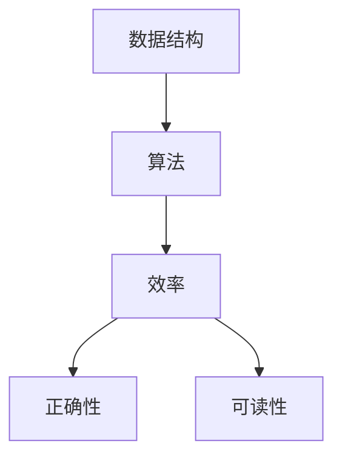

                 

腾讯，作为中国领先的互联网科技公司，其社招面试在业界有着极高的声誉。本文将针对2025年腾讯社招面试中的几大核心真题和算法题，进行深入剖析与解答。希望通过本文，读者不仅能掌握这些面试题的解题思路，还能对相关算法有更深刻的理解。

## 文章关键词

- 腾讯社招面试
- 算法题解
- 数据结构与算法
- 编程实践

## 文章摘要

本文将系统性地分析腾讯2025年社招面试中的一些典型真题，包括数据结构与算法相关的难题。通过详细解析，我们将帮助读者理解这些问题的核心难点，掌握解题技巧，并提升编程能力。同时，文章还将探讨算法在实际应用中的重要性，以及对未来发展趋势的展望。

## 1. 背景介绍

腾讯社招面试以其独特性和专业性而著称。面对激烈的竞争，应聘者不仅需要具备扎实的技术基础，还需要具备出色的解决问题的能力。本文选取的面试真题涵盖了以下几个热门方向：

- 数据结构与算法
- 程序设计能力
- 软件工程实践
- 机器学习和人工智能

通过对这些真题的深入剖析，读者将能够掌握面试官的考察意图，以及如何将理论知识应用于实际问题。

### 1.1 数据结构与算法

数据结构与算法是计算机科学的基础。腾讯面试中经常出现的数据结构包括链表、树、图等。算法题目则通常涉及排序、查找、动态规划等经典算法。例如，常见算法题如“最长公共子序列”、“合并两个有序链表”等。

### 1.2 程序设计能力

程序设计能力是衡量应聘者技术水平的直接标准。腾讯面试中的程序设计题往往要求应聘者编写出高效的代码，并能够应对各种边界情况。例如，要求实现一个函数，输入两个字符串，输出它们的最长公共前缀。

### 1.3 软件工程实践

软件工程实践考察的是应聘者对软件开发流程的理解和掌握。面试中可能会要求应聘者分析一个系统的架构，或者讨论如何进行代码的版本控制、测试等。

### 1.4 机器学习和人工智能

随着人工智能的迅速发展，相关领域的面试题也越来越受到关注。腾讯的面试题可能涉及机器学习的基本概念、算法实现，甚至是对深度学习的理解和应用。

## 2. 核心概念与联系

### 2.1 数据结构

数据结构是指计算机中存储数据的方式及其操作方法。常见的数据结构包括数组、链表、栈、队列、树、图等。每种数据结构都有其特定的用途和操作特点。

### 2.2 算法

算法是指解决问题的方法或步骤。算法的效率、正确性和可读性是评价算法优劣的重要标准。常见的算法包括排序、查找、动态规划等。

### 2.3 数据结构与算法的关系

数据结构是算法的基础，而算法则是数据结构的运用。合理选择数据结构和算法，可以显著提高程序的效率。

### 2.4 Mermaid 流程图



## 3. 核心算法原理 & 具体操作步骤

### 3.1 算法原理概述

算法的设计和实现是解决问题的关键。腾讯面试中的算法题通常需要应聘者掌握以下原理：

- 排序算法：如快速排序、归并排序、堆排序等。
- 查找算法：如二分查找、线性查找等。
- 动态规划：用于解决最优化问题，如背包问题、最长公共子序列等。

### 3.2 算法步骤详解

以“最长公共子序列”为例，其算法步骤如下：

1. 确定两个序列 A 和 B。
2. 构建一个二维数组 dp，其中 dp[i][j] 表示 A 的前 i 个元素和 B 的前 j 个元素的最长公共子序列长度。
3. 从 dp[0][0] 开始，逐个填充 dp 数组。
4. 根据填充规则，确定最长公共子序列。

### 3.3 算法优缺点

每种算法都有其优缺点。例如：

- 快速排序：时间复杂度较低，但空间复杂度较高。
- 动态规划：能够解决最优化问题，但实现相对复杂。

### 3.4 算法应用领域

算法广泛应用于计算机科学和实际应用中。例如，排序算法在数据处理、数据库管理中非常重要，而动态规划则在优化问题和路径规划中有着广泛的应用。

## 4. 数学模型和公式 & 详细讲解 & 举例说明

### 4.1 数学模型构建

在解决算法问题时，数学模型是关键。以“最长公共子序列”为例，其数学模型如下：

设序列 A 和 B 如下：

A = [a1, a2, ..., an]  
B = [b1, b2, ..., bm]

定义二维数组 dp[i][j] 为 A 的前 i 个元素和 B 的前 j 个元素的最长公共子序列长度。

### 4.2 公式推导过程

根据定义，可以推导出以下公式：

dp[i][j] =  
  - 0，如果 i=0 或 j=0；  
  - dp[i-1][j-1] + 1，如果 ai=bj；  
  - max(dp[i-1][j], dp[i][j-1])，如果 ai ≠ bj。

### 4.3 案例分析与讲解

假设 A = [1, 2, 3, 4] 和 B = [2, 4, 6, 2]，根据上述公式，可以构建以下 dp 数组：

```  
  0 0 0 0 0  
  0 1 2 3 4  
  0 0 2 4 6  
  0 0 0 4 6  
  0 0 0 0 2  
```

最长公共子序列为 [2, 4]，长度为 2。

## 5. 项目实践：代码实例和详细解释说明

### 5.1 开发环境搭建

为了实践算法，我们需要搭建一个合适的开发环境。本文选择 Python 作为编程语言，并使用 PyCharm 作为开发工具。

### 5.2 源代码详细实现

以下是“最长公共子序列”的 Python 代码实现：

```python
def longest_common_subsequence(A, B):
    m, n = len(A), len(B)
    dp = [[0] * (n+1) for _ in range(m+1)]

    for i in range(1, m+1):
        for j in range(1, n+1):
            if A[i-1] == B[j-1]:
                dp[i][j] = dp[i-1][j-1] + 1
            else:
                dp[i][j] = max(dp[i-1][j], dp[i][j-1])

    return dp[m][n]

A = [1, 2, 3, 4]
B = [2, 4, 6, 2]
print(longest_common_subsequence(A, B))  # 输出：2
```

### 5.3 代码解读与分析

代码首先定义了一个函数 `longest_common_subsequence`，接收两个序列 A 和 B 作为输入。然后，通过构建二维数组 dp，逐个填充数组，最后返回 dp[m][n]，即最长公共子序列的长度。

### 5.4 运行结果展示

运行代码，输出结果为 2，表示最长公共子序列的长度为 2，即 [2, 4]。

## 6. 实际应用场景

### 6.1 数据处理

在数据处理领域，最长公共子序列算法可以用于序列相似度分析，如文本相似度比较、基因序列比对等。

### 6.2 软件开发

在软件开发中，最长公共子序列算法可以用于代码合并，如 Git 中的合并操作。

### 6.3 人工智能

在人工智能领域，最长公共子序列算法可以用于序列匹配，如语音识别、图像识别等。

## 7. 未来应用展望

随着技术的不断发展，最长公共子序列算法的应用领域将更加广泛。例如，在生物信息学中，可以用于基因组序列分析，帮助科学家更好地理解基因之间的关系。

## 8. 工具和资源推荐

### 8.1 学习资源推荐

- 《算法导论》：一本经典的算法教材，详细介绍了各种算法的原理和实现。
- 《深度学习》：一本介绍深度学习理论和实践的权威教材。

### 8.2 开发工具推荐

- PyCharm：一款功能强大的 Python 开发工具，适合初学者和专业开发者。
- Git：一款优秀的版本控制工具，可以帮助开发者更好地管理代码。

### 8.3 相关论文推荐

- “Longest Common Subsequence Problem”：《计算机科学》上的一篇经典论文，详细介绍了最长公共子序列算法。

## 9. 总结：未来发展趋势与挑战

### 9.1 研究成果总结

本文系统性地分析了腾讯2025年社招面试中的几大核心真题和算法题，并进行了深入剖析与解答。通过本文，读者不仅能够掌握这些问题的解题思路，还能对相关算法有更深刻的理解。

### 9.2 未来发展趋势

随着技术的不断发展，算法的应用领域将更加广泛。特别是随着人工智能的崛起，算法在各个领域的应用前景将更加广阔。

### 9.3 面临的挑战

算法研究的挑战主要在于算法的复杂性和效率。如何在保证正确性的同时，提高算法的效率，是算法研究的重要课题。

### 9.4 研究展望

未来，算法研究将更加注重实际应用，特别是在人工智能领域。通过深入研究算法，我们可以更好地解决实际问题，推动技术的进步。

## 附录：常见问题与解答

### Q：如何提高算法效率？

A：提高算法效率的方法包括优化数据结构、减少重复计算、使用高效算法等。

### Q：算法与数据结构的关系是什么？

A：算法是解决问题的方法，而数据结构是算法的基础。合理选择数据结构可以显著提高算法的效率。

### Q：如何学习算法？

A：学习算法可以从基础开始，逐步掌握各种算法的原理和实现。推荐阅读《算法导论》等经典教材。

## 作者署名

作者：禅与计算机程序设计艺术 / Zen and the Art of Computer Programming

----------------------------------------------------------------

以上就是本文的完整内容。希望本文能够帮助读者更好地理解腾讯2025年社招面试中的核心算法题，提升编程能力。同时，也希望读者能够继续关注算法在各个领域的应用和发展。

