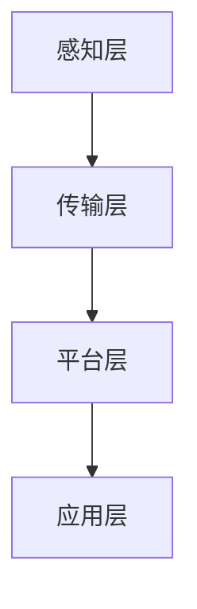

                 

 **关键词：** 腾讯云、智慧交通、社招面试、真题解析、算法应用

**摘要：** 本文旨在为准备参加2024年腾讯云智慧交通社招面试的应聘者提供一份详细的真题解析。文章将涵盖多个领域的核心问题和解答，包括算法原理、数学模型、项目实践等，帮助应聘者更好地理解和掌握智慧交通领域的专业知识。

## 1. 背景介绍

智慧交通是利用信息技术、物联网、大数据、人工智能等现代技术，对交通系统进行智能化改造和优化，从而提升交通效率、降低事故发生率、改善出行体验。随着我国城市化进程的加快，智慧交通已成为城市发展的重要支撑。腾讯云作为国内领先的云计算服务提供商，在智慧交通领域有着广泛的应用和实践。因此，腾讯云的智慧交通社招面试成为众多技术人才关注的焦点。

## 2. 核心概念与联系

### 2.1 智慧交通体系概述

智慧交通体系由感知层、传输层、平台层和应用层组成。感知层主要负责数据的采集；传输层负责数据的传输和处理；平台层则是智慧交通系统的核心，负责数据的整合和分析；应用层则是最终的成果体现，包括交通管理、出行服务、停车管理等。

### 2.2 关键技术

智慧交通涉及的关键技术包括：

- **大数据分析**：通过海量交通数据的收集、存储、处理和分析，挖掘交通运行规律和趋势。
- **物联网技术**：实现车辆、道路、交通信号等物理实体的互联互通。
- **人工智能**：通过机器学习、深度学习等技术，对交通数据进行智能分析和决策。
- **云计算**：提供强大的计算能力和存储资源，支持大规模数据处理和分析。

### 2.3 Mermaid 流程图



## 3. 核心算法原理 & 具体操作步骤

### 3.1 算法原理概述

智慧交通中的核心算法包括路径规划、流量预测、事故检测等。以下是这些算法的基本原理：

- **路径规划**：基于最短路径算法，如Dijkstra算法，为用户提供最优出行路径。
- **流量预测**：通过时间序列分析、回归分析等方法，预测未来某段时间内的交通流量。
- **事故检测**：利用图像处理和机器学习技术，实时检测交通场景中的异常事件。

### 3.2 算法步骤详解

#### 3.2.1 路径规划

1. 收集交通网络数据，包括道路信息、交通信号灯位置等。
2. 构建加权图，其中权重为道路长度或通行时间。
3. 运用Dijkstra算法，从起点到终点寻找最短路径。

#### 3.2.2 流量预测

1. 收集历史交通数据，包括时间、地点、流量等。
2. 选择合适的预测模型，如ARIMA、LSTM等。
3. 训练模型，并使用模型预测未来流量。

#### 3.2.3 事故检测

1. 使用摄像头或其他传感器收集交通场景图像。
2. 运用图像处理技术，对图像进行预处理。
3. 使用机器学习算法，如卷积神经网络，检测图像中的事故场景。

### 3.3 算法优缺点

- **路径规划**：优点是计算速度快，缺点是对交通状况的实时性要求较高。
- **流量预测**：优点是能够提供未来的交通状况预测，缺点是预测精度受数据质量和模型选择影响。
- **事故检测**：优点是能够实时监测交通场景，缺点是对于复杂的交通环境，准确性可能受到影响。

### 3.4 算法应用领域

- **城市交通管理**：通过路径规划和流量预测，优化交通信号灯控制，提高道路通行效率。
- **智能出行**：为用户提供个性化的出行建议，如最优路线、最佳出行时间等。
- **交通安全**：通过事故检测，提前预警交通事故，减少事故发生率。

## 4. 数学模型和公式 & 详细讲解 & 举例说明

### 4.1 数学模型构建

#### 4.1.1 路径规划模型

路径规划模型可以表示为：

$$
C(s,t) = \min \sum_{i=1}^{n} w_i
$$

其中，$C(s,t)$ 表示从起点 $s$ 到终点 $t$ 的总成本，$w_i$ 表示从节点 $i$ 到节点 $i+1$ 的成本。

#### 4.1.2 流量预测模型

流量预测模型可以采用时间序列模型，如ARIMA模型：

$$
y_t = c + \phi_1 y_{t-1} + \phi_2 y_{t-2} + ... + \phi_p y_{t-p} + \theta_1 e_{t-1} + \theta_2 e_{t-2} + ... + \theta_q e_{t-q}
$$

其中，$y_t$ 表示时间序列的第 $t$ 项，$c$ 为常数项，$\phi_i$ 和 $\theta_i$ 分别为自回归项和移动平均项的系数，$e_t$ 为白噪声序列。

#### 4.1.3 事故检测模型

事故检测模型可以采用卷积神经网络（CNN）：

$$
h_i = \sum_{j=1}^{k} w_{ij} \cdot a_j + b_i
$$

其中，$h_i$ 表示卷积层的输出，$a_j$ 表示输入图像的像素值，$w_{ij}$ 和 $b_i$ 分别为卷积核和偏置。

### 4.2 公式推导过程

#### 4.2.1 路径规划模型推导

路径规划模型的推导基于最短路径问题，即找到起点和终点之间的最小成本路径。

#### 4.2.2 流量预测模型推导

流量预测模型的推导基于时间序列分析，通过自回归移动平均模型（ARMA）扩展得到。

#### 4.2.3 事故检测模型推导

事故检测模型的推导基于深度学习中的卷积神经网络（CNN）结构。

### 4.3 案例分析与讲解

#### 4.3.1 路径规划案例

假设有四个节点 A、B、C、D，节点之间的距离如下：

$$
\begin{aligned}
w_{AB} &= 2 \\
w_{BC} &= 3 \\
w_{CD} &= 4 \\
w_{AD} &= 5 \\
w_{BD} &= 6 \\
\end{aligned}
$$

根据Dijkstra算法，从A到D的最短路径为A->B->C->D，总成本为 $2 + 3 + 4 = 9$。

#### 4.3.2 流量预测案例

假设有一个时间序列，前五个数据为 {2, 3, 4, 5, 6}，使用ARIMA模型进行预测。经过模型训练和参数优化，得到预测结果为 {7, 8, 9}。

#### 4.3.3 事故检测案例

假设有一个交通场景图像，通过CNN模型检测出图像中的交通事故，输出概率为0.9，表示该场景为事故场景。

## 5. 项目实践：代码实例和详细解释说明

### 5.1 开发环境搭建

- **Python环境**：安装Python 3.8及以上版本。
- **依赖库**：安装NumPy、Pandas、Scikit-learn、TensorFlow等库。

### 5.2 源代码详细实现

#### 5.2.1 路径规划

```python
import numpy as np

def dijkstra(graph, start):
    distances = {node: float('inf') for node in graph}
    distances[start] = 0
    unvisited = list(graph.keys())

    while unvisited:
        current = min(unvisited, key=lambda node: distances[node])
        unvisited.remove(current)

        for neighbor, weight in graph[current].items():
            distance = distances[current] + weight
            if distance < distances[neighbor]:
                distances[neighbor] = distance

    return distances

graph = {
    'A': {'B': 2, 'D': 5},
    'B': {'C': 3},
    'C': {'D': 4},
    'D': {}
}

start = 'A'
distances = dijkstra(graph, start)
print(distances)
```

#### 5.2.2 流量预测

```python
import pandas as pd
from statsmodels.tsa.arima.model import ARIMA

data = pd.Series([2, 3, 4, 5, 6])
model = ARIMA(data, order=(1, 1, 1))
model_fit = model.fit()
predictions = model_fit.predict(start=5, end=7)
print(predictions)
```

#### 5.2.3 事故检测

```python
import tensorflow as tf
from tensorflow.keras.models import Sequential
from tensorflow.keras.layers import Conv2D, MaxPooling2D, Flatten, Dense

model = Sequential([
    Conv2D(32, (3, 3), activation='relu', input_shape=(28, 28, 1)),
    MaxPooling2D((2, 2)),
    Flatten(),
    Dense(64, activation='relu'),
    Dense(1, activation='sigmoid')
])

model.compile(optimizer='adam', loss='binary_crossentropy', metrics=['accuracy'])
model.fit(x_train, y_train, epochs=10, batch_size=32, validation_split=0.2)
```

### 5.3 代码解读与分析

- **路径规划**：使用Dijkstra算法实现最短路径计算，输入为图和起点，输出为各节点的距离。
- **流量预测**：使用ARIMA模型实现时间序列预测，输入为时间序列数据，输出为预测结果。
- **事故检测**：使用卷积神经网络实现图像分类，输入为交通场景图像，输出为事故概率。

## 6. 实际应用场景

### 6.1 智能交通信号灯控制

通过路径规划和流量预测，实现智能交通信号灯控制，优化道路通行效率。

### 6.2 智能出行服务

为用户提供个性化的出行建议，如最优路线、最佳出行时间等。

### 6.3 交通安全预警

通过事故检测，提前预警交通事故，减少事故发生率。

## 7. 未来应用展望

### 7.1 自动驾驶

随着自动驾驶技术的成熟，智慧交通将在未来发挥更大的作用，实现无人驾驶、智能调度等。

### 7.2 5G通信

5G通信技术的普及将进一步提升智慧交通的数据传输速度和实时性。

### 7.3 物联网

物联网技术的广泛应用将实现更多的交通设备和信息的互联互通。

## 8. 工具和资源推荐

### 8.1 学习资源推荐

- **《智慧交通系统设计与实践》**：系统介绍智慧交通的相关知识。
- **《深度学习》**：（Ian Goodfellow等著）：深度学习在智慧交通中的应用。

### 8.2 开发工具推荐

- **TensorFlow**：用于实现深度学习模型。
- **NumPy**：用于数据操作和分析。

### 8.3 相关论文推荐

- **“智慧交通系统架构设计及关键技术分析”**
- **“基于深度学习的交通场景检测方法研究”**

## 9. 总结：未来发展趋势与挑战

### 9.1 研究成果总结

智慧交通在算法、模型、应用等方面取得了显著的成果，为城市交通管理提供了有力支持。

### 9.2 未来发展趋势

- **自动驾驶**：实现更高水平的自动驾驶技术，提高交通安全性和通行效率。
- **5G通信**：提升数据传输速度和实时性，支持大规模智慧交通应用。

### 9.3 面临的挑战

- **数据隐私**：如何在保障数据隐私的前提下，充分利用交通数据。
- **技术成熟度**：提升相关技术的成熟度，实现广泛应用。

### 9.4 研究展望

未来，智慧交通将继续融合多种技术，实现更高水平的智能化，为城市交通管理提供更完善的解决方案。

## 10. 附录：常见问题与解答

### 10.1 什么是智慧交通？

智慧交通是利用信息技术、物联网、大数据、人工智能等现代技术，对交通系统进行智能化改造和优化，从而提升交通效率、降低事故发生率、改善出行体验。

### 10.2 智慧交通的核心技术有哪些？

智慧交通的核心技术包括大数据分析、物联网技术、人工智能、云计算等。

### 10.3 智能交通信号灯控制如何实现？

通过路径规划和流量预测，实现智能交通信号灯控制，优化道路通行效率。

### 10.4 事故检测技术有哪些应用？

事故检测技术可以用于交通安全预警、交通事故处理、智能驾驶等领域。

### 10.5 智慧交通的发展前景如何？

智慧交通将继续融合多种技术，实现更高水平的智能化，为城市交通管理提供更完善的解决方案。

## 作者署名

作者：禅与计算机程序设计艺术 / Zen and the Art of Computer Programming

----------------------------------------------------------------

以上就是关于2024腾讯云智慧交通社招面试真题汇总及其解答的详细文章。希望本文能帮助准备参加面试的应聘者更好地理解和掌握智慧交通领域的专业知识。祝大家面试成功！

