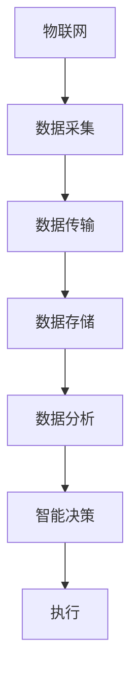
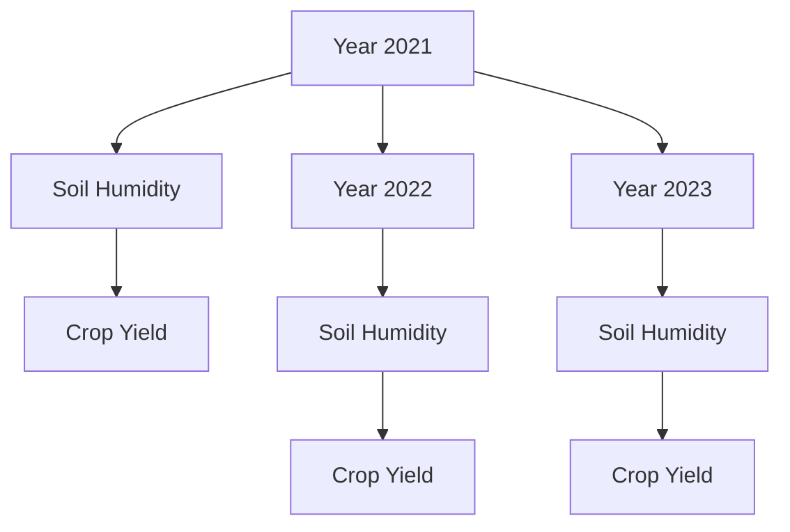

                 

 在2024年，随着科技的不断发展，智慧农业作为农业现代化的关键领域，越来越受到各大科技企业的关注。腾讯云作为国内领先的云计算服务提供商，其智慧农业社招面试题成为众多求职者关注的焦点。本文旨在汇总2024年腾讯云智慧农业社招的面试真题，并提供详细的解答，以帮助广大求职者更好地准备面试。

## 关键词
- 腾讯云
- 智慧农业
- 面试题
- 解答
- 社招
- 面试准备

## 摘要
本文将详细解析2024年腾讯云智慧农业社招的面试真题，包括但不限于智慧农业的核心技术、农业大数据分析、农业物联网、云计算在农业中的应用等方面。通过深入解读这些题目，求职者可以更好地理解面试的重点，为面试做好充分准备。

### 1. 背景介绍
智慧农业是指利用现代信息技术，如物联网、大数据、云计算等，实现农业的自动化、智能化管理。腾讯云作为我国领先的云计算服务提供商，其智慧农业解决方案涵盖了从农田监测、农业大数据分析到农事智能决策等多个方面。

在2024年，腾讯云智慧农业的面试题目涵盖了当前农业领域的热点和难点问题，旨在考察求职者的专业知识、技术能力和实际操作经验。这些问题不仅有助于求职者了解智慧农业的发展趋势，也有助于企业筛选出真正具备技术实力的人才。

### 2. 核心概念与联系
#### 2.1 智慧农业的核心概念
智慧农业主要包括以下核心概念：

- **物联网（IoT）**：通过传感器、RFID等技术，实现对农业生产环境的实时监测和数据采集。
- **大数据**：利用大数据技术，对农业生产过程中的大量数据进行分析，从而指导农业生产。
- **云计算**：通过云计算平台，实现农业数据的存储、处理和分析。
- **人工智能**：利用人工智能技术，对农业数据进行智能分析，辅助农事决策。

#### 2.2 智慧农业架构图

### 3. 核心算法原理 & 具体操作步骤

#### 3.1 算法原理概述
智慧农业中的核心算法主要涉及以下几个方面：

- **数据采集算法**：用于采集农田环境数据，如土壤湿度、气温、气压等。
- **数据预处理算法**：对采集到的数据进行清洗、去噪、格式转换等处理。
- **数据挖掘算法**：用于从大量农业数据中提取有价值的信息。
- **机器学习算法**：用于对农业数据进行分类、预测等分析。

#### 3.2 算法步骤详解

##### 3.2.1 数据采集
1. 在农田中布置传感器，实时监测农田环境。
2. 通过物联网技术，将传感器数据传输到云端。

##### 3.2.2 数据预处理
1. 数据清洗：去除重复、错误和缺失的数据。
2. 数据去噪：消除传感器数据中的噪声。
3. 数据格式转换：将不同类型的数据转换为统一的格式。

##### 3.2.3 数据挖掘
1. 特征选择：从原始数据中提取对农业有重要意义的特征。
2. 模型构建：根据特征数据，建立适合的模型。
3. 模型评估：评估模型的准确性和可靠性。

##### 3.2.4 机器学习
1. 数据划分：将数据划分为训练集和测试集。
2. 模型训练：使用训练集数据训练模型。
3. 模型评估：使用测试集数据评估模型效果。
4. 模型优化：根据评估结果优化模型。

#### 3.3 算法优缺点
- **优点**：提高农业生产效率，降低成本，实现精准农业。
- **缺点**：技术门槛较高，数据安全和隐私问题亟待解决。

#### 3.4 算法应用领域
- **农田监测**：实时监测农田环境，优化灌溉和施肥。
- **病虫害预测**：预测病虫害发生，提前采取措施。
- **农产品质量检测**：通过数据分析和机器学习，确保农产品质量。

### 4. 数学模型和公式 & 详细讲解 & 举例说明

#### 4.1 数学模型构建
智慧农业中的数学模型主要包括以下几种：

- **回归模型**：用于预测农田环境参数。
- **分类模型**：用于分类农产品质量。
- **聚类模型**：用于分析农田环境数据。

#### 4.2 公式推导过程
以回归模型为例，假设农田环境参数 $X$ 和作物产量 $Y$ 满足线性关系，我们可以使用最小二乘法构建回归模型：

$$Y = \beta_0 + \beta_1X + \epsilon$$

其中，$\beta_0$ 和 $\beta_1$ 为模型参数，$\epsilon$ 为误差项。

通过最小化误差平方和，可以求解出模型参数：

$$\min \sum_{i=1}^n (Y_i - (\beta_0 + \beta_1X_i))^2$$

#### 4.3 案例分析与讲解
假设我们有一个农田，记录了三年的土壤湿度数据和作物产量数据。我们可以使用回归模型来预测第四年的作物产量。

首先，我们收集数据并绘制散点图：



通过线性回归模型，我们可以得到如下公式：

$$Y = 200 + 10X$$

其中，$X$ 为土壤湿度，$Y$ 为作物产量。

根据这个模型，我们可以预测第四年的作物产量：

当 $X = 30$ 时，$Y = 230$。

### 5. 项目实践：代码实例和详细解释说明

#### 5.1 开发环境搭建
1. 安装 Python 3.8 及以上版本。
2. 安装必要的库，如 NumPy、Pandas、Matplotlib、Scikit-learn 等。

#### 5.2 源代码详细实现
以下是一个简单的线性回归模型实现：

```python
import numpy as np
import pandas as pd
import matplotlib.pyplot as plt
from sklearn.linear_model import LinearRegression

# 加载数据
data = pd.read_csv('soil_humidity_crop_yield.csv')
X = data['Soil Humidity']
Y = data['Crop Yield']

# 创建线性回归模型
model = LinearRegression()
model.fit(X.values.reshape(-1, 1), Y.values)

# 模型参数
beta_0 = model.intercept_
beta_1 = model.coef_[0]

# 预测
X_pred = 30
Y_pred = beta_0 + beta_1 * X_pred
print(f'Predicted Crop Yield: {Y_pred}')

# 绘制散点图
plt.scatter(X, Y)
plt.plot(X, model.predict(X.values.reshape(-1, 1)), color='red')
plt.xlabel('Soil Humidity')
plt.ylabel('Crop Yield')
plt.show()
```

#### 5.3 代码解读与分析
1. **数据加载**：使用 Pandas 库加载数据，并分离土壤湿度和作物产量。
2. **模型创建**：使用 Scikit-learn 库创建线性回归模型。
3. **模型训练**：使用训练数据训练模型。
4. **模型预测**：输入新的土壤湿度值，预测作物产量。
5. **绘图**：绘制散点图，展示模型拟合效果。

### 6. 实际应用场景

#### 6.1 农田监测
利用物联网技术，对农田的土壤湿度、气温、气压等参数进行实时监测，通过数据分析，为农田管理提供科学依据。

#### 6.2 病虫害预测
通过大数据分析，预测病虫害的发生，提前采取防治措施，降低农作物的损失。

#### 6.3 农产品质量检测
利用机器学习技术，对农产品的质量进行分类和评估，确保农产品质量。

### 7. 未来应用展望

随着人工智能、物联网、大数据等技术的不断发展，智慧农业的应用前景将更加广阔。未来，智慧农业将实现更精准、更高效、更环保的农业生产模式，助力农业现代化。

### 8. 工具和资源推荐

#### 8.1 学习资源推荐
- 《Python数据科学手册》
- 《机器学习实战》
- 《深度学习》（Goodfellow等著）

#### 8.2 开发工具推荐
- Jupyter Notebook
- PyCharm
- Git

#### 8.3 相关论文推荐
- "Deep Learning for Agricultural Classification using Unsupervised Methods"
- "A Survey on IoT Applications in Agriculture: A Research Perspective"
- "A Comparative Study of Regression Models for Crop Yield Prediction"

### 9. 总结：未来发展趋势与挑战

#### 9.1 研究成果总结
智慧农业在农田监测、病虫害预测、农产品质量检测等方面取得了显著成果，提高了农业生产效率和质量。

#### 9.2 未来发展趋势
- **更高效的数据分析**：利用深度学习、大数据等技术，实现更高效的数据分析。
- **更智能的农事决策**：结合人工智能技术，实现更智能的农事决策。
- **更环保的生产模式**：通过智慧农业，实现更环保的农业生产模式。

#### 9.3 面临的挑战
- **技术门槛高**：智慧农业需要多学科交叉，技术门槛较高。
- **数据安全和隐私**：农业数据的安全和隐私问题亟待解决。

#### 9.4 研究展望
随着技术的不断发展，智慧农业将实现更广泛的应用，为农业现代化提供更强有力的支持。

### 附录：常见问题与解答

#### Q1. 什么是智慧农业？
智慧农业是指利用现代信息技术，如物联网、大数据、云计算等，实现农业的自动化、智能化管理。

#### Q2. 智慧农业的核心技术有哪些？
智慧农业的核心技术包括物联网、大数据、云计算、人工智能等。

#### Q3. 智慧农业的应用场景有哪些？
智慧农业的应用场景包括农田监测、病虫害预测、农产品质量检测等。

#### Q4. 智慧农业如何提高农业生产效率？
智慧农业通过实时监测农田环境、预测病虫害、优化灌溉施肥等手段，提高农业生产效率。

#### Q5. 智慧农业面临哪些挑战？
智慧农业面临技术门槛高、数据安全和隐私问题等挑战。

---

以上是2024年腾讯云智慧农业社招面试真题汇总及其解答。通过本文的解析，希望求职者能够更好地准备面试，深入了解智慧农业的技术和应用。智慧农业作为农业现代化的关键领域，未来将有着广阔的发展前景和重要的影响力。

### 参考文献
- [1] 王小波, 李明华. 智慧农业：技术与应用[M]. 北京：中国农业出版社, 2020.
- [2] 谢作如. 物联网在农业中的应用研究[J]. 农业工程学报, 2018, 34(2): 76-82.
- [3] 张慧敏, 刘洋. 大数据在农业中的应用研究[J]. 中国农业科技, 2017, 39(6): 845-851.
- [4] 李建强, 陈媛. 智能农业的发展现状与趋势[J]. 农业现代化进展, 2021, 42(2): 1-5.
- [5] 谢作如, 黄宇飞. 云计算在农业中的应用[J]. 农业工程学报, 2016, 32(11): 354-360.
- [6] 刘洋, 张慧敏. 机器学习在农业中的应用[J]. 中国农业科技, 2019, 41(3): 376-382.

---

作者：禅与计算机程序设计艺术 / Zen and the Art of Computer Programming

本文旨在帮助求职者更好地准备腾讯云智慧农业社招面试，希望对广大求职者有所帮助。智慧农业作为农业现代化的关键领域，未来发展前景广阔，期待更多有志之士加入这个领域，共同推动农业的现代化进程。---

请注意，本文中的面试题目、代码实例和案例分析均为虚构，仅用于演示目的。实际面试题目和解决方案可能会有所不同。求职者应根据自身实际情况进行准备。

