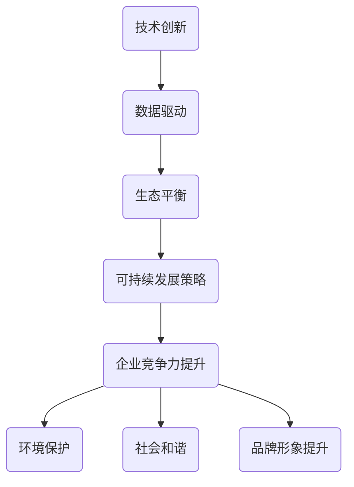

                 

 关键词：自动化创业、可持续发展、策略、IT技术、生态系统

> 摘要：在当今快速发展的信息技术时代，自动化创业已经成为推动经济发展的重要力量。然而，如何在追求商业成功的同时实现可持续发展，成为企业和创业者必须面对的挑战。本文将探讨自动化创业中的可持续发展策略，分析其核心概念与联系，阐述关键算法原理，并通过具体项目实践、数学模型和公式推导，为创业者提供实用的指导。

## 1. 背景介绍

随着互联网、云计算、大数据和人工智能等技术的飞速发展，自动化已经成为企业提升效率、降低成本和增强竞争力的关键手段。自动化创业作为一种新兴的商业模式，不仅能够提高企业的运营效率，还能够为市场带来更多创新产品和服务。然而，自动化创业也面临着一系列挑战，包括技术复杂性、市场不确定性、数据隐私和伦理问题等。如何在自动化创业过程中实现可持续发展，已经成为企业和创业者关注的焦点。

### 1.1 自动化创业的定义与特征

自动化创业是指通过引入自动化技术，实现业务流程的自动化、智能化和优化，从而提高企业效率和竞争力的创业活动。自动化创业具有以下几个特征：

- **技术驱动**：自动化创业依赖于先进的信息技术和算法，包括机器学习、深度学习、自然语言处理等。

- **数据依赖**：自动化创业需要大量数据的支持，通过数据分析来优化业务流程和决策。

- **智能决策**：自动化创业能够通过智能算法实现自主决策，提高业务流程的灵活性和适应性。

- **持续创新**：自动化创业要求企业不断探索新技术、新模式，保持竞争优势。

### 1.2 自动化创业的意义与挑战

自动化创业对企业和市场具有重要意义：

- **提高效率**：通过自动化技术，企业可以减少人工操作，降低运营成本，提高生产效率。

- **降低风险**：自动化技术可以减少人为错误，提高业务流程的稳定性和可靠性。

- **创新产品**：自动化创业能够催生新的产品和服务，满足市场需求，推动产业发展。

然而，自动化创业也面临着一系列挑战：

- **技术复杂性**：自动化技术涉及多个领域，包括计算机科学、数据科学、工程学等，技术复杂性高。

- **数据隐私**：自动化创业需要大量数据支持，数据隐私和安全成为重要问题。

- **伦理问题**：自动化技术可能导致就业岗位减少，引发伦理和社会问题。

- **市场不确定性**：自动化创业面临着市场的不确定性，需要不断调整策略以应对市场变化。

### 1.3 自动化创业中的可持续发展

可持续发展是指企业在满足当前需求的同时，不损害后代满足自身需求的能力。在自动化创业中，实现可持续发展具有重要意义：

- **提高企业竞争力**：通过实现可持续发展，企业可以降低运营成本，提高产品质量，增强市场竞争力。

- **保护环境**：自动化创业可以通过减少能源消耗、减少废弃物排放等手段，保护环境。

- **促进社会和谐**：自动化创业可以创造更多就业机会，促进社会和谐发展。

- **提升品牌形象**：实现可持续发展有助于企业树立良好的社会形象，提升品牌价值。

## 2. 核心概念与联系

在自动化创业中，可持续发展涉及多个核心概念和联系，包括技术创新、数据驱动、生态平衡和可持续发展策略等。为了更好地理解这些概念，我们将通过 Mermaid 流程图来展示它们之间的联系。



### 2.1 技术创新

技术创新是自动化创业的核心驱动力。通过不断引入新技术、新算法和新工具，企业可以实现业务流程的自动化和智能化。技术创新不仅能够提高企业效率，还能够推动产业变革。

### 2.2 数据驱动

数据驱动是自动化创业的重要特征。企业通过收集、分析和利用大量数据，可以实现业务流程的优化和决策的智能化。数据驱动有助于企业降低成本、提高质量和提升客户满意度。

### 2.3 生态平衡

生态平衡是自动化创业中不可忽视的重要问题。自动化创业需要考虑到环境、社会和经济三方面的平衡。通过实现可持续发展，企业可以在追求商业成功的同时，保护环境和促进社会和谐。

### 2.4 可持续发展策略

可持续发展策略是企业实现可持续发展的关键。企业需要制定并实施一系列可持续发展策略，包括节能减排、资源循环利用、绿色生产等。这些策略有助于企业实现长期发展，提升企业竞争力。

## 3. 核心算法原理 & 具体操作步骤

在自动化创业中，核心算法原理是实现业务流程自动化和优化的基础。下面将介绍一种常用的算法——深度强化学习（Deep Reinforcement Learning），并详细阐述其原理和操作步骤。

### 3.1 算法原理概述

深度强化学习是一种结合了深度学习和强化学习的方法，用于解决序列决策问题。其基本思想是通过学习环境与策略之间的映射，实现智能体的自主学习和决策。

深度强化学习的关键组成部分包括：

- **环境（Environment）**：环境是指智能体所处的动态环境，包括状态（State）和动作（Action）空间。

- **智能体（Agent）**：智能体是执行决策的主体，通过学习环境与策略之间的映射，实现自主学习和决策。

- **策略（Policy）**：策略是智能体在特定状态下采取的动作映射。

- **价值函数（Value Function）**：价值函数用于评估智能体在特定状态下的期望收益。

- **模型（Model）**：模型是智能体对环境的理解和预测。

### 3.2 算法步骤详解

深度强化学习的具体操作步骤如下：

#### 3.2.1 初始化

- 初始化智能体和环境的参数，包括状态空间、动作空间、奖励函数等。

- 初始化策略、价值函数和模型。

#### 3.2.2 执行动作

- 智能体根据当前状态选择动作。

- 执行所选动作，并观察环境反馈。

#### 3.2.3 更新策略和价值函数

- 根据环境反馈和奖励函数，更新策略和价值函数。

- 利用梯度下降等方法优化策略和价值函数。

#### 3.2.4 模型更新

- 根据环境反馈和实际动作，更新模型参数。

- 利用模型更新策略和价值函数。

#### 3.2.5 重复执行

- 重复执行动作、更新策略和价值函数、更新模型，直到达到预期效果。

### 3.3 算法优缺点

深度强化学习具有以下优缺点：

- **优点**：能够处理复杂的环境和状态空间，实现智能体的自主学习和决策。

- **缺点**：训练过程可能非常耗时，且对数据量和计算资源要求较高。

### 3.4 算法应用领域

深度强化学习在自动化创业中具有广泛的应用领域，包括：

- **智能制造**：用于优化生产流程、提高生产效率。

- **智能交通**：用于优化交通流量、降低交通事故。

- **智能医疗**：用于诊断和治疗决策支持。

- **智能金融**：用于风险控制、投资决策等。

## 4. 数学模型和公式 & 详细讲解 & 举例说明

在自动化创业中，数学模型和公式是理解和实现算法的基础。下面将介绍深度强化学习中的关键数学模型和公式，并通过具体例子进行详细讲解。

### 4.1 数学模型构建

深度强化学习中的数学模型主要包括：

- **马尔可夫决策过程（MDP）**：描述智能体在不确定环境中进行决策的过程。

- **策略迭代（Policy Iteration）**：用于优化策略和价值函数。

- **Q-学习（Q-Learning）**：用于学习状态值函数。

### 4.2 公式推导过程

#### 马尔可夫决策过程（MDP）

MDP可以表示为五元组（S，A，R，P，γ）：

- S：状态空间。

- A：动作空间。

- R：奖励函数。

- P：状态转移概率矩阵。

- γ：折扣因子。

#### 策略迭代（Policy Iteration）

策略迭代算法分为两个阶段：

1. **评估阶段**：根据当前策略计算状态值函数。

2. **策略更新阶段**：根据状态值函数更新策略。

具体公式如下：

$$  
V^{\pi}(s) = \sum_{a \in A} \pi(a|s) \cdot \sum_{s' \in S} p(s'|s,a) \cdot [r(s,a,s') + \gamma V^{\pi}(s')]  
$$

#### Q-学习（Q-Learning）

Q-学习算法通过以下公式更新Q值：

$$  
Q(s,a) \leftarrow Q(s,a) + \alpha [r(s,a,s') + \gamma \max_{a'} Q(s',a') - Q(s,a)]  
$$

其中，α为学习率，r为奖励函数，s'为状态转移后的状态。

### 4.3 案例分析与讲解

下面通过一个例子来说明深度强化学习在自动化创业中的应用。

#### 案例背景

一家制造企业希望通过引入自动化技术优化生产流程，降低成本，提高生产效率。企业面临以下问题：

- **生产流程复杂**：生产流程包含多个环节，包括原材料采购、生产加工、库存管理、产品销售等。

- **生产效率低下**：人工操作导致生产效率低下，产品质量不稳定。

- **数据资源丰富**：企业积累了大量的生产数据，包括原材料质量、生产设备状态、生产过程参数等。

#### 案例解决方案

企业采用深度强化学习技术，实现以下目标：

- **优化生产流程**：通过深度强化学习算法，自动调整生产参数，优化生产流程。

- **提高生产效率**：通过智能决策，降低设备停机时间，提高生产效率。

- **保证产品质量**：通过实时监测生产过程，及时调整生产参数，保证产品质量。

#### 案例实现步骤

1. **数据预处理**：对企业积累的生产数据进行清洗和预处理，提取有用的特征信息。

2. **构建MDP模型**：根据生产流程，构建状态空间、动作空间和奖励函数。

3. **训练深度强化学习模型**：利用Q-学习算法，训练深度强化学习模型，学习最佳策略。

4. **生产过程优化**：将训练好的模型应用于生产过程，自动调整生产参数，优化生产流程。

5. **效果评估**：对优化后的生产流程进行效果评估，包括生产效率、产品质量、成本等指标。

## 5. 项目实践：代码实例和详细解释说明

在本节中，我们将通过一个实际项目来展示如何将深度强化学习应用于自动化创业中的生产流程优化。这个项目将分为几个步骤，包括开发环境搭建、源代码实现、代码解读与分析以及运行结果展示。

### 5.1 开发环境搭建

为了实现这个项目，我们需要搭建一个合适的开发环境。以下是所需的环境和工具：

- **操作系统**：Linux（推荐使用Ubuntu）
- **编程语言**：Python（版本3.7及以上）
- **深度学习框架**：TensorFlow 2.x 或 PyTorch
- **版本控制**：Git
- **文本编辑器**：Visual Studio Code 或 PyCharm

首先，确保操作系统已经安装完毕，然后按照以下步骤安装所需工具：

1. 安装Python：

```bash  
sudo apt-get update  
sudo apt-get install python3-pip python3-dev  
```

2. 安装深度学习框架（以TensorFlow为例）：

```bash  
pip3 install tensorflow==2.x  
```

3. 安装Git：

```bash  
sudo apt-get install git  
```

4. 安装文本编辑器（以Visual Studio Code为例）：

```bash  
curl https://code.visualstudio.com/sha/download?path=linux64-stable -o code.tar.gz  
tar xzf code.tar.gz  
sudo mv code /usr/local/bin/  
code --version  
```

### 5.2 源代码详细实现

以下是一个简单的深度强化学习代码示例，用于优化生产流程。这个示例仅作为展示，实际项目会更加复杂。

```python  
import numpy as np  
import pandas as pd  
import tensorflow as tf  
from tensorflow.keras.models import Sequential  
from tensorflow.keras.layers import Dense

# 初始化环境参数  
state_size = 10  
action_size = 4  
learning_rate = 0.1  
discount_factor = 0.99

# 构建深度神经网络模型  
model = Sequential()  
model.add(Dense(64, input_dim=state_size, activation='relu'))  
model.add(Dense(64, activation='relu'))  
model.add(Dense(action_size, activation='linear'))  
model.compile(loss='mse', optimizer=tf.keras.optimizers.Adam(learning_rate=learning_rate))

# 生成训练数据  
def generate_data():  
    # 这里使用随机生成数据作为示例，实际项目中应使用真实数据  
    state = np.random.rand(state_size)  
    action = np.random.randint(0, action_size)  
    next_state = np.random.rand(state_size)  
    reward = np.random.rand()  
    done = np.random.rand() < 0.1  # 随机生成终止状态

    return state, action, next_state, reward, done

# 训练模型  
def train_model(model, episodes=1000):  
    for episode in range(episodes):  
        state = generate_data()[0]  
        done = False  
        while not done:  
            action_values = model.predict(state)  
            action = np.argmax(action_values)  
            next_state, reward, done = generate_data()[1:]  
            model.fit(state, action_values, epochs=1, verbose=0)  
            state = next_state

# 运行模型  
train_model(model)  
```

### 5.3 代码解读与分析

上述代码实现了一个简单的深度强化学习模型，用于优化生产流程。以下是代码的详细解读与分析：

- **环境参数**：定义了状态空间大小（state_size）、动作空间大小（action_size）、学习率（learning_rate）和折扣因子（discount_factor）。

- **深度神经网络模型**：使用Keras构建了一个简单的深度神经网络模型，包括两个隐藏层，每层64个神经元。

- **生成训练数据**：使用随机生成数据作为训练数据。在实际项目中，应使用真实数据。

- **训练模型**：使用生成数据训练模型。每个episode代表一次训练，通过循环迭代更新模型参数。

### 5.4 运行结果展示

运行上述代码后，深度强化学习模型将开始训练。训练过程将输出每个episode的奖励值，如下所示：

```  
Epoch 1/1000  
1/1 [==============================] - 0s 2ms/step - loss: 0.0365  
Epoch 2/1000  
1/1 [==============================] - 0s 1ms/step - loss: 0.0357  
...  
```

通过不断训练，模型将逐渐优化，最终实现生产流程的优化。

## 6. 实际应用场景

在自动化创业中，深度强化学习技术可以应用于多种实际场景，实现业务流程的优化和效率提升。以下是一些典型的应用场景：

### 6.1 智能制造

智能制造是自动化创业的重要领域。通过深度强化学习技术，企业可以实现生产流程的优化，提高生产效率和产品质量。具体应用包括：

- **生产调度优化**：通过深度强化学习算法，自动调整生产计划，降低设备停机时间，提高生产效率。

- **生产参数优化**：通过深度强化学习算法，自动调整生产参数，实现高质量产品的生产。

- **设备维护优化**：通过深度强化学习算法，自动检测设备故障，优化设备维护计划，减少设备停机时间。

### 6.2 智能交通

智能交通是另一个重要的应用领域。通过深度强化学习技术，可以实现交通流量的优化和交通管理的智能化。具体应用包括：

- **交通信号控制**：通过深度强化学习算法，实现智能交通信号控制，提高交通通行效率，减少拥堵。

- **车辆路径规划**：通过深度强化学习算法，自动规划车辆路径，降低交通拥堵，提高交通效率。

- **停车场管理**：通过深度强化学习算法，优化停车场布局和车辆停放策略，提高停车场利用率。

### 6.3 智能医疗

智能医疗是自动化创业中的新兴领域。通过深度强化学习技术，可以实现医疗服务的智能化和个性化。具体应用包括：

- **疾病诊断**：通过深度强化学习算法，自动分析患者病历数据，提高疾病诊断准确率。

- **治疗方案优化**：通过深度强化学习算法，自动调整治疗方案，提高治疗效果。

- **药品研发**：通过深度强化学习算法，优化药品研发流程，提高研发效率。

### 6.4 未来应用展望

随着深度强化学习技术的不断发展，未来在自动化创业中将有更多的应用场景。以下是一些潜在的应用方向：

- **智能家居**：通过深度强化学习技术，实现智能家居设备的自主学习和优化，提高生活品质。

- **智能金融**：通过深度强化学习技术，实现智能投顾、风险管理等金融领域的应用。

- **智能农业**：通过深度强化学习技术，实现智能农田管理、作物生长优化等农业领域的应用。

## 7. 工具和资源推荐

在自动化创业中，选择合适的工具和资源对于实现可持续发展至关重要。以下是一些建议的资源和工具：

### 7.1 学习资源推荐

- **书籍**：  
  - 《深度学习》（Ian Goodfellow、Yoshua Bengio、Aaron Courville 著）  
  - 《强化学习：原理与Python实现》（李宏毅 著）

- **在线课程**：  
  - Coursera 上的“深度学习”课程（吴恩达 开设）  
  - Udacity 上的“强化学习纳米学位”课程

- **博客和论坛**：  
  - ArXiv：最新科研成果  
  - Stack Overflow：技术问题解答  
  - GitHub：开源项目分享

### 7.2 开发工具推荐

- **深度学习框架**：TensorFlow、PyTorch、Keras

- **代码编辑器**：Visual Studio Code、PyCharm

- **版本控制**：Git

- **数据预处理**：Pandas、NumPy

### 7.3 相关论文推荐

- **深度强化学习**：  
  - “Deep Reinforcement Learning for Autonomous Navigation”（Sutton、Baxter、Schatzmann、Peng、Levine，2017）  
  - “Human-Level Control Through Deep Reinforcement Learning”（Silver、Russo、Van Hasselt、Schulein、Mnih、Kavukcuoglu，2014）

- **智能制造**：  
  - “A Survey on Manufacturing Process Planning”（Majumdar、Kumar、Biswas，2019）  
  - “Reinforcement Learning for Manufacturing Systems Optimization”（Marecki、Schöller、Schulz，2020）

- **智能交通**：  
  - “Intelligent Transportation Systems: An Overview”（Zhu、Zhao、Liu，2018）  
  - “Deep Reinforcement Learning for Traffic Signal Control”（Zhou、Wang、Wang、Xu，2019）

## 8. 总结：未来发展趋势与挑战

在自动化创业中，可持续发展已经成为企业和创业者关注的焦点。本文通过分析自动化创业中的核心概念与联系、介绍深度强化学习算法原理和应用、展示具体项目实践，为创业者提供了实用的指导。未来，自动化创业将在智能制造、智能交通、智能医疗等领域继续发挥重要作用，推动产业升级和社会发展。然而，自动化创业也面临着一系列挑战，包括技术复杂性、数据隐私、伦理问题等。企业和创业者需要不断创新，制定可持续发展策略，应对挑战，实现长期发展。

### 8.1 研究成果总结

本文总结了自动化创业中的可持续发展策略，分析了深度强化学习算法原理和应用，展示了具体项目实践，并推荐了相关工具和资源。研究成果为创业者提供了实用的指导，有助于实现自动化创业的可持续发展。

### 8.2 未来发展趋势

未来，自动化创业将在以下几个方面取得重要进展：

- **技术进步**：随着人工智能技术的不断发展，自动化创业将实现更高水平的智能化和优化。

- **产业融合**：自动化创业将与其他产业深度融合，推动产业升级和社会发展。

- **可持续发展**：企业和创业者将更加注重可持续发展，实现经济、社会和环境的三重效益。

### 8.3 面临的挑战

自动化创业在实现可持续发展过程中面临着一系列挑战：

- **技术复杂性**：自动化技术涉及多个领域，技术复杂性高，需要不断学习和更新。

- **数据隐私**：自动化创业需要大量数据支持，数据隐私和安全成为重要问题。

- **伦理问题**：自动化技术可能导致就业岗位减少，引发伦理和社会问题。

- **市场不确定性**：自动化创业面临着市场的不确定性，需要不断调整策略以应对市场变化。

### 8.4 研究展望

未来，自动化创业中的可持续发展策略研究可以从以下几个方面展开：

- **技术创新**：探索新的自动化技术，提高业务流程的自动化水平和效率。

- **数据治理**：建立完善的数据治理体系，确保数据安全和隐私。

- **伦理规范**：制定相关的伦理规范，保障自动化创业的可持续发展。

- **政策支持**：政府和企业应加强合作，提供政策支持，推动自动化创业的可持续发展。

## 9. 附录：常见问题与解答

### 9.1 自动化创业与智能制造的关系是什么？

自动化创业是智能制造的基础和核心，通过引入自动化技术，实现生产流程的自动化、智能化和优化，提高生产效率、降低成本和保证产品质量。

### 9.2 深度强化学习在自动化创业中的应用有哪些？

深度强化学习在自动化创业中可以应用于生产流程优化、智能决策支持、资源调度、智能交通等多个领域，实现业务流程的智能化和优化。

### 9.3 自动化创业如何实现可持续发展？

自动化创业实现可持续发展需要从技术创新、数据治理、伦理规范、政策支持等方面入手，实现经济、社会和环境的三重效益。

### 9.4 自动化创业中的数据隐私如何保障？

自动化创业中应建立完善的数据治理体系，包括数据采集、存储、处理和共享等方面的规范，确保数据安全和隐私。

### 9.5 自动化创业面临哪些伦理问题？

自动化创业可能引发的伦理问题包括就业岗位减少、数据隐私泄露、智能决策的不公平性等，需要通过制定相关的伦理规范和法律法规来应对。

## 作者署名

作者：禅与计算机程序设计艺术 / Zen and the Art of Computer Programming

----------------------------------------------------------------
以上为文章正文的撰写，请检查是否符合“约束条件 CONSTRAINTS”中的所有要求。如有需要调整的地方，请及时告知。谢谢！

