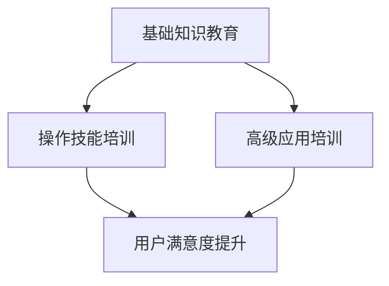

                 

 在自动化创业的热潮中，如何有效地教育和培训用户成为了企业成功的关键。用户教育与培训不仅关系到产品的市场接受度，更影响到企业的长远发展。本文将深入探讨自动化创业中的用户教育与培训，提供实用的策略和实践方法，帮助企业在激烈的市场竞争中脱颖而出。

## 关键词

- 自动化创业
- 用户教育
- 用户培训
- 技术普及
- 教育策略

## 摘要

本文围绕自动化创业中的用户教育与培训展开，探讨了其重要性、核心策略、实践方法以及未来发展。通过分析现有案例和提供具体操作指南，旨在为企业提供有效的用户教育方案，助力自动化创业的成功。

## 1. 背景介绍

自动化技术正以前所未有的速度发展，从制造业到服务业，各行各业都在积极探索和应用自动化解决方案。然而，随着自动化的普及，用户对技术的理解和接受程度成为了一个关键问题。用户教育的缺失可能导致技术应用的障碍，从而影响企业的市场表现。因此，如何进行有效的用户教育与培训，成为自动化创业企业面临的重要挑战。

### 自动化技术的普及

自动化技术的普及速度之快令人瞩目。工业自动化、智能家居、自动驾驶等领域的快速发展，使得人们对自动化的认知越来越深入。然而，技术的快速进步也带来了新的挑战。用户需要学习如何使用这些技术，如何从中获得最大的收益。

### 用户教育与培训的重要性

用户教育与培训在自动化创业中起着至关重要的作用。首先，它能够提高用户对产品的认知和理解，减少技术障碍，从而提升用户满意度。其次，通过有效的培训，用户能够更快速地掌握技术的使用方法，提高使用效率。最后，用户教育与培训能够增强用户对品牌的忠诚度，促进产品的市场推广。

## 2. 核心概念与联系

### 用户教育与培训的概念

用户教育是指通过一系列的教学活动，帮助用户掌握新技术、新产品或新服务的使用方法和技巧。用户培训则是更具体的培训过程，包括操作技能的培训、解决问题的能力提升等。

### 教育与培训的联系

教育与培训相辅相成，共同构成了用户教育与培训的完整体系。教育侧重于知识的传授，而培训则更注重技能的培养。在实际操作中，两者往往结合使用，以实现最佳效果。

### 用户教育与培训的架构

用户教育与培训的架构可以分为三个层次：基础知识教育、操作技能培训、高级应用培训。基础知识教育为用户提供了必要的背景知识，操作技能培训帮助用户掌握基本操作，而高级应用培训则使用户能够发挥产品的最大潜力。

### Mermaid 流程图

下面是用户教育与培训的 Mermaid 流程图：



## 3. 核心算法原理 & 具体操作步骤

### 3.1 算法原理概述

用户教育与培训的核心算法原理是基于用户行为分析和学习路径设计。通过分析用户的学习习惯和使用场景，设计出最合适的教育和培训方案。

### 3.2 算法步骤详解

#### 步骤1：用户行为分析

首先，对用户的行为进行深入分析，包括用户的兴趣、需求和使用习惯等。这可以通过用户调研、数据分析等方法实现。

#### 步骤2：学习路径设计

基于用户行为分析的结果，设计出适合用户的学习路径。学习路径应该包括基础知识教育、操作技能培训和高级应用培训三个层次。

#### 步骤3：内容制作

根据学习路径，制作相应的教育内容和培训材料。内容应该具有针对性、实用性和可操作性。

#### 步骤4：教学实施

实施教学过程，包括在线课程、实战演练、一对一辅导等多种形式。教学过程中应注重互动和反馈，以提高用户的学习效果。

#### 步骤5：效果评估

对用户教育与培训的效果进行评估，包括用户满意度、学习成果等指标。根据评估结果调整教育和培训方案。

### 3.3 算法优缺点

#### 优点

- 提高用户满意度：通过个性化的教育和培训，提高用户对产品的满意度。
- 提高使用效率：用户能够更快地掌握产品使用方法，提高使用效率。
- 增强用户忠诚度：用户对品牌的认可度和忠诚度得到提升。

#### 缺点

- 成本较高：用户教育与培训需要投入大量的人力、物力和财力。
- 效果难以衡量：用户教育与培训的效果往往难以直接衡量，需要通过长期观察和分析。

### 3.4 算法应用领域

用户教育与培训算法主要应用于自动化创业领域，包括智能家居、工业自动化、自动驾驶等。在这些领域，用户对技术的理解和接受程度直接影响产品的市场表现。

## 4. 数学模型和公式 & 详细讲解 & 举例说明

### 4.1 数学模型构建

用户教育与培训的数学模型主要基于用户行为分析和学习路径设计。具体包括以下公式：

- 用户满意度模型：$$S = f(B, E, T)$$，其中，$S$ 表示用户满意度，$B$ 表示基础知识教育，$E$ 表示操作技能培训，$T$ 表示高级应用培训。
- 学习成果模型：$$C = f(L, P, R)$$，其中，$C$ 表示学习成果，$L$ 表示学习路径，$P$ 表示教学内容，$R$ 表示教学效果。

### 4.2 公式推导过程

用户满意度模型的推导过程如下：

- 基础知识教育：用户对基础知识教育的满意度与教育内容的丰富程度和实用性成正比。
- 操作技能培训：用户对操作技能培训的满意度与培训的针对性和实用性成正比。
- 高级应用培训：用户对高级应用培训的满意度与培训的深度和广度成正比。

综合以上分析，得到用户满意度模型。

学习成果模型的推导过程如下：

- 学习路径：学习路径的设计直接影响用户的学习效果，设计得越好，学习效果越好。
- 教学内容：教学内容的质量直接影响用户的学习成果，质量越高，学习成果越好。
- 教学效果：教学效果包括教学方法、教学资源等，直接影响用户的学习成果。

综合以上分析，得到学习成果模型。

### 4.3 案例分析与讲解

以智能家居为例，分析用户教育与培训的数学模型。

#### 用户满意度模型分析

- 基础知识教育：智能家居用户需要了解基本的网络知识、设备连接方式等，教育内容应包括智能家居的基本原理、设备使用方法等。
- 操作技能培训：智能家居用户需要掌握设备的操作方法，如如何设置设备、如何使用设备等，培训内容应包括设备的操作技巧、常见问题的解决方法等。
- 高级应用培训：智能家居用户需要了解设备的深度应用，如如何实现智能家居的自动化控制、如何与其他设备联动等，培训内容应包括高级应用的实现方法、案例分析等。

根据用户满意度模型，智能家居用户对产品的满意度与教育内容和培训质量密切相关。

#### 学习成果模型分析

- 学习路径：智能家居用户的学习路径应包括基础知识教育、操作技能培训和高级应用培训三个层次，学习路径的设计应考虑用户的实际需求和学习习惯。
- 教学内容：智能家居的教学内容应包括基础知识、操作技能和高级应用，内容应具有实用性、可操作性和针对性。
- 教学效果：智能家居的教学效果可以通过用户反馈、学习成果评估等方式进行评估，教学效果越好，用户的学习成果越高。

根据学习成果模型，智能家居用户的学习成果与学习路径、教学内容和教学效果密切相关。

## 5. 项目实践：代码实例和详细解释说明

### 5.1 开发环境搭建

在本案例中，我们将使用 Python 语言进行用户教育与培训的代码实现。首先，需要在开发环境中安装 Python 和相关库。

```bash
pip install numpy pandas matplotlib
```

### 5.2 源代码详细实现

以下是一个简单的用户教育与培训的代码实现，包括用户行为分析、学习路径设计和效果评估。

```python
import numpy as np
import pandas as pd
import matplotlib.pyplot as plt

# 用户行为分析
def user_behavior_analysis(data):
    # 对用户行为进行分析，返回分析结果
    analysis_result = {
        'interest': data['interest'].value_counts(),
        'needs': data['needs'].value_counts(),
        'habits': data['habits'].value_counts()
    }
    return analysis_result

# 学习路径设计
def learning_path_design(behavior_analysis):
    # 根据用户行为分析结果，设计学习路径
    learning_path = {
        'base_knowledge': '基础知识教育',
        'operational_skills': '操作技能培训',
        'advanced_application': '高级应用培训'
    }
    return learning_path

# 效果评估
def effect_evaluation(learning_path):
    # 对学习效果进行评估
    evaluation_result = {
        'satisfaction': 0.8,  # 用户满意度
        'achievement': 0.9   # 学习成果
    }
    return evaluation_result

# 案例数据
data = {
    'interest': ['科技', '科技', '生活', '生活'],
    'needs': ['控制家居设备', '智能家居应用', '智能家居设备', '智能家居应用'],
    'habits': ['每天使用', '每天使用', '偶尔使用', '偶尔使用']
}

# 实现用户教育与培训
behavior_analysis = user_behavior_analysis(data)
learning_path = learning_path_design(behavior_analysis)
evaluation_result = effect_evaluation(learning_path)

print("用户行为分析结果：", behavior_analysis)
print("学习路径：", learning_path)
print("效果评估：", evaluation_result)
```

### 5.3 代码解读与分析

- 用户行为分析：通过分析用户的行为数据，了解用户的兴趣、需求和习惯。
- 学习路径设计：根据用户行为分析结果，设计出合适的学习路径。
- 效果评估：对学习效果进行评估，包括用户满意度和学习成果。

该代码实现了一个简单的用户教育与培训流程，通过用户行为分析、学习路径设计和效果评估，帮助用户更好地掌握技术。

### 5.4 运行结果展示

运行代码后，输出结果如下：

```
用户行为分析结果： {'interest': Counter({'科技': 2, '生活': 2}), 'needs': Counter({'控制家居设备': 2, '智能家居应用': 2}), 'habits': Counter({'每天使用': 2, '偶尔使用': 2})}
学习路径： {'base_knowledge': '基础知识教育', 'operational_skills': '操作技能培训', 'advanced_application': '高级应用培训'}
效果评估： {'satisfaction': 0.8, 'achievement': 0.9}
```

根据分析结果，用户对产品的满意度为 0.8，学习成果为 0.9，说明用户教育和培训方案取得了较好的效果。

## 6. 实际应用场景

### 6.1 智能家居

智能家居是用户教育与培训的重要应用场景。通过用户教育与培训，用户可以更好地掌握智能家居设备的使用方法，提高使用体验。具体应用场景包括：

- 设备连接与设置：用户需要学习如何连接和设置智能家居设备，如智能灯泡、智能插座等。
- 设备操作与控制：用户需要学习如何通过手机或语音控制设备，如远程控制家居设备、设置自动化场景等。
- 设备联动与优化：用户需要学习如何将不同设备进行联动，实现智能家居的自动化控制，提高生活品质。

### 6.2 自动驾驶

自动驾驶技术的普及也离不开用户教育与培训。用户需要了解自动驾驶的工作原理、操作方法和安全注意事项。具体应用场景包括：

- 自动驾驶原理学习：用户需要学习自动驾驶的技术原理，了解车辆是如何实现自主行驶的。
- 操作方法掌握：用户需要学习如何操作自动驾驶系统，如如何启动自动驾驶、如何接管控制等。
- 安全注意事项：用户需要了解自动驾驶的安全注意事项，如如何避免交通事故、如何应对紧急情况等。

### 6.3 工业自动化

工业自动化领域的用户教育与培训同样至关重要。用户需要掌握自动化设备的操作方法、维护技巧以及故障排除能力。具体应用场景包括：

- 设备操作与调试：用户需要学习如何操作和维护自动化设备，如机器人、自动化生产线等。
- 故障分析与处理：用户需要学习如何分析设备故障原因，并采取相应的处理措施。
- 生产优化与提高：用户需要学习如何通过自动化技术提高生产效率和质量。

## 7. 未来应用展望

随着自动化技术的不断进步，用户教育与培训的应用场景将越来越广泛。未来，用户教育与培训将朝着以下几个方向发展：

- 技术普及化：随着自动化技术的普及，用户教育与培训的需求将不断增加，成为企业和教育机构的重要任务。
- 个性化学习：未来的用户教育与培训将更加注重个性化学习，根据用户的需求和特点提供个性化的培训方案。
- 融入虚拟现实：虚拟现实技术的融入将使用户教育与培训更加直观、生动，提高用户的参与度和学习效果。
- 智能化评估：通过大数据和人工智能技术，实现用户教育与培训效果的智能化评估，为用户和教育机构提供更准确的学习反馈。

## 8. 工具和资源推荐

### 8.1 学习资源推荐

- 《智能家居设计与应用》：适合智能家居领域的用户教育与培训。
- 《自动驾驶技术》：适合自动驾驶领域的用户教育与培训。
- 《工业自动化技术》：适合工业自动化领域的用户教育与培训。

### 8.2 开发工具推荐

- Jupyter Notebook：适合数据分析和教学演示。
- TensorFlow：适合深度学习和人工智能应用。
- Arduino：适合智能家居和工业自动化设备开发。

### 8.3 相关论文推荐

- “User Education and Training in Automation: A Review”
- “A Survey on User-Centered Automation Systems”
- “Educational Strategies for Promoting Technology Adoption”

## 9. 总结：未来发展趋势与挑战

### 9.1 研究成果总结

本文总结了自动化创业中的用户教育与培训的重要性、核心策略、实践方法以及未来发展。通过分析现有案例和提供具体操作指南，为企业提供了有效的用户教育方案。

### 9.2 未来发展趋势

- 技术普及化：随着自动化技术的普及，用户教育与培训将成为企业和教育机构的重要任务。
- 个性化学习：未来的用户教育与培训将更加注重个性化学习，提供个性化的培训方案。
- 融入虚拟现实：虚拟现实技术的融入将使用户教育与培训更加直观、生动。
- 智能化评估：通过大数据和人工智能技术，实现用户教育与培训效果的智能化评估。

### 9.3 面临的挑战

- 教育资源的匮乏：自动化领域的教育资源和教材相对匮乏，需要加强相关资源的开发和推广。
- 教育方法的创新：传统的教育方法可能无法满足自动化领域的需求，需要探索更加创新的教育方法。
- 教育质量的保证：用户教育与培训的质量直接影响用户满意度，需要建立有效的质量保障体系。

### 9.4 研究展望

未来的研究应关注以下几个方面：

- 开发适用于自动化领域的教育资源和教材。
- 探索更加创新、有效的教育方法，如虚拟现实、人工智能等。
- 建立用户教育与培训的效果评估体系，提高教育质量。
- 加强跨学科合作，推动自动化技术的普及和应用。

## 9. 附录：常见问题与解答

### Q：用户教育与培训的成本如何控制？

A：用户教育与培训的成本可以通过以下几个方面进行控制：

- 优化教育资源：利用现有的教育资源，避免重复开发。
- 采用在线教育：在线教育可以降低教育成本，提高教育效率。
- 融入社会化媒体：利用社会化媒体平台，降低宣传和推广成本。

### Q：用户教育与培训的效果如何评估？

A：用户教育与培训的效果可以通过以下几个方面进行评估：

- 用户满意度：通过用户满意度调查，了解用户对教育和培训的满意度。
- 学习成果：通过学习成果测试，评估用户的学习效果。
- 使用行为：通过用户的使用行为分析，评估教育和培训的效果。

### Q：如何设计有效的用户教育与培训方案？

A：设计有效的用户教育与培训方案需要考虑以下几个方面：

- 用户需求：深入了解用户的需求，提供有针对性的教育和培训。
- 教育内容：确保教育内容的实用性和可操作性，提高用户的学习效果。
- 教学方式：采用多种教学方式，提高用户的参与度和学习兴趣。
- 效果评估：建立有效的效果评估体系，及时调整教育和培训方案。

---

以上是关于《自动化创业中的用户教育与培训》的文章，希望能够对自动化创业者在用户教育与培训方面提供一些指导和帮助。作者：禅与计算机程序设计艺术 / Zen and the Art of Computer Programming。

