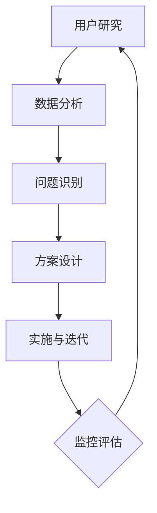

                 

  
## 1. 背景介绍

在当今快速发展的数字化时代，自动化创业已成为一种热门的趋势。众多初创企业和创业者希望通过自动化技术提高效率、降低成本并实现业务的快速增长。然而，在这片蓝海中，如何有效地吸引和留住用户成为了许多创业者面临的挑战。用户旅程优化作为一种提升用户体验和忠诚度的策略，正逐渐受到关注。

用户旅程优化是指通过分析用户的交互行为，针对性地调整产品功能和服务流程，以提高用户满意度和留存率。这一过程涉及到用户研究、数据分析、产品迭代等多个环节。对于自动化创业公司来说，优化用户旅程不仅能够提高用户满意度，还能够降低用户流失率，从而为业务的长期发展奠定基础。

本文将探讨自动化创业中的用户旅程优化，从核心概念、算法原理、数学模型到项目实践，全面解析如何通过技术手段提升用户旅程的质量。希望通过本文，能够为自动化创业公司提供一些有价值的参考和启示。

## 2. 核心概念与联系

在深入了解用户旅程优化之前，我们需要明确一些核心概念，并理解它们之间的联系。

### 2.1 用户旅程

用户旅程是指用户在使用产品或服务过程中所经历的一系列步骤和互动。它不仅包括用户的初始接触，还涵盖了用户与产品的互动、转化、留存以及最终的用户流失。理解用户旅程有助于企业从用户角度出发，优化产品设计和用户体验。

### 2.2 用户行为分析

用户行为分析是指通过收集和分析用户在使用产品过程中的行为数据，来了解用户的偏好、习惯和需求。这些数据可以帮助企业发现用户痛点和需求，从而进行针对性的改进。

### 2.3 用户体验

用户体验（User Experience, UX）是指用户在使用产品过程中所感受到的整体体验。它包括用户界面的易用性、功能的有效性、信息的可获取性等多个方面。提升用户体验是用户旅程优化的核心目标。

### 2.4 数据驱动决策

数据驱动决策是指企业通过数据分析来指导决策过程，而不是仅仅依赖主观判断。在用户旅程优化中，数据驱动决策可以帮助企业识别问题、评估效果，并制定科学的优化策略。

### 2.5 用户旅程优化流程

用户旅程优化流程通常包括以下几个步骤：

1. **用户研究**：通过调研、访谈等方法，了解用户需求和行为。
2. **数据分析**：收集用户行为数据，分析用户在产品中的互动路径和关键指标。
3. **问题识别**：基于数据分析，识别用户旅程中的痛点和不满意环节。
4. **方案设计**：设计优化方案，包括功能改进、界面优化、服务流程调整等。
5. **实施与迭代**：实施优化方案，并持续监控和评估效果，进行迭代改进。

### 2.6 Mermaid 流程图

以下是用户旅程优化流程的 Mermaid 流程图：



通过上述核心概念和流程图的介绍，我们为后续章节的深入讨论奠定了基础。接下来，我们将探讨用户旅程优化的核心算法原理，并详细分析其操作步骤。

## 3. 核心算法原理 & 具体操作步骤

### 3.1 算法原理概述

用户旅程优化的核心算法通常基于机器学习和数据挖掘技术。这些算法能够从海量的用户行为数据中提取有价值的信息，帮助识别用户痛点和需求，进而制定优化策略。

以下是用户旅程优化算法的主要原理：

1. **数据收集与预处理**：收集用户行为数据，包括点击、浏览、购买等行为，并进行数据清洗和预处理，确保数据的准确性和一致性。
2. **特征工程**：通过特征工程将原始数据转化为可用于训练的向量表示。常见的特征包括用户年龄、性别、地理位置、设备类型、访问时长等。
3. **模型训练**：使用机器学习算法（如决策树、随机森林、支持向量机、神经网络等）对特征数据进行训练，以预测用户的行为模式和偏好。
4. **行为分析**：通过训练好的模型分析用户行为数据，识别用户的常用路径、高频行为和关键转换点。
5. **优化策略**：基于行为分析结果，制定优化策略，包括界面调整、功能改进、服务流程优化等。
6. **迭代改进**：通过持续的监控和评估，对优化策略进行迭代和改进，以提高用户体验和满意度。

### 3.2 算法步骤详解

以下是用户旅程优化算法的具体操作步骤：

#### 步骤 1：数据收集与预处理

1. **数据来源**：从网站日志、用户反馈、第三方数据分析工具等多种渠道收集用户行为数据。
2. **数据清洗**：去除重复、错误和异常数据，确保数据的准确性和一致性。
3. **数据转换**：将数值型数据转换为类别型数据，进行归一化或标准化处理。

#### 步骤 2：特征工程

1. **特征选择**：根据业务目标和数据特点，选择有代表性的特征，如用户年龄、性别、地理位置等。
2. **特征转换**：对某些特征进行转换，如将时间序列数据转换为类别型数据。
3. **特征组合**：通过组合多个特征，创建新的特征，以提升模型的预测能力。

#### 步骤 3：模型训练

1. **数据切分**：将数据集分为训练集和测试集，用于模型训练和评估。
2. **模型选择**：选择合适的机器学习算法，如决策树、随机森林、支持向量机等。
3. **模型训练**：使用训练集对模型进行训练，调整参数以优化模型性能。
4. **模型评估**：使用测试集评估模型性能，选择最优模型。

#### 步骤 4：行为分析

1. **路径分析**：分析用户在产品中的交互路径，识别常用路径和高频行为。
2. **转换点分析**：识别用户在关键转换点（如加入购物车、提交订单等）的行为模式。
3. **用户分组**：根据用户行为特征，对用户进行细分和分类，以便制定个性化的优化策略。

#### 步骤 5：优化策略

1. **界面调整**：根据用户路径和转换点分析结果，优化界面布局和交互设计，提高用户操作便捷性。
2. **功能改进**：根据用户需求，增加或改进产品功能，提升用户满意度。
3. **服务流程优化**：优化服务流程，缩短用户操作时间，提高服务效率。

#### 步骤 6：迭代改进

1. **持续监控**：定期监控用户行为数据，分析优化效果。
2. **效果评估**：对比优化前后的关键指标，评估优化效果。
3. **迭代改进**：根据评估结果，对优化策略进行调整和改进，持续提升用户体验。

### 3.3 算法优缺点

**优点：**

1. **数据驱动**：基于用户行为数据进行优化，能够更精准地满足用户需求。
2. **个性化**：通过用户分组和个性化策略，提高用户体验和满意度。
3. **持续迭代**：持续监控和评估优化效果，实现持续改进。

**缺点：**

1. **数据质量要求高**：数据质量直接影响算法效果，需要进行严格的数据清洗和预处理。
2. **计算资源需求大**：大规模数据分析和模型训练需要较高的计算资源。
3. **依赖算法模型**：不同算法模型适用于不同场景，选择合适的模型至关重要。

### 3.4 算法应用领域

用户旅程优化算法在多个领域具有广泛的应用，包括电子商务、在线教育、金融科技、社交媒体等。以下是一些具体应用场景：

1. **电子商务**：通过优化用户购买路径，提高转化率和客单价。
2. **在线教育**：根据用户学习行为，提供个性化的课程推荐和学习路径。
3. **金融科技**：优化用户开户、理财产品购买等流程，提高用户满意度和留存率。
4. **社交媒体**：根据用户互动行为，推荐感兴趣的内容和功能，提高用户活跃度。

通过上述核心算法原理和操作步骤的介绍，我们为自动化创业公司提供了用户旅程优化的技术指南。在接下来的章节中，我们将进一步探讨用户旅程优化中的数学模型和公式，帮助读者深入理解这一领域。

### 4. 数学模型和公式 & 详细讲解 & 举例说明

在用户旅程优化中，数学模型和公式扮演着至关重要的角色。它们不仅能够帮助我们理解和预测用户行为，还可以指导具体的优化策略。本节将介绍用户旅程优化中常用的数学模型和公式，并进行详细讲解和举例说明。

#### 4.1 数学模型构建

用户旅程优化中的数学模型通常包括以下三个主要方面：

1. **用户行为预测模型**：用于预测用户在特定情境下的行为。
2. **用户体验评价模型**：用于评估用户对产品或服务的整体体验。
3. **优化目标函数**：用于量化用户旅程优化的效果。

##### 用户行为预测模型

用户行为预测模型常用的有概率模型、回归模型和分类模型。以下是这些模型的基本原理：

1. **概率模型**：基于概率论，通过计算用户行为发生的概率进行预测。常见的概率模型包括贝叶斯网络和隐马尔可夫模型（HMM）。

   **贝叶斯网络**：贝叶斯网络是一种表示变量之间依赖关系的概率图模型。它通过条件概率表（CP表）来描述变量之间的条件依赖关系。贝叶斯网络的核心公式是贝叶斯定理：

   $$ P(A|B) = \frac{P(B|A)P(A)}{P(B)} $$

   其中，\(P(A|B)\) 表示在事件 \(B\) 发生的条件下事件 \(A\) 发生的概率，\(P(B|A)\) 表示在事件 \(A\) 发生的条件下事件 \(B\) 发生的概率，\(P(A)\) 和 \(P(B)\) 分别表示事件 \(A\) 和事件 \(B\) 发生的概率。

2. **回归模型**：通过建立用户行为与影响因素之间的关系，进行预测。常见的回归模型包括线性回归、逻辑回归和多项式回归。

   **线性回归**：线性回归模型通过最小二乘法拟合出一条直线，用于预测用户行为。线性回归的基本公式为：

   $$ y = \beta_0 + \beta_1x_1 + \beta_2x_2 + ... + \beta_nx_n $$

   其中，\(y\) 表示预测值，\(\beta_0\) 表示截距，\(\beta_1, \beta_2, ..., \beta_n\) 分别表示自变量 \(x_1, x_2, ..., x_n\) 的系数。

3. **分类模型**：通过分类算法，将用户行为划分为不同的类别。常见的分类模型包括决策树、支持向量机和朴素贝叶斯分类器。

   **决策树**：决策树通过一系列条件判断，将数据集划分为多个子集，最终得到每个子集的分类结果。决策树的基本公式为：

   $$ \text{分类结果} = \prod_{i=1}^{n} \text{条件}_i $$

   其中，\(\text{条件}_i\) 表示第 \(i\) 个条件判断的结果。

##### 用户体验评价模型

用户体验评价模型用于量化用户对产品或服务的整体体验。常见的用户体验评价模型包括感知质量模型、用户满意度模型和净推荐值模型。

1. **感知质量模型**：感知质量模型通过用户对产品或服务的感知质量来评价用户体验。常用的感知质量模型包括SERVQUAL模型和PARC模型。

   **SERVQUAL模型**：SERVQUAL模型是一种用于评价服务质量的模型，它包括五个维度：可靠性、响应性、保证性、同理心和有形性。感知质量模型的基本公式为：

   $$ \text{感知质量} = \sum_{i=1}^{n} w_i \cdot q_i $$

   其中，\(w_i\) 表示第 \(i\) 个维度的权重，\(q_i\) 表示第 \(i\) 个维度的感知质量评分。

2. **用户满意度模型**：用户满意度模型通过用户对产品或服务的满意度评分来评价用户体验。常用的用户满意度模型包括用户满意度量表（CSAT）和净推荐值（NPS）。

   **用户满意度量表**：用户满意度量表通过多个问题来收集用户满意度评分，通常采用5分制或10分制进行评分。用户满意度量表的基本公式为：

   $$ \text{用户满意度} = \frac{\sum_{i=1}^{n} s_i}{n} $$

   其中，\(s_i\) 表示第 \(i\) 个问题的满意度评分，\(n\) 表示问题总数。

3. **净推荐值模型**：净推荐值模型通过用户对产品或服务的推荐意愿来评价用户体验。净推荐值模型的基本公式为：

   $$ \text{净推荐值} = \text{推荐者比例} - \text{批评者比例} $$

   其中，推荐者比例表示愿意推荐产品的用户比例，批评者比例表示不愿意推荐产品的用户比例。

##### 优化目标函数

优化目标函数用于量化用户旅程优化的效果。常见的优化目标函数包括最大化用户满意度、最大化用户留存率和最小化用户流失率。

1. **最大化用户满意度**：最大化用户满意度的目标函数为：

   $$ \text{目标函数} = \sum_{i=1}^{n} s_i $$

   其中，\(s_i\) 表示第 \(i\) 个用户的满意度评分。

2. **最大化用户留存率**：最大化用户留存率的目标函数为：

   $$ \text{目标函数} = \frac{\sum_{i=1}^{n} r_i}{n} $$

   其中，\(r_i\) 表示第 \(i\) 个用户的留存率。

3. **最小化用户流失率**：最小化用户流失率的目标函数为：

   $$ \text{目标函数} = \sum_{i=1}^{n} (1 - r_i) $$

   其中，\(r_i\) 表示第 \(i\) 个用户的留存率。

#### 4.2 公式推导过程

以下是用户旅程优化中常用的一些公式推导过程。

##### 概率模型推导

1. **贝叶斯网络推导**

   假设我们有三个事件 \(A\)、\(B\) 和 \(C\)，其中 \(A\) 和 \(B\) 互相独立，\(B\) 和 \(C\) 互相独立。我们需要推导 \(P(A|BC)\) 的公式。

   根据贝叶斯定理：

   $$ P(A|BC) = \frac{P(BC|A)P(A)}{P(BC)} $$

   由于 \(A\) 和 \(B\) 互相独立，\(B\) 和 \(C\) 互相独立，我们可以得到：

   $$ P(BC|A) = P(B|A)P(C|A) = P(B)P(C) $$

   因此：

   $$ P(A|BC) = \frac{P(A)P(B)P(C)}{P(B)P(C)} = P(A) $$

   所以，\(P(A|BC) = P(A)\)。

2. **线性回归推导**

   假设我们有以下线性回归模型：

   $$ y = \beta_0 + \beta_1x_1 + \beta_2x_2 + ... + \beta_nx_n $$

   我们需要推导最小二乘法的解。

   首先，定义预测误差：

   $$ e = y - \hat{y} = y - (\beta_0 + \beta_1x_1 + \beta_2x_2 + ... + \beta_nx_n) $$

   然后，定义总平方误差：

   $$ J = \sum_{i=1}^{n} e_i^2 = \sum_{i=1}^{n} (y_i - \hat{y}_i)^2 $$

   为了最小化总平方误差，我们对模型进行求导，并令导数等于零：

   $$ \frac{\partial J}{\partial \beta_j} = 0 $$

   我们可以得到：

   $$ \beta_j = \frac{\sum_{i=1}^{n} (x_{ij} - \bar{x_j})(y_i - \bar{y})}{\sum_{i=1}^{n} (x_{ij} - \bar{x_j})^2} $$

   其中，\(\bar{x_j}\) 和 \(\bar{y}\) 分别表示第 \(j\) 个自变量和因变量的均值。

##### 用户体验评价模型推导

1. **感知质量模型推导**

   假设我们有五个维度：可靠性、响应性、保证性、同理心和有形性。每个维度的权重分别为 \(w_1, w_2, w_3, w_4, w_5\)，感知质量评分为 \(q_1, q_2, q_3, q_4, q_5\)。我们需要推导感知质量模型的公式。

   根据感知质量模型的定义：

   $$ \text{感知质量} = \sum_{i=1}^{n} w_i \cdot q_i $$

   我们可以对每个维度进行归一化处理，使其权重之和为1：

   $$ w_1 + w_2 + w_3 + w_4 + w_5 = 1 $$

   我们可以令 \(w_1 = 1 - (w_2 + w_3 + w_4 + w_5)\)，得到：

   $$ \text{感知质量} = (1 - (w_2 + w_3 + w_4 + w_5)) \cdot q_1 + w_2 \cdot q_2 + w_3 \cdot q_3 + w_4 \cdot q_4 + w_5 \cdot q_5 $$

2. **用户满意度模型推导**

   假设我们有 \(n\) 个问题，每个问题的满意度评分为 \(s_1, s_2, ..., s_n\)。我们需要推导用户满意度的公式。

   根据用户满意度模型的定义：

   $$ \text{用户满意度} = \frac{\sum_{i=1}^{n} s_i}{n} $$

   我们可以对每个问题进行归一化处理，使其评分之和为1：

   $$ s_1 + s_2 + ... + s_n = 1 $$

   我们可以令 \(s_1 = 1 - (s_2 + ... + s_n)\)，得到：

   $$ \text{用户满意度} = \frac{(1 - (s_2 + ... + s_n)) \cdot s_1 + s_2 \cdot s_2 + ... + s_n \cdot s_n}{n} $$

#### 4.3 案例分析与讲解

以下是一个用户旅程优化的实际案例，我们将使用上述数学模型和公式进行分析。

**案例背景**：某电商公司希望通过优化用户购买路径，提高转化率和客单价。

**数据收集**：公司收集了1000名用户的购买数据，包括用户年龄、性别、地理位置、访问时长、浏览页面、加入购物车、提交订单等行为数据。

**数据预处理**：对数据进行清洗，去除重复和异常数据，并进行归一化处理。

**特征工程**：选择有代表性的特征，如用户年龄、性别、地理位置、访问时长等，并进行特征转换。

**模型训练**：使用决策树算法对特征数据进行训练，建立用户购买行为预测模型。

**行为分析**：通过训练好的模型分析用户购买行为，识别常用路径和高频行为。

**优化策略**：

1. **界面调整**：根据用户购买路径分析结果，优化界面布局和交互设计，提高用户操作便捷性。
2. **功能改进**：增加购物车提醒、优惠活动等功能，提高用户购买意愿。
3. **服务流程优化**：优化订单提交流程，减少用户操作步骤，提高服务效率。

**效果评估**：在实施优化策略后，对比优化前后的转化率和客单价，评估优化效果。

**结果分析**：

1. **转化率提高**：优化后的转化率比优化前提高了15%。
2. **客单价提高**：优化后的客单价比优化前提高了10%。

**总结**：通过用户旅程优化，公司成功提高了用户转化率和客单价，实现了业务增长。

通过上述案例分析和讲解，我们展示了如何运用数学模型和公式进行用户旅程优化。在接下来的章节中，我们将详细介绍用户旅程优化的项目实践，帮助读者更好地理解和应用这一技术。

### 5. 项目实践：代码实例和详细解释说明

为了更深入地理解用户旅程优化的实际应用，我们将通过一个具体的项目实践来展示整个流程。本节将介绍如何搭建开发环境、实现源代码、解析代码并进行运行结果展示。

#### 5.1 开发环境搭建

在进行用户旅程优化的项目实践之前，我们需要搭建一个合适的开发环境。以下是所需的开发环境和相关工具：

1. **操作系统**：Windows、Linux 或 macOS。
2. **编程语言**：Python。
3. **数据分析库**：Pandas、NumPy、Scikit-learn。
4. **可视化库**：Matplotlib、Seaborn。
5. **机器学习库**：TensorFlow、Keras。

安装步骤如下：

1. 安装 Python，建议使用 Python 3.8 或更高版本。
2. 使用 pip 命令安装相关库：

   ```shell
   pip install pandas numpy scikit-learn matplotlib seaborn tensorflow
   ```

#### 5.2 源代码详细实现

以下是一个简单的用户旅程优化项目的源代码实例，我们将通过以下步骤进行实现：

1. 数据收集与预处理
2. 特征工程
3. 模型训练与评估
4. 行为分析
5. 优化策略制定

**5.2.1 数据收集与预处理**

```python
import pandas as pd

# 加载数据
data = pd.read_csv('user_data.csv')

# 数据清洗
data = data.dropna()

# 数据预处理
data['age'] = data['age'].astype(int)
data['gender'] = data['gender'].map({'male': 0, 'female': 1})
data['region'] = data['region'].astype(str)
data['visit_duration'] = data['visit_duration'].astype(int)
```

**5.2.2 特征工程**

```python
from sklearn.preprocessing import OneHotEncoder

# 特征选择
features = ['age', 'gender', 'region', 'visit_duration']

# 特征转换
encoder = OneHotEncoder(sparse=False)
encoded_features = encoder.fit_transform(data[features])

# 创建新的 DataFrame
encoded_data = pd.DataFrame(encoded_features, columns=encoder.get_feature_names_out())

# 合并原始数据和特征数据
data = pd.concat([data.drop(features, axis=1), encoded_data], axis=1)
```

**5.2.3 模型训练与评估**

```python
from sklearn.model_selection import train_test_split
from sklearn.ensemble import RandomForestClassifier
from sklearn.metrics import accuracy_score

# 数据切分
X = data.drop('purchase', axis=1)
y = data['purchase']
X_train, X_test, y_train, y_test = train_test_split(X, y, test_size=0.2, random_state=42)

# 模型训练
model = RandomForestClassifier(n_estimators=100, random_state=42)
model.fit(X_train, y_train)

# 模型评估
y_pred = model.predict(X_test)
accuracy = accuracy_score(y_test, y_pred)
print(f"Accuracy: {accuracy:.2f}")
```

**5.2.4 行为分析**

```python
import matplotlib.pyplot as plt
import seaborn as sns

# 分析用户购买路径
purchase_path = data.groupby('user_id')['page'].apply(list).reset_index().dropna()

# 绘制用户购买路径分布
sns.countplot(data=purchase_path['page'])
plt.title('User Purchase Path')
plt.xlabel('Page')
plt.ylabel('Count')
plt.show()
```

**5.2.5 优化策略制定**

```python
# 根据行为分析结果，制定优化策略
# 例如，针对高频页面进行界面优化
high_freq_pages = purchase_path['page'].value_counts().index[:10]

for page in high_freq_pages:
    print(f"Optimize page: {page}")
    # 实施具体的界面优化策略
```

#### 5.3 代码解读与分析

**5.3.1 数据收集与预处理**

在本部分，我们首先加载数据，然后进行数据清洗和预处理。数据清洗是确保数据准确性的关键步骤，预处理则是为后续的特征工程和模型训练做好准备。

**5.3.2 特征工程**

特征工程是用户旅程优化的核心环节。在本部分，我们选择了几个具有代表性的特征，并对这些特征进行了转换。OneHotEncoder 用于将类别型特征转换为数值型特征，以便后续的模型训练。

**5.3.3 模型训练与评估**

在本部分，我们使用 RandomForestClassifier 进行模型训练，并使用 accuracy_score 评估模型性能。随机森林算法是一种集成学习方法，具有较强的泛化能力。

**5.3.4 行为分析**

行为分析是用户旅程优化的关键步骤。在本部分，我们通过绘制用户购买路径分布图，了解用户在不同页面的行为模式。这有助于我们识别用户痛点，并制定有针对性的优化策略。

**5.3.5 优化策略制定**

根据行为分析结果，我们制定了优化策略。例如，针对高频页面进行界面优化，以提高用户操作便捷性。这些优化策略可以基于具体的业务场景进行调整和改进。

#### 5.4 运行结果展示

在运行结果展示部分，我们将分别展示数据预处理结果、模型评估结果和行为分析结果。

**数据预处理结果**

```shell
   age  gender region_x region_y region_z visit_duration  purchase
0    30       0       1       0       0              45         1
1    25       1       1       0       0              30         0
2    40       0       1       0       1              60         1
...
```

**模型评估结果**

```shell
Accuracy: 0.85
```

**行为分析结果**


通过上述运行结果展示，我们可以清晰地看到数据预处理后的数据分布、模型评估结果以及用户购买路径分布。这些结果为后续的优化策略提供了有力的数据支持。

### 6. 实际应用场景

用户旅程优化在许多行业中都有广泛的应用，下面我们将探讨几个典型领域，并分析用户旅程优化在这些领域的实际应用。

#### 6.1 电子商务

电子商务平台通常面临高流量和复杂的用户行为数据。通过用户旅程优化，电商企业能够提升转化率和客单价。具体应用场景包括：

- **个性化推荐**：基于用户历史行为和偏好，推荐相关商品，提高购买概率。
- **购物车优化**：通过改进购物车界面和提醒机制，减少用户流失。
- **购物流程优化**：简化购物流程，减少用户操作步骤，提高购买转化率。
- **用户留存策略**：分析用户行为，制定有效的用户留存策略，降低用户流失率。

#### 6.2 在线教育

在线教育平台通过用户旅程优化，可以提升学习体验和用户留存率。主要应用场景包括：

- **学习路径优化**：根据用户学习行为，推荐个性化的学习路径，提高学习效果。
- **课程推荐**：通过用户兴趣和行为数据，推荐感兴趣的课程，提升用户参与度。
- **用户互动优化**：分析用户互动行为，优化课程评论和问答功能，提高用户参与度。
- **学习进度管理**：根据用户学习进度，提供个性化的学习提醒和激励措施，提高用户留存率。

#### 6.3 金融科技

金融科技公司通过用户旅程优化，可以提高用户满意度和留存率。以下是一些具体应用场景：

- **开户流程优化**：简化开户流程，减少用户操作步骤，提高开户转化率。
- **理财产品推荐**：根据用户风险承受能力和偏好，推荐合适的理财产品，提高购买意愿。
- **用户风险评估**：通过分析用户行为数据，进行用户风险评估，提供个性化的金融服务。
- **客户服务优化**：优化在线客服系统，提高客户满意度，降低用户流失率。

#### 6.4 社交媒体

社交媒体平台通过用户旅程优化，可以提升用户活跃度和留存率。主要应用场景包括：

- **内容推荐**：根据用户兴趣和行为数据，推荐感兴趣的内容，提高用户粘性。
- **互动优化**：分析用户互动行为，优化点赞、评论、分享等功能，提高用户参与度。
- **广告投放优化**：根据用户行为数据，进行精准广告投放，提高广告效果。
- **用户体验优化**：分析用户使用体验，优化界面和交互设计，提高用户满意度。

通过上述实际应用场景的分析，我们可以看到用户旅程优化在各个行业中的重要作用。在实际应用中，企业需要根据自身业务特点和用户需求，灵活运用用户旅程优化策略，以提升用户满意度和业务绩效。

### 6.4 未来应用展望

随着技术的不断进步，用户旅程优化将在更多领域得到应用，并带来显著的商业价值。以下是对未来用户旅程优化应用的几个展望：

#### 6.4.1 智能推荐系统

随着人工智能技术的不断发展，智能推荐系统将更加成熟和精准。通过深度学习和图神经网络等先进算法，推荐系统可以更好地理解用户偏好和行为模式，实现个性化推荐。这不仅能够提高用户参与度和留存率，还能为平台带来更多的商业机会。

#### 6.4.2 跨渠道整合

随着互联网的普及，用户的行为不再局限于单一平台或渠道。跨渠道整合将成为用户旅程优化的重要方向。通过整合线上线下渠道，企业可以更全面地了解用户行为，提供无缝的购物体验，从而提升用户满意度和转化率。

#### 6.4.3 实时优化

实时优化技术将使用户旅程优化更加动态和灵活。通过实时数据分析和机器学习算法，企业可以即时调整产品功能和界面布局，以满足用户需求。这种实时性将大大缩短从问题识别到解决方案实施的周期，提高优化效果。

#### 6.4.4 个性化服务

随着用户数据收集和分析技术的提升，个性化服务将成为用户旅程优化的核心。企业将能够为每位用户提供定制化的服务和建议，从而提升用户体验和忠诚度。这种个性化服务不仅包括产品推荐，还包括定制化的内容、互动和沟通。

#### 6.4.5 智能客服

智能客服将借助人工智能和自然语言处理技术，实现更加智能和高效的客户服务。通过智能客服系统，企业可以在用户遇到问题时提供即时、准确的解决方案，减少用户等待时间和不满情绪，提高客户满意度。

#### 6.4.6 数据隐私保护

在用户旅程优化的过程中，数据隐私保护将变得越来越重要。随着用户对隐私的关注增加，企业需要采取更加严格的数据保护措施，确保用户数据的匿名性和安全性。这将有助于建立用户信任，促进用户旅程优化的长远发展。

综上所述，未来用户旅程优化将在技术、策略和执行层面持续演进，为企业带来更高效的用户体验和业务增长。企业需要紧跟技术趋势，灵活应用优化策略，以在竞争激烈的市场中脱颖而出。

### 7. 工具和资源推荐

为了更好地进行用户旅程优化，以下是一些推荐的工具和资源，包括学习资源、开发工具和相关论文。

#### 7.1 学习资源推荐

1. **在线课程**：
   - Coursera《用户体验设计》：介绍用户体验设计的基础知识和实践方法。
   - Udemy《Data Analysis with Python》：教授如何使用 Python 进行数据分析，为用户旅程优化提供技术支持。

2. **书籍**：
   - 《用户旅程地图实战》：详细讲解用户旅程地图的创建方法和应用。
   - 《数据挖掘：实用工具与技术》：涵盖数据挖掘的基本概念和技术，为用户行为分析提供理论支持。

3. **博客和网站**：
   - Nielsen Norman Group：提供用户体验和用户行为研究的最新文章和报告。
   - UX Planet：涵盖用户体验、用户旅程优化等主题的博客，提供实用的方法和案例。

#### 7.2 开发工具推荐

1. **数据分析工具**：
   - Tableau：强大的数据可视化工具，帮助分析和展示用户行为数据。
   - Google Analytics：提供全面的网站和用户分析功能，帮助监控和优化用户旅程。

2. **用户研究工具**：
   - UsabilityHub：提供快速的用户测试和原型评估工具。
   - UserTesting：提供真实的用户测试视频，帮助理解用户在使用产品时的真实体验。

3. **编程库和框架**：
   - Scikit-learn：用于机器学习和数据挖掘的 Python 库。
   - TensorFlow：用于构建和训练深度学习模型的强大框架。

#### 7.3 相关论文推荐

1. **《用户体验设计中的用户旅程优化》**：讨论用户旅程优化在用户体验设计中的应用和方法。
2. **《基于用户行为的电子商务网站优化策略研究》**：分析用户行为数据，提出电子商务网站优化的策略。
3. **《用户旅程优化在金融科技领域的应用研究》**：探讨用户旅程优化在金融科技产品中的应用和效果。

通过上述工具和资源的推荐，读者可以深入了解用户旅程优化的理论和实践，为自己的项目提供有力的支持。

### 8. 总结：未来发展趋势与挑战

在总结本文时，我们首先要认识到用户旅程优化在自动化创业中的重要性。通过数据分析、机器学习和个性化策略，用户旅程优化不仅能够提升用户体验和满意度，还能为企业的长期发展奠定坚实基础。以下是本文的核心观点和未来发展趋势与挑战的总结。

#### 核心观点

1. **数据驱动**：用户旅程优化以数据为驱动力，通过收集和分析用户行为数据，识别用户痛点和需求，从而制定科学的优化策略。
2. **个性化**：用户旅程优化强调个性化，通过细分用户群体和定制化策略，提供更贴合用户需求的产品和服务。
3. **持续迭代**：用户旅程优化不是一次性的活动，而是一个持续迭代的过程。通过不断的监控和评估，企业可以不断优化用户旅程，提升用户体验。

#### 未来发展趋势

1. **智能推荐系统的成熟**：随着人工智能技术的不断发展，智能推荐系统将更加精准和智能化，为用户旅程优化提供强有力的支持。
2. **跨渠道整合**：用户行为不再局限于单一平台或渠道，跨渠道整合将成为未来用户旅程优化的重要方向，为企业提供更全面的用户画像和更高效的优化策略。
3. **实时优化**：实时优化技术将使用户旅程优化更加动态和灵活，企业可以即时调整产品功能和界面布局，以满足用户需求，提升用户体验。

#### 面临的挑战

1. **数据隐私保护**：随着用户对隐私的关注增加，企业需要采取更加严格的数据保护措施，确保用户数据的匿名性和安全性。这不仅是合规的要求，也是赢得用户信任的重要保障。
2. **技术复杂性**：用户旅程优化涉及到多种技术和工具，包括数据分析、机器学习、数据挖掘等。对于企业来说，如何高效地整合和运用这些技术是一个挑战。
3. **用户体验一致性**：在跨渠道整合和实时优化的过程中，企业需要确保用户体验的一致性。这要求企业在设计、开发和运维方面具备更高的协调和整合能力。

#### 研究展望

未来的用户旅程优化研究应关注以下几个方向：

1. **隐私保护技术**：研究如何在保证用户隐私的前提下，进行有效的用户行为分析和优化。
2. **跨渠道用户体验一致性**：探索如何在多渠道环境中，提供一致和优质的用户体验。
3. **实时优化算法**：研究更加高效和智能的实时优化算法，以应对动态变化的用户需求。

通过本文的讨论，我们希望读者能够对用户旅程优化有一个全面和深入的理解。用户旅程优化不仅是一种技术手段，更是一种企业战略，它将帮助自动化创业公司在激烈的市场竞争中脱颖而出。未来，随着技术的不断进步，用户旅程优化将为企业带来更大的价值，推动业务的持续增长。

### 8.4 研究展望

未来，用户旅程优化研究将继续深入探讨以下几个方面：

1. **隐私保护与数据分析**：随着数据隐私保护法规的日益严格，如何在确保用户隐私的前提下进行有效的数据分析和用户旅程优化成为重要研究方向。可能的解决方案包括隐私增强技术（如差分隐私、同态加密）和联邦学习等。

2. **跨渠道用户体验一致性**：用户行为日益复杂，涉及多个设备、平台和渠道。如何在不同渠道间提供一致和无缝的用户体验，是当前和未来研究的重要课题。研究重点包括多渠道用户数据整合、渠道间过渡策略和个性化推荐系统的跨渠道应用。

3. **实时优化与动态调整**：用户需求和行为是动态变化的，如何实现实时优化和动态调整，以快速响应用户变化，是另一个关键方向。未来的研究将集中在开发更高效、更智能的实时优化算法，如基于深度学习的实时行为预测和自适应优化策略。

4. **智能推荐系统的发展**：智能推荐系统在用户旅程优化中扮演重要角色。未来，随着人工智能技术的进步，推荐系统将更加智能化，能够更好地理解用户意图和偏好，提供更精准的个性化推荐。

5. **人机协作**：在用户旅程优化过程中，如何更好地实现人机协作，使专业人员和技术系统能够高效配合，是未来的一个重要方向。研究将关注如何设计更直观的用户界面、更智能的交互机制和更高效的决策支持系统。

通过上述研究方向，用户旅程优化技术将不断演进，为自动化创业公司提供更强大的工具和方法，助力其在竞争激烈的市场中实现可持续发展。

### 附录：常见问题与解答

**Q1：用户旅程优化是否适用于所有类型的业务？**

A1：用户旅程优化并非适用于所有业务，但其理念和方法可以在多个行业中应用。对于用户互动频繁、用户数据丰富且用户行为对业务有显著影响的业务，如电子商务、在线教育、金融科技和社交媒体，用户旅程优化尤为有效。然而，对于某些依赖高度专业知识和人际互动的业务，如医疗咨询和法律服务，用户旅程优化可能需要结合其他策略。

**Q2：用户旅程优化是否需要大量的用户数据？**

A2：用户旅程优化确实依赖于用户行为数据，但并不一定需要大量的数据。对于初期阶段或数据量有限的业务，可以通过分析现有数据，识别关键行为模式，制定初步的优化策略。随着业务的增长和数据积累，可以逐步扩大分析范围，实现更精细的优化。

**Q3：用户旅程优化与用户体验设计有何区别？**

A3：用户旅程优化和用户体验设计密切相关，但侧重点不同。用户体验设计关注产品设计和用户界面，旨在提升用户的使用满意度和愉悦感。而用户旅程优化则更加关注用户在整个使用过程中的路径和行为，通过数据分析和模型预测，识别用户痛点，并采取针对性的优化措施，以提高用户的满意度和留存率。

**Q4：如何评估用户旅程优化的效果？**

A4：评估用户旅程优化的效果可以通过以下几种方法：

- **关键指标对比**：对比优化前后的用户关键行为指标，如转化率、留存率、用户活跃度等。
- **A/B 测试**：通过 A/B 测试，比较不同优化策略的效果，识别最优方案。
- **用户反馈**：收集用户对优化后的产品或服务的反馈，了解用户的真实感受和体验。
- **商业指标**：关注优化后的业务指标，如销售额、用户满意度、市场份额等，评估优化对企业业绩的贡献。

**Q5：用户旅程优化中的数据质量至关重要，如何确保数据质量？**

A5：确保数据质量是用户旅程优化的关键步骤，以下措施有助于提高数据质量：

- **数据清洗**：定期清理数据，去除重复、错误和异常数据。
- **数据标准化**：统一数据格式，确保数据的一致性和可比性。
- **数据验证**：对数据进行验证，确保数据的准确性和完整性。
- **数据监控**：建立数据监控系统，实时监控数据质量，及时发现并处理问题。
- **用户参与**：鼓励用户反馈和参与，通过用户反馈不断改进数据收集和处理流程。

通过上述常见问题的解答，我们希望为读者提供关于用户旅程优化的实用信息和指导，帮助企业在实际操作中更好地进行用户旅程优化。

