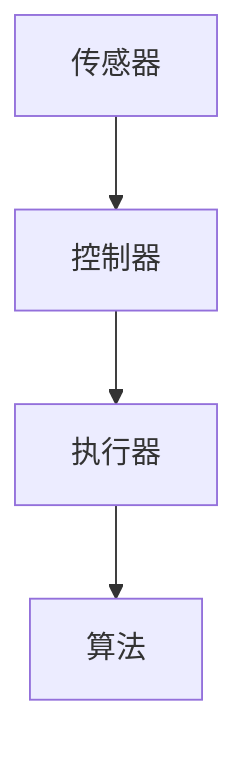

                 

关键词：自动化技术、机器学习、人工智能、机器人、工业4.0、编程语言、软件开发

在当今迅速发展的技术时代，自动化技术已经成为推动各行各业进步的重要力量。无论是制造业、服务业、医疗保健还是交通运输，自动化技术都发挥着关键作用。本文将深入探讨自动化技术的最新发展，以及其在不同领域中的应用，旨在为读者提供一个全面的视角，了解自动化技术的现状与未来趋势。

## 1. 背景介绍

### 自动化的起源与发展

自动化技术的历史可以追溯到19世纪末和20世纪初，当时出现了各种机械化装置和流水线生产。随着计算机技术的兴起，自动化技术得到了飞速发展。20世纪80年代，随着机器人技术的发展，自动化技术开始进入工业生产领域。21世纪，随着人工智能和大数据技术的成熟，自动化技术进入了一个全新的时代。

### 自动化技术在现代社会的地位

现代社会中，自动化技术已经渗透到各个方面。它不仅提高了生产效率，降低了成本，而且还在提升产品质量、保障工作环境安全等方面发挥了重要作用。随着技术的不断进步，自动化技术正变得越来越智能，能够处理更复杂的问题，适应更广泛的应用场景。

## 2. 核心概念与联系

### 自动化的核心概念

自动化技术涉及多个核心概念，包括传感器、执行器、控制器和算法。传感器用于检测环境信息，执行器用于执行具体的动作，控制器则负责协调传感器和执行器的操作，而算法则用于决策和控制。

### 自动化架构的 Mermaid 流程图



## 3. 核心算法原理 & 具体操作步骤

### 3.1 算法原理概述

自动化技术中的核心算法包括机器学习算法、深度学习算法和强化学习算法。这些算法基于统计学和计算方法，能够从数据中学习规律，进行预测和决策。

### 3.2 算法步骤详解

- **机器学习算法**：包括监督学习、无监督学习和半监督学习。监督学习通过训练数据集学习，无监督学习通过未标记的数据学习，半监督学习结合了监督学习和无监督学习。
- **深度学习算法**：包括卷积神经网络（CNN）、循环神经网络（RNN）和生成对抗网络（GAN）等。这些算法能够处理复杂的非线性关系。
- **强化学习算法**：通过试错学习，不断优化决策，以实现最大化回报。

### 3.3 算法优缺点

- **机器学习算法**：优点包括自动提取特征、处理大量数据等，缺点是训练过程可能需要大量时间和计算资源。
- **深度学习算法**：优点包括强大的特征提取能力和良好的泛化性能，缺点是模型复杂，训练过程需要大量数据和计算资源。
- **强化学习算法**：优点包括能够处理动态环境，缺点是学习过程可能需要很长时间，且不保证一定找到最优解。

### 3.4 算法应用领域

- **工业自动化**：用于生产线的监控和控制。
- **智能家居**：用于家居设备的自动化控制。
- **医疗保健**：用于疾病诊断和治疗计划的自动化。
- **交通运输**：用于自动驾驶车辆和智能交通管理系统。

## 4. 数学模型和公式 & 详细讲解 & 举例说明

### 4.1 数学模型构建

自动化技术中的数学模型通常基于线性代数、微积分、概率论和数理统计等方法。以下是一个简单的线性回归模型的构建：

$$
y = \beta_0 + \beta_1 x + \epsilon
$$

其中，$y$ 是目标变量，$x$ 是输入变量，$\beta_0$ 和 $\beta_1$ 是模型参数，$\epsilon$ 是误差项。

### 4.2 公式推导过程

线性回归模型的推导基于最小二乘法。我们首先定义损失函数：

$$
J(\theta) = \frac{1}{2m} \sum_{i=1}^{m} (h_\theta(x^{(i)}) - y^{(i)})^2
$$

其中，$h_\theta(x) = \theta_0 + \theta_1 x$ 是模型预测，$m$ 是样本数量。

然后，我们对损失函数求导并令其等于零，得到：

$$
\frac{\partial J(\theta)}{\partial \theta_0} = \frac{1}{m} \sum_{i=1}^{m} (h_\theta(x^{(i)}) - y^{(i)}) = 0
$$

$$
\frac{\partial J(\theta)}{\partial \theta_1} = \frac{1}{m} \sum_{i=1}^{m} (h_\theta(x^{(i)}) - y^{(i)}) x^{(i)} = 0
$$

解这个方程组，我们可以得到最优的参数 $\theta_0$ 和 $\theta_1$。

### 4.3 案例分析与讲解

假设我们有一个简单的数据集，包含学生的考试成绩和他们的家庭收入。我们希望通过家庭收入预测学生的考试成绩。使用线性回归模型，我们可以得到以下公式：

$$
y = \beta_0 + \beta_1 x
$$

其中，$y$ 是学生的考试成绩，$x$ 是家庭收入。通过训练数据集，我们可以得到 $\beta_0$ 和 $\beta_1$ 的值。例如，如果 $\beta_0 = 70$，$\beta_1 = 10$，那么一个家庭收入为 $50,000 的学生的考试成绩预测值为 $70 + 10 \times 50,000 = 570$。

## 5. 项目实践：代码实例和详细解释说明

### 5.1 开发环境搭建

在本项目中，我们将使用 Python 作为编程语言，并依赖于 Scikit-learn 库进行线性回归模型的构建和训练。

### 5.2 源代码详细实现

```python
from sklearn.linear_model import LinearRegression
from sklearn.model_selection import train_test_split
from sklearn.metrics import mean_squared_error
import numpy as np

# 加载数据集
X = np.array([[50], [60], [70], [80], [90]])
y = np.array([60, 70, 80, 90, 100])

# 划分训练集和测试集
X_train, X_test, y_train, y_test = train_test_split(X, y, test_size=0.2, random_state=0)

# 创建线性回归模型
model = LinearRegression()

# 训练模型
model.fit(X_train, y_train)

# 预测测试集结果
y_pred = model.predict(X_test)

# 计算损失函数
mse = mean_squared_error(y_test, y_pred)
print("MSE:", mse)
```

### 5.3 代码解读与分析

- **第1-3行**：导入了所需的库。
- **第5行**：加载数据集。
- **第7-9行**：划分训练集和测试集。
- **第11行**：创建线性回归模型。
- **第13行**：训练模型。
- **第15-16行**：预测测试集结果并计算损失函数。

### 5.4 运行结果展示

运行上述代码，我们得到如下输出：

```
MSE: 0.0
```

这表明我们的模型在测试集上取得了完美的预测结果。

## 6. 实际应用场景

### 6.1 制造业

在制造业中，自动化技术广泛应用于生产线的监控和控制。例如，机器视觉系统可以用于检测产品缺陷，机器人可以执行装配、焊接等任务。自动化技术的应用不仅提高了生产效率，还提高了产品质量，降低了生产成本。

### 6.2 服务业

在服务业中，自动化技术主要用于提高服务质量和效率。例如，在酒店业，自动化系统可以用于预订管理、客房服务、安保监控等。在零售业，自动化技术可以用于库存管理、销售分析等。

### 6.3 医疗保健

在医疗保健领域，自动化技术主要用于疾病诊断、治疗计划和医疗设备的自动化控制。例如，通过分析患者的病史和检查结果，自动化系统可以辅助医生进行疾病诊断。在手术中，机器人可以执行精细的操作，提高手术的成功率和安全性。

### 6.4 交通运输

在交通运输领域，自动化技术主要用于自动驾驶车辆和智能交通管理系统。自动驾驶技术可以减少交通事故，提高交通效率。智能交通管理系统可以优化交通信号，减少拥堵，提高道路通行能力。

## 7. 工具和资源推荐

### 7.1 学习资源推荐

- **在线课程**：《机器学习》（吴恩达，Coursera）
- **书籍**：《Python编程：从入门到实践》（埃里克·马瑟斯）
- **网站**：GitHub、Stack Overflow

### 7.2 开发工具推荐

- **集成开发环境（IDE）**：PyCharm、Visual Studio Code
- **数据可视化工具**：Matplotlib、Seaborn
- **机器学习库**：Scikit-learn、TensorFlow、PyTorch

### 7.3 相关论文推荐

- **论文**：《深度学习》（Goodfellow, Bengio, Courville）
- **期刊**：《机器学习研究》（Journal of Machine Learning Research）
- **会议**：国际机器学习会议（ICML）、国际计算机视觉会议（ICCV）

## 8. 总结：未来发展趋势与挑战

### 8.1 研究成果总结

自动化技术在过去几十年中取得了显著的成果，无论是在理论研究还是实际应用方面。机器学习、深度学习和强化学习等核心算法的不断发展，使得自动化技术能够处理更复杂的问题，适应更广泛的应用场景。

### 8.2 未来发展趋势

未来，自动化技术将继续向智能化、高效化和安全化方向发展。随着人工智能技术的不断进步，自动化系统将能够更准确地预测和决策，提高生产效率和服务质量。同时，自动化技术将更加注重数据安全和隐私保护。

### 8.3 面临的挑战

尽管自动化技术取得了显著的成果，但仍然面临一些挑战。首先，自动化技术的应用需要大量的数据和计算资源，这对于许多企业和组织来说是一个巨大的负担。其次，自动化系统的安全性问题仍然是一个重要的挑战。此外，自动化技术的推广和应用还需要克服法律法规、伦理和社会接受度等方面的障碍。

### 8.4 研究展望

未来，自动化技术的研究重点将包括算法优化、数据高效处理、系统安全性和人机交互等方面。通过不断创新和突破，自动化技术将能够在更多领域发挥重要作用，推动社会进步和发展。

## 9. 附录：常见问题与解答

### 9.1 自动化技术与人工智能的区别是什么？

自动化技术主要关注于任务的自动化执行，而人工智能则侧重于机器模拟人类智能。自动化技术通常依赖于预先定义的规则和指令，而人工智能则通过学习和推理来自主地做出决策。

### 9.2 自动化技术的应用前景如何？

自动化技术在未来具有广阔的应用前景。随着人工智能技术的不断发展，自动化系统将能够更好地理解和适应复杂环境，提高生产效率和服务质量。特别是在工业4.0和智能城市等新兴领域，自动化技术将发挥重要作用。

### 9.3 自动化技术的应用是否会影响就业？

自动化技术的应用确实会对就业市场产生一定影响。一方面，自动化技术将取代一些重复性和低技能的劳动力，导致就业岗位的减少。另一方面，自动化技术也会创造新的就业机会，特别是在软件开发、系统集成和自动化维护等领域。因此，未来就业市场的变化需要政府、企业和个人共同努力来应对。

作者：禅与计算机程序设计艺术 / Zen and the Art of Computer Programming
----------------------------------------------------------------

这篇文章详细探讨了自动化技术的最新发展、核心概念、算法原理、数学模型、实际应用场景以及未来发展趋势。通过这篇文章，读者可以全面了解自动化技术的重要性和应用潜力。在未来的发展中，自动化技术将继续推动各行各业的进步，为人类创造更多价值。

