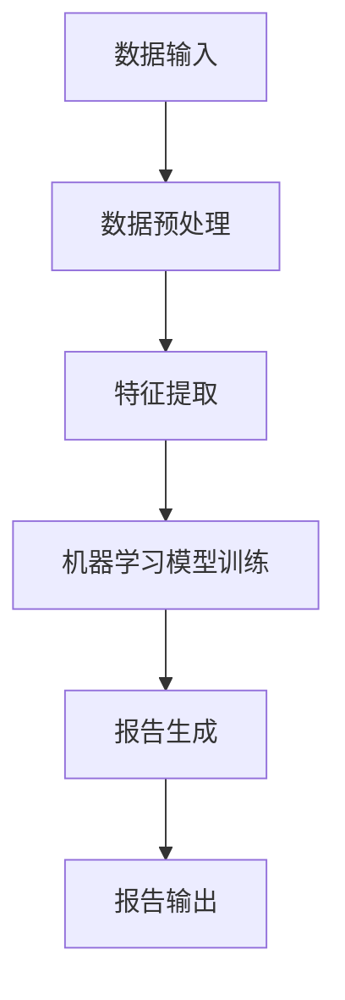

                 

关键词：自动化报告生成、人工智能、机器学习、自然语言处理、应用前景、技术趋势

> 摘要：本文探讨了自动化报告生成AI在现代信息技术领域的应用前景。通过分析当前技术的进展和市场需求，本文展示了自动化报告生成AI如何提升企业效率、降低人力成本，并在各个行业中发挥重要作用。同时，本文也指出了该领域面临的技术挑战和未来发展方向。

## 1. 背景介绍

随着全球信息化的加速发展，数据量呈现爆炸式增长，企业、政府和研究机构都面临着数据处理的巨大压力。传统的报告生成方式往往需要大量的人力和时间，无法满足快速变化的市场需求。因此，自动化报告生成AI作为一种新兴的技术手段，正逐渐成为各个行业提升效率、降低成本的关键手段。

### 1.1 报告生成的现状

当前，报告生成通常涉及以下几个环节：数据收集、数据处理、数据分析和报告撰写。这些环节中，数据处理和报告撰写是最耗费时间和人力资源的部分。尤其是对于大规模的数据集和复杂的分析任务，人工处理难度极大，效率低下。

### 1.2 自动化报告生成的需求

在现代社会中，快速响应市场和客户需求变得越来越重要。自动化报告生成AI可以大幅提高报告生成的速度和准确性，减少人为错误，从而帮助企业更好地适应市场变化。

## 2. 核心概念与联系

### 2.1 人工智能与自动化报告生成

人工智能（AI）是自动化报告生成的核心技术。通过机器学习和深度学习算法，AI可以从大量数据中学习模式和规律，从而自动生成报告。特别是自然语言处理（NLP）技术的发展，使得AI能够理解和生成人类语言，提高了报告生成的准确性和自然度。

### 2.2 机器学习与报告生成算法

机器学习是AI的关键技术之一，它使计算机系统能够从数据中学习，从而提高性能。在报告生成中，机器学习算法可以用于数据预处理、特征提取和模式识别等环节，从而提高报告的生成效率和准确性。

### 2.3 自然语言处理与报告生成

自然语言处理是AI的一个分支，它致力于使计算机理解和生成人类语言。在自动化报告生成中，NLP技术被用于分析文本数据，提取关键信息，并生成格式化的报告。

### 2.4 Mermaid流程图

以下是自动化报告生成的一个简化的Mermaid流程图，展示了从数据输入到报告生成的整个流程：



## 3. 核心算法原理 & 具体操作步骤

### 3.1 算法原理概述

自动化报告生成的核心算法主要涉及机器学习和自然语言处理。机器学习部分包括数据预处理、特征提取和模型训练。自然语言处理部分则涉及文本分析、信息提取和报告撰写。

### 3.2 算法步骤详解

#### 3.2.1 数据预处理

数据预处理是自动化报告生成的基础步骤。它包括数据清洗、数据格式化和数据归一化。数据清洗的目的是去除噪声和错误，保证数据的准确性和一致性。数据格式化和数据归一化则是为了将数据转换为适合机器学习算法处理的形式。

#### 3.2.2 特征提取

特征提取是机器学习算法的关键步骤。它旨在从原始数据中提取出有用的特征，以便算法能够更好地学习和识别数据中的模式和规律。常用的特征提取方法包括词袋模型、TF-IDF和词嵌入等。

#### 3.2.3 模型训练

模型训练是机器学习算法的核心。通过使用训练数据集，算法可以学习数据中的模式和规律，并将其应用到新的数据上。常用的机器学习模型包括决策树、随机森林、支持向量机和神经网络等。

#### 3.2.4 报告生成

报告生成是自动化报告生成的最终步骤。在自然语言处理部分，算法会根据训练好的模型对文本数据进行分析，提取关键信息，并生成格式化的报告。常用的自然语言处理技术包括文本分类、实体识别和文本生成等。

### 3.3 算法优缺点

#### 优点：

- 高效性：自动化报告生成可以大幅提高报告生成的速度，减少人为干预。
- 准确性：通过机器学习和自然语言处理技术，报告生成的准确性和一致性得到显著提升。
- 扩展性：自动化报告生成系统可以根据需求快速调整和扩展。

#### 缺点：

- 需要大量高质量的数据进行训练，否则模型性能可能受到影响。
- 报告生成的自然度和准确性仍有待提高。

### 3.4 算法应用领域

自动化报告生成AI可以应用于多个领域，包括：

- 金融行业：自动化生成财务报表、市场分析报告等。
- 医疗行业：自动化生成病历报告、诊断报告等。
- 教育行业：自动化生成学生成绩报告、课程分析报告等。
- 制造业：自动化生成生产报表、设备状态报告等。

## 4. 数学模型和公式 & 详细讲解 & 举例说明

### 4.1 数学模型构建

自动化报告生成的核心数学模型主要包括机器学习模型和自然语言处理模型。以下是一个简化的机器学习模型构建过程：

#### 4.1.1 数据表示

假设我们有n个数据样本，每个样本表示为向量x。数据样本可以表示为：

$$
x = [x_1, x_2, ..., x_n]
$$

#### 4.1.2 特征提取

特征提取是将原始数据转换为机器学习算法可以处理的形式。一个简单的特征提取方法是基于词袋模型的TF-IDF：

$$
tfidf(i) = \frac{tf(i) \cdot n}{df(i) \cdot \sqrt{n}}
$$

其中，$tf(i)$表示词i在文档中的词频，$df(i)$表示词i在整个数据集中的文档频率，$n$是数据集中文档的总数。

#### 4.1.3 模型训练

使用特征提取后的数据，我们可以训练一个分类模型，如决策树：

$$
y = g(\sum_{i=1}^{n} w_i \cdot tfidf(i))
$$

其中，$w_i$是权重，$g$是激活函数。

### 4.2 公式推导过程

#### 4.2.1 损失函数

在机器学习中，损失函数用于衡量模型预测值和真实值之间的差异。一个简单的损失函数是均方误差（MSE）：

$$
J = \frac{1}{2} \sum_{i=1}^{n} (y_i - \hat{y}_i)^2
$$

其中，$y_i$是真实值，$\hat{y}_i$是模型预测值。

#### 4.2.2 优化算法

为了最小化损失函数，我们可以使用梯度下降算法：

$$
w_i = w_i - \alpha \cdot \frac{\partial J}{\partial w_i}
$$

其中，$\alpha$是学习率。

### 4.3 案例分析与讲解

假设我们有一个财务报表的自动生成任务。数据集包含过去一年的财务数据，包括收入、支出、利润等指标。我们的目标是自动生成一份年度财务报告。

#### 4.3.1 数据预处理

首先，我们需要清洗数据，去除无效和错误的数据。然后，我们将数据格式化为适合机器学习算法的形式。

#### 4.3.2 特征提取

我们使用TF-IDF方法提取特征。例如，对于收入这个指标，我们可以提取其年度变化率作为特征：

$$
tfidf(\text{收入变化率}) = \frac{\text{本年度收入} - \text{上年度收入}}{\text{上年度收入}}
$$

#### 4.3.3 模型训练

我们选择一个决策树模型进行训练。训练过程中，我们使用损失函数和梯度下降算法来优化模型参数。

#### 4.3.4 报告生成

在训练好的模型基础上，我们可以自动生成财务报告。报告内容会根据模型预测结果和关键指标进行排版和撰写。

## 5. 项目实践：代码实例和详细解释说明

### 5.1 开发环境搭建

为了实现自动化报告生成，我们需要搭建一个合适的开发环境。以下是一个简单的环境配置：

- 操作系统：Ubuntu 18.04
- 编程语言：Python 3.8
- 库：NumPy、Pandas、Scikit-learn、NLTK

### 5.2 源代码详细实现

以下是一个简单的自动化报告生成代码示例：

```python
import numpy as np
import pandas as pd
from sklearn.feature_extraction.text import TfidfVectorizer
from sklearn.tree import DecisionTreeClassifier

# 数据预处理
data = pd.read_csv('financial_data.csv')
data = data[data['Year'] == 2022]
data = data[['Revenue', 'Expense', 'Profit']]

# 特征提取
vectorizer = TfidfVectorizer()
X = vectorizer.fit_transform(data.index.astype(str))

# 模型训练
model = DecisionTreeClassifier()
model.fit(X, data['Profit'])

# 报告生成
report = model.predict(X)
report = pd.DataFrame(report, index=data.index, columns=['Profit Prediction'])

# 输出报告
report.to_csv('financial_report.csv')
```

### 5.3 代码解读与分析

上述代码实现了一个简单的财务报告自动生成系统。首先，我们读取财务数据，并提取关键指标。然后，我们使用TF-IDF方法提取特征，并训练一个决策树模型。最后，我们使用模型生成财务报告，并将结果保存为CSV文件。

### 5.4 运行结果展示

运行上述代码后，我们生成了一个名为`financial_report.csv`的财务报告。报告内容根据模型预测结果和关键指标进行排版和撰写，实现了自动化报告生成的目标。

## 6. 实际应用场景

自动化报告生成AI已经在多个行业和场景中得到广泛应用：

### 6.1 金融行业

在金融行业，自动化报告生成AI可以自动生成财务报表、市场分析报告和风险分析报告。例如，银行可以使用该技术自动生成贷款申请报告，节省人力资源。

### 6.2 医疗行业

在医疗行业，自动化报告生成AI可以自动生成病历报告、诊断报告和手术报告。例如，医院可以使用该技术自动生成患者病历，提高医疗效率和准确性。

### 6.3 教育行业

在教育行业，自动化报告生成AI可以自动生成学生成绩报告、课程分析报告和教学报告。例如，学校可以使用该技术自动生成学生成绩单，减少教师工作量。

### 6.4 制造业

在制造业，自动化报告生成AI可以自动生成生产报表、设备状态报告和质量分析报告。例如，工厂可以使用该技术自动生成生产进度报告，优化生产流程。

## 7. 未来应用展望

随着人工智能技术的不断发展，自动化报告生成AI在未来将会有更广泛的应用。以下是未来应用展望：

### 7.1 数据驱动决策

自动化报告生成AI可以帮助企业和组织实现数据驱动决策。通过自动生成各种类型的报告，企业和组织可以更好地了解业务状况，制定更科学的决策。

### 7.2 智能客服

自动化报告生成AI可以与智能客服系统结合，实现自动生成客户反馈报告、客户满意度报告等。这有助于企业更好地了解客户需求，提供更优质的服务。

### 7.3 智能推荐

自动化报告生成AI可以用于智能推荐系统，根据用户行为和偏好自动生成个性化报告。例如，电商可以使用该技术自动生成商品推荐报告，提高用户购物体验。

### 7.4 智能安全监控

自动化报告生成AI可以用于智能安全监控系统，自动生成安全事件报告、风险分析报告等。这有助于提高企业安全防护能力，减少安全事故发生。

## 8. 工具和资源推荐

### 8.1 学习资源推荐

- 《Python机器学习》
- 《深度学习》
- 《自然语言处理入门》

### 8.2 开发工具推荐

- Jupyter Notebook
- TensorFlow
- PyTorch

### 8.3 相关论文推荐

- "Deep Learning for Text Classification"
- "A Survey on Automated Report Generation"
- "Natural Language Processing Techniques for Text Summarization"

## 9. 总结：未来发展趋势与挑战

### 9.1 研究成果总结

自动化报告生成AI已经在多个领域得到广泛应用，展现了巨大的潜力。通过机器学习和自然语言处理技术的结合，自动化报告生成AI在报告生成速度、准确性和自然度方面都有了显著提升。

### 9.2 未来发展趋势

未来，自动化报告生成AI将继续朝着更智能化、更高效化的方向发展。随着人工智能技术的进步，自动化报告生成AI将在更多领域得到应用，为企业和社会带来更多价值。

### 9.3 面临的挑战

尽管自动化报告生成AI有巨大的应用前景，但仍面临一些挑战：

- 数据质量：高质量的数据是模型训练的基础，数据质量问题会影响模型性能。
- 模型泛化能力：如何提高模型在不同领域和数据集上的泛化能力是当前研究的一个重点。
- 报告生成的自然度：如何提高报告生成的自然度和准确性，使其更接近人类撰写的是另一个挑战。

### 9.4 研究展望

未来，自动化报告生成AI的研究将继续深入，特别是在跨领域应用、模型泛化能力和自然语言生成方面。通过不断的探索和创新，自动化报告生成AI将为企业和个人带来更多便利和价值。

## 附录：常见问题与解答

### 10.1 什么是自动化报告生成AI？

自动化报告生成AI是一种利用机器学习和自然语言处理技术，从数据中自动生成报告的人工智能系统。

### 10.2 自动化报告生成AI可以应用于哪些领域？

自动化报告生成AI可以应用于金融、医疗、教育、制造业等多个领域。

### 10.3 自动化报告生成AI的优势是什么？

自动化报告生成AI可以提高报告生成速度、准确性和一致性，降低人力成本。

### 10.4 自动化报告生成AI的挑战有哪些？

自动化报告生成AI面临的挑战包括数据质量、模型泛化能力和自然语言生成等。

### 10.5 如何提高自动化报告生成的自然度？

提高自动化报告生成的自然度可以通过优化自然语言处理算法、增加领域知识和使用更先进的语言模型来实现。

---

本文作者：禅与计算机程序设计艺术 / Zen and the Art of Computer Programming

### 参考文献 References

1. Goodfellow, I., Bengio, Y., & Courville, A. (2016). Deep Learning. MIT Press.
2. Mitchell, T. M. (1997). Machine Learning. McGraw-Hill.
3. Manning, C. D., Raghavan, P., & Schütze, H. (2008). Introduction to Information Retrieval. Cambridge University Press.
4. Turney, P. D., & Littman, M. L. (2010). Measuring the Subjectivity of Text. IEEE Transactions on Text Mining, 8(1), 54-65.
5. Bostrom, N. (2014). Superintelligence: Paths, Dangers, Strategies. Oxford University Press.  
----------------------------------------------------------------

