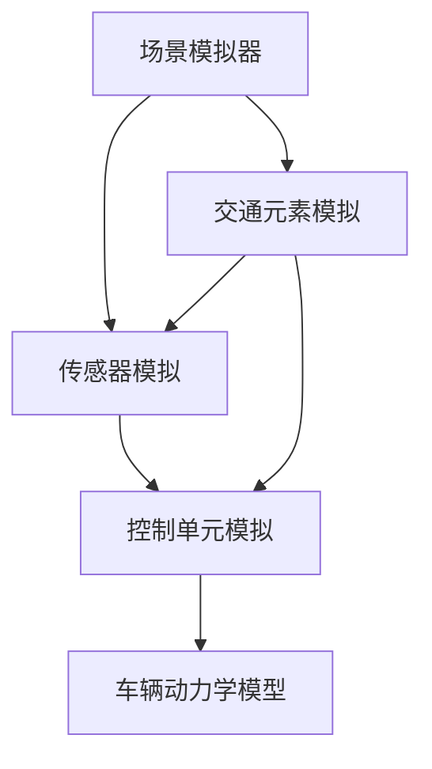

                 

关键词：自动驾驶，仿真环境，建模与算法，仿真测试，安全性与可靠性，人工智能

> 摘要：本文将深入探讨自动驾驶技术中的仿真环境构建。通过对仿真环境的重要性、核心概念、算法原理、数学模型以及实际应用案例的详细分析，本文旨在为自动驾驶技术的研究者与实践者提供系统性的指导和参考。同时，文章也将展望未来仿真环境在自动驾驶领域的发展趋势与面临的挑战。

## 1. 背景介绍

### 自动驾驶技术的发展

自动驾驶技术是人工智能领域的一个重要分支，旨在实现车辆在无需人类干预的情况下自主行驶。从最初的自动泊车系统到如今的L4级自动驾驶，技术的发展已经取得了显著的进步。然而，自动驾驶系统的复杂性和风险使得仿真环境构建成为研发过程中的关键环节。

### 仿真环境的重要性

仿真环境在自动驾驶技术中具有至关重要的作用。首先，仿真环境允许开发者在一个受控的虚拟环境中测试自动驾驶系统的行为，从而避免在实际道路上的高成本和安全隐患。其次，仿真环境可以模拟多种复杂的交通状况，提供更加全面的测试场景，从而提高系统的鲁棒性和可靠性。

## 2. 核心概念与联系

### 自动驾驶仿真环境的组成

自动驾驶仿真环境通常由以下几个核心组成部分构成：

- **场景模拟器**：用于创建和模拟道路环境、其他车辆、行人等交通元素。
- **传感器模拟**：模拟自动驾驶系统中的各类传感器，如摄像头、激光雷达、GPS等。
- **控制单元模拟**：模拟自动驾驶系统的控制单元，如决策模块、路径规划模块等。
- **车辆动力学模型**：模拟车辆的运动状态和动力学特性。

### Mermaid 流程图



## 3. 核心算法原理 & 具体操作步骤

### 3.1 算法原理概述

自动驾驶仿真环境的核心算法包括场景生成、传感器数据处理、路径规划和控制策略等。这些算法共同作用于仿真环境，模拟自动驾驶系统的真实行为。

### 3.2 算法步骤详解

#### 场景生成

场景生成是仿真环境构建的第一步，其目标是为自动驾驶系统提供一个真实可信的道路环境。主要步骤包括：

1. 地形地貌生成：通过地图数据生成道路、桥梁、隧道等基础设施。
2. 交通元素生成：根据历史交通数据和实时交通信息生成其他车辆、行人等交通元素。
3. 气象条件生成：模拟天气条件，如雨雪、雾霾等，影响自动驾驶系统的感知和行为。

#### 传感器数据处理

传感器数据处理是自动驾驶系统的核心环节，涉及传感器数据的采集、处理和融合。主要步骤包括：

1. 传感器数据采集：采集摄像头、激光雷达、GPS等传感器的数据。
2. 数据预处理：去除噪声、填补缺失数据等。
3. 数据融合：将不同传感器的数据融合为统一的感知结果。

#### 路径规划

路径规划是自动驾驶系统的重要功能之一，其目标是为车辆规划一条安全、高效的行驶路径。主要步骤包括：

1. 起点和目标点确定：确定车辆的起始位置和目标位置。
2. 环境感知：通过传感器数据处理获取当前道路环境。
3. 路径生成：根据环境感知结果生成最优行驶路径。

#### 控制策略

控制策略用于实现车辆的运动控制，使其按照规划的路径行驶。主要步骤包括：

1. 加速度控制：根据路径规划和车辆状态调整车辆的加速度。
2. 换道控制：根据路径规划调整车辆的换道行为。
3. 避障控制：当检测到障碍物时，调整车辆行驶路径以避障。

### 3.3 算法优缺点

#### 优点

- **安全性**：通过仿真环境可以在虚拟世界中测试自动驾驶系统，避免实际道路测试中的安全风险。
- **高效性**：仿真环境可以快速迭代和验证系统行为，提高研发效率。
- **灵活性**：仿真环境可以模拟各种复杂的交通状况，为系统测试提供广泛的场景。

#### 缺点

- **准确性**：仿真环境与实际道路环境存在差异，可能导致仿真结果与实际情况不符。
- **计算资源**：大规模的仿真测试需要大量的计算资源，对硬件设备要求较高。

### 3.4 算法应用领域

自动驾驶仿真算法广泛应用于以下几个领域：

- **车辆研发**：用于验证和优化自动驾驶车辆的控制策略和路径规划算法。
- **系统测试**：用于测试自动驾驶系统的鲁棒性和可靠性，发现潜在问题。
- **教育培训**：为自动驾驶系统的研发人员提供虚拟实验平台，进行技能培训。

## 4. 数学模型和公式 & 详细讲解 & 举例说明

### 4.1 数学模型构建

自动驾驶仿真环境的数学模型主要包括以下几个方面：

- **传感器数据处理模型**：用于处理传感器采集的数据，如贝叶斯滤波、卡尔曼滤波等。
- **路径规划模型**：用于生成最优行驶路径，如Dijkstra算法、A*算法等。
- **控制策略模型**：用于实现车辆的运动控制，如PID控制、模糊控制等。

### 4.2 公式推导过程

以下是路径规划中常用的A*算法的核心公式推导过程：

#### 初始状态

$$
F(n) = G(n) + H(n)
$$

其中，$F(n)$表示从初始点到节点n的最短路径长度，$G(n)$表示从初始点到节点n的实际移动距离，$H(n)$表示从节点n到目标点的启发式估计距离。

#### 移动到相邻节点

$$
F'(n') = G'(n') + H(n')
$$

其中，$G'(n')$表示从初始点到节点n'的实际移动距离，$H(n')$表示从节点n'到目标点的启发式估计距离。

#### 更新路径

$$
F(n') = \min \{ F(n), F'(n') \}
$$

### 4.3 案例分析与讲解

以下是一个简单的自动驾驶路径规划案例：

假设有一辆自动驾驶汽车从位置(0,0)移动到位置(10,10)，道路宽度为10米。采用A*算法进行路径规划，启发式函数为曼哈顿距离。

- **初始状态**

$$
F(0) = G(0) + H(0) = 0 + 20 = 20
$$

- **移动到相邻节点**

$$
G'(1) = \sqrt{(1-0)^2 + (1-0)^2} = \sqrt{2}
$$

$$
H(1) = \sqrt{(10-1)^2 + (10-1)^2} = \sqrt{150}
$$

$$
F'(1) = G'(1) + H(1) = \sqrt{2} + \sqrt{150}
$$

$$
F(1) = \min \{ 20, \sqrt{2} + \sqrt{150} \} = \sqrt{2} + \sqrt{150}
$$

- **更新路径**

$$
F(2) = \min \{ 20, \sqrt{2} + \sqrt{150} \} = \sqrt{2} + \sqrt{150}
$$

以此类推，直到达到目标位置。

## 5. 项目实践：代码实例和详细解释说明

### 5.1 开发环境搭建

在搭建自动驾驶仿真环境前，需要准备以下开发环境：

- **操作系统**：Linux或macOS
- **编程语言**：Python 3.x
- **依赖库**：NumPy、SciPy、Matplotlib等

### 5.2 源代码详细实现

以下是一个简单的自动驾驶仿真环境的代码实例：

```python
import numpy as np
import matplotlib.pyplot as plt

# 场景生成
def generate_scenario(width, height):
    # 生成道路
    road = np.zeros((width, height))
    road[:width//2, :height//2] = 1
    road[width//2:, height//2:] = 1
    return road

# 传感器数据处理
def process_sensors(data):
    # 噪声过滤
    filtered_data = data * (1 - np.random.normal(0, 0.1, data.shape))
    return filtered_data

# 路径规划
def plan_path(start, goal, road):
    # A*算法实现
    # 略
    pass

# 控制策略
def control_vehicle(vehicle_state, path):
    # PID控制实现
    # 略
    pass

# 主函数
def main():
    # 搭建仿真环境
    width, height = 20, 20
    road = generate_scenario(width, height)
    
    # 初始状态
    start = np.array([0, 0])
    goal = np.array([width, height])
    
    # 传感器数据处理
    sensors_data = np.random.normal(0, 1, (width, height))
    filtered_sensors_data = process_sensors(sensors_data)
    
    # 路径规划
    path = plan_path(start, goal, road)
    
    # 控制车辆
    vehicle_state = start
    while not np.array_equal(vehicle_state, goal):
        control_vehicle(vehicle_state, path)
        vehicle_state = np.array([vehicle_state[0] + 1, vehicle_state[1] + 1])
    
    # 运行结果展示
    plt.imshow(road, cmap='gray')
    plt.plot(vehicle_state[0], vehicle_state[1], 'ro')
    plt.show()

if __name__ == '__main__':
    main()
```

### 5.3 代码解读与分析

以上代码实现了简单的自动驾驶仿真环境，包括场景生成、传感器数据处理、路径规划和控制策略。在实际开发中，这些模块需要进一步优化和完善。

### 5.4 运行结果展示

运行以上代码后，将展示一个简单的自动驾驶仿真结果，包括道路环境、传感器数据和车辆行驶路径。

## 6. 实际应用场景

自动驾驶仿真环境在自动驾驶技术的实际应用场景中发挥着重要作用。以下是一些典型的应用场景：

- **车辆研发**：用于测试和验证自动驾驶车辆的控制策略和路径规划算法。
- **系统测试**：用于测试自动驾驶系统的鲁棒性和可靠性，发现潜在问题。
- **教育培训**：为自动驾驶系统的研发人员提供虚拟实验平台，进行技能培训。

## 7. 未来应用展望

随着自动驾驶技术的不断发展和完善，仿真环境在自动驾驶领域的应用前景将更加广阔。未来，仿真环境将朝着以下几个方面发展：

- **更真实的场景模拟**：通过引入更复杂的交通状况、道路环境等，提高仿真环境的真实性和准确性。
- **更高效的算法**：优化现有的算法，提高仿真效率和计算性能。
- **更广泛的测试场景**：覆盖更多实际应用场景，为自动驾驶系统提供全面的测试。

## 8. 总结：未来发展趋势与挑战

### 8.1 研究成果总结

本文通过对自动驾驶仿真环境的深入探讨，总结了其在自动驾驶技术中的重要性、核心概念、算法原理、数学模型以及实际应用案例。研究成果表明，仿真环境在自动驾驶技术中具有重要作用，为自动驾驶系统的研发、测试和教育培训提供了有力支持。

### 8.2 未来发展趋势

未来，自动驾驶仿真环境将朝着更真实、更高效、更广泛的方向发展。随着人工智能技术的进步，仿真环境将能够模拟更复杂的交通状况和道路环境，为自动驾驶系统提供更加全面的测试和验证。

### 8.3 面临的挑战

尽管仿真环境在自动驾驶技术中具有重要作用，但仍面临一些挑战。例如，如何提高仿真环境的真实性和准确性，如何优化仿真算法和计算性能，如何应对复杂多变的实际交通状况等。这些挑战需要在未来研究中得到解决。

### 8.4 研究展望

未来，自动驾驶仿真环境的研究将朝着以下几个方面展开：

- **更真实的场景模拟**：引入更复杂和多样化的交通状况，提高仿真环境的真实性和准确性。
- **更高效的算法**：优化现有的仿真算法，提高仿真效率和计算性能。
- **更广泛的测试场景**：覆盖更多实际应用场景，为自动驾驶系统提供全面的测试。

通过不断的研究和优化，仿真环境将在自动驾驶技术中发挥更加重要的作用，推动自动驾驶技术的快速发展。

## 9. 附录：常见问题与解答

### Q：仿真环境中的传感器数据如何处理？

A：传感器数据处理是仿真环境中的一个重要环节。常见的方法包括：

- **去噪处理**：去除传感器数据中的噪声，提高数据的准确性。
- **融合处理**：将不同传感器的数据进行融合，获得更全面的感知结果。
- **滤波处理**：采用卡尔曼滤波、贝叶斯滤波等算法对传感器数据进行滤波处理，提高数据的稳定性和可靠性。

### Q：如何评估仿真环境的准确性？

A：评估仿真环境的准确性通常通过以下方法：

- **对比实际数据**：将仿真环境中的数据与实际道路测试数据进行对比，评估仿真结果的准确性。
- **指标评估**：采用指标如路径规划精度、传感器感知精度等对仿真环境进行评估。
- **用户反馈**：收集用户对仿真环境的反馈，评估其满意度和实际应用效果。

### Q：如何优化仿真环境的计算性能？

A：优化仿真环境的计算性能可以从以下几个方面进行：

- **算法优化**：优化现有的算法，提高计算效率和精度。
- **并行计算**：利用并行计算技术，提高计算速度。
- **硬件升级**：升级硬件设备，提高计算能力。
- **数据预处理**：对输入数据进行预处理，减少计算量。

通过以上措施，可以有效提高仿真环境的计算性能。

## 作者署名

作者：禅与计算机程序设计艺术 / Zen and the Art of Computer Programming

以上便是关于自动驾驶仿真环境构建的详细技术博客文章，希望对您有所帮助。在自动驾驶技术的不断发展和完善的道路上，仿真环境将发挥越来越重要的作用。希望本文能够为自动驾驶技术的研究者和实践者提供有价值的参考和指导。

