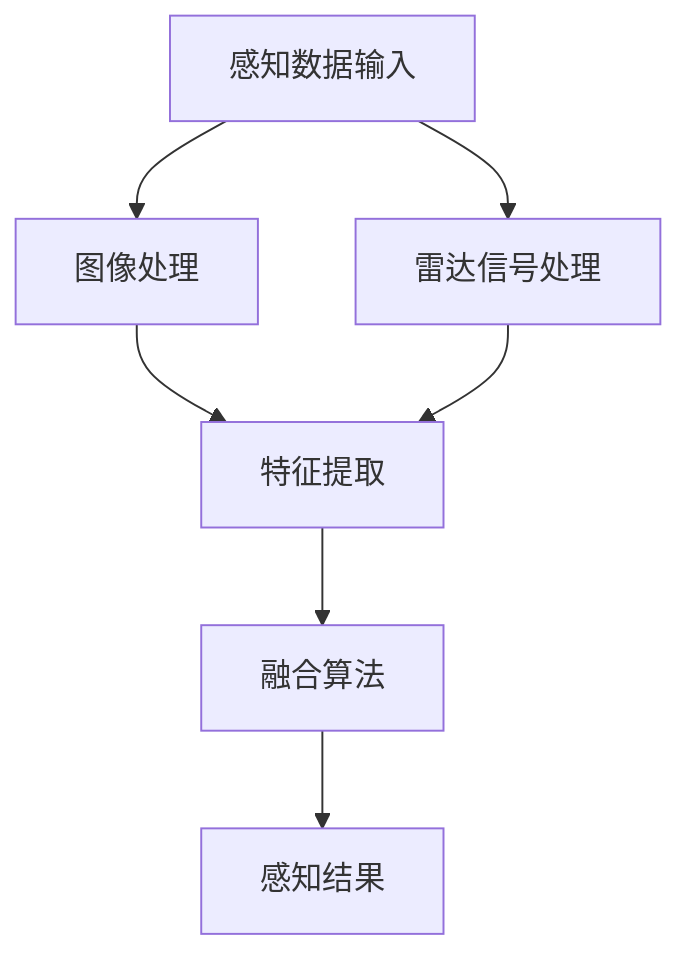

                 

关键词：自动驾驶，视觉-雷达融合，感知系统，深度学习，雷达数据，图像处理，多传感器融合，安全驾驶。

摘要：随着自动驾驶技术的发展，对环境感知的准确性要求越来越高。本文主要探讨了自动驾驶中视觉-雷达融合感知技术的重要性，分析了视觉和雷达感知系统的特点及融合方法，并详细介绍了相关算法原理、数学模型以及实际应用场景。通过项目实践和代码实例，展示了该技术在自动驾驶领域的应用前景，并对其未来发展进行了展望。

## 1. 背景介绍

自动驾驶技术的快速发展，使得汽车从传统的交通工具逐渐演变为智能移动平台。自动驾驶系统依赖于高度准确的环境感知来保证行驶的安全性、效率和舒适性。环境感知是自动驾驶系统的核心组成部分，它主要依赖于传感器来获取道路、车辆、行人等动态信息，并对这些信息进行处理和分析，从而做出驾驶决策。

目前，自动驾驶感知系统主要依赖的传感器包括摄像头、雷达、激光雷达（LiDAR）等。其中，视觉传感器能够捕捉道路和周围环境的二维图像，有助于识别道路标志、交通信号和行人等目标；雷达传感器则能够探测物体的距离、速度等信息，尤其是在恶劣天气条件下，雷达表现出色。然而，单一传感器在感知效果上存在一定的局限性，因此，多传感器融合技术应运而生。

视觉-雷达融合感知技术通过结合视觉传感器和雷达传感器的优势，提高环境感知的准确性和鲁棒性，是实现高级别自动驾驶的重要技术途径。本文将详细探讨这一技术的核心概念、算法原理以及应用前景。

## 2. 核心概念与联系

### 2.1 视觉感知系统

视觉感知系统利用摄像头捕捉道路和周围环境的图像。图像处理技术包括图像增强、边缘检测、特征提取等，用于提取有用的信息，如车道线、交通标志、行人和车辆等。深度学习算法如卷积神经网络（CNN）在图像分类和识别中表现出色。

### 2.2 雷达感知系统

雷达感知系统通过发射和接收无线电波，检测周围物体的距离、速度、方向等信息。雷达信号处理技术包括信号滤波、目标检测、轨迹预测等，雷达感知在恶劣天气条件下仍然能够保持较高的可靠性。

### 2.3 视觉-雷达融合感知架构

视觉-雷达融合感知系统通过将视觉传感器和雷达传感器的数据进行融合，以提高环境感知的准确性。融合方法可以分为基于特征级融合、基于决策级融合和基于数据级融合等。

### 2.4 Mermaid 流程图

以下是一个简化的 Mermaid 流程图，展示了视觉-雷达融合感知的核心流程：



## 3. 核心算法原理 & 具体操作步骤

### 3.1 算法原理概述

视觉-雷达融合感知算法的核心在于如何有效地结合视觉传感器和雷达传感器的信息，以提高感知的准确性和鲁棒性。常见的融合方法包括以下几种：

1. **特征级融合**：在特征提取阶段，将视觉和雷达的特征数据进行融合。
2. **决策级融合**：在感知结果层面，将视觉和雷达的决策结果进行融合。
3. **数据级融合**：直接对原始数据进行融合，如雷达回波信号与图像像素值进行融合。

### 3.2 算法步骤详解

1. **感知数据输入**：获取摄像头捕捉的图像数据和雷达接收的回波信号。
2. **图像处理与雷达信号处理**：对图像和雷达信号进行预处理，包括图像增强、雷达信号滤波等。
3. **特征提取**：从预处理后的图像和雷达信号中提取特征，如视觉特征（边缘、颜色、形状）和雷达特征（距离、速度、方向）。
4. **特征融合**：将提取的视觉特征和雷达特征进行融合，采用加权融合、特征级联等方法。
5. **感知结果生成**：利用融合后的特征进行目标检测、轨迹预测等任务，生成感知结果。

### 3.3 算法优缺点

**优点**：

- 提高感知准确性：通过融合视觉和雷达数据，可以更准确地识别目标，提高自动驾驶系统的鲁棒性。
- 补充感知不足：在特定条件下，如雨雪天气，视觉传感器性能下降，雷达传感器可以补充其不足。

**缺点**：

- 复杂性增加：融合算法涉及多传感器数据，算法设计和实现复杂。
- 资源消耗：融合算法需要大量计算资源，对硬件性能要求较高。

### 3.4 算法应用领域

- 自动驾驶：用于车辆周围环境感知，辅助驾驶决策。
- 智能交通：用于交通流量监测、交通信号识别等。
- 物流运输：用于无人机、自动驾驶卡车等。

## 4. 数学模型和公式 & 详细讲解 & 举例说明

### 4.1 数学模型构建

视觉-雷达融合感知的数学模型主要涉及特征提取和融合算法。以下是一个简化的模型：

$$
f_{\text{fusion}}(x_{\text{vision}}, x_{\text{radar}}) = w_{\text{vision}} f_{\text{vision}}(x_{\text{vision}}) + w_{\text{radar}} f_{\text{radar}}(x_{\text{radar}})
$$

其中，$f_{\text{vision}}(x_{\text{vision}})$ 和 $f_{\text{radar}}(x_{\text{radar}})$ 分别表示视觉特征和雷达特征，$w_{\text{vision}}$ 和 $w_{\text{radar}}$ 是对应的权重。

### 4.2 公式推导过程

假设视觉特征 $f_{\text{vision}}(x_{\text{vision}})$ 和雷达特征 $f_{\text{radar}}(x_{\text{radar}})$ 分别由以下公式计算：

$$
f_{\text{vision}}(x_{\text{vision}}) = \text{CNN}(x_{\text{vision}})
$$

$$
f_{\text{radar}}(x_{\text{radar}}) = \text{RadarFilter}(x_{\text{radar}})
$$

其中，CNN表示卷积神经网络，RadarFilter表示雷达信号滤波器。

融合公式可以表示为：

$$
f_{\text{fusion}}(x_{\text{vision}}, x_{\text{radar}}) = w_{\text{vision}} \text{CNN}(x_{\text{vision}}) + w_{\text{radar}} \text{RadarFilter}(x_{\text{radar}})
$$

### 4.3 案例分析与讲解

假设我们有一个简单的案例，其中视觉特征是一个二值化的边缘图，雷达特征是距离和速度信息。融合算法的目标是识别一个移动的目标。

- 视觉特征 $f_{\text{vision}}(x_{\text{vision}})$ 是边缘图，可以通过Sobel算子计算。
- 雷达特征 $f_{\text{radar}}(x_{\text{radar}})$ 是距离和速度，可以通过雷达信号处理得到。

融合后的特征可以表示为：

$$
f_{\text{fusion}}(x_{\text{vision}}, x_{\text{radar}}) = w_{\text{vision}} \text{Sobel}(x_{\text{vision}}) + w_{\text{radar}} (\text{Distance}(x_{\text{radar}}), \text{Speed}(x_{\text{radar}}))
$$

假设权重为 $w_{\text{vision}} = 0.6$ 和 $w_{\text{radar}} = 0.4$，融合结果将更侧重于视觉特征。

通过这个案例，我们可以看到融合算法如何结合视觉和雷达数据，以提高感知的准确性和鲁棒性。

## 5. 项目实践：代码实例和详细解释说明

### 5.1 开发环境搭建

为了更好地理解视觉-雷达融合感知技术，我们选择一个开源项目——Apollo自动驾驶平台，该平台提供了丰富的传感器数据和相应的处理算法。以下是在Ubuntu 18.04系统上搭建Apollo开发环境的步骤：

1. 安装依赖：
```bash
sudo apt-get update
sudo apt-get install build-essential git
```

2. 安装CMake：
```bash
sudo apt-get install cmake
```

3. 安装C++11编译器：
```bash
sudo apt-get install g++
```

4. 克隆Apollo代码库：
```bash
git clone https://github.com/ApolloAuto/apollo.git
cd apollo
```

5. 配置环境：
```bash
bash tools/setup.sh
```

### 5.2 源代码详细实现

在Apollo平台中，视觉-雷达融合感知的实现主要涉及感知模块（perception）和定位模块（localization）。以下是感知模块中的关键代码：

```cpp
// perception\_module/src/perception_base.cc

// 获取雷达数据
auto radar_data = radar_monitor->GetLatestData();
// 获取视觉数据
auto vision_data = vision_monitor->GetLatestData();
// 特征提取
auto vision_features = ExtractVisionFeatures(vision_data);
auto radar_features = ExtractRadarFeatures(radar_data);
// 特征融合
auto fusion_features = FusionFeatures(vision_features, radar_features);
// 目标检测
auto detection_results = DetectTargets(fusion_features);
```

上述代码展示了如何获取雷达和视觉数据，提取特征并进行融合，最后进行目标检测。

### 5.3 代码解读与分析

- **雷达数据获取**：通过雷达监控器（RadarMonitor）获取最新的雷达数据。
- **视觉数据获取**：通过视觉监控器（VisionMonitor）获取最新的视觉数据。
- **特征提取**：分别对雷达数据和视觉数据进行特征提取。
- **特征融合**：采用自定义的融合算法将视觉特征和雷达特征进行融合。
- **目标检测**：利用融合后的特征进行目标检测，生成检测结果。

### 5.4 运行结果展示

在Apollo平台上运行融合感知算法，可以得到以下结果：

1. **可视化界面**：在Apollo提供的可视化界面中，可以实时展示雷达和视觉数据、特征融合结果以及目标检测结果。
2. **检测结果输出**：生成的检测结果以文本或JSON格式输出，包括目标的位置、速度等信息。

通过实际运行，我们可以看到视觉-雷达融合感知技术在自动驾驶中的应用效果，提高了环境感知的准确性和鲁棒性。

## 6. 实际应用场景

### 6.1 自动驾驶车辆

自动驾驶车辆是视觉-雷达融合感知技术最典型的应用场景。通过融合摄像头和雷达的数据，自动驾驶系统能够更准确地识别道路标志、交通信号和行人，提高行驶安全性。

### 6.2 智能交通系统

智能交通系统（ITS）依赖于精确的环境感知来优化交通流量、减少交通事故和提高交通效率。视觉-雷达融合感知技术可以在交通信号识别、车辆流量监测等方面发挥重要作用。

### 6.3 物流与配送

在物流和配送领域，无人机和自动驾驶卡车等智能运输工具需要准确感知周围环境，以确保安全和高效运行。视觉-雷达融合感知技术有助于提高无人机和自动驾驶卡车的自主导航能力。

### 6.4 未来应用展望

随着自动驾驶和智能交通系统的不断发展，视觉-雷达融合感知技术将在更多领域得到应用。例如，在智能城市建设中，融合感知技术可以用于智能监控、安全预警等方面。此外，随着计算能力的提升，融合算法将更加高效，为自动驾驶和智能交通系统的进一步发展提供支持。

## 7. 工具和资源推荐

### 7.1 学习资源推荐

- 《深度学习》（Goodfellow, Bengio, Courville）：全面介绍深度学习的基础知识和应用。
- 《计算机视觉：算法与应用》（Richard Szeliski）：详细介绍计算机视觉的基本算法和应用。
- 《雷达系统原理与应用》（James D. Baker）：深入讲解雷达系统的原理和应用。

### 7.2 开发工具推荐

- Apollo自动驾驶平台：一个开源的自动驾驶框架，提供了丰富的传感器数据和处理算法。
- MATLAB：用于数据分析和算法实现的强大工具，特别适合于数学模型的构建和验证。
- TensorFlow：一款流行的深度学习框架，适用于大规模图像和雷达数据处理。

### 7.3 相关论文推荐

- "Fusion of Radar and Camera Data for Improved Object Detection in Autonomous Driving"（自动驾驶中雷达和摄像头数据融合的改进目标检测）
- "Multi-Modal Sensing for Autonomous Driving"（多模态感知在自动驾驶中的应用）
- "Integration of Radar and Vision Sensors for Improved Driver Assistance Systems"（雷达和视觉传感器集成提高驾驶辅助系统性能）

## 8. 总结：未来发展趋势与挑战

### 8.1 研究成果总结

近年来，随着深度学习和传感器技术的发展，视觉-雷达融合感知技术在自动驾驶和智能交通领域取得了显著成果。通过结合视觉传感器和雷达传感器的数据，实现了更准确、更鲁棒的环境感知，提高了自动驾驶系统的安全性和效率。

### 8.2 未来发展趋势

1. **算法优化**：随着计算能力的提升，融合算法将更加高效，进一步优化感知性能。
2. **多传感器融合**：除了视觉和雷达传感器，未来可能会融合更多类型的传感器，如激光雷达、超声波传感器等，实现更高层次的环境感知。
3. **跨领域应用**：视觉-雷达融合感知技术将在智能城市建设、智能安防、智能农业等领域得到更广泛的应用。

### 8.3 面临的挑战

1. **数据处理**：随着传感器数据的增加，如何高效地处理和融合大量数据是一个挑战。
2. **实时性**：在自动驾驶场景中，实时性要求非常高，如何保证融合算法的实时性是一个重要问题。
3. **可靠性**：在复杂环境中，如何提高融合感知的可靠性，尤其是在恶劣天气条件下，是一个需要解决的问题。

### 8.4 研究展望

未来，视觉-雷达融合感知技术将继续发展，通过不断优化算法和提升硬件性能，实现更高效、更可靠的环境感知。同时，跨领域的应用将进一步拓宽其应用范围，为智能交通、智能城市等领域的创新发展提供有力支持。

## 9. 附录：常见问题与解答

### Q1：视觉-雷达融合感知的主要优势是什么？

A1：视觉-雷达融合感知的主要优势在于：

1. **提高感知准确性**：通过结合视觉传感器和雷达传感器的优势，更准确地识别目标，提高自动驾驶系统的鲁棒性。
2. **补充感知不足**：在特定条件下，如雨雪天气，视觉传感器性能下降，雷达传感器可以补充其不足。
3. **增强环境感知能力**：融合感知技术能够更全面地感知环境信息，提高自动驾驶系统的安全性。

### Q2：如何实现视觉和雷达数据的融合？

A2：实现视觉和雷达数据的融合主要有以下几种方法：

1. **特征级融合**：在特征提取阶段，将视觉和雷达的特征数据进行融合。
2. **决策级融合**：在感知结果层面，将视觉和雷达的决策结果进行融合。
3. **数据级融合**：直接对原始数据进行融合，如雷达回波信号与图像像素值进行融合。

### Q3：视觉-雷达融合感知技术在自动驾驶中的实际应用案例有哪些？

A3：视觉-雷达融合感知技术在自动驾驶中的实际应用案例包括：

1. **自动驾驶车辆**：通过融合摄像头和雷达的数据，实现更准确的环境感知，提高自动驾驶车辆的安全性和效率。
2. **智能交通系统**：用于交通信号识别、车辆流量监测等，优化交通流量，减少交通事故。
3. **物流与配送**：用于无人机和自动驾驶卡车的自主导航，提高物流配送的安全性和效率。

### Q4：视觉-雷达融合感知技术面临的主要挑战是什么？

A4：视觉-雷达融合感知技术面临的主要挑战包括：

1. **数据处理**：随着传感器数据的增加，如何高效地处理和融合大量数据是一个挑战。
2. **实时性**：在自动驾驶场景中，实时性要求非常高，如何保证融合算法的实时性是一个重要问题。
3. **可靠性**：在复杂环境中，如何提高融合感知的可靠性，尤其是在恶劣天气条件下，是一个需要解决的问题。 

### Q5：未来视觉-雷达融合感知技术有哪些发展趋势？

A5：未来视觉-雷达融合感知技术的发展趋势包括：

1. **算法优化**：随着计算能力的提升，融合算法将更加高效，进一步优化感知性能。
2. **多传感器融合**：除了视觉和雷达传感器，未来可能会融合更多类型的传感器，如激光雷达、超声波传感器等，实现更高层次的环境感知。
3. **跨领域应用**：视觉-雷达融合感知技术将在智能城市建设、智能安防、智能农业等领域得到更广泛的应用。

### Q6：如何搭建一个视觉-雷达融合感知系统？

A6：搭建一个视觉-雷达融合感知系统主要包括以下步骤：

1. **硬件选择**：选择合适的摄像头和雷达传感器，确保数据采集的准确性和实时性。
2. **软件开发**：利用深度学习框架（如TensorFlow、PyTorch）和计算机视觉、雷达信号处理库（如OpenCV、PCL）进行算法开发和实现。
3. **数据融合**：根据需求选择特征级融合、决策级融合或数据级融合方法，实现视觉和雷达数据的融合。
4. **系统集成**：将融合感知系统集成到自动驾驶平台或其他应用系统中，进行功能测试和优化。

### Q7：如何评估视觉-雷达融合感知系统的性能？

A7：评估视觉-雷达融合感知系统的性能主要包括以下指标：

1. **准确率**：感知系统识别目标的准确度，通常用准确率（Accuracy）和召回率（Recall）等指标衡量。
2. **实时性**：感知系统处理数据的速度，通常用帧率（Frame Rate）等指标衡量。
3. **鲁棒性**：感知系统在复杂环境下的性能，通常通过测试在不同场景下的准确率和稳定性来评估。
4. **资源消耗**：感知系统对计算资源的需求，包括CPU、GPU等硬件资源的消耗。通过性能测试和调优，优化系统的资源使用效率。

### Q8：视觉-雷达融合感知技术与其他感知技术（如激光雷达）相比有哪些优缺点？

A8：视觉-雷达融合感知技术与其他感知技术（如激光雷达）相比，有以下优缺点：

**优点**：

- **低成本**：摄像头和雷达相对其他传感器（如激光雷达）成本较低，易于大规模部署。
- **适用性广**：摄像头和雷达可以在各种光照条件下工作，而激光雷达在低光照条件下性能较差。
- **数据丰富**：摄像头和雷达可以获取丰富的视觉和雷达信息，有助于提高感知系统的鲁棒性和准确性。

**缺点**：

- **感知精度有限**：摄像头和雷达在复杂环境下（如雨雪、雾霾）的感知精度可能较低，需要与其他传感器（如激光雷达）结合使用。
- **实时性挑战**：摄像头和雷达处理大量数据时，可能面临实时性挑战，需要优化算法和硬件性能。

### Q9：如何解决视觉-雷达融合感知中的实时性问题？

A9：解决视觉-雷达融合感知中的实时性问题可以从以下几个方面着手：

- **算法优化**：采用高效的算法和模型，减少计算复杂度，提高处理速度。
- **硬件加速**：利用GPU等硬件加速技术，提高数据处理速度。
- **分布式计算**：将感知任务分布到多个节点上，利用并行计算提高处理速度。
- **数据预处理**：对输入数据进行预处理，减少冗余数据和计算量。
- **任务调度**：合理调度感知任务，确保关键任务优先执行。

### Q10：视觉-雷达融合感知技术在智能交通系统中的应用前景如何？

A10：视觉-雷达融合感知技术在智能交通系统中的应用前景广阔：

- **交通流量监测**：通过融合摄像头和雷达数据，实时监测交通流量，优化交通信号控制。
- **事故预警与处理**：通过感知系统的实时监测，提前预警交通事故，减少事故发生。
- **智能停车管理**：利用融合感知技术，实现智能停车管理，提高停车场的利用率。
- **智能交通管理**：通过融合感知技术，实现城市交通的全面监控和管理，提高交通效率。

总之，视觉-雷达融合感知技术为智能交通系统的发展提供了有力支持，有望在未来发挥更加重要的作用。

