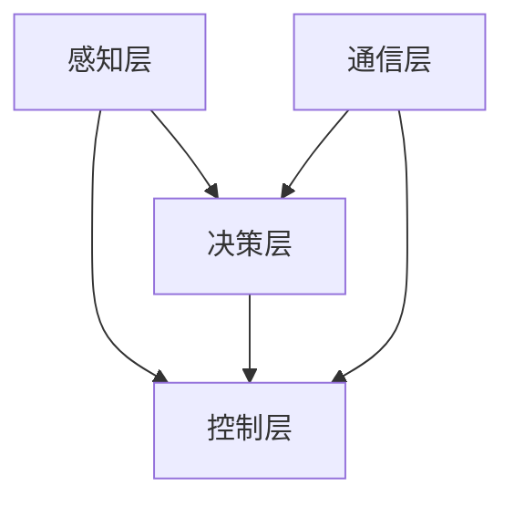

                 

自动驾驶技术的快速发展已经改变了我们的出行方式，为人类提供了更为便捷和高效的交通解决方案。然而，随着技术的进步，自动驾驶系统的安全性问题也日益凸显。作为一项高度依赖于软件和硬件的高科技产品，自动驾驶系统的安全性直接关系到乘客、行人和其他道路使用者的生命安全。因此，建立一套科学、合理、系统化的安全性测试标准与规范，对自动驾驶行业的发展至关重要。

本文将围绕自动驾驶行业的安全性测试标准与规范展开讨论，旨在为读者提供一份全面、深入的理解。文章将分为以下几个部分：

1. **背景介绍**：介绍自动驾驶技术的发展历程及其带来的变革。
2. **核心概念与联系**：详细阐述自动驾驶系统中的核心概念及其相互关系。
3. **核心算法原理 & 具体操作步骤**：分析自动驾驶系统的核心算法，并解释其具体操作步骤。
4. **数学模型和公式 & 详细讲解 & 举例说明**：探讨自动驾驶系统中的数学模型和公式，并通过案例进行分析。
5. **项目实践：代码实例和详细解释说明**：提供自动驾驶系统的实际代码实例，并进行详细解读。
6. **实际应用场景**：分析自动驾驶技术的应用场景，包括城市道路和高速公路。
7. **未来应用展望**：探讨自动驾驶技术的未来发展方向。
8. **工具和资源推荐**：推荐学习资源和开发工具。
9. **总结：未来发展趋势与挑战**：总结研究成果，探讨未来发展趋势和面临的挑战。
10. **附录：常见问题与解答**：回答读者可能关心的一些问题。

## 1. 背景介绍

自动驾驶技术，顾名思义，是指利用计算机系统代替人类驾驶员完成车辆行驶的技术。这一概念最早可以追溯到20世纪50年代，但直到21世纪初，随着计算机技术、传感器技术、通信技术等领域的快速发展，自动驾驶技术才逐渐从理论研究走向实际应用。

### 自动驾驶技术的发展历程

- **20世纪50年代**：自动驾驶概念首次提出。
- **20世纪80年代**：美国卡内基梅隆大学等机构开始研究自动驾驶技术。
- **21世纪初**：自动驾驶技术逐渐进入商业化阶段。
- **2010年代至今**：多家科技公司、传统汽车制造商和初创企业纷纷投入自动驾驶技术的研发，市场应用逐步扩大。

### 自动驾驶技术带来的变革

自动驾驶技术的出现，为交通行业带来了巨大的变革：

- **提高交通效率**：自动驾驶车辆能够更高效地规划路线，减少拥堵，提高道路通行能力。
- **减少交通事故**：通过精确的传感器和先进的算法，自动驾驶车辆能够更好地识别道路状况，减少人为驾驶带来的交通事故。
- **改善乘客体验**：自动驾驶车辆能够提供更为舒适、便捷的出行服务。
- **促进能源节约**：自动驾驶车辆能够通过智能路线规划实现更加节能的行驶。

然而，自动驾驶技术的快速发展也带来了一系列挑战，尤其是安全性问题。自动驾驶系统的复杂性使其在安全性方面面临着前所未有的考验。因此，建立一套科学、完善的安全测试标准与规范，对于保障自动驾驶系统的安全运行至关重要。

### 自动驾驶系统的安全性

自动驾驶系统的安全性包括多个方面，如软件安全性、硬件可靠性和系统完整性等。以下是一些关键的安全问题：

- **软件安全性**：自动驾驶系统依赖于大量的软件，包括操作系统、控制算法、通信协议等。任何软件缺陷都可能导致严重的安全问题。
- **硬件可靠性**：自动驾驶系统依赖于传感器、控制器、计算机等硬件设备。这些设备的故障可能导致系统失控。
- **系统完整性**：自动驾驶系统需要保持其操作的完整性，不能受到外部攻击或内部故障的影响。

因此，安全性测试是自动驾驶系统开发过程中的一个关键环节，其目的是确保系统能够在各种极端条件下安全可靠地运行。

## 2. 核心概念与联系

### 自动驾驶系统的核心概念

自动驾驶系统的核心概念包括但不限于：

- **传感器融合**：利用多种传感器（如摄像头、激光雷达、雷达、超声波传感器等）收集环境数据，并通过算法融合这些数据以提供准确的感知。
- **路径规划**：根据车辆当前的位置、速度、行驶方向等信息，规划出一条安全、高效的行驶路径。
- **控制策略**：根据路径规划和环境感知的结果，制定控制策略以控制车辆的加速度、转向等动作。
- **通信系统**：自动驾驶车辆之间以及与道路基础设施之间的通信，实现车辆间的协同控制和信息共享。

### 自动驾驶系统的架构

自动驾驶系统的架构通常包括以下几个层次：

- **感知层**：包括各种传感器，如摄像头、激光雷达、雷达等，用于收集环境信息。
- **决策层**：包括感知数据处理和路径规划算法，用于决策车辆的行驶路径。
- **控制层**：包括控制策略和执行器，用于控制车辆的加速度、转向等动作。
- **通信层**：实现车辆之间以及与道路基础设施的通信。

### Mermaid 流程图

下面是一个简单的 Mermaid 流程图，展示了自动驾驶系统的基本架构：



## 3. 核心算法原理 & 具体操作步骤

### 3.1 算法原理概述

自动驾驶系统的核心算法通常包括感知、决策和控制三个部分。以下是每个部分的简要概述：

- **感知算法**：利用传感器获取环境信息，如道路标志、车道线、行人等。常用的感知算法包括目标检测、图像识别和深度学习等。
- **决策算法**：基于感知结果，规划出一条安全、高效的行驶路径。常用的决策算法包括路径规划、路径优化和风险评估等。
- **控制算法**：根据决策结果，制定具体的控制策略以控制车辆的加速度、转向等动作。常用的控制算法包括PID控制、模糊控制和深度强化学习等。

### 3.2 算法步骤详解

以下是自动驾驶系统的具体操作步骤：

#### 3.2.1 感知

1. **数据采集**：通过摄像头、激光雷达、雷达等传感器收集道路信息。
2. **预处理**：对采集到的数据（如图像、点云等）进行预处理，如去噪声、去雨雾、图像增强等。
3. **特征提取**：从预处理后的数据中提取有用的特征，如车辆位置、速度、道路标志等。
4. **目标检测**：利用目标检测算法（如YOLO、SSD、Faster R-CNN等）识别道路上的各种目标。
5. **行人检测**：利用行人检测算法（如HRNet、RetinaNet等）识别行人。

#### 3.2.2 决策

1. **路径规划**：根据当前车辆位置、速度、行驶方向等信息，利用路径规划算法（如A*算法、Dijkstra算法等）生成多条可能的行驶路径。
2. **路径优化**：利用路径优化算法（如遗传算法、蚁群算法等）对生成的路径进行优化，以找到最优路径。
3. **风险评估**：评估每条路径的风险，包括车辆碰撞风险、行人碰撞风险等。
4. **决策生成**：根据风险评估结果，选择一条安全、高效的行驶路径。

#### 3.2.3 控制

1. **控制策略**：根据决策结果，制定具体的控制策略，如加速度、转向等。
2. **执行控制**：通过执行器（如电机、转向装置等）执行控制策略。
3. **状态反馈**：实时监测车辆状态，如速度、位置、加速度等，以调整控制策略。

### 3.3 算法优缺点

- **感知算法**：优点是能够提供高精度的环境感知，缺点是算法复杂度较高，实时性要求严格。
- **决策算法**：优点是能够提供安全、高效的路径规划，缺点是对环境变化的适应性较差。
- **控制算法**：优点是能够精确控制车辆动作，缺点是算法复杂度较高，实时性要求严格。

### 3.4 算法应用领域

自动驾驶算法广泛应用于多种场景，包括城市道路、高速公路和封闭园区等。以下是几个典型的应用领域：

- **城市道路**：自动驾驶出租车、自动驾驶货车等。
- **高速公路**：自动驾驶长途货车、自动驾驶轿车等。
- **封闭园区**：自动驾驶巡逻车、自动驾驶清洁车等。

## 4. 数学模型和公式 & 详细讲解 & 举例说明

### 4.1 数学模型构建

自动驾驶系统中的数学模型主要包括感知模型、决策模型和控制模型。以下是这些模型的简要介绍：

#### 4.1.1 感知模型

感知模型用于处理传感器采集到的数据，提取有用的特征信息。常用的感知模型包括：

- **图像识别模型**：用于识别道路标志、车道线等。
- **目标检测模型**：用于检测车辆、行人等。

#### 4.1.2 决策模型

决策模型用于根据感知结果生成行驶路径。常用的决策模型包括：

- **路径规划模型**：如A*算法、Dijkstra算法等。
- **路径优化模型**：如遗传算法、蚁群算法等。

#### 4.1.3 控制模型

控制模型用于制定车辆的控制策略。常用的控制模型包括：

- **PID控制模型**：用于控制车辆的加速度和转向。
- **模糊控制模型**：用于处理不确定性较大的环境。

### 4.2 公式推导过程

以下是自动驾驶系统中常用的几个公式及其推导过程：

#### 4.2.1 PID控制公式

PID控制公式如下：

$$
u(t) = K_p e(t) + K_i \int_{0}^{t} e(\tau)d\tau + K_d \frac{de(t)}{dt}
$$

其中，$u(t)$ 是控制输入，$e(t)$ 是误差，$K_p$、$K_i$、$K_d$ 分别是比例、积分和微分系数。

推导过程如下：

- **比例控制**：$K_p e(t)$ 用于纠正当前误差。
- **积分控制**：$\int_{0}^{t} e(\tau)d\tau$ 用于消除误差的累积。
- **微分控制**：$\frac{de(t)}{dt}$ 用于预测未来的误差变化。

#### 4.2.2 路径规划公式

路径规划公式如下：

$$
d = \frac{1}{2} \left( g + \frac{1}{g} \right)
$$

其中，$d$ 是目标点与当前点之间的距离，$g$ 是目标点的坐标。

推导过程如下：

- **直线距离**：$d = \sqrt{(x_2 - x_1)^2 + (y_2 - y_1)^2}$
- **简化形式**：$d = \frac{1}{2} \left( g + \frac{1}{g} \right)$

#### 4.2.3 目标检测公式

目标检测公式如下：

$$
\hat{y} = \sigma(W^T \cdot x + b)
$$

其中，$\hat{y}$ 是检测结果，$x$ 是输入特征，$W$ 是权重矩阵，$b$ 是偏置，$\sigma$ 是激活函数。

推导过程如下：

- **线性组合**：$z = W^T \cdot x + b$
- **激活函数**：$\hat{y} = \sigma(z)$

### 4.3 案例分析与讲解

#### 4.3.1 PID控制案例分析

假设一辆自动驾驶车辆需要保持恒定速度行驶，使用PID控制进行速度控制。以下是具体的实现过程：

1. **参数调整**：根据车辆的具体情况，调整PID控制器的比例、积分和微分系数，使车辆能够稳定行驶。
2. **误差计算**：计算当前速度与目标速度之间的误差。
3. **控制输入**：根据误差计算控制输入，调整车辆的加速度。
4. **状态反馈**：实时监测车辆的速度，调整控制策略。

#### 4.3.2 路径规划案例分析

假设一辆自动驾驶车辆需要从起点A到达终点B，使用A*算法进行路径规划。以下是具体的实现过程：

1. **初始设置**：设置起点A和终点B。
2. **生成邻接表**：根据道路信息生成邻接表，记录每个节点的前驱节点和距离。
3. **计算F值**：计算每个节点的F值（G值+H值），其中G值是从起点到当前节点的距离，H值是从当前节点到终点的距离。
4. **选择下一个节点**：选择F值最小的节点作为下一个目标节点。
5. **重复步骤3和4**：直到到达终点B。

## 5. 项目实践：代码实例和详细解释说明

在本节中，我们将通过一个实际的自动驾驶项目实例，展示如何搭建开发环境、编写源代码并进行代码解读。这个实例将使用Python语言，结合深度学习框架TensorFlow，实现一个简单的自动驾驶模型。

### 5.1 开发环境搭建

1. **安装Python**：确保您的系统已经安装了Python 3.6及以上版本。
2. **安装TensorFlow**：通过以下命令安装TensorFlow：

   ```bash
   pip install tensorflow
   ```

3. **安装其他依赖**：安装一些常用的Python库，如NumPy、Pandas等：

   ```bash
   pip install numpy pandas matplotlib
   ```

4. **配置传感器**：根据您使用的传感器，安装相应的驱动程序和库。

### 5.2 源代码详细实现

以下是一个简单的自动驾驶模型的源代码实现：

```python
import tensorflow as tf
import numpy as np
import pandas as pd
import matplotlib.pyplot as plt

# 模型参数
input_shape = (100,)
output_shape = (1,)

# 构建模型
model = tf.keras.Sequential([
    tf.keras.layers.Dense(128, activation='relu', input_shape=input_shape),
    tf.keras.layers.Dense(64, activation='relu'),
    tf.keras.layers.Dense(output_shape[0])
])

# 编译模型
model.compile(optimizer='adam', loss='mse', metrics=['accuracy'])

# 加载数据
data = pd.read_csv('autonomous Driving Data.csv')
X = data.iloc[:, :input_shape[0]]
y = data.iloc[:, -output_shape[0]:]

# 训练模型
model.fit(X, y, epochs=100, batch_size=32, validation_split=0.2)

# 测试模型
test_data = pd.read_csv('test Autonomous Driving Data.csv')
X_test = test_data.iloc[:, :input_shape[0]]
y_test = test_data.iloc[:, -output_shape[0]:]
model.evaluate(X_test, y_test)

# 预测
predictions = model.predict(X_test)
```

### 5.3 代码解读与分析

1. **模型构建**：使用`tf.keras.Sequential`创建一个序列模型，包含两个全连接层，每个全连接层后跟一个ReLU激活函数，最后是一个输出层。

2. **模型编译**：使用`compile`方法编译模型，指定优化器为`adam`，损失函数为`mse`（均方误差），并设置`accuracy`作为评价指标。

3. **数据加载**：使用`pandas`读取训练数据，将输入数据和输出数据分开。

4. **模型训练**：使用`fit`方法训练模型，指定训练轮数、批量大小和验证比例。

5. **模型评估**：使用`evaluate`方法评估模型在测试数据上的性能。

6. **模型预测**：使用`predict`方法对测试数据进行预测，并输出预测结果。

### 5.4 运行结果展示

在训练和测试过程中，我们可以使用`matplotlib`来可视化模型的性能。以下是一个简单的性能展示：

```python
history = model.fit(X, y, epochs=100, batch_size=32, validation_split=0.2)

plt.figure(figsize=(10, 5))
plt.plot(history.history['loss'], label='Training Loss')
plt.plot(history.history['val_loss'], label='Validation Loss')
plt.title('Model Loss')
plt.xlabel('Epochs')
plt.ylabel('Loss')
plt.legend()
plt.show()
```

这个图表展示了模型在训练过程中的损失函数，包括训练集和验证集的损失。通过这个图表，我们可以观察模型在训练过程中是否在验证集上过拟合。

## 6. 实际应用场景

### 6.1 城市道路

在城市道路中，自动驾驶系统面临的主要挑战包括复杂的交通环境、频繁的行人交叉、交通拥堵和多变的光照条件等。以下是一些典型的应用场景：

- **自动驾驶出租车**：提供便捷的打车服务，减少交通拥堵，提高道路通行效率。
- **自动驾驶货车**：用于城市配送，减少人力成本，提高配送效率。
- **自动驾驶公交车**：提供更加便捷的公共交通服务，减少交通拥堵。

### 6.2 高速公路

在高速公路上，自动驾驶系统面临的主要挑战包括长时间的高速行驶、道路标识的准确性、天气变化和车辆之间的距离控制等。以下是一些典型的应用场景：

- **自动驾驶长途货车**：实现长途运输的自动化，减少驾驶员疲劳，提高运输效率。
- **自动驾驶轿车**：提供长途驾驶的便捷性，减少驾驶员疲劳。
- **自动驾驶出租车**：在高速公路上提供点对点的服务，减少交通拥堵。

### 6.3 封闭园区

在封闭园区中，自动驾驶系统面临的主要挑战包括园区环境的变化、车辆导航的准确性、人员管理等问题。以下是一些典型的应用场景：

- **自动驾驶巡逻车**：用于园区巡逻，提高安全管理效率。
- **自动驾驶清洁车**：用于园区清洁，提高工作效率。
- **自动驾驶物流车**：用于园区内部的物资配送，提高物流效率。

## 7. 未来应用展望

随着技术的不断进步，自动驾驶技术将在未来得到更加广泛的应用，并带来深远的社会变革。以下是未来自动驾驶技术的几个发展趋势：

### 7.1 技术融合

未来的自动驾驶技术将更加注重跨学科技术的融合，如人工智能、物联网、5G通信等。这些技术的融合将进一步提升自动驾驶系统的性能和可靠性。

### 7.2 自动驾驶交通系统

自动驾驶技术将不仅仅是单一车辆的智能化，更是一个整体的自动驾驶交通系统。这个系统将实现车辆之间的实时通信、协同控制和信息共享，从而提高整个交通系统的效率和安全性。

### 7.3 自动驾驶与城市管理的融合

自动驾驶技术将与传统城市管理相结合，实现智能交通管理、智能停车管理、智能物流配送等，从而提高城市管理的效率和水平。

### 7.4 自动驾驶的普及化

随着自动驾驶技术的成熟和成本的降低，自动驾驶车辆将逐渐普及到普通家庭，改变人们的出行方式，提高出行的便捷性和安全性。

## 8. 工具和资源推荐

为了更好地学习和研究自动驾驶技术，以下是一些建议的工具和资源：

### 8.1 学习资源推荐

- **在线课程**：Coursera、Udacity和edX等平台提供了一系列的自动驾驶技术相关课程。
- **书籍**：《自动驾驶汽车：从概念到实践》（Autonomous Vehicles: from Concept to Practice）等。
- **学术论文**：通过Google Scholar、IEEE Xplore等平台搜索相关论文。

### 8.2 开发工具推荐

- **深度学习框架**：TensorFlow、PyTorch和Keras等。
- **传感器模拟器**：CARLA模拟器、AirSim模拟器等。
- **代码库**：GitHub、GitLab等平台上有大量的开源自动驾驶项目。

### 8.3 相关论文推荐

- **自动驾驶感知**：Understanding Object Detection in Autonomous Driving。
- **自动驾驶决策**：Decision-Making for Autonomous Vehicles。
- **自动驾驶控制**：Control Strategies for Autonomous Vehicles。

## 9. 总结：未来发展趋势与挑战

自动驾驶技术的未来发展充满了机遇和挑战。随着技术的不断进步和成本的降低，自动驾驶技术将在未来得到更加广泛的应用。然而，要实现这一目标，还需要克服以下几个挑战：

### 9.1 技术挑战

- **感知精度**：提高传感器感知的精度和稳定性。
- **决策速度**：提高决策算法的实时性和准确性。
- **控制效果**：提高控制算法的鲁棒性和适应性。

### 9.2 法规挑战

- **法规制定**：制定科学、合理的自动驾驶法规。
- **责任归属**：明确自动驾驶车辆发生事故时的责任归属。

### 9.3 社会挑战

- **公众接受度**：提高公众对自动驾驶技术的接受度。
- **数据隐私**：确保自动驾驶车辆处理的数据安全。

### 9.4 研究展望

未来的研究应重点关注以下几个方面：

- **跨学科融合**：推动人工智能、物联网、5G通信等技术的融合，提升自动驾驶系统的性能。
- **标准化**：建立一套科学、系统的自动驾驶测试标准与规范。
- **安全性**：提高自动驾驶系统的安全性，保障公众的生命财产安全。

## 10. 附录：常见问题与解答

### 10.1 自动驾驶技术的安全性如何保障？

**解答**：保障自动驾驶技术的安全性需要从多个方面入手：

- **感知系统**：提高传感器感知的精度和稳定性，确保系统能够准确识别道路上的各种目标。
- **决策系统**：优化决策算法，提高决策的实时性和准确性，确保系统能够在复杂环境下做出正确的决策。
- **控制系统**：提高控制算法的鲁棒性和适应性，确保系统能够在各种情况下稳定运行。
- **测试与验证**：建立科学、系统的测试与验证体系，确保自动驾驶系统在各种场景下都具备高安全性。

### 10.2 自动驾驶技术是否会替代传统驾驶？

**解答**：自动驾驶技术不会完全替代传统驾驶，而是与传统驾驶共存。自动驾驶技术更适用于特定场景，如高速公路、封闭园区等，而传统驾驶则适用于复杂的城市道路环境。未来，自动驾驶技术与传统驾驶将共同发展，提供更加多样化和个性化的出行服务。

### 10.3 自动驾驶技术是否会降低交通事故率？

**解答**：自动驾驶技术有望降低交通事故率。通过更精准的环境感知、更智能的决策和控制，自动驾驶系统能够更好地应对复杂交通环境，减少人为驾驶带来的交通事故。然而，要实现这一目标，还需要解决感知、决策和控制等技术难题，并确保系统的可靠性和安全性。

### 10.4 自动驾驶技术是否会提高交通效率？

**解答**：是的，自动驾驶技术有望提高交通效率。自动驾驶车辆能够更高效地规划路线，减少拥堵，提高道路通行能力。此外，自动驾驶车辆之间的协同控制和信息共享，也有助于提高整个交通系统的效率。然而，要实现这一目标，还需要解决道路基础设施、交通管理等方面的挑战。

### 10.5 自动驾驶技术是否会改变就业市场？

**解答**：自动驾驶技术的发展可能会对就业市场产生一定影响。一方面，自动驾驶技术将减少对传统驾驶员的需求，可能对一些职业产生影响。另一方面，自动驾驶技术的发展也将创造新的就业机会，如自动驾驶系统研发、测试与验证、交通管理等领域。总体来说，就业市场将面临结构性变化，但不会导致大规模失业。

### 10.6 自动驾驶技术是否会提高能源效率？

**解答**：是的，自动驾驶技术有望提高能源效率。自动驾驶车辆能够通过智能路线规划和车辆间的协同控制，实现更高效的行驶。此外，自动驾驶技术也有助于推广新能源汽车，减少对化石燃料的依赖。然而，要实现这一目标，还需要解决充电基础设施、电池技术等方面的挑战。

