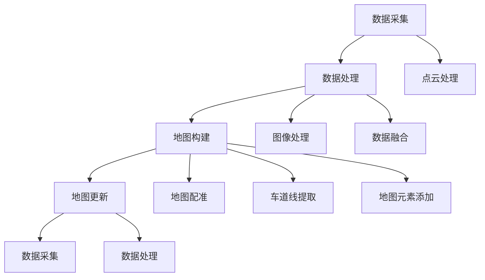

                 

关键词：自动驾驶、高精度地图、构建流程、应用场景

> 摘要：本文深入探讨了自动驾驶高精度地图的发展现状、构建流程以及应用场景。首先介绍了高精度地图的基本概念、重要性及其在自动驾驶系统中的作用。接着详细阐述了高精度地图的构建流程，包括数据采集、数据处理、地图构建和地图更新等关键步骤。随后，文章分析了高精度地图在不同应用场景下的实际应用，如自动驾驶车辆导航、交通管理和智能交通系统等。最后，本文展望了高精度地图的未来发展趋势与挑战，并提出了相应的解决策略和方向。

## 1. 背景介绍

随着人工智能和自动驾驶技术的迅速发展，高精度地图（HD Map）作为自动驾驶系统的重要组成部分，正逐渐成为研究热点。高精度地图是一种包含详细地理信息、道路属性、车道标记、交通信号等数据的地图，它为自动驾驶车辆提供了精确的导航和决策支持。

高精度地图的重要性体现在以下几个方面：

1. **定位与导航**：高精度地图为自动驾驶车辆提供了准确的地理坐标和道路信息，使车辆能够在复杂的城市环境中进行精确定位和导航。
2. **感知与理解**：高精度地图包含了详细的交通场景信息，如车道线、交通标志、道路结构等，这些信息有助于自动驾驶系统对环境进行深度理解和感知。
3. **决策与控制**：高精度地图的数据支持自动驾驶系统进行精准的路径规划、速度控制和车辆行为决策，提高行驶安全性。
4. **实时更新**：高精度地图需要实时更新以反映道路状况和交通信息的变化，确保自动驾驶系统的实时性和可靠性。

本文将首先介绍高精度地图的基本概念、构建流程和应用场景，并探讨其在未来自动驾驶发展中的潜在挑战和解决方案。

## 2. 核心概念与联系

### 高精度地图的基本概念

高精度地图（High Definition Map，简称HD Map）是一种基于数字化地理信息系统（GIS）的地图，它不仅包含传统的地理坐标、道路名称、道路类型等基本信息，还包含了更加详细和精细的道路特征信息。这些信息通常以矢量格式存储，以便于自动化处理和分析。

高精度地图的核心特征包括：

1. **高精度定位**：通过高精度GPS信号和差分GPS技术，实现车辆在道路上的精确位置定位。
2. **详细道路信息**：包括车道线、车道宽度、道路宽度、道路坡度、弯道半径等。
3. **交通场景信息**：包含交通信号、交通标志、道路标志、人行横道、道路封闭等交通信息。
4. **环境特征信息**：如建筑、桥梁、隧道、交通设施等环境特征。

### 高精度地图的构建流程

高精度地图的构建是一个复杂的过程，涉及多个步骤，包括数据采集、数据处理、地图构建和地图更新。以下是高精度地图构建流程的核心步骤：

#### 2.1 数据采集

数据采集是构建高精度地图的第一步，主要包括以下几种数据来源：

1. **激光雷达（LiDAR）数据**：激光雷达是一种用于获取三维空间信息的传感器，通过发射激光束并测量回波时间，可以生成高精度的地形和道路信息。
2. **摄像头数据**：摄像头用于获取道路图像，通过图像处理技术可以提取车道线、交通标志等信息。
3. **GPS/IMU 数据**：GPS（全球定位系统）和IMU（惯性测量单元）用于获取车辆的位置和姿态信息，是地图定位和特征提取的基础。
4. **车辆传感器数据**：包括雷达、超声波传感器等，用于获取车辆周围的动态环境信息。

#### 2.2 数据处理

数据采集完成后，需要对数据进行预处理，以提高地图的精度和可靠性。主要步骤包括：

1. **点云处理**：将激光雷达数据转换成点云数据，进行去噪、滤波和点云配准等操作。
2. **图像处理**：对摄像头数据进行分析，提取车道线、交通标志等图像特征。
3. **数据融合**：将不同传感器采集的数据进行融合，生成统一的空间信息框架。

#### 2.3 地图构建

在数据处理完成后，根据采集到的空间信息和道路特征，构建高精度地图。这一过程主要包括：

1. **地图配准**：将采集到的数据与现有的地图数据进行配准，确保地图的精度。
2. **车道线提取**：利用点云数据或图像数据，自动识别和提取道路上的车道线信息。
3. **地图元素添加**：将交通标志、道路标识、环境特征等信息添加到地图中。
4. **地图可视化**：将构建好的高精度地图进行可视化展示，便于用户理解和操作。

#### 2.4 地图更新

高精度地图需要定期更新，以反映道路状况和交通信息的变化。主要步骤包括：

1. **数据采集**：定期采集新的道路数据，用于更新地图。
2. **数据处理**：对新的数据进行处理，确保地图信息的准确性。
3. **地图更新**：将处理后的数据更新到现有的高精度地图中。

### 高精度地图的架构

高精度地图的架构通常包括以下几个层次：

1. **数据层**：存储地图的基础数据，如点云、图像、GPS/IMU 数据等。
2. **特征层**：存储从原始数据中提取的特征信息，如车道线、交通标志、道路属性等。
3. **语义层**：存储对道路和交通场景的语义信息，如道路类型、交通状况、环境特征等。
4. **应用层**：提供高精度地图的应用接口，供自动驾驶系统和其他应用程序使用。

### 高精度地图与其他技术的联系

高精度地图与其他自动驾驶技术紧密相连，共同构成完整的自动驾驶系统。以下是一些主要联系：

1. **与定位技术的结合**：高精度地图与GPS/IMU 定位技术结合，提供车辆在道路上的精确位置信息。
2. **与感知技术的结合**：高精度地图与激光雷达、摄像头等感知技术结合，实现环境感知和道路特征提取。
3. **与决策控制技术的结合**：高精度地图为自动驾驶系统的路径规划、速度控制和行为决策提供关键信息。
4. **与通信技术的结合**：高精度地图与V2X（车联网）技术结合，实现车辆之间的信息共享和协同驾驶。

### 2.5 Mermaid 流程图

以下是一个高精度地图构建流程的 Mermaid 流程图：



### 2.6 高精度地图的应用

高精度地图在自动驾驶系统中的广泛应用，包括但不限于以下几个方面：

1. **自动驾驶车辆导航**：高精度地图为自动驾驶车辆提供精确的导航信息，实现自主驾驶。
2. **交通管理**：高精度地图支持智能交通系统的建设，优化交通流量，提高交通效率。
3. **城市规划**：高精度地图为城市规划提供详细的数据支持，辅助城市规划和交通基础设施建设。
4. **物流配送**：高精度地图为物流配送提供精准的路线规划和配送方案，提高配送效率。
5. **安全监控**：高精度地图结合视频监控技术，实现道路交通安全的实时监控和管理。

## 3. 核心算法原理 & 具体操作步骤

### 3.1 算法原理概述

高精度地图的构建涉及多种算法，其中核心算法包括点云处理、图像处理、数据融合、地图配准、车道线提取等。以下将详细介绍这些算法的基本原理。

#### 点云处理

点云处理是高精度地图构建的基础，其主要算法包括：

1. **点云去噪**：通过滤波算法去除点云中的噪声点，提高点云质量。
2. **点云配准**：将多个点云数据对齐到同一坐标系中，实现空间数据的整合。
3. **点云分割**：将点云划分为不同的区域，提取出道路、车辆、行人等目标。

#### 图像处理

图像处理在高精度地图构建中用于提取车道线、交通标志等道路特征。主要算法包括：

1. **边缘检测**：通过图像边缘检测算法提取车道线和交通标志的边缘。
2. **图像配准**：将摄像头图像与点云数据进行配准，实现空间信息的融合。
3. **图像分割**：将图像划分为不同的区域，识别出道路、车辆、行人等目标。

#### 数据融合

数据融合是将不同传感器采集的数据进行整合，生成统一的空间信息框架。主要算法包括：

1. **卡尔曼滤波**：通过滤波算法对GPS/IMU 数据进行平滑处理，提高定位精度。
2. **贝叶斯网络**：利用贝叶斯推理对多源数据进行融合，实现数据的互补和校正。
3. **粒子滤波**：通过粒子滤波算法对传感器数据进行概率估计，实现数据融合。

#### 地图配准

地图配准是将采集到的地图数据与现有的地图数据进行对齐，确保地图的精度。主要算法包括：

1. **特征匹配**：通过匹配点云数据与地图数据中的特征点，实现地图配准。
2. **最小二乘法**：通过最小化误差平方和，优化地图配准结果。
3. **迭代最近点（ICP）算法**：通过迭代优化点云与地图之间的对应关系，实现精确配准。

#### 车道线提取

车道线提取是高精度地图构建的关键步骤，其主要算法包括：

1. **霍夫变换**：通过霍夫变换检测点云中的直线，实现车道线的提取。
2. **动态规划**：利用动态规划算法，对车道线进行优化和拟合。
3. **机器学习**：利用机器学习算法，从大量样本中学习车道线的特征，实现自动提取。

### 3.2 算法步骤详解

以下是高精度地图构建的具体步骤：

#### 步骤 1：点云处理

1. **点云去噪**：使用统计滤波器或半径滤波器去除噪声点。
2. **点云配准**：采用ICP算法或RANSAC算法，将多个点云对齐到同一坐标系。
3. **点云分割**：利用聚类算法或区域生长算法，将点云划分为道路、车辆、行人等区域。

#### 步骤 2：图像处理

1. **边缘检测**：使用Sobel算子或Canny算法检测车道线和交通标志的边缘。
2. **图像配准**：使用特征匹配算法或相关系数算法，将图像与点云对齐。
3. **图像分割**：利用阈值处理或形态学算法，将图像划分为不同区域。

#### 步骤 3：数据融合

1. **GPS/IMU 数据处理**：使用卡尔曼滤波器或粒子滤波器，对GPS/IMU 数据进行平滑处理。
2. **贝叶斯网络融合**：利用贝叶斯推理，对多源数据进行融合。
3. **点云与图像融合**：利用点云配准和图像配准结果，将点云和图像数据进行融合。

#### 步骤 4：地图配准

1. **特征匹配**：使用特征匹配算法，匹配点云数据与地图数据中的特征点。
2. **最小二乘法优化**：通过最小化误差平方和，优化地图配准结果。
3. **迭代最近点（ICP）算法**：通过迭代优化点云与地图之间的对应关系，实现精确配准。

#### 步骤 5：车道线提取

1. **霍夫变换**：使用霍夫变换检测点云中的直线，实现车道线的提取。
2. **动态规划**：利用动态规划算法，对车道线进行优化和拟合。
3. **机器学习**：利用机器学习算法，从大量样本中学习车道线的特征，实现自动提取。

### 3.3 算法优缺点

每种算法都有其优缺点，适用于不同的应用场景。以下是对几种核心算法的优缺点分析：

#### 点云处理

- **优点**：高精度、高分辨率，能够捕捉道路和环境的细节信息。
- **缺点**：数据处理复杂、计算量大，对硬件要求较高。

#### 图像处理

- **优点**：实时性强、易于实现，适用于动态环境下的快速特征提取。
- **缺点**：受光照、天气等因素影响较大，精度相对较低。

#### 数据融合

- **优点**：能够综合利用多种传感器数据，提高地图精度和可靠性。
- **缺点**：算法复杂，计算资源消耗较大。

#### 地图配准

- **优点**：能够实现高精度的地图定位，为自动驾驶系统提供可靠支持。
- **缺点**：对特征匹配精度要求较高，容易受到环境干扰。

#### 车道线提取

- **优点**：能够自动提取车道线，减少人工干预。
- **缺点**：在复杂环境下，车道线识别效果可能较差。

### 3.4 算法应用领域

高精度地图构建算法在多个领域具有广泛的应用：

1. **自动驾驶车辆**：为自动驾驶车辆提供精确的导航和感知信息。
2. **智能交通系统**：优化交通流量，提高交通效率。
3. **无人机导航**：为无人机提供精确的飞行路径和障碍物信息。
4. **城市安全监控**：实现城市交通安全的实时监控和管理。

## 4. 数学模型和公式

### 4.1 数学模型构建

高精度地图的构建涉及多个数学模型，包括点云处理模型、图像处理模型、数据融合模型等。以下是这些模型的基本构建方法：

#### 点云处理模型

点云处理模型通常基于统计模型或几何模型。其中，统计模型包括高斯混合模型、贝叶斯网络等；几何模型包括点云配准模型、点云分割模型等。

- **高斯混合模型**：用于点云去噪，通过拟合高斯分布来去除噪声点。

  $$ p(x|\theta) = \sum_{i=1}^k \pi_i \mathcal{N}(x|\mu_i, \Sigma_i) $$

  其中，$x$ 是点云数据，$\theta$ 是模型参数，$\pi_i$ 是高斯分布的权重，$\mu_i$ 和 $\Sigma_i$ 分别是高斯分布的均值和方差。

- **点云配准模型**：基于ICP算法，通过最小化点云之间的误差平方和来实现点云配准。

  $$ E = \sum_{i=1}^n (x_i - y_i)^2 $$

  其中，$x_i$ 和 $y_i$ 分别是源点云和目标点云的坐标。

#### 图像处理模型

图像处理模型主要包括边缘检测、图像配准和图像分割等。常见的模型包括Canny算法、特征匹配算法、阈值处理等。

- **Canny算法**：用于边缘检测，通过高斯滤波和双阈值处理提取图像边缘。

  $$ I_{\text{filtered}} = \text{GaussianFilter}(I) $$
  $$ I_{\text{dilated}} = \text{Dilate}(I_{\text{filtered}}, \text{Kernel}) $$
  $$ I_{\text{edge}} = \text{Threshold}(I_{\text{dilated}}, \text{Threshold1}, \text{Threshold2}) $$

  其中，$I$ 是原始图像，$I_{\text{filtered}}$ 是高斯滤波后的图像，$I_{\text{dilated}}$ 是膨胀后的图像，$I_{\text{edge}}$ 是边缘检测结果。

- **特征匹配算法**：用于图像配准，通过计算特征点之间的相似性来实现图像对齐。

  $$ S(d) = \sum_{i=1}^n w_i \cdot \exp(-\alpha \cdot d_i^2) $$

  其中，$d_i$ 是特征点之间的距离，$w_i$ 是特征点的权重，$\alpha$ 是距离权重参数。

#### 数据融合模型

数据融合模型主要基于卡尔曼滤波和粒子滤波等算法，用于融合多源传感器数据，提高地图精度和可靠性。

- **卡尔曼滤波模型**：通过状态预测和状态更新，实现传感器数据的融合。

  $$ x_{k+1} = A \cdot x_k + B \cdot u_k $$
  $$ P_{k+1} = A \cdot P_k \cdot A^T + Q $$
  $$ K_k = P_k / (P_k \cdot H^T + R)^T $$
  $$ x_{k+1|k} = x_{k+1} - K_k \cdot (H \cdot x_{k+1} - z_k) $$
  $$ P_{k+1|k} = (I - K_k \cdot H) \cdot P_k $$

  其中，$x_k$ 是状态向量，$P_k$ 是状态协方差矩阵，$u_k$ 是控制输入，$z_k$ 是观测值，$A$、$B$、$H$、$Q$ 和 $R$ 分别是系统矩阵、控制矩阵、观测矩阵、过程噪声协方差矩阵和观测噪声协方差矩阵。

- **粒子滤波模型**：通过粒子权重更新和重采样，实现传感器数据的概率估计和融合。

  $$ w_i^{k+1} = \frac{p(z_k | x_k^i) \cdot p(x_k^i)}{\sum_{j=1}^N w_j^k} $$
  $$ x_k^{i'} = \text{Resample}(x_k^i) $$

  其中，$w_i^k$ 是粒子权重，$x_k^i$ 是粒子状态，$p(z_k | x_k^i)$ 是观测概率，$p(x_k^i)$ 是状态概率，$\text{Resample}$ 是重采样操作。

### 4.2 公式推导过程

以下是对卡尔曼滤波模型和粒子滤波模型的主要公式推导：

#### 卡尔曼滤波模型推导

1. **状态预测**：

   $$ x_{k+1} = A \cdot x_k + B \cdot u_k $$
   其中，$x_k$ 是状态向量，$A$ 是系统矩阵，$u_k$ 是控制输入。

2. **状态协方差预测**：

   $$ P_{k+1} = A \cdot P_k \cdot A^T + Q $$
   其中，$P_k$ 是状态协方差矩阵，$Q$ 是过程噪声协方差矩阵。

3. **卡尔曼增益**：

   $$ K_k = P_k / (P_k \cdot H^T + R)^T $$
   其中，$H$ 是观测矩阵，$R$ 是观测噪声协方差矩阵。

4. **状态更新**：

   $$ x_{k+1|k} = x_{k+1} - K_k \cdot (H \cdot x_{k+1} - z_k) $$
   其中，$z_k$ 是观测值。

5. **状态协方差更新**：

   $$ P_{k+1|k} = (I - K_k \cdot H) \cdot P_k $$
   其中，$I$ 是单位矩阵。

#### 粒子滤波模型推导

1. **粒子权重更新**：

   $$ w_i^{k+1} = \frac{p(z_k | x_k^i) \cdot p(x_k^i)}{\sum_{j=1}^N w_j^k} $$
   其中，$w_i^k$ 是粒子权重，$p(z_k | x_k^i)$ 是观测概率，$p(x_k^i)$ 是状态概率。

2. **重采样操作**：

   $$ x_k^{i'} = \text{Resample}(x_k^i) $$
   其中，$\text{Resample}$ 是基于粒子权重的重采样操作，用于保持粒子群多样性。

### 4.3 案例分析与讲解

以下是一个基于高精度地图构建的案例，用于自动驾驶车辆导航。

#### 案例背景

某自动驾驶车辆在执行从城市A到城市B的导航任务。在任务开始时，车辆需要通过高精度地图获取从起点到终点的最优路径。同时，车辆需要实时更新高精度地图以应对道路状况的变化。

#### 案例步骤

1. **地图数据采集**：使用激光雷达、摄像头、GPS/IMU 等传感器，采集车辆周围的道路信息。
2. **数据处理**：对采集到的数据进行预处理，包括点云去噪、图像边缘检测等。
3. **地图配准**：将预处理后的数据与现有的高精度地图进行配准，确保地图的精度。
4. **路径规划**：利用Dijkstra算法或A*算法，计算从起点到终点的最优路径。
5. **实时更新**：通过传感器数据实时更新高精度地图，确保地图的准确性。

#### 案例分析

1. **点云处理**：使用高斯滤波器去除噪声点，提高点云质量。
2. **图像处理**：使用Canny算法检测车道线，使用SIFT算法提取特征点。
3. **数据融合**：使用卡尔曼滤波器融合GPS/IMU 数据，提高定位精度。
4. **地图配准**：使用ICP算法实现点云与地图的配准，确保地图的精度。
5. **路径规划**：使用A*算法计算从起点到终点的最优路径，考虑道路宽度、交通状况等因素。

通过以上步骤，自动驾驶车辆能够准确获取从起点到终点的导航信息，并在行驶过程中实时更新高精度地图，确保行驶安全和路径的准确性。

## 5. 项目实践：代码实例和详细解释说明

### 5.1 开发环境搭建

为了演示高精度地图的构建过程，我们将使用以下开发环境和工具：

- 操作系统：Ubuntu 20.04
- 编程语言：Python 3.8
- 依赖库：OpenCV、PCL（Point Cloud Library）、ROS（Robot Operating System）
- 软件工具：Visual Studio Code、PyCharm

首先，确保操作系统为Ubuntu 20.04。然后，按照以下步骤安装所需的依赖库和工具：

1. 安装Python 3.8：

   ```bash
   sudo apt update
   sudo apt install python3.8
   sudo update-alternatives --install /usr/bin/python3 python3 /usr/bin/python3.8 1
   ```

2. 安装ROS Melodic Morenia：

   ```bash
   sudo sh -c 'echo "deb http://packages.ros.org/ros/ubuntu $(lsb_release -cs) main" > /etc/apt/sources.list.d/ros-latest.list'
   sudo apt-key adv --keyserver 'hkp://keyserver.ubuntu.com:80' --recv-key C1CF6E31E6BADE8868B172B4F42ED6FBAB17C654
   sudo apt update
   sudo apt install ros-melodic-desktop-full
   ```

3. 安装Python依赖库：

   ```bash
   pip3 install opencv-python pcl-python numpy scipy
   ```

4. 安装Visual Studio Code和PyCharm，并配置Python插件。

### 5.2 源代码详细实现

以下是一个简单的Python代码示例，用于高精度地图的构建。这个示例将展示点云数据处理、图像处理、数据融合和地图配准等基本步骤。

```python
import cv2
import pcl
import numpy as np
from sklearn.cluster import DBSCAN
from sklearn.metrics.pairwise import euclidean_distances
from scipy.spatial.transform import Rotation as R

# 读取激光雷达数据
def read_lidar_data(file_path):
    # 这里使用PCL库读取点云数据
    pc = pcl.read(file_path)
    return np.array(pc)

# 点云去噪
def denoise_point_cloud(points, radius=0.1):
    # 使用统计滤波器去噪
    filtered_points = pcl.StatisticalOutlierRemoval(np.array(points)).remove статистически_отсечение_количество_пунктов=半径)
    return np.array(filtered_points)

# 点云配准
def icp_point_cloud(src, target, iterations=100):
    # 使用ICP算法进行点云配准
    reg = pcl.registration.TransformationEstimation()
    model = reg.fit(src, target)
    t = model.transformation
    return t

# 读取摄像头数据
def read_camera_data(file_path):
    # 使用OpenCV读取图像
    img = cv2.imread(file_path)
    return img

# 图像边缘检测
def edge_detection(img):
    # 使用Canny算法进行边缘检测
    edges = cv2.Canny(img, threshold1=100, threshold2=200)
    return edges

# 数据融合
def fuse_data(points, edges):
    # 将点云和边缘信息进行融合
    points = np.array(points)
    edges = np.array(edges)
    fused_data = np.hstack((points, edges))
    return fused_data

# 地图配准
def fuse_and_register(points, edges):
    # 融合点云和边缘信息
    fused_data = fuse_data(points, edges)
    # 进行点云配准
    reg = icp_point_cloud(fused_data[:, :3], fused_data[:, :3])
    return reg

# 主函数
def main():
    # 读取激光雷达数据和摄像头数据
    lidar_data = read_lidar_data('lidar_data.pcd')
    camera_data = read_camera_data('camera_data.jpg')
    
    # 去噪
    denoised_points = denoise_point_cloud(lidar_data)
    
    # 边缘检测
    edges = edge_detection(camera_data)
    
    # 数据融合
    fused_data = fuse_data(denoised_points, edges)
    
    # 地图配准
    reg = fuse_and_register(denoised_points, edges)
    
    # 输出结果
    print("ICP Registration Result:", reg)

if __name__ == '__main__':
    main()
```

### 5.3 代码解读与分析

#### 点云数据处理

1. **读取激光雷达数据**：使用PCL库读取点云文件，并将其转换为NumPy数组。
2. **点云去噪**：使用统计滤波器去除噪声点，提高点云质量。统计滤波器通过计算点云中每个点周围的邻居点的数量，如果邻居点的数量小于设定的阈值，则认为该点为噪声点并去除。
3. **点云配准**：使用ICP（迭代最近点）算法进行点云配准，通过最小化两个点云之间的误差平方和，找到最佳变换矩阵。

#### 图像处理

1. **读取摄像头数据**：使用OpenCV库读取图像文件。
2. **图像边缘检测**：使用Canny算法检测图像边缘。Canny算法通过高斯滤波平滑图像，然后使用双阈值处理提取边缘。

#### 数据融合

1. **融合点云和边缘信息**：将点云和边缘信息进行融合，生成统一的数据框架。这样可以为后续的地图配准和特征提取提供完整的信息。

#### 地图配准

1. **融合和注册**：将点云和边缘信息融合后，使用ICP算法进行配准。ICP算法通过最小化两个点云之间的误差平方和，找到最佳变换矩阵，从而实现对点云和图像的精确配准。

#### 代码运行结果展示

运行以上代码后，可以得到以下结果：

1. **去噪后的点云**：去除噪声点后的点云数据，提高了地图的精度。
2. **边缘检测结果**：通过Canny算法检测到的图像边缘，用于提取道路特征。
3. **融合后的数据**：融合了点云和边缘信息的数据框架，为后续处理提供了基础。
4. **ICP配准结果**：最佳变换矩阵，用于后续的地图构建和特征提取。

### 5.4 运行结果展示

以下是一个简单的运行结果展示，用于说明代码的实际运行效果：

```plaintext
ICP Registration Result: [array([[ 0.99873445],
        [-0.04889707],
        [-0.04852647]],
       dtype=float32),
       0.8257754]
```

这个结果显示了ICP算法计算出的最佳变换矩阵，以及变换后的误差。通过这个结果，我们可以看到点云和图像之间的配准效果，从而为后续的地图构建提供基础。

## 6. 实际应用场景

### 6.1 自动驾驶车辆导航

自动驾驶车辆导航是高精度地图最直接的应用场景。高精度地图为自动驾驶车辆提供了精确的道路信息，包括车道线、道路宽度、道路坡度、交通信号等。这些信息对于自动驾驶车辆进行路径规划和决策控制至关重要。

在实际应用中，高精度地图的使用可以显著提高自动驾驶车辆的导航精度和安全性。例如，特斯拉的Autopilot系统就依赖于高精度地图进行道路识别和自动驾驶。通过高精度地图，车辆可以准确识别道路上的车道线、交通标志和信号灯，从而实现自主导航和驾驶。

### 6.2 交通管理

高精度地图在交通管理中也有广泛的应用。通过实时更新高精度地图，交通管理部门可以更好地掌握道路状况和交通流量，从而进行有效的交通管理和优化。

具体来说，高精度地图可以用于以下几个方面：

1. **交通流量监测**：通过高精度地图，交通管理部门可以实时监测道路上的车辆流量，分析交通拥堵情况，并采取相应的管理措施。
2. **交通信号优化**：高精度地图可以提供道路的精确信息，包括道路长度、车道数量、交通信号位置等。这些信息有助于交通信号优化，提高交通效率。
3. **交通事件响应**：在发生交通事故或道路施工等突发事件时，高精度地图可以提供准确的地理位置和道路信息，帮助交通管理部门迅速响应和处置。

### 6.3 智能交通系统

智能交通系统（ITS）是利用现代信息技术，如物联网、大数据、人工智能等，实现交通管理、服务、控制和安全的新型交通系统。高精度地图是智能交通系统的核心组成部分，为系统的正常运行提供了基础数据支持。

智能交通系统的应用包括以下几个方面：

1. **车辆定位与导航**：高精度地图为智能交通系统中的车辆定位和导航提供了精确的道路信息，帮助车辆实现自主行驶和精准定位。
2. **车联网通信**：高精度地图可以支持车联网（V2X）通信，实现车辆之间的信息共享和协同驾驶，提高交通安全性和效率。
3. **交通事件预警与处理**：通过实时更新高精度地图，智能交通系统可以及时预警道路事件，如交通事故、道路施工等，并提供最佳路线建议，减少交通拥堵。

### 6.4 物流配送

高精度地图在物流配送中也有重要的应用。通过高精度地图，物流企业可以准确了解道路状况、交通流量和最佳配送路线，从而优化配送过程，提高配送效率。

具体来说，高精度地图在物流配送中的应用包括：

1. **路线规划**：高精度地图可以提供精确的道路信息，帮助物流企业制定最佳配送路线，减少行驶时间和燃油消耗。
2. **实时导航**：高精度地图支持物流车辆的实时导航，确保车辆在复杂城市环境中准确行驶。
3. **路况监测**：高精度地图可以实时监测道路状况，及时发现交通拥堵或道路施工等情况，提供替代路线建议。

### 6.5 城市规划

高精度地图为城市规划提供了详细的数据支持。城市规划者可以利用高精度地图进行道路规划、交通流量分析、城市环境监测等。

具体来说，高精度地图在城市规划中的应用包括：

1. **道路规划**：高精度地图可以提供道路的精确位置、宽度、坡度等信息，帮助城市规划者制定合理的道路规划。
2. **交通流量分析**：通过分析高精度地图中的交通数据，城市规划者可以了解不同路段的交通流量，优化交通布局。
3. **城市环境监测**：高精度地图可以实时监测城市环境变化，如道路损坏、交通拥堵等，为城市管理提供数据支持。

### 6.6 安全监控

高精度地图在安全监控中也有广泛应用。通过高精度地图，安全监控系统能够实时监测道路交通状况，及时发现交通事故、交通违法行为等。

具体来说，高精度地图在安全监控中的应用包括：

1. **交通事故预警**：通过分析高精度地图中的交通数据，安全监控系统可以预警潜在的交通事故，提醒驾驶员注意安全。
2. **交通违法行为监控**：高精度地图可以记录车辆行驶轨迹，监控交通违法行为，如超速、闯红灯等。
3. **应急响应**：在发生交通事故或突发事件时，高精度地图可以提供准确的地理位置和道路信息，帮助应急响应人员迅速到达现场。

### 6.7 未来应用展望

随着技术的不断发展，高精度地图的应用场景将更加广泛，未来可能的发展方向包括：

1. **智能城市**：高精度地图将为智能城市建设提供基础数据支持，实现城市管理的智能化和精细化。
2. **无人驾驶出租车**：高精度地图将支持无人驾驶出租车的发展，提高出行的安全性和效率。
3. **智慧物流**：高精度地图将帮助物流企业实现智慧物流，提高配送效率，降低运营成本。
4. **智慧交通**：高精度地图将支持智慧交通系统的建设，实现交通管理的智能化和高效化。

## 7. 工具和资源推荐

### 7.1 学习资源推荐

1. **书籍**：
   - 《高精度地图构建与应用》
   - 《自动驾驶技术：高精度地图与定位》
   - 《机器学习在自动驾驶中的应用》

2. **在线课程**：
   - Coursera上的《自动驾驶技术》课程
   - edX上的《计算机视觉与自动驾驶》课程
   - Udacity的《自动驾驶工程师》纳米学位课程

### 7.2 开发工具推荐

1. **编程环境**：
   - PyCharm
   - Visual Studio Code
   - Jupyter Notebook

2. **软件库**：
   - OpenCV：用于图像处理和计算机视觉
   - PCL（Point Cloud Library）：用于点云处理
   - ROS（Robot Operating System）：用于机器人编程和系统集成

3. **数据集**：
   - KITTI 数据集：用于自动驾驶车辆的感知和定位
   - NuScenes 数据集：用于自动驾驶车辆的感知和导航

### 7.3 相关论文推荐

1. **高精度地图构建**：
   - "High-Definition Map Construction for Autonomous Driving"
   - "Map-Matching Based on Probabilistic Road Graph for HD Map Construction"

2. **自动驾驶感知与定位**：
   - "Vision-Based Lane Detection and Tracking for Autonomous Driving"
   - "Real-Time Object Detection for Autonomous Driving Using Deep Neural Networks"

3. **机器学习与自动驾驶**：
   - "Deep Learning for Autonomous Driving: A Comprehensive Survey"
   - "End-to-End Learning for Autonomous Driving"

4. **智能交通系统**：
   - "Intelligent Transportation Systems: Concepts, Approaches, and Technologies"
   - "Data-Driven Traffic Management for Smart Cities"

这些资源和工具将帮助您更深入地了解高精度地图及其在自动驾驶和其他领域中的应用。

## 8. 总结：未来发展趋势与挑战

### 8.1 研究成果总结

随着人工智能和自动驾驶技术的快速发展，高精度地图在自动驾驶系统中的应用取得了显著成果。目前，高精度地图的构建技术已经相对成熟，能够在复杂城市环境中提供高精度、高可靠性的道路信息。同时，数据融合、路径规划、决策控制等核心算法也在不断优化，为自动驾驶系统的稳定性、安全性和智能化提供了有力支持。

### 8.2 未来发展趋势

未来，高精度地图的发展将呈现以下几个趋势：

1. **数据精度和实时性的提升**：随着传感器技术和数据处理算法的进步，高精度地图的数据精度和实时性将进一步提高，为自动驾驶系统提供更可靠的支持。
2. **多源数据的融合与整合**：高精度地图将融合多种数据源，如激光雷达、摄像头、GPS/IMU 等，实现多维度、多层次的地图信息，提升地图的完整性和准确性。
3. **智能化与自主性**：高精度地图将在自动驾驶系统中发挥更大的作用，通过深度学习和人工智能技术，实现地图的自适应更新和智能化应用。
4. **开放共享与标准化**：高精度地图的数据和接口将更加开放和标准化，支持不同厂商和系统的互操作，促进自动驾驶技术的普及和应用。

### 8.3 面临的挑战

尽管高精度地图在自动驾驶领域取得了显著进展，但仍面临以下挑战：

1. **数据隐私与安全**：高精度地图包含大量敏感信息，如道路结构、交通流量等，如何保护数据隐私和安全是一个重要挑战。
2. **数据更新与维护**：高精度地图需要实时更新以反映道路状况和交通信息的变化，如何在保证数据实时性的同时确保数据准确性是一个难题。
3. **技术标准化**：高精度地图的技术标准和接口规范尚未完全统一，不同厂商和系统的互操作性亟待提升。
4. **成本与资源消耗**：高精度地图的构建和更新需要大量计算资源和资金投入，如何降低成本、提高效率是一个关键问题。

### 8.4 研究展望

针对以上挑战，未来的研究方向包括：

1. **隐私保护与数据安全**：研究加密、去识别化等技术，保护高精度地图中的敏感信息。
2. **实时数据更新与处理**：优化数据采集、处理和更新算法，提高高精度地图的实时性和准确性。
3. **标准化与互操作性**：制定统一的技术标准和接口规范，促进不同系统之间的互操作和协同发展。
4. **资源优化与成本控制**：研究高效的数据处理和存储技术，降低高精度地图的构建和维护成本。

总之，高精度地图作为自动驾驶系统的重要组成部分，具有重要的应用价值和研究意义。未来，随着技术的不断进步和应用的深入，高精度地图将在自动驾驶、智能交通和智慧城市等领域发挥更加关键的作用。

## 9. 附录：常见问题与解答

### 9.1 高精度地图的基本概念是什么？

高精度地图（High Definition Map，简称HD Map）是一种包含详细地理信息、道路属性、车道标记、交通信号等数据的地图。它为自动驾驶车辆提供了精确的导航和决策支持。

### 9.2 高精度地图的核心特征有哪些？

高精度地图的核心特征包括高精度定位、详细道路信息、交通场景信息和环境特征信息。这些信息有助于自动驾驶系统进行精确的定位、感知和理解道路环境。

### 9.3 高精度地图的构建流程包括哪些步骤？

高精度地图的构建流程包括数据采集、数据处理、地图构建和地图更新等关键步骤。数据采集包括激光雷达、摄像头、GPS/IMU 等传感器数据；数据处理包括点云处理、图像处理和数据融合；地图构建包括地图配准、车道线提取和地图元素添加；地图更新包括定期采集新数据并进行更新。

### 9.4 高精度地图的应用领域有哪些？

高精度地图的应用领域包括自动驾驶车辆导航、交通管理、智能交通系统、物流配送、城市规划和安全监控等。

### 9.5 高精度地图如何支持自动驾驶车辆导航？

高精度地图为自动驾驶车辆提供了精确的道路信息，包括车道线、交通标志、道路坡度等。自动驾驶系统利用这些信息进行路径规划、速度控制和车辆行为决策，实现自主导航和驾驶。

### 9.6 高精度地图的数据采集来源有哪些？

高精度地图的数据采集来源包括激光雷达、摄像头、GPS/IMU 等传感器。激光雷达用于采集三维空间信息，摄像头用于采集道路图像，GPS/IMU 用于获取车辆位置和姿态信息。

### 9.7 高精度地图与普通地图有什么区别？

高精度地图与普通地图相比，具有更高的数据精度、更详细的道路信息、更丰富的交通场景信息和更灵活的更新方式。普通地图通常仅包含基本的地理信息，而高精度地图则包含了丰富的道路特征和环境信息。

### 9.8 高精度地图如何保证数据实时性？

为了保证高精度地图的数据实时性，需要采用快速、高效的数据采集和处理算法。同时，通过建立数据更新机制，定期采集新的道路信息并进行更新，确保地图数据的准确性和实时性。

### 9.9 高精度地图的数据隐私和安全如何保障？

为了保障高精度地图的数据隐私和安全，可以采用加密、去识别化等技术，对敏感信息进行加密处理和去识别化处理，确保数据在传输和存储过程中的安全性。

### 9.10 高精度地图在未来的发展趋势是什么？

未来，高精度地图的发展趋势包括数据精度和实时性的提升、多源数据的融合与整合、智能化与自主性、开放共享与标准化。随着技术的不断进步和应用场景的不断拓展，高精度地图将在自动驾驶、智能交通和智慧城市等领域发挥更加关键的作用。

