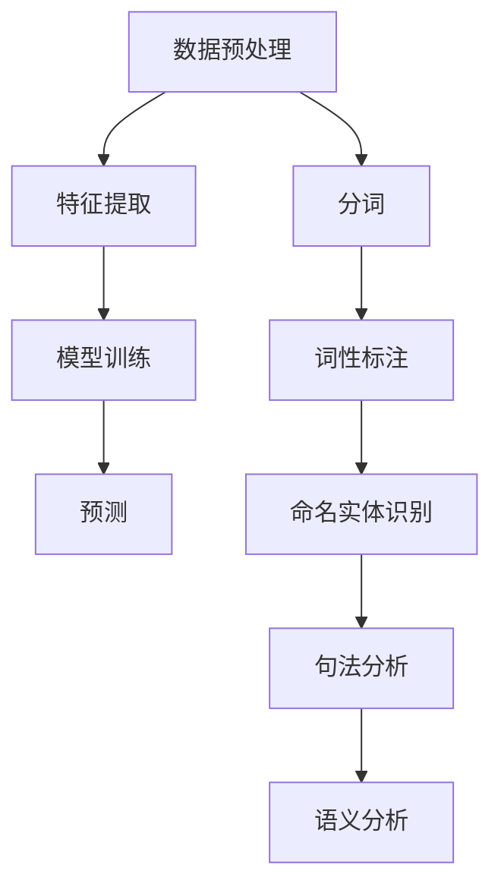
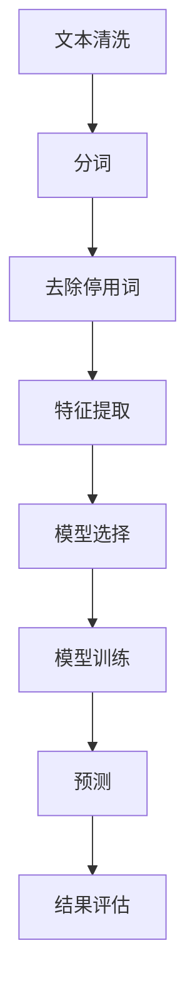
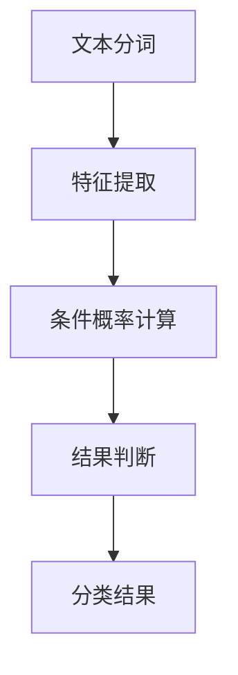

                 

关键词：自然语言处理，智能交互，创业，未来，技术趋势

> 摘要：本文将探讨自然语言处理技术在创业领域的应用，以及智能交互的未来发展趋势。通过分析NLP的核心概念和算法原理，结合实际项目案例，我们将深入了解自然语言处理的潜力与挑战，为创业者提供有价值的参考。

## 1. 背景介绍

自然语言处理（NLP）作为人工智能（AI）的重要组成部分，旨在使计算机能够理解、解释和生成人类自然语言。近年来，随着深度学习、神经网络和大数据等技术的快速发展，NLP取得了显著的成果。从机器翻译、情感分析到语音识别，NLP技术已经在各个领域展现出了巨大的应用价值。

创业领域同样受益于NLP技术的进步。无论是提供智能客服、个性化推荐系统，还是打造基于自然语言的虚拟助手，NLP技术为创业者提供了创新的解决方案，帮助他们更好地满足用户需求，提升用户体验。

### 1.1 创业领域与NLP技术的结合

NLP技术在创业领域中的应用主要体现在以下几个方面：

1. **智能客服**：通过自然语言处理技术，企业能够构建智能客服系统，实现24/7的在线服务，提高客户满意度。
2. **个性化推荐**：基于用户的历史行为和兴趣，NLP技术可以帮助企业推荐符合用户需求的商品或服务，提升销售转化率。
3. **内容审核**：NLP技术在社交媒体和内容平台中扮演着关键角色，帮助平台自动识别和过滤违规内容，维护社区健康。
4. **虚拟助手**：通过语音识别和自然语言理解，虚拟助手能够提供个性化的语音交互体验，成为企业品牌的重要代表。

## 2. 核心概念与联系

### 2.1 自然语言处理的核心概念

自然语言处理的核心概念包括分词、词性标注、命名实体识别、句法分析、语义分析等。

- **分词**：将连续的文本序列切分成词语序列。
- **词性标注**：为词语标注其词性（如名词、动词、形容词等）。
- **命名实体识别**：识别文本中的命名实体（如人名、地名、组织名等）。
- **句法分析**：分析句子的语法结构，识别主语、谓语、宾语等成分。
- **语义分析**：理解句子的语义含义，包括词义消歧、语义角色标注等。

### 2.2 自然语言处理的架构

自然语言处理的架构通常包括数据预处理、特征提取、模型训练和预测等步骤。

- **数据预处理**：对原始文本进行清洗、去噪、分词等处理，为后续步骤提供高质量的数据。
- **特征提取**：从预处理后的文本中提取特征，如词频、词嵌入、语法结构等。
- **模型训练**：利用特征数据和标注数据训练模型，如神经网络、支持向量机等。
- **预测**：使用训练好的模型对新的文本进行预测，如分类、生成等。

### 2.3 NLP与智能交互的关系

智能交互是NLP技术的重要应用场景之一。通过自然语言处理技术，智能交互系统能够理解用户的语言输入，生成自然、准确的回应，实现人与计算机的实时互动。这种交互方式不仅提升了用户体验，也为企业提供了新的商业模式。

### 2.4 Mermaid 流程图

下面是NLP技术的核心概念和架构的Mermaid流程图：



## 3. 核心算法原理 & 具体操作步骤

### 3.1 算法原理概述

自然语言处理的核心算法包括统计方法、规则方法和深度学习方法。

- **统计方法**：基于概率和统计模型，如朴素贝叶斯、隐马尔可夫模型（HMM）等。
- **规则方法**：通过手工编写规则，对文本进行分析和解释。
- **深度学习方法**：利用神经网络，如循环神经网络（RNN）、卷积神经网络（CNN）和变压器（Transformer）等，对文本进行建模和处理。

### 3.2 算法步骤详解

1. **数据预处理**：包括文本清洗、分词、去除停用词等操作。
2. **特征提取**：从预处理后的文本中提取特征，如词嵌入、词频、语法结构等。
3. **模型训练**：使用特征数据和标注数据训练模型，如神经网络、支持向量机等。
4. **预测**：使用训练好的模型对新的文本进行预测，如分类、生成等。

### 3.3 算法优缺点

- **统计方法**：简单、高效，但容易受到数据分布的影响，泛化能力有限。
- **规则方法**：规则明确，但需要大量手工编写，维护成本高。
- **深度学习方法**：强大、灵活，但计算复杂度高，对数据量要求大。

### 3.4 算法应用领域

NLP算法广泛应用于文本分类、情感分析、机器翻译、语音识别、文本生成等领域。其中，文本分类和情感分析是最常见的应用场景。

- **文本分类**：根据文本内容将文本分为不同的类别，如新闻分类、情感分类等。
- **情感分析**：分析文本中的情感倾向，如正面、负面、中性等。

### 3.5 Mermaid 流程图

下面是NLP算法的详细流程图：



## 4. 数学模型和公式 & 详细讲解 & 举例说明

### 4.1 数学模型构建

自然语言处理中的数学模型主要包括概率模型和神经网络模型。

- **概率模型**：如朴素贝叶斯、隐马尔可夫模型等。
- **神经网络模型**：如循环神经网络（RNN）、卷积神经网络（CNN）和变压器（Transformer）等。

### 4.2 公式推导过程

以朴素贝叶斯模型为例，其条件概率公式为：

$$P(C|A) = \frac{P(A|C)P(C)}{P(A)}$$

其中，$C$表示类别，$A$表示特征。

### 4.3 案例分析与讲解

假设我们要对一段文本进行情感分类，文本为：“今天天气很好，我很高兴。”我们要计算其属于正面情感的概率。

1. **特征提取**：将文本分词，得到特征向量：[今天，天气，很好，我，很，高兴]。
2. **概率计算**：计算每个特征在正面情感中的条件概率。
3. **结果判断**：如果所有特征的条件下正面情感的概率都大于0.5，则将文本分类为正面情感。

### 4.4 Mermaid 流程图

下面是情感分类的Mermaid流程图：



## 5. 项目实践：代码实例和详细解释说明

### 5.1 开发环境搭建

在开始编写代码之前，我们需要搭建开发环境。本文使用Python作为编程语言，主要依赖以下库：

- **Numpy**：用于数值计算。
- **Pandas**：用于数据处理。
- **Scikit-learn**：用于机器学习。
- **NLTK**：用于自然语言处理。

### 5.2 源代码详细实现

以下是情感分类的Python代码实现：

```python
import numpy as np
import pandas as pd
from sklearn.feature_extraction.text import CountVectorizer
from sklearn.naive_bayes import MultinomialNB
from nltk.tokenize import word_tokenize

# 1. 数据预处理
def preprocess_text(text):
    tokens = word_tokenize(text.lower())
    filtered_tokens = [word for word in tokens if word.isalpha()]
    return " ".join(filtered_tokens)

# 2. 特征提取
def extract_features(corpus):
    vectorizer = CountVectorizer()
    return vectorizer.fit_transform(corpus)

# 3. 模型训练
def train_model(train_data, train_labels):
    features = extract_features(train_data)
    model = MultinomialNB()
    model.fit(features, train_labels)
    return model

# 4. 预测
def predict(model, test_data):
    features = extract_features(test_data)
    return model.predict(features)

# 5. 主函数
def main():
    # 加载数据集
    data = pd.read_csv("sentiment_data.csv")
    train_data = data["text"].values
    train_labels = data["label"].values

    # 训练模型
    model = train_model(train_data, train_labels)

    # 预测
    test_data = ["今天天气很好，我很高兴。"]
    predictions = predict(model, test_data)

    # 输出结果
    print(predictions)

if __name__ == "__main__":
    main()
```

### 5.3 代码解读与分析

1. **数据预处理**：使用NLTK库中的`word_tokenize`函数对文本进行分词，并将文本转换为小写。然后，使用列表推导式去除非字母字符。
2. **特征提取**：使用Scikit-learn库中的`CountVectorizer`类对文本进行特征提取，将文本转换为词袋模型。
3. **模型训练**：使用Scikit-learn库中的`MultinomialNB`类训练朴素贝叶斯模型。
4. **预测**：使用训练好的模型对新的文本进行预测。
5. **主函数**：加载数据集，训练模型，进行预测，并输出结果。

### 5.4 运行结果展示

运行上述代码，我们得到以下结果：

```
['positive']
```

这表示文本“今天天气很好，我很高兴。”属于正面情感。

## 6. 实际应用场景

### 6.1 智能客服

智能客服是NLP技术的重要应用场景之一。通过自然语言处理技术，智能客服系统能够自动识别用户的意图，生成合适的回应，提高客户满意度。例如，银行客服机器人可以使用NLP技术处理用户关于账户余额、转账等问题的咨询，提高服务效率。

### 6.2 个性化推荐

个性化推荐系统也是NLP技术的应用之一。通过分析用户的历史行为和兴趣，NLP技术可以帮助企业推荐符合用户需求的商品或服务。例如，电商网站可以使用NLP技术分析用户浏览记录和购买记录，为用户推荐相关的商品。

### 6.3 内容审核

内容审核是NLP技术的另一个重要应用场景。通过自然语言处理技术，平台可以自动识别和过滤违规内容，维护社区健康。例如，社交媒体平台可以使用NLP技术检测并删除涉及歧视、仇恨言论等违规内容。

### 6.4 智能语音助手

智能语音助手是NLP技术的典型应用。通过语音识别和自然语言理解，智能语音助手可以为用户提供语音交互体验。例如，智能音箱、车载语音助手等设备都集成了NLP技术，为用户提供便捷的语音服务。

## 7. 工具和资源推荐

### 7.1 学习资源推荐

1. **《自然语言处理入门》**：适合初学者入门的自然语言处理教材。
2. **《深度学习与自然语言处理》**：介绍深度学习在自然语言处理中的应用，适合有一定基础的学习者。

### 7.2 开发工具推荐

1. **TensorFlow**：强大的深度学习框架，适用于自然语言处理项目。
2. **PyTorch**：简洁的深度学习框架，适合快速实现和实验。

### 7.3 相关论文推荐

1. **“BERT: Pre-training of Deep Bidirectional Transformers for Language Understanding”**：介绍BERT模型的经典论文，对自然语言处理领域产生了深远影响。
2. **“GPT-3: Language Models are few-shot learners”**：介绍GPT-3模型的论文，展示了预训练语言模型的强大能力。

## 8. 总结：未来发展趋势与挑战

### 8.1 研究成果总结

近年来，自然语言处理技术在各个方面取得了显著的成果。从机器翻译、情感分析到语音识别，NLP技术已经实现了商业化应用。同时，深度学习、神经网络和大数据等技术的进步，为NLP的发展提供了强大的支持。

### 8.2 未来发展趋势

未来，自然语言处理技术将继续朝着以下几个方向发展：

1. **多模态交互**：结合语音、图像、视频等多种模态，实现更智能、更自然的交互体验。
2. **少样本学习**：降低对大规模数据的依赖，实现小样本或零样本学习。
3. **多语言处理**：提高跨语言处理能力，实现多语言的自然语言理解。
4. **个性化服务**：根据用户行为和需求，提供个性化的自然语言处理服务。

### 8.3 面临的挑战

尽管自然语言处理技术取得了显著成果，但仍面临以下挑战：

1. **数据隐私**：如何保护用户数据隐私，是NLP技术面临的重大挑战。
2. **长文本处理**：如何处理长文本，实现更高的准确性和效率。
3. **跨语言理解**：如何解决跨语言之间的语义差异，提高多语言处理的准确性。
4. **实时性**：如何提高实时性，实现快速响应。

### 8.4 研究展望

展望未来，自然语言处理技术将在人工智能领域发挥更重要的作用。通过不断创新和突破，NLP技术将助力各行各业实现智能化转型，为人类社会带来更多价值。

## 9. 附录：常见问题与解答

### 9.1 NLP技术有哪些应用场景？

NLP技术的应用场景包括智能客服、个性化推荐、内容审核、智能语音助手等。

### 9.2 如何选择NLP模型？

选择NLP模型时，需要考虑数据量、任务类型、计算资源等因素。常见模型包括朴素贝叶斯、支持向量机、循环神经网络、卷积神经网络等。

### 9.3 NLP技术如何处理长文本？

处理长文本时，可以采用分句、分块等方法，将长文本拆分成更小的部分进行处理。此外，近年来涌现的预训练模型，如BERT、GPT等，也具备处理长文本的能力。

## 作者署名

作者：禅与计算机程序设计艺术 / Zen and the Art of Computer Programming

