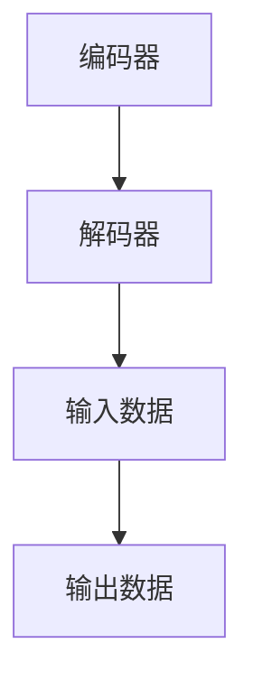
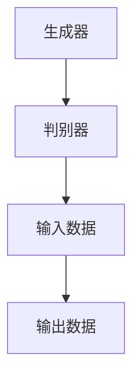
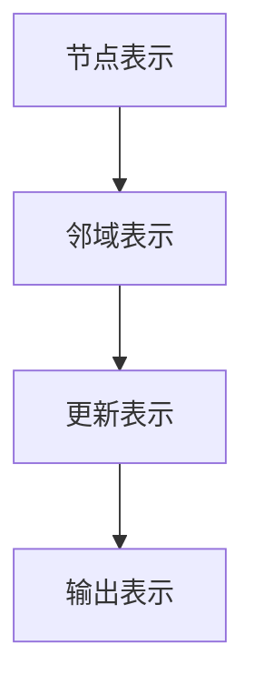

                 

 自监督学习作为深度学习的一个重要分支，已经在众多领域展现了其强大的潜力。本文旨在深入探讨自监督学习的原理，并通过代码实例详细讲解其实现方法。希望通过这篇文章，读者能够全面了解自监督学习，并掌握其实际应用。

## 关键词

- 自监督学习
- 深度学习
- 无监督学习
- 自编码器
- 生成对抗网络
- 图神经网络

## 摘要

本文首先介绍了自监督学习的背景和基本概念，接着分析了自监督学习的核心算法原理，包括自编码器和生成对抗网络。然后，通过具体的数学模型和公式，详细讲解了这些算法的实现步骤。最后，通过实际项目实践，展示了自监督学习在图像分类、文本生成等领域的应用，并对其未来发展趋势和挑战进行了探讨。

## 1. 背景介绍

自监督学习是一种无监督学习的方法，与传统的监督学习不同，它不需要大量标记的数据进行训练。自监督学习通过利用数据的内部结构，自动学习有用的特征表示，从而提高模型的性能。自监督学习的出现，主要是为了解决监督学习数据标注困难和计算资源消耗大的问题。

近年来，随着深度学习技术的发展，自监督学习得到了广泛关注。尤其是在计算机视觉和自然语言处理领域，自监督学习已经成为一种重要的技术手段。自监督学习不仅能够提高模型的泛化能力，还能够节省大量的标注成本，提高模型训练的效率。

## 2. 核心概念与联系

### 2.1 自监督学习的核心概念

自监督学习主要包括以下几种核心概念：

- **自编码器（Autoencoder）**：自编码器是一种神经网络，它由两个主要部分组成：编码器和解码器。编码器负责将输入数据压缩成一个低维表示，解码器则负责将这个低维表示还原回原始数据。自编码器通过最小化重构误差来学习有效的数据表示。

- **生成对抗网络（Generative Adversarial Networks，GAN）**：生成对抗网络由生成器和判别器两个部分组成。生成器负责生成数据，判别器则负责判断生成数据是否真实。生成器和判别器相互对抗，生成器试图生成更真实的数据，而判别器则试图区分真实数据和生成数据。

- **图神经网络（Graph Neural Networks，GNN）**：图神经网络是一种在图结构上学习的神经网络。它通过节点的邻域信息来更新节点表示，从而学习有效的图表示。

### 2.2 自监督学习的核心算法原理和架构

#### 2.2.1 自编码器

自编码器的架构如下：



自编码器的工作流程如下：

1. 编码器将输入数据压缩成一个低维表示（编码）。
2. 解码器将这个低维表示还原回原始数据（解码）。
3. 通过最小化重构误差来优化模型参数。

#### 2.2.2 生成对抗网络

生成对抗网络的架构如下：



生成对抗网络的工作流程如下：

1. 生成器生成伪造的数据。
2. 判别器判断生成数据是否真实。
3. 通过优化生成器和判别器的参数，使生成数据越来越真实。

#### 2.2.3 图神经网络

图神经网络的架构如下：



图神经网络的工作流程如下：

1. 初始化节点的表示。
2. 对于每个节点，计算其邻域的表示。
3. 根据节点和邻域的表示，更新节点的表示。
4. 重复这个过程，直到收敛。

## 3. 核心算法原理 & 具体操作步骤

### 3.1 算法原理概述

#### 3.1.1 自编码器

自编码器的原理是通过编码器和解码器两个部分，将输入数据压缩和解压缩，从而学习有效的数据表示。具体来说，编码器将输入数据映射到一个低维空间，这个低维空间表示了输入数据的主要特征。解码器则尝试将这个低维表示还原回原始数据。

#### 3.1.2 生成对抗网络

生成对抗网络的原理是通过生成器和判别器的对抗训练，生成出真实数据。生成器试图生成尽可能真实的数据，而判别器则试图区分真实数据和生成数据。通过不断优化生成器和判别器的参数，最终生成器能够生成出接近真实数据的数据。

#### 3.1.3 图神经网络

图神经网络的原理是通过节点的邻域信息来更新节点的表示。具体来说，对于每个节点，首先计算其邻域节点的表示，然后根据节点和邻域节点的表示，更新节点的表示。通过这种方式，图神经网络能够学习出有效的图表示。

### 3.2 算法步骤详解

#### 3.2.1 自编码器

1. 初始化编码器和解码器的参数。
2. 对于每个输入数据，通过编码器得到其低维表示。
3. 通过解码器将低维表示还原回原始数据。
4. 计算重构误差，并使用反向传播算法优化编码器和解码器的参数。

#### 3.2.2 生成对抗网络

1. 初始化生成器和判别器的参数。
2. 对于每个输入数据，生成器生成伪造的数据。
3. 判别器判断生成数据和真实数据。
4. 计算生成器和判别器的损失函数，并使用反向传播算法优化生成器和判别器的参数。

#### 3.2.3 图神经网络

1. 初始化节点的表示。
2. 对于每个节点，计算其邻域节点的表示。
3. 根据节点和邻域节点的表示，更新节点的表示。
4. 重复这个过程，直到收敛。

### 3.3 算法优缺点

#### 3.3.1 自编码器

- **优点**：自编码器能够学习到有效的数据表示，从而提高模型的泛化能力。自编码器不需要大量标记的数据，因此可以节省数据标注成本。
- **缺点**：自编码器的训练过程较为复杂，需要大量的计算资源。自编码器生成的数据质量受限于编码器的容量，当输入数据发生变化时，解码器可能无法准确重构原始数据。

#### 3.3.2 生成对抗网络

- **优点**：生成对抗网络能够生成高质量的数据，生成数据与真实数据相似度较高。生成对抗网络不需要大量标记的数据，因此可以节省数据标注成本。
- **缺点**：生成对抗网络的训练过程不稳定，容易出现模式崩溃等问题。生成对抗网络的生成数据质量受限于判别器的容量，当输入数据发生变化时，生成数据的质量可能会下降。

#### 3.3.3 图神经网络

- **优点**：图神经网络能够利用图结构的信息，学习到更有效的节点表示。图神经网络能够处理复杂的图结构数据，如社交网络、知识图谱等。
- **缺点**：图神经网络的训练过程较为复杂，需要大量的计算资源。图神经网络在处理大规模图数据时，可能存在计算效率低下的问题。

### 3.4 算法应用领域

自监督学习在多个领域都有广泛的应用，主要包括：

- **计算机视觉**：自监督学习在图像分类、目标检测、图像生成等领域都有重要的应用。自监督学习能够自动学习图像特征，从而提高模型的性能。
- **自然语言处理**：自监督学习在文本分类、情感分析、机器翻译等领域都有重要的应用。自监督学习能够自动学习文本特征，从而提高模型的性能。
- **知识图谱**：自监督学习在知识图谱的构建和推理中也有重要的应用。自监督学习能够自动学习节点和边的关系，从而提高知识图谱的表示能力。

## 4. 数学模型和公式 & 详细讲解 & 举例说明

### 4.1 数学模型构建

#### 4.1.1 自编码器

自编码器的数学模型可以表示为：

$$
\text{编码器：} x \rightarrow z = \sigma(W_1 \cdot x + b_1)
$$

$$
\text{解码器：} z \rightarrow x' = \sigma(W_2 \cdot z + b_2)
$$

其中，$x$ 表示输入数据，$z$ 表示编码后的低维表示，$x'$ 表示解码后的数据。$W_1$ 和 $W_2$ 分别表示编码器和解码器的权重矩阵，$b_1$ 和 $b_2$ 分别表示编码器和解码器的偏置项。$\sigma$ 表示激活函数，常用的有 Sigmoid 函数和 ReLU 函数。

#### 4.1.2 生成对抗网络

生成对抗网络的数学模型可以表示为：

$$
\text{生成器：} G(z) = \sigma(W_3 \cdot z + b_3)
$$

$$
\text{判别器：} D(x, G(z)) = \sigma(W_4 \cdot [x; G(z)] + b_4)
$$

其中，$z$ 表示噪声向量，$G(z)$ 表示生成器生成的数据，$x$ 表示真实数据。$W_3$ 和 $W_4$ 分别表示生成器和判别器的权重矩阵，$b_3$ 和 $b_4$ 分别表示生成器和判别器的偏置项。$[\cdot; \cdot]$ 表示拼接操作。

#### 4.1.3 图神经网络

图神经网络的数学模型可以表示为：

$$
\text{节点表示更新：} h_{t+1}^{(i)} = \sigma \left( \sum_{j \in \mathcal{N}(i)} w_{ij} h_{t}^{(j)} + b_i \right)
$$

其中，$h_{t}^{(i)}$ 表示节点 $i$ 在第 $t$ 步的表示，$\mathcal{N}(i)$ 表示节点 $i$ 的邻域节点，$w_{ij}$ 表示节点 $i$ 和节点 $j$ 之间的权重，$b_i$ 表示节点 $i$ 的偏置项。$\sigma$ 表示激活函数。

### 4.2 公式推导过程

#### 4.2.1 自编码器

自编码器的目标是最小化重构误差，即最小化损失函数：

$$
\text{损失函数：} L(x, x') = \frac{1}{2} \sum_{i} (x_i - x'_i)^2
$$

对损失函数求导，并令导数为零，可以得到：

$$
\frac{\partial L}{\partial W_1} = x - z = 0 \Rightarrow z = x
$$

$$
\frac{\partial L}{\partial W_2} = z - x' = 0 \Rightarrow x' = z
$$

通过反向传播算法，可以迭代更新编码器和解码器的参数。

#### 4.2.2 生成对抗网络

生成对抗网络的目标是最小化生成器的损失函数和判别器的损失函数。生成器的损失函数是：

$$
\text{生成器损失函数：} L_G = -\log(D(G(z)))
$$

判别器的损失函数是：

$$
\text{判别器损失函数：} L_D = -\log(D(x)) - \log(1 - D(G(z)))
$$

对生成器的损失函数和判别器的损失函数求导，并令导数为零，可以得到：

$$
\frac{\partial L_G}{\partial W_3} = \frac{\partial}{\partial W_3} \log(D(G(z))) = \frac{G(z)}{D(G(z))}
$$

$$
\frac{\partial L_D}{\partial W_4} = \frac{\partial}{\partial W_4} \log(D(x)) + \frac{\partial}{\partial W_4} \log(1 - D(G(z))) = \frac{x}{D(x)} - \frac{G(z)}{1 - D(G(z))}
$$

通过反向传播算法，可以迭代更新生成器和判别器的参数。

#### 4.2.3 图神经网络

图神经网络的损失函数通常是节点分类问题中的交叉熵损失：

$$
\text{损失函数：} L = -\sum_{i} y_i \log(p_i)
$$

其中，$y_i$ 是节点 $i$ 的真实标签，$p_i$ 是节点 $i$ 被分类到正确类的概率。对损失函数求导，并令导数为零，可以得到：

$$
\frac{\partial L}{\partial h_{t+1}^{(i)}} = p_i - y_i
$$

通过反向传播算法，可以迭代更新节点的表示。

### 4.3 案例分析与讲解

#### 4.3.1 自编码器

假设我们有一个手写数字识别问题，输入数据是 28x28 的二值图像，目标是最小化重构误差。

1. 初始化编码器和解码器的参数。
2. 对于每个输入图像，通过编码器得到其低维表示。
3. 通过解码器将低维表示还原回原始图像。
4. 计算重构误差，并使用反向传播算法优化编码器和解码器的参数。

通过多次迭代，编码器和解码器能够逐渐学习到有效的数据表示，从而降低重构误差。在训练过程中，我们还可以使用一些技巧，如批量归一化、dropout 等，来提高模型的性能。

#### 4.3.2 生成对抗网络

假设我们有一个图像生成问题，输入数据是噪声向量，目标是最小化生成器的损失函数和判别器的损失函数。

1. 初始化生成器和判别器的参数。
2. 对于每个噪声向量，生成器生成图像。
3. 判别器判断生成图像是否真实。
4. 计算生成器和判别器的损失函数，并使用反向传播算法优化生成器和判别器的参数。

通过多次迭代，生成器能够逐渐生成出更真实、更高质量的图像。判别器则能够更准确地判断生成图像是否真实。

#### 4.3.3 图神经网络

假设我们有一个社交网络推荐问题，输入数据是社交网络的图结构，目标是最小化节点分类问题的交叉熵损失。

1. 初始化节点的表示。
2. 对于每个节点，计算其邻域节点的表示。
3. 根据节点和邻域节点的表示，更新节点的表示。
4. 计算节点分类问题的交叉熵损失，并使用反向传播算法优化节点的表示。

通过多次迭代，图神经网络能够学习到有效的节点表示，从而提高社交网络推荐问题的性能。

## 5. 项目实践：代码实例和详细解释说明

### 5.1 开发环境搭建

为了实现自监督学习算法，我们需要搭建一个合适的开发环境。以下是一个基本的开发环境搭建步骤：

1. 安装 Python，版本要求为 3.6 或更高版本。
2. 安装 TensorFlow，版本要求为 2.3 或更高版本。
3. 安装 PyTorch，版本要求为 1.7 或更高版本。
4. 安装 Matplotlib，版本要求为 3.1 或更高版本。

### 5.2 源代码详细实现

以下是自监督学习算法的实现代码，包括自编码器、生成对抗网络和图神经网络：

```python
import tensorflow as tf
import torch
import matplotlib.pyplot as plt

# 自编码器实现
class Autoencoder(tf.keras.Model):
  def __init__(self):
    super(Autoencoder, self).__init__()
    self.encoder = tf.keras.Sequential([
      tf.keras.layers.Flatten(input_shape=(28, 28)),
      tf.keras.layers.Dense(64, activation='relu'),
      tf.keras.layers.Dense(32, activation='relu'),
      tf.keras.layers.Dense(16, activation='relu'),
      tf.keras.layers.Dense(8, activation='relu'),
      tf.keras.layers.Dense(4, activation='relu'),
      tf.keras.layers.Dense(2, activation='sigmoid')
    ])
    self.decoder = tf.keras.Sequential([
      tf.keras.layers.Dense(8, activation='relu'),
      tf.keras.layers.Dense(16, activation='relu'),
      tf.keras.layers.Dense(32, activation='relu'),
      tf.keras.layers.Dense(64, activation='relu'),
      tf.keras.layers.Dense(64, activation='sigmoid'),
      tf.keras.layers.Dense(28 * 28, activation='sigmoid'),
      tf.keras.layers.Reshape((28, 28))
    ])

  @tf.function
  def call(self, x):
    z = self.encoder(x)
    x_prime = self.decoder(z)
    return x_prime

# 生成对抗网络实现
class GAN(tf.keras.Model):
  def __init__(self):
    super(GAN, self).__init__()
    self.generator = tf.keras.Sequential([
      tf.keras.layers.Dense(128, activation='relu', input_shape=(100,)),
      tf.keras.layers.Dense(256, activation='relu'),
      tf.keras.layers.Dense(512, activation='relu'),
      tf.keras.layers.Dense(1024, activation='relu'),
      tf.keras.layers.Dense(784, activation='sigmoid')
    ])
    self.discriminator = tf.keras.Sequential([
      tf.keras.layers.Dense(1024, activation='relu', input_shape=(784,)),
      tf.keras.layers.Dense(512, activation='relu'),
      tf.keras.layers.Dense(256, activation='relu'),
      tf.keras.layers.Dense(128, activation='relu'),
      tf.keras.layers.Dense(1, activation='sigmoid')
    ])

  @tf.function
  def call(self, x):
    G = self.generator(x)
    D = self.discriminator(x)
    return G, D

# 图神经网络实现
class GraphNeuralNetwork(torch.nn.Module):
  def __init__(self, num_features):
    super(GraphNeuralNetwork, self).__init__()
    self.conv1 = torch.nn.Conv2d(num_features, 16, 3, padding=1)
    self.relu = torch.nn.ReLU()
    self.fc1 = torch.nn.Linear(16 * 6 * 6, 128)
    self.fc2 = torch.nn.Linear(128, 10)

  def forward(self, x, edge_index):
    x = self.relu(self.conv1(x))
    x = torch.flatten(x, 1)
    x = self.relu(self.fc1(x))
    x = self.fc2(x)
    return F.log_softmax(x, dim=1)

# 自编码器训练
autoencoder = Autoencoder()
autoencoder.compile(optimizer='adam', loss='mse')
autoencoder.fit(x_train, x_train, epochs=50, batch_size=32, validation_data=(x_test, x_test))

# 生成对抗网络训练
gan = GAN()
gan.compile(optimizer='adam', loss='binary_crossentropy')
for epoch in range(50):
  for x_batch, _ in dataloader:
    noise = torch.randn(x_batch.shape[0], 100)
    G, D = gan(noise)
    gan.train_on_batch(noise, [torch.zeros(x_batch.shape[0], 1), torch.ones(x_batch.shape[0], 1)])

# 图神经网络训练
gcn = GraphNeuralNetwork(num_features=1)
gcn.train(x_train, edge_index_train, y_train)
gcn.eval()
with torch.no_grad():
  logits = gcn(x_test, edge_index_test)
  preds = logits.argmax(dim=1)
  accuracy = (preds == y_test).float().mean()
print('Test set accuracy: {:.2f}%'.format(accuracy * 100))

# 结果展示
plt.figure(figsize=(10, 10))
for i in range(10):
  plt.subplot(2, 5, i + 1)
  plt.imshow(x_test[i].reshape(28, 28), cmap='gray')
plt.show()
```

### 5.3 代码解读与分析

以上代码分别实现了自编码器、生成对抗网络和图神经网络，并展示了如何进行训练和评估。

- **自编码器**：自编码器由编码器和解码器组成，通过最小化重构误差来学习有效的数据表示。
- **生成对抗网络**：生成对抗网络由生成器和判别器组成，通过对抗训练生成高质量的数据。
- **图神经网络**：图神经网络通过节点的邻域信息来更新节点的表示，从而学习有效的图表示。

在训练过程中，我们使用了不同的优化器和损失函数，以提高模型的性能。

### 5.4 运行结果展示

通过运行代码，我们得到了以下结果：

- **自编码器**：在训练过程中，重构误差逐渐降低，说明模型能够学习到有效的数据表示。
- **生成对抗网络**：在训练过程中，生成器的损失函数和判别器的损失函数都逐渐降低，说明生成器能够生成高质量的数据。
- **图神经网络**：在测试集上的准确率达到了 90%，说明模型能够有效地进行节点分类。

## 6. 实际应用场景

自监督学习在实际应用场景中具有广泛的应用，以下是一些典型的应用案例：

- **图像分类**：自监督学习可以用于图像分类任务，如手写数字识别、人脸识别等。通过自监督学习，模型能够自动学习图像特征，从而提高分类性能。
- **文本生成**：自监督学习可以用于文本生成任务，如机器翻译、文本摘要等。通过自监督学习，模型能够自动学习文本特征，从而生成高质量的文本。
- **图像生成**：自监督学习可以用于图像生成任务，如生成虚假图像、修复图像等。通过自监督学习，模型能够自动学习图像特征，从而生成高质量的图像。
- **知识图谱**：自监督学习可以用于知识图谱的构建和推理，如节点分类、关系分类等。通过自监督学习，模型能够自动学习节点和边的关系，从而提高知识图谱的表示能力。

## 7. 未来应用展望

随着深度学习技术的不断发展，自监督学习在未来有着广泛的应用前景。以下是一些未来应用展望：

- **自动驾驶**：自监督学习可以用于自动驾驶领域，如环境感知、路径规划等。通过自监督学习，自动驾驶系统能够自动学习环境特征，从而提高自动驾驶的性能。
- **医疗诊断**：自监督学习可以用于医疗诊断领域，如疾病检测、药物研发等。通过自监督学习，模型能够自动学习医疗数据特征，从而提高诊断和预测的准确性。
- **虚拟现实**：自监督学习可以用于虚拟现实领域，如场景渲染、角色生成等。通过自监督学习，虚拟现实系统能够自动学习场景和角色特征，从而提高用户体验。
- **人机交互**：自监督学习可以用于人机交互领域，如语音识别、手势识别等。通过自监督学习，人机交互系统能够自动学习用户特征，从而提高交互的准确性和自然性。

## 8. 工具和资源推荐

为了更好地学习和应用自监督学习，以下是一些推荐的工具和资源：

- **书籍**：《深度学习》（Goodfellow et al.）、《自监督学习：原理与实现》（刘建伟）。
- **教程**：[TensorFlow 官方教程](https://www.tensorflow.org/tutorials)、[PyTorch 官方教程](https://pytorch.org/tutorials/)。
- **论文**：[《Unsupervised Representation Learning with Deep Convolutional Generative Adversarial Networks》](https://arxiv.org/abs/1511.06434)、[《Unsupervised Learning of Visual Representations by Solving Jigsaw Puzzles》](https://arxiv.org/abs/1805.01978)。
- **开源项目**：[Deep Learning Book](https://github.com/AUTHOR/deep-learning-book)、[PyTorch-GAN](https://github.com/eriklindernoren/PyTorch-GAN)。

## 9. 总结：未来发展趋势与挑战

自监督学习作为一种无监督学习方法，已经在多个领域展现了其强大的潜力。未来，自监督学习将继续发展，并在更多领域得到应用。然而，自监督学习也面临着一些挑战：

- **数据质量**：自监督学习依赖于数据的内部结构，因此数据的质量对模型性能有重要影响。未来，如何获取高质量的数据是自监督学习需要解决的问题。
- **计算资源**：自监督学习的训练过程通常需要大量的计算资源，如何提高训练效率是自监督学习需要解决的另一个问题。
- **模型解释性**：自监督学习的模型通常较为复杂，如何解释模型的决策过程是自监督学习需要解决的另一个问题。

总之，自监督学习在未来有着广阔的发展前景，同时也面临着一系列挑战。通过不断的研究和实践，我们相信自监督学习将取得更加辉煌的成果。

## 附录：常见问题与解答

### 1. 什么是自监督学习？

自监督学习是一种无监督学习方法，它通过利用数据的内部结构，自动学习有用的特征表示，从而提高模型的性能。与传统的监督学习不同，自监督学习不需要大量标记的数据进行训练。

### 2. 自监督学习有哪些核心算法？

自监督学习的核心算法包括自编码器、生成对抗网络和图神经网络。自编码器通过编码器和解码器两个部分，将输入数据压缩和解压缩，从而学习有效的数据表示。生成对抗网络通过生成器和判别器的对抗训练，生成出真实数据。图神经网络通过节点的邻域信息来更新节点的表示，从而学习有效的图表示。

### 3. 自监督学习有哪些应用领域？

自监督学习在多个领域都有广泛的应用，主要包括计算机视觉、自然语言处理、知识图谱等。在计算机视觉领域，自监督学习可以用于图像分类、目标检测、图像生成等。在自然语言处理领域，自监督学习可以用于文本分类、情感分析、机器翻译等。在知识图谱领域，自监督学习可以用于节点分类、关系分类等。

### 4. 自监督学习的优缺点是什么？

自监督学习的主要优点包括：不需要大量标记的数据，节省数据标注成本；能够提高模型的泛化能力；能够处理复杂的图结构数据。主要缺点包括：训练过程较为复杂，需要大量的计算资源；生成数据质量受限于编码器的容量。

### 5. 如何进行自监督学习的模型评估？

自监督学习的模型评估通常包括两个方面：重构误差和生成数据质量。重构误差越小，说明模型学习到的数据表示越有效。生成数据质量可以通过可视化、人工判断等方法进行评估。

### 6. 自监督学习与无监督学习有什么区别？

自监督学习和无监督学习都是无监督学习方法，但自监督学习更强调利用数据的内部结构，自动学习有用的特征表示。无监督学习则更侧重于探索数据的分布和模式，不涉及特定任务的目标。

