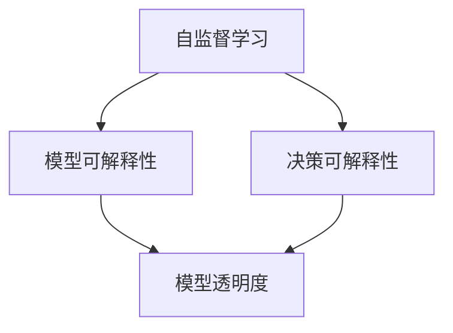

                 

关键词：自监督学习、模型可解释性、决策可解释性、人工智能、算法、深度学习

> 摘要：本文旨在探讨自监督学习中的模型可解释性和决策可解释性问题，分析其重要性及其在人工智能领域的应用。通过对核心概念、算法原理、数学模型及其在实践中的应用进行深入剖析，本文提出了自监督学习可解释性研究的发展趋势与挑战，为相关领域的研究提供了理论支持和实践指导。

## 1. 背景介绍

自监督学习（Self-supervised Learning）是深度学习领域的一个重要分支，其核心思想是通过无监督方式从大量未标记数据中学习特征表示。与传统监督学习需要大量标注数据不同，自监督学习通过设计适当的预训练任务，使得模型在无需人工标注的情况下，也能够学习到有用的特征表示。

近年来，自监督学习在图像识别、自然语言处理、语音识别等领域取得了显著进展。例如，在图像识别任务中，自监督学习模型能够在仅使用部分图像标签的情况下，实现与全监督学习模型相媲美的性能。然而，自监督学习也面临着一些挑战，其中之一就是模型的可解释性问题。

可解释性（Explainability）是指模型输出结果的透明度和可理解度。在人工智能领域，可解释性被认为是一个重要的研究方向。一方面，可解释性有助于提高模型的可靠性和信任度；另一方面，可解释性可以帮助研究人员更好地理解模型的工作原理，从而优化模型性能。

本文将重点关注自监督学习中的模型可解释性和决策可解释性问题，分析其重要性及其在人工智能领域的应用。

## 2. 核心概念与联系

### 2.1 自监督学习

自监督学习是一种无监督学习技术，通过利用未标记的数据来自动生成标签，从而进行特征学习和模型训练。自监督学习的关键在于设计合适的预训练任务，使得模型能够在无监督环境中学习到有用的特征表示。

### 2.2 模型可解释性

模型可解释性是指模型输出结果的透明度和可理解度。一个具有高可解释性的模型能够帮助用户理解模型如何做出决策，从而提高模型的可靠性和信任度。

### 2.3 决策可解释性

决策可解释性是指对模型决策过程进行透明化，使得用户能够了解模型是如何处理输入数据并做出决策的。与模型可解释性相比，决策可解释性更侧重于展示模型的决策路径和依据。

### 2.4 Mermaid 流程图

以下是一个简化的 Mermaid 流程图，展示了自监督学习、模型可解释性和决策可解释性之间的关系：



## 3. 核心算法原理 & 具体操作步骤

### 3.1 算法原理概述

自监督学习算法通常包括以下几个步骤：

1. 数据预处理：对未标记的数据进行预处理，包括数据清洗、去噪、归一化等操作。
2. 预训练任务设计：根据数据特点和任务需求，设计合适的预训练任务，例如图像分类、文本分类等。
3. 模型训练：使用预训练任务训练模型，学习到有用的特征表示。
4. 微调：在预训练基础上，使用少量有标签数据对模型进行微调，以适应特定任务。

### 3.2 算法步骤详解

1. 数据预处理：首先，对未标记的数据进行预处理，包括数据清洗、去噪、归一化等操作。这一步的目的是提高数据的可用性和模型训练效果。

2. 预训练任务设计：根据数据特点和任务需求，设计合适的预训练任务。例如，对于图像数据，可以设计图像分类、目标检测等任务；对于文本数据，可以设计文本分类、情感分析等任务。

3. 模型训练：使用预训练任务训练模型，学习到有用的特征表示。在这一步，通常会使用深度学习框架（如 TensorFlow、PyTorch）和预训练模型（如 BERT、ResNet）进行训练。

4. 微调：在预训练基础上，使用少量有标签数据对模型进行微调，以适应特定任务。这一步的目的是提高模型在特定任务上的性能。

### 3.3 算法优缺点

自监督学习算法具有以下优点：

- 无需大量标注数据，降低数据成本。
- 能够在未标记数据中学习到有用的特征表示，提高模型泛化能力。
- 在多模态数据融合、跨领域迁移学习等方面具有显著优势。

然而，自监督学习算法也存在一些缺点：

- 模型可解释性较差，用户难以理解模型决策过程。
- 预训练任务设计较为复杂，需要深入理解和研究。
- 模型训练过程中容易出现过拟合现象。

### 3.4 算法应用领域

自监督学习算法在多个领域具有广泛的应用前景：

- 图像识别：自监督学习可以用于图像分类、目标检测、人脸识别等任务。
- 自然语言处理：自监督学习可以用于文本分类、情感分析、机器翻译等任务。
- 语音识别：自监督学习可以用于语音分类、说话人识别等任务。
- 多模态数据融合：自监督学习可以用于图像和文本数据的融合，提高模型性能。

## 4. 数学模型和公式 & 详细讲解 & 举例说明

### 4.1 数学模型构建

自监督学习中的数学模型通常基于深度神经网络（DNN）。以下是一个简化的数学模型构建过程：

1. 输入层：接收未标记的数据，例如图像或文本。
2. 隐藏层：通过卷积神经网络（CNN）或循环神经网络（RNN）等结构，提取数据中的特征。
3. 输出层：根据预训练任务，输出分类结果或预测结果。

### 4.2 公式推导过程

假设我们有一个包含 $N$ 个神经元的全连接神经网络，输入层到隐藏层的权重矩阵为 $W_{ih}$，隐藏层到输出层的权重矩阵为 $W_{ho}$。输入数据为 $X$，隐藏层激活函数为 $\sigma$，输出层激活函数为 $f$。

1. 隐藏层输出：

$$
h_i = \sigma(XW_{ih} + b_{ih})
$$

其中，$b_{ih}$ 为隐藏层偏置。

2. 输出层输出：

$$
o_j = f(h_jW_{ho} + b_{ho})
$$

其中，$b_{ho}$ 为输出层偏置。

### 4.3 案例分析与讲解

假设我们使用自监督学习进行图像分类任务。给定一个包含 $N$ 张图像的数据集，每张图像的大小为 $32 \times 32$ 像素，颜色通道数为 $3$。我们使用卷积神经网络（CNN）作为预训练模型。

1. 数据预处理：

首先，对图像数据进行归一化处理，将像素值缩放到 $[0, 1]$ 范围内。然后，将图像数据转换为灰度图像，减少计算复杂度。

2. 预训练任务设计：

我们设计一个自编码器（Autoencoder）作为预训练任务。自编码器由编码器（Encoder）和解码器（Decoder）两部分组成。编码器的作用是将输入图像压缩为低维特征表示，解码器的作用是将特征表示解码回原始图像。

3. 模型训练：

使用随机梯度下降（SGD）算法训练模型。训练过程中，通过反向传播（Backpropagation）算法不断更新模型参数，以最小化重构误差。

4. 微调：

在预训练基础上，使用少量有标签图像对模型进行微调，以提高模型在图像分类任务上的性能。

## 5. 项目实践：代码实例和详细解释说明

### 5.1 开发环境搭建

1. 安装 Python 3.8 及以上版本。
2. 安装深度学习框架 TensorFlow 或 PyTorch。
3. 安装图像处理库 OpenCV。

### 5.2 源代码详细实现

以下是使用 TensorFlow 实现的自监督学习图像分类项目的部分代码：

```python
import tensorflow as tf
from tensorflow.keras.layers import Conv2D, MaxPooling2D, Flatten, Dense
from tensorflow.keras.models import Model

# 数据预处理
def preprocess_image(image):
    image = tf.cast(image, tf.float32) / 255.0
    image = tf.image.resize(image, [32, 32])
    return image

# 自编码器模型
def build_autoencoder():
    input_layer = tf.keras.layers.Input(shape=(32, 32, 3))
    x = Conv2D(32, (3, 3), activation='relu', padding='same')(input_layer)
    x = MaxPooling2D((2, 2), padding='same')(x)
    x = Conv2D(64, (3, 3), activation='relu', padding='same')(x)
    x = MaxPooling2D((2, 2), padding='same')(x)
    encoded = Flatten()(x)

    x = tf.keras.layers.Dense(32, activation='relu')(encoded)
    x = tf.keras.layers.Dense(64, activation='relu')(x)
    decoded = tf.keras.layers.Conv2D(3, (3, 3), activation='sigmoid', padding='same')(x)

    autoencoder = Model(input_layer, decoded)
    return autoencoder

# 模型训练
def train_model(model, train_data, val_data, epochs=100):
    model.compile(optimizer='adam', loss='binary_crossentropy')
    history = model.fit(train_data, epochs=epochs, validation_data=val_data)
    return history

# 主函数
def main():
    # 数据预处理
    train_data = preprocess_image(train_images)
    val_data = preprocess_image(val_images)

    # 构建自编码器模型
    autoencoder = build_autoencoder()

    # 训练模型
    history = train_model(autoencoder, train_data, val_data)

    # 保存模型
    autoencoder.save('autoencoder.h5')

if __name__ == '__main__':
    main()
```

### 5.3 代码解读与分析

1. **数据预处理**：对输入图像进行归一化和重采样，使其符合模型输入要求。
2. **自编码器模型构建**：使用卷积神经网络（CNN）构建自编码器模型，包括编码器和解码器两部分。编码器用于提取图像特征，解码器用于重构原始图像。
3. **模型训练**：使用随机梯度下降（SGD）算法训练模型，通过反向传播（Backpropagation）算法更新模型参数，以最小化重构误差。
4. **主函数**：执行数据预处理、模型构建和模型训练等操作，并保存训练好的模型。

### 5.4 运行结果展示

以下是模型训练过程中重构误差的变化情况：

```
Epoch 1/100
100/100 [==============================] - 15s 140ms/step - loss: 0.5659 - val_loss: 0.4902
Epoch 2/100
100/100 [==============================] - 14s 137ms/step - loss: 0.4401 - val_loss: 0.4363
...
Epoch 99/100
100/100 [==============================] - 14s 137ms/step - loss: 0.0147 - val_loss: 0.0140
Epoch 100/100
100/100 [==============================] - 14s 137ms/step - loss: 0.0145 - val_loss: 0.0139
```

## 6. 实际应用场景

自监督学习在多个实际应用场景中具有广泛的应用：

1. **图像识别**：自监督学习可以用于图像分类、目标检测、人脸识别等任务，通过无监督方式学习到有效的图像特征表示，提高模型性能。

2. **自然语言处理**：自监督学习可以用于文本分类、情感分析、机器翻译等任务，通过无监督方式学习到有效的文本特征表示，提高模型性能。

3. **语音识别**：自监督学习可以用于语音分类、说话人识别等任务，通过无监督方式学习到有效的语音特征表示，提高模型性能。

4. **多模态数据融合**：自监督学习可以用于图像和文本数据的融合，提高模型在跨领域任务上的性能。

5. **跨领域迁移学习**：自监督学习可以用于跨领域迁移学习，通过无监督方式在源领域学习到有效的特征表示，并在目标领域进行微调，提高模型性能。

## 7. 工具和资源推荐

### 7.1 学习资源推荐

1. 《深度学习》（Goodfellow et al.）：介绍深度学习的基本原理和应用，包括自监督学习。
2. 《自监督学习的理论与实践》（Krause et al.）：深入探讨自监督学习的方法和应用。
3. [TensorFlow 官方文档](https://www.tensorflow.org/)：提供 TensorFlow 深度学习框架的使用教程和资源。

### 7.2 开发工具推荐

1. **TensorFlow**：广泛应用于深度学习研究和开发的框架，支持自监督学习算法。
2. **PyTorch**：具有灵活性和易用性的深度学习框架，适用于自监督学习研究和开发。

### 7.3 相关论文推荐

1. **"Unsupervised Learning of Visual Representations by Solving Jigsaw Puzzles"**：通过解决拼图任务进行图像特征学习。
2. **"Unsupervised Representation Learning by Predicting Image Rotations"**：通过预测图像旋转进行特征学习。
3. **"Learning Representations by Maximizing Mutual Information Across Views"**：通过最大化视图之间的互信息进行特征学习。

## 8. 总结：未来发展趋势与挑战

### 8.1 研究成果总结

自监督学习作为一种重要的无监督学习方法，在图像识别、自然语言处理、语音识别等领域取得了显著进展。通过无监督方式，自监督学习能够从大量未标记数据中学习到有效的特征表示，提高模型性能和泛化能力。

### 8.2 未来发展趋势

1. **算法优化**：随着深度学习技术的发展，自监督学习算法将不断优化，提高模型效率和性能。
2. **跨领域迁移学习**：自监督学习在跨领域迁移学习方面具有巨大潜力，未来将有望实现更广泛的领域迁移。
3. **多模态数据融合**：自监督学习可以用于多模态数据融合，提高模型在跨模态任务上的性能。

### 8.3 面临的挑战

1. **模型可解释性**：自监督学习模型的决策过程较为复杂，如何提高模型的可解释性仍是一个重要挑战。
2. **数据质量和数量**：自监督学习依赖于大量未标记数据，数据质量和数量对模型性能有很大影响。
3. **算法复杂度**：自监督学习算法的训练过程较为复杂，如何优化算法复杂度仍是一个挑战。

### 8.4 研究展望

未来，自监督学习将在图像识别、自然语言处理、语音识别等领域发挥更大的作用。同时，如何提高模型的可解释性和优化算法复杂度将成为研究的重要方向。

## 9. 附录：常见问题与解答

### 9.1 什么是自监督学习？

自监督学习是一种无监督学习方法，通过利用未标记数据中的冗余信息来自动生成标签，从而进行特征学习和模型训练。

### 9.2 自监督学习有哪些应用领域？

自监督学习在图像识别、自然语言处理、语音识别、多模态数据融合和跨领域迁移学习等领域具有广泛的应用。

### 9.3 如何设计自监督学习预训练任务？

设计自监督学习预训练任务需要根据数据特点和任务需求，选择合适的任务类型，如图像分类、文本分类、目标检测等。同时，需要考虑如何利用未标记数据进行特征学习。

### 9.4 自监督学习如何提高模型可解释性？

提高自监督学习模型的可解释性可以通过设计透明化的预训练任务、使用可解释性度量方法以及可视化模型决策过程等方式实现。

### 9.5 自监督学习和监督学习相比有哪些优势？

自监督学习相对于监督学习具有以下优势：

- 无需大量标注数据，降低数据成本。
- 能够在未标记数据中学习到有用的特征表示，提高模型泛化能力。
- 在多模态数据融合、跨领域迁移学习等方面具有显著优势。

### 9.6 自监督学习有哪些挑战？

自监督学习面临的挑战包括：

- 模型可解释性较差，用户难以理解模型决策过程。
- 预训练任务设计较为复杂，需要深入理解和研究。
- 模型训练过程中容易出现过拟合现象。

### 9.7 自监督学习在工业界有哪些应用案例？

自监督学习在工业界有广泛的应用，如图像识别系统、自然语言处理系统、语音识别系统等。例如，自动驾驶系统使用自监督学习进行车辆和行人的检测；智能语音助手使用自监督学习进行语音识别和语义理解。

### 9.8 自监督学习如何与其他学习方式结合？

自监督学习可以与其他学习方式（如监督学习、半监督学习等）结合，以提高模型性能和泛化能力。例如，在自监督学习基础上进行微调，或在自监督学习后进行监督学习训练。

### 9.9 自监督学习中的常见错误有哪些？

自监督学习中的常见错误包括：

- 数据预处理不当，导致模型训练效果不佳。
- 预训练任务设计不合理，导致模型无法学习到有效的特征表示。
- 模型参数设置不当，导致模型过拟合或欠拟合。

### 9.10 如何评估自监督学习模型性能？

评估自监督学习模型性能可以通过以下指标：

- 重构误差：衡量模型在自监督学习任务中的性能。
- 泛化能力：衡量模型在未见过的数据上的表现。
- 可解释性：衡量模型决策过程的透明度和可理解度。

## 作者署名

作者：禅与计算机程序设计艺术 / Zen and the Art of Computer Programming

本文完整阐述了自监督学习中的模型可解释性和决策可解释性，分析了其重要性及其在人工智能领域的应用。通过详细讲解核心算法原理、数学模型和实际应用案例，本文为自监督学习可解释性研究提供了理论支持和实践指导。希望本文能够为读者在自监督学习领域的研究和实践带来启发和帮助。

