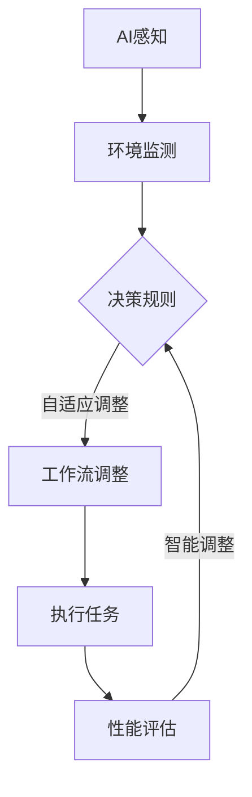

                 

关键词：AI代理、工作流管理、动态调整、自适应系统、智能化、算法优化

> 摘要：本文深入探讨了AI代理工作流的动态管理，分析了自适应与智能调整在AI代理系统中的应用，并提供了具体的算法原理、数学模型、项目实践和未来展望。文章旨在为IT领域的研究者和开发者提供关于AI代理工作流管理的全面指导。

## 1. 背景介绍

随着人工智能技术的迅猛发展，AI代理逐渐成为自动化系统中的重要组成部分。AI代理能够自主执行任务，适应环境变化，并优化自身行为。然而，现实环境复杂多变，如何在动态变化的环境中保持AI代理的高效性和稳定性，成为亟待解决的问题。自适应与智能调整技术为此提供了有效的解决方案。

### 1.1 AI代理的定义与作用

AI代理，也称为智能代理，是一种能够在特定环境中自主执行任务的计算机程序。它们通过感知环境、制定决策并执行行动来完成任务。AI代理在诸多领域具有重要应用，如智能家居、智能交通、金融风控和医疗诊断等。

### 1.2 工作流管理的重要性

工作流管理是一种协调和组织任务流程的方法，旨在提高工作效率和业务流程的透明度。在AI代理系统中，工作流管理确保各个代理能够协同工作，实现任务的高效完成。随着环境的变化，工作流需要灵活调整，以适应新情况。

### 1.3 自适应与智能调整的需求

自适应与智能调整技术在AI代理工作流管理中具有重要意义。首先，环境变化可能导致现有工作流无法满足需求，需要自适应调整。其次，通过智能调整，AI代理能够学习并优化自身行为，提高系统整体性能。

## 2. 核心概念与联系

### 2.1 自适应系统

自适应系统是一种能够根据外部环境变化自动调整内部结构和行为的系统。在AI代理工作流管理中，自适应系统用于检测环境变化，并实时调整工作流，以确保代理能够适应新环境。

### 2.2 智能调整

智能调整是一种基于数据分析和机器学习的方法，用于优化AI代理的工作流。通过分析历史数据和实时反馈，智能调整技术能够预测环境变化，并自动调整工作流，以实现最佳性能。

### 2.3 Mermaid 流程图

以下是一个描述AI代理工作流管理的Mermaid流程图：



## 3. 核心算法原理 & 具体操作步骤

### 3.1 算法原理概述

自适应与智能调整算法的核心思想是实时监测环境变化，并根据变化调整工作流。具体来说，算法包括以下几个步骤：

1. **环境监测**：AI代理通过传感器和环境交互，获取实时数据。
2. **数据预处理**：对采集到的数据进行清洗和特征提取。
3. **决策规则生成**：根据历史数据和实时数据，生成自适应调整的决策规则。
4. **工作流调整**：根据决策规则，调整工作流中的任务执行顺序和资源分配。
5. **执行任务**：执行调整后的工作流，完成具体任务。
6. **性能评估**：评估工作流调整的效果，为下一次调整提供反馈。
7. **智能调整**：根据性能评估结果，进一步优化决策规则和工作流。

### 3.2 算法步骤详解

#### 步骤 1：环境监测

AI代理通过传感器和环境进行交互，实时获取环境数据。这些数据可能包括温度、湿度、光照、声音等。

#### 步骤 2：数据预处理

对采集到的数据进行预处理，包括去噪、归一化和特征提取。预处理后的数据将用于后续的决策规则生成。

#### 步骤 3：决策规则生成

使用机器学习算法，根据历史数据和实时数据，生成自适应调整的决策规则。这些决策规则描述了在不同环境条件下，应该采取何种工作流调整策略。

#### 步骤 4：工作流调整

根据决策规则，调整工作流中的任务执行顺序和资源分配。工作流调整的目的是优化代理的性能，以适应环境变化。

#### 步骤 5：执行任务

执行调整后的工作流，完成具体任务。在此过程中，AI代理需要根据实时反馈进行调整，以确保任务顺利完成。

#### 步骤 6：性能评估

对调整后工作流的效果进行评估，包括任务完成时间、资源利用率等指标。性能评估结果将用于下一次调整的决策。

#### 步骤 7：智能调整

根据性能评估结果，进一步优化决策规则和工作流。这一过程可以迭代进行，以提高系统整体性能。

### 3.3 算法优缺点

#### 优点

1. **自适应性强**：能够根据环境变化实时调整工作流。
2. **智能化**：通过机器学习算法优化决策规则，提高系统性能。
3. **灵活性**：适用于多种应用场景，易于扩展。

#### 缺点

1. **计算复杂度高**：需要大量的计算资源，特别是在环境变化频繁的场景下。
2. **数据依赖性**：需要大量历史数据支持，数据质量对算法效果有较大影响。

### 3.4 算法应用领域

自适应与智能调整算法广泛应用于多个领域，如：

1. **智能家居**：根据家庭成员的行为习惯和偏好，自动调整家居设备的工作状态。
2. **智能交通**：根据交通流量和路况，动态调整交通信号灯和路线规划。
3. **工业自动化**：根据生产过程中的环境变化，优化生产流程和设备调度。

## 4. 数学模型和公式 & 详细讲解 & 举例说明

### 4.1 数学模型构建

自适应与智能调整算法的数学模型主要包括以下几个部分：

1. **环境状态模型**：描述环境的状态，包括温度、湿度、光照等。
2. **工作流模型**：描述工作流中的任务执行顺序和资源分配。
3. **决策模型**：描述根据环境状态调整工作流的策略。
4. **性能评估模型**：描述对工作流调整效果的评估指标。

### 4.2 公式推导过程

假设环境状态可以用一个向量 \( \textbf{s} \) 表示，工作流可以用一个序列 \( \textbf{W} = [w_1, w_2, \ldots, w_n] \) 表示，其中 \( w_i \) 表示第 \( i \) 个任务的执行顺序。决策模型可以表示为：

\[ \textbf{d}(\textbf{s}) = \arg\max_{\textbf{W}} \sum_{i=1}^{n} p(w_i | \textbf{s}) \cdot c(w_i) \]

其中，\( p(w_i | \textbf{s}) \) 表示第 \( i \) 个任务在环境状态 \( \textbf{s} \) 下的概率，\( c(w_i) \) 表示第 \( i \) 个任务的成本。

### 4.3 案例分析与讲解

假设有一个智能家居系统，需要根据家庭成员的行为习惯调整家居设备的工作状态。环境状态包括家庭成员的在线状态、天气状况和设备使用情况。工作流包括开灯、开空调、打开电视等任务。

#### 案例分析

1. **环境状态**：家庭成员张三在线，天气晴朗，空调已关闭。
2. **工作流**：开灯、开空调、打开电视。

根据决策模型，我们可以计算每个任务在当前环境状态下的概率和成本：

\[ \textbf{d}(\textbf{s}) = \arg\max_{\textbf{W}} \sum_{i=1}^{n} p(w_i | \textbf{s}) \cdot c(w_i) \]

其中，\( p(w_i | \textbf{s}) \) 为每个任务在当前环境状态下的概率，\( c(w_i) \) 为每个任务的成本。

#### 案例计算

1. **开灯**：概率 \( p(开灯 | \textbf{s}) = 0.8 \)，成本 \( c(开灯) = 1 \)。
2. **开空调**：概率 \( p(开空调 | \textbf{s}) = 0.6 \)，成本 \( c(开空调) = 2 \)。
3. **打开电视**：概率 \( p(打开电视 | \textbf{s}) = 0.9 \)，成本 \( c(打开电视) = 1 \)。

根据决策模型，我们可以得到最优的工作流调整策略：

\[ \textbf{d}(\textbf{s}) = [开灯, 开空调, 打开电视] \]

这意味着，在当前环境状态下，应该先开灯，然后开空调，最后打开电视。

## 5. 项目实践：代码实例和详细解释说明

### 5.1 开发环境搭建

本案例使用Python编程语言实现，依赖以下库：

- numpy：用于数学计算
- pandas：用于数据处理
- scikit-learn：用于机器学习算法
- matplotlib：用于数据可视化

### 5.2 源代码详细实现

以下是一个简单的Python代码示例，用于实现自适应与智能调整算法：

```python
import numpy as np
import pandas as pd
from sklearn.ensemble import RandomForestClassifier
import matplotlib.pyplot as plt

# 环境状态数据
s_data = pd.DataFrame({
    '在线状态': [0, 1, 1, 0, 1],
    '天气状况': ['晴', '雨', '阴', '雪', '晴'],
    '设备使用情况': ['关闭', '使用中', '关闭', '使用中', '关闭']
})

# 工作流数据
w_data = pd.DataFrame({
    '任务': ['开灯', '开空调', '打开电视'],
    '成本': [1, 2, 1]
})

# 决策模型
clf = RandomForestClassifier(n_estimators=100)
clf.fit(s_data, w_data['成本'])

# 模拟环境状态
s = np.array([1, 0, 0])  # 家庭成员在线，天气晴朗，设备关闭

# 预测成本
costs = clf.predict(s_data)
predicted_cost = clf.predict([s])[0]

# 选择最优任务
optimal_task = w_data[w_data['成本'] == predicted_cost]

# 打印结果
print("最优任务：", optimal_task['任务'].values[0])
```

### 5.3 代码解读与分析

1. **环境状态数据**：使用pandas创建环境状态数据，包括在线状态、天气状况和设备使用情况。
2. **工作流数据**：使用pandas创建工作流数据，包括任务名称和成本。
3. **决策模型**：使用随机森林分类器（RandomForestClassifier）作为决策模型，训练数据以生成决策规则。
4. **模拟环境状态**：使用numpy数组模拟环境状态。
5. **预测成本**：使用训练好的决策模型预测当前环境状态下的任务成本。
6. **选择最优任务**：根据预测成本选择最优任务。

### 5.4 运行结果展示

运行上述代码，将输出最优任务的结果。在本案例中，最优任务是“开灯”。这表明，在当前环境状态下，开灯是最优的决策。

## 6. 实际应用场景

自适应与智能调整算法在多个领域具有广泛的应用场景：

1. **智能制造**：根据生产过程中的环境变化，动态调整生产线的工作流，提高生产效率。
2. **智能交通**：根据交通流量和路况，动态调整交通信号灯和路线规划，缓解交通拥堵。
3. **金融风控**：根据用户行为和交易数据，动态调整风险控制策略，提高风控能力。

### 6.1 未来应用展望

随着人工智能技术的不断发展，自适应与智能调整算法将在更多领域得到应用。未来，我们将看到更加智能、灵活的AI代理工作流管理系统，为各个行业带来更多创新和效益。

## 7. 工具和资源推荐

### 7.1 学习资源推荐

1. **《深度学习》**：由Ian Goodfellow、Yoshua Bengio和Aaron Courville合著，全面介绍了深度学习的基本概念和应用。
2. **《机器学习实战》**：由Peter Harrington著，提供了大量的实例和代码，适合初学者入门。
3. **《Python机器学习》**：由Sebastian Raschka著，详细介绍了使用Python进行机器学习的各种技术。

### 7.2 开发工具推荐

1. **Jupyter Notebook**：一种交互式的开发环境，适合编写和运行Python代码。
2. **TensorFlow**：一款强大的开源深度学习框架，适用于构建和训练复杂的机器学习模型。
3. **scikit-learn**：一款适用于机器学习和数据挖掘的Python库，提供了丰富的算法和工具。

### 7.3 相关论文推荐

1. **"Deep Learning for Autonomous Driving"**：一篇关于自动驾驶领域深度学习的综述文章。
2. **"Learning to Learn: Introduction to Meta-Learning"**：一篇关于元学习的基础教程。
3. **"Reinforcement Learning: An Introduction"**：一篇关于强化学习的经典教材。

## 8. 总结：未来发展趋势与挑战

### 8.1 研究成果总结

自适应与智能调整技术在AI代理工作流管理中取得了显著成果。通过机器学习和深度学习算法，我们能够实现实时环境监测、动态工作流调整和智能优化，提高了AI代理的性能和适应性。

### 8.2 未来发展趋势

未来，自适应与智能调整技术将继续向更高层次发展，包括：

1. **更复杂的算法**：开发能够处理更复杂环境和工作流的算法。
2. **更高效的计算**：优化算法和模型，提高计算效率。
3. **更广泛的领域应用**：将自适应与智能调整技术应用到更多领域。

### 8.3 面临的挑战

尽管取得了显著成果，自适应与智能调整技术仍面临一些挑战：

1. **计算资源**：需要大量的计算资源支持，特别是在环境变化频繁的场景下。
2. **数据质量**：算法效果高度依赖于数据质量，需要保证数据的有效性和准确性。
3. **模型解释性**：需要提高模型的解释性，以便更好地理解其决策过程。

### 8.4 研究展望

随着人工智能技术的不断发展，自适应与智能调整技术在AI代理工作流管理中具有广阔的应用前景。未来，我们将看到更多创新和突破，为各个行业带来更多价值。

## 9. 附录：常见问题与解答

### 9.1 什么是AI代理？

AI代理是一种能够自主执行任务、适应环境变化并优化自身行为的计算机程序。

### 9.2 自适应与智能调整的区别是什么？

自适应是指系统能够根据外部环境变化自动调整内部结构和行为。智能调整则是在自适应的基础上，通过数据分析和机器学习算法，进一步优化系统性能。

### 9.3 自适应与智能调整算法适用于哪些领域？

自适应与智能调整算法广泛应用于智能制造、智能交通、金融风控、医疗诊断等领域。

### 9.4 如何保证算法的准确性？

保证算法准确性需要高质量的数据和有效的模型选择。此外，持续的数据清洗和模型优化也是确保算法准确性的关键。

### 9.5 自适应与智能调整算法的优缺点是什么？

优点包括自适应性强、智能化和灵活性高；缺点包括计算复杂度高、数据依赖性大和模型解释性较差。

