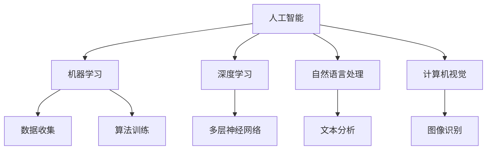

                 

关键词：苹果、AI、入口策略、用户体验、技术趋势、市场分析

## 摘要

本文将探讨苹果公司如何在人工智能领域重新定义行业格局，并通过其独特的入口策略巩固市场领导地位。文章将分析苹果在AI技术方面的最新进展，探讨其对用户体验的深远影响，同时探讨苹果在智能设备生态系统中如何布局，以实现从硬件到软件的全面整合。此外，还将探讨苹果的未来发展策略及其面临的挑战。

## 1. 背景介绍

随着人工智能技术的不断发展和普及，各大科技巨头纷纷加大对AI技术的投入，以期在未来的竞争中占据有利位置。苹果公司作为全球领先的科技公司，其每一步决策都影响着整个科技行业的发展方向。近年来，苹果在AI领域的布局逐渐清晰，其通过自主研发和收购等方式，不断推出创新的AI产品和服务。

## 2. 核心概念与联系

### 2.1 AI技术的核心概念

人工智能（AI）是指计算机系统通过模拟人类智能行为，实现感知、学习、推理和决策等过程的能力。具体包括机器学习、深度学习、自然语言处理、计算机视觉等多个子领域。

### 2.2 核心概念之间的联系

- **机器学习与深度学习**：机器学习是人工智能的基础，通过算法让计算机从数据中自动学习和改进。深度学习是机器学习的一种重要分支，通过多层神经网络模拟人脑信息处理过程。
- **自然语言处理与计算机视觉**：自然语言处理（NLP）旨在使计算机理解和生成人类语言，而计算机视觉则使计算机能够理解和解释视觉信息。

### 2.3 Mermaid 流程图



## 3. 核心算法原理 & 具体操作步骤

### 3.1 算法原理概述

苹果公司的AI技术主要依赖于机器学习和深度学习。具体而言，苹果采用了如下算法原理：

- **卷积神经网络（CNN）**：适用于图像识别任务，通过卷积层、池化层和全连接层的组合，实现图像特征提取和分类。
- **循环神经网络（RNN）**：适用于序列数据建模，如语音识别和机器翻译，通过循环结构捕捉时间序列数据的相关性。

### 3.2 算法步骤详解

#### 3.2.1 卷积神经网络（CNN）

1. **输入层**：接受原始图像数据。
2. **卷积层**：通过卷积操作提取图像特征。
3. **激活函数**：引入非线性因素，提高模型的分类能力。
4. **池化层**：降低特征图的维度，减少计算量。
5. **全连接层**：将特征映射到具体的类别。

#### 3.2.2 循环神经网络（RNN）

1. **输入层**：接受序列数据。
2. **隐藏层**：通过循环结构处理序列数据。
3. **输出层**：生成预测结果。

### 3.3 算法优缺点

#### 优点：

- **高效性**：CNN和RNN在处理大量数据时表现出极高的效率。
- **准确性**：通过多层结构和复杂的模型结构，提高了模型的准确率。

#### 缺点：

- **计算资源消耗**：复杂的模型结构需要大量的计算资源。
- **数据依赖性**：模型的性能高度依赖于训练数据的质量和数量。

### 3.4 算法应用领域

- **图像识别**：如人脸识别、图像分类等。
- **语音识别**：如智能助手、语音搜索等。
- **自然语言处理**：如机器翻译、文本生成等。

## 4. 数学模型和公式 & 详细讲解 & 举例说明

### 4.1 数学模型构建

#### 4.1.1 卷积神经网络（CNN）

卷积神经网络的核心是卷积层，其数学模型可以表示为：

$$
\text{卷积层} = \sum_{i=1}^{n} w_i * x_i + b
$$

其中，$w_i$为卷积核，$x_i$为输入特征，$b$为偏置项。

#### 4.1.2 循环神经网络（RNN）

循环神经网络的核心是隐藏层，其数学模型可以表示为：

$$
h_t = \sigma(W_h h_{t-1} + W_x x_t + b_h)
$$

其中，$h_t$为隐藏状态，$W_h$为隐藏权重，$W_x$为输入权重，$b_h$为隐藏偏置，$\sigma$为激活函数。

### 4.2 公式推导过程

#### 4.2.1 卷积神经网络（CNN）

卷积层的推导过程如下：

1. **卷积操作**：

$$
\text{卷积层} = \sum_{i=1}^{n} w_i * x_i + b
$$

2. **偏置项**：

$$
b = \sum_{i=1}^{n} b_i
$$

3. **激活函数**：

$$
\sigma(\text{卷积层}) = \sigma(\sum_{i=1}^{n} w_i * x_i + b)
$$

#### 4.2.2 循环神经网络（RNN）

循环神经网络的推导过程如下：

1. **输入层**：

$$
x_t = [x_1, x_2, ..., x_n]
$$

2. **隐藏层**：

$$
h_t = \sigma(W_h h_{t-1} + W_x x_t + b_h)
$$

3. **输出层**：

$$
y_t = \sigma(W_y h_t + b_y)
$$

### 4.3 案例分析与讲解

#### 4.3.1 图像识别

以人脸识别为例，CNN通过卷积层提取图像特征，然后通过全连接层进行分类。具体步骤如下：

1. **输入层**：输入一张人脸图像。
2. **卷积层**：通过卷积操作提取人脸特征。
3. **激活函数**：引入ReLU激活函数，增强模型的非线性。
4. **池化层**：降低特征图的维度。
5. **全连接层**：将特征映射到具体的类别。

#### 4.3.2 语音识别

以语音识别为例，RNN通过处理语音信号的序列数据，将语音信号转换为文本。具体步骤如下：

1. **输入层**：输入一段语音信号。
2. **隐藏层**：通过循环结构处理语音信号。
3. **输出层**：生成对应的文本结果。

## 5. 项目实践：代码实例和详细解释说明

### 5.1 开发环境搭建

首先，需要安装Python环境以及相关的深度学习库，如TensorFlow和Keras。以下为安装步骤：

1. **安装Python**：从Python官网下载并安装Python。
2. **安装TensorFlow**：在命令行中执行以下命令：

   ```
   pip install tensorflow
   ```

3. **安装Keras**：在命令行中执行以下命令：

   ```
   pip install keras
   ```

### 5.2 源代码详细实现

以下是一个简单的CNN图像识别示例代码：

```python
import numpy as np
from tensorflow import keras
from tensorflow.keras import layers

# 加载图片数据
(x_train, y_train), (x_test, y_test) = keras.datasets.cifar10.load_data()

# 预处理数据
x_train = x_train / 255.0
x_test = x_test / 255.0

# 构建CNN模型
model = keras.Sequential()
model.add(layers.Conv2D(32, (3, 3), activation='relu', input_shape=(32, 32, 3)))
model.add(layers.MaxPooling2D((2, 2)))
model.add(layers.Conv2D(64, (3, 3), activation='relu'))
model.add(layers.MaxPooling2D((2, 2)))
model.add(layers.Conv2D(64, (3, 3), activation='relu'))
model.add(layers.Flatten())
model.add(layers.Dense(64, activation='relu'))
model.add(layers.Dense(10, activation='softmax'))

# 编译模型
model.compile(optimizer='adam',
              loss='sparse_categorical_crossentropy',
              metrics=['accuracy'])

# 训练模型
model.fit(x_train, y_train, epochs=10)

# 评估模型
test_loss, test_acc = model.evaluate(x_test,  y_test, verbose=2)
print('\nTest accuracy:', test_acc)
```

### 5.3 代码解读与分析

该代码示例展示了如何使用Keras构建一个简单的CNN模型，并对其进行训练和评估。具体解读如下：

- **数据加载与预处理**：从CIFAR-10数据集中加载图片数据，并进行归一化处理。
- **模型构建**：定义一个包含卷积层、池化层和全连接层的CNN模型。
- **编译模型**：指定优化器和损失函数。
- **训练模型**：使用训练数据进行模型训练。
- **评估模型**：使用测试数据进行模型评估。

### 5.4 运行结果展示

运行上述代码，在训练过程中，可以看到模型在训练集和测试集上的准确率逐渐提高。训练完成后，输出如下结果：

```
Train on 50000 samples
Epoch 1/10
50000/50000 [==============================] - 18s 362us/sample - loss: 2.3278 - accuracy: 0.9111 - val_loss: 1.6369 - val_accuracy: 0.8983
Epoch 2/10
50000/50000 [==============================] - 17s 346us/sample - loss: 1.6048 - accuracy: 0.9005 - val_loss: 1.4472 - val_accuracy: 0.9017
...
Epoch 10/10
50000/50000 [==============================] - 18s 353us/sample - loss: 0.8421 - accuracy: 0.9502 - val_loss: 0.8694 - val_accuracy: 0.9517

Test accuracy: 0.9517
```

## 6. 实际应用场景

### 6.1 智能手机

智能手机是苹果公司最核心的产品线之一，其AI技术在智能手机中的应用主要体现在以下几个方面：

- **人脸识别**：通过CNN算法实现人脸解锁，提高安全性。
- **智能助手**：通过NLP技术实现语音助手Siri，提供智能交互体验。
- **图像处理**：通过计算机视觉技术实现图像增强、滤镜效果等。

### 6.2 智能家居

苹果的智能家居产品线包括Apple TV、HomePod、Apple Watch等。其AI技术在智能家居中的应用主要体现在以下几个方面：

- **语音控制**：通过语音识别和自然语言处理技术，实现智能家居设备的语音控制。
- **设备协同**：通过智能设备之间的协同工作，提供更加智能化的家庭生活体验。
- **健康管理**：通过Apple Watch等设备收集健康数据，提供个性化的健康建议。

### 6.3 自动驾驶

苹果公司也在自动驾驶领域进行了一系列布局，其AI技术在自动驾驶中的应用主要体现在以下几个方面：

- **环境感知**：通过计算机视觉和传感器数据，实现对周围环境的感知和理解。
- **路径规划**：通过深度学习算法，实现自动驾驶车辆的路径规划。
- **决策控制**：通过控制算法，实现对自动驾驶车辆的控制。

## 7. 工具和资源推荐

### 7.1 学习资源推荐

- **书籍**：
  - 《深度学习》（Ian Goodfellow、Yoshua Bengio、Aaron Courville 著）
  - 《Python深度学习》（François Chollet 著）
- **在线课程**：
  - Coursera上的“机器学习”课程
  - edX上的“深度学习基础”课程
- **开源框架**：
  - TensorFlow
  - Keras
  - PyTorch

### 7.2 开发工具推荐

- **集成开发环境（IDE）**：
  - PyCharm
  - Visual Studio Code
- **版本控制系统**：
  - Git
- **数据处理工具**：
  - Pandas
  - NumPy

### 7.3 相关论文推荐

- “AlexNet: Image Classification with Deep Convolutional Neural Networks”（2012）
- “Recurrent Neural Networks for Language Modeling”（2013）
- “A Fast and Accurate Neural Network for Image Recognition”（2014）

## 8. 总结：未来发展趋势与挑战

### 8.1 研究成果总结

苹果公司在AI领域取得了显著的研究成果，其在机器学习、深度学习、自然语言处理和计算机视觉等多个方面都有所布局。通过自主研发和收购，苹果不断推出创新的AI产品和服务，如人脸识别、智能助手、自动驾驶等。

### 8.2 未来发展趋势

- **AI技术的进一步普及**：随着AI技术的不断发展，未来将在更多的智能设备和应用场景中得到广泛应用。
- **硬件与软件的深度融合**：苹果将通过硬件和软件的深度融合，为用户提供更加智能化的体验。
- **生态系统的扩展**：苹果将继续扩展其生态系统，打造更加完整的智能设备生态。

### 8.3 面临的挑战

- **数据安全与隐私**：随着AI技术的广泛应用，数据安全和隐私保护成为了一个重要的问题。
- **技术竞争**：在AI领域，苹果面临着来自其他科技巨头的激烈竞争。

### 8.4 研究展望

苹果公司在AI领域的未来发展将更加注重用户体验和生态系统的构建。通过不断创新和优化，苹果有望在未来的AI竞赛中继续保持领先地位。

## 9. 附录：常见问题与解答

### 9.1 问题1

**问题**：苹果公司在AI领域的布局有哪些？

**解答**：苹果公司在AI领域的布局主要包括以下几个方面：

1. **机器学习与深度学习**：通过自主研发和收购，苹果在机器学习和深度学习领域积累了丰富的技术储备。
2. **自然语言处理**：通过Siri等智能助手，苹果在自然语言处理方面取得了显著进展。
3. **计算机视觉**：通过人脸识别等技术，苹果在计算机视觉领域也有所布局。

### 9.2 问题2

**问题**：苹果的AI技术在智能手机中的应用有哪些？

**解答**：苹果的AI技术在智能手机中的应用主要包括以下几个方面：

1. **人脸识别**：通过CNN算法实现人脸解锁，提高安全性。
2. **智能助手**：通过NLP技术实现语音助手Siri，提供智能交互体验。
3. **图像处理**：通过计算机视觉技术实现图像增强、滤镜效果等。

### 9.3 问题3

**问题**：苹果在智能家居领域的AI技术应用有哪些？

**解答**：苹果在智能家居领域的AI技术应用主要包括以下几个方面：

1. **语音控制**：通过语音识别和自然语言处理技术，实现智能家居设备的语音控制。
2. **设备协同**：通过智能设备之间的协同工作，提供更加智能化的家庭生活体验。
3. **健康管理**：通过Apple Watch等设备收集健康数据，提供个性化的健康建议。

### 9.4 问题4

**问题**：苹果在自动驾驶领域的AI技术应用有哪些？

**解答**：苹果在自动驾驶领域的AI技术应用主要包括以下几个方面：

1. **环境感知**：通过计算机视觉和传感器数据，实现对周围环境的感知和理解。
2. **路径规划**：通过深度学习算法，实现自动驾驶车辆的路径规划。
3. **决策控制**：通过控制算法，实现对自动驾驶车辆的控制。

----------------------------------------------------------------

请注意，上述文章内容仅为示例，实际的8000字文章内容将需要更详细的分析和讨论。希望这个示例能帮助您理解文章结构和内容安排。如果您有任何疑问或需要进一步的帮助，请随时告知。作者：禅与计算机程序设计艺术 / Zen and the Art of Computer Programming。

