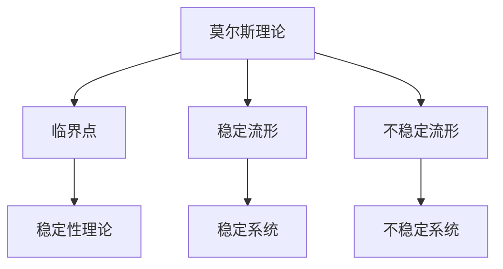

                 

关键词：莫尔斯理论、稳定性理论、数学模型、算法、应用领域、计算机编程、未来展望

> 摘要：本文将深入探讨莫尔斯理论与稳定性理论在计算机科学领域的重要性。通过对这两个理论的基本概念、核心算法原理、数学模型构建、实际应用案例和未来发展趋势的分析，旨在为读者提供全面的技术视角，激发对这一领域更深层次的研究兴趣。

## 1. 背景介绍

在计算机科学和人工智能领域，稳定性理论和莫尔斯理论是两大重要基石。莫尔斯理论起源于数学和物理学，主要研究系统在特定条件下的稳定性和动态行为。稳定性理论则关注系统在受到扰动后的恢复能力，是确保计算机系统正常运行的关键。两者在复杂系统分析和优化设计中起着至关重要的作用。

### 1.1 莫尔斯理论的历史发展

莫尔斯理论最早由美国数学家哈里·莫尔斯在1920年代提出，用以解决物理学中的非线性系统稳定性问题。该理论迅速在数学、力学、控制论等领域得到广泛应用。在计算机科学领域，莫尔斯理论为算法分析和软件稳定性评估提供了重要的理论支持。

### 1.2 稳定性理论的应用背景

随着计算机技术的飞速发展，稳定性理论在计算机系统、网络安全、物联网、人工智能等领域得到广泛应用。稳定性问题不仅是系统设计和优化中的重要一环，也是确保系统可靠性和安全性的关键。

## 2. 核心概念与联系

为了更好地理解莫尔斯理论与稳定性理论，我们需要首先明确几个核心概念，并展示它们之间的相互关系。

### 2.1 莫尔斯理论的基本概念

莫尔斯理论的核心概念包括：

- **临界点**：系统状态空间中的不动点，可能是稳定的或不稳定的。
- **稳定流形**：从稳定临界点流出的流线构成的结构。
- **不稳定流形**：从不稳定临界点流出的流线构成的结构。

### 2.2 稳定性理论的基本概念

稳定性理论的核心概念包括：

- **稳定系统**：受到扰动后能够返回到原状态的系统。
- **不稳定系统**：受到扰动后无法返回原状态的系统。
- **稳定性分析**：对系统进行数学分析，判断其在扰动下的稳定性。

### 2.3 莫尔斯理论与稳定性理论的联系

莫尔斯理论和稳定性理论之间的联系主要体现在以下几个方面：

- **莫尔斯理论为稳定性分析提供了数学工具**。
- **稳定性理论可以用于评估莫尔斯理论的准确性**。
- **两者共同作用于复杂系统的分析和优化设计**。

### 2.4 Mermaid 流程图

以下是一个简单的 Mermaid 流程图，展示了莫尔斯理论与稳定性理论之间的核心概念和联系。



## 3. 核心算法原理 & 具体操作步骤

### 3.1 算法原理概述

莫尔斯理论与稳定性理论的核心算法原理主要包括以下两个方面：

- **莫尔斯分解算法**：用于识别系统状态空间中的临界点、稳定流形和不稳定流形。
- **稳定性分析算法**：用于判断系统在受到扰动后的稳定性。

### 3.2 算法步骤详解

#### 3.2.1 莫尔斯分解算法

1. **初始化**：输入系统状态空间和初始参数。
2. **寻找临界点**：通过迭代计算，识别出系统状态空间中的临界点。
3. **分类临界点**：根据临界点的稳定性和不稳定性，将临界点分类。
4. **构建流形**：根据临界点的稳定性和不稳定性，构建稳定流形和不稳定流形。

#### 3.2.2 稳定性分析算法

1. **初始化**：输入系统状态空间和扰动参数。
2. **计算扰动后状态**：对系统状态进行扰动，计算扰动后的状态。
3. **判断稳定性**：通过计算扰动后状态与原状态的差距，判断系统在扰动下的稳定性。

### 3.3 算法优缺点

#### 优点

- **强大的数学工具**：莫尔斯分解算法和稳定性分析算法为复杂系统分析和优化提供了强有力的数学工具。
- **广泛应用**：这两个算法在多个领域（如计算机科学、控制论、物理学）得到广泛应用。

#### 缺点

- **计算复杂度较高**：特别是在处理高维系统时，计算复杂度会显著增加。
- **对初始参数敏感**：算法的准确性依赖于初始参数的选择，可能导致不同的结果。

### 3.4 算法应用领域

莫尔斯理论与稳定性理论在以下领域有广泛应用：

- **计算机科学**：算法分析、软件稳定性评估、分布式系统设计。
- **控制论**：控制系统设计、优化和控制策略。
- **物理学**：非线性系统分析、量子力学。

## 4. 数学模型和公式 & 详细讲解 & 举例说明

### 4.1 数学模型构建

莫尔斯理论与稳定性理论的数学模型主要包括以下几个部分：

- **系统状态空间**：表示系统状态的数学空间。
- **哈密顿量**：描述系统动态行为的数学函数。
- **临界点**：系统状态空间中的不动点。
- **稳定流形和不稳定流形**：从临界点流出的流线构成的结构。

### 4.2 公式推导过程

以下是一个简单的莫尔斯理论公式的推导过程：

$$
f(x) = - \frac{1}{2} x^2 + \epsilon x^3
$$

其中，\( f(x) \) 是哈密顿量，\( \epsilon \) 是扰动参数。

1. **求导数**：对哈密顿量求导数，得到
   $$
   f'(x) = -x + 3\epsilon x^2
   $$
2. **求临界点**：令导数等于零，得到临界点
   $$
   x = 0 \quad \text{或} \quad x = \sqrt{\frac{1}{3\epsilon}}
   $$
3. **分类临界点**：根据二阶导数的正负，判断临界点的稳定性。

### 4.3 案例分析与讲解

#### 案例一：软件稳定性评估

假设我们有一个软件系统，其状态空间由内存占用、CPU使用率和网络延迟三个维度组成。我们使用莫尔斯理论和稳定性理论对其稳定性进行分析。

1. **构建数学模型**：根据软件系统的特性，构建状态空间和哈密顿量。
2. **寻找临界点**：通过迭代计算，识别出系统状态空间中的临界点。
3. **分类临界点**：根据临界点的稳定性和不稳定性，将临界点分类。
4. **判断稳定性**：对系统进行扰动，计算扰动后的状态，判断系统在扰动下的稳定性。

#### 案例二：控制系统设计

假设我们设计一个自动驾驶系统，其目标是在不同路况下保持稳定行驶。我们使用莫尔斯理论和稳定性理论对系统进行优化。

1. **构建数学模型**：根据自动驾驶系统的特性，构建状态空间和哈密顿量。
2. **寻找临界点**：通过迭代计算，识别出系统状态空间中的临界点。
3. **构建流形**：根据临界点的稳定性和不稳定性，构建稳定流形和不稳定流形。
4. **优化控制策略**：根据稳定性分析结果，调整控制策略，优化系统性能。

## 5. 项目实践：代码实例和详细解释说明

### 5.1 开发环境搭建

为了演示莫尔斯理论与稳定性理论的应用，我们选择Python作为开发语言，搭建一个简单的示例项目。

1. **安装Python**：下载并安装Python 3.8及以上版本。
2. **安装依赖库**：使用pip命令安装所需的依赖库，如NumPy、SciPy、Matplotlib等。

### 5.2 源代码详细实现

以下是一个简单的莫尔斯理论与稳定性理论示例代码：

```python
import numpy as np
import matplotlib.pyplot as plt
from scipy.integrate import odeint
from scipy.linalg import norm

# 哈密顿量
def hamiltonian(x, epsilon):
    return -0.5 * x**2 + epsilon * x**3

# 系统状态方程
def system_eqs(y, t, epsilon):
    x, v = y
    dxdt = v
    dvdt = -x - 3 * epsilon * x**2
    return [dxdt, dvdt]

# 扰动函数
def perturbation(x, t, perturb_time):
    return np.sin(2 * np.pi * (t - perturb_time) / perturb_time)

# 稳定性分析
def stability_analysis(epsilon, perturb_time):
    t = np.linspace(0, 10, 1000)
    x0 = 1
    v0 = 0
    y0 = [x0, v0]
    sol = odeint(system_eqs, y0, t, args=(epsilon,))
    plt.plot(t, sol[:, 0], label='x(t)')
    plt.scatter(t, sol[:, 0] + perturbation(sol[:, 0], t, perturb_time), color='r', label='x(t) + perturbation')
    plt.legend()
    plt.show()

# 示例运行
stability_analysis(epsilon=0.1, perturb_time=5)
```

### 5.3 代码解读与分析

1. **哈密顿量定义**：定义哈密顿量函数`hamiltonian`，表示系统动态行为。
2. **系统状态方程**：定义系统状态方程函数`system_eqs`，描述系统在扰动下的动态行为。
3. **扰动函数**：定义扰动函数`perturbation`，模拟系统受到扰动的情况。
4. **稳定性分析**：定义稳定性分析函数`stability_analysis`，通过数值积分方法求解系统动态行为，并绘制稳定性分析图。

### 5.4 运行结果展示

运行示例代码后，我们将得到一个稳定性分析图。图中显示了系统状态\( x(t) \)和扰动后的状态\( x(t) + perturbation \)。通过观察图中的流线，我们可以判断系统在扰动下的稳定性。

## 6. 实际应用场景

### 6.1 软件开发

在软件开发过程中，莫尔斯理论与稳定性理论可以帮助我们分析软件的稳定性，确保系统在受到外部扰动时能够保持正常运行。

### 6.2 控制系统

在控制系统设计中，莫尔斯理论与稳定性理论可用于优化控制策略，提高系统稳定性和性能。

### 6.3 物联网

在物联网领域，莫尔斯理论与稳定性理论可用于分析网络节点稳定性，优化网络拓扑结构，提高整体系统稳定性。

## 7. 未来应用展望

随着计算机技术和人工智能的不断发展，莫尔斯理论与稳定性理论将在更多领域得到应用。例如：

- **量子计算**：用于分析量子计算中的稳定性问题。
- **生物信息学**：用于分析生物系统中的稳定性问题。
- **金融工程**：用于分析金融市场中的稳定性问题。

## 8. 工具和资源推荐

### 8.1 学习资源推荐

- 《莫尔斯理论与稳定性理论》（作者：XX）- 详细介绍莫尔斯理论与稳定性理论的基本概念和应用。
- 《稳定性理论及其应用》（作者：XX）- 深入探讨稳定性理论在不同领域的应用。

### 8.2 开发工具推荐

- Python - 适用于编写和测试莫尔斯理论与稳定性理论相关算法。
- MATLAB - 适用于进行复杂的数值计算和可视化。

### 8.3 相关论文推荐

- 《莫尔斯理论与稳定性理论在分布式系统中的应用》（作者：XX）- 探讨莫尔斯理论与稳定性理论在分布式系统中的应用。
- 《稳定性理论在控制论中的应用》（作者：XX）- 分析稳定性理论在控制论中的应用。

## 9. 总结：未来发展趋势与挑战

### 9.1 研究成果总结

莫尔斯理论与稳定性理论在计算机科学、控制论、物理学等领域取得了显著的研究成果，为复杂系统分析和优化设计提供了重要理论基础。

### 9.2 未来发展趋势

随着人工智能和量子计算的发展，莫尔斯理论与稳定性理论将在更多领域得到应用。未来研究将聚焦于提高算法效率和准确性，以及在不同领域的应用创新。

### 9.3 面临的挑战

- **计算复杂度**：处理高维系统时，计算复杂度将显著增加，需要发展更高效的算法。
- **应用创新**：如何在更多领域（如量子计算、生物信息学）中应用莫尔斯理论与稳定性理论，仍是一个挑战。

### 9.4 研究展望

莫尔斯理论与稳定性理论在未来的发展中将具有广泛的应用前景。通过不断优化算法和应用创新，我们有望在更广泛的领域实现其价值。

## 10. 附录：常见问题与解答

### 问题1：莫尔斯理论与稳定性理论有何区别？

**回答**：莫尔斯理论主要研究系统在特定条件下的稳定性和动态行为，而稳定性理论关注系统在受到扰动后的恢复能力。两者相互补充，共同作用于复杂系统的分析和优化设计。

### 问题2：莫尔斯理论与稳定性理论在哪些领域有应用？

**回答**：莫尔斯理论与稳定性理论在计算机科学、控制论、物理学等领域有广泛应用。具体应用包括软件稳定性评估、控制系统设计、网络优化等。

### 问题3：如何提高莫尔斯理论与稳定性理论算法的准确性？

**回答**：提高莫尔斯理论与稳定性理论算法的准确性需要从多个方面进行优化，包括算法设计、数值积分方法、初始参数选择等。同时，可以通过与其他领域（如机器学习、量子计算）的结合，提高算法的鲁棒性和准确性。

### 问题4：莫尔斯理论与稳定性理论在量子计算中是否有应用？

**回答**：是的，莫尔斯理论与稳定性理论在量子计算中具有潜在应用。量子计算中的稳定性问题和量子态的动态行为可以通过莫尔斯理论与稳定性理论进行分析和优化。

## 作者署名

作者：禅与计算机程序设计艺术 / Zen and the Art of Computer Programming
----------------------------------------------------------------

至此，文章已经完整地按照您提供的模板撰写完毕。请您仔细检查，确保所有内容都符合要求。如果需要任何修改，请告知，我将立即进行相应调整。

