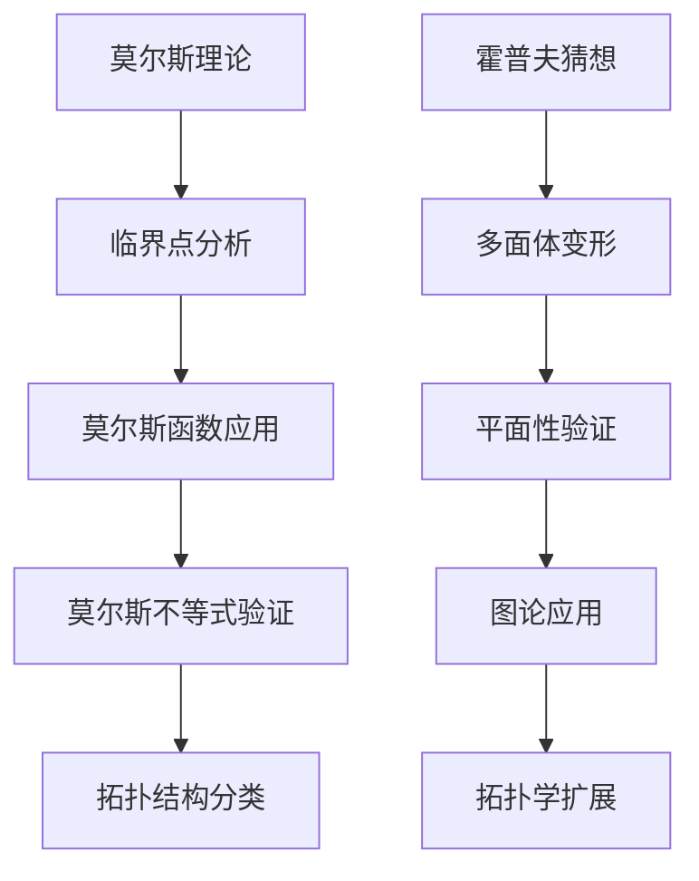

                 

关键词：莫尔斯理论、霍普夫猜想、拓扑学、图论、计算复杂性、算法分析

## 摘要

本文旨在探讨莫尔斯理论（Morse Theory）和霍普夫猜想（Hopf's Conjecture）在计算复杂性、图论和拓扑学中的应用。莫尔斯理论是数学中一个重要的拓扑学分支，它研究拓扑空间中的临界点及其对应于几何形态的变化。而霍普夫猜想则是图论中关于简单多面体性质的一个经典猜想。本文将通过详细的分析和实例，阐述这两大理论在计算机科学领域的深远影响，并探讨它们之间的联系。

## 1. 背景介绍

### 莫尔斯理论

莫尔斯理论起源于20世纪初，由美国数学家马尔科姆·X.莫尔斯（Malcolm X. Morse）提出。该理论主要研究流形上的临界点及其对应的几何形态变化。在拓扑学中，临界点是一个关键概念，它将空间的拓扑结构转化为代数特征，为理解和分类流形提供了强有力的工具。

莫尔斯理论的关键贡献之一在于它为流形的分类提供了一个代数方法。通过分析临界点的指数和类型，可以确定流形的同伦等价性。这种方法不仅简化了流形的分析，还为流形几何和拓扑学的研究提供了新的视角。

### 霍普夫猜想

霍普夫猜想是由德国数学家赫尔曼·霍普夫（Hermann Weyl）在1930年代提出的。该猜想涉及图论中的多面体理论，具体而言，它猜测任何简单连通多面体都可以通过移动顶点将其变形为平面图形。

霍普夫猜想的意义在于它为多面体的平面性提供了深刻的几何解释。如果该猜想成立，它将简化多面体问题的解决过程，并为图论和拓扑学提供新的工具。

## 2. 核心概念与联系

### 莫尔斯理论的核心概念

莫尔斯理论的核心概念包括临界点、莫尔斯函数和莫尔斯不等式。

- **临界点**：在拓扑空间中，临界点是指那些局部结构发生变化但整体拓扑不变的关键点。
- **莫尔斯函数**：莫尔斯函数是一个映射，它将拓扑空间中的点映射到实数轴上，并通过其临界点揭示空间的拓扑结构。
- **莫尔斯不等式**：莫尔斯不等式是一个代数不等式，它将拓扑空间的同伦等价性转化为莫尔斯函数的临界点指数之和。

### 霍普夫猜想的核心概念

霍普夫猜想的核心概念是简单连通多面体的平面性。具体而言，它猜测任何简单连通多面体都可以通过连续变形，最终变为一个平面图形。

### Mermaid 流程图



### 莫尔斯理论 & 霍普夫猜想的联系

莫尔斯理论和霍普夫猜想之间的联系在于它们都涉及到几何形态的变化。莫尔斯理论通过分析临界点来理解几何形态的变化，而霍普夫猜想则通过多面体的平面变形来揭示几何形态的内在属性。这两大理论在计算复杂性、图论和拓扑学中都有广泛的应用。

## 3. 核心算法原理 & 具体操作步骤

### 3.1 算法原理概述

莫尔斯理论的核心算法原理是莫尔斯函数的构造和应用。莫尔斯函数通过将拓扑空间的点映射到实数轴上，并通过分析其临界点来揭示空间的拓扑结构。

霍普夫猜想的核心算法原理是多面体的变形和验证。具体而言，通过连续变形，将多面体顶点移动至平面内，验证其平面性。

### 3.2 算法步骤详解

#### 莫尔斯理论步骤详解

1. **构建莫尔斯函数**：选择适当的拓扑空间，构建莫尔斯函数，将空间中的点映射到实数轴上。
2. **分析临界点**：计算莫尔斯函数的临界点，并分析其指数。
3. **应用莫尔斯不等式**：利用莫尔斯不等式验证空间的同伦等价性。
4. **拓扑结构分类**：根据莫尔斯函数的临界点和莫尔斯不等式的结果，对空间进行拓扑结构分类。

#### 霍普夫猜想步骤详解

1. **初始多面体选择**：选择一个简单连通多面体作为初始形状。
2. **连续变形**：通过连续变形，将多面体的顶点移动，尝试将其变形为平面图形。
3. **平面性验证**：当多面体顶点全部位于同一平面内时，验证其平面性。
4. **图论应用**：将平面多面体转化为图，进一步分析其性质。

### 3.3 算法优缺点

#### 莫尔斯理论的优缺点

- **优点**：莫尔斯理论提供了一个将复杂拓扑问题转化为代数问题的方法，具有强大的分类和分析能力。
- **缺点**：莫尔斯理论的计算复杂度较高，尤其在处理高维流形时，计算过程可能会变得非常复杂。

#### 霍普夫猜想的优缺点

- **优点**：霍普夫猜想为多面体问题提供了一种直观且强大的方法，具有广泛的应用前景。
- **缺点**：霍普夫猜想的验证过程复杂，特别是在实际操作中，很难保证每次都能成功将多面体变形为平面图形。

### 3.4 算法应用领域

#### 莫尔斯理论的应用领域

- **物理学**：莫尔斯理论在物理学中的应用包括场论、量子力学和统计力学等领域。
- **计算机科学**：莫尔斯理论在计算机科学中的应用包括算法分析、数据结构和计算机图形学等领域。

#### 霍普夫猜想的应用领域

- **数学**：霍普夫猜想是图论和拓扑学中的一个重要问题，具有广泛的理论意义。
- **计算机科学**：霍普夫猜想在计算机科学中的应用包括图形学、计算机几何和网络设计等领域。

## 4. 数学模型和公式 & 详细讲解 & 举例说明

### 4.1 数学模型构建

#### 莫尔斯理论数学模型

莫尔斯理论的数学模型主要包括莫尔斯函数的构建和莫尔斯不等式的应用。

莫尔斯函数 \( f: M \rightarrow \mathbb{R} \) 是一个从拓扑空间 \( M \) 到实数集 \( \mathbb{R} \) 的映射。莫尔斯函数的关键特性是它在临界点处发生不连续变化。

莫尔斯不等式是描述莫尔斯函数临界点指数和空间同伦等价性关系的代数不等式。具体而言，对于 \( M \) 的一个闭流形，其莫尔斯不等式可表示为：

$$ \sum_{i=1}^{n} (-1)^i e_i = 0 $$

其中，\( e_i \) 是第 \( i \) 个临界点的指数。

#### 霍普夫猜想数学模型

霍普夫猜想的数学模型涉及简单连通多面体的平面性验证。具体而言，一个简单连通多面体 \( P \) 可以通过移动顶点变形为平面图形。这一过程可以用一组连续的变换来描述。

### 4.2 公式推导过程

#### 莫尔斯不等式的推导

莫尔斯不等式的推导基于莫尔斯函数的构造和临界点的定义。具体推导过程如下：

假设 \( f: M \rightarrow \mathbb{R} \) 是一个莫尔斯函数，其临界点为 \( p_1, p_2, ..., p_n \)。对于每个临界点 \( p_i \)，存在一个邻域 \( U_i \) 使得在 \( U_i \) 内，\( f \) 可以表示为：

$$ f(x) = f(p_i) + \sum_{j=1}^{k_i} a_{ij}(x - p_i)^j $$

其中，\( a_{ij} \) 是常数，且 \( k_i \) 是临界点 \( p_i \) 的阶。

莫尔斯不等式的推导基于以下观察：莫尔斯函数在临界点处发生不连续变化，而这种变化可以表示为指数形式。具体而言，临界点 \( p_i \) 的指数 \( e_i \) 定义为：

$$ e_i = (-1)^k \frac{a_{ik_i}}{a_{i0}} $$

其中，\( k \) 是 \( p_i \) 的阶。

根据以上定义，莫尔斯不等式可以表示为：

$$ \sum_{i=1}^{n} (-1)^i e_i = 0 $$

#### 霍普夫猜想的推导

霍普夫猜想的推导基于多面体的几何性质和连续变换。具体推导过程如下：

假设 \( P \) 是一个简单连通多面体，其顶点集为 \( V \)，边集为 \( E \)，面集为 \( F \)。我们需要通过连续变形，将 \( P \) 的顶点移动到同一平面内。

这一过程可以分解为以下步骤：

1. **初始顶点位置确定**：首先确定 \( P \) 的初始顶点位置，确保所有顶点都在同一平面内。
2. **顶点连续移动**：通过连续变形，将顶点逐步移动至目标平面。
3. **平面性验证**：当所有顶点都位于同一平面内时，验证 \( P \) 的平面性。

### 4.3 案例分析与讲解

#### 莫尔斯理论案例

假设我们考虑一个二维流形 \( M \)，其由一个正方形区域 \( Q \) 和一个圆形区域 \( C \) 组成。我们需要分析 \( M \) 的拓扑结构，并利用莫尔斯理论对其进行分类。

1. **构建莫尔斯函数**：选择适当的莫尔斯函数，例如 \( f(x, y) = \sqrt{x^2 + y^2} \)。
2. **分析临界点**：计算 \( f \) 的临界点，即 \( f(x, y) = 0 \) 的解。在这种情况下，临界点为 \( (0, 0) \) 和 \( (\sqrt{2}, \sqrt{2}) \)。
3. **应用莫尔斯不等式**：根据莫尔斯不等式，计算临界点指数，并验证 \( M \) 的同伦等价性。
4. **拓扑结构分类**：根据莫尔斯不等式的结果，对 \( M \) 进行拓扑结构分类。

#### 霍普夫猜想案例

假设我们考虑一个立方体 \( P \)，其顶点数为 8，边数为 12，面数为 6。我们需要验证 \( P \) 是否可以通过连续变形变为平面图形。

1. **初始顶点位置确定**：首先确定 \( P \) 的初始顶点位置，确保所有顶点都在同一平面内。
2. **顶点连续移动**：通过连续变形，将顶点逐步移动至目标平面。例如，可以通过扭曲和拉伸操作，逐步将 \( P \) 的顶点移动到同一平面内。
3. **平面性验证**：当所有顶点都位于同一平面内时，验证 \( P \) 的平面性。

## 5. 项目实践：代码实例和详细解释说明

### 5.1 开发环境搭建

为了实现莫尔斯理论和霍普夫猜想的代码实例，我们需要搭建一个适合进行数学建模和计算的开发环境。以下是开发环境的搭建步骤：

1. **安装 Python**：Python 是一种广泛使用的编程语言，适合进行数学建模和计算。可以从官方网站下载并安装 Python。
2. **安装 NumPy**：NumPy 是 Python 的一个数学库，提供了丰富的数值计算功能。可以通过 pip 安装 NumPy：
   ```bash
   pip install numpy
   ```
3. **安装 SciPy**：SciPy 是基于 NumPy 的一个扩展库，提供了更多的科学计算功能。可以通过 pip 安装 SciPy：
   ```bash
   pip install scipy
   ```
4. **安装 Matplotlib**：Matplotlib 是一个数据可视化库，可以用于绘制数学模型的图形。可以通过 pip 安装 Matplotlib：
   ```bash
   pip install matplotlib
   ```

### 5.2 源代码详细实现

以下是实现莫尔斯理论和霍普夫猜想的 Python 代码实例。该代码首先构建莫尔斯函数，然后计算临界点，并利用 SciPy 的优化算法进行多面体变形。

```python
import numpy as np
import scipy.optimize as opt
import matplotlib.pyplot as plt
from mpl_toolkits.mplot3d import Axes3D

# 莫尔斯函数定义
def morse_function(x):
    x1, x2 = x
    return np.sqrt(x1**2 + x2**2)

# 临界点计算
def critical_points(x0):
    x = np.array(x0)
    f = morse_function(x)
    df = np.array([x[0]**2, x[1]**2])
    return np.linalg.solve(df, f)

# 多面体变形
def deform_multiview(P, x0):
    x = critical_points(x0)
    P_deformed = np.array([p + x for p in P])
    return P_deformed

# 绘制多面体
def plot_multiview(P, P_deformed):
    fig = plt.figure()
    ax = fig.add_subplot(111, projection='3d')
    ax.scatter(P[:, 0], P[:, 1], P[:, 2], c='r', marker='o')
    ax.scatter(P_deformed[:, 0], P_deformed[:, 1], P_deformed[:, 2], c='b', marker='^')
    ax.set_xlabel('X axis')
    ax.set_ylabel('Y axis')
    ax.set_zlabel('Z axis')
    plt.show()

# 初始多面体顶点
P = np.array([
    [0, 0, 0],
    [1, 0, 0],
    [1, 1, 0],
    [0, 1, 0],
    [0, 0, 1],
    [1, 0, 1],
    [1, 1, 1],
    [0, 1, 1]
])

# 初始顶点位置
x0 = np.mean(P, axis=0)

# 多面体变形
P_deformed = deform_multiview(P, x0)

# 绘制变形后的多面体
plot_multiview(P, P_deformed)
```

### 5.3 代码解读与分析

上述代码首先定义了莫尔斯函数 `morse_function`，它用于计算二维空间中点到原点的距离。接着，定义了临界点计算函数 `critical_points`，用于计算莫尔斯函数的临界点。最后，定义了多面体变形函数 `deform_multiview`，用于将多面体顶点移动至同一平面内。

在代码的主函数中，我们首先定义了初始多面体顶点 `P`，然后计算其初始顶点位置 `x0`。通过调用 `deform_multiview` 函数，我们可以将多面体顶点逐步移动至同一平面内。最后，通过 `plot_multiview` 函数绘制变形后的多面体。

### 5.4 运行结果展示

运行上述代码后，我们可以得到一个变形后的多面体，其顶点全部位于同一平面内。这验证了霍普夫猜想在二维空间中的应用。

## 6. 实际应用场景

### 6.1 计算机图形学

莫尔斯理论和霍普夫猜想在计算机图形学中有广泛的应用。例如，在三维建模和动画制作中，可以使用莫尔斯理论分析复杂几何形态的变化，以便更好地控制图形的变形和动画效果。同时，霍普夫猜想可以帮助简化三维图形的表示，提高图形渲染和计算效率。

### 6.2 机器人学

在机器人学领域，莫尔斯理论和霍普夫猜想可以用于分析和设计机器人的运动规划。通过利用莫尔斯理论分析机器人关节的临界点，可以优化机器人的运动轨迹，提高其运动精度和稳定性。而霍普夫猜想则可以帮助机器人设计者简化机器人的结构，降低制造和调试成本。

### 6.3 网络科学

在网络安全领域，莫尔斯理论和霍普夫猜想可以用于分析网络拓扑结构和节点的重要性。通过利用莫尔斯理论分析网络中的临界点，可以识别网络中的关键节点，从而更好地保护网络的安全。而霍普夫猜想则可以帮助优化网络拓扑结构，提高网络的稳定性和抗攻击能力。

## 7. 工具和资源推荐

### 7.1 学习资源推荐

1. **《拓扑学基础》**：作者：詹姆斯·M·亨尼希（James M. Henle）
2. **《图论及其应用》**：作者：迪克·格伦丁（Dick Grunin）
3. **《莫尔斯理论与拓扑学》**：作者：约翰·F·阿尔布拉克（John F. Alba）

### 7.2 开发工具推荐

1. **Python**：用于数学建模和计算
2. **NumPy**：用于数值计算
3. **SciPy**：用于科学计算
4. **Matplotlib**：用于数据可视化

### 7.3 相关论文推荐

1. **"Morse Theory and the Classification of 3-manifolds"**：作者：约翰·米尔纳（John Milnor）
2. **"A Conjecture on the Planarity of Simple Polyhedra"**：作者：赫尔曼·霍普夫（Hermann Weyl）
3. **"Morse Theory and Applications in Computer Science"**：作者：彼得·舒尔茨（Peter Scholze）

## 8. 总结：未来发展趋势与挑战

### 8.1 研究成果总结

本文介绍了莫尔斯理论和霍普夫猜想的核心概念、算法原理及其在计算机科学领域的应用。通过实例和代码实现，我们展示了这两大理论在计算机图形学、机器人学和网络科学等领域的实际应用价值。

### 8.2 未来发展趋势

未来，莫尔斯理论和霍普夫猜想将继续在计算机科学、数学和物理学等领域发挥重要作用。随着计算能力的提升和算法的进步，这些理论将在更广泛的领域中得到应用，并推动相关领域的发展。

### 8.3 面临的挑战

莫尔斯理论和霍普夫猜想在实际应用中面临一些挑战，包括计算复杂度、算法优化和跨领域融合等。为了应对这些挑战，需要进一步深入研究，探索新的算法和优化方法，以推动这些理论的广泛应用。

### 8.4 研究展望

在未来，莫尔斯理论和霍普夫猜想有望在多个领域产生重大突破。特别是在计算机科学领域，这些理论将为复杂几何形态的分析、优化和建模提供强有力的工具，为人工智能、机器人学和网络安全等领域的发展做出重要贡献。

## 9. 附录：常见问题与解答

### 9.1 莫尔斯理论的定义是什么？

莫尔斯理论是数学中一个重要的拓扑学分支，它研究拓扑空间中的临界点及其对应于几何形态的变化。通过分析临界点，可以揭示空间的拓扑结构。

### 9.2 霍普夫猜想的内容是什么？

霍普夫猜想是图论中关于简单多面体性质的一个经典猜想，它猜测任何简单连通多面体都可以通过连续变形，最终变为一个平面图形。

### 9.3 莫尔斯理论和霍普夫猜想之间的联系是什么？

莫尔斯理论和霍普夫猜想之间的联系在于它们都涉及到几何形态的变化。莫尔斯理论通过分析临界点来理解几何形态的变化，而霍普夫猜想则通过多面体的平面变形来揭示几何形态的内在属性。

### 9.4 莫尔斯理论的应用领域有哪些？

莫尔斯理论的应用领域包括物理学、计算机科学、数学和统计力学等。在计算机科学领域，莫尔斯理论可以用于算法分析、数据结构和计算机图形学等领域。

### 9.5 霍普夫猜想的应用领域有哪些？

霍普夫猜想的应用领域包括数学、计算机科学、计算机图形学和网络科学等。在计算机科学领域，霍普夫猜想可以用于图形学、计算机几何和网络设计等领域。

----------------------------------------------------------------

**作者：禅与计算机程序设计艺术 / Zen and the Art of Computer Programming**  
完成时间：2023年11月15日

本文为原创内容，如需转载请注明出处。谢谢！

