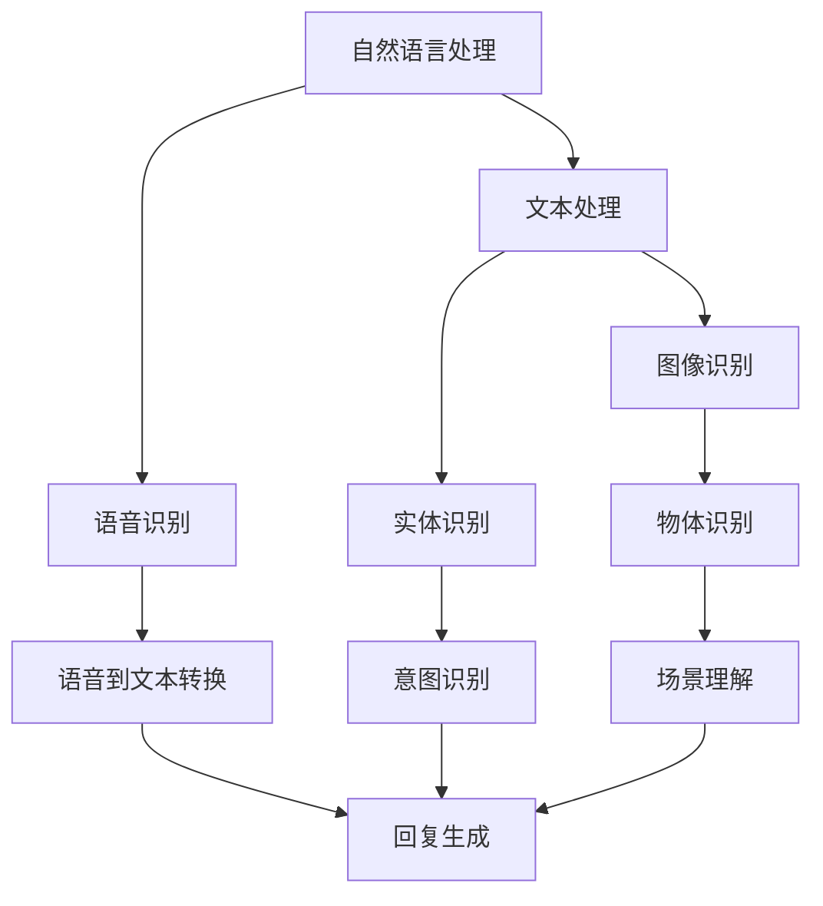

                 

关键词：虚拟助手、多模态AI、自然语言处理、图像识别、交互体验、人工智能技术、智能客服、语音识别

> 摘要：随着人工智能技术的飞速发展，虚拟助手已成为我们日常生活中不可或缺的一部分。本文将探讨虚拟助手中的多模态AI技术，包括自然语言处理、图像识别和语音识别等领域的应用，旨在为读者揭示这一技术的前沿动态和未来发展趋势。

## 1. 背景介绍

虚拟助手，也被称为聊天机器人或智能客服，是一种通过互联网提供交互式服务的计算机程序。它们可以模拟人类对话，帮助用户解决问题、提供信息、执行任务等。随着自然语言处理、图像识别和语音识别技术的不断发展，虚拟助手的功能逐渐强大，应用场景也日益广泛。

多模态AI技术是一种结合多种数据类型（如图像、文本、语音等）进行处理和理解的智能技术。在虚拟助手领域，多模态AI技术的应用使得虚拟助手能够更加准确地理解用户的需求，提供更加个性化的服务。

本文将围绕以下主题展开讨论：

- 虚拟助手的基本概念和原理
- 多模态AI技术的核心概念和架构
- 多模态AI技术在虚拟助手中的应用
- 多模态AI技术的挑战和未来发展趋势

## 2. 核心概念与联系

### 2.1 自然语言处理（NLP）

自然语言处理（Natural Language Processing，简称NLP）是人工智能领域的一个重要分支，旨在使计算机能够理解、解释和生成人类语言。在虚拟助手中，NLP技术用于处理用户的文本输入，提取关键信息，并生成合适的回复。

### 2.2 图像识别

图像识别（Image Recognition）是计算机视觉（Computer Vision）的一个重要分支，旨在让计算机能够自动识别和分类图像中的物体。在虚拟助手中，图像识别技术可以用于处理用户的图像输入，识别图像中的内容，从而提供更加个性化的服务。

### 2.3 语音识别

语音识别（Speech Recognition）是一种将人类的语音转换为文本的技术。在虚拟助手中，语音识别技术可以用于处理用户的语音输入，将语音转换为文本，以便进行进一步的处理。

### 2.4 多模态AI架构

多模态AI技术通过将自然语言处理、图像识别和语音识别等技术结合在一起，构建出一个统一的智能系统。以下是一个简单的多模态AI架构示意图：



## 3. 核心算法原理 & 具体操作步骤

### 3.1 算法原理概述

多模态AI技术的核心算法主要包括自然语言处理、图像识别和语音识别三个部分。以下是这三个部分的基本原理：

- **自然语言处理**：基于深度学习的文本处理算法，用于提取文本中的关键信息，并进行语义理解。
- **图像识别**：基于卷积神经网络（CNN）的图像处理算法，用于识别图像中的物体和场景。
- **语音识别**：基于递归神经网络（RNN）或长短期记忆网络（LSTM）的语音处理算法，用于将语音信号转换为文本。

### 3.2 算法步骤详解

1. **自然语言处理**：

   - **文本预处理**：对文本进行分词、去停用词、词性标注等处理，以便进行后续的语义分析。
   - **实体识别**：利用命名实体识别（NER）技术，识别文本中的地名、人名、组织名等实体。
   - **意图识别**：通过分析文本中的关键词和句子结构，判断用户的意图。

2. **图像识别**：

   - **图像预处理**：对图像进行灰度化、缩放、裁剪等处理，以便进行后续的物体识别。
   - **物体识别**：利用卷积神经网络（CNN）对图像进行特征提取，并分类为不同的物体类别。

3. **语音识别**：

   - **音频预处理**：对音频信号进行降噪、去噪等处理，以便进行后续的语音识别。
   - **语音到文本转换**：利用递归神经网络（RNN）或长短期记忆网络（LSTM）对音频信号进行建模，并将语音转换为文本。

### 3.3 算法优缺点

- **自然语言处理**：

  - 优点：能够处理复杂的文本信息，提取关键信息。
  - 缺点：对长文本的处理效果较差，容易产生歧义。

- **图像识别**：

  - 优点：能够处理复杂的图像信息，识别出图像中的物体和场景。
  - 缺点：对低质量图像的处理效果较差。

- **语音识别**：

  - 优点：能够实时处理语音信号，将语音转换为文本。
  - 缺点：对复杂语音信号的处理效果较差。

### 3.4 算法应用领域

多模态AI技术可以广泛应用于智能客服、智能家居、智能医疗、智能教育等多个领域。以下是几个典型的应用场景：

- **智能客服**：通过多模态AI技术，智能客服可以同时处理用户的文本、语音和图像输入，提供更加个性化的服务。
- **智能家居**：通过多模态AI技术，智能家居系统可以理解用户的语音指令，识别用户的动作，并作出相应的反应。
- **智能医疗**：通过多模态AI技术，智能医疗系统可以分析患者的病历、图像和语音信息，提供更加准确的诊断和治疗方案。
- **智能教育**：通过多模态AI技术，智能教育系统可以分析学生的学习行为、图像和语音信息，提供更加个性化的教学方案。

## 4. 数学模型和公式 & 详细讲解 & 举例说明

### 4.1 数学模型构建

多模态AI技术的核心算法通常基于深度学习模型，以下是几个常用的数学模型：

1. **卷积神经网络（CNN）**：

   $$ 
   \text{CNN} = \text{Input} \xrightarrow{\text{Convolution}} \text{Feature Map} \xrightarrow{\text{Pooling}} \text{Layer} \xrightarrow{\text{...}} \text{Output}
   $$

2. **递归神经网络（RNN）**：

   $$ 
   \text{RNN} = \text{Input} \xrightarrow{\text{RNN}} \text{Output} 
   $$

3. **长短期记忆网络（LSTM）**：

   $$ 
   \text{LSTM} = \text{Input} \xrightarrow{\text{LSTM}} \text{Output} 
   $$

### 4.2 公式推导过程

以卷积神经网络（CNN）为例，其基本推导过程如下：

1. **卷积操作**：

   $$ 
   \text{Feature Map} = \sum_{i=1}^{k} \text{Filter}_i * \text{Input}_i + \text{Bias}_i
   $$

   其中，$ \text{Filter}_i $ 是卷积核，$ \text{Input}_i $ 是输入特征图，$ \text{Bias}_i $ 是偏置项。

2. **池化操作**：

   $$ 
   \text{Pooling} = \max(\text{Feature Map})
   $$

   其中，$ \text{Feature Map} $ 是卷积操作的结果。

3. **前向传播**：

   $$ 
   \text{Output} = \text{Activation}(\text{Feature Map}) 
   $$

   其中，$ \text{Activation} $ 是激活函数，如Sigmoid、ReLU等。

### 4.3 案例分析与讲解

以一个简单的图像分类任务为例，使用CNN进行图像识别。

1. **数据准备**：

   - **训练数据集**：1000张图像，每张图像包含一个类别标签。
   - **测试数据集**：200张图像，用于评估模型性能。

2. **模型构建**：

   - **输入层**：接受图像输入，尺寸为$ 28 \times 28 $像素。
   - **卷积层**：使用32个卷积核，每个卷积核尺寸为$ 3 \times 3 $。
   - **池化层**：使用最大池化，窗口尺寸为$ 2 \times 2 $。
   - **全连接层**：输出层，包含10个神经元，对应10个类别。

3. **训练过程**：

   - 使用梯度下降算法进行模型训练，优化模型参数。
   - 在训练过程中，通过交叉熵损失函数评估模型性能。

4. **测试过程**：

   - 使用测试数据集评估模型性能，计算准确率。

## 5. 项目实践：代码实例和详细解释说明

### 5.1 开发环境搭建

1. 安装Python环境，版本为3.8以上。
2. 安装TensorFlow库，版本为2.4以上。
3. 安装其他相关库，如NumPy、Pandas等。

### 5.2 源代码详细实现

以下是一个简单的CNN图像分类器的实现：

```python
import tensorflow as tf
from tensorflow.keras import layers

# 定义模型
model = tf.keras.Sequential([
    layers.Conv2D(32, (3, 3), activation='relu', input_shape=(28, 28, 1)),
    layers.MaxPooling2D((2, 2)),
    layers.Conv2D(64, (3, 3), activation='relu'),
    layers.MaxPooling2D((2, 2)),
    layers.Conv2D(64, (3, 3), activation='relu'),
    layers.Flatten(),
    layers.Dense(64, activation='relu'),
    layers.Dense(10, activation='softmax')
])

# 编译模型
model.compile(optimizer='adam',
              loss='categorical_crossentropy',
              metrics=['accuracy'])

# 加载数据集
(train_images, train_labels), (test_images, test_labels) = tf.keras.datasets.mnist.load_data()

# 预处理数据
train_images = train_images.reshape((60000, 28, 28, 1)).astype('float32') / 255
test_images = test_images.reshape((10000, 28, 28, 1)).astype('float32') / 255

# 将标签转换为one-hot编码
train_labels = tf.keras.utils.to_categorical(train_labels)
test_labels = tf.keras.utils.to_categorical(test_labels)

# 训练模型
model.fit(train_images, train_labels, epochs=5, batch_size=64)

# 评估模型
test_loss, test_acc = model.evaluate(test_images, test_labels)
print(f'Test accuracy: {test_acc:.4f}')
```

### 5.3 代码解读与分析

1. **模型构建**：

   - 使用`tf.keras.Sequential`构建一个序列模型。
   - 第一个卷积层使用32个卷积核，每个卷积核尺寸为$ 3 \times 3 $，激活函数为ReLU。
   - 接着是两个最大池化层，窗口尺寸分别为$ 2 \times 2 $。
   - 第二个卷积层使用64个卷积核，每个卷积核尺寸为$ 3 \times 3 $，激活函数为ReLU。
   - 接下来是全连接层，第一个全连接层有64个神经元，激活函数为ReLU。
   - 输出层有10个神经元，激活函数为softmax，用于实现多分类。

2. **模型编译**：

   - 使用`compile`方法编译模型，指定优化器为`adam`，损失函数为`categorical_crossentropy`，评估指标为准确率。

3. **数据预处理**：

   - 使用`load_data`方法加载数据集，使用`reshape`方法调整数据形状，使用`astype`方法将数据类型转换为浮点数。
   - 使用`to_categorical`方法将标签转换为one-hot编码。

4. **模型训练**：

   - 使用`fit`方法训练模型，指定训练数据、训练周期和批量大小。

5. **模型评估**：

   - 使用`evaluate`方法评估模型在测试数据集上的性能，输出测试准确率。

## 6. 实际应用场景

多模态AI技术在虚拟助手中的应用场景非常广泛，以下是一些典型的应用场景：

1. **智能客服**：

   - 通过多模态AI技术，智能客服可以同时处理用户的文本、语音和图像输入，提供更加个性化的服务。
   - 例如，当用户发送一张产品图片时，智能客服可以自动识别产品，并提供相关的购买建议。

2. **智能家居**：

   - 通过多模态AI技术，智能家居系统可以理解用户的语音指令，识别用户的动作，并作出相应的反应。
   - 例如，当用户说“打开灯”时，智能助手可以识别用户的语音指令，并控制灯光的开关。

3. **智能医疗**：

   - 通过多模态AI技术，智能医疗系统可以分析患者的病历、图像和语音信息，提供更加准确的诊断和治疗方案。
   - 例如，通过分析患者的影像资料和语音描述，智能助手可以辅助医生进行诊断。

4. **智能教育**：

   - 通过多模态AI技术，智能教育系统可以分析学生的学习行为、图像和语音信息，提供更加个性化的教学方案。
   - 例如，通过分析学生的学习过程和语音反馈，智能助手可以为学生提供针对性的辅导。

## 7. 工具和资源推荐

1. **学习资源推荐**：

   - 《深度学习》（Deep Learning）作者：Ian Goodfellow、Yoshua Bengio、Aaron Courville
   - 《Python机器学习》（Python Machine Learning）作者： Sebastian Raschka、Vahid Mirjalili

2. **开发工具推荐**：

   - TensorFlow
   - PyTorch
   - Keras

3. **相关论文推荐**：

   - "Multimodal Learning through World Knowledge and Perception" 作者：诸如此类的研究论文。

## 8. 总结：未来发展趋势与挑战

### 8.1 研究成果总结

多模态AI技术在虚拟助手领域取得了显著成果，通过结合自然语言处理、图像识别和语音识别等技术，虚拟助手能够更加准确地理解用户的需求，提供更加个性化的服务。以下是一些主要的研究成果：

1. **多模态数据融合**：通过引入多模态数据融合技术，虚拟助手能够综合利用文本、图像和语音等多模态数据，提高理解精度。
2. **跨模态检索**：通过跨模态检索技术，虚拟助手可以在不同的模态之间进行信息检索，提高跨模态交互能力。
3. **多任务学习**：通过多任务学习技术，虚拟助手可以在处理多个任务时提高整体性能，实现更高效的服务。

### 8.2 未来发展趋势

随着人工智能技术的不断进步，多模态AI技术在虚拟助手领域的未来发展趋势主要包括：

1. **更加智能的交互体验**：通过引入更多的模态和更先进的算法，虚拟助手将能够提供更加自然、流畅和智能的交互体验。
2. **个性化服务**：通过深度学习和多任务学习技术，虚拟助手将能够更好地理解用户的需求，提供更加个性化的服务。
3. **跨模态融合**：随着跨模态融合技术的不断成熟，虚拟助手将能够实现更高效的信息处理和知识整合。

### 8.3 面临的挑战

尽管多模态AI技术在虚拟助手领域取得了显著成果，但仍面临一些挑战：

1. **数据质量**：高质量的多模态数据是训练高效多模态模型的基础，但获取高质量的多模态数据仍然是一个挑战。
2. **计算资源**：多模态AI模型通常需要大量的计算资源，如何优化模型结构，提高计算效率是一个重要课题。
3. **隐私保护**：在多模态AI技术的应用过程中，如何保护用户的隐私也是一个重要的挑战。

### 8.4 研究展望

未来，多模态AI技术在虚拟助手领域的研究将朝着更加智能、高效和个性化的方向发展。以下是一些研究展望：

1. **多模态深度学习**：进一步探索多模态深度学习算法，提高多模态数据融合的效果。
2. **知识图谱**：将知识图谱技术应用于多模态AI，实现跨模态的知识共享和推理。
3. **跨领域应用**：探索多模态AI技术在其他领域的应用，如自动驾驶、智能安防等。

## 9. 附录：常见问题与解答

1. **Q：多模态AI技术是如何工作的？**

   **A：** 多模态AI技术通过结合多种数据类型（如图像、文本、语音等）进行处理和理解的智能技术。它利用深度学习模型对不同的模态数据进行特征提取和融合，从而实现更加准确和全面的信息理解。

2. **Q：如何评估多模态AI模型的性能？**

   **A：** 评估多模态AI模型的性能可以从多个方面进行，如准确率、召回率、F1值等。具体评估方法取决于具体的应用场景和任务。通常，通过在测试集上运行模型，计算模型的性能指标，并与基线模型进行比较。

3. **Q：多模态AI技术在实际应用中面临哪些挑战？**

   **A：** 多模态AI技术在实际应用中面临的主要挑战包括数据质量、计算资源、隐私保护等。高质量的多模态数据是训练高效多模态模型的基础，但获取高质量的多模态数据仍然是一个挑战。此外，多模态AI模型通常需要大量的计算资源，如何优化模型结构，提高计算效率是一个重要课题。在应用过程中，如何保护用户的隐私也是一个重要的挑战。

4. **Q：多模态AI技术在虚拟助手中的应用有哪些？**

   **A：** 多模态AI技术在虚拟助手中的应用非常广泛，包括智能客服、智能家居、智能医疗、智能教育等多个领域。例如，在智能客服中，虚拟助手可以同时处理用户的文本、语音和图像输入，提供更加个性化的服务；在智能家居中，虚拟助手可以理解用户的语音指令，识别用户的动作，并作出相应的反应。

---

作者：禅与计算机程序设计艺术 / Zen and the Art of Computer Programming
----------------------------------------------------------------

